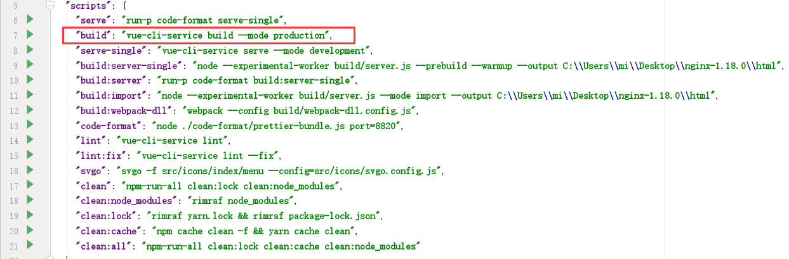

# Part1 工作台

### 1.1 添加工作台菜单

+ 配置工作台顶部按钮图标

  + 先找到workBench.js文件，里面就是工作台的所有配置

  + tabIcons 中配置的就是按钮的图标还有唯一标识

    ```javascript
    equipMeteringRecord:'inspection_request',//计量记录，暂时使用请验管理的图标
    equipMeteringRecordBl:'inspection_request'//玻璃记录，暂时使用请验管理的图标
    ```

+ 配置主要区域的每列显示的数据样式

  + templates中通过设置titleTemplate和descTemplate加后缀的方式来设置显示的样式

    ```javascript
    //_equipMeteringRecord  计量记录
    titleTemplate_equipMeteringRecord :'@meteringRecordName@ / @createdept@',
    descTemplate_equipMeteringRecord : '发起人： @meteringPerson@ | 年度： @year@ | 状态： @taskName@',
    ```

    + @@中间为对应的变量名

+ 配置每条数据的操作按钮

  + mixinButtons中可以配置可用的按钮以及按钮的方法

    ```javascript
    // 计量记录
    {
        name: '处理',
        eventName: 'equipMeteringRecordHandle', // 对应按钮的调用方法
        flagProp: 'listTypeCode',
        truthValue: '_equipMeteringRecord',  // 作用于哪些 templates
        typeCodes: 'equipMeteringRecord', // 对应哪个tab
        btnType: 'btnType', // 按钮类型
    }
    ```

    + name：按钮名称
    + eventName：按钮的调用方法
    + flagProp：固定为listTypeCode
    + truthValue：对应titleTemplate后面的后缀，包括下划线

+ 配置查询的条件框

  + 在condations中配置查询条件

    ```javascript
    //计量记录
    equipMeteringRecord:[
        {
            field: 'equipMeteringRecordTaskNameEqual', // 绑定字段
            tagType: 'select', // 查询条件标签类型
            label: '状态', // 标签内容
            options: []   // 字典中获取
        },
        {
            field: 'equipMeteringRecordyearEqual', // 绑定字段
            tagType: 'input', // 查询条件标签类型
            label: '年度', // 标签内容
        },
        {
            field: "equipMeteringRecordmeteringRecordNumFullLike", // 绑定字段
            tagType: "input", // 查询条件标签类型
            label: "计划编号" // 标签内容
        },
        {
            field: "equipMeteringRecordmeteringRecordNameFullLike", // 绑定字段
            tagType: "input", // 查询条件标签类型
            label: "计划名称" // 标签内容
        },
        {
            field: 'equipMeteringRecordTodoUser', // 查询字段
            tagType: '', // 查询条件标签类型
            label: '用户id', // 标签内容 用户id
            defaultVal: this.$store.getters.userId, // 查询条件赋值
        }
    ],
    ```

+ 配置初始化加载方法

  + 在getHandle中可以配置点击标签后的初始化方法

    ```javascript
    switch (e.tabTypeCode) {
        case "equipMeteringRecord": //获取计量记录
            this.$set(e, 'getData', equipMeteringRecord['equipMeteringRecordWorkBench']);
            index = this.condations.equipMeteringRecord.findIndex(e => e.field === "equipMeteringRecordTaskNameEqual"); //
            this.getDictByType( "meteringRecordStatus" , this.condations.equipMeteringRecord[index] , false); // 设置状态下拉数据，失败不提示
            break;
    }
    ```

    + equipMeteringRecord['equipMeteringRecordWorkBench']为查询列表的方法
    + index是用来定位要加载下拉框的查询框的标识
    + getDictByType是用来获取字典值，将其赋值给查询下拉框的

+ 配置按钮显示逻辑，配置前面的标签

  + 在disposeResult中

    ```javascript
    switch (this.activeName) {
        case "equipMeteringRecord": // 计量记录
            res.data.forEach(e => {
                e.listNo = e.meteringRecordNum; // 计量记录编号
                e.taskRecordNum = e.meteringRecordNum;
                e.tabTypeCode = "equipMeteringRecord";
                e.listTypeCode = "_equipMeteringRecord";
                e.listTypeName = "计量记录"; // 左侧标签
                e.listCodeColor = "darkBlue"; // 标签颜色
                e.btnType = "0"; // 默认显示处理
                e.createDate = e.createDate ? this.$moment(e.createDate).format('YYYY-MM-DD') : ''; // 日期
            });
            break;
    }
    ```

+ 配置后台查询红点信息数量

  + getTabNumber方法中

    ```javascript
    //计量记录
    JSONObject equipMeteringRecordObject = new JSONObject();
    List<TabResultModel> equipMeteringRecordList = limsWorkbenchService.getMeteringRecordList(null);
    equipMeteringRecordObject.put("tabTypeName", StorageWorkBenchConstants.TABTYPENAME_EQUIPMETERINGRECORD);
    equipMeteringRecordObject.put("tabTypeCode", StorageWorkBenchConstants.TABTYPECODE_EQUIPMETERINGRECORD);
    equipMeteringRecordObject.put("toDoNumber", equipMeteringRecordList.size());
    
    jsonArray.add(equipMeteringRecordObject);
    String defaultOrder = "all,jlfh,fhck,symb,syd,xtyzj,wdjl,equipMeteringPlan,equipUseMaintain,wbjh,wbjl,equipChange,equipRepairBill,equipMaintainBill,sypz,equipMeteringRecord,equipMeteringRecordBl";
    ```

+ 配置后台系统

  + 权限管理=》资源管理=》工作台组件管理=》工作台菜单
  + 新增资源，并设置路径权限标识，角色开放给对应功能页面的相同权限即可


# Part2 数据表格

## 2.1 跨页选择

+ 第一步，在el-table大标签中设置属性row-key

  ```vue
  :row-key="getRowKey"
  ```

+ 第二步，在el-table-colomn标签中添加属性reverse-selection

  ```vue
  :reserve-selection="true"
  ```

+ 第三步，在methods中添加getRowKey方法

  ```javascript
  getRowKey(row){
      return row.id;
  },
  ```

+ 第四步，在tableload中去除清空checkData的代码

+ reserve-selection属性需要搭配row-key属性一起使用，row-key主要作用是给每一行设置一个唯一标识，这样才能记住选择行


## 2.2 日期范围查询框赋值

+ 日期范围查询框需要经过前台的处理后才能传给后台，因为其值在前台属于date类型数据，后台如果接收的是String的类型的话，就会产生乱码，日期错误。

+ 前台处理方法

  ```javascript
  let startTime = '';
  let endTime = '';
  if (self.jxd_428Data != '' && self.jxd_428Data != null) {
      let oneTime = new Date(self.jxd_428Data[0]);
      let twoTime = new Date(self.jxd_428Data[1]);
      oneTime.setHours('00', '00', '00');
      twoTime.setHours('23', '59', '59');
      startTime = this.$moment(oneTime).format("YYYY-MM-DD HH:mm:ss").toString();
      endTime = this.$moment(twoTime).format("YYYY-MM-DD HH:mm:ss").toString();
  }
  
  //处理后传给查询的数组
  registerDateBegin:self.jxd_428Data !== null ? startTime : null,
  registerDateEnd:self.jxd_428Data !== null ? endTime : null,
  ```


## 2.3 导出表格信息

+ 选中数据就导出选中的信息，未选中就导出当前所有信息

+ 第一步，引入工具类

  ```javascript
  import {tableOutputMethod} from "@/pages/index/utils/table_data_input_output_methods";
  ```

+ 第二步，编写导出方法

  ```javascript
  async jxd_960Click() {                                 //async代表异步
      const self = this;
      const fileName = "玻璃计划.xlsx";                   //导出的文件名
      const fieldData = [{                               //导出的文件的数据对应规则
          field: "taskName",                             //field为对应的变量名
          fieldName: "审批状态",                           //fieldName为Excel文件对应的列
          dataType: "string"                             
      }, {                                                //每一个{}代表一列信息
          field: "planCode",
          fieldName: "计量计划编号",
          dataType: "string"
      }, {
          field: "planName",
          fieldName: "计量计划名称",
          dataType: "string"
      }, {
          field: "year",
          fieldName: "年度",
          dataType: "string"
      }, {
          field: "equipNum",
          fieldName: "计划设备数",
          dataType: "string"
      }, {
          field: "versionNum",
          fieldName: "版本号",
          dataType: "string"
      }, {
          field: "creator",
          fieldName: "创建人",
          dataType: "string"
      }, {
          field: "createDate",
          fieldName: "创建日期",
          dataType: "string"
      }];
      //查看有无选中的记录
      let list0 = self.jxd_82TableDataChecked;
      let list = [];
      list0.forEach(item=>{                                          //处理数据
          item.createDate = item.createDate.substring(0,10);     
          list.push(item)
      })
      if (list && list.length > 0) {
          //导出选中数据
          tableOutputMethod(list, fieldData, fileName, 30);          //使用引入的方法
      } else {
          //导出所有数据
          const cloneListQuery = {                                   //定义页数参数
              current: 1,
              size: -1                                               //size为-1可以查询所有数据
          }
          let startTime = '';                                        //处理查询数据
          let endTime = '';
          if (self.jxd_15Data != '' && self.jxd_15Data != null) {
              let oneTime = new Date(self.jxd_15Data[0]);
              let twoTime = new Date(self.jxd_15Data[1]);
              oneTime.setHours('00', '00', '00');
              twoTime.setHours('23', '59', '59');
              startTime = this.$moment(oneTime).format("YYYY-MM-DD HH:mm:ss").toString();
              endTime = this.$moment(twoTime).format("YYYY-MM-DD HH:mm:ss").toString();
          }
          let equipMeteringPlanObj = {
              ...self.jxd_82ListQuery,
              equipMeteringPlantaskNameEqual: self.jxd_8Data,
              equipMeteringPlanyearEqual: self.jxd_10Data,
              equipMeteringPlanplanNameFullLike: self.jxd_12Data,
              equipMeteringPlancreateDatemoreAndThan: self.jxd_15Data !== null ? startTime : null,
              equipMeteringPlancreateDatelessAndThan: self.jxd_15Data !== null ? endTime : null,
              equipMeteringPlanplanCodeFullLike: self.jxd_61Data,
              equipMeteringPlanversionFlagNotEqual: '1',
          };
          
          //重新查询所有数据，包括后面页数里的数据
  equipMeteringPlan['hussarQueryequipMeteringPlanCondition_1equipMeteringPlanSort_1Page'](equipMeteringPlanObj).then(res => {
              if (res.code === "0") {
                  let convert = [];
                  (res.data).forEach((item) => {
                      convert.push({
                          procinstId: item.procinstId,
                          creator: item.creator,
                          year: item.year,
                          versionNum: item.versionNum,
                          creatorId: item.creatorId,
                          versionFlag: item.versionFlag,
                          planName: item.planName,
                          planCode: item.planCode,
                          versionCode: item.versionCode,
                          equipNum: item.equipNum,
                          sheetid: item.sheetid,
                          taskName: item.taskName,
                          taskId: item.taskId,
                          seq: item.seq,
                          createDate: item.createDate.substring(0,10)
                      })
                  });
                  tableOutputMethod(convert, fieldData, fileName, 30);
              } else {
                  self.$message.error('表格数据请求失败');
              }
          }).catch(function() {
              self.$message.error('表格数据请求异常');
          });
      }
  },
  ```

+ 导出方法 tableOutputMethod 代码

  ```javascript
  /**
   * 表格数据导出方法
   * @param list array对象数组 要导出的数据
   * @param fieldData array对象数组 列信息
   * @param fileName string 导出文件名
   * @param colWidth number 列宽度
   */
  function tableOutputMethod(list, fieldData, fileName, colWidth) {
      let columns = [];
      for (let i = 0; i < fieldData.length; i++) {
          let excelCol = {};
          excelCol.key = fieldData[i].field;
          excelCol.width = colWidth;
          columns.push(excelCol);
      }
      const Excel = require("exceljs");
      let workbook = new Excel.Workbook();
      let worksheet = workbook.addWorksheet("sheet1");
      workbook.created = new Date();
      workbook.modified = new Date();
      worksheet.columns = columns;
  
      //数据填充
      worksheet.insertRows(1, list);
      let colArray = [];
      let tableHead = [];
      let level = 1;
      let maxLevel = 1;
      fieldData.forEach((item, index) => {
          tableHead.push({
              "title": item.fieldName,
              "horizontal": 'center',
              "colspan": 1,
              "rowspan": 1,
              "level": level
          });
          const i = index;
          let letter = excelExportForArea(i);
          colArray.push({
              "letter": letter,
              "horizontal": 'center',
              "dataType": item.dataType,
              "length": 0
          });
      });
      for (let i = 0; i < tableHead.length; i++) {
          if (tableHead[i].level > maxLevel) {
              maxLevel = tableHead[i].level;
          }
      }
      for (let i = 0; i < tableHead.length; i++) {
          if (tableHead[i].rowspan + tableHead[i].level - 1 > maxLevel) {
              tableHead[i].rowspan = maxLevel - tableHead[i].level + 1;
          }
      }
      let excelCell = [];
      let rows = [];
      for (let i = 0; i < fieldData.length; i++) {
          for (let j = 0; j < maxLevel; j++) {
              let cell = {
                  "xAxis": i,
                  "yAxis": j,
                  isEdit: false
              };
              excelCell.push(cell);
          }
      }
      for (let i = 0; i < maxLevel; i++) {
          let x = 0;
          let row = [];
          for (let j = 0; j < tableHead.length; j++) {
              let index = excelCell.findIndex(function(value, index, arr) {
                  return value.isEdit == false && value.yAxis == i;
              });
              if (index != -1) {
                  x = excelCell.find(function(value, index, arr) {
                      return value.isEdit == false && value.yAxis == i;
                  }).xAxis;
              }
              if (tableHead[j].level - 1 == i) {
                  let startArea = excelExportForArea(x) + (1 + i);
                  let endArea = excelExportForArea(x + tableHead[j].colspan - 1) + (tableHead[j].rowspan + i);
                  for (let k = x; k < x + tableHead[j].colspan; k++) {
                      for (let m = i; m < tableHead[j].rowspan + i; m++) {
                          excelCell.find(function(value, index, arr) {
                              return value.xAxis == k && value.yAxis == m;
                          }).isEdit = true;
                      }
                  }
                  while (row.length < x) {
                      row.push("");
                  }
                  row[x] = tableHead[j].title;
                  tableHead[j].merge = startArea + ":" + endArea;
              }
          }
          rows.push(row);
      }
      worksheet.insertRows(1, rows);
      for (let j = 0; j < tableHead.length; j++) {
          worksheet.mergeCells(tableHead[j].merge);
          worksheet.getCell(tableHead[j].merge.split(":")[0]).alignment = {
              vertical: 'middle',
              horizontal: tableHead[j].horizontal,
          };
          worksheet.getCell(tableHead[j].merge.split(":")[0]).font = {
              bold: 'true'
          };
      }
      for (let i = 0; i < colArray.length; i++) {
          for (let j = maxLevel + 1; j < 1000; j++) {
              worksheet.getCell(colArray[i].letter + j).alignment = {
                  horizontal: colArray[i].horizontal
              };
              if (colArray[i].dataType == "date") {
                  let cell = worksheet.getCell(colArray[i].letter + j);
                  if (cell.value) {
                      const formatStr = fieldData[i].dateFormat ? fieldData[i].dateFormat : "YYYY-MM-DD";
                      cell.value = $moment(cell.value).format(formatStr);
                  } else {
                      cell.value = '';
                  }
              }
          }
      }
      //表格导出
      workbook.xlsx.writeBuffer().then(function(buffer) {
          saveAs(new Blob([buffer], {
              type: 'application/octet-stream'
          }), fileName);
      });
  }
  ```


## 2.4 有多选框的表格增加点击行选中

+ 在\<h-table-1>标签中添加属性ref，row-click

+ 代码

  ```vue
  ref="table_44TableRef" @row-click="table_44ColClick"
  
  table_44ColClick(row) {
      const self = this;
      self.$refs.table_44TableRef.$refs.hTable.toggleRowSelection(row);
  },
  ```

  


# Part3 可编辑表格 vxe-table

## 3.1 控制可编辑表格中某一列是否可以编辑

+ 可以用edit-render中的enabled属性控制该列是否可编辑

+ 代码

  ```vue
  <vxe-table-column :edit-render="{
                                  immediate: true,
                                  name: '$input',
                                  props:{type:'date'},
                                  events: {
                                  change:selectChange
                                  },
                                  
  <!--editEnable为自己定义的变量，控制该变量是否为true即可控制可否编辑-->
                                  enabled:editEnable,
                                  }" :min-width="120" align="center"
                    field="deliveryDate" header-align="center" title="送检日期">
      <template v-slot="{ row }">
  {{ (row.deliveryDate) ? $moment(row.deliveryDate).format('YYYY-MM-DD') : '--' }}
      </template>
  </vxe-table-column>
  ```


## 3.2 可编辑表格表单验证

+ 在表格标签vxe-table中设置一个参数edit-rules即可

+ 设置参数代码

  ```vue
  <vxe-table ref="jxd_57TableRef" :edit-rules="editEnable? jxd_57EditRules:''" :border="jxd_57BorderStyle"
  ```

+ 编写验证规则

  ```javascript
  jxd_57EditRules: {
          deliveryDate: [{
            required: true,
            message: '请填写送检日期'
          }],
          testUnit: [{
            required: true,
            message: '请填写计量单位'
          }],
  }
  ```

  + 每条规则的名称为该列的变量名，也可能是和field的值对应，目前不确定


# Part4 可编辑表格 h-edit-table

## 4.1 控制可编辑图标

+ 在table-show-fields属性的赋值中进行定义

+ 代码

  ```javascript
  editTable_112tableShowFields: [
      { isParent: false, bodyAlign: 'center', dataType: 'string', rowSummary: false, colWidth: { number: '300', isMinWidth: false, selfCustom: true }, isMinWidth: false, isShowConfig: false, label: '内部编号', sort: true, align: 'center', title: '内部编号', prop: 'innerNum', width: '300', colEditComponent: 'empty', id: 'bc5432a1-f405-4c3c-858d-7efe2c16d741', selectFormat: { color: '#2695f9', showButtonColor: false, showOptions: false, showNumberFmt: false, dialogSelectDom: '', showDateFmt: false, showDialogSelectDom: false, numberFmtSelect: '', dateFmtSelect: '', cols: [], showTableDateFmt: false } },
      { isParent: false, bodyAlign: 'left', dataType: 'string', rowSummary: false, colWidth: { number: '0', isMinWidth: false, selfCustom: false }, isMinWidth: false, isShowConfig: false, label: '备注', sort: false, align: 'center', title: '备注', prop: 'notes', colEditComponent: 'input', id: '94c43285-72d5-48e0-b4d4-a36eb8f23cf3' }
  ]
  ```

  + 将colEditComponent改为empty即可

+ 方法二

  + 将isShowConfig由false改为true


# Part5 前台流程相关

## 5.1 前台传参

+ 在前台，超连接查看详情和审核按钮（跳转页面）都需要配置页面参数要传什么
+ 流程一共有三个方面
  + 流程
    + 就是指流程本身，即一个由节点和箭头组成的抽象对象
    + 字段
      + 包括流程标识，用来识别流程本身
  + 实例
    + 就是指开启流程的具体记录
    + 字段
      + 包括流程名称，节点名称，运行状态，持续时间等
  + 任务
    + 就是指流程实例需要进行的下一个任务
    + 字段
      + 包括流程名称，节点名称，任务接收人，状态等
+ 页面参数（详情页）
  + businessId
    + 业务主键，用于查询表单时的默认查询条件
  + taskId
    + 任务ID，用于查询当前任务（，可以是空，不能是undefined？）
  + processDefinitionKey
    + 流程标识，用于唯一标识流程
  + taskDefinitionKey
    + 任务节点标识，即定义的节点对应的标识（，可以是空，不能是undefined？）
  + doneListIdentification
    + 待办和已办状态
    + 1代表已办，2代表待办，权限分别对应流程中定义的权限


# Part6 前台函数

## 6.1 自执行函数（立即调用函数表达式IIFE）

+ 使用自执行函数或立即调用函数表达式 (mmediately lnvoked Funcion Expression，IFE)。这些方法允许我们在定义函数后立即调用它，而无需为函数分配名称。

+ 代码

  ```javascript
  (function() {
    // 在这里编写代码块
  })();
  ```


## 6.2 时间选择框结束时间格式化

+ 时间选择框的结束时间选择日期后其时间是0点而不是当天最后一秒，所以会查不到该天的数据，所以需要对其进行格式化操作

  ```javascript
  let endDate = '';
  if (self.input_147EndDate !== '' && self.input_147EndDate !== null) {
      let oneTime = new Date(self.select_40EndDate);
      oneTime.setHours('23', '59', '59');
      endDate = this.$moment(oneTime).format("YYYY-MM-DD HH:mm:ss").toString();
  }
  ```

  

  

# Part7 公共组件

## 7.1 文件放置位置

+ 首页及其他页面需要，可以放在src-components下
+ 只需要引用到其他页面的，可以放在src-pages-index-components下


## 7.2  


# Part8 日历 fullcalendar

## 8.1 项目引入包

+ npm install @fullcalendar/core
+ npm install @fullcalendar/vue
+ npm install @fullcalendar/daygrid
+ npm install @fullcalendar/interaction
+ npm install @fullcalendar/timegrid
+ npm install @fullcalendar/list


## 8-2 页面引入组件 

+ ```javascript
  import "@/styles/calendar.scss";   //日历样式
  import "@fullcalendar/core"; // solves problem with Vite
  import FullCalendar from "@fullcalendar/vue"; // FullCalendar 的 vue 组件
  import dayGridPlugin from "@fullcalendar/daygrid"; // 月视图插件
  import interactionPlugin, { Draggable } from "@fullcalendar/interaction"; // 接口插件
  import timeGridPlugin from "@fullcalendar/timegrid"; // 周视图和日视图插件
  import listPlugin from "@fullcalendar/list"; // 日程视图插件
  import moment from "moment";   //时间处理组件
  ```

+ ```javascript
  components: {
    FullCalendar, // make the <FullCalendar> tag available
  },
  ```


## 8-3 页面构建日历组件

+ 引入组件后，在页面中使用该组件，同时需要在日历中使用插槽来自定义事件

  ```vue
  <FullCalendar ref="fullCalendar" :options="calendarOptions">
      <template v-slot:eventContent="arg" >
  <div style="width: 200px;overflow: hidden;margin-left: 10px">
      <p>
          <span class="revealLable">事件:</span>
          <span :title="arg.event.extendedProps.eventName">{{ arg.event.extendedProps.eventName }}</span>
          </p>
      <p v-if="arg.event.extendedProps.eventType !== 3 || arg.event.extendedProps.eventType !== 3">
          <span class="revealLable">任务编号:</span>
          <span :title="arg.event.extendedProps.taskNumber">{{ arg.event.extendedProps.taskNumber }}</span>
          </p>
      <p v-if="arg.event.extendedProps.eventType !== 3 || arg.event.extendedProps.eventType !== 3">
          <span class="revealLable">任务名称:</span>
          <span :title="arg.event.extendedProps.taskName">{{ arg.event.extendedProps.taskName }}</span>
          </p>
      <p v-if="arg.event.extendedProps.eventType == 3 || arg.event.extendedProps.eventType == 3">
          <span class="revealLable">备注:</span>
          <span :title="arg.event.extendedProps.notes">{{ arg.event.extendedProps.notes }}</span>
          </p>
      <p v-if="arg.event.extendedProps.eventType !== 3 || arg.event.extendedProps.eventType !== 3">
          <span class="revealLable">参与人:</span>
          <span :title="arg.event.extendedProps.relatedPersonNames">{{ arg.event.extendedProps.relatedPersonNames }}</span>
          </p>
      <el-popover
                  placement="right-start"
                  width="80"
                  :visible-arrow="false"
                  trigger="click"
                  >
          <el-button
                     type="text"
                     class="taskPopButton"
                     @click.stop="getRedact(arg)"
                     v-if="arg.event.extendedProps.editableeee"
                     >编辑</el-button>
          <el-button
                     type="text"
                     class="taskPopButton"
                     @click="getDelete(arg.event.id)"
                     v-if="arg.event.extendedProps.editableeee"
                     >删除</el-button>
          <el-button
                     type="text"
                     class="taskPopButton"
                     @click="getView(arg)"
                     v-if="!arg.event.extendedProps.editableeee"
                     >详情</el-button>
          <el-button
                     slot="reference"
                     type="text"
                     class="calendarButton"
                     >···</el-button>
          </el-popover>
          </div>
      </template>
  </FullCalendar>
  ```

  


# Part9 高级配置式表格vxe-grid


# Part10 前台配置

## 10-1 前台打包

+ 前台打包时打包的配置文件是 .env.production

  

+ 所以如果要修改 .env.development 时，如在集成ELN时，打包需要将 development 的修改也同步到 production 中


# Part11穿梭框 el-transfer 

## 11-1 绑定参数

+ v-model：选中的数据（右表数据）
+ filterable：是否可以筛选
+ props：数据源的字段别名，给key，label等属性起别名
+ left-default-checked：左表默认选中的数据
+ right-default-checked：游标默认选中的数据
+ titles：左右表的表名（是个数组） ="[leftTitle,rightTitle]"
+ button-texts：左右移动的按键名
+ format：右上角显示的  选中/总数
+ change：左右表有数据变更
+ data：所有数据，包括选中的数据


## 11-2 插槽

+ 左右两个表下面可以添加按钮

  ```vue
  <el-button class="transfer-footer" slot="left-footer" size="small">操作</el-button>
  <el-button class="transfer-footer" slot="right-footer" size="small">操作</el-button>
  ```

  

## 11-3 样式控制

+ 穿梭框有些样式需要单独拿出来进行控制

  ```css
  <!--穿梭框样式-->
  <style>
  //穿梭框两边的框
  .el-transfer-panel{
      width: 36%;
      height: 100%;
  }
  .transfer-footer {
      margin-left: 20px;
      padding: 6px 5px;
  }
  
  .el-button--primary {
      color: #FFFFFF;
      background-color: #3ba2ba;
      border-color: #3ba2ba;
  }
  
  .el-button--primary.is-disabled, .el-button--primary.is-disabled:hover, .el-button--primary.is-disabled:focus, .el-button--primary.is-disabled:active {
      color: #FFFFFF;
      background-color: #a9a9a9;
      border-color: #a9a9a9;
  }
  //穿梭框左右穿梭按钮的整体样式
  .el-transfer__buttons {
      padding: 0 10px;
      width: 28%;
  }
  //左右穿梭按钮
  .el-transfer__buttons .el-button {
      padding: 10px 6px;
      width: 45%;
  }
  //整个穿梭框的样式
  .transfer-container{
      width: 100%;
      height: 100%;
      display: flex;
  }
  </style>
  ```


# Part12 前台样式调整

## 12-1 表格样式

### 12-1-1 表格拖拽调整列宽

#### el-table

+ 设置可以拖拽调整列宽时，尽量设置带有表头竖边框

+ 设置表头竖边框

  ```vue
  <el-table v-loading="table_148TableLoading" border :height="'calc(100% - 53px)'" @selection-change="table_148SelectRow" ref="table_148TableRef" :cell-style="table_148CellStyle" :disabled="table_148Disabled" :data="table_148Data">
  <el-table-column class-name="head-borderY" type="selection" :width="50" align="center"></el-table-column>
      
      
  <!--
  给表格加 border
  给列加 class-name="head-borderY"
  -->
  ```

  

+ 设置竖边框样式颜色

  ```css
  .lcdp_axe.YltzMaterialManageMaterialManage .table_148 >>> tbody td.is-right .cell:not(el-checkbox) {
    text-align: right;
  }
  
  替换为
  
  .lcdp_axe.YltzMaterialManageMaterialManage .table_148 /deep/ .el-table .has-gutter th.head-borderY:not(:nth-last-of-type(1)),
  .lcdp_axe.YltzMaterialManageMaterialManage .table_148 /deep/ .el-table__fixed-header-wrapper th.head-borderY:not(:nth-last-of-type(1)) {
    border-right: 3px solid rgba(226, 242, 255, 0.4) !important;
  }
  ```


#### h-edit-table

+ 设置可拖动列宽时，只需要在其添加 resizable 属性即可实现可拖动，而且会在列之间添加间隔线

  ```vue
  <h-edit-table :data="editTable_39Data" 
                resizable
                :active-method="editTable_39ActiveRowMethod" :props="editTable_39PropsData" :cell-style="editTable_39CellStyle" :render-options="editTable_39RenderOptions" :innerStyles="editTable_39InnerStylesData" :table-loading="editTable_39TableLoading" :table-show-fields="editTable_39tableShowFields" theme-name="default" :edit-rules="editTable_39EditRules" :edit-disabled="editTable_39Disabled" @radio-change="editTable_39SelectRow" @checkbox-change="editTable_39SelectRow" @checkbox-all="editTable_39SelectAll" :disabled="editTable_39Disabled" ref="editTable_39TableRef" v-show="!editTable_39Hidden" class="editTable_39 jxd_ins_hEditTable lay-editTable default"></h-edit-table>
  
  ```

  