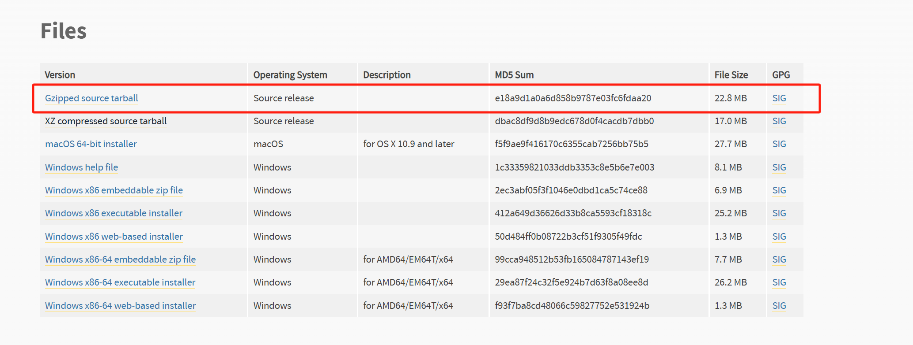

# 虚拟机

## 一、安装虚拟机

+ 安装VMWare
+ 下载镜像
+ 安装虚拟机CentOs7，并配置镜像


## 二、初始化虚拟机环境

### 1、查询虚拟机ip，用ssh连接虚拟机

+ ```shell
  ip addr
  ```


### 2、配置yum源

+ 修改yum配置文件

  ```shell
  vim /etc/yum.repos.d/CentOS-Base.repo
  ```

+ 删除原来的内容，更换为以下阿里云镜像源

  ```shell
  [base]
  name=CentOS-$releasever - Base
  baseurl=http://mirrors.aliyun.com/centos/$releasever/os/$basearch/
  gpgcheck=1
  gpgkey=file:///etc/pki/rpm-gpg/RPM-GPG-KEY-CentOS-7
  
  [updates]
  name=CentOS-$releasever - Updates
  baseurl=http://mirrors.aliyun.com/centos/$releasever/updates/$basearch/
  gpgcheck=1
  gpgkey=file:///etc/pki/rpm-gpg/RPM-GPG-KEY-CentOS-7
  
  [extras]
  name=CentOS-$releasever - Extras
  baseurl=http://mirrors.aliyun.com/centos/$releasever/extras/$basearch/
  gpgcheck=1
  gpgkey=file:///etc/pki/rpm-gpg/RPM-GPG-KEY-CentOS-7
  
  ```

+ 清理Yum缓存后再尝试更新

  ```shell
  yum clean all
  yum makecache
  ```

+ 更新系统

  ```shell
  yum update -y
  ```


### 3、安装常用的工具

+ wget：用于从网络下载文件
+ net-tools：提供网络配置工具，如ifconfig


### 4、配置网络设置

+ 安装好虚拟机后，还需要手动进行网络配置，否则可能会造成各种问题（比如使用docker时，pull不下来项目等）
+ 


### 5、安装配置Python

+ CentOs中本来就有python2.7.5，和yum可能是关联的，如果卸载了可能会损坏yum，所以我们可以再安装一个python3版本

+ 查看当前python版本

  ```shell
  python -V
  ```

+ 创建存放python安装包的文件夹

  ```shell
  mkdir /home/python3  # 创建文件夹
  cd /home/python3 # 进入创建的文件夹中
  ```

+ 安装python所需依赖

  ```shell
  yum update -y
  yum install zlib-devel bzip2-devel openssl-devel sqlite-devel readline-devel tk-devel libffi-devel gcc make
  ```

  + 这些包都是开发环境中常用的库和工具，通常用于编译和构建软件，尤其是在编译Python或其他需要C语言编译的程序时常见。以下是每个包的解释：

    1. **zlib-devel**：zlib库的开发包，提供对压缩和解压缩功能的支持，许多软件依赖于它来处理压缩文件格式。

    2. **bzip2-devel**：bzip2库的开发包，用于支持处理.bz2压缩文件格式。

    3. **openssl-devel**：OpenSSL库的开发包，提供加密、解密、SSL/TLS协议支持，是安全通信的核心组件。

    4. **sqlite-devel**：SQLite库的开发包，提供对SQLite数据库的支持，常用于嵌入式数据库应用。

    5. **readline-devel**：readline库的开发包，用于提供命令行编辑功能，常见于终端应用和交互式Shell。

    6. **tk-devel**：Tk库的开发包，提供图形用户界面（GUI）支持，通常与Tcl语言配合使用。

    7. **libffi-devel**：libffi库的开发包，支持调用外部函数接口，常用于在运行时调用非本地函数。

    8. **gcc**：GNU编译器集合，是一个C和C++编译器，用于编译和生成可执行程序。

    9. **make**：GNU Make工具，用于自动化构建过程，读取Makefile并执行编译、链接等操作。

    这些包通常在搭建开发环境时非常重要，尤其是在需要编译源码或安装依赖时。

+ 下载python3.8.0安装包

  + 通过wget命令在线下载

    ```shell 
    wget https://www.python.org/ftp/python/3.8.0/Python-3.8.0.tgz
    ```

  + 网站下载

    ```
    https://www.python.org/downloads/release/python-380/
    ```

    

+ 解压安装包

  ```shell
   tar zxf Python-3.8.0.tgz 
  ```

+ 配置、编译、安装

  ```shell
  cd Python-3.8.0   # 进去解压后的目录
  ./configure --prefix=/usr/local/python3  # 配置（并指定安装位置） 
  #  不要加--enable-optimizations参数，否则可能报错
  make clean  # 清空缓存
  make && make install  # 编译并安装（时间较久请耐心等待……）
  ```

+ 将新的python3，pip3设置为默认

  ```shell
  rm -rf /usr/bin/python3 #删除原来的python3
  ln -s /usr/local/bin/python3/bin/python3 /usr/bin/python3 #建立新的链接
  rm -rf /usr/bin/pip3
  ln -s /usr/local/python3/bin/pip3 /usr/bin/pip3
  ```

+ 查看版本校验

  ```shell
  python3 --version
  pip3 --version
  ```

