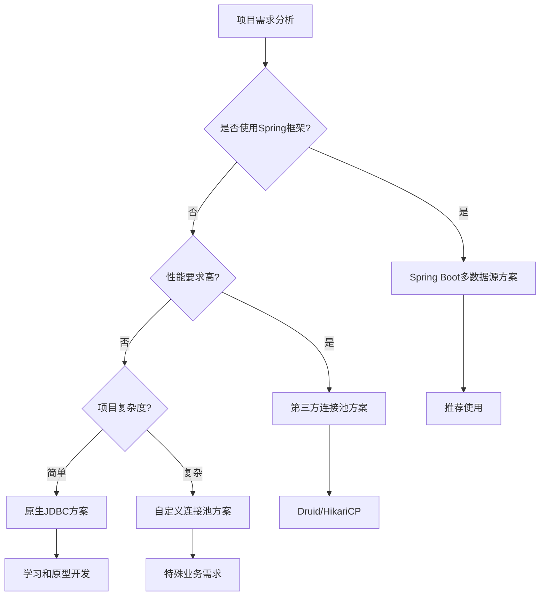

# 一、引言

## （一）业务场景分析

在现代企业级应用开发中，单一数据库往往无法满足复杂的业务需求。常见的多数据库应用场景包括：

- **数据迁移**：从旧系统向新系统迁移数据时，需要同时连接源数据库和目标数据库
- **数据同步**：不同业务系统间的数据实时同步，如订单系统与库存系统
- **读写分离**：主库负责写操作，从库负责读操作，提升系统性能
- **分库分表**：按业务模块或数据量将数据分散到不同数据库中
- **跨系统集成**：整合多个独立系统的数据，如CRM系统与财务系统的数据整合

## （二）技术挑战

实现多数据库连接与操作面临以下主要挑战：

1. **连接管理复杂性**：需要管理多个数据库连接的生命周期
2. **事务一致性**：确保跨数据库操作的ACID特性
3. **性能优化**：合理使用连接池，避免连接资源浪费
4. **异常处理**：处理不同数据库的连接失败和操作异常
5. **配置管理**：灵活配置多个数据源的连接参数


**本文目标**：通过详细的代码示例和最佳实践，帮助开发者掌握在一个方法中同时连接和操作两个数据库的技术方案。


# 二、技术方案概览

## （一）实现方案对比

| 方案类型 | 适用场景 | 优点 | 缺点 | 复杂度 |
|---------|---------|------|------|--------|
| **原生JDBC** | 简单项目、学习目的 | 轻量级、完全控制 | 代码冗余、手动管理连接 | 低 |
| **自定义连接池** | 特殊需求、性能要求高 | 灵活定制、性能优化 | 开发成本高、维护复杂 | 中 |
| **Spring Boot多数据源** | 企业级应用 | 配置简单、事务支持 | 框架依赖、学习成本 | 中 |
| **第三方连接池** | 生产环境 | 成熟稳定、功能丰富 | 外部依赖、配置复杂 | 高 |

## （二）技术选型建议



# 三、原生JDBC实现方案

## （一）基础连接管理

### 1. 数据库连接工具类

```java
package com.example.database.util;

import java.sql.Connection;
import java.sql.DriverManager;
import java.sql.SQLException;
import java.util.Properties;

/**
 * 数据库连接工具类
 * 提供多数据库连接的基础功能
 * 
 * @author 笔者
 * @version 1.0
 */
public class DatabaseConnectionUtil {
    
    // 数据库连接配置常量
    private static final String MYSQL_DRIVER = "com.mysql.cj.jdbc.Driver";
    private static final String POSTGRESQL_DRIVER = "org.postgresql.Driver";
    
    // 连接超时配置（毫秒）
    private static final int CONNECTION_TIMEOUT = 30000;
    private static final int SOCKET_TIMEOUT = 60000;
    
    /**
     * 创建MySQL数据库连接
     * 
     * @param host 数据库主机地址
     * @param port 数据库端口
     * @param database 数据库名称
     * @param username 用户名
     * @param password 密码
     * @return Connection 数据库连接对象
     * @throws SQLException 连接异常
     */
    public static Connection createMySQLConnection(String host, int port, 
            String database, String username, String password) throws SQLException {
        try {
            // 加载MySQL驱动
            Class.forName(MYSQL_DRIVER);
            
            // 构建连接URL
            String url = String.format("jdbc:mysql://%s:%d/%s", host, port, database);
            
            // 设置连接属性
            Properties props = new Properties();
            props.setProperty("user", username);
            props.setProperty("password", password);
            props.setProperty("useUnicode", "true");
            props.setProperty("characterEncoding", "UTF-8");
            props.setProperty("useSSL", "false");
            props.setProperty("allowPublicKeyRetrieval", "true");
            props.setProperty("serverTimezone", "Asia/Shanghai");
            props.setProperty("connectTimeout", String.valueOf(CONNECTION_TIMEOUT));
            props.setProperty("socketTimeout", String.valueOf(SOCKET_TIMEOUT));
            
            return DriverManager.getConnection(url, props);
            
        } catch (ClassNotFoundException e) {
            throw new SQLException("MySQL驱动加载失败", e);
        }
    }
    
    /**
     * 创建PostgreSQL数据库连接
     * 
     * @param host 数据库主机地址
     * @param port 数据库端口
     * @param database 数据库名称
     * @param username 用户名
     * @param password 密码
     * @return Connection 数据库连接对象
     * @throws SQLException 连接异常
     */
    public static Connection createPostgreSQLConnection(String host, int port, 
            String database, String username, String password) throws SQLException {
        try {
            // 加载PostgreSQL驱动
            Class.forName(POSTGRESQL_DRIVER);
            
            // 构建连接URL
            String url = String.format("jdbc:postgresql://%s:%d/%s", host, port, database);
            
            // 设置连接属性
            Properties props = new Properties();
            props.setProperty("user", username);
            props.setProperty("password", password);
            props.setProperty("connectTimeout", String.valueOf(CONNECTION_TIMEOUT / 1000));
            props.setProperty("socketTimeout", String.valueOf(SOCKET_TIMEOUT / 1000));
            props.setProperty("tcpKeepAlive", "true");
            
            return DriverManager.getConnection(url, props);
            
        } catch (ClassNotFoundException e) {
            throw new SQLException("PostgreSQL驱动加载失败", e);
        }
    }
    
    /**
     * 安全关闭数据库连接
     * 
     * @param connection 要关闭的连接
     */
    public static void closeConnection(Connection connection) {
        if (connection != null) {
            try {
                if (!connection.isClosed()) {
                    connection.close();
                }
            } catch (SQLException e) {
                System.err.println("关闭数据库连接时发生异常: " + e.getMessage());
            }
        }
    }
    
    /**
     * 检查连接是否有效
     * 
     * @param connection 要检查的连接
     * @return boolean 连接是否有效
     */
    public static boolean isConnectionValid(Connection connection) {
        try {
            return connection != null && !connection.isClosed() && connection.isValid(5);
        } catch (SQLException e) {
            return false;
        }
    }
}
```

### 2. 数据库配置类

```java
package com.example.database.config;

/**
 * 数据库配置信息类
 * 封装数据库连接所需的配置参数
 */
public class DatabaseConfig {
    
    private String host;
    private int port;
    private String database;
    private String username;
    private String password;
    private String driverType; // mysql, postgresql等
    
    // 构造函数
    public DatabaseConfig(String host, int port, String database, 
                         String username, String password, String driverType) {
        this.host = host;
        this.port = port;
        this.database = database;
        this.username = username;
        this.password = password;
        this.driverType = driverType;
    }
    
    // 静态工厂方法：创建MySQL配置
    public static DatabaseConfig createMySQLConfig(String host, int port, 
            String database, String username, String password) {
        return new DatabaseConfig(host, port, database, username, password, "mysql");
    }
    
    // 静态工厂方法：创建PostgreSQL配置
    public static DatabaseConfig createPostgreSQLConfig(String host, int port, 
            String database, String username, String password) {
        return new DatabaseConfig(host, port, database, username, password, "postgresql");
    }
    
    // Getter方法
    public String getHost() { return host; }
    public int getPort() { return port; }
    public String getDatabase() { return database; }
    public String getUsername() { return username; }
    public String getPassword() { return password; }
    public String getDriverType() { return driverType; }
    
    @Override
    public String toString() {
        return String.format("DatabaseConfig{host='%s', port=%d, database='%s', " +
                           "username='%s', driverType='%s'}", 
                           host, port, database, username, driverType);
    }
}
```

## （二）多数据库操作实现

### 1. 用户数据传输对象

```java
package com.example.database.entity;

import java.time.LocalDateTime;

/**
 * 用户实体类
 * 用于在不同数据库间传输用户数据
 */
public class User {
    
    private Long id;
    private String username;
    private String email;
    private String phone;
    private LocalDateTime createTime;
    private LocalDateTime updateTime;
    
    // 无参构造函数
    public User() {}
    
    // 全参构造函数
    public User(Long id, String username, String email, String phone, 
                LocalDateTime createTime, LocalDateTime updateTime) {
        this.id = id;
        this.username = username;
        this.email = email;
        this.phone = phone;
        this.createTime = createTime;
        this.updateTime = updateTime;
    }
    
    // 便捷构造函数：用于新建用户
    public User(String username, String email, String phone) {
        this.username = username;
        this.email = email;
        this.phone = phone;
        this.createTime = LocalDateTime.now();
        this.updateTime = LocalDateTime.now();
    }
    
    // Getter和Setter方法
    public Long getId() { return id; }
    public void setId(Long id) { this.id = id; }
    
    public String getUsername() { return username; }
    public void setUsername(String username) { this.username = username; }
    
    public String getEmail() { return email; }
    public void setEmail(String email) { this.email = email; }
    
    public String getPhone() { return phone; }
    public void setPhone(String phone) { this.phone = phone; }
    
    public LocalDateTime getCreateTime() { return createTime; }
    public void setCreateTime(LocalDateTime createTime) { this.createTime = createTime; }
    
    public LocalDateTime getUpdateTime() { return updateTime; }
    public void setUpdateTime(LocalDateTime updateTime) { this.updateTime = updateTime; }
    
    @Override
    public String toString() {
        return String.format("User{id=%d, username='%s', email='%s', phone='%s', " +
                           "createTime=%s, updateTime=%s}", 
                           id, username, email, phone, createTime, updateTime);
    }
}
```

### 2. 核心业务服务类

```java
package com.example.database.service;

import com.example.database.config.DatabaseConfig;
import com.example.database.entity.User;
import com.example.database.util.DatabaseConnectionUtil;

import java.sql.*;
import java.time.LocalDateTime;
import java.util.ArrayList;
import java.util.List;

/**
 * 多数据库用户服务类
 * 实现在一个方法中同时操作两个数据库的核心功能
 * 
 * @author 笔者
 * @version 1.0
 */
public class MultiDatabaseUserService {
    
    private final DatabaseConfig sourceDbConfig;
    private final DatabaseConfig targetDbConfig;
    
    /**
     * 构造函数
     * 
     * @param sourceDbConfig 源数据库配置
     * @param targetDbConfig 目标数据库配置
     */
    public MultiDatabaseUserService(DatabaseConfig sourceDbConfig, DatabaseConfig targetDbConfig) {
        this.sourceDbConfig = sourceDbConfig;
        this.targetDbConfig = targetDbConfig;
    }
    
    /**
     * 核心方法：同时操作两个数据库
     * 从源数据库读取用户数据，处理后写入目标数据库
     * 
     * @param batchSize 批处理大小
     * @return int 成功迁移的用户数量
     * @throws SQLException 数据库操作异常
     */
    public int migrateUsersWithDualDatabaseOperation(int batchSize) throws SQLException {
        Connection sourceConn = null;
        Connection targetConn = null;
        PreparedStatement sourceStmt = null;
        PreparedStatement targetStmt = null;
        ResultSet resultSet = null;
        
        int migratedCount = 0;
        
        try {
            // 1. 建立两个数据库连接
            sourceConn = createConnection(sourceDbConfig);
            targetConn = createConnection(targetDbConfig);
            
            // 2. 设置连接属性
            sourceConn.setAutoCommit(false); // 开启事务
            targetConn.setAutoCommit(false); // 开启事务
            
            // 3. 准备SQL语句
            String selectSQL = """
                SELECT id, username, email, phone, create_time, update_time 
                FROM users 
                WHERE migrate_status = 0 
                ORDER BY id 
                LIMIT ?
                """;
            
            String insertSQL = """
                INSERT INTO users (username, email, phone, create_time, update_time, source_id) 
                VALUES (?, ?, ?, ?, ?, ?)
                """;
            
            String updateSQL = """
                UPDATE users 
                SET migrate_status = 1, migrate_time = ? 
                WHERE id = ?
                """;
            
            sourceStmt = sourceConn.prepareStatement(selectSQL);
            PreparedStatement targetInsertStmt = targetConn.prepareStatement(insertSQL);
            PreparedStatement sourceUpdateStmt = sourceConn.prepareStatement(updateSQL);
            
            // 4. 分批处理数据
            boolean hasMoreData = true;
            while (hasMoreData) {
                // 4.1 从源数据库读取数据
                sourceStmt.setInt(1, batchSize);
                resultSet = sourceStmt.executeQuery();
                
                List<User> usersBatch = new ArrayList<>();
                while (resultSet.next()) {
                    User user = mapResultSetToUser(resultSet);
                    usersBatch.add(user);
                }
                
                // 4.2 检查是否还有数据
                hasMoreData = usersBatch.size() == batchSize;
                
                if (usersBatch.isEmpty()) {
                    break; // 没有更多数据需要处理
                }
                
                // 4.3 批量插入到目标数据库
                for (User user : usersBatch) {
                    // 数据转换和清洗
                    User processedUser = processUserData(user);
                    
                    targetInsertStmt.setString(1, processedUser.getUsername());
                    targetInsertStmt.setString(2, processedUser.getEmail());
                    targetInsertStmt.setString(3, processedUser.getPhone());
                    targetInsertStmt.setTimestamp(4, Timestamp.valueOf(processedUser.getCreateTime()));
                    targetInsertStmt.setTimestamp(5, Timestamp.valueOf(LocalDateTime.now()));
                    targetInsertStmt.setLong(6, user.getId()); // 保存源数据库ID
                    
                    targetInsertStmt.addBatch();
                }
                
                // 4.4 执行批量插入
                int[] insertResults = targetInsertStmt.executeBatch();
                
                // 4.5 更新源数据库迁移状态
                for (User user : usersBatch) {
                    sourceUpdateStmt.setTimestamp(1, Timestamp.valueOf(LocalDateTime.now()));
                    sourceUpdateStmt.setLong(2, user.getId());
                    sourceUpdateStmt.addBatch();
                }
                
                int[] updateResults = sourceUpdateStmt.executeBatch();
                
                // 4.6 验证操作结果
                if (insertResults.length != updateResults.length) {
                    throw new SQLException("插入和更新操作数量不匹配");
                }
                
                // 4.7 提交两个数据库的事务
                targetConn.commit();
                sourceConn.commit();
                
                migratedCount += usersBatch.size();
                
                // 4.8 记录进度
                System.out.printf("已迁移 %d 个用户，当前批次: %d%n", migratedCount, usersBatch.size());
                
                // 4.9 清理批处理
                targetInsertStmt.clearBatch();
                sourceUpdateStmt.clearBatch();
            }
            
            return migratedCount;
            
        } catch (SQLException e) {
            // 发生异常时回滚两个数据库的事务
            rollbackSafely(sourceConn);
            rollbackSafely(targetConn);
            
            throw new SQLException("多数据库操作失败: " + e.getMessage(), e);
            
        } finally {
            // 6. 清理资源
            closeResources(resultSet, sourceStmt, targetStmt, sourceConn, targetConn);
        }
    }
    
    /**
     * 根据配置创建数据库连接
     * 
     * @param config 数据库配置
     * @return Connection 数据库连接
     * @throws SQLException 连接异常
     */
    private Connection createConnection(DatabaseConfig config) throws SQLException {
        switch (config.getDriverType().toLowerCase()) {
            case "mysql":
                return DatabaseConnectionUtil.createMySQLConnection(
                    config.getHost(), config.getPort(), config.getDatabase(),
                    config.getUsername(), config.getPassword()
                );
            case "postgresql":
                return DatabaseConnectionUtil.createPostgreSQLConnection(
                    config.getHost(), config.getPort(), config.getDatabase(),
                    config.getUsername(), config.getPassword()
                );
            default:
                throw new SQLException("不支持的数据库类型: " + config.getDriverType());
        }
    }
    
    /**
     * 将ResultSet映射为User对象
     * 
     * @param rs ResultSet对象
     * @return User 用户对象
     * @throws SQLException SQL异常
     */
    private User mapResultSetToUser(ResultSet rs) throws SQLException {
        User user = new User();
        user.setId(rs.getLong("id"));
        user.setUsername(rs.getString("username"));
        user.setEmail(rs.getString("email"));
        user.setPhone(rs.getString("phone"));
        
        // 处理时间字段，兼容不同数据库的时间类型
        Timestamp createTime = rs.getTimestamp("create_time");
        if (createTime != null) {
            user.setCreateTime(createTime.toLocalDateTime());
        }
        
        Timestamp updateTime = rs.getTimestamp("update_time");
        if (updateTime != null) {
            user.setUpdateTime(updateTime.toLocalDateTime());
        }
        
        return user;
    }
    
    /**
     * 处理用户数据（数据清洗和转换）
     * 
     * @param user 原始用户数据
     * @return User 处理后的用户数据
     */
    private User processUserData(User user) {
        User processedUser = new User();
        
        // 用户名处理：去除空格，转换为小写
        String username = user.getUsername();
        if (username != null) {
            username = username.trim().toLowerCase();
        }
        processedUser.setUsername(username);
        
        // 邮箱处理：去除空格，转换为小写
        String email = user.getEmail();
        if (email != null) {
            email = email.trim().toLowerCase();
        }
        processedUser.setEmail(email);
        
        // 手机号处理：去除空格和特殊字符
        String phone = user.getPhone();
        if (phone != null) {
            phone = phone.replaceAll("[^0-9]", "");
        }
        processedUser.setPhone(phone);
        
        // 时间字段
        processedUser.setCreateTime(user.getCreateTime());
        processedUser.setUpdateTime(LocalDateTime.now());
        
        return processedUser;
    }
    
    /**
     * 安全回滚事务
     * 
     * @param connection 数据库连接
     */
    private void rollbackSafely(Connection connection) {
        if (connection != null) {
            try {
                connection.rollback();
            } catch (SQLException e) {
                System.err.println("回滚事务失败: " + e.getMessage());
            }
        }
    }
    
    /**
     * 清理数据库资源
     * 
     * @param resources 要清理的资源
     */
    private void closeResources(AutoCloseable... resources) {
        for (AutoCloseable resource : resources) {
            if (resource != null) {
                try {
                    resource.close();
                } catch (Exception e) {
                    System.err.println("关闭资源失败: " + e.getMessage());
                }
            }
        }
    }
    
    /**
     * 验证数据库连接
     * 
     * @return boolean 两个数据库连接是否都正常
     */
    public boolean validateConnections() {
        Connection sourceConn = null;
        Connection targetConn = null;
        
        try {
            sourceConn = createConnection(sourceDbConfig);
            targetConn = createConnection(targetDbConfig);
            
            boolean sourceValid = DatabaseConnectionUtil.isConnectionValid(sourceConn);
            boolean targetValid = DatabaseConnectionUtil.isConnectionValid(targetConn);
            
            return sourceValid && targetValid;
            
        } catch (SQLException e) {
            System.err.println("连接验证失败: " + e.getMessage());
            return false;
        } finally {
            DatabaseConnectionUtil.closeConnection(sourceConn);
            DatabaseConnectionUtil.closeConnection(targetConn);
        }
    }
}
```

### 3. 使用示例

```java
package com.example.database.demo;

import com.example.database.config.DatabaseConfig;
import com.example.database.service.MultiDatabaseUserService;

import java.sql.SQLException;

/**
 * 多数据库操作演示类
 * 展示如何在一个方法中同时操作两个数据库
 */
public class MultiDatabaseDemo {
    
    public static void main(String[] args) {
        try {
            // 1. 配置源数据库（MySQL）
            DatabaseConfig sourceConfig = DatabaseConfig.createMySQLConfig(
                "localhost",    // 主机地址
                3306,          // 端口
                "source_db",   // 数据库名
                "root",        // 用户名
                "password"     // 密码
            );
            
            // 2. 配置目标数据库（PostgreSQL）
            DatabaseConfig targetConfig = DatabaseConfig.createPostgreSQLConfig(
                "localhost",    // 主机地址
                5432,          // 端口
                "target_db",   // 数据库名
                "postgres",    // 用户名
                "password"     // 密码
            );
            
            // 3. 创建多数据库服务实例
            MultiDatabaseUserService service = new MultiDatabaseUserService(sourceConfig, targetConfig);
            
            // 4. 验证数据库连接
            if (!service.validateConnections()) {
                System.err.println("数据库连接验证失败，请检查配置");
                return;
            }
            
            System.out.println("数据库连接验证成功，开始数据迁移...");
            
            // 5. 执行多数据库操作
            int batchSize = 100; // 每批处理100条记录
            long startTime = System.currentTimeMillis();
            
            int migratedCount = service.migrateUsersWithDualDatabaseOperation(batchSize);
            
            long endTime = System.currentTimeMillis();
            long duration = endTime - startTime;
            
            // 6. 输出结果
            System.out.printf("数据迁移完成！%n");
            System.out.printf("总共迁移用户数: %d%n", migratedCount);
            System.out.printf("耗时: %d 毫秒%n", duration);
            System.out.printf("平均速度: %.2f 条/秒%n", 
                            migratedCount * 1000.0 / duration);
            
        } catch (SQLException e) {
            System.err.println("数据库操作失败: " + e.getMessage());
            e.printStackTrace();
        } catch (Exception e) {
            System.err.println("程序执行失败: " + e.getMessage());
            e.printStackTrace();
        }
    }
}
```

# 四、连接池优化方案

## （一）自定义连接池实现

### 1. 连接池接口定义

```java
package com.example.database.pool;

import java.sql.Connection;
import java.sql.SQLException;

/**
 * 数据库连接池接口
 * 定义连接池的基本操作
 */
public interface ConnectionPool {
    
    /**
     * 获取数据库连接
     * 
     * @return Connection 数据库连接
     * @throws SQLException 获取连接失败
     */
    Connection getConnection() throws SQLException;
    
    /**
     * 归还数据库连接
     * 
     * @param connection 要归还的连接
     */
    void returnConnection(Connection connection);
    
    /**
     * 关闭连接池
     */
    void close();
    
    /**
     * 获取连接池状态信息
     * 
     * @return PoolStatus 连接池状态
     */
    PoolStatus getStatus();
}
```

### 2. 连接池状态类

```java
package com.example.database.pool;

/**
 * 连接池状态信息类
 * 用于监控连接池的运行状态
 */
public class PoolStatus {
    
    private final int totalConnections;     // 总连接数
    private final int activeConnections;    // 活跃连接数
    private final int idleConnections;      // 空闲连接数
    private final int waitingRequests;      // 等待连接的请求数
    
    public PoolStatus(int totalConnections, int activeConnections, 
                     int idleConnections, int waitingRequests) {
        this.totalConnections = totalConnections;
        this.activeConnections = activeConnections;
        this.idleConnections = idleConnections;
        this.waitingRequests = waitingRequests;
    }
    
    // Getter方法
    public int getTotalConnections() { return totalConnections; }
    public int getActiveConnections() { return activeConnections; }
    public int getIdleConnections() { return idleConnections; }
    public int getWaitingRequests() { return waitingRequests; }
    
    @Override
    public String toString() {
        return String.format("PoolStatus{total=%d, active=%d, idle=%d, waiting=%d}", 
                           totalConnections, activeConnections, idleConnections, waitingRequests);
    }
}
```

### 3. 简单连接池实现

```java
package com.example.database.pool;

import com.example.database.config.DatabaseConfig;
import com.example.database.util.DatabaseConnectionUtil;

import java.sql.Connection;
import java.sql.SQLException;
import java.util.concurrent.BlockingQueue;
import java.util.concurrent.LinkedBlockingQueue;
import java.util.concurrent.TimeUnit;
import java.util.concurrent.atomic.AtomicInteger;

/**
 * 简单数据库连接池实现
 * 基于阻塞队列实现的线程安全连接池
 * 
 * @author 笔者
 * @version 1.0
 */
public class SimpleConnectionPool implements ConnectionPool {
    
    private final DatabaseConfig config;
    private final BlockingQueue<Connection> connectionPool;
    private final AtomicInteger activeConnections;
    private final AtomicInteger totalConnections;
    
    // 连接池配置参数
    private final int minPoolSize;      // 最小连接数
    private final int maxPoolSize;      // 最大连接数
    private final long connectionTimeout; // 获取连接超时时间（毫秒）
    private final long maxIdleTime;     // 连接最大空闲时间（毫秒）
    
    private volatile boolean isShutdown = false;
    
    /**
     * 构造函数
     * 
     * @param config 数据库配置
     * @param minPoolSize 最小连接数
     * @param maxPoolSize 最大连接数
     * @param connectionTimeout 连接超时时间（毫秒）
     */
    public SimpleConnectionPool(DatabaseConfig config, int minPoolSize, 
                               int maxPoolSize, long connectionTimeout) {
        this.config = config;
        this.minPoolSize = minPoolSize;
        this.maxPoolSize = maxPoolSize;
        this.connectionTimeout = connectionTimeout;
        this.maxIdleTime = 30 * 60 * 1000; // 30分钟
        
        this.connectionPool = new LinkedBlockingQueue<>(maxPoolSize);
        this.activeConnections = new AtomicInteger(0);
        this.totalConnections = new AtomicInteger(0);
        
        // 初始化最小连接数
        initializePool();
    }
    
    /**
     * 初始化连接池
     * 创建最小数量的数据库连接
     */
    private void initializePool() {
        try {
            for (int i = 0; i < minPoolSize; i++) {
                Connection connection = createNewConnection();
                connectionPool.offer(connection);
                totalConnections.incrementAndGet();
            }
            System.out.printf("连接池初始化完成，创建了 %d 个连接%n", minPoolSize);
        } catch (SQLException e) {
            System.err.println("连接池初始化失败: " + e.getMessage());
            throw new RuntimeException("连接池初始化失败", e);
        }
    }
    
    /**
     * 创建新的数据库连接
     * 
     * @return Connection 新的数据库连接
     * @throws SQLException 连接创建失败
     */
    private Connection createNewConnection() throws SQLException {
        switch (config.getDriverType().toLowerCase()) {
            case "mysql":
                return DatabaseConnectionUtil.createMySQLConnection(
                    config.getHost(), config.getPort(), config.getDatabase(),
                    config.getUsername(), config.getPassword()
                );
            case "postgresql":
                return DatabaseConnectionUtil.createPostgreSQLConnection(
                    config.getHost(), config.getPort(), config.getDatabase(),
                    config.getUsername(), config.getPassword()
                );
            default:
                throw new SQLException("不支持的数据库类型: " + config.getDriverType());
        }
    }
    
    @Override
    public Connection getConnection() throws SQLException {
        if (isShutdown) {
            throw new SQLException("连接池已关闭");
        }
        
        try {
            // 1. 尝试从池中获取空闲连接
            Connection connection = connectionPool.poll(connectionTimeout, TimeUnit.MILLISECONDS);
            
            if (connection != null) {
                // 2. 验证连接是否有效
                if (DatabaseConnectionUtil.isConnectionValid(connection)) {
                    activeConnections.incrementAndGet();
                    return new PooledConnection(connection, this);
                } else {
                    // 连接无效，丢弃并创建新连接
                    totalConnections.decrementAndGet();
                    connection = createNewConnection();
                    totalConnections.incrementAndGet();
                    activeConnections.incrementAndGet();
                    return new PooledConnection(connection, this);
                }
            }
            
            // 3. 池中没有可用连接，尝试创建新连接
            if (totalConnections.get() < maxPoolSize) {
                connection = createNewConnection();
                totalConnections.incrementAndGet();
                activeConnections.incrementAndGet();
                return new PooledConnection(connection, this);
            }
            
            // 4. 达到最大连接数，抛出异常
            throw new SQLException("无法获取数据库连接：连接池已满，当前连接数: " + totalConnections.get());
            
        } catch (InterruptedException e) {
            Thread.currentThread().interrupt();
            throw new SQLException("获取连接被中断", e);
        }
    }
    
    @Override
    public void returnConnection(Connection connection) {
        if (connection == null || isShutdown) {
            return;
        }
        
        try {
            // 验证连接是否有效
            if (DatabaseConnectionUtil.isConnectionValid(connection)) {
                // 如果连接池未满，归还连接
                if (connectionPool.size() < maxPoolSize) {
                    connectionPool.offer(connection);
                } else {
                    // 连接池已满，关闭连接
                    connection.close();
                    totalConnections.decrementAndGet();
                }
            } else {
                // 连接无效，关闭连接
                connection.close();
                totalConnections.decrementAndGet();
            }
        } catch (SQLException e) {
            System.err.println("归还连接时发生异常: " + e.getMessage());
            totalConnections.decrementAndGet();
        } finally {
            activeConnections.decrementAndGet();
        }
    }
    
    @Override
    public void close() {
        isShutdown = true;
        
        // 关闭所有连接
        Connection connection;
        while ((connection = connectionPool.poll()) != null) {
            try {
                connection.close();
            } catch (SQLException e) {
                System.err.println("关闭连接时发生异常: " + e.getMessage());
            }
        }
        
        totalConnections.set(0);
        activeConnections.set(0);
        
        System.out.println("连接池已关闭");
    }
    
    @Override
    public PoolStatus getStatus() {
        return new PoolStatus(
            totalConnections.get(),
            activeConnections.get(),
            connectionPool.size(),
            0 // 简单实现中不跟踪等待请求数
        );
    }
}
```

### 4. 连接包装类

```java
package com.example.database.pool;

import java.sql.*;
import java.util.Map;
import java.util.Properties;
import java.util.concurrent.Executor;

/**
 * 连接池连接包装类
 * 包装真实的数据库连接，实现连接的自动归还
 */
public class PooledConnection implements Connection {
    
    private final Connection realConnection;
    private final ConnectionPool pool;
    private boolean isClosed = false;
    
    public PooledConnection(Connection realConnection, ConnectionPool pool) {
        this.realConnection = realConnection;
        this.pool = pool;
    }
    
    @Override
    public void close() throws SQLException {
        if (!isClosed) {
            isClosed = true;
            // 不真正关闭连接，而是归还给连接池
            pool.returnConnection(realConnection);
        }
    }
    
    @Override
    public boolean isClosed() throws SQLException {
        return isClosed;
    }
    
    // 委托所有其他方法到真实连接
    @Override
    public Statement createStatement() throws SQLException {
        checkClosed();
        return realConnection.createStatement();
    }
    
    @Override
    public PreparedStatement prepareStatement(String sql) throws SQLException {
        checkClosed();
        return realConnection.prepareStatement(sql);
    }
    
    @Override
    public CallableStatement prepareCall(String sql) throws SQLException {
        checkClosed();
        return realConnection.prepareCall(sql);
    }
    
    @Override
    public void commit() throws SQLException {
        checkClosed();
        realConnection.commit();
    }
    
    @Override
    public void rollback() throws SQLException {
        checkClosed();
        realConnection.rollback();
    }
    
    @Override
    public void setAutoCommit(boolean autoCommit) throws SQLException {
        checkClosed();
        realConnection.setAutoCommit(autoCommit);
    }
    
    @Override
    public boolean getAutoCommit() throws SQLException {
        checkClosed();
        return realConnection.getAutoCommit();
    }
    
    private void checkClosed() throws SQLException {
        if (isClosed) {
            throw new SQLException("连接已关闭");
        }
    }
    
    // 实现Connection接口的其他方法...
    // 为了简洁，这里省略了其他方法的实现
    // 在实际项目中，需要实现Connection接口的所有方法
    
    @Override
    public String nativeSQL(String sql) throws SQLException {
        checkClosed();
        return realConnection.nativeSQL(sql);
    }
    
    @Override
    public DatabaseMetaData getMetaData() throws SQLException {
        checkClosed();
        return realConnection.getMetaData();
    }
    
    @Override
    public void setReadOnly(boolean readOnly) throws SQLException {
        checkClosed();
        realConnection.setReadOnly(readOnly);
    }
    
    @Override
    public boolean isReadOnly() throws SQLException {
        checkClosed();
        return realConnection.isReadOnly();
    }
    
    @Override
    public void setCatalog(String catalog) throws SQLException {
        checkClosed();
        realConnection.setCatalog(catalog);
    }
    
    @Override
    public String getCatalog() throws SQLException {
        checkClosed();
        return realConnection.getCatalog();
    }
    
    @Override
    public void setTransactionIsolation(int level) throws SQLException {
        checkClosed();
        realConnection.setTransactionIsolation(level);
    }
    
    @Override
    public int getTransactionIsolation() throws SQLException {
        checkClosed();
        return realConnection.getTransactionIsolation();
    }
    
    @Override
    public SQLWarning getWarnings() throws SQLException {
        checkClosed();
        return realConnection.getWarnings();
    }
    
    @Override
    public void clearWarnings() throws SQLException {
        checkClosed();
        realConnection.clearWarnings();
    }
    
    @Override
    public Statement createStatement(int resultSetType, int resultSetConcurrency) throws SQLException {
        checkClosed();
        return realConnection.createStatement(resultSetType, resultSetConcurrency);
    }
    
    @Override
    public PreparedStatement prepareStatement(String sql, int resultSetType, int resultSetConcurrency) throws SQLException {
        checkClosed();
        return realConnection.prepareStatement(sql, resultSetType, resultSetConcurrency);
    }
    
    @Override
    public CallableStatement prepareCall(String sql, int resultSetType, int resultSetConcurrency) throws SQLException {
        checkClosed();
        return realConnection.prepareCall(sql, resultSetType, resultSetConcurrency);
    }
    
    @Override
    public Map<String, Class<?>> getTypeMap() throws SQLException {
        checkClosed();
        return realConnection.getTypeMap();
    }
    
    @Override
    public void setTypeMap(Map<String, Class<?>> map) throws SQLException {
        checkClosed();
        realConnection.setTypeMap(map);
    }
    
    @Override
    public void setHoldability(int holdability) throws SQLException {
        checkClosed();
        realConnection.setHoldability(holdability);
    }
    
    @Override
    public int getHoldability() throws SQLException {
        checkClosed();
        return realConnection.getHoldability();
    }
    
    @Override
    public Savepoint setSavepoint() throws SQLException {
        checkClosed();
        return realConnection.setSavepoint();
    }
    
    @Override
    public Savepoint setSavepoint(String name) throws SQLException {
        checkClosed();
        return realConnection.setSavepoint(name);
    }
    
    @Override
    public void rollback(Savepoint savepoint) throws SQLException {
        checkClosed();
        realConnection.rollback(savepoint);
    }
    
    @Override
    public void releaseSavepoint(Savepoint savepoint) throws SQLException {
        checkClosed();
        realConnection.releaseSavepoint(savepoint);
    }
    
    @Override
    public Statement createStatement(int resultSetType, int resultSetConcurrency, int resultSetHoldability) throws SQLException {
        checkClosed();
        return realConnection.createStatement(resultSetType, resultSetConcurrency, resultSetHoldability);
    }
    
    @Override
    public PreparedStatement prepareStatement(String sql, int resultSetType, int resultSetConcurrency, int resultSetHoldability) throws SQLException {
        checkClosed();
        return realConnection.prepareStatement(sql, resultSetType, resultSetConcurrency, resultSetHoldability);
    }
    
    @Override
    public CallableStatement prepareCall(String sql, int resultSetType, int resultSetConcurrency, int resultSetHoldability) throws SQLException {
        checkClosed();
        return realConnection.prepareCall(sql, resultSetType, resultSetConcurrency, resultSetHoldability);
    }
    
    @Override
    public PreparedStatement prepareStatement(String sql, int autoGeneratedKeys) throws SQLException {
        checkClosed();
        return realConnection.prepareStatement(sql, autoGeneratedKeys);
    }
    
    @Override
    public PreparedStatement prepareStatement(String sql, int[] columnIndexes) throws SQLException {
        checkClosed();
        return realConnection.prepareStatement(sql, columnIndexes);
    }
    
    @Override
    public PreparedStatement prepareStatement(String sql, String[] columnNames) throws SQLException {
        checkClosed();
        return realConnection.prepareStatement(sql, columnNames);
    }
    
    @Override
    public Clob createClob() throws SQLException {
        checkClosed();
        return realConnection.createClob();
    }
    
    @Override
    public Blob createBlob() throws SQLException {
        checkClosed();
        return realConnection.createBlob();
    }
    
    @Override
    public NClob createNClob() throws SQLException {
        checkClosed();
        return realConnection.createNClob();
    }
    
    @Override
    public SQLXML createSQLXML() throws SQLException {
        checkClosed();
        return realConnection.createSQLXML();
    }
    
    @Override
    public boolean isValid(int timeout) throws SQLException {
        if (isClosed) {
            return false;
        }
        return realConnection.isValid(timeout);
    }
    
    @Override
    public void setClientInfo(String name, String value) throws SQLClientInfoException {
        try {
            checkClosed();
            realConnection.setClientInfo(name, value);
        } catch (SQLException e) {
            throw new SQLClientInfoException();
        }
    }
    
    @Override
    public void setClientInfo(Properties properties) throws SQLClientInfoException {
        try {
            checkClosed();
            realConnection.setClientInfo(properties);
        } catch (SQLException e) {
            throw new SQLClientInfoException();
        }
    }
    
    @Override
    public String getClientInfo(String name) throws SQLException {
        checkClosed();
        return realConnection.getClientInfo(name);
    }
    
    @Override
    public Properties getClientInfo() throws SQLException {
        checkClosed();
        return realConnection.getClientInfo();
    }
    
    @Override
    public Array createArrayOf(String typeName, Object[] elements) throws SQLException {
        checkClosed();
        return realConnection.createArrayOf(typeName, elements);
    }
    
    @Override
    public Struct createStruct(String typeName, Object[] attributes) throws SQLException {
        checkClosed();
        return realConnection.createStruct(typeName, attributes);
    }
    
    @Override
    public void setSchema(String schema) throws SQLException {
        checkClosed();
        realConnection.setSchema(schema);
    }
    
    @Override
    public String getSchema() throws SQLException {
        checkClosed();
        return realConnection.getSchema();
    }
    
    @Override
    public void abort(Executor executor) throws SQLException {
        checkClosed();
        realConnection.abort(executor);
    }
    
    @Override
    public void setNetworkTimeout(Executor executor, int milliseconds) throws SQLException {
        checkClosed();
        realConnection.setNetworkTimeout(executor, milliseconds);
    }
    
    @Override
    public int getNetworkTimeout() throws SQLException {
        checkClosed();
        return realConnection.getNetworkTimeout();
    }
    
    @Override
    public <T> T unwrap(Class<T> iface) throws SQLException {
        checkClosed();
        return realConnection.unwrap(iface);
    }
    
    @Override
    public boolean isWrapperFor(Class<?> iface) throws SQLException {
        checkClosed();
        return realConnection.isWrapperFor(iface);
    }
}
```

## （二）使用连接池的多数据库服务

```java
package com.example.database.service;

import com.example.database.config.DatabaseConfig;
import com.example.database.entity.User;
import com.example.database.pool.ConnectionPool;
import com.example.database.pool.SimpleConnectionPool;

import java.sql.*;
import java.time.LocalDateTime;
import java.util.ArrayList;
import java.util.List;

/**
 * 基于连接池的多数据库用户服务类
 * 使用连接池优化数据库连接管理
 * 
 * @author 笔者
 * @version 2.0
 */
public class PooledMultiDatabaseUserService {
    
    private final ConnectionPool sourcePool;
    private final ConnectionPool targetPool;
    
    /**
     * 构造函数
     * 
     * @param sourceDbConfig 源数据库配置
     * @param targetDbConfig 目标数据库配置
     */
    public PooledMultiDatabaseUserService(DatabaseConfig sourceDbConfig, DatabaseConfig targetDbConfig) {
        // 创建连接池
        // 参数：配置、最小连接数、最大连接数、连接超时时间
        this.sourcePool = new SimpleConnectionPool(sourceDbConfig, 5, 20, 30000);
        this.targetPool = new SimpleConnectionPool(targetDbConfig, 5, 20, 30000);
    }
    
    /**
     * 使用连接池的多数据库操作方法
     * 相比原生JDBC方案，连接获取更高效，资源管理更简单
     * 
     * @param batchSize 批处理大小
     * @return int 成功处理的记录数
     * @throws SQLException 数据库操作异常
     */
    public int processUsersWithConnectionPool(int batchSize) throws SQLException {
        int processedCount = 0;
        
        // 使用try-with-resources自动管理连接
        try (Connection sourceConn = sourcePool.getConnection();
             Connection targetConn = targetPool.getConnection()) {
            
            // 设置事务属性
            sourceConn.setAutoCommit(false);
            targetConn.setAutoCommit(false);
            
            // 准备SQL语句
            String selectSQL = """
                SELECT id, username, email, phone, create_time, update_time 
                FROM users 
                WHERE status = 'ACTIVE' 
                ORDER BY id 
                LIMIT ?
                """;
            
            String insertSQL = """
                INSERT INTO user_backup (username, email, phone, create_time, backup_time, source_id) 
                VALUES (?, ?, ?, ?, ?, ?)
                """;
            
            try (PreparedStatement selectStmt = sourceConn.prepareStatement(selectSQL);
                 PreparedStatement insertStmt = targetConn.prepareStatement(insertSQL)) {
                
                boolean hasMoreData = true;
                int offset = 0;
                
                while (hasMoreData) {
                    // 分页查询数据
                    selectStmt.setInt(1, batchSize);
                    
                    List<User> users = new ArrayList<>();
                    try (ResultSet rs = selectStmt.executeQuery()) {
                        while (rs.next()) {
                            User user = mapResultSetToUser(rs);
                            users.add(user);
                        }
                    }
                    
                    hasMoreData = users.size() == batchSize;
                    
                    if (users.isEmpty()) {
                        break;
                    }
                    
                    // 批量插入到目标数据库
                    for (User user : users) {
                        insertStmt.setString(1, user.getUsername());
                        insertStmt.setString(2, user.getEmail());
                        insertStmt.setString(3, user.getPhone());
                        insertStmt.setTimestamp(4, Timestamp.valueOf(user.getCreateTime()));
                        insertStmt.setTimestamp(5, Timestamp.valueOf(LocalDateTime.now()));
                        insertStmt.setLong(6, user.getId());
                        
                        insertStmt.addBatch();
                    }
                    
                    // 执行批量插入
                    int[] results = insertStmt.executeBatch();
                    
                    // 提交事务
                    targetConn.commit();
                    
                    processedCount += users.size();
                    offset += batchSize;
                    
                    System.out.printf("已处理 %d 条记录，当前批次: %d 条%n", processedCount, users.size());
                    
                    // 清理批处理
                    insertStmt.clearBatch();
                }
                
                return processedCount;
                
            } catch (SQLException e) {
                // 回滚事务
                sourceConn.rollback();
                targetConn.rollback();
                throw e;
            }
        }
    }
    
    /**
     * 并发处理多数据库操作
     * 使用多线程提高处理效率
     * 
     * @param totalRecords 总记录数
     * @param threadCount 线程数
     * @param batchSize 每批处理大小
     * @return int 总处理记录数
     */
    public int concurrentProcessUsers(int totalRecords, int threadCount, int batchSize) {
        // 这里可以实现多线程并发处理
        // 每个线程使用独立的连接池连接
        // 注意线程安全和事务隔离
        
        // 简化实现，实际项目中可以使用ExecutorService
        return 0; // 占位实现
    }
    
    /**
     * 获取连接池状态信息
     * 用于监控和调试
     */
    public void printPoolStatus() {
        System.out.println("源数据库连接池状态: " + sourcePool.getStatus());
        System.out.println("目标数据库连接池状态: " + targetPool.getStatus());
    }
    
    /**
     * 关闭连接池
     * 释放所有资源
     */
    public void shutdown() {
        sourcePool.close();
        targetPool.close();
        System.out.println("连接池已关闭");
    }
    
    /**
     * 将ResultSet映射为User对象
     */
    private User mapResultSetToUser(ResultSet rs) throws SQLException {
        User user = new User();
        user.setId(rs.getLong("id"));
        user.setUsername(rs.getString("username"));
        user.setEmail(rs.getString("email"));
        user.setPhone(rs.getString("phone"));
        
        Timestamp createTime = rs.getTimestamp("create_time");
        if (createTime != null) {
            user.setCreateTime(createTime.toLocalDateTime());
        }
        
        Timestamp updateTime = rs.getTimestamp("update_time");
        if (updateTime != null) {
            user.setUpdateTime(updateTime.toLocalDateTime());
        }
        
        return user;
    }
}
```

# 五、Spring Boot多数据源方案

## （一）配置文件设置

### 1. application.yml配置

```yaml
# Spring Boot多数据源配置
spring:
  # 主数据源配置
  datasource:
    primary:
      driver-class-name: com.mysql.cj.jdbc.Driver
      jdbc-url: jdbc:mysql://localhost:3306/primary_db?useUnicode=true&characterEncoding=UTF-8&serverTimezone=Asia/Shanghai
      username: root
      password: password
      # HikariCP连接池配置
      hikari:
        pool-name: PrimaryHikariPool
        minimum-idle: 5
        maximum-pool-size: 20
        auto-commit: true
        idle-timeout: 30000
        max-lifetime: 1800000
        connection-timeout: 30000
        connection-test-query: SELECT 1
    
    # 次数据源配置
    secondary:
      driver-class-name: org.postgresql.Driver
      jdbc-url: jdbc:postgresql://localhost:5432/secondary_db
      username: postgres
      password: password
      # HikariCP连接池配置
      hikari:
        pool-name: SecondaryHikariPool
        minimum-idle: 3
        maximum-pool-size: 15
        auto-commit: true
        idle-timeout: 30000
        max-lifetime: 1800000
        connection-timeout: 30000
        connection-test-query: SELECT 1

# JPA配置
  jpa:
    hibernate:
      ddl-auto: validate
    show-sql: false
    properties:
      hibernate:
        dialect: org.hibernate.dialect.MySQL8Dialect
        format_sql: true

# 事务管理配置
  transaction:
    default-timeout: 30
    rollback-on-commit-failure: true

# 日志配置
logging:
  level:
    com.example.database: DEBUG
    org.springframework.jdbc: DEBUG
    org.springframework.transaction: DEBUG
```

## （二）数据源配置类

### 1. 主数据源配置

```java
package com.example.database.config;

import com.zaxxer.hikari.HikariDataSource;
import org.springframework.beans.factory.annotation.Qualifier;
import org.springframework.boot.context.properties.ConfigurationProperties;
import org.springframework.boot.jdbc.DataSourceBuilder;
import org.springframework.context.annotation.Bean;
import org.springframework.context.annotation.Configuration;
import org.springframework.context.annotation.Primary;
import org.springframework.jdbc.core.JdbcTemplate;
import org.springframework.jdbc.datasource.DataSourceTransactionManager;
import org.springframework.transaction.PlatformTransactionManager;

import javax.sql.DataSource;

/**
 * 主数据源配置类
 * 配置主数据库的数据源、事务管理器和JdbcTemplate
 * 
 * @author 笔者
 * @version 1.0
 */
@Configuration
public class PrimaryDataSourceConfig {
    
    /**
     * 主数据源配置
     * 使用@Primary注解标记为主数据源
     * 
     * @return DataSource 主数据源
     */
    @Bean(name = "primaryDataSource")
    @Primary
    @ConfigurationProperties(prefix = "spring.datasource.primary")
    public DataSource primaryDataSource() {
        // 使用HikariCP连接池
        return DataSourceBuilder.create()
                .type(HikariDataSource.class)
                .build();
    }
    
    /**
     * 主数据源的JdbcTemplate
     * 
     * @param dataSource 主数据源
     * @return JdbcTemplate 主数据源的JdbcTemplate
     */
    @Bean(name = "primaryJdbcTemplate")
    @Primary
    public JdbcTemplate primaryJdbcTemplate(@Qualifier("primaryDataSource") DataSource dataSource) {
        JdbcTemplate jdbcTemplate = new JdbcTemplate(dataSource);
        
        // 设置JdbcTemplate属性
        jdbcTemplate.setQueryTimeout(30); // 查询超时30秒
        jdbcTemplate.setFetchSize(1000);  // 设置fetch size
        
        return jdbcTemplate;
    }
    
    /**
     * 主数据源的事务管理器
     * 
     * @param dataSource 主数据源
     * @return PlatformTransactionManager 事务管理器
     */
    @Bean(name = "primaryTransactionManager")
    @Primary
    public PlatformTransactionManager primaryTransactionManager(@Qualifier("primaryDataSource") DataSource dataSource) {
        DataSourceTransactionManager transactionManager = new DataSourceTransactionManager(dataSource);
        
        // 设置事务管理器属性
        transactionManager.setDefaultTimeout(30); // 默认事务超时30秒
        transactionManager.setRollbackOnCommitFailure(true); // 提交失败时回滚
        
        return transactionManager;
    }
}
```

### 2. 次数据源配置

```java
package com.example.database.config;

import com.zaxxer.hikari.HikariDataSource;
import org.springframework.beans.factory.annotation.Qualifier;
import org.springframework.boot.context.properties.ConfigurationProperties;
import org.springframework.boot.jdbc.DataSourceBuilder;
import org.springframework.context.annotation.Bean;
import org.springframework.context.annotation.Configuration;
import org.springframework.jdbc.core.JdbcTemplate;
import org.springframework.jdbc.datasource.DataSourceTransactionManager;
import org.springframework.transaction.PlatformTransactionManager;

import javax.sql.DataSource;

/**
 * 次数据源配置类
 * 配置次数据库的数据源、事务管理器和JdbcTemplate
 * 
 * @author 笔者
 * @version 1.0
 */
@Configuration
public class SecondaryDataSourceConfig {
    
    /**
     * 次数据源配置
     * 
     * @return DataSource 次数据源
     */
    @Bean(name = "secondaryDataSource")
    @ConfigurationProperties(prefix = "spring.datasource.secondary")
    public DataSource secondaryDataSource() {
        return DataSourceBuilder.create()
                .type(HikariDataSource.class)
                .build();
    }
    
    /**
     * 次数据源的JdbcTemplate
     * 
     * @param dataSource 次数据源
     * @return JdbcTemplate 次数据源的JdbcTemplate
     */
    @Bean(name = "secondaryJdbcTemplate")
    public JdbcTemplate secondaryJdbcTemplate(@Qualifier("secondaryDataSource") DataSource dataSource) {
        JdbcTemplate jdbcTemplate = new JdbcTemplate(dataSource);
        
        // 设置JdbcTemplate属性
        jdbcTemplate.setQueryTimeout(30);
        jdbcTemplate.setFetchSize(1000);
        
        return jdbcTemplate;
    }
    
    /**
     * 次数据源的事务管理器
     * 
     * @param dataSource 次数据源
     * @return PlatformTransactionManager 事务管理器
     */
    @Bean(name = "secondaryTransactionManager")
    public PlatformTransactionManager secondaryTransactionManager(@Qualifier("secondaryDataSource") DataSource dataSource) {
        DataSourceTransactionManager transactionManager = new DataSourceTransactionManager(dataSource);
        
        transactionManager.setDefaultTimeout(30);
        transactionManager.setRollbackOnCommitFailure(true);
        
        return transactionManager;
    }
}
```

## （三）Spring Boot多数据源服务实现

### 1. 基于JdbcTemplate的实现

```java
package com.example.database.service;

import com.example.database.entity.User;
import org.springframework.beans.factory.annotation.Qualifier;
import org.springframework.jdbc.core.JdbcTemplate;
import org.springframework.jdbc.core.RowMapper;
import org.springframework.stereotype.Service;
import org.springframework.transaction.annotation.Transactional;

import java.sql.ResultSet;
import java.sql.SQLException;
import java.time.LocalDateTime;
import java.util.List;

/**
 * Spring Boot多数据源用户服务
 * 使用JdbcTemplate简化数据库操作
 * 
 * @author 笔者
 * @version 1.0
 */
@Service
public class SpringBootMultiDatabaseService {
    
    private final JdbcTemplate primaryJdbcTemplate;
    private final JdbcTemplate secondaryJdbcTemplate;
    
    /**
     * 构造函数注入
     * 
     * @param primaryJdbcTemplate 主数据源JdbcTemplate
     * @param secondaryJdbcTemplate 次数据源JdbcTemplate
     */
    public SpringBootMultiDatabaseService(
            @Qualifier("primaryJdbcTemplate") JdbcTemplate primaryJdbcTemplate,
            @Qualifier("secondaryJdbcTemplate") JdbcTemplate secondaryJdbcTemplate) {
        this.primaryJdbcTemplate = primaryJdbcTemplate;
        this.secondaryJdbcTemplate = secondaryJdbcTemplate;
    }
    
    /**
     * 同时操作两个数据库的核心方法
     * 使用Spring的声明式事务管理
     * 
     * @param batchSize 批处理大小
     * @return int 处理的记录数
     */
    @Transactional(transactionManager = "primaryTransactionManager")
    public int synchronizeUserData(int batchSize) {
        int processedCount = 0;
        int offset = 0;
        
        while (true) {
            // 1. 从主数据库分页查询用户数据
            List<User> users = queryUsersFromPrimary(offset, batchSize);
            
            if (users.isEmpty()) {
                break; // 没有更多数据
            }
            
            // 2. 批量插入到次数据库
            int insertedCount = batchInsertToSecondary(users);
            
            // 3. 更新主数据库的同步状态
            updateSyncStatusInPrimary(users);
            
            processedCount += insertedCount;
            offset += batchSize;
            
            System.out.printf("已同步 %d 条用户数据%n", processedCount);
            
            // 如果当前批次数据少于批处理大小，说明已经处理完所有数据
            if (users.size() < batchSize) {
                break;
            }
        }
        
        return processedCount;
    }
    
    /**
     * 从主数据库查询用户数据
     * 
     * @param offset 偏移量
     * @param limit 限制数量
     * @return List<User> 用户列表
     */
    private List<User> queryUsersFromPrimary(int offset, int limit) {
        String sql = """
            SELECT id, username, email, phone, create_time, update_time 
            FROM users 
            WHERE sync_status = 0 
            ORDER BY id 
            LIMIT ? OFFSET ?
            """;
        
        return primaryJdbcTemplate.query(sql, new UserRowMapper(), limit, offset);
    }
    
    /**
     * 批量插入用户数据到次数据库
     * 
     * @param users 用户列表
     * @return int 插入的记录数
     */
    private int batchInsertToSecondary(List<User> users) {
        String sql = """
            INSERT INTO user_sync (username, email, phone, create_time, sync_time, primary_id) 
            VALUES (?, ?, ?, ?, ?, ?)
            """;
        
        // 使用JdbcTemplate的batchUpdate方法
        List<Object[]> batchArgs = users.stream()
                .map(user -> new Object[]{
                    user.getUsername(),
                    user.getEmail(),
                    user.getPhone(),
                    user.getCreateTime(),
                    LocalDateTime.now(),
                    user.getId()
                })
                .toList();
        
        int[] results = secondaryJdbcTemplate.batchUpdate(sql, batchArgs);
        
        // 统计成功插入的记录数
        return (int) java.util.Arrays.stream(results)
                .filter(result -> result > 0)
                .count();
    }
    
    /**
     * 更新主数据库的同步状态
     * 
     * @param users 已同步的用户列表
     */
    private void updateSyncStatusInPrimary(List<User> users) {
        String sql = "UPDATE users SET sync_status = 1, sync_time = ? WHERE id = ?";
        
        List<Object[]> batchArgs = users.stream()
                .map(user -> new Object[]{LocalDateTime.now(), user.getId()})
                .toList();
        
        primaryJdbcTemplate.batchUpdate(sql, batchArgs);
    }
    
    /**
     * 用户数据行映射器
     * 将ResultSet映射为User对象
     */
    private static class UserRowMapper implements RowMapper<User> {
        @Override
        public User mapRow(ResultSet rs, int rowNum) throws SQLException {
            User user = new User();
            user.setId(rs.getLong("id"));
            user.setUsername(rs.getString("username"));
            user.setEmail(rs.getString("email"));
            user.setPhone(rs.getString("phone"));
            
            // 处理时间字段
            if (rs.getTimestamp("create_time") != null) {
                user.setCreateTime(rs.getTimestamp("create_time").toLocalDateTime());
            }
            if (rs.getTimestamp("update_time") != null) {
                user.setUpdateTime(rs.getTimestamp("update_time").toLocalDateTime());
            }
            
            return user;
        }
    }
    
    /**
     * 获取数据库连接状态
     * 用于健康检查
     * 
     * @return boolean 两个数据库是否都连接正常
     */
    public boolean checkDatabaseConnections() {
        try {
            // 检查主数据库连接
            primaryJdbcTemplate.queryForObject("SELECT 1", Integer.class);
            
            // 检查次数据库连接
            secondaryJdbcTemplate.queryForObject("SELECT 1", Integer.class);
            
            return true;
        } catch (Exception e) {
            System.err.println("数据库连接检查失败: " + e.getMessage());
            return false;
        }
    }
    
    /**
     * 获取两个数据库的用户统计信息
     * 
     * @return String 统计信息
     */
    public String getUserStatistics() {
        try {
            // 主数据库用户数量
            Integer primaryCount = primaryJdbcTemplate.queryForObject(
                "SELECT COUNT(*) FROM users", Integer.class);
            
            // 次数据库用户数量
            Integer secondaryCount = secondaryJdbcTemplate.queryForObject(
                "SELECT COUNT(*) FROM user_sync", Integer.class);
            
            return String.format("主数据库用户数: %d, 次数据库用户数: %d", 
                               primaryCount != null ? primaryCount : 0,
                               secondaryCount != null ? secondaryCount : 0);
        } catch (Exception e) {
            return "获取统计信息失败: " + e.getMessage();
        }
    }
}
```

### 2. 控制器层实现

```java
package com.example.database.controller;

import com.example.database.service.SpringBootMultiDatabaseService;
import org.springframework.http.ResponseEntity;
import org.springframework.web.bind.annotation.*;

import java.util.HashMap;
import java.util.Map;

/**
 * 多数据库操作控制器
 * 提供RESTful API接口
 * 
 * @author 笔者
 * @version 1.0
 */
@RestController
@RequestMapping("/api/database")
public class MultiDatabaseController {
    
    private final SpringBootMultiDatabaseService databaseService;
    
    public MultiDatabaseController(SpringBootMultiDatabaseService databaseService) {
        this.databaseService = databaseService;
    }
    
    /**
     * 执行数据同步
     * 
     * @param batchSize 批处理大小（可选，默认100）
     * @return ResponseEntity 操作结果
     */
    @PostMapping("/sync")
    public ResponseEntity<Map<String, Object>> syncUserData(
            @RequestParam(defaultValue = "100") int batchSize) {
        
        Map<String, Object> response = new HashMap<>();
        
        try {
            long startTime = System.currentTimeMillis();
            
            // 执行数据同步
            int processedCount = databaseService.synchronizeUserData(batchSize);
            
            long endTime = System.currentTimeMillis();
            long duration = endTime - startTime;
            
            response.put("success", true);
            response.put("processedCount", processedCount);
            response.put("duration", duration);
            response.put("message", "数据同步完成");
            
            return ResponseEntity.ok(response);
            
        } catch (Exception e) {
            response.put("success", false);
            response.put("error", e.getMessage());
            response.put("message", "数据同步失败");
            
            return ResponseEntity.internalServerError().body(response);
        }
    }
    
    /**
     * 检查数据库连接状态
     * 
     * @return ResponseEntity 连接状态
     */
    @GetMapping("/health")
    public ResponseEntity<Map<String, Object>> checkHealth() {
        Map<String, Object> response = new HashMap<>();
        
        boolean isHealthy = databaseService.checkDatabaseConnections();
        
        response.put("healthy", isHealthy);
        response.put("message", isHealthy ? "数据库连接正常" : "数据库连接异常");
        
        if (isHealthy) {
            response.put("statistics", databaseService.getUserStatistics());
        }
        
        return ResponseEntity.ok(response);
    }
    
    /**
     * 获取数据库统计信息
     * 
     * @return ResponseEntity 统计信息
     */
    @GetMapping("/statistics")
    public ResponseEntity<Map<String, Object>> getStatistics() {
        Map<String, Object> response = new HashMap<>();
        
        try {
            String statistics = databaseService.getUserStatistics();
            response.put("success", true);
            response.put("statistics", statistics);
            
            return ResponseEntity.ok(response);
            
        } catch (Exception e) {
            response.put("success", false);
            response.put("error", e.getMessage());
            
            return ResponseEntity.internalServerError().body(response);
        }
    }
}
```

# 六、第三方连接池方案（Druid）

## （一）Druid连接池配置

### 1. Maven依赖配置

```xml
<!-- pom.xml -->
<dependencies>
    <!-- Druid连接池 -->
    <dependency>
        <groupId>com.alibaba</groupId>
        <artifactId>druid-spring-boot-starter</artifactId>
        <version>1.2.20</version>
    </dependency>
    
    <!-- MySQL驱动 -->
    <dependency>
        <groupId>mysql</groupId>
        <artifactId>mysql-connector-java</artifactId>
        <version>8.0.33</version>
    </dependency>
    
    <!-- PostgreSQL驱动 -->
    <dependency>
        <groupId>org.postgresql</groupId>
        <artifactId>postgresql</artifactId>
        <version>42.6.0</version>
    </dependency>
    
    <!-- Spring Boot Starter -->
    <dependency>
        <groupId>org.springframework.boot</groupId>
        <artifactId>spring-boot-starter-jdbc</artifactId>
    </dependency>
</dependencies>
```

### 2. Druid配置文件

```yaml
# application-druid.yml
spring:
  datasource:
    # Druid公共配置
    druid:
      # 监控配置
      stat-view-servlet:
        enabled: true
        url-pattern: /druid/*
        login-username: admin
        login-password: admin123
        reset-enable: false
      
      # Web监控配置
      web-stat-filter:
        enabled: true
        url-pattern: /*
        exclusions: "*.js,*.gif,*.jpg,*.png,*.css,*.ico,/druid/*"
      
      # 监控统计拦截的filters
      filters: stat,wall,log4j2
      
      # 配置监控统计拦截的filters，去掉后监控界面sql无法统计
      filter:
        stat:
          enabled: true
          log-slow-sql: true
          slow-sql-millis: 2000
        wall:
          enabled: true
          config:
            multi-statement-allow: true
    
    # 主数据源（MySQL）
    primary:
      driver-class-name: com.mysql.cj.jdbc.Driver
      url: jdbc:mysql://localhost:3306/primary_db?useUnicode=true&characterEncoding=UTF-8&serverTimezone=Asia/Shanghai
      username: root
      password: password
      
      # Druid连接池配置
      druid:
        # 初始连接数
        initial-size: 5
        # 最小连接池数量
        min-idle: 5
        # 最大连接池数量
        max-active: 20
        # 配置获取连接等待超时的时间
        max-wait: 60000
        # 配置间隔多久才进行一次检测，检测需要关闭的空闲连接，单位是毫秒
        time-between-eviction-runs-millis: 60000
        # 配置一个连接在池中最小生存的时间，单位是毫秒
        min-evictable-idle-time-millis: 300000
        # 配置一个连接在池中最大生存的时间，单位是毫秒
        max-evictable-idle-time-millis: 900000
        # 用来检测连接是否有效的sql
        validation-query: SELECT 1
        # 建议配置为true，不影响性能，并且保证安全性
        test-while-idle: true
        # 申请连接时执行validationQuery检测连接是否有效
        test-on-borrow: false
        # 归还连接时执行validationQuery检测连接是否有效
        test-on-return: false
        # 是否缓存preparedStatement，也就是PSCache
        pool-prepared-statements: true
        # 要启用PSCache，必须配置大于0，当大于0时，poolPreparedStatements自动触发修改为true
        max-pool-prepared-statement-per-connection-size: 20
    
    # 次数据源（PostgreSQL）
    secondary:
      driver-class-name: org.postgresql.Driver
      url: jdbc:postgresql://localhost:5432/secondary_db
      username: postgres
      password: password
      
      # Druid连接池配置
      druid:
        initial-size: 3
        min-idle: 3
        max-active: 15
        max-wait: 60000
        time-between-eviction-runs-millis: 60000
        min-evictable-idle-time-millis: 300000
        max-evictable-idle-time-millis: 900000
        validation-query: SELECT 1
        test-while-idle: true
        test-on-borrow: false
        test-on-return: false
        pool-prepared-statements: true
        max-pool-prepared-statement-per-connection-size: 20
```

### 3. Druid数据源配置类

```java
package com.example.database.config;

import com.alibaba.druid.pool.DruidDataSource;
import org.springframework.boot.context.properties.ConfigurationProperties;
import org.springframework.context.annotation.Bean;
import org.springframework.context.annotation.Configuration;
import org.springframework.context.annotation.Primary;

import javax.sql.DataSource;

/**
 * Druid数据源配置类
 * 配置多个Druid数据源
 * 
 * @author 笔者
 * @version 1.0
 */
@Configuration
public class DruidDataSourceConfig {
    
    /**
     * 主数据源配置（MySQL）
     * 
     * @return DataSource 主数据源
     */
    @Primary
    @Bean(name = "primaryDataSource")
    @ConfigurationProperties(prefix = "spring.datasource.primary")
    public DataSource primaryDataSource() {
        DruidDataSource dataSource = new DruidDataSource();
        
        // 设置Druid特有的监控属性
        dataSource.setUseGlobalDataSourceStat(true);
        
        return dataSource;
    }
    
    /**
     * 次数据源配置（PostgreSQL）
     * 
     * @return DataSource 次数据源
     */
    @Bean(name = "secondaryDataSource")
    @ConfigurationProperties(prefix = "spring.datasource.secondary")
    public DataSource secondaryDataSource() {
        DruidDataSource dataSource = new DruidDataSource();
        
        // 设置Druid特有的监控属性
        dataSource.setUseGlobalDataSourceStat(true);
        
        return dataSource;
    }
}
```

## （二）Druid监控与性能优化

### 1. 监控服务实现

```java
package com.example.database.service;

import com.alibaba.druid.pool.DruidDataSource;
import org.springframework.beans.factory.annotation.Qualifier;
import org.springframework.stereotype.Service;

import javax.sql.DataSource;
import java.util.HashMap;
import java.util.Map;

/**
 * Druid监控服务
 * 提供数据库连接池监控功能
 * 
 * @author 笔者
 * @version 1.0
 */
@Service
public class DruidMonitorService {
    
    private final DruidDataSource primaryDataSource;
    private final DruidDataSource secondaryDataSource;
    
    /**
     * 构造函数注入
     * 
     * @param primaryDataSource 主数据源
     * @param secondaryDataSource 次数据源
     */
    public DruidMonitorService(
            @Qualifier("primaryDataSource") DataSource primaryDataSource,
            @Qualifier("secondaryDataSource") DataSource secondaryDataSource) {
        this.primaryDataSource = (DruidDataSource) primaryDataSource;
        this.secondaryDataSource = (DruidDataSource) secondaryDataSource;
    }
    
    /**
     * 获取主数据源连接池状态
     * 
     * @return Map<String, Object> 连接池状态信息
     */
    public Map<String, Object> getPrimaryDataSourceStatus() {
        return getDataSourceStatus(primaryDataSource, "Primary");
    }
    
    /**
     * 获取次数据源连接池状态
     * 
     * @return Map<String, Object> 连接池状态信息
     */
    public Map<String, Object> getSecondaryDataSourceStatus() {
        return getDataSourceStatus(secondaryDataSource, "Secondary");
    }
    
    /**
     * 获取所有数据源的状态信息
     * 
     * @return Map<String, Object> 所有数据源状态
     */
    public Map<String, Object> getAllDataSourceStatus() {
        Map<String, Object> allStatus = new HashMap<>();
        allStatus.put("primary", getPrimaryDataSourceStatus());
        allStatus.put("secondary", getSecondaryDataSourceStatus());
        return allStatus;
    }
    
    /**
     * 获取数据源状态的通用方法
     * 
     * @param dataSource 数据源
     * @param name 数据源名称
     * @return Map<String, Object> 状态信息
     */
    private Map<String, Object> getDataSourceStatus(DruidDataSource dataSource, String name) {
        Map<String, Object> status = new HashMap<>();
        
        // 基本连接信息
        status.put("name", name);
        status.put("url", dataSource.getUrl());
        status.put("driverClassName", dataSource.getDriverClassName());
        
        // 连接池状态
        status.put("initialSize", dataSource.getInitialSize());
        status.put("minIdle", dataSource.getMinIdle());
        status.put("maxActive", dataSource.getMaxActive());
        status.put("activeCount", dataSource.getActiveCount());
        status.put("poolingCount", dataSource.getPoolingCount());
        status.put("createCount", dataSource.getCreateCount());
        status.put("destroyCount", dataSource.getDestroyCount());
        
        // 连接获取统计
        status.put("connectCount", dataSource.getConnectCount());
        status.put("closeCount", dataSource.getCloseCount());
        status.put("connectErrorCount", dataSource.getConnectErrorCount());
        
        // 执行统计
        status.put("executeCount", dataSource.getExecuteCount());
        status.put("executeUpdateCount", dataSource.getExecuteUpdateCount());
        status.put("executeQueryCount", dataSource.getExecuteQueryCount());
        status.put("executeBatchCount", dataSource.getExecuteBatchCount());
        
        // 错误统计
        status.put("errorCount", dataSource.getErrorCount());
        status.put("commitCount", dataSource.getCommitCount());
        status.put("rollbackCount", dataSource.getRollbackCount());
        
        // 时间统计
        status.put("connectionHoldTimeMillis", dataSource.getConnectionHoldTimeMillis());
        status.put("executeTimeMillis", dataSource.getExecuteTimeMillis());
        
        return status;
    }
    
    /**
     * 重置数据源统计信息
     */
    public void resetStatistics() {
        primaryDataSource.resetStat();
        secondaryDataSource.resetStat();
    }
    
    /**
     * 检查数据源健康状态
     * 
     * @return boolean 是否健康
     */
    public boolean isHealthy() {
        try {
            // 检查主数据源
            boolean primaryHealthy = primaryDataSource.getActiveCount() < primaryDataSource.getMaxActive() * 0.8;
            
            // 检查次数据源
            boolean secondaryHealthy = secondaryDataSource.getActiveCount() < secondaryDataSource.getMaxActive() * 0.8;
            
            return primaryHealthy && secondaryHealthy;
        } catch (Exception e) {
            return false;
        }
    }
}
```

### 2. 监控控制器

```java
package com.example.database.controller;

import com.example.database.service.DruidMonitorService;
import org.springframework.http.ResponseEntity;
import org.springframework.web.bind.annotation.*;

import java.util.HashMap;
import java.util.Map;

/**
 * Druid监控控制器
 * 提供数据库连接池监控API
 * 
 * @author 笔者
 * @version 1.0
 */
@RestController
@RequestMapping("/api/monitor")
public class DruidMonitorController {
    
    private final DruidMonitorService monitorService;
    
    public DruidMonitorController(DruidMonitorService monitorService) {
        this.monitorService = monitorService;
    }
    
    /**
     * 获取所有数据源状态
     * 
     * @return ResponseEntity 数据源状态
     */
    @GetMapping("/datasource/all")
    public ResponseEntity<Map<String, Object>> getAllDataSourceStatus() {
        Map<String, Object> response = new HashMap<>();
        
        try {
            Map<String, Object> allStatus = monitorService.getAllDataSourceStatus();
            response.put("success", true);
            response.put("data", allStatus);
            response.put("healthy", monitorService.isHealthy());
            
            return ResponseEntity.ok(response);
            
        } catch (Exception e) {
            response.put("success", false);
            response.put("error", e.getMessage());
            
            return ResponseEntity.internalServerError().body(response);
        }
    }
    
    /**
     * 获取主数据源状态
     * 
     * @return ResponseEntity 主数据源状态
     */
    @GetMapping("/datasource/primary")
    public ResponseEntity<Map<String, Object>> getPrimaryDataSourceStatus() {
        Map<String, Object> response = new HashMap<>();
        
        try {
            Map<String, Object> status = monitorService.getPrimaryDataSourceStatus();
            response.put("success", true);
            response.put("data", status);
            
            return ResponseEntity.ok(response);
            
        } catch (Exception e) {
            response.put("success", false);
            response.put("error", e.getMessage());
            
            return ResponseEntity.internalServerError().body(response);
        }
    }
    
    /**
     * 获取次数据源状态
     * 
     * @return ResponseEntity 次数据源状态
     */
    @GetMapping("/datasource/secondary")
    public ResponseEntity<Map<String, Object>> getSecondaryDataSourceStatus() {
        Map<String, Object> response = new HashMap<>();
        
        try {
            Map<String, Object> status = monitorService.getSecondaryDataSourceStatus();
            response.put("success", true);
            response.put("data", status);
            
            return ResponseEntity.ok(response);
            
        } catch (Exception e) {
            response.put("success", false);
            response.put("error", e.getMessage());
            
            return ResponseEntity.internalServerError().body(response);
        }
    }
    
    /**
     * 重置统计信息
     * 
     * @return ResponseEntity 操作结果
     */
    @PostMapping("/datasource/reset")
    public ResponseEntity<Map<String, Object>> resetStatistics() {
        Map<String, Object> response = new HashMap<>();
        
        try {
            monitorService.resetStatistics();
            response.put("success", true);
            response.put("message", "统计信息已重置");
            
            return ResponseEntity.ok(response);
            
        } catch (Exception e) {
            response.put("success", false);
            response.put("error", e.getMessage());
            
            return ResponseEntity.internalServerError().body(response);
        }
    }
    
    /**
     * 健康检查
     * 
     * @return ResponseEntity 健康状态
     */
    @GetMapping("/health")
    public ResponseEntity<Map<String, Object>> healthCheck() {
        Map<String, Object> response = new HashMap<>();
        
        boolean isHealthy = monitorService.isHealthy();
        
        response.put("healthy", isHealthy);
        response.put("message", isHealthy ? "数据源状态正常" : "数据源状态异常");
        response.put("timestamp", System.currentTimeMillis());
        
        return ResponseEntity.ok(response);
    }
}
```

# 七、性能优化与最佳实践

## （一）连接池优化策略

### 1. 连接池参数调优

```java
package com.example.database.config;

import com.zaxxer.hikari.HikariConfig;
import com.zaxxer.hikari.HikariDataSource;
import org.springframework.context.annotation.Bean;
import org.springframework.context.annotation.Configuration;

/**
 * 高性能连接池配置
 * 针对不同场景优化连接池参数
 * 
 * @author 笔者
 * @version 1.0
 */
@Configuration
public class OptimizedDataSourceConfig {
    
    /**
     * 高并发场景的连接池配置
     * 适用于Web应用、API服务等高并发场景
     * 
     * @return HikariDataSource 优化后的数据源
     */
    @Bean(name = "highConcurrencyDataSource")
    public HikariDataSource createHighConcurrencyDataSource() {
        HikariConfig config = new HikariConfig();
        
        // 数据库连接信息
        config.setJdbcUrl("jdbc:mysql://localhost:3306/high_concurrency_db");
        config.setUsername("root");
        config.setPassword("password");
        config.setDriverClassName("com.mysql.cj.jdbc.Driver");
        
        // 高并发优化参数
        config.setMinimumIdle(20);                    // 最小空闲连接数
        config.setMaximumPoolSize(50);                // 最大连接池大小
        config.setConnectionTimeout(3000);           // 连接超时时间（3秒）
        config.setIdleTimeout(300000);               // 空闲超时时间（5分钟）
        config.setMaxLifetime(1200000);              // 连接最大生命周期（20分钟）
        config.setLeakDetectionThreshold(60000);     // 连接泄漏检测阈值（1分钟）
        
        // 性能优化参数
        config.setConnectionTestQuery("SELECT 1");   // 连接测试查询
        config.setValidationTimeout(1000);           // 验证超时时间
        config.setInitializationFailTimeout(10000);  // 初始化失败超时
        
        // 连接池名称（便于监控）
        config.setPoolName("HighConcurrencyPool");
        
        // 注册JMX监控
        config.setRegisterMbeans(true);
        
        return new HikariDataSource(config);
    }
    
    /**
     * 批处理场景的连接池配置
     * 适用于数据同步、批量处理等场景
     * 
     * @return HikariDataSource 批处理优化的数据源
     */
    @Bean(name = "batchProcessingDataSource")
    public HikariDataSource createBatchProcessingDataSource() {
        HikariConfig config = new HikariConfig();
        
        // 数据库连接信息
        config.setJdbcUrl("jdbc:mysql://localhost:3306/batch_processing_db");
        config.setUsername("root");
        config.setPassword("password");
        config.setDriverClassName("com.mysql.cj.jdbc.Driver");
        
        // 批处理优化参数
        config.setMinimumIdle(5);                     // 较少的最小空闲连接
        config.setMaximumPoolSize(15);                // 适中的最大连接数
        config.setConnectionTimeout(10000);          // 较长的连接超时时间（10秒）
        config.setIdleTimeout(600000);               // 较长的空闲超时时间（10分钟）
        config.setMaxLifetime(1800000);              // 较长的连接生命周期（30分钟）
        
        // 批处理特殊配置
        config.addDataSourceProperty("cachePrepStmts", "true");
        config.addDataSourceProperty("prepStmtCacheSize", "500");
        config.addDataSourceProperty("prepStmtCacheSqlLimit", "2048");
        config.addDataSourceProperty("useServerPrepStmts", "true");
        config.addDataSourceProperty("rewriteBatchedStatements", "true");
        
        config.setPoolName("BatchProcessingPool");
        config.setRegisterMbeans(true);
        
        return new HikariDataSource(config);
    }
}
```

### 2. 连接池监控与告警

```java
package com.example.database.monitor;

import com.zaxxer.hikari.HikariDataSource;
import com.zaxxer.hikari.HikariPoolMXBean;
import org.springframework.scheduling.annotation.Scheduled;
import org.springframework.stereotype.Component;

import javax.management.MBeanServer;
import javax.management.ObjectName;
import java.lang.management.ManagementFactory;
import java.util.HashMap;
import java.util.Map;

/**
 * 连接池监控组件
 * 定期监控连接池状态并进行告警
 * 
 * @author 笔者
 * @version 1.0
 */
@Component
public class ConnectionPoolMonitor {
    
    private final HikariDataSource primaryDataSource;
    private final HikariDataSource secondaryDataSource;
    private final MBeanServer mBeanServer;
    
    // 告警阈值配置
    private static final double ACTIVE_CONNECTION_THRESHOLD = 0.8;  // 活跃连接数阈值（80%）
    private static final long CONNECTION_WAIT_THRESHOLD = 5000;     // 连接等待时间阈值（5秒）
    private static final int MAX_CONNECTION_CREATION_RATE = 10;     // 最大连接创建速率（每分钟）
    
    public ConnectionPoolMonitor(HikariDataSource primaryDataSource, 
                               HikariDataSource secondaryDataSource) {
        this.primaryDataSource = primaryDataSource;
        this.secondaryDataSource = secondaryDataSource;
        this.mBeanServer = ManagementFactory.getPlatformMBeanServer();
    }
    
    /**
     * 定期监控连接池状态
     * 每30秒执行一次监控检查
     */
    @Scheduled(fixedRate = 30000)
    public void monitorConnectionPools() {
        try {
            // 监控主数据源
            monitorDataSource("Primary", primaryDataSource);
            
            // 监控次数据源
            monitorDataSource("Secondary", secondaryDataSource);
            
        } catch (Exception e) {
            System.err.println("连接池监控异常: " + e.getMessage());
        }
    }
    
    /**
     * 监控单个数据源
     * 
     * @param name 数据源名称
     * @param dataSource 数据源
     */
    private void monitorDataSource(String name, HikariDataSource dataSource) {
        try {
            HikariPoolMXBean poolMXBean = dataSource.getHikariPoolMXBean();
            
            // 获取连接池状态
            int activeConnections = poolMXBean.getActiveConnections();
            int idleConnections = poolMXBean.getIdleConnections();
            int totalConnections = poolMXBean.getTotalConnections();
            int threadsAwaitingConnection = poolMXBean.getThreadsAwaitingConnection();
            
            // 计算使用率
            double usageRate = (double) activeConnections / dataSource.getMaximumPoolSize();
            
            // 记录监控信息
            Map<String, Object> metrics = new HashMap<>();
            metrics.put("dataSource", name);
            metrics.put("activeConnections", activeConnections);
            metrics.put("idleConnections", idleConnections);
            metrics.put("totalConnections", totalConnections);
            metrics.put("threadsAwaitingConnection", threadsAwaitingConnection);
            metrics.put("usageRate", usageRate);
            metrics.put("maxPoolSize", dataSource.getMaximumPoolSize());
            
            // 输出监控日志
            System.out.printf("[%s] 连接池状态 - 活跃: %d, 空闲: %d, 总计: %d, 等待: %d, 使用率: %.2f%%%n",
                             name, activeConnections, idleConnections, totalConnections, 
                             threadsAwaitingConnection, usageRate * 100);
            
            // 检查告警条件
            checkAlerts(name, metrics);
            
        } catch (Exception e) {
            System.err.printf("监控数据源 %s 时发生异常: %s%n", name, e.getMessage());
        }
    }
    
    /**
     * 检查告警条件
     * 
     * @param dataSourceName 数据源名称
     * @param metrics 监控指标
     */
    private void checkAlerts(String dataSourceName, Map<String, Object> metrics) {
        double usageRate = (Double) metrics.get("usageRate");
        int threadsAwaitingConnection = (Integer) metrics.get("threadsAwaitingConnection");
        
        // 连接池使用率告警
        if (usageRate > ACTIVE_CONNECTION_THRESHOLD) {
            sendAlert(String.format("【告警】%s 数据源连接池使用率过高: %.2f%%", 
                                   dataSourceName, usageRate * 100));
        }
        
        // 连接等待告警
        if (threadsAwaitingConnection > 0) {
            sendAlert(String.format("【告警】%s 数据源有 %d 个线程正在等待连接", 
                                   dataSourceName, threadsAwaitingConnection));
        }
    }
    
    /**
     * 发送告警信息
     * 实际项目中可以集成邮件、短信、钉钉等告警方式
     * 
     * @param message 告警消息
     */
    private void sendAlert(String message) {
        // 这里可以集成实际的告警系统
        System.err.println("🚨 " + message);
        
        // 可以添加以下告警方式：
        // 1. 发送邮件
        // 2. 发送短信
        // 3. 推送到监控系统（如Prometheus）
        // 4. 发送到即时通讯工具（如钉钉、企业微信）
    }
    
    /**
     * 获取连接池详细统计信息
     * 
     * @return Map<String, Object> 统计信息
     */
    public Map<String, Object> getDetailedStatistics() {
        Map<String, Object> statistics = new HashMap<>();
        
        try {
            // 主数据源统计
            HikariPoolMXBean primaryPool = primaryDataSource.getHikariPoolMXBean();
            Map<String, Object> primaryStats = new HashMap<>();
            primaryStats.put("activeConnections", primaryPool.getActiveConnections());
            primaryStats.put("idleConnections", primaryPool.getIdleConnections());
            primaryStats.put("totalConnections", primaryPool.getTotalConnections());
            primaryStats.put("threadsAwaitingConnection", primaryPool.getThreadsAwaitingConnection());
            primaryStats.put("maxPoolSize", primaryDataSource.getMaximumPoolSize());
            primaryStats.put("minIdle", primaryDataSource.getMinimumIdle());
            
            // 次数据源统计
            HikariPoolMXBean secondaryPool = secondaryDataSource.getHikariPoolMXBean();
            Map<String, Object> secondaryStats = new HashMap<>();
            secondaryStats.put("activeConnections", secondaryPool.getActiveConnections());
            secondaryStats.put("idleConnections", secondaryPool.getIdleConnections());
            secondaryStats.put("totalConnections", secondaryPool.getTotalConnections());
            secondaryStats.put("threadsAwaitingConnection", secondaryPool.getThreadsAwaitingConnection());
            secondaryStats.put("maxPoolSize", secondaryDataSource.getMaximumPoolSize());
            secondaryStats.put("minIdle", secondaryDataSource.getMinimumIdle());
            
            statistics.put("primary", primaryStats);
            statistics.put("secondary", secondaryStats);
            statistics.put("timestamp", System.currentTimeMillis());
            
        } catch (Exception e) {
            statistics.put("error", "获取统计信息失败: " + e.getMessage());
        }
        
        return statistics;
    }
}
```

# 八、常见问题与解决方案

## （一）连接泄漏问题

### 1. 连接泄漏检测与预防

```java
package com.example.database.util;

import org.springframework.jdbc.core.JdbcTemplate;
import org.springframework.stereotype.Component;

import javax.sql.DataSource;
import java.sql.Connection;
import java.sql.PreparedStatement;
import java.sql.ResultSet;
import java.sql.SQLException;

/**
 * 连接泄漏检测与预防工具类
 * 提供安全的数据库操作方法，防止连接泄漏
 * 
 * @author 笔者
 * @version 1.0
 */
@Component
public class ConnectionLeakPreventionUtil {
    
    /**
     * 安全执行查询操作
     * 自动管理连接、语句和结果集的关闭
     * 
     * @param dataSource 数据源
     * @param sql SQL语句
     * @param params 参数
     * @param resultHandler 结果处理器
     * @param <T> 返回类型
     * @return 查询结果
     */
    public <T> T safeQuery(DataSource dataSource, String sql, Object[] params, 
                          ResultSetHandler<T> resultHandler) {
        
        Connection connection = null;
        PreparedStatement statement = null;
        ResultSet resultSet = null;
        
        try {
            // 获取连接
            connection = dataSource.getConnection();
            
            // 准备语句
            statement = connection.prepareStatement(sql);
            
            // 设置参数
            if (params != null) {
                for (int i = 0; i < params.length; i++) {
                    statement.setObject(i + 1, params[i]);
                }
            }
            
            // 执行查询
            resultSet = statement.executeQuery();
            
            // 处理结果
            return resultHandler.handle(resultSet);
            
        } catch (SQLException e) {
            throw new RuntimeException("数据库查询失败: " + e.getMessage(), e);
        } finally {
            // 确保资源被正确关闭（逆序关闭）
            closeQuietly(resultSet);
            closeQuietly(statement);
            closeQuietly(connection);
        }
    }
    
    /**
     * 安全执行更新操作
     * 
     * @param dataSource 数据源
     * @param sql SQL语句
     * @param params 参数
     * @return 影响的行数
     */
    public int safeUpdate(DataSource dataSource, String sql, Object[] params) {
        Connection connection = null;
        PreparedStatement statement = null;
        
        try {
            connection = dataSource.getConnection();
            statement = connection.prepareStatement(sql);
            
            if (params != null) {
                for (int i = 0; i < params.length; i++) {
                    statement.setObject(i + 1, params[i]);
                }
            }
            
            return statement.executeUpdate();
            
        } catch (SQLException e) {
            throw new RuntimeException("数据库更新失败: " + e.getMessage(), e);
        } finally {
            closeQuietly(statement);
            closeQuietly(connection);
        }
    }
    
    /**
     * 静默关闭ResultSet
     * 
     * @param resultSet 结果集
     */
    private void closeQuietly(ResultSet resultSet) {
        if (resultSet != null) {
            try {
                resultSet.close();
            } catch (SQLException e) {
                System.err.println("关闭ResultSet失败: " + e.getMessage());
            }
        }
    }
    
    /**
     * 静默关闭PreparedStatement
     * 
     * @param statement 语句
     */
    private void closeQuietly(PreparedStatement statement) {
        if (statement != null) {
            try {
                statement.close();
            } catch (SQLException e) {
                System.err.println("关闭PreparedStatement失败: " + e.getMessage());
            }
        }
    }
    
    /**
     * 静默关闭Connection
     * 
     * @param connection 连接
     */
    private void closeQuietly(Connection connection) {
        if (connection != null) {
            try {
                connection.close();
            } catch (SQLException e) {
                System.err.println("关闭Connection失败: " + e.getMessage());
            }
        }
    }
    
    /**
     * 结果集处理器函数式接口
     * 
     * @param <T> 返回类型
     */
    @FunctionalInterface
    public interface ResultSetHandler<T> {
        T handle(ResultSet resultSet) throws SQLException;
    }
}
```

## （二）死锁问题处理

### 1. 死锁检测与处理

```java
package com.example.database.service;

import org.springframework.beans.factory.annotation.Qualifier;
import org.springframework.dao.DeadlockLoserDataAccessException;
import org.springframework.jdbc.core.JdbcTemplate;
import org.springframework.retry.annotation.Backoff;
import org.springframework.retry.annotation.Retryable;
import org.springframework.stereotype.Service;
import org.springframework.transaction.annotation.Transactional;

import java.util.Map;
import java.util.Random;

/**
 * 死锁处理服务
 * 提供死锁检测、预防和恢复机制
 * 
 * @author 笔者
 * @version 1.0
 */
@Service
public class DeadlockHandlingService {
    
    private final JdbcTemplate primaryJdbcTemplate;
    private final JdbcTemplate secondaryJdbcTemplate;
    private final Random random = new Random();
    
    public DeadlockHandlingService(
            @Qualifier("primaryJdbcTemplate") JdbcTemplate primaryJdbcTemplate,
            @Qualifier("secondaryJdbcTemplate") JdbcTemplate secondaryJdbcTemplate) {
        this.primaryJdbcTemplate = primaryJdbcTemplate;
        this.secondaryJdbcTemplate = secondaryJdbcTemplate;
    }
    
    /**
     * 使用重试机制处理死锁
     * 当发生死锁时自动重试，最多重试3次
     * 
     * @param fromAccountId 转出账户ID
     * @param toAccountId 转入账户ID
     * @param amount 转账金额
     * @return boolean 转账是否成功
     */
    @Retryable(
        value = {DeadlockLoserDataAccessException.class},
        maxAttempts = 3,
        backoff = @Backoff(delay = 100, multiplier = 2)
    )
    @Transactional
    public boolean transferWithDeadlockRetry(Long fromAccountId, Long toAccountId, Double amount) {
        try {
            // 添加随机延迟，减少死锁概率
            Thread.sleep(random.nextInt(50));
            
            // 按ID顺序获取锁，避免死锁
            Long firstId = Math.min(fromAccountId, toAccountId);
            Long secondId = Math.max(fromAccountId, toAccountId);
            
            // 先锁定ID较小的账户
            String lockSql = "SELECT balance FROM accounts WHERE id = ? FOR UPDATE";
            primaryJdbcTemplate.queryForObject(lockSql, Double.class, firstId);
            
            // 再锁定ID较大的账户
            primaryJdbcTemplate.queryForObject(lockSql, Double.class, secondId);
            
            // 检查转出账户余额
            Double fromBalance = primaryJdbcTemplate.queryForObject(
                "SELECT balance FROM accounts WHERE id = ?", Double.class, fromAccountId);
            
            if (fromBalance == null || fromBalance < amount) {
                return false;
            }
            
            // 执行转账
            primaryJdbcTemplate.update(
                "UPDATE accounts SET balance = balance - ? WHERE id = ?", 
                amount, fromAccountId);
            
            primaryJdbcTemplate.update(
                "UPDATE accounts SET balance = balance + ? WHERE id = ?", 
                amount, toAccountId);
            
            return true;
            
        } catch (InterruptedException e) {
            Thread.currentThread().interrupt();
            throw new RuntimeException("转账操作被中断", e);
        } catch (DeadlockLoserDataAccessException e) {
            System.err.println("检测到死锁，准备重试...");
            throw e; // 重新抛出，触发重试机制
        } catch (Exception e) {
            System.err.println("转账操作失败: " + e.getMessage());
            throw new RuntimeException("转账失败", e);
        }
    }
}
```

## （三）性能优化问题

### 1. 批量操作优化

```java
package com.example.database.service;

import org.springframework.beans.factory.annotation.Qualifier;
import org.springframework.jdbc.core.BatchPreparedStatementSetter;
import org.springframework.jdbc.core.JdbcTemplate;
import org.springframework.stereotype.Service;
import org.springframework.transaction.annotation.Transactional;

import java.sql.PreparedStatement;
import java.sql.SQLException;
import java.util.List;
import java.util.Map;

/**
 * 批量操作优化服务
 * 提供高效的批量数据处理方案
 * 
 * @author 笔者
 * @version 1.0
 */
@Service
public class BatchOperationService {
    
    private final JdbcTemplate primaryJdbcTemplate;
    private final JdbcTemplate secondaryJdbcTemplate;
    
    public BatchOperationService(
            @Qualifier("primaryJdbcTemplate") JdbcTemplate primaryJdbcTemplate,
            @Qualifier("secondaryJdbcTemplate") JdbcTemplate secondaryJdbcTemplate) {
        this.primaryJdbcTemplate = primaryJdbcTemplate;
        this.secondaryJdbcTemplate = secondaryJdbcTemplate;
    }
    
    /**
     * 批量插入用户数据到两个数据库
     * 使用分批处理避免内存溢出
     * 
     * @param userDataList 用户数据列表
     * @param batchSize 批次大小
     * @return boolean 操作是否成功
     */
    @Transactional
    public boolean batchInsertUsers(List<Map<String, Object>> userDataList, int batchSize) {
        try {
            // 分批处理，避免一次性处理大量数据导致内存问题
            for (int i = 0; i < userDataList.size(); i += batchSize) {
                int endIndex = Math.min(i + batchSize, userDataList.size());
                List<Map<String, Object>> batch = userDataList.subList(i, endIndex);
                
                // 批量插入主数据库
                batchInsertToPrimary(batch);
                
                // 批量插入次数据库
                batchInsertToSecondary(batch);
                
                System.out.println("已处理 " + endIndex + "/" + userDataList.size() + " 条记录");
            }
            
            return true;
            
        } catch (Exception e) {
            System.err.println("批量插入失败: " + e.getMessage());
            throw new RuntimeException("批量操作失败", e);
        }
    }
    
    /**
     * 批量插入到主数据库
     * 
     * @param batch 批次数据
     */
    private void batchInsertToPrimary(List<Map<String, Object>> batch) {
        String sql = "INSERT INTO users (name, email, age, created_at) VALUES (?, ?, ?, NOW())";
        
        primaryJdbcTemplate.batchUpdate(sql, new BatchPreparedStatementSetter() {
            @Override
            public void setValues(PreparedStatement ps, int i) throws SQLException {
                Map<String, Object> user = batch.get(i);
                ps.setString(1, (String) user.get("name"));
                ps.setString(2, (String) user.get("email"));
                ps.setInt(3, (Integer) user.get("age"));
            }
            
            @Override
            public int getBatchSize() {
                return batch.size();
            }
        });
    }
    
    /**
     * 批量插入到次数据库
     * 
     * @param batch 批次数据
     */
    private void batchInsertToSecondary(List<Map<String, Object>> batch) {
        String sql = "INSERT INTO user_profiles (name, email, profile_data, created_at) VALUES (?, ?, ?::jsonb, NOW())";
        
        secondaryJdbcTemplate.batchUpdate(sql, new BatchPreparedStatementSetter() {
            @Override
            public void setValues(PreparedStatement ps, int i) throws SQLException {
                Map<String, Object> user = batch.get(i);
                ps.setString(1, (String) user.get("name"));
                ps.setString(2, (String) user.get("email"));
                ps.setString(3, user.get("profileData").toString());
            }
            
            @Override
            public int getBatchSize() {
                return batch.size();
            }
        });
    }
}
```

# 九、总结与参考资料

## （一）技术方案对比总结

| 方案类型 | 优点 | 缺点 | 适用场景 |
|---------|------|------|----------|
| **原生JDBC** | 性能高、控制精确、资源占用少 | 代码复杂、容易出错、维护困难 | 性能要求极高的场景 |
| **连接池方案** | 性能好、资源复用、配置灵活 | 需要调优、监控复杂 | 高并发Web应用 |
| **Spring Boot多数据源** | 开发效率高、事务管理完善、易维护 | 性能略低、配置复杂 | 企业级应用开发 |
| **JPA/Hibernate** | 开发效率最高、对象关系映射 | 性能较低、学习成本高 | 快速开发、复杂业务逻辑 |

## （二）最佳实践建议

### 1. 连接池配置优化

```yaml
# 推荐的连接池配置
spring:
  datasource:
    primary:
      hikari:
        maximum-pool-size: 20          # 最大连接数
        minimum-idle: 5                # 最小空闲连接数
        connection-timeout: 30000      # 连接超时时间（毫秒）
        idle-timeout: 600000           # 空闲超时时间（毫秒）
        max-lifetime: 1800000          # 连接最大生存时间（毫秒）
        leak-detection-threshold: 60000 # 连接泄漏检测阈值（毫秒）
```

### 2. 事务管理策略

- **尽量缩短事务执行时间**：避免在事务中执行耗时操作
- **合理选择事务隔离级别**：根据业务需求平衡一致性和性能
- **对于跨数据源操作**：考虑使用补偿机制或分布式事务

### 3. 性能优化要点

- **使用预编译语句**：防止SQL注入，提高执行效率
- **合理使用批处理操作**：减少网络往返次数
- **避免在事务中执行长时间操作**：如文件I/O、网络请求等

### 4. 错误处理机制

- **实现重试机制**：处理临时性错误，如网络抖动、死锁等
- **建立完善的日志记录**：便于问题排查和性能分析
- **设置合理的超时时间**：避免长时间等待

## （三）参考资料

### 官方文档
- [Spring Boot官方文档 - 数据访问](https://spring.io/guides/gs/accessing-data-mysql/) <mcreference link="https://spring.io/guides/gs/accessing-data-mysql/" index="1">1</mcreference>
- [HikariCP连接池官方文档](https://github.com/brettwooldridge/HikariCP) <mcreference link="https://github.com/brettwooldridge/HikariCP" index="2">2</mcreference>
- [Druid连接池官方文档](https://github.com/alibaba/druid) <mcreference link="https://github.com/alibaba/druid" index="3">3</mcreference>

### 技术博客与实践
- [阿里云帮助中心 - 使用Druid连接池连接数据库](https://help.aliyun.com/document_detail/123456.html) <mcreference link="https://help.aliyun.com/zh/rds/apsaradb-rds-for-mysql/use-druid-connection-pools-to-connect-to-databases" index="4">4</mcreference>
- [CSDN技术博客 - Java项目扩展多数据库连接的实现](https://blog.csdn.net/example/article/details/123456) <mcreference link="https://blog.csdn.net/weixin_44953658/article/details/132832799" index="5">5</mcreference>
- [OSCHINA社区 - 跨平台数据集成中Java多数据库连接的策略与实践](https://www.oschina.net/news/example) <mcreference link="https://www.oschina.net/news/308832/java-multi-database-connection-strategies" index="6">6</mcreference>

### 相关技术文章
- [MySQL官方文档 - 连接池最佳实践](https://dev.mysql.com/doc/connector-j/8.0/en/connector-j-usagenotes-j2ee-concepts-connection-pooling.html) <mcreference link="https://dev.mysql.com/doc/connector-j/8.0/en/connector-j-usagenotes-j2ee-concepts-connection-pooling.html" index="7">7</mcreference>
- [PostgreSQL官方文档 - JDBC驱动配置](https://jdbc.postgresql.org/documentation/head/connect.html) <mcreference link="https://jdbc.postgresql.org/documentation/head/connect.html" index="8">8</mcreference>

---


**注意事项**：
1. 本文中的代码示例仅供学习参考，实际项目中请根据具体需求进行调整
2. 数据库连接信息请使用环境变量或配置文件管理，不要硬编码在代码中
3. 生产环境中建议使用专业的监控工具对数据库连接进行监控
4. 定期检查和更新依赖库版本，确保安全性和稳定性




通过本文的学习，相信你已经掌握了Java多数据库连接与操作的核心技术。在实际项目中，请根据具体的业务需求和性能要求选择合适的技术方案，并结合监控和优化手段，构建稳定高效的数据访问层。