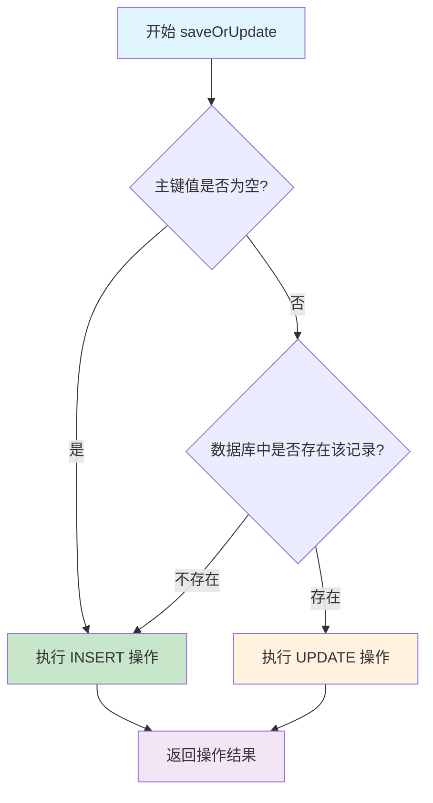

# 一、insertOrUpdate功能概述

## （一）什么是insertOrUpdate

insertOrUpdate是MyBatis Plus提供的一个非常实用的功能，它能够智能地判断数据是否存在：
- **如果数据不存在**：执行INSERT操作
- **如果数据已存在**：执行UPDATE操作

这个功能在实际开发中非常常见，特别是在数据同步、批量处理等场景中。

## （二）使用示例

```java
@Service
public class UserService extends ServiceImpl<UserMapper, User> {

    // 单个对象的insertOrUpdate
    public boolean saveOrUpdateUser(User user) {
        return this.saveOrUpdate(user);
    }

    // 批量insertOrUpdate
    public boolean batchSaveOrUpdate(List<User> userList) {
        return this.saveOrUpdateBatch(userList);
    }
}

// 使用示例
@RestController
public class UserController {

    @Autowired
    private UserService userService;

    @PostMapping("/user/saveOrUpdate")
    public Result saveOrUpdateUser(@RequestBody User user) {
        boolean success = userService.saveOrUpdate(user);
        return success ? Result.success() : Result.error();
    }
}
```

## （三）核心方法介绍

MyBatis Plus提供了多个insertOrUpdate相关的方法：

| 方法名 | 描述 | 适用场景 |
|--------|------|----------|
| `saveOrUpdate(T entity)` | 单个实体的保存或更新 | 单条数据处理 |
| `saveOrUpdateBatch(Collection<T> entityList)` | 批量保存或更新 | 批量数据处理 |
| `saveOrUpdateBatch(Collection<T> entityList, int batchSize)` | 指定批次大小的批量操作 | 大数据量处理 |

# 二、实现原理深度分析

## （一）判断逻辑：如何确定是INSERT还是UPDATE

### 1. 主键判断策略

MyBatis Plus的insertOrUpdate主要通过以下逻辑来判断：

```java
// 核心判断逻辑（简化版）
public boolean saveOrUpdate(T entity) {
    // 1. 获取主键值
    Object idVal = getIdVal(entity);

    // 2. 判断主键是否为空
    if (StringUtils.checkValNull(idVal) || Objects.isNull(getById((Serializable) idVal))) {
        // 主键为空或数据库中不存在该记录 -> INSERT
        return save(entity);
    } else {
        // 主键不为空且数据库中存在该记录 -> UPDATE
        return updateById(entity);
    }
}
```

### 2. 详细判断流程



## （二）源码分析

### 1. ServiceImpl中的saveOrUpdate实现

```java
// com.baomidou.mybatisplus.extension.service.impl.ServiceImpl
@Override
public boolean saveOrUpdate(T entity) {
    if (null != entity) {
        // 获取表信息
        TableInfo tableInfo = TableInfoHelper.getTableInfo(this.entityClass);
        Assert.notNull(tableInfo, "error: can not execute. because can not find cache of TableInfo for entity!");

        // 获取主键字段名
        String keyProperty = tableInfo.getKeyProperty();
        Assert.notEmpty(keyProperty, "error: can not execute. because can not find column for id from entity!");

        // 通过反射获取主键值
        Object idVal = tableInfo.getPropertyValue(entity, tableInfo.getKeyProperty());

        // 判断主键值是否为空或者数据库中是否存在该记录
        return StringUtils.checkValNull(idVal) || Objects.isNull(getById((Serializable) idVal)) ?
            save(entity) : updateById(entity);
    }
    return false;
}
```

### 2. 主键值获取逻辑

```java
// TableInfo类中的属性值获取
public Object getPropertyValue(Object entity, String property) {
    if (null == entity || StringUtils.isBlank(property)) {
        return null;
    }

    // 通过反射获取属性值
    try {
        // 1. 尝试通过getter方法获取
        String getterName = "get" + StringUtils.capitalize(property);
        Method getter = entity.getClass().getMethod(getterName);
        return getter.invoke(entity);
    } catch (Exception e) {
        // 2. 如果getter方法不存在，尝试直接访问字段
        try {
            Field field = entity.getClass().getDeclaredField(property);
            field.setAccessible(true);
            return field.get(entity);
        } catch (Exception ex) {
            throw new RuntimeException("无法获取属性值: " + property, ex);
        }
    }
}
```

### 3. 批量操作实现

```java
// 批量saveOrUpdate实现
@Override
@Transactional(rollbackFor = Exception.class)
public boolean saveOrUpdateBatch(Collection<T> entityList, int batchSize) {
    TableInfo tableInfo = TableInfoHelper.getTableInfo(entityClass);
    Assert.notNull(tableInfo, "error: can not execute. because can not find cache of TableInfo for entity!");

    String keyProperty = tableInfo.getKeyProperty();
    Assert.notEmpty(keyProperty, "error: can not execute. because can not find column for id from entity!");

    // 分离需要插入和更新的数据
    List<T> insertList = new ArrayList<>();
    List<T> updateList = new ArrayList<>();

    for (T entity : entityList) {
        Object idVal = tableInfo.getPropertyValue(entity, keyProperty);
        if (StringUtils.checkValNull(idVal) || Objects.isNull(getById((Serializable) idVal))) {
            insertList.add(entity);
        } else {
            updateList.add(entity);
        }
    }

    // 批量执行插入和更新
    boolean insertResult = insertList.isEmpty() || saveBatch(insertList, batchSize);
    boolean updateResult = updateList.isEmpty() || updateBatchById(updateList, batchSize);

    return insertResult && updateResult;
}
```

## （三）关键组件分析

### 1. TableInfo表信息缓存

```java
// TableInfo是MyBatis Plus中存储实体类与数据库表映射信息的核心类
public class TableInfo {
    // 表名
    private String tableName;
    // 主键字段信息
    private TableId tableId;
    // 主键属性名
    private String keyProperty;
    // 主键列名
    private String keyColumn;
    // 字段列表
    private List<TableField> fieldList;

    // 获取主键值的方法
    public Object getPropertyValue(Object entity, String property) {
        // 通过反射获取实体对象的属性值
        return ReflectionKit.getFieldValue(entity, property);
    }
}

// TableInfoHelper负责管理TableInfo的缓存
public class TableInfoHelper {
    // 表信息缓存，key为实体类Class，value为TableInfo
    private static final Map<Class<?>, TableInfo> TABLE_INFO_CACHE = new ConcurrentHashMap<>();

    // 获取表信息
    public static TableInfo getTableInfo(Class<?> clazz) {
        return TABLE_INFO_CACHE.get(clazz);
    }
}
```

### 2. 主键策略处理

```java
// 不同主键策略的处理方式
public enum IdType {
    AUTO(0),        // 数据库自增
    NONE(1),        // 无状态
    INPUT(2),       // 手动输入
    ASSIGN_ID(3),   // 分配ID（雪花算法）
    ASSIGN_UUID(4); // 分配UUID
}

// 在saveOrUpdate中，不同主键策略的判断逻辑
public boolean saveOrUpdate(T entity) {
    TableInfo tableInfo = TableInfoHelper.getTableInfo(this.entityClass);
    String keyProperty = tableInfo.getKeyProperty();
    Object idVal = tableInfo.getPropertyValue(entity, keyProperty);

    // 根据主键策略判断
    if (tableInfo.getIdType() == IdType.AUTO) {
        // 自增主键：判断主键是否为null或0
        return (idVal == null || (idVal instanceof Number && ((Number) idVal).longValue() == 0))
            ? save(entity) : updateById(entity);
    } else {
        // 其他策略：判断主键是否为空或数据库中不存在
        return StringUtils.checkValNull(idVal) || Objects.isNull(getById((Serializable) idVal))
            ? save(entity) : updateById(entity);
    }
}
```

# 三、性能分析与优化

## （一）性能问题分析

### 1. 数据库查询开销

```java
// 问题：每次saveOrUpdate都会执行一次SELECT查询来判断记录是否存在
public boolean saveOrUpdate(T entity) {
    Object idVal = getIdVal(entity);

    // 这里会执行一次SELECT查询，在批量操作时性能开销很大
    if (StringUtils.checkValNull(idVal) || Objects.isNull(getById((Serializable) idVal))) {
        return save(entity);
    } else {
        return updateById(entity);
    }
}
```

### 2. 批量操作的性能瓶颈

```java
// 批量操作中的性能问题
public boolean saveOrUpdateBatch(Collection<T> entityList, int batchSize) {
    for (T entity : entityList) {
        Object idVal = getIdVal(entity);

        // 问题：每个实体都会执行一次getById查询
        // 如果有1000条数据，就会执行1000次SELECT查询
        if (StringUtils.checkValNull(idVal) || Objects.isNull(getById((Serializable) idVal))) {
            insertList.add(entity);
        } else {
            updateList.add(entity);
        }
    }
}
```

## （二）性能优化方案

### 1. 使用MySQL的ON DUPLICATE KEY UPDATE

```java
// 自定义Mapper方法，使用MySQL的ON DUPLICATE KEY UPDATE语法
@Mapper
public interface UserMapper extends BaseMapper<User> {

    // 单条记录的insertOrUpdate
    @Insert("INSERT INTO user (id, name, email, age) VALUES (#{id}, #{name}, #{email}, #{age}) " +
            "ON DUPLICATE KEY UPDATE name = VALUES(name), email = VALUES(email), age = VALUES(age)")
    int insertOrUpdate(User user);

    // 批量insertOrUpdate
    @Insert("<script>" +
            "INSERT INTO user (id, name, email, age) VALUES " +
            "<foreach collection='list' item='item' separator=','>" +
            "(#{item.id}, #{item.name}, #{item.email}, #{item.age})" +
            "</foreach>" +
            "ON DUPLICATE KEY UPDATE " +
            "name = VALUES(name), email = VALUES(email), age = VALUES(age)" +
            "</script>")
    int batchInsertOrUpdate(@Param("list") List<User> userList);
}
```

### 2. 批量查询优化

```java
// 优化后的批量saveOrUpdate实现
@Service
public class OptimizedUserService extends ServiceImpl<UserMapper, User> {

    public boolean optimizedSaveOrUpdateBatch(List<User> userList) {
        if (CollectionUtils.isEmpty(userList)) {
            return true;
        }

        // 1. 提取所有主键值
        List<Long> idList = userList.stream()
            .map(User::getId)
            .filter(Objects::nonNull)
            .collect(Collectors.toList());

        // 2. 批量查询已存在的记录
        Set<Long> existingIds = new HashSet<>();
        if (!idList.isEmpty()) {
            List<User> existingUsers = this.listByIds(idList);
            existingIds = existingUsers.stream()
                .map(User::getId)
                .collect(Collectors.toSet());
        }

        // 3. 分离插入和更新数据
        List<User> insertList = new ArrayList<>();
        List<User> updateList = new ArrayList<>();

        for (User user : userList) {
            if (user.getId() == null || !existingIds.contains(user.getId())) {
                insertList.add(user);
            } else {
                updateList.add(user);
            }
        }

        // 4. 批量执行
        boolean insertResult = insertList.isEmpty() || this.saveBatch(insertList);
        boolean updateResult = updateList.isEmpty() || this.updateBatchById(updateList);

        return insertResult && updateResult;
    }
}
```

### 3. 使用缓存优化

```java
// 使用Redis缓存优化存在性判断
@Service
public class CachedUserService extends ServiceImpl<UserMapper, User> {

    @Autowired
    private RedisTemplate<String, Object> redisTemplate;

    private static final String USER_EXISTS_KEY = "user:exists:";
    private static final int CACHE_EXPIRE_SECONDS = 300; // 5分钟过期

    public boolean cachedSaveOrUpdate(User user) {
        if (user.getId() == null) {
            return this.save(user);
        }

        // 1. 先从缓存中查询
        String cacheKey = USER_EXISTS_KEY + user.getId();
        Boolean exists = (Boolean) redisTemplate.opsForValue().get(cacheKey);

        if (exists == null) {
            // 2. 缓存中没有，查询数据库
            User existingUser = this.getById(user.getId());
            exists = existingUser != null;

            // 3. 将结果放入缓存
            redisTemplate.opsForValue().set(cacheKey, exists, CACHE_EXPIRE_SECONDS, TimeUnit.SECONDS);
        }

        // 4. 根据存在性执行相应操作
        if (exists) {
            boolean result = this.updateById(user);
            // 更新成功后，刷新缓存
            if (result) {
                redisTemplate.opsForValue().set(cacheKey, true, CACHE_EXPIRE_SECONDS, TimeUnit.SECONDS);
            }
            return result;
        } else {
            boolean result = this.save(user);
            // 插入成功后，设置缓存
            if (result) {
                redisTemplate.opsForValue().set(cacheKey, true, CACHE_EXPIRE_SECONDS, TimeUnit.SECONDS);
            }
            return result;
        }
    }
}
```

# 四、实际应用场景与最佳实践

## （一）常见应用场景

### 1. 数据同步场景

```java
// 场景：从外部系统同步用户数据
@Service
public class UserSyncService {

    @Autowired
    private UserService userService;

    // 同步外部用户数据
    public void syncUsersFromExternalSystem() {
        // 1. 从外部系统获取用户数据
        List<ExternalUser> externalUsers = externalSystemClient.getUsers();

        // 2. 转换为内部用户对象
        List<User> users = externalUsers.stream()
            .map(this::convertToInternalUser)
            .collect(Collectors.toList());

        // 3. 批量保存或更新
        userService.saveOrUpdateBatch(users);

        log.info("同步用户数据完成，共处理 {} 条记录", users.size());
    }

    private User convertToInternalUser(ExternalUser externalUser) {
        User user = new User();
        user.setId(externalUser.getExternalId()); // 使用外部ID作为主键
        user.setName(externalUser.getName());
        user.setEmail(externalUser.getEmail());
        user.setUpdateTime(new Date());
        return user;
    }
}
```

### 2. 配置管理场景

```java
// 场景：系统配置的动态更新
@Service
public class ConfigService extends ServiceImpl<ConfigMapper, SystemConfig> {

    // 批量更新系统配置
    public void updateConfigs(Map<String, String> configMap) {
        List<SystemConfig> configs = configMap.entrySet().stream()
            .map(entry -> {
                SystemConfig config = new SystemConfig();
                config.setConfigKey(entry.getKey());
                config.setConfigValue(entry.getValue());
                config.setUpdateTime(new Date());
                return config;
            })
            .collect(Collectors.toList());

        // 使用saveOrUpdate确保配置存在则更新，不存在则插入
        this.saveOrUpdateBatch(configs);
    }

    // 单个配置的更新
    public void updateConfig(String key, String value) {
        SystemConfig config = new SystemConfig();
        config.setConfigKey(key);
        config.setConfigValue(value);
        config.setUpdateTime(new Date());

        this.saveOrUpdate(config);
    }
}
```

### 3. 缓存预热场景

```java
// 场景：缓存预热时的数据处理
@Service
public class CacheWarmupService {

    @Autowired
    private ProductService productService;

    @Autowired
    private RedisTemplate<String, Object> redisTemplate;

    // 预热商品缓存
    @Scheduled(cron = "0 0 2 * * ?") // 每天凌晨2点执行
    public void warmupProductCache() {
        // 1. 从缓存或外部系统获取需要预热的商品数据
        List<Product> products = getProductsForWarmup();

        // 2. 批量保存或更新到数据库
        productService.saveOrUpdateBatch(products);

        // 3. 同时更新缓存
        products.forEach(product -> {
            String cacheKey = "product:" + product.getId();
            redisTemplate.opsForValue().set(cacheKey, product, 1, TimeUnit.HOURS);
        });

        log.info("商品缓存预热完成，处理商品数量：{}", products.size());
    }
}
```

## （二）最佳实践

### 1. 主键策略选择

```java
// 推荐的主键策略配置
@Entity
@TableName("user")
public class User {

    // 方案1：使用雪花算法（推荐）
    @TableId(type = IdType.ASSIGN_ID)
    private Long id;

    // 方案2：使用UUID（适合分布式场景）
    // @TableId(type = IdType.ASSIGN_UUID)
    // private String id;

    // 方案3：数据库自增（传统方案）
    // @TableId(type = IdType.AUTO)
    // private Long id;

    private String name;
    private String email;

    // 建议添加创建时间和更新时间字段
    @TableField(fill = FieldFill.INSERT)
    private Date createTime;

    @TableField(fill = FieldFill.INSERT_UPDATE)
    private Date updateTime;
}
```

### 2. 批量操作优化

```java
// 推荐的批量操作实现
@Service
public class OptimizedBatchService {

    private static final int DEFAULT_BATCH_SIZE = 1000;

    // 大数据量的分批处理
    public void processBigDataList(List<User> userList) {
        if (CollectionUtils.isEmpty(userList)) {
            return;
        }

        // 按批次大小分割数据
        List<List<User>> batches = Lists.partition(userList, DEFAULT_BATCH_SIZE);

        for (List<User> batch : batches) {
            try {
                // 使用事务确保数据一致性
                processOneBatch(batch);
            } catch (Exception e) {
                log.error("批次处理失败，批次大小：{}", batch.size(), e);
                // 可以选择继续处理下一批次或者抛出异常
            }
        }
    }

    @Transactional(rollbackFor = Exception.class)
    public void processOneBatch(List<User> batch) {
        userService.saveOrUpdateBatch(batch, DEFAULT_BATCH_SIZE);
    }
}
```

### 3. 异常处理与监控

```java
// 完善的异常处理和监控
@Service
public class MonitoredUserService extends ServiceImpl<UserMapper, User> {

    private static final Logger log = LoggerFactory.getLogger(MonitoredUserService.class);

    @Override
    public boolean saveOrUpdate(T entity) {
        long startTime = System.currentTimeMillis();
        String operation = "saveOrUpdate";

        try {
            // 参数校验
            if (entity == null) {
                throw new IllegalArgumentException("实体对象不能为空");
            }

            // 执行操作
            boolean result = super.saveOrUpdate(entity);

            // 记录成功日志
            long duration = System.currentTimeMillis() - startTime;
            log.info("{}操作成功，耗时：{}ms，实体：{}", operation, duration, entity.getClass().getSimpleName());

            return result;

        } catch (Exception e) {
            // 记录失败日志
            long duration = System.currentTimeMillis() - startTime;
            log.error("{}操作失败，耗时：{}ms，实体：{}，错误：{}",
                operation, duration, entity.getClass().getSimpleName(), e.getMessage(), e);

            // 可以选择重新抛出异常或返回false
            throw new RuntimeException("saveOrUpdate操作失败", e);
        }
    }

    @Override
    public boolean saveOrUpdateBatch(Collection<T> entityList, int batchSize) {
        if (CollectionUtils.isEmpty(entityList)) {
            return true;
        }

        long startTime = System.currentTimeMillis();
        String operation = "saveOrUpdateBatch";

        try {
            boolean result = super.saveOrUpdateBatch(entityList, batchSize);

            long duration = System.currentTimeMillis() - startTime;
            log.info("{}操作成功，耗时：{}ms，处理数量：{}，批次大小：{}",
                operation, duration, entityList.size(), batchSize);

            return result;

        } catch (Exception e) {
            long duration = System.currentTimeMillis() - startTime;
            log.error("{}操作失败，耗时：{}ms，处理数量：{}，批次大小：{}，错误：{}",
                operation, duration, entityList.size(), batchSize, e.getMessage(), e);

            throw new RuntimeException("saveOrUpdateBatch操作失败", e);
        }
    }
}
```

### 4. 配置优化建议

```yaml
# application.yml 中的相关配置优化
mybatis-plus:
  configuration:
    # 开启驼峰命名转换
    map-underscore-to-camel-case: true
    # 开启二级缓存
    cache-enabled: true
    # 设置合理的超时时间
    default-statement-timeout: 30
  global-config:
    db-config:
      # 逻辑删除配置
      logic-delete-field: deleted
      logic-delete-value: 1
      logic-not-delete-value: 0
      # 自动填充配置
      insert-strategy: not_null
      update-strategy: not_null

# 数据库连接池配置
spring:
  datasource:
    hikari:
      # 连接池大小
      maximum-pool-size: 20
      minimum-idle: 5
      # 连接超时时间
      connection-timeout: 30000
      # 空闲连接存活时间
      idle-timeout: 600000
      # 连接最大存活时间
      max-lifetime: 1800000
```

# 五、常见问题与解决方案

## （一）常见问题

### 1. 主键为null时的处理

```java
// 问题：当主键为null时，saveOrUpdate的行为
@Test
public void testSaveOrUpdateWithNullId() {
    User user = new User();
    user.setId(null);  // 主键为null
    user.setName("张三");
    user.setEmail("zhangsan@example.com");

    // 这种情况下会执行INSERT操作
    boolean result = userService.saveOrUpdate(user);

    // 如果使用自增主键，插入后user.getId()会被自动设置
    System.out.println("插入后的ID：" + user.getId());
}
```

### 2. 复合主键的处理

```java
// 复合主键实体类
@Entity
@TableName("user_role")
public class UserRole {
    @TableId(type = IdType.INPUT)
    private Long userId;

    @TableId(type = IdType.INPUT)
    private Long roleId;

    private Date createTime;

    // 复合主键需要重写equals和hashCode方法
    @Override
    public boolean equals(Object o) {
        if (this == o) return true;
        if (o == null || getClass() != o.getClass()) return false;
        UserRole userRole = (UserRole) o;
        return Objects.equals(userId, userRole.userId) &&
               Objects.equals(roleId, userRole.roleId);
    }

    @Override
    public int hashCode() {
        return Objects.hash(userId, roleId);
    }
}

// 复合主键的saveOrUpdate处理
@Service
public class UserRoleService extends ServiceImpl<UserRoleMapper, UserRole> {

    @Override
    public boolean saveOrUpdate(UserRole entity) {
        // 对于复合主键，需要自定义判断逻辑
        if (entity.getUserId() == null || entity.getRoleId() == null) {
            return this.save(entity);
        }

        // 查询是否存在
        QueryWrapper<UserRole> queryWrapper = new QueryWrapper<>();
        queryWrapper.eq("user_id", entity.getUserId())
                   .eq("role_id", entity.getRoleId());

        UserRole existing = this.getOne(queryWrapper);
        if (existing == null) {
            return this.save(entity);
        } else {
            return this.update(entity, queryWrapper);
        }
    }
}
```

### 3. 并发问题处理

```java
// 并发环境下的saveOrUpdate可能出现的问题
@Service
public class ConcurrentSafeUserService extends ServiceImpl<UserMapper, User> {

    // 使用乐观锁解决并发问题
    @Override
    public boolean saveOrUpdate(User entity) {
        if (entity.getId() == null) {
            return this.save(entity);
        }

        // 先查询当前版本号
        User existing = this.getById(entity.getId());
        if (existing == null) {
            return this.save(entity);
        } else {
            // 设置版本号，利用乐观锁机制
            entity.setVersion(existing.getVersion());
            return this.updateById(entity);
        }
    }

    // 使用分布式锁解决并发问题
    @Autowired
    private RedisTemplate<String, Object> redisTemplate;

    public boolean saveOrUpdateWithLock(User entity) {
        String lockKey = "user:lock:" + entity.getId();
        String lockValue = UUID.randomUUID().toString();

        try {
            // 获取分布式锁
            Boolean lockAcquired = redisTemplate.opsForValue()
                .setIfAbsent(lockKey, lockValue, 10, TimeUnit.SECONDS);

            if (!lockAcquired) {
                throw new RuntimeException("获取锁失败，请稍后重试");
            }

            // 执行saveOrUpdate操作
            return this.saveOrUpdate(entity);

        } finally {
            // 释放锁
            String currentValue = (String) redisTemplate.opsForValue().get(lockKey);
            if (lockValue.equals(currentValue)) {
                redisTemplate.delete(lockKey);
            }
        }
    }
}
```

## （二）性能调优建议

### 1. SQL执行计划分析

```sql
-- 分析saveOrUpdate相关的SQL执行计划

-- 1. 查询语句的执行计划
EXPLAIN SELECT * FROM user WHERE id = 1;

-- 2. 插入语句的执行计划
EXPLAIN INSERT INTO user (id, name, email) VALUES (1, '张三', 'zhangsan@example.com');

-- 3. 更新语句的执行计划
EXPLAIN UPDATE user SET name = '李四' WHERE id = 1;

-- 4. ON DUPLICATE KEY UPDATE的执行计划
EXPLAIN INSERT INTO user (id, name, email) VALUES (1, '张三', 'zhangsan@example.com')
ON DUPLICATE KEY UPDATE name = VALUES(name), email = VALUES(email);
```

### 2. 索引优化建议

```sql
-- 为经常用于saveOrUpdate的字段创建索引

-- 1. 主键索引（通常自动创建）
ALTER TABLE user ADD PRIMARY KEY (id);

-- 2. 唯一索引（用于业务唯一性约束）
ALTER TABLE user ADD UNIQUE INDEX uk_email (email);

-- 3. 复合索引（用于复合查询条件）
ALTER TABLE user ADD INDEX idx_name_email (name, email);

-- 4. 覆盖索引（包含所有查询字段）
ALTER TABLE user ADD INDEX idx_covering (id, name, email, create_time);
```

### 3. 监控指标

```java
// 关键性能指标监控
@Component
public class SaveOrUpdateMetrics {

    private final MeterRegistry meterRegistry;
    private final Counter saveCounter;
    private final Counter updateCounter;
    private final Timer saveOrUpdateTimer;

    public SaveOrUpdateMetrics(MeterRegistry meterRegistry) {
        this.meterRegistry = meterRegistry;
        this.saveCounter = Counter.builder("saveOrUpdate.save.count")
            .description("保存操作计数")
            .register(meterRegistry);
        this.updateCounter = Counter.builder("saveOrUpdate.update.count")
            .description("更新操作计数")
            .register(meterRegistry);
        this.saveOrUpdateTimer = Timer.builder("saveOrUpdate.duration")
            .description("saveOrUpdate操作耗时")
            .register(meterRegistry);
    }

    public void recordSave() {
        saveCounter.increment();
    }

    public void recordUpdate() {
        updateCounter.increment();
    }

    public Timer.Sample startTimer() {
        return Timer.start(meterRegistry);
    }
}
```

# 六、总结与建议

## （一）核心要点总结

1. **实现原理**：
   - MyBatis Plus的saveOrUpdate通过主键值判断执行INSERT或UPDATE
   - 核心逻辑是先检查主键是否为空，再查询数据库确认记录是否存在
   - 批量操作会分离数据为插入列表和更新列表，分别执行

2. **性能考虑**：
   - 每次操作都会执行额外的SELECT查询，在大数据量场景下性能开销较大
   - 可以通过MySQL的ON DUPLICATE KEY UPDATE语法优化
   - 批量操作时建议使用批量查询减少数据库交互次数

3. **最佳实践**：
   - 合理选择主键策略，推荐使用雪花算法
   - 大数据量操作时进行分批处理
   - 添加适当的监控和异常处理
   - 在并发场景下考虑使用乐观锁或分布式锁

## （二）使用建议

### ✅ 适用场景
- 数据同步和ETL操作
- 配置管理和缓存预热
- 小到中等数据量的批量操作
- 对数据一致性要求较高的场景

### ❌ 不适用场景
- 超大数据量的批量操作（建议使用专门的批量插入工具）
- 对性能要求极高的场景（建议使用原生SQL）
- 复杂的业务逻辑判断（建议自定义实现）

### 🔧 优化方向
- 使用数据库特性（如ON DUPLICATE KEY UPDATE）
- 实现智能批量查询减少数据库交互
- 添加缓存层减少重复查询
- 使用异步处理提升用户体验


**MyBatis Plus的insertOrUpdate功能为开发者提供了便捷的数据保存方式，但在使用时需要充分理解其实现原理和性能特点。通过合理的优化策略和最佳实践，可以在保证功能正确性的同时获得良好的性能表现。**


---

**参考资料：**
1. [MyBatis Plus官方文档](https://baomidou.com/)
2. [MyBatis Plus源码分析](https://github.com/baomidou/mybatis-plus)
3. [MySQL ON DUPLICATE KEY UPDATE语法](https://dev.mysql.com/doc/refman/8.0/en/insert-on-duplicate.html)
4. [Java反射机制详解](https://docs.oracle.com/javase/tutorial/reflect/)
5. [Spring事务管理](https://docs.spring.io/spring-framework/docs/current/reference/html/data-access.html#transaction)
6. [数据库性能优化最佳实践](https://dev.mysql.com/doc/refman/8.0/en/optimization.html)
```
```