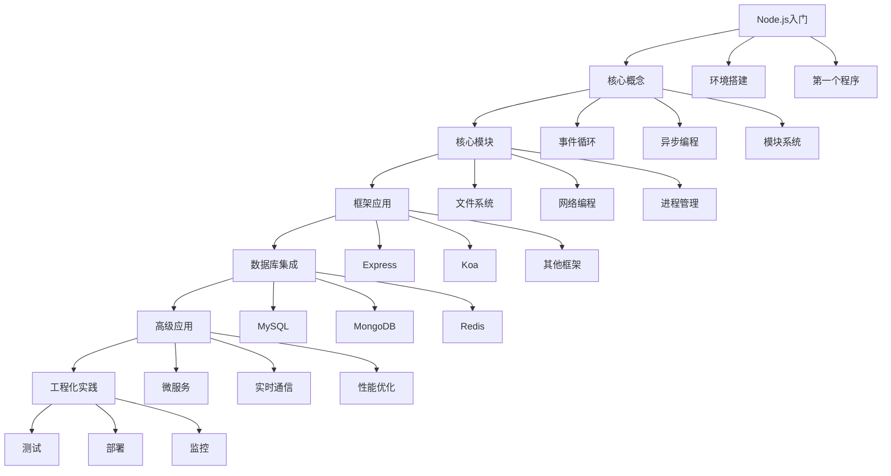

# 前言

欢迎来到Node.js学习笔记专栏！本专栏将系统性地记录Node.js的学习过程，从基础概念到高级应用，从核心模块到主流框架，帮助您全面掌握Node.js服务端开发技术。

# 一、专栏定位

## （一）学习目标

### 1. 技术掌握目标
- **基础扎实**：深入理解Node.js运行机制和核心概念
- **实践能力**：能够独立开发Node.js应用程序
- **框架熟练**：掌握Express、Koa等主流框架
- **工程化思维**：具备企业级Node.js项目开发能力

### 2. 知识体系构建
- **理论基础**：JavaScript引擎、事件循环、异步编程
- **核心模块**：文件系统、网络编程、进程管理等
- **生态系统**：npm包管理、常用第三方模块
- **最佳实践**：性能优化、安全防护、部署运维

## （二）适用人群

### 1. 初学者
- 有JavaScript基础，想学习服务端开发
- 前端开发者希望扩展到全栈开发
- 其他语言开发者转向Node.js

### 2. 进阶者
- 已有Node.js基础，希望深入学习
- 需要系统梳理Node.js知识体系
- 准备面试或技术提升

### 3. 实践者
- 正在进行Node.js项目开发
- 寻找最佳实践和解决方案
- 需要参考实际案例和代码示例

# 二、学习路线规划

## （一）基础阶段

### 1. Node.js入门
- **Node.js简介与安装**
  - Node.js的历史和特点
  - 开发环境搭建
  - 版本管理（nvm使用）
  
- **JavaScript基础回顾**
  - ES6+新特性
  - 异步编程概念
  - 模块化开发

- **第一个Node.js程序**
  - Hello World示例
  - 模块导入导出
  - 命令行参数处理

### 2. 核心概念理解
- **事件循环机制**
  - 事件循环原理
  - 宏任务与微任务
  - 性能优化要点

- **异步编程模式**
  - 回调函数模式
  - Promise使用
  - async/await语法

- **模块系统**
  - CommonJS规范
  - ES Modules
  - 模块加载机制

## （二）核心模块阶段

### 1. 文件系统操作
- **fs模块详解**
  - 同步与异步操作
  - 文件读写操作
  - 目录操作
  - 文件监听

- **路径处理**
  - path模块使用
  - 跨平台路径处理
  - 相对路径与绝对路径

### 2. 网络编程
- **HTTP模块**
  - 创建HTTP服务器
  - 处理请求和响应
  - 路由实现

- **网络通信**
  - TCP/UDP编程
  - WebSocket实现
  - 网络安全考虑

### 3. 进程与线程
- **进程管理**
  - child_process模块
  - 进程间通信
  - 集群模式

- **多线程编程**
  - Worker Threads
  - 线程池管理
  - 性能对比

## （三）框架应用阶段

### 1. Express框架
- **Express基础**
  - 框架安装和配置
  - 路由系统
  - 中间件机制

- **Express进阶**
  - 模板引擎集成
  - 静态文件服务
  - 错误处理机制

- **RESTful API开发**
  - API设计原则
  - 请求处理
  - 响应格式化

### 2. Koa框架
- **Koa基础概念**
  - 与Express的区别
  - 洋葱模型理解
  - 中间件开发

- **Koa生态系统**
  - 常用中间件
  - 路由处理
  - 错误处理

### 3. 其他框架
- **Fastify**：高性能Web框架
- **NestJS**：企业级应用框架
- **Hapi**：配置驱动的框架

## （四）数据库集成阶段

### 1. 关系型数据库
- **MySQL集成**
  - mysql2驱动使用
  - 连接池管理
  - SQL查询优化

- **PostgreSQL集成**
  - pg驱动使用
  - 事务处理
  - 高级特性

### 2. NoSQL数据库
- **MongoDB集成**
  - Mongoose ODM
  - 数据建模
  - 查询优化

- **Redis集成**
  - 缓存策略
  - 会话管理
  - 发布订阅

### 3. ORM/ODM工具
- **Sequelize**：关系型数据库ORM
- **TypeORM**：TypeScript ORM
- **Prisma**：现代数据库工具

## （五）高级应用阶段

### 1. 微服务架构
- **服务拆分策略**
- **服务间通信**
- **API网关实现**
- **服务发现与注册**

### 2. 实时通信
- **WebSocket应用**
- **Socket.IO使用**
- **实时聊天系统**
- **推送服务实现**

### 3. 性能优化
- **代码优化技巧**
- **内存管理**
- **CPU密集型任务处理**
- **缓存策略**

## （六）工程化阶段

### 1. 测试体系
- **单元测试**
  - Jest测试框架
  - Mocha + Chai
  - 测试覆盖率

- **集成测试**
  - API测试
  - 数据库测试
  - 端到端测试

### 2. 部署运维
- **容器化部署**
  - Docker使用
  - Kubernetes部署
  - CI/CD流程

- **监控与日志**
  - 应用监控
  - 日志管理
  - 性能分析

### 3. 安全防护
- **常见安全威胁**
- **安全中间件**
- **HTTPS配置**
- **身份认证与授权**

# 三、学习方法建议

## （一）理论与实践结合

### 1. 学习步骤
1. **理论学习**：先理解概念和原理
2. **代码实践**：通过编写代码加深理解
3. **项目应用**：在实际项目中应用所学知识
4. **总结反思**：记录学习心得和遇到的问题

### 2. 实践项目建议
- **个人博客系统**：练习基础CRUD操作
- **RESTful API服务**：掌握接口开发
- **实时聊天应用**：学习WebSocket技术
- **电商后台系统**：综合应用各种技术

## （二）资源推荐

### 1. 官方文档
- [Node.js官方文档](https://nodejs.org/docs/)
- [npm官方文档](https://docs.npmjs.com/)
- [Express官方文档](https://expressjs.com/)

### 2. 学习资源
- **书籍推荐**
  - 《Node.js实战》
  - 《深入浅出Node.js》
  - 《Node.js设计模式》

- **在线课程**
  - Node.js官方教程
  - 各大技术平台的Node.js课程

### 3. 实践平台
- **GitHub**：查看优秀的开源项目
- **Stack Overflow**：解决技术问题
- **掘金/思否**：技术文章和讨论

## （三）学习计划制定

### 1. 时间安排
- **每日学习**：保持1-2小时的学习时间
- **周末实践**：进行项目开发和代码练习
- **月度总结**：回顾学习成果，调整学习计划

### 2. 学习记录
- **笔记整理**：及时记录重要知识点
- **代码管理**：使用Git管理学习代码
- **问题收集**：记录遇到的问题和解决方案

# 四、专栏内容预告

## （一）即将发布的文章

### 1. 基础系列
- 【Node.js】Node.js运行机制深度解析
- 【Node.js】事件循环与异步编程详解
- 【Node.js】模块系统完全指南

### 2. 核心模块系列
- 【Node.js】文件系统操作实战指南
- 【Node.js】HTTP模块与Web服务器开发
- 【Node.js】进程管理与集群应用

### 3. 框架应用系列
- 【Node.js】Express框架从入门到精通
- 【Node.js】Koa框架深度实践
- 【Node.js】RESTful API设计与实现

### 4. 数据库集成系列
- 【Node.js】MongoDB与Mongoose实战
- 【Node.js】MySQL数据库操作详解
- 【Node.js】Redis缓存应用实践

### 5. 高级应用系列
- 【Node.js】微服务架构设计与实现
- 【Node.js】WebSocket实时通信开发
- 【Node.js】性能优化最佳实践

## （二）特色内容

### 1. 实战项目
每个重要知识点都会配合实际项目进行讲解，确保学以致用。

### 2. 最佳实践
总结企业级开发中的最佳实践，避免常见陷阱。

### 3. 问题解决
收集和解答学习过程中的常见问题，提供解决方案。

### 4. 代码示例
所有文章都会提供完整的、可运行的代码示例。

# 五、互动与反馈

## （一）学习交流

欢迎在文章评论区进行技术讨论和问题交流，我会及时回复并提供帮助。

## （二）内容建议

如果您希望了解特定的Node.js技术点，或者有好的学习资源推荐，欢迎留言建议。

## （三）错误反馈

如果发现文章中的错误或不准确的地方，请及时指出，我会尽快修正。

# 六、总结

Node.js作为现代Web开发的重要技术，具有广阔的应用前景。通过系统的学习和实践，相信您能够掌握这门技术，并在实际项目中发挥其优势。

让我们一起开始这段Node.js学习之旅，从基础概念到高级应用，从理论学习到项目实践，逐步构建完整的Node.js知识体系！

## 学习路线图

期待与您一起探索Node.js的精彩世界！
