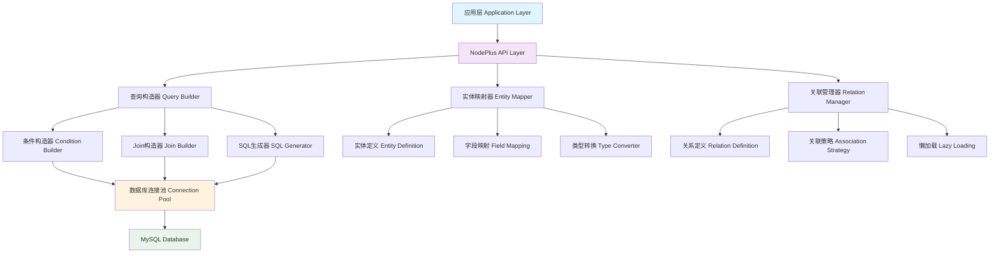

# 一、项目背景与目标

## （一）MyBatis Plus Join技术特性分析

MyBatis Plus Join是Java生态中一个强大的多表查询插件，它具有以下核心特性：

### 1. 链式查询构造器
```java
// MyBatis Plus Join的链式查询示例
List<UserDTO> users = userMapper.selectJoinList(UserDTO.class,
    new MPJLambdaWrapper<UserDO>()
        .selectAll(UserDO.class)                    // 查询主表所有字段
        .select(UserAddressDO::getTel)              // 查询关联表特定字段
        .selectAs(UserAddressDO::getAddress, UserDTO::getUserAddress)  // 字段别名映射
        .leftJoin(UserAddressDO.class, UserAddressDO::getUserId, UserDO::getId)  // 左连接
        .eq(UserDO::getId, 1)                       // 条件构造
        .like(UserAddressDO::getTel, "1"));         // 模糊查询
```

### 2. 自动关联映射
- **实体关系自动识别**：通过注解或配置自动识别表间关系
- **类型安全的字段引用**：使用Lambda表达式避免硬编码字段名
- **智能SQL生成**：根据条件自动生成优化的SQL语句

### 3. 灵活的条件构造
- **多种查询条件**：支持eq、ne、gt、lt、like、in等丰富的条件操作
- **逻辑组合**：支持and、or等逻辑组合
- **动态条件**：根据参数动态添加查询条件

## （二）Node.js生态现状分析

当前Node.js主流ORM框架对比：

| 框架 | 优势 | 劣势 | Join查询支持 |
|------|------|------|-------------|
| **Prisma** | 类型安全、开发体验好 | 学习成本高、灵活性有限 | 支持但语法复杂 |
| **TypeORM** | 功能全面、装饰器语法 | 性能一般、配置复杂 | 支持但写法繁琐 |
| **Sequelize** | 成熟稳定、社区活跃 | 类型支持弱、API设计老旧 | 支持但不够直观 |

**存在的问题：**
- 缺乏类似MyBatis Plus Join的链式查询体验
- 多表关联查询语法复杂，开发效率低
- 类型安全和开发体验难以兼顾

# 二、NodePlus框架设计理念

## （一）设计目标

1. **链式查询体验**：提供类似MyBatis Plus Join的流畅API
2. **类型安全**：充分利用TypeScript的类型系统
3. **零学习成本**：熟悉SQL的开发者可以快速上手
4. **高性能**：生成优化的SQL语句，支持连接池
5. **灵活扩展**：支持自定义查询和原生SQL

## （二）核心架构设计



## （三）技术栈选择

- **核心语言**：TypeScript（提供强类型支持）
- **数据库驱动**：mysql2（高性能MySQL驱动）
- **连接池**：mysql2内置连接池
- **类型推导**：利用TypeScript的条件类型和映射类型
- **装饰器**：用于实体定义和关系映射

# 三、核心功能模块设计

## （一）实体定义系统

### 1. 实体装饰器设计
```typescript
// 实体装饰器：定义表映射
@Entity('users')  // 指定表名
export class User {
    @PrimaryKey()
    @Column('id')
    id: number;

    @Column('username')
    username: string;

    @Column('email')
    email: string;

    @Column('created_at')
    createdAt: Date;

    // 一对多关系：用户拥有多个地址
    @OneToMany(() => UserAddress, address => address.user)
    addresses: UserAddress[];
}

@Entity('user_addresses')
export class UserAddress {
    @PrimaryKey()
    @Column('id')
    id: number;

    @Column('user_id')
    userId: number;

    @Column('address')
    address: string;

    @Column('tel')
    tel: string;

    @Column('area_id')
    areaId: number;

    // 多对一关系：多个地址属于一个用户
    @ManyToOne(() => User, user => user.addresses)
    @JoinColumn('user_id', 'id')  // 外键关联
    user: User;

    // 多对一关系：地址属于一个区域
    @ManyToOne(() => Area, area => area.addresses)
    @JoinColumn('area_id', 'id')
    area: Area;
}

@Entity('areas')
export class Area {
    @PrimaryKey()
    @Column('id')
    id: number;

    @Column('province')
    province: string;

    @Column('city')
    city: string;

    @OneToMany(() => UserAddress, address => address.area)
    addresses: UserAddress[];
}
```

### 2. 类型安全的字段引用
```typescript
// 字段引用类型定义
type FieldPath<T> = {
    [K in keyof T]: T[K] extends object
        ? `${K & string}.${FieldPath<T[K]> & string}` | K
        : K;
}[keyof T];

// 使用示例
type UserFields = FieldPath<User>;  // 'id' | 'username' | 'email' | 'createdAt' | 'addresses'
type UserAddressFields = FieldPath<UserAddress>;  // 'id' | 'userId' | 'address' | 'tel' | 'user.id' | 'user.username' | ...
```

## （二）查询构造器系统

### 1. 链式查询构造器
```typescript
// 查询构造器接口定义
interface QueryBuilder<T> {
    // 字段选择
    select<K extends keyof T>(...fields: K[]): QueryBuilder<Pick<T, K>>;
    selectAll(): QueryBuilder<T>;
    selectAs<K extends keyof T, A extends string>(field: K, alias: A): QueryBuilder<T & Record<A, T[K]>>;

    // 关联查询
    leftJoin<R>(entity: EntityClass<R>, condition: JoinCondition<T, R>): JoinQueryBuilder<T, R>;
    rightJoin<R>(entity: EntityClass<R>, condition: JoinCondition<T, R>): JoinQueryBuilder<T, R>;
    innerJoin<R>(entity: EntityClass<R>, condition: JoinCondition<T, R>): JoinQueryBuilder<T, R>;

    // 条件构造
    where<K extends keyof T>(field: K, operator: Operator, value: T[K]): QueryBuilder<T>;
    eq<K extends keyof T>(field: K, value: T[K]): QueryBuilder<T>;
    ne<K extends keyof T>(field: K, value: T[K]): QueryBuilder<T>;
    gt<K extends keyof T>(field: K, value: T[K]): QueryBuilder<T>;
    lt<K extends keyof T>(field: K, value: T[K]): QueryBuilder<T>;
    like<K extends keyof T>(field: K, value: string): QueryBuilder<T>;
    in<K extends keyof T>(field: K, values: T[K][]): QueryBuilder<T>;

    // 逻辑组合
    and(condition: (builder: QueryBuilder<T>) => QueryBuilder<T>): QueryBuilder<T>;
    or(condition: (builder: QueryBuilder<T>) => QueryBuilder<T>): QueryBuilder<T>;

    // 排序和分页
    orderBy<K extends keyof T>(field: K, direction?: 'ASC' | 'DESC'): QueryBuilder<T>;
    limit(count: number): QueryBuilder<T>;
    offset(count: number): QueryBuilder<T>;

    // 执行查询
    getMany(): Promise<T[]>;
    getOne(): Promise<T | null>;
    getCount(): Promise<number>;
    getRawMany(): Promise<any[]>;
}
```

### 2. Join查询构造器
```typescript
// Join查询构造器实现
class JoinQueryBuilder<T, R> extends QueryBuilder<T> {
    private joinType: 'LEFT' | 'RIGHT' | 'INNER';
    private joinEntity: EntityClass<R>;
    private joinCondition: JoinCondition<T, R>;

    // 选择关联表字段
    selectJoin<K extends keyof R>(...fields: K[]): JoinQueryBuilder<T, R>;
    selectJoinAs<K extends keyof R, A extends string>(field: K, alias: A): JoinQueryBuilder<T, R>;

    // 关联表条件
    whereJoin<K extends keyof R>(field: K, operator: Operator, value: R[K]): JoinQueryBuilder<T, R>;
    eqJoin<K extends keyof R>(field: K, value: R[K]): JoinQueryBuilder<T, R>;

    // 继续关联其他表
    leftJoin<S>(entity: EntityClass<S>, condition: JoinCondition<R, S>): JoinQueryBuilder<T & R, S>;
}
```

## （三）使用示例

### 1. 基础查询示例
```typescript
// 创建NodePlus实例
const nodePlus = new NodePlus({
    host: 'localhost',
    port: 3306,
    username: 'root',
    password: 'password',
    database: 'test_db',
    entities: [User, UserAddress, Area]
});

// 获取Repository
const userRepo = nodePlus.getRepository(User);

// 简单查询：查询所有用户
const users = await userRepo
    .createQueryBuilder()
    .selectAll()
    .getMany();

// 条件查询：查询特定用户
const user = await userRepo
    .createQueryBuilder()
    .selectAll()
    .eq('id', 1)
    .like('username', 'john%')
    .getOne();
```

### 2. 复杂Join查询示例
```typescript
// 三表关联查询：用户-地址-区域
interface UserWithAddressDTO {
    id: number;
    username: string;
    email: string;
    userAddress: string;
    tel: string;
    province: string;
    city: string;
}

const result = await userRepo
    .createQueryBuilder()
    .select('id', 'username', 'email')                    // 选择用户字段
    .leftJoin(UserAddress, (user, address) =>
        user.id.eq(address.userId))                       // 关联用户地址表
    .selectJoin('tel')                                    // 选择地址表的电话字段
    .selectJoinAs('address', 'userAddress')               // 地址字段重命名
    .leftJoin(Area, (address, area) =>
        address.areaId.eq(area.id))                       // 关联区域表
    .selectJoin('province', 'city')                       // 选择区域字段
    .eq('id', 1)                                          // 主表条件
    .like('tel', '1%')                                    // 关联表条件
    .gt('id', 5)                                          // 复合条件
    .getMany<UserWithAddressDTO>();

// 生成的SQL（自动优化）：
// SELECT
//   t.id, t.username, t.email,
//   t1.tel, t1.address AS userAddress,
//   t2.province, t2.city
// FROM users t
// LEFT JOIN user_addresses t1 ON t1.user_id = t.id
// LEFT JOIN areas t2 ON t2.id = t1.area_id
// WHERE t.id = ? AND t1.tel LIKE ? AND t.id > ?
```

### 3. 分页查询示例
```typescript
// 分页查询
const pageResult = await userRepo
    .createQueryBuilder()
    .selectAll()
    .leftJoin(UserAddress, (user, address) =>
        user.id.eq(address.userId))
    .selectJoinAs('address', 'userAddress')
    .orderBy('id', 'DESC')
    .limit(10)
    .offset(20)
    .getMany();

// 获取总数
const total = await userRepo
    .createQueryBuilder()
    .leftJoin(UserAddress, (user, address) =>
        user.id.eq(address.userId))
    .getCount();
```

# 四、框架核心实现

## （一）装饰器实现

### 1. 实体装饰器
```typescript
// 实体元数据存储
const entityMetadata = new Map<Function, EntityMetadata>();

// 实体装饰器
export function Entity(tableName: string) {
    return function <T extends { new (...args: any[]): {} }>(constructor: T) {
        const metadata: EntityMetadata = {
            tableName,
            columns: new Map(),
            relations: new Map(),
            primaryKeys: []
        };
        entityMetadata.set(constructor, metadata);
        return constructor;
    };
}

// 列装饰器
export function Column(columnName: string, options?: ColumnOptions) {
    return function (target: any, propertyKey: string) {
        const constructor = target.constructor;
        let metadata = entityMetadata.get(constructor);
        if (!metadata) {
            metadata = {
                tableName: '',
                columns: new Map(),
                relations: new Map(),
                primaryKeys: []
            };
            entityMetadata.set(constructor, metadata);
        }

        metadata.columns.set(propertyKey, {
            columnName,
            propertyName: propertyKey,
            type: Reflect.getMetadata('design:type', target, propertyKey),
            ...options
        });
    };
}

// 主键装饰器
export function PrimaryKey() {
    return function (target: any, propertyKey: string) {
        const constructor = target.constructor;
        let metadata = entityMetadata.get(constructor);
        if (!metadata) {
            metadata = {
                tableName: '',
                columns: new Map(),
                relations: new Map(),
                primaryKeys: []
            };
            entityMetadata.set(constructor, metadata);
        }

        metadata.primaryKeys.push(propertyKey);
    };
}
```

### 2. 关系装饰器
```typescript
// 一对多关系装饰器
export function OneToMany<T>(
    typeFunction: () => EntityClass<T>,
    inverseSide: (object: T) => any
) {
    return function (target: any, propertyKey: string) {
        const constructor = target.constructor;
        let metadata = entityMetadata.get(constructor);
        if (!metadata) {
            metadata = {
                tableName: '',
                columns: new Map(),
                relations: new Map(),
                primaryKeys: []
            };
            entityMetadata.set(constructor, metadata);
        }

        metadata.relations.set(propertyKey, {
            type: 'one-to-many',
            target: typeFunction,
            inverseSide,
            propertyName: propertyKey
        });
    };
}

// 多对一关系装饰器
export function ManyToOne<T>(
    typeFunction: () => EntityClass<T>,
    inverseSide?: (object: T) => any
) {
    return function (target: any, propertyKey: string) {
        const constructor = target.constructor;
        let metadata = entityMetadata.get(constructor);
        if (!metadata) {
            metadata = {
                tableName: '',
                columns: new Map(),
                relations: new Map(),
                primaryKeys: []
            };
            entityMetadata.set(constructor, metadata);
        }

        metadata.relations.set(propertyKey, {
            type: 'many-to-one',
            target: typeFunction,
            inverseSide,
            propertyName: propertyKey
        });
    };
}

// 连接列装饰器
export function JoinColumn(name: string, referencedColumnName: string) {
    return function (target: any, propertyKey: string) {
        const constructor = target.constructor;
        const metadata = entityMetadata.get(constructor);
        if (metadata && metadata.relations.has(propertyKey)) {
            const relation = metadata.relations.get(propertyKey)!;
            relation.joinColumn = {
                name,
                referencedColumnName
            };
        }
    };
}
```

## （二）查询构造器实现

### 1. 基础查询构造器
```typescript
export class QueryBuilder<T> {
    private _select: string[] = [];
    private _from: string = '';
    private _joins: JoinClause[] = [];
    private _where: WhereClause[] = [];
    private _orderBy: OrderByClause[] = [];
    private _limit?: number;
    private _offset?: number;
    private _alias: string = 't';
    private _aliasCounter: number = 1;

    constructor(
        private entity: EntityClass<T>,
        private connection: Connection
    ) {
        const metadata = entityMetadata.get(entity);
        if (metadata) {
            this._from = metadata.tableName;
        }
    }

    // 选择所有字段
    selectAll(): QueryBuilder<T> {
        const metadata = entityMetadata.get(this.entity);
        if (metadata) {
            metadata.columns.forEach((column, property) => {
                this._select.push(`${this._alias}.${column.columnName}`);
            });
        }
        return this;
    }

    // 选择指定字段
    select<K extends keyof T>(...fields: K[]): QueryBuilder<Pick<T, K>> {
        const metadata = entityMetadata.get(this.entity);
        if (metadata) {
            fields.forEach(field => {
                const column = metadata.columns.get(field as string);
                if (column) {
                    this._select.push(`${this._alias}.${column.columnName}`);
                }
            });
        }
        return this as any;
    }

    // 字段别名
    selectAs<K extends keyof T, A extends string>(
        field: K,
        alias: A
    ): QueryBuilder<T & Record<A, T[K]>> {
        const metadata = entityMetadata.get(this.entity);
        if (metadata) {
            const column = metadata.columns.get(field as string);
            if (column) {
                this._select.push(`${this._alias}.${column.columnName} AS ${alias}`);
            }
        }
        return this as any;
    }

    // 等于条件
    eq<K extends keyof T>(field: K, value: T[K]): QueryBuilder<T> {
        return this.where(field, '=', value);
    }

    // 模糊查询
    like<K extends keyof T>(field: K, value: string): QueryBuilder<T> {
        return this.where(field, 'LIKE', value);
    }

    // 大于条件
    gt<K extends keyof T>(field: K, value: T[K]): QueryBuilder<T> {
        return this.where(field, '>', value);
    }

    // 通用条件方法
    where<K extends keyof T>(field: K, operator: string, value: T[K]): QueryBuilder<T> {
        const metadata = entityMetadata.get(this.entity);
        if (metadata) {
            const column = metadata.columns.get(field as string);
            if (column) {
                this._where.push({
                    field: `${this._alias}.${column.columnName}`,
                    operator,
                    value,
                    logic: 'AND'
                });
            }
        }
        return this;
    }

    // 左连接
    leftJoin<R>(
        entity: EntityClass<R>,
        condition: (left: T, right: R) => JoinCondition
    ): JoinQueryBuilder<T, R> {
        const rightAlias = `t${this._aliasCounter++}`;
        const rightMetadata = entityMetadata.get(entity);

        if (rightMetadata) {
            this._joins.push({
                type: 'LEFT',
                table: rightMetadata.tableName,
                alias: rightAlias,
                condition: condition as any
            });
        }

        return new JoinQueryBuilder(this, entity, rightAlias);
    }

    // 排序
    orderBy<K extends keyof T>(field: K, direction: 'ASC' | 'DESC' = 'ASC'): QueryBuilder<T> {
        const metadata = entityMetadata.get(this.entity);
        if (metadata) {
            const column = metadata.columns.get(field as string);
            if (column) {
                this._orderBy.push({
                    field: `${this._alias}.${column.columnName}`,
                    direction
                });
            }
        }
        return this;
    }

    // 限制数量
    limit(count: number): QueryBuilder<T> {
        this._limit = count;
        return this;
    }

    // 偏移量
    offset(count: number): QueryBuilder<T> {
        this._offset = count;
        return this;
    }

    // 生成SQL
    toSQL(): { sql: string; params: any[] } {
        let sql = 'SELECT ';

        // SELECT子句
        if (this._select.length > 0) {
            sql += this._select.join(', ');
        } else {
            sql += '*';
        }

        // FROM子句
        sql += ` FROM ${this._from} ${this._alias}`;

        // JOIN子句
        this._joins.forEach(join => {
            sql += ` ${join.type} JOIN ${join.table} ${join.alias} ON ${join.condition}`;
        });

        // WHERE子句
        const params: any[] = [];
        if (this._where.length > 0) {
            sql += ' WHERE ';
            const whereConditions = this._where.map(clause => {
                params.push(clause.value);
                return `${clause.field} ${clause.operator} ?`;
            });
            sql += whereConditions.join(' AND ');
        }

        // ORDER BY子句
        if (this._orderBy.length > 0) {
            sql += ' ORDER BY ';
            const orderConditions = this._orderBy.map(clause =>
                `${clause.field} ${clause.direction}`
            );
            sql += orderConditions.join(', ');
        }

        // LIMIT和OFFSET
        if (this._limit !== undefined) {
            sql += ` LIMIT ${this._limit}`;
        }
        if (this._offset !== undefined) {
            sql += ` OFFSET ${this._offset}`;
        }

        return { sql, params };
    }

    // 执行查询
    async getMany(): Promise<T[]> {
        const { sql, params } = this.toSQL();
        const [rows] = await this.connection.execute(sql, params);
        return this.mapRowsToEntities(rows as any[]);
    }

    async getOne(): Promise<T | null> {
        this.limit(1);
        const results = await this.getMany();
        return results.length > 0 ? results[0] : null;
    }

    async getCount(): Promise<number> {
        // 构造COUNT查询
        let sql = `SELECT COUNT(*) as count FROM ${this._from} ${this._alias}`;

        // 添加JOIN子句
        this._joins.forEach(join => {
            sql += ` ${join.type} JOIN ${join.table} ${join.alias} ON ${join.condition}`;
        });

        // 添加WHERE子句
        const params: any[] = [];
        if (this._where.length > 0) {
            sql += ' WHERE ';
            const whereConditions = this._where.map(clause => {
                params.push(clause.value);
                return `${clause.field} ${clause.operator} ?`;
            });
            sql += whereConditions.join(' AND ');
        }

        const [rows] = await this.connection.execute(sql, params);
        return (rows as any[])[0].count;
    }

    // 将数据库行映射为实体对象
    private mapRowsToEntities(rows: any[]): T[] {
        const metadata = entityMetadata.get(this.entity);
        if (!metadata) return [];

        return rows.map(row => {
            const entity = new (this.entity as any)();

            metadata.columns.forEach((column, property) => {
                if (row[column.columnName] !== undefined) {
                    (entity as any)[property] = row[column.columnName];
                }
            });

            return entity;
        });
    }
}
```

### 2. Join查询构造器实现
```typescript
export class JoinQueryBuilder<T, R> extends QueryBuilder<T> {
    constructor(
        private baseBuilder: QueryBuilder<T>,
        private joinEntity: EntityClass<R>,
        private joinAlias: string
    ) {
        super(baseBuilder['entity'], baseBuilder['connection']);
        // 复制基础构造器的状态
        this._select = [...baseBuilder['_select']];
        this._from = baseBuilder['_from'];
        this._joins = [...baseBuilder['_joins']];
        this._where = [...baseBuilder['_where']];
        this._orderBy = [...baseBuilder['_orderBy']];
        this._alias = baseBuilder['_alias'];
        this._aliasCounter = baseBuilder['_aliasCounter'];
    }

    // 选择关联表字段
    selectJoin<K extends keyof R>(...fields: K[]): JoinQueryBuilder<T, R> {
        const metadata = entityMetadata.get(this.joinEntity);
        if (metadata) {
            fields.forEach(field => {
                const column = metadata.columns.get(field as string);
                if (column) {
                    this._select.push(`${this.joinAlias}.${column.columnName}`);
                }
            });
        }
        return this;
    }

    // 关联表字段别名
    selectJoinAs<K extends keyof R, A extends string>(
        field: K,
        alias: A
    ): JoinQueryBuilder<T, R> {
        const metadata = entityMetadata.get(this.joinEntity);
        if (metadata) {
            const column = metadata.columns.get(field as string);
            if (column) {
                this._select.push(`${this.joinAlias}.${column.columnName} AS ${alias}`);
            }
        }
        return this;
    }

    // 关联表条件
    eqJoin<K extends keyof R>(field: K, value: R[K]): JoinQueryBuilder<T, R> {
        return this.whereJoin(field, '=', value);
    }

    whereJoin<K extends keyof R>(field: K, operator: string, value: R[K]): JoinQueryBuilder<T, R> {
        const metadata = entityMetadata.get(this.joinEntity);
        if (metadata) {
            const column = metadata.columns.get(field as string);
            if (column) {
                this._where.push({
                    field: `${this.joinAlias}.${column.columnName}`,
                    operator,
                    value,
                    logic: 'AND'
                });
            }
        }
        return this;
    }
}
```

## （三）连接管理器实现

### 1. 数据库连接池
```typescript
import mysql from 'mysql2/promise';

export class Connection {
    private pool: mysql.Pool;

    constructor(config: ConnectionConfig) {
        this.pool = mysql.createPool({
            host: config.host,
            port: config.port,
            user: config.username,
            password: config.password,
            database: config.database,
            waitForConnections: true,
            connectionLimit: 10,
            queueLimit: 0,
            acquireTimeout: 60000,
            timeout: 60000
        });
    }

    async execute(sql: string, params?: any[]): Promise<[mysql.RowDataPacket[], mysql.FieldPacket[]]> {
        return this.pool.execute(sql, params) as Promise<[mysql.RowDataPacket[], mysql.FieldPacket[]]>;
    }

    async close(): Promise<void> {
        await this.pool.end();
    }
}
```

### 2. Repository实现
```typescript
export class Repository<T> {
    constructor(
        private entity: EntityClass<T>,
        private connection: Connection
    ) {}

    createQueryBuilder(): QueryBuilder<T> {
        return new QueryBuilder(this.entity, this.connection);
    }

    async findById(id: any): Promise<T | null> {
        const metadata = entityMetadata.get(this.entity);
        if (!metadata || metadata.primaryKeys.length === 0) {
            throw new Error('Entity must have a primary key');
        }

        const primaryKey = metadata.primaryKeys[0];
        return this.createQueryBuilder()
            .selectAll()
            .eq(primaryKey as keyof T, id)
            .getOne();
    }

    async save(entity: T): Promise<T> {
        const metadata = entityMetadata.get(this.entity);
        if (!metadata) {
            throw new Error('Entity metadata not found');
        }

        const columns: string[] = [];
        const values: any[] = [];
        const placeholders: string[] = [];

        metadata.columns.forEach((column, property) => {
            const value = (entity as any)[property];
            if (value !== undefined) {
                columns.push(column.columnName);
                values.push(value);
                placeholders.push('?');
            }
        });

        const sql = `INSERT INTO ${metadata.tableName} (${columns.join(', ')}) VALUES (${placeholders.join(', ')})`;
        await this.connection.execute(sql, values);

        return entity;
    }
}
```

# 五、完整示例项目

## （一）项目结构
```
nodeplus-demo/
├── src/
│   ├── entities/
│   │   ├── User.ts
│   │   ├── UserAddress.ts
│   │   └── Area.ts
│   ├── services/
│   │   └── UserService.ts
│   ├── controllers/
│   │   └── UserController.ts
│   ├── config/
│   │   └── database.ts
│   └── app.ts
├── package.json
└── tsconfig.json
```

## （二）Express应用示例
```typescript
// src/app.ts
import express from 'express';
import { NodePlus } from './nodeplus';
import { User, UserAddress, Area } from './entities';
import { UserController } from './controllers/UserController';

const app = express();
app.use(express.json());

// 初始化NodePlus
const nodePlus = new NodePlus({
    host: 'localhost',
    port: 3306,
    username: 'root',
    password: 'password',
    database: 'test_db',
    entities: [User, UserAddress, Area]
});

// 注入依赖
const userController = new UserController(nodePlus);

// 路由定义
app.get('/users', userController.getUsers.bind(userController));
app.get('/users/:id', userController.getUserById.bind(userController));
app.get('/users/:id/addresses', userController.getUserAddresses.bind(userController));
app.post('/users', userController.createUser.bind(userController));

app.listen(3000, () => {
    console.log('Server running on port 3000');
});
```

## （三）控制器示例
```typescript
// src/controllers/UserController.ts
import { Request, Response } from 'express';
import { NodePlus } from '../nodeplus';
import { User, UserAddress, Area } from '../entities';

export class UserController {
    private userRepo: Repository<User>;

    constructor(private nodePlus: NodePlus) {
        this.userRepo = nodePlus.getRepository(User);
    }

    // 获取用户列表（带地址信息）
    async getUsers(req: Request, res: Response) {
        try {
            const users = await this.userRepo
                .createQueryBuilder()
                .select('id', 'username', 'email')
                .leftJoin(UserAddress, (user, address) =>
                    user.id.eq(address.userId))
                .selectJoinAs('address', 'userAddress')
                .selectJoin('tel')
                .leftJoin(Area, (address, area) =>
                    address.areaId.eq(area.id))
                .selectJoin('province', 'city')
                .orderBy('id', 'DESC')
                .getMany();

            res.json({
                success: true,
                data: users
            });
        } catch (error) {
            res.status(500).json({
                success: false,
                message: error.message
            });
        }
    }

    // 根据ID获取用户
    async getUserById(req: Request, res: Response) {
        try {
            const { id } = req.params;
            const user = await this.userRepo.findById(parseInt(id));

            if (!user) {
                return res.status(404).json({
                    success: false,
                    message: 'User not found'
                });
            }

            res.json({
                success: true,
                data: user
            });
        } catch (error) {
            res.status(500).json({
                success: false,
                message: error.message
            });
        }
    }

    // 创建用户
    async createUser(req: Request, res: Response) {
        try {
            const { username, email } = req.body;

            const user = new User();
            user.username = username;
            user.email = email;
            user.createdAt = new Date();

            const savedUser = await this.userRepo.save(user);

            res.status(201).json({
                success: true,
                data: savedUser
            });
        } catch (error) {
            res.status(500).json({
                success: false,
                message: error.message
            });
        }
    }
}
```

# 六、性能优化与最佳实践

## （一）性能优化策略

### 1. SQL优化
```typescript
// 查询优化：避免N+1问题
const usersWithAddresses = await userRepo
    .createQueryBuilder()
    .selectAll()
    .leftJoin(UserAddress, (user, address) =>
        user.id.eq(address.userId))
    .selectJoin('address', 'tel')
    .getMany(); // 一次查询获取所有数据，避免循环查询

// 索引提示：在实体定义中添加索引信息
@Entity('users')
@Index(['username'])  // 为username字段添加索引
@Index(['email'], { unique: true })  // 为email字段添加唯一索引
export class User {
    // ...
}
```

### 2. 连接池优化
```typescript
// 连接池配置优化
const nodePlus = new NodePlus({
    host: 'localhost',
    port: 3306,
    username: 'root',
    password: 'password',
    database: 'test_db',
    entities: [User, UserAddress, Area],
    pool: {
        connectionLimit: 20,        // 连接池大小
        acquireTimeout: 60000,      // 获取连接超时时间
        timeout: 60000,             // 查询超时时间
        reconnect: true,            // 自动重连
        idleTimeout: 300000         // 空闲连接超时时间
    }
});
```

### 3. 缓存策略
```typescript
// 查询结果缓存
class CachedRepository<T> extends Repository<T> {
    private cache = new Map<string, any>();
    private cacheTimeout = 5 * 60 * 1000; // 5分钟缓存

    async findById(id: any): Promise<T | null> {
        const cacheKey = `${this.entity.name}:${id}`;
        const cached = this.cache.get(cacheKey);

        if (cached && Date.now() - cached.timestamp < this.cacheTimeout) {
            return cached.data;
        }

        const result = await super.findById(id);
        this.cache.set(cacheKey, {
            data: result,
            timestamp: Date.now()
        });

        return result;
    }
}
```

## （二）最佳实践

### 1. 错误处理
```typescript
// 统一错误处理
export class NodePlusError extends Error {
    constructor(
        message: string,
        public code: string,
        public details?: any
    ) {
        super(message);
        this.name = 'NodePlusError';
    }
}

// 在查询构造器中添加错误处理
async getMany(): Promise<T[]> {
    try {
        const { sql, params } = this.toSQL();
        const [rows] = await this.connection.execute(sql, params);
        return this.mapRowsToEntities(rows as any[]);
    } catch (error) {
        throw new NodePlusError(
            'Query execution failed',
            'QUERY_ERROR',
            { sql: this.toSQL().sql, originalError: error }
        );
    }
}
```

### 2. 日志记录
```typescript
// 查询日志记录
export class LoggingQueryBuilder<T> extends QueryBuilder<T> {
    async getMany(): Promise<T[]> {
        const { sql, params } = this.toSQL();
        const startTime = Date.now();

        console.log(`[NodePlus] Executing query: ${sql}`);
        console.log(`[NodePlus] Parameters: ${JSON.stringify(params)}`);

        try {
            const result = await super.getMany();
            const duration = Date.now() - startTime;
            console.log(`[NodePlus] Query completed in ${duration}ms, returned ${result.length} rows`);
            return result;
        } catch (error) {
            const duration = Date.now() - startTime;
            console.error(`[NodePlus] Query failed after ${duration}ms:`, error);
            throw error;
        }
    }
}
```

### 3. 类型安全增强
```typescript
// 强类型查询结果
interface QueryResult<T> {
    data: T[];
    total: number;
    page?: number;
    pageSize?: number;
}

// 分页查询增强
async paginate(page: number, pageSize: number): Promise<QueryResult<T>> {
    const offset = (page - 1) * pageSize;

    const [data, total] = await Promise.all([
        this.limit(pageSize).offset(offset).getMany(),
        this.getCount()
    ]);

    return {
        data,
        total,
        page,
        pageSize
    };
}
```

# 七、总结与展望

## （一）框架优势

1. **开发体验优秀**：提供类似MyBatis Plus Join的链式查询API，学习成本低
2. **类型安全**：充分利用TypeScript的类型系统，编译时发现错误
3. **性能优化**：生成优化的SQL语句，支持连接池和缓存
4. **灵活扩展**：支持自定义查询和原生SQL，满足复杂业务需求
5. **易于维护**：清晰的架构设计，模块化的代码组织

## （二）与现有框架对比

| 特性 | NodePlus | Prisma | TypeORM | Sequelize |
|------|----------|--------|---------|-----------|
| **链式查询** | ✅ 优秀 | ❌ 复杂 | ⚠️ 一般 | ⚠️ 一般 |
| **类型安全** | ✅ 强类型 | ✅ 强类型 | ✅ 强类型 | ❌ 弱类型 |
| **Join查询** | ✅ 直观 | ⚠️ 复杂 | ⚠️ 繁琐 | ⚠️ 不直观 |
| **学习成本** | ✅ 低 | ❌ 高 | ⚠️ 中等 | ⚠️ 中等 |
| **性能** | ✅ 优秀 | ✅ 优秀 | ⚠️ 一般 | ✅ 优秀 |

## （三）未来发展方向

1. **功能扩展**
   - 支持更多数据库（PostgreSQL、SQLite等）
   - 添加事务管理功能
   - 实现数据库迁移工具
   - 支持读写分离

2. **性能优化**
   - 查询计划缓存
   - 批量操作优化
   - 连接池智能调度
   - 查询结果流式处理

3. **开发工具**
   - CLI工具开发
   - VS Code插件
   - 实体代码生成器
   - 性能监控面板

4. **生态建设**
   - 中间件生态
   - 插件系统
   - 社区贡献指南
   - 完善的文档体系


**NodePlus框架成功地将MyBatis Plus Join的优秀设计理念移植到了Node.js生态中，为JavaScript/TypeScript开发者提供了一个强大、易用、类型安全的ORM解决方案。通过链式查询API、智能SQL生成和完善的类型系统，NodePlus显著提升了多表关联查询的开发效率和代码质量。**


---

**参考资料：**
1. [MyBatis-Plus Join官方文档](https://github.com/yulichang/mybatis-plus-join)
2. [TypeORM官方文档](https://typeorm.io/)
3. [Prisma官方文档](https://www.prisma.io/)
4. [Node.js ORM框架对比分析](https://www.bytebase.com/blog/top-typescript-orm/)
5. [MySQL2驱动文档](https://github.com/sidorares/node-mysql2)
6. [TypeScript装饰器文档](https://www.typescriptlang.org/docs/handbook/decorators.html)
7. [Express.js官方文档](https://expressjs.com/)
8. [Node.js最佳实践指南](https://github.com/goldbergyoni/nodebestpractices)
```
```
```