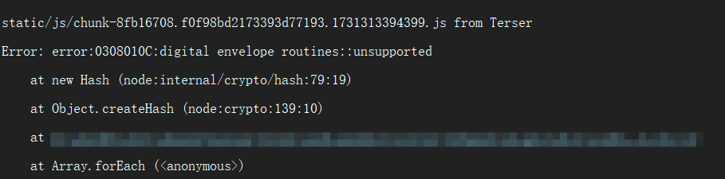
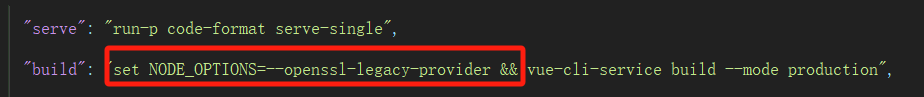

# 【BUG解决】Node打包失败[Error: error:0308010C:digital envelope routines::unsupported]

## 一、出现问题

+ 更换新电脑后，安装了新版本node（20.15.0），发现使用打包命令`vue-cli-service build --mode production` 时会报错，报错信息如下

  

  ```
  [Error: error:0308010C:digital envelope routines::unsupported]
  ```

+ 在搜索后，发现原因可能是node版本的问题，node17之前该命令可以正常运行，但是在17之后，由于`OpenSSL3.0`的发布，对允许算法和秘钥大小进行了严格限制，导致运行会报错。


## 二、解决措施

+ 方法一：降低node版本，可以卸载新版的node，安装node16版本；

+ 方法二：在运行项目命令前，先运行一下语句：

  + Windows：

    ```cmd
    set NODE_OPTIONS=--openssl-legacy-provider 
    ```

  + Linux && Mac

    ```cmd
    export NODE_OPTIONS=--openssl-legacy-provider 
    ```

+ 方法三：修改配置文件，在`package.json` 文件中找到打包语句，然后再前面添加上面方法二中的语句 + &&

  

  
