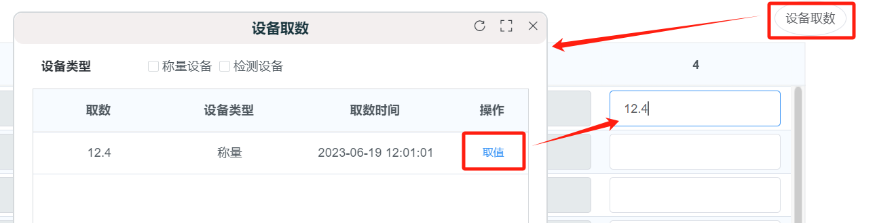

# 网页悬浮窗口

## 需求场景

+ 项目中集成了设备取数的功能，而在和设备取数现场人员对接的时候，发现设备无法绑定样品，也无法实时取数，所以设备获取到的数据就会不定时的通过接口保存到项目的数据库中。而在软件系统中，需要能获取到设备取数的数值，然后填写到对应的输入框。
+ 之前我的做法是通过实时数据来获取设备取到的数据，这种方法并不够严谨。之后遇到这个不定时取数的问题，就可以连同之前的问题也进行优化。
+ 在代码层面的需求应该是：
  + 可以展示设备取数数据
  + 可以选择数据，并填写到输入框内
  + 不影响其他地方的操作，即设备取数和其他功能应该是相互独立，互不影响的
  + 符合操作习惯，易于操作

## 解决构想

+ 首先，弹出层`el-dialog` 应该是无法满足这个需求的，因为弹出层组件会在弹出层弹出后，其他地方都会无法操作，只能操作弹出层之内的内容。所以我就寻思自己写一个组件，来实现既展示了设备取数数据，又可以操作其他地方。

+ 我在别的系统中曾看到过类似的功能，是通过一个悬浮按钮【设备取数】，点击后会弹出一个悬浮窗口，里面展示的是设备取数的列表数据，可以获取到该功能开启后取到的所有数据，可以自行选择，然后选中的数据会自动填写在输入框内。

+ 所以我想着可不可以类似这样做两个组件，一个是悬浮按钮，另一个是悬浮窗口，这样应该可以满足以上需求。

+ 构想：

  + 做成两个可复用的公共组件，一来需要在不同页面复用，二来以后有类似需求可以接着改进复用
  + 做成悬浮窗，与页面相互独立，不会互相影响
  + 需要可以拖拽移动位置，可以手动调节悬浮窗口的大小，防止遮挡页面内容

+ 最终成果图

  

## 代码

### 悬浮窗口

#### 组件拖拽

#### 调节窗口大小

#### 悬浮在其他组件之上

### 悬浮按钮

+ 

