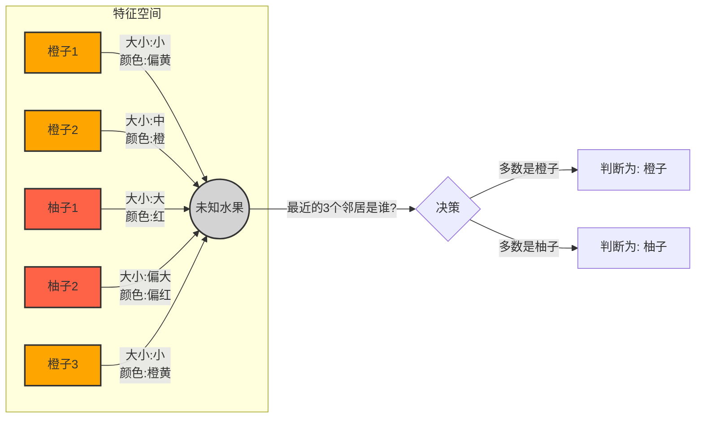

# 前言

《算法图解》第十章将我们带入机器学习的有趣世界，介绍了一个非常直观且基础的算法——**K最近邻算法 (K-Nearest Neighbors, KNN)**。KNN 是一种基于实例的学习方法，也就是说，它并不显式地学习一个判别函数，而是直接从训练数据中找到与新输入实例最相似的 K 个邻居，然后根据这些邻居的特性来对新实例进行分类或回归。这个算法简单却强大，是理解许多更复杂机器学习概念的良好起点。

# 一、K最近邻算法 (KNN) 简介

## （一）核心思想

KNN 的核心思想非常朴素，可以用"物以类聚，人以群分"来概括。当我们遇到一个未知类别（或未知数值）的新样本时，我们会查看在特征空间中与它"最近"的 K 个已知类别的样本（即它的"邻居"）。
*   对于**分类**问题，新样本的类别将由这 K 个邻居中数量最多的类别决定。
*   对于**回归**问题，新样本的预测值通常是这 K 个邻居对应值的平均值。

## （二）一个简单的例子：水果分类

想象一下，我们有一些已知是橙子或柚子的水果，并且我们记录了它们的两个特征：**大小**和**颜色（红色程度）**。我们可以将这些水果在二维图上表示出来。

当出现一个未知水果时，我们测量它的大小和红色程度，然后在图上找到它的位置。接着，我们找到离它最近的 K 个已知水果。如果 K=3，并且这3个邻居中有2个是橙子，1个是柚子，那么我们就倾向于判断这个未知水果是橙子。

# 二、KNN 的工作原理

KNN 算法的运作主要包含以下几个步骤：

## （一）特征提取 (Feature Extraction)

1.  **什么是特征**：特征是描述一个物品、个体或现象的可测量的、可量化的属性。例如，对于水果，特征可以是颜色、大小、重量、甜度等；对于电影推荐系统中的用户，特征可以是他们对不同类型电影的评分。
2.  **如何将事物转换为数字**：为了让算法能够处理，我们需要将这些特征转换为数值形式。这样，每个样本就可以被表示为特征空间中的一个点（或向量）。例如，一个水果可以表示为 `(大小值, 颜色值)`。
3.  **挑选合适的特征至关重要**：选择的特征直接影响 KNN 算法的性能。
    *   特征应与预测目标紧密相关（例如，预测用户是否喜欢一部科幻电影，那么他对其他科幻电影的评分是很相关的特征，而他对烹饪节目的评分可能就不太相关）。
    *   特征应不带偏见（例如，如果只用喜剧片的评分来推荐电影，那么系统可能永远不会推荐动作片）。

## （二）距离计算

一旦样本被表示为特征空间中的点，我们就需要一种方法来衡量点与点之间的"距离"或"相似度"。

1.  **欧几里得距离 (Euclidean Distance)**：这是《算法图解》中最常提及也是最常用的距离度量方法。对于两个n维点 `P(p1, p2, ..., pn)` 和 `Q(q1, q2, ..., qn)`，它们之间的欧几里得距离定义为：
    \[ d(P, Q) = \sqrt{(p_1-q_1)^2 + (p_2-q_2)^2 + ... + (p_n-q_n)^2} \]
2.  **余弦相似度 (Cosine Similarity)**：在某些场景，尤其是文本分析或推荐系统中，余弦相似度可能更受欢迎。它衡量的是两个向量方向的相似性，而不是它们的大小。对于用户评分这类数据，如果一个用户打分普遍偏高，另一个用户打分普遍偏低，但他们的喜好趋势一致，余弦相似度能更好地捕捉这种相似性，而欧几里得距离可能会因为绝对分值的差异而认为他们不相似。

## （三）找到 K 个最近邻

对于一个新的未知样本，计算它与训练数据集中所有已知样本之间的距离。然后，根据计算出的距离对所有已知样本进行排序，并选取距离最小的前 K 个样本作为"最近邻"。

## （四）决策

根据这 K 个最近邻的特性来对新样本进行预测：

1.  **分类问题**：采用"多数表决" (Majority Vote) 的原则。即查看这 K 个邻居都属于哪个类别，新样本的类别就被定为 K 个邻居中出现次数最多的那个类别。
2.  **回归问题**：通常是取这 K 个邻居的目标变量值的**平均数**作为新样本的预测值。例如，预测用户会给某电影打多少分，可以取 K 个最相似用户对该电影评分的平均值。

# 三、KNN 的应用场景

KNN 因其简单和直观性，被广泛应用于多种场景：

## （一）分类 (Classification)

*   **物品分类**：如前所述的水果分类，根据花的特征判断其种类等。
*   **文本分类**：如垃圾邮件过滤（虽然朴素贝叶斯更常用，但 KNN 也可以用于简单场景），根据新闻内容判断其主题。
*   **图像识别**：如手写数字识别 (OCR)。通过提取图像特征（如笔画、点、曲线），然后与大量已知数字图像的特征进行比较。
*   **生物信息学**：例如根据基因表达数据对癌症类型进行分类。

## （二）回归 (Regression)

*   **预测数值**：例如，根据房屋的特征（面积、位置、房间数等）预测其价格。
*   **推荐系统**：预测用户对某个物品的评分。例如，Netflix 通过找到与你品味相似的用户（邻居），然后看这些邻居对你没看过的电影的评分，取平均值来预测你可能会给这部电影打多少分。
*   **商业预测**：例如，根据天气、是否节假日、促销活动等因素预测商店某一天的面包销量。

# 四、使用 KNN 的关键考量

## （一）选择合适的 K 值

K 值的选择对 KNN 算法的性能有显著影响：
*   **较小的 K 值** (例如 K=1)：模型会对训练数据中的噪声非常敏感。如果一个近邻点恰好是噪声或异常值，预测结果就可能出错。这容易导致**过拟合 (Overfitting)**。
*   **较大的 K 值**：模型会更平滑，能减少噪声的影响。但如果 K 值过大，可能会包含一些与待预测样本不太相关的点，导致预测结果偏离真实情况，引入偏差。这容易导致**欠拟合 (Underfitting)**。
*   **选择方法**：通常没有一个固定的最优 K 值。一种常见的经验法则是 K 取为训练样本数量 N 的平方根 (sqrt(N))，但这并非总是最佳。更严谨的方法是使用**交叉验证 (Cross-Validation)** 来测试不同的 K 值，并选择在验证集上表现最好的那个。

## （二）特征缩放/归一化 (Feature Scaling/Normalization)

如果 KNN 算法中使用的各个特征的数值范围（量纲）差异很大，例如一个特征的范围是 0-1，而另一个特征的范围是 0-10000，那么在计算欧几里得距离时，数值范围大的特征会对距离的计算产生不成比例的巨大影响，而数值范围小的特征的作用可能被忽略。

为了避免这种情况，通常需要对特征进行**缩放**或**归一化**处理，将所有特征的值转换到相似的数值范围内（例如，[0, 1] 或均值为0方差为1）。

《算法图解》的练习中提到，如果不同用户打分标准不一（一个用户倾向打高分，一个用户倾向打低分），可以使用归一化，例如计算每个用户的平均分，并据此调整评分，使得比较基础一致。

## （三）加权 KNN (Weighted KNN)

标准的 KNN 中，K 个邻居在决策时的"发言权"是相同的。在加权 KNN 中，可以根据邻居与待预测样本的距离来赋予不同的权重。通常，距离越近的邻居权重越大，距离越远的邻居权重越小。这样，更相关的邻居会对预测结果产生更大的影响。

《算法图解》的练习中也提到，可以给"意见领袖"的评分更大的权重。

# 五、KNN 算法的优缺点

## （一）优点

1.  **简单直观**：算法原理简单，易于理解和实现。
2.  **无需显式训练**：KNN 是一种惰性学习 (Lazy Learning) 算法，它没有明确的训练阶段。所谓的"训练"仅仅是存储训练数据集。这使得添加新数据非常容易。
3.  **非参数模型**：KNN 对数据的基本分布没有假设，因此可以适用于各种分布的数据。
4.  **天然支持多分类**：可以直接用于多分类问题，而无需像某些算法那样做特殊处理（如一对多或一对一策略）。

## （二）缺点

1.  **计算成本高**：在预测阶段，需要计算新样本与所有训练样本之间的距离。当训练样本数量非常大时，这个过程会非常耗时。时间复杂度通常是 O(N*D)，其中 N 是训练样本数，D 是特征维度。
2.  **内存需求大**：需要存储整个训练数据集。
3.  **对无关特征和噪声敏感**：如果数据中包含大量无关特征，或者特征的尺度不一致，KNN 的性能可能会受到很大影响。对异常值也比较敏感。
4.  **维度灾难**：随着特征维度的增加，高维空间中的点之间的距离概念可能变得不那么有意义（所有点之间的距离都可能趋于相似），这会降低 KNN 的性能。在高维空间中，找到"近邻"也变得更加困难。
5.  **需要选择合适的 K 值**：K 值的选择是一个比较棘手的问题，通常需要通过实验来确定。

# 六、机器学习简介（根据《算法图解》的引入方式）

《算法图解》通过 KNN 算法自然地引入了机器学习的一些基本概念：

## （一）什么是机器学习

机器学习的核心目标是让计算机能够从数据中"学习"并做出预测或决策，而无需针对每个特定任务进行显式编程。

## （二）训练 (Training)

大多数机器学习算法（尤其是监督学习算法如KNN）都需要一个"训练"阶段。对于 KNN 来说，训练阶段非常简单，主要是将带有已知标签（或值）的训练数据存储起来。对于其他更复杂的算法，训练阶段可能涉及学习模型参数的过程。

## （三）OCR 示例

光学字符识别 (Optical Character Recognition, OCR) 是一个经典的机器学习应用。KNN 可以用于此：
1.  **训练**：收集大量已知的手写数字（或字符）图像，并为每个图像提取特征（例如，图像中黑点的分布、线条的走向、闭合环的数量等）。
2.  **预测**：当遇到一个新的未知数字图像时，同样提取其特征，然后使用 KNN 找到特征最相似的 K 个已知数字图像，通过多数表决来识别这个新数字。

## （四）垃圾邮件过滤器示例

虽然《算法图解》中提到垃圾邮件过滤器通常使用朴素贝叶斯分类器，但 KNN 也可以用于简单的场景。其思路是提取邮件的特征（例如，特定词汇的出现频率），然后与已知是垃圾邮件或非垃圾邮件的邮件特征进行比较。

## （五）预测股票市场的难度

书中也指出了机器学习并非万能，例如预测股票市场就非常困难。因为影响股票市场的因素极其复杂且多变，很难提取到稳定且预测性强的特征。未来是难以精确预测的。

# 七、总结

K最近邻 (KNN) 算法是一种简单而强大的有监督学习算法，可用于分类和回归任务。它基于"近朱者赤，近墨者黑"的直觉，通过查找与新样本最相似的 K 个已知样本来进行预测。KNN 的成功在很大程度上依赖于合适的特征选择、K 值的确定以及有效的距离度量。尽管它存在计算成本高和对大数据集内存需求大等缺点，但其易理解性和实现简单性使其成为入门机器学习的绝佳选择，并且在许多实际问题中仍能取得不错的效果。

# 八、参考资料

- 《算法图解》（Grokking Algorithms）by Aditya Y. Bhargava
- [《算法图解》学习笔记（十）：K 最近邻算法（附代码） - CSDN博客](https://blog.csdn.net/TeFuirnever/article/details/101064887)
- [[笔记]《算法图解》第十章K最近邻算法 - 博客园](https://www.cnblogs.com/everfight/p/grokking_algorithms_note_10.html)
- [Chapter 10. K-nearest neighbors · Grokking Algorithms - Manning Publications](https://livebook.manning.com/book/grokking-algorithms/chapter-10/54) 