# 搭建个人博客网站

## 一、准备环境

### 1、安装node

### 2、安装npm

### 3、安装hexo

+ ```shell
  npm install -g hexo
  hexo -v
  ```

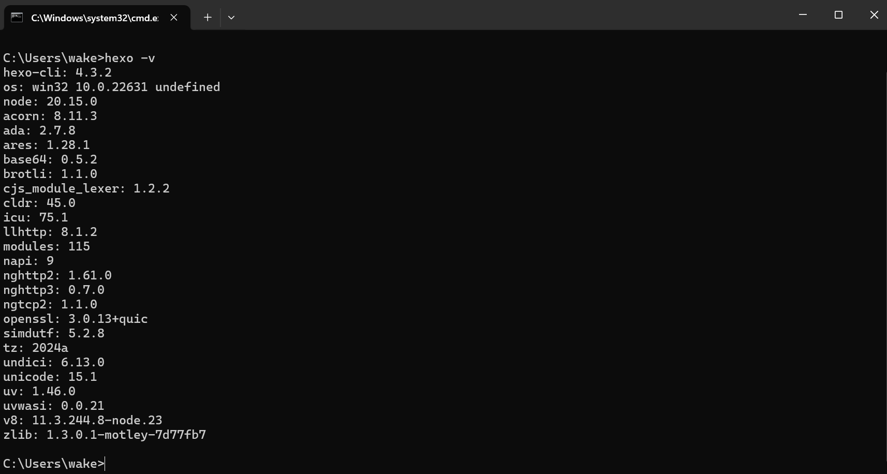


## 二、Git仓库准备

### 1、新建git仓库

### 2、本地同步git仓库

+ 在一个空白文件夹中，右键打开git bash，输入命令，将git仓库拉下来

  ```shell
  git clone ssh链接
  ```

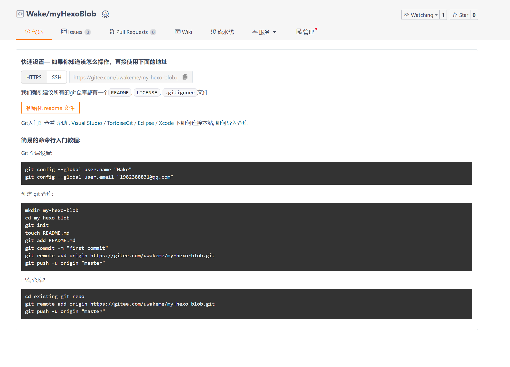

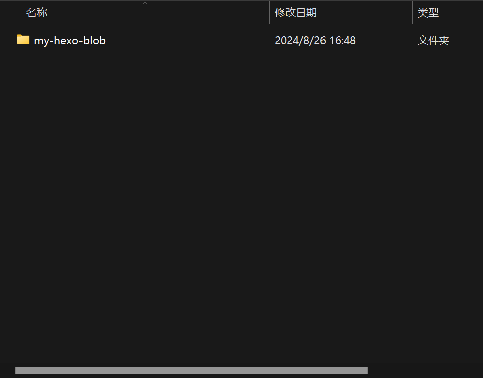


## 三、Hexo博客搭建

### 1、基础环境搭建

+ 进入到刚拉下来的文件夹中，打开cmd

  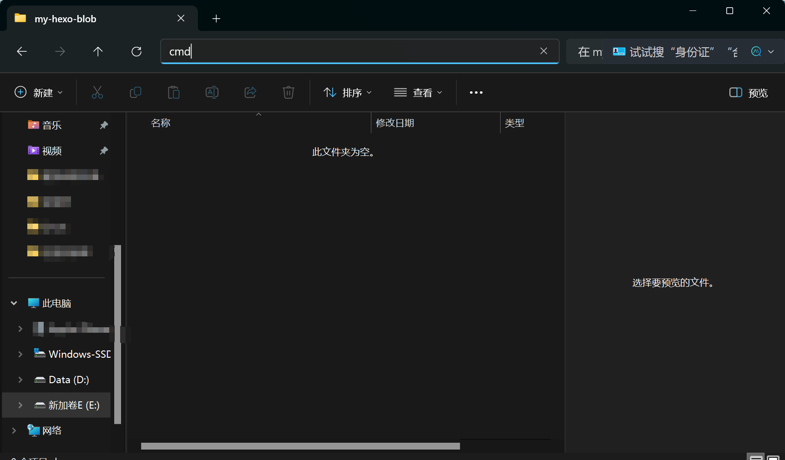

+ 初始化指令

  ```shell 
  hexo init myHexoBlob
  ```

  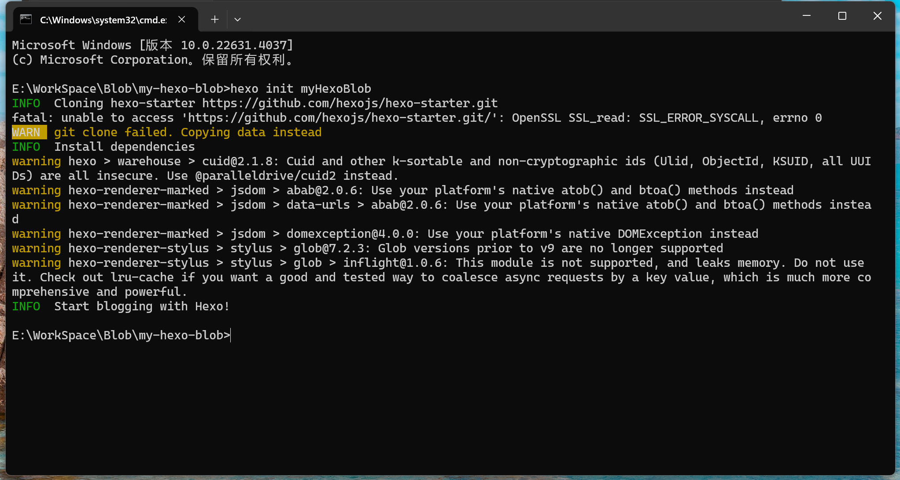

  这样hexo的配置文件就初始化好了

+ 然后重新用管理员运行cmd，并切换到hexo新生成的文件夹中，安装依赖

  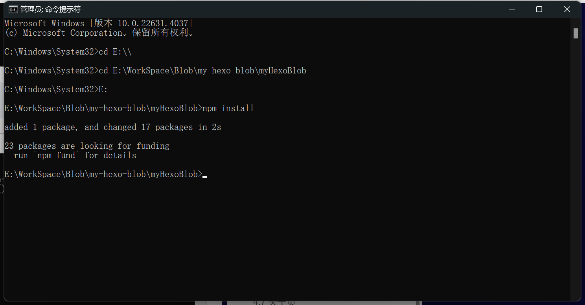

### 2、启动hexo

```shell
# 每次更改数据后都要执行下面三个命令
# 清除缓存文件
hexo clean
# 生成静态文件 可简写为 hexo g
hexo generate   
# 启动服务器 可简写为 hexo s
hexo server

```

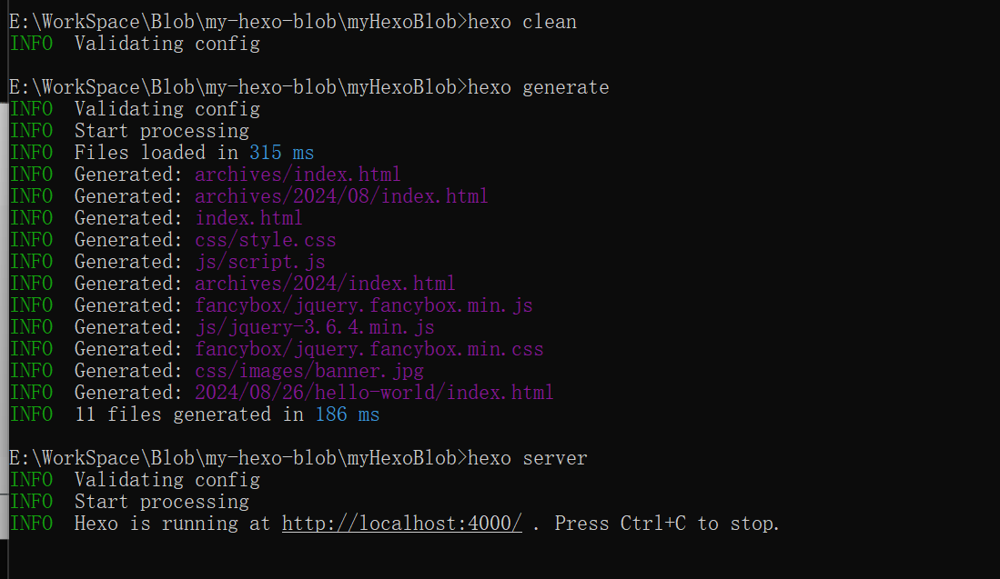

### 3、更换主题

+ 以管理员身份运行命令提示符，切换当前目录到 hexo项目 目录，运行命令

  ```shell
  npm install --save hexo-theme-fluid
  ```

  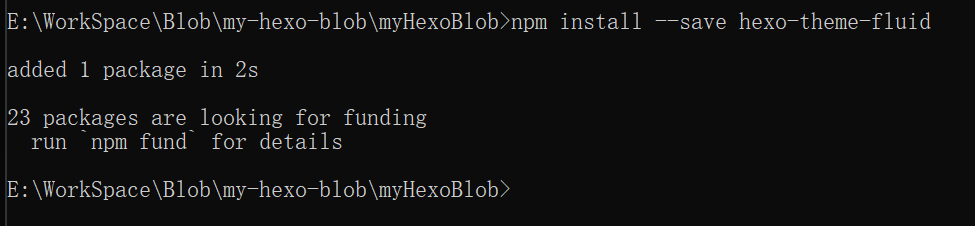

+ 修改hexo的配置文件

  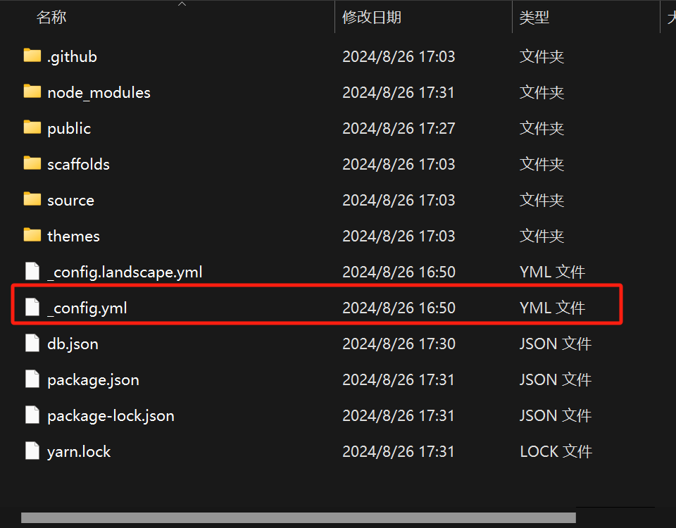

  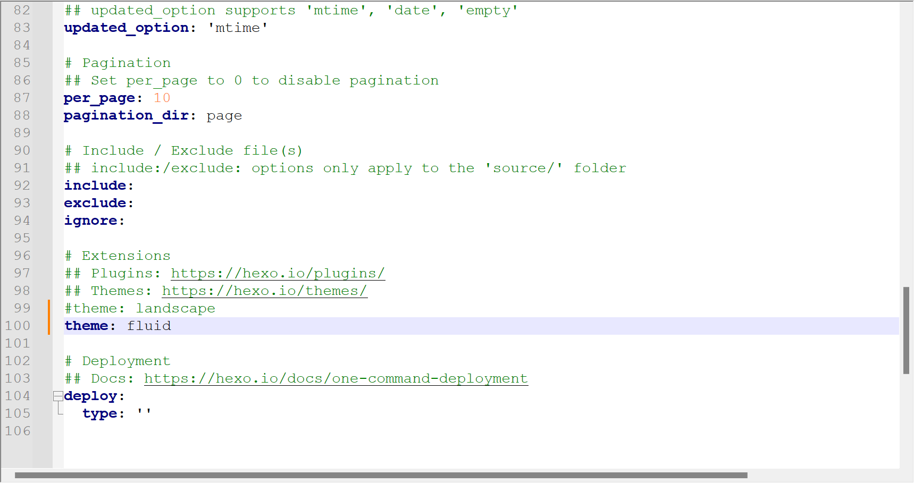

  在 myblog 目录下新建一个文件，命名为 `_config.fluid.yml` , 只要存在于 `_config.fluid.yml` 的配置都是高优先级，修改原 `_config.yml` 是无效的。以后我们就对 `_config.fluid.yml` 进行修改即可。

+ 重新编译并重启项目即可

  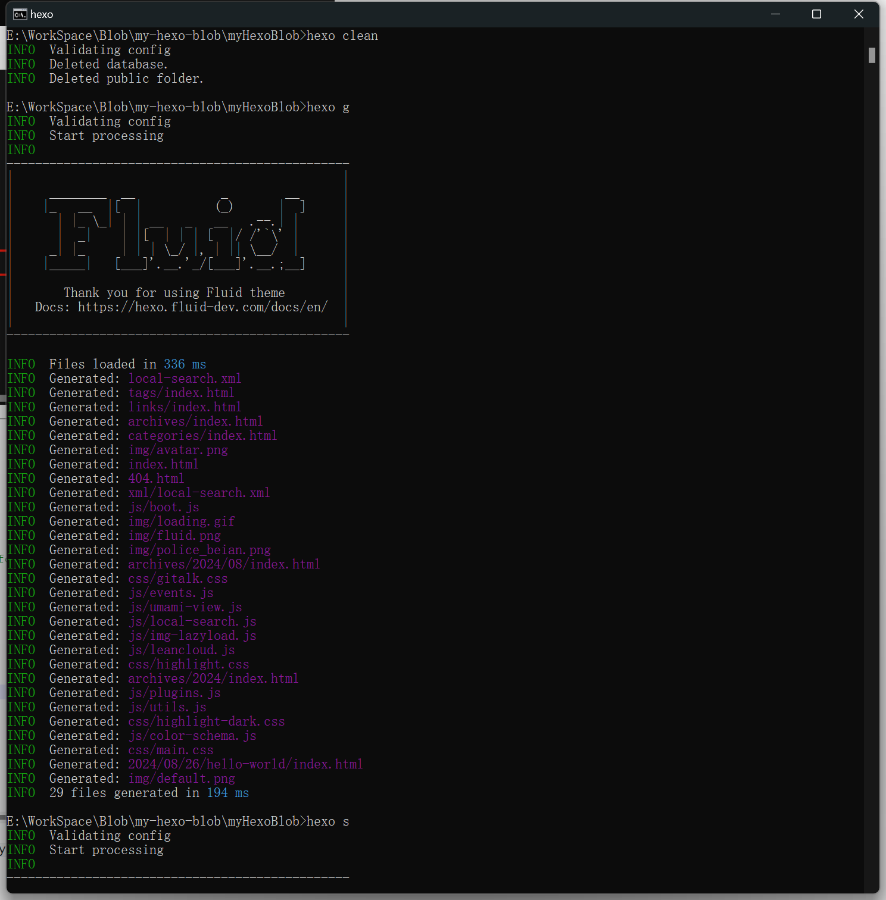


### 4、自定义配置

