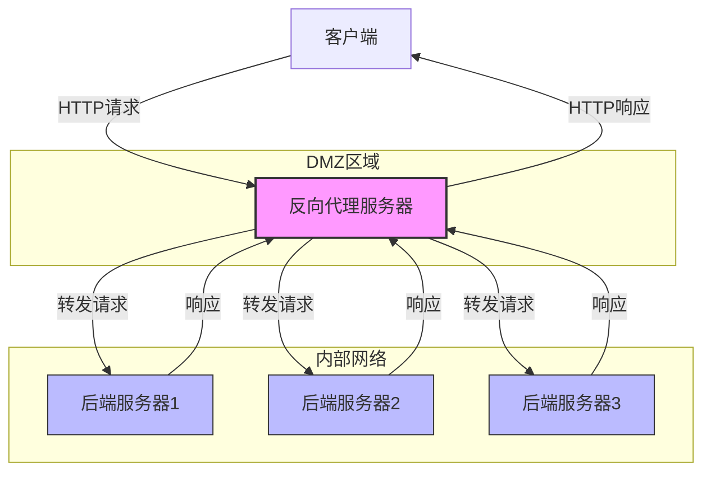

# 一、代理概述

## （一）什么是代理

代理（Proxy）是一种网络通信服务，充当客户端和服务器之间的中介。当客户端需要从服务器请求资源时，它首先将请求发送给代理服务器，代理服务器再将请求转发到目标服务器，获取响应后再返回给客户端。

在这个过程中，代理服务器扮演了"中间人"的角色，可以执行各种功能，如缓存、过滤、负载均衡、匿名访问等。

## （二）代理的基本工作原理

代理的基本工作流程如下：

1. 客户端配置使用代理服务器
2. 客户端发送请求到代理服务器
3. 代理服务器接收请求，进行必要的处理（如修改请求头、验证权限等）
4. 代理服务器将请求转发到目标服务器
5. 目标服务器处理请求并返回响应给代理服务器
6. 代理服务器接收响应，进行必要的处理
7. 代理服务器将响应返回给客户端


# 二、代理的类型

## （一）按功能分类

### 1. 正向代理（Forward Proxy）

正向代理代表客户端向服务器发起请求。服务器只知道请求来自代理服务器，而不知道原始客户端的信息。

**主要特点**：
- 隐藏客户端真实IP
- 访问原本无法访问的资源
- 绕过区域限制
- 内容过滤和访问控制

**应用场景**：
- 企业内部访问外部网络
- 绕过地理限制访问内容
- 匿名浏览网页

### 2. 反向代理（Reverse Proxy）

反向代理代表服务器接收客户端的请求。客户端只知道它在与代理服务器通信，而不知道背后的实际服务器。

**工作原理**：
1. 客户端向反向代理服务器发送请求（如访问网站www.example.com）
2. 反向代理服务器接收请求并决定将请求转发给哪台后端服务器
3. 后端服务器处理请求并将响应返回给反向代理
4. 反向代理将响应返回给客户端，客户端认为响应直接来自反向代理服务器



**主要特点**：
- 隐藏服务器真实IP和架构，增强安全性
- 实现负载均衡，将请求分发到多台服务器
- SSL终结（在代理层处理加密/解密，减轻后端服务器负担）
- 缓存静态内容，提高响应速度
- 提供统一入口，简化客户端配置
- 可实现故障转移，提高系统可用性

**应用场景**：
- 网站负载均衡：将流量均匀分配到多个服务器，避免单点故障
- 保护内部服务器安全：作为应用防火墙，过滤恶意请求
- CDN（内容分发网络）：在全球范围内分发内容，提高访问速度
- API网关：统一管理API请求，实现认证、限流等功能
- 微服务架构：作为服务网关，路由请求到不同的微服务

**与正向代理的区别**：
- 正向代理代表**客户端**，对服务器隐藏客户端；反向代理代表**服务器**，对客户端隐藏服务器
- 正向代理需要客户端配置；反向代理对客户端透明，无需特殊配置
- 正向代理主要用于访问限制内容；反向代理主要用于保护和优化服务器

### 3. 透明代理（Transparent Proxy）

透明代理在客户端不需要任何特殊配置的情况下工作，客户端甚至可能不知道代理的存在。

**主要特点**：
- 客户端无需配置
- 通常由网络管理员部署
- 可用于内容过滤和监控

**应用场景**：
- 企业网络监控
- 内容过滤
- 家长控制
- ISP级别的缓存

## （二）按协议分类

### 1. HTTP代理

专门用于处理HTTP/HTTPS请求的代理服务器。

**特点**：
- 只处理HTTP/HTTPS协议
- 可以缓存网页内容
- 支持内容过滤

### 2. SOCKS代理

一种通用的代理协议，支持任何基于TCP/UDP的应用层协议。

**特点**：
- 协议无关，支持多种网络协议
- 不理解或修改应用层数据
- 常见版本有SOCKS4、SOCKS5（增加了认证和UDP支持）

### 3. FTP代理

专门用于FTP协议的代理服务器。

### 4. SMTP代理

用于电子邮件传输的代理服务器。

## （三）按匿名级别分类

### 1. 透明代理（Transparent）
不隐藏客户端IP，服务器知道请求来自代理且能看到原始IP。

### 2. 匿名代理（Anonymous）
服务器知道请求来自代理，但无法获知客户端的真实IP。

### 3. 高匿代理（Elite/High Anonymity）
服务器既不知道请求来自代理，也不知道客户端的真实IP。

# 三、代理的应用场景

## （一）反向代理的核心应用

### 1. 微服务架构中的API网关
反向代理作为API网关，为微服务架构提供统一的入口点，处理路由、认证、限流等横切关注点。

```
客户端 → API网关(反向代理) → 微服务A/微服务B/微服务C
```

### 2. 高可用性与故障转移
反向代理监控后端服务器健康状态，当检测到服务器故障时，自动将流量转移到健康的服务器。

```nginx
# Nginx故障转移配置示例
upstream backend {
    server backend1.example.com max_fails=3 fail_timeout=30s;
    server backend2.example.com max_fails=3 fail_timeout=30s;
}
```

### 3. 多环境部署与蓝绿发布
通过反向代理实现无缝的版本切换和部署策略。

```nginx
# 蓝绿部署示例
upstream blue {
    server blue1.example.com;
    server blue2.example.com;
}

upstream green {
    server green1.example.com;
    server green2.example.com;
}

server {
    listen 80;
    
    # 通过修改此变量切换环境
    set $deployment_group blue;
    
    location / {
        proxy_pass http://$deployment_group;
    }
}
```

### 4. 安全防护层
作为Web应用防火墙(WAF)的一部分，过滤恶意请求、防止SQL注入和XSS攻击。

```nginx
# 安全配置示例
location / {
    # 防止SQL注入
    if ($query_string ~* "union.*select.*") {
        return 403;
    }
    
    # 限制请求速率
    limit_req zone=one burst=5;
    
    proxy_pass http://backend;
}
```

## （二）网络安全与隐私保护

### 1. 匿名浏览
通过代理隐藏真实IP地址，保护个人隐私。

### 2. 访问控制
限制特定网站的访问，实现内容过滤。

### 3. 防火墙功能
作为安全边界，过滤恶意流量。

## （二）网络性能优化

### 1. 内容缓存
缓存频繁访问的资源，减少带宽使用并提高访问速度。

```bash
# Squid代理服务器缓存配置示例
cache_dir ufs /var/spool/squid 10000 16 256
```

### 2. 负载均衡
分散请求到多个服务器，提高系统整体性能和可用性。

```nginx
# Nginx反向代理负载均衡配置示例
upstream backend {
    server backend1.example.com weight=5;
    server backend2.example.com;
    server backup1.example.com backup;
}

server {
    location / {
        proxy_pass http://backend;
    }
}
```

### 3. 内容分发网络（CDN）
将内容分发到全球各地的服务器，提高访问速度。

## （三）网络连接问题解决

### 1. 绕过网络限制
访问被地理位置或网络策略限制的内容。

### 2. 解决跨网络访问
连接不同网络环境中的资源。

### 3. 稳定性提升
在网络不稳定的情况下提供更可靠的连接。

# 四、常见代理服务器软件

## （一）开源代理软件

### 1. Squid
功能丰富的缓存和代理服务器，支持HTTP、HTTPS、FTP等协议。

**安装示例**：
```bash
# Ubuntu/Debian
sudo apt install squid

# CentOS/RHEL
sudo yum install squid
```

**基本配置**：
```
# 监听端口
http_port 3128

# 访问控制
acl localnet src 192.168.0.0/16
http_access allow localnet
http_access deny all
```

### 2. Nginx
除了作为Web服务器外，还可作为高性能的反向代理服务器，是当前最流行的反向代理解决方案之一。

**主要优势**：
- 高性能：能够处理大量并发连接
- 低内存消耗：相比Apache等服务器占用更少的系统资源
- 高度模块化：功能可通过模块扩展
- 支持热部署：配置修改无需重启服务

**反向代理配置示例**：
```nginx
# 定义上游服务器组
upstream backend_servers {
    server 192.168.1.10:8080;
    server 192.168.1.11:8080;
    server 192.168.1.12:8080 backup;  # 备用服务器
    
    # 负载均衡策略
    # least_conn;  # 最少连接数
    # ip_hash;     # 基于IP的会话保持
    # hash $request_uri;  # 基于URI的哈希
}

server {
    listen 80;
    server_name example.com;
    
    # 启用压缩
    gzip on;
    gzip_types text/plain text/css application/javascript;
    
    # 静态文件缓存
    location ~* \.(jpg|jpeg|png|gif|ico|css|js)$ {
        expires 30d;
    }
    
    # 反向代理配置
    location / {
        proxy_pass http://backend_servers;
        
        # 传递客户端信息到后端服务器
        proxy_set_header Host $host;
        proxy_set_header X-Real-IP $remote_addr;
        proxy_set_header X-Forwarded-For $proxy_add_x_forwarded_for;
        proxy_set_header X-Forwarded-Proto $scheme;
        
        # 超时设置
        proxy_connect_timeout 5s;
        proxy_send_timeout 10s;
        proxy_read_timeout 10s;
        
        # 缓冲设置
        proxy_buffering on;
        proxy_buffer_size 16k;
        proxy_busy_buffers_size 24k;
        
        # 错误处理
        proxy_next_upstream error timeout http_500;
    }
    
    # 健康检查状态页面
    location /status {
        stub_status on;
        allow 127.0.0.1;
        deny all;
    }
}
```

**反向代理常见应用场景**：
1. **负载均衡**：分发流量到多个后端服务器
2. **SSL终结**：在Nginx层处理HTTPS，后端服务器只需处理HTTP
3. **缓存加速**：缓存静态资源，减轻后端服务器负担
4. **安全防护**：限制连接数、IP访问控制、防止DDoS攻击
5. **URL重写与重定向**：修改请求URL或将请求重定向到其他位置

### 3. HAProxy
专注于负载均衡和高可用性的代理服务器。

### 4. Privoxy
注重隐私保护的Web代理。

### 5. Shadowsocks
轻量级加密代理软件。

## （二）商业代理服务

### 1. VPN服务
提供加密隧道和代理功能的综合服务。

### 2. 云代理服务
由云服务提供商提供的代理服务。

### 3. CDN服务
如Cloudflare、Akamai等提供的内容分发网络服务。

# 五、代理配置实践

## （一）浏览器代理配置

### 1. Chrome浏览器配置

1. 打开"设置" → "高级" → "系统" → "打开代理设置"
2. 在系统代理设置中配置代理服务器

### 2. Firefox浏览器配置

1. 打开"选项" → "常规" → "网络设置"
2. 选择"手动代理配置"并填入代理服务器信息

## （二）系统级代理配置

### 1. Windows系统

1. 打开"设置" → "网络和Internet" → "代理"
2. 配置手动代理设置

### 2. Linux系统

**环境变量方式**：
```bash
# 设置HTTP代理
export http_proxy=http://proxy_server:port
export https_proxy=http://proxy_server:port

# 设置SOCKS代理
export ALL_PROXY=socks5://proxy_server:port
```

**系统设置方式**：
```bash
# Ubuntu/Debian系统
gsettings set org.gnome.system.proxy mode 'manual'
gsettings set org.gnome.system.proxy.http host 'proxy_server'
gsettings set org.gnome.system.proxy.http port port_number
```

### 3. macOS系统

1. 打开"系统偏好设置" → "网络" → "高级" → "代理"
2. 选择代理类型并配置服务器信息

## （三）应用程序代理配置

### 1. Git配置

```bash
# 设置HTTP代理
git config --global http.proxy http://proxy_server:port
git config --global https.proxy http://proxy_server:port

# 取消代理设置
git config --global --unset http.proxy
git config --global --unset https.proxy
```

### 2. npm配置

```bash
# 设置代理
npm config set proxy http://proxy_server:port
npm config set https-proxy http://proxy_server:port

# 取消代理
npm config delete proxy
npm config delete https-proxy
```

### 3. Docker配置

编辑或创建 `/etc/docker/daemon.json`：
```json
{
  "proxies": {
    "http-proxy": "http://proxy_server:port",
    "https-proxy": "http://proxy_server:port",
    "no-proxy": "localhost,127.0.0.1"
  }
}
```

# 六、代理安全考虑

## （一）潜在风险

### 1. 中间人攻击
恶意代理可能会监控、记录或修改通过它的流量。

### 2. 数据泄露
不安全的代理可能会泄露用户信息。

### 3. 恶意代理
某些免费代理可能会注入广告、恶意代码或收集用户数据。

## （二）安全使用建议

### 1. 使用加密连接
优先选择支持HTTPS的代理服务。

### 2. 验证代理提供商
选择信誉良好的代理服务提供商。

### 3. 使用VPN代替普通代理
VPN提供端到端加密，比普通代理更安全。

### 4. 定期更换代理
不要长期使用同一个代理服务器，特别是公共代理。

### 5. 避免敏感操作
不要通过不可信的代理进行银行交易等敏感操作。

# 七、总结与展望

代理服务器作为网络通信中的重要组件，在提供匿名访问、绕过限制、优化性能等方面发挥着重要作用。随着网络安全和隐私保护意识的提高，代理技术也在不断发展，如加密代理、智能代理等新技术不断涌现。

在实际应用中，应根据具体需求选择合适的代理类型和配置方式，同时注意安全风险，确保网络通信的安全性和有效性。

## 参考资料

- [RFC 7230-7235: HTTP/1.1](https://tools.ietf.org/html/rfc7230)
- [RFC 1928: SOCKS Protocol Version 5](https://tools.ietf.org/html/rfc1928)
- [Squid官方文档](http://www.squid-cache.org/Doc/)
- [Nginx代理模块文档](https://nginx.org/en/docs/http/ngx_http_proxy_module.html)
- [HAProxy文档](http://www.haproxy.org/#docs)
- [MDN Web Docs: HTTP代理](https://developer.mozilla.org/en-US/docs/Web/HTTP/Proxy_servers_and_tunneling) 