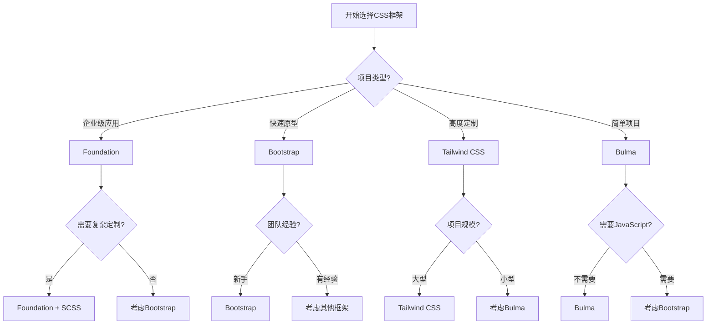

# 前言

CSS框架是预先编写好的CSS代码库，提供了一套完整的样式系统和组件库，帮助开发者快速构建美观、响应式的Web界面。就像建筑师使用标准化的建筑模块一样，CSS框架为前端开发提供了标准化的UI组件和布局系统。本文将详细介绍主流CSS框架的特点、优缺点和使用场景，帮助开发者选择最适合项目需求的框架。

# 一、CSS框架概述

## （一）什么是CSS框架

**CSS框架的定义：**
CSS框架是一个预先准备好的软件框架，旨在允许更容易、更符合标准的网页设计。它包含了一系列预定义的CSS类、组件和布局系统，类似于软件开发中的代码库或模板。

**CSS框架的核心组成：**
```css
/* CSS框架通常包含以下核心部分，类似于完整的设计系统 */

/* 1. 重置样式：统一不同浏览器的默认样式 */
* {
    margin: 0;
    padding: 0;
    box-sizing: border-box;       /* 统一盒模型，类似于标准化基础 */
}

/* 2. 栅格系统：响应式布局的基础，类似于建筑的框架结构 */
.container {
    max-width: 1200px;            /* 容器最大宽度 */
    margin: 0 auto;               /* 居中对齐 */
    padding: 0 15px;              /* 左右内边距 */
}

.row {
    display: flex;                /* 弹性布局 */
    flex-wrap: wrap;              /* 允许换行 */
    margin: 0 -15px;              /* 负边距抵消列的内边距 */
}

.col {
    flex: 1;                      /* 等宽列 */
    padding: 0 15px;              /* 列间距 */
}

/* 3. 组件样式：预定义的UI组件，类似于标准化的零件 */
.btn {
    display: inline-block;        /* 行内块元素 */
    padding: 0.375rem 0.75rem;    /* 内边距 */
    font-size: 1rem;              /* 字体大小 */
    border: 1px solid transparent; /* 边框 */
    border-radius: 0.25rem;       /* 圆角 */
    cursor: pointer;              /* 鼠标指针 */
    transition: all 0.15s ease-in-out; /* 过渡效果 */
}

.btn-primary {
    background-color: #007bff;    /* 主色调背景 */
    border-color: #007bff;        /* 边框颜色 */
    color: #fff;                  /* 文字颜色 */
}

/* 4. 工具类：快速样式应用，类似于快捷工具 */
.text-center { text-align: center; }
.text-left { text-align: left; }
.text-right { text-align: right; }

.mt-1 { margin-top: 0.25rem; }   /* margin-top: 4px */
.mt-2 { margin-top: 0.5rem; }    /* margin-top: 8px */
.mt-3 { margin-top: 1rem; }      /* margin-top: 16px */

.d-none { display: none; }       /* 隐藏元素 */
.d-block { display: block; }     /* 块级显示 */
.d-flex { display: flex; }       /* 弹性布局 */

/* 5. 响应式断点：适配不同设备，类似于自适应系统 */
@media (min-width: 576px) {      /* 小屏设备 */
    .col-sm-6 { flex: 0 0 50%; }
}

@media (min-width: 768px) {      /* 中等设备 */
    .col-md-4 { flex: 0 0 33.333333%; }
}

@media (min-width: 992px) {      /* 大屏设备 */
    .col-lg-3 { flex: 0 0 25%; }
}
```

## （二）CSS框架的优势与劣势

**优势分析：**
1. **快速开发**：预制组件减少重复编码，类似于使用模板快速建站
2. **一致性**：统一的设计语言和交互模式
3. **响应式**：内置的响应式设计，适配多种设备
4. **浏览器兼容**：框架处理了大部分兼容性问题
5. **社区支持**：丰富的文档、插件和社区资源
6. **最佳实践**：集成了业界认可的设计和开发模式

**劣势分析：**
1. **文件体积**：包含大量未使用的样式，增加加载时间
2. **设计同质化**：容易产生相似的界面设计
3. **学习成本**：需要学习框架特定的类名和约定
4. **定制困难**：深度定制可能需要覆盖大量默认样式
5. **依赖性**：项目与特定框架绑定，迁移成本高

# 二、Bootstrap框架详解

## （一）Bootstrap基础概念

**Bootstrap简介：**
Bootstrap是由Twitter开发的最流行的CSS框架，采用移动优先的响应式设计理念。它就像是Web开发的"瑞士军刀"，提供了完整的UI组件库和栅格系统。

**Bootstrap核心特性：**
```html
<!-- Bootstrap的基本HTML结构，类似于标准化的文档模板 -->
<!DOCTYPE html>
<html lang="zh-CN">
<head>
    <meta charset="UTF-8">
    <meta name="viewport" content="width=device-width, initial-scale=1.0">
    <!-- Bootstrap CSS：引入框架样式 -->
    <link href="https://cdn.jsdelivr.net/npm/bootstrap@5.3.0/dist/css/bootstrap.min.css" rel="stylesheet">
    <title>Bootstrap示例</title>
</head>
<body>
    <!-- 容器：Bootstrap的基础布局容器，类似于页面的画布 -->
    <div class="container">
        <!-- 栅格系统：12列布局，类似于报纸的版面设计 -->
        <div class="row">
            <div class="col-md-8">
                <!-- 主内容区域：占8列宽度 -->
                <h1 class="display-4">欢迎使用Bootstrap</h1>
                <p class="lead">这是一个响应式的页面布局示例</p>
            </div>
            <div class="col-md-4">
                <!-- 侧边栏：占4列宽度 -->
                <div class="card">
                    <div class="card-body">
                        <h5 class="card-title">侧边栏</h5>
                        <p class="card-text">这里是侧边栏内容</p>
                    </div>
                </div>
            </div>
        </div>
    </div>
    
    <!-- Bootstrap JavaScript：交互功能支持 -->
    <script src="https://cdn.jsdelivr.net/npm/bootstrap@5.3.0/dist/js/bootstrap.bundle.min.js"></script>
</body>
</html>
```

**Bootstrap栅格系统：**
```css
/* Bootstrap栅格系统：12列布局，类似于表格的列划分 */

/* 容器类型：不同的容器适应不同需求 */
.container {
    /* 固定最大宽度的容器，类似于固定版面的报纸 */
    max-width: 1320px;            /* 超大屏幕最大宽度 */
    margin: 0 auto;               /* 居中对齐 */
    padding: 0 12px;              /* 左右内边距 */
}

.container-fluid {
    /* 全宽容器：占满整个屏幕宽度，类似于全屏应用 */
    width: 100%;
    padding: 0 12px;
}

/* 行和列：栅格系统的基础结构 */
.row {
    display: flex;                /* 弹性布局 */
    flex-wrap: wrap;              /* 允许换行 */
    margin-top: 0;
    margin-right: -12px;          /* 负边距抵消列的内边距 */
    margin-bottom: 0;
    margin-left: -12px;
}

/* 列的基础样式 */
.col {
    flex: 1 0 0%;                 /* 等宽自适应列 */
    padding: 0 12px;              /* 列间距 */
}

/* 响应式列：不同屏幕尺寸下的列宽 */
.col-1 { flex: 0 0 8.333333%; }   /* 1/12 = 8.33% */
.col-2 { flex: 0 0 16.666667%; }  /* 2/12 = 16.67% */
.col-3 { flex: 0 0 25%; }         /* 3/12 = 25% */
.col-4 { flex: 0 0 33.333333%; }  /* 4/12 = 33.33% */
.col-6 { flex: 0 0 50%; }         /* 6/12 = 50% */
.col-12 { flex: 0 0 100%; }       /* 12/12 = 100% */

/* 响应式断点：sm(≥576px), md(≥768px), lg(≥992px), xl(≥1200px), xxl(≥1400px) */
@media (min-width: 768px) {
    .col-md-6 { flex: 0 0 50%; }  /* 中等屏幕及以上：占50%宽度 */
    .col-md-8 { flex: 0 0 66.666667%; } /* 占66.67%宽度 */
}
```

## （二）Bootstrap组件系统

**常用组件示例：**
```html
<!-- Bootstrap组件：预制的UI元素，类似于乐高积木 -->

<!-- 导航栏组件：网站的导航系统 -->
<nav class="navbar navbar-expand-lg navbar-dark bg-dark">
    <div class="container">
        <!-- 品牌logo：类似于公司标识 -->
        <a class="navbar-brand" href="#">我的网站</a>
        
        <!-- 移动端切换按钮：小屏幕下的菜单按钮 -->
        <button class="navbar-toggler" type="button" data-bs-toggle="collapse" data-bs-target="#navbarNav">
            <span class="navbar-toggler-icon"></span>
        </button>
        
        <!-- 导航菜单：可折叠的菜单项 -->
        <div class="collapse navbar-collapse" id="navbarNav">
            <ul class="navbar-nav ms-auto">
                <li class="nav-item">
                    <a class="nav-link active" href="#">首页</a>
                </li>
                <li class="nav-item">
                    <a class="nav-link" href="#">关于</a>
                </li>
                <li class="nav-item dropdown">
                    <!-- 下拉菜单：多级导航 -->
                    <a class="nav-link dropdown-toggle" href="#" data-bs-toggle="dropdown">
                        服务
                    </a>
                    <ul class="dropdown-menu">
                        <li><a class="dropdown-item" href="#">网站开发</a></li>
                        <li><a class="dropdown-item" href="#">移动应用</a></li>
                        <li><hr class="dropdown-divider"></li>
                        <li><a class="dropdown-item" href="#">技术咨询</a></li>
                    </ul>
                </li>
            </ul>
        </div>
    </div>
</nav>

<!-- 卡片组件：内容展示的容器，类似于名片或海报 -->
<div class="container mt-4">
    <div class="row">
        <div class="col-md-4 mb-4">
            <div class="card h-100">
                <!-- 卡片图片：视觉吸引元素 -->
                
                <div class="card-body d-flex flex-column">
                    <!-- 卡片标题和内容 -->
                    <h5 class="card-title">网站开发</h5>
                    <p class="card-text flex-grow-1">
                        专业的网站开发服务，包括前端设计和后端开发。
                    </p>
                    <!-- 卡片操作按钮 -->
                    <a href="#" class="btn btn-primary mt-auto">了解更多</a>
                </div>
            </div>
        </div>
        
        <!-- 更多卡片... -->
    </div>
</div>

<!-- 表单组件：用户输入界面，类似于纸质表单的数字化版本 -->
<div class="container mt-4">
    <div class="row justify-content-center">
        <div class="col-md-6">
            <form class="needs-validation" novalidate>
                <!-- 输入组：标签+输入框的组合 -->
                <div class="mb-3">
                    <label for="email" class="form-label">邮箱地址</label>
                    <input type="email" class="form-control" id="email" required>
                    <!-- 验证反馈：错误提示信息 -->
                    <div class="invalid-feedback">
                        请输入有效的邮箱地址
                    </div>
                </div>
                
                <div class="mb-3">
                    <label for="password" class="form-label">密码</label>
                    <input type="password" class="form-control" id="password" required>
                    <div class="invalid-feedback">
                        密码不能为空
                    </div>
                </div>
                
                <!-- 复选框：选择性输入 -->
                <div class="mb-3 form-check">
                    <input type="checkbox" class="form-check-input" id="remember">
                    <label class="form-check-label" for="remember">
                        记住我
                    </label>
                </div>
                
                <!-- 提交按钮 -->
                <button type="submit" class="btn btn-primary w-100">登录</button>
            </form>
        </div>
    </div>
</div>
```

**Bootstrap工具类系统：**
```css
/* Bootstrap工具类：快速样式应用，类似于CSS的快捷方式 */

/* 间距工具类：m(margin)和p(padding) + 方向 + 大小 */
/* 方向：t(top), b(bottom), s(start/left), e(end/right), x(水平), y(垂直) */
/* 大小：0, 1(.25rem), 2(.5rem), 3(1rem), 4(1.5rem), 5(3rem), auto */

.m-0 { margin: 0; }               /* 无外边距 */
.m-1 { margin: 0.25rem; }         /* 小外边距 */
.m-3 { margin: 1rem; }            /* 标准外边距 */
.m-5 { margin: 3rem; }            /* 大外边距 */

.mt-2 { margin-top: 0.5rem; }     /* 上外边距 */
.mb-4 { margin-bottom: 1.5rem; }  /* 下外边距 */
.mx-auto { margin-left: auto; margin-right: auto; } /* 水平居中 */

.p-2 { padding: 0.5rem; }         /* 内边距 */
.px-3 { padding-left: 1rem; padding-right: 1rem; } /* 水平内边距 */
.py-4 { padding-top: 1.5rem; padding-bottom: 1.5rem; } /* 垂直内边距 */

/* 文本工具类：快速文本样式设置 */
.text-start { text-align: left; }     /* 左对齐 */
.text-center { text-align: center; }  /* 居中对齐 */
.text-end { text-align: right; }      /* 右对齐 */

.text-primary { color: #0d6efd; }     /* 主色调文字 */
.text-success { color: #198754; }     /* 成功色文字 */
.text-danger { color: #dc3545; }      /* 危险色文字 */
.text-muted { color: #6c757d; }       /* 静音色文字 */

.fw-bold { font-weight: bold; }       /* 粗体 */
.fw-normal { font-weight: normal; }   /* 正常字重 */
.fs-1 { font-size: 2.5rem; }         /* 大字体 */
.fs-6 { font-size: 1rem; }           /* 小字体 */

/* 显示工具类：控制元素显示状态 */
.d-none { display: none; }            /* 隐藏 */
.d-block { display: block; }          /* 块级显示 */
.d-inline { display: inline; }        /* 行内显示 */
.d-flex { display: flex; }            /* 弹性布局 */
.d-grid { display: grid; }            /* 网格布局 */

/* 响应式显示：在不同屏幕尺寸下显示/隐藏 */
.d-sm-none { }                        /* 小屏幕隐藏 */
.d-md-block { }                       /* 中等屏幕显示为块级 */
.d-lg-flex { }                        /* 大屏幕显示为弹性布局 */

/* 弹性布局工具类：Flexbox的快捷设置 */
.justify-content-start { justify-content: flex-start; }   /* 起始对齐 */
.justify-content-center { justify-content: center; }      /* 居中对齐 */
.justify-content-between { justify-content: space-between; } /* 两端对齐 */
.justify-content-around { justify-content: space-around; }   /* 环绕对齐 */

.align-items-start { align-items: flex-start; }     /* 顶部对齐 */
.align-items-center { align-items: center; }        /* 垂直居中 */
.align-items-end { align-items: flex-end; }         /* 底部对齐 */

.flex-row { flex-direction: row; }           /* 水平排列 */
.flex-column { flex-direction: column; }     /* 垂直排列 */
.flex-wrap { flex-wrap: wrap; }              /* 允许换行 */
.flex-grow-1 { flex-grow: 1; }               /* 占用剩余空间 */

/* 位置工具类：定位相关的快捷设置 */
.position-static { position: static; }       /* 静态定位 */
.position-relative { position: relative; }   /* 相对定位 */
.position-absolute { position: absolute; }   /* 绝对定位 */
.position-fixed { position: fixed; }         /* 固定定位 */
.position-sticky { position: sticky; }       /* 粘性定位 */

.top-0 { top: 0; }                          /* 顶部0位置 */
.bottom-0 { bottom: 0; }                    /* 底部0位置 */
.start-0 { left: 0; }                       /* 左侧0位置 */
.end-0 { right: 0; }                        /* 右侧0位置 */

/* 边框工具类：快速边框设置 */
.border { border: 1px solid #dee2e6; }       /* 全边框 */
.border-top { border-top: 1px solid #dee2e6; } /* 上边框 */
.border-0 { border: 0; }                     /* 无边框 */

.rounded { border-radius: 0.375rem; }        /* 圆角 */
.rounded-circle { border-radius: 50%; }      /* 圆形 */
.rounded-0 { border-radius: 0; }             /* 无圆角 */

/* 背景工具类：快速背景设置 */
.bg-primary { background-color: #0d6efd; }   /* 主色调背景 */
.bg-success { background-color: #198754; }   /* 成功色背景 */
.bg-light { background-color: #f8f9fa; }     /* 浅色背景 */
.bg-dark { background-color: #212529; }      /* 深色背景 */
.bg-transparent { background-color: transparent; } /* 透明背景 */

/* 阴影工具类：快速阴影效果 */
.shadow-none { box-shadow: none; }           /* 无阴影 */
.shadow-sm { box-shadow: 0 0.125rem 0.25rem rgba(0, 0, 0, 0.075); } /* 小阴影 */
.shadow { box-shadow: 0 0.5rem 1rem rgba(0, 0, 0, 0.15); } /* 标准阴影 */
.shadow-lg { box-shadow: 0 1rem 3rem rgba(0, 0, 0, 0.175); } /* 大阴影 */
```

# 三、Tailwind CSS框架详解

## （一）Tailwind CSS核心理念

**原子化CSS概念：**
Tailwind CSS采用"原子化CSS"的设计理念，每个类名对应一个具体的CSS属性，就像化学中的原子一样，可以自由组合形成复杂的分子结构。

```html
<!-- Tailwind CSS示例：原子化类名的组合使用 -->
<!-- 传统CSS需要写很多自定义类，Tailwind直接用工具类组合 -->

<!-- 按钮组件：使用多个原子类组合 -->
<button class="
    bg-blue-500          <!-- 背景色：蓝色500 -->
    hover:bg-blue-700    <!-- 悬停背景色：蓝色700 -->
    text-white           <!-- 文字颜色：白色 -->
    font-bold            <!-- 字体粗细：粗体 -->
    py-2                 <!-- 垂直内边距：0.5rem -->
    px-4                 <!-- 水平内边距：1rem -->
    rounded              <!-- 圆角：0.25rem -->
    transition           <!-- 过渡效果 -->
    duration-300         <!-- 过渡时间：300ms -->
    ease-in-out          <!-- 过渡函数：ease-in-out -->
    transform            <!-- 启用变换 -->
    hover:scale-105      <!-- 悬停时放大5% -->
    focus:outline-none   <!-- 移除焦点轮廓 -->
    focus:ring-2         <!-- 焦点环：2px -->
    focus:ring-blue-500  <!-- 焦点环颜色：蓝色500 -->
    focus:ring-opacity-50 <!-- 焦点环透明度：50% -->
">
    点击我
</button>

<!-- 卡片组件：复杂布局的原子类组合 -->
<div class="
    max-w-sm              <!-- 最大宽度：24rem -->
    mx-auto               <!-- 水平居中 -->
    bg-white              <!-- 背景色：白色 -->
    rounded-xl            <!-- 大圆角：0.75rem -->
    shadow-lg             <!-- 大阴影 -->
    overflow-hidden       <!-- 隐藏溢出内容 -->
    hover:shadow-xl       <!-- 悬停时超大阴影 -->
    transition-shadow     <!-- 阴影过渡效果 -->
    duration-300          <!-- 过渡时间：300ms -->
">
    <!-- 卡片图片 -->
    
        h-48                  <!-- 高度：12rem -->
        object-cover          <!-- 对象适应：覆盖 -->
        object-center         <!-- 对象位置：居中 -->
    " src="image.jpg" alt="卡片图片">

    <!-- 卡片内容 -->
    <div class="p-6">         <!-- 内边距：1.5rem -->
        <h3 class="
            text-xl               <!-- 字体大小：1.25rem -->
            font-semibold         <!-- 字体粗细：半粗体 -->
            text-gray-900         <!-- 文字颜色：灰色900 -->
            mb-2                  <!-- 下外边距：0.5rem -->
        ">
            卡片标题
        </h3>
        <p class="
            text-gray-600         <!-- 文字颜色：灰色600 -->
            text-sm               <!-- 字体大小：0.875rem -->
            leading-relaxed       <!-- 行高：1.625 -->
        ">
            这是卡片的描述内容，展示了Tailwind CSS原子化类名的强大组合能力。
        </p>
    </div>
</div>
```

**Tailwind CSS配置系统：**
```javascript
// tailwind.config.js：Tailwind的配置文件，类似于项目的设计规范
module.exports = {
  // 内容路径：指定需要扫描的文件，用于清除未使用的样式
  content: [
    "./src/**/*.{html,js,jsx,ts,tsx,vue}",  // 扫描src目录下的所有相关文件
    "./public/index.html"                   // 包含HTML文件
  ],

  // 主题配置：自定义设计系统，类似于品牌规范
  theme: {
    // 扩展默认主题：在保持默认值的基础上添加自定义值
    extend: {
      // 颜色系统：自定义品牌色彩
      colors: {
        // 品牌主色：定义完整的色彩梯度
        brand: {
          50: '#eff6ff',    // 最浅色调
          100: '#dbeafe',   // 浅色调
          200: '#bfdbfe',
          300: '#93c5fd',
          400: '#60a5fa',
          500: '#3b82f6',   // 主色调
          600: '#2563eb',
          700: '#1d4ed8',
          800: '#1e40af',
          900: '#1e3a8a',   // 最深色调
        },
        // 自定义灰色系统
        gray: {
          50: '#f9fafb',
          100: '#f3f4f6',
          // ... 更多灰色梯度
        }
      },

      // 字体系统：自定义字体族
      fontFamily: {
        'sans': ['Inter', 'system-ui', 'sans-serif'],  // 无衬线字体
        'serif': ['Georgia', 'serif'],                  // 衬线字体
        'mono': ['Fira Code', 'monospace'],            // 等宽字体
        'brand': ['Poppins', 'sans-serif'],            // 品牌字体
      },

      // 间距系统：自定义间距值
      spacing: {
        '18': '4.5rem',   // 72px
        '88': '22rem',    // 352px
        '128': '32rem',   // 512px
      },

      // 断点系统：自定义响应式断点
      screens: {
        'xs': '475px',    // 超小屏幕
        'sm': '640px',    // 小屏幕
        'md': '768px',    // 中等屏幕
        'lg': '1024px',   // 大屏幕
        'xl': '1280px',   // 超大屏幕
        '2xl': '1536px',  // 2倍超大屏幕
        '3xl': '1920px',  // 自定义超大屏幕
      },

      // 动画系统：自定义动画
      animation: {
        'fade-in': 'fadeIn 0.5s ease-in-out',          // 淡入动画
        'slide-up': 'slideUp 0.3s ease-out',           // 上滑动画
        'bounce-slow': 'bounce 2s infinite',           // 慢速弹跳
      },

      // 关键帧定义
      keyframes: {
        fadeIn: {
          '0%': { opacity: '0' },
          '100%': { opacity: '1' },
        },
        slideUp: {
          '0%': { transform: 'translateY(100%)' },
          '100%': { transform: 'translateY(0)' },
        }
      }
    }
  },

  // 插件系统：扩展Tailwind功能
  plugins: [
    require('@tailwindcss/forms'),        // 表单样式插件
    require('@tailwindcss/typography'),   // 排版插件
    require('@tailwindcss/aspect-ratio'), // 宽高比插件
    require('@tailwindcss/line-clamp'),   // 文本截断插件
  ],

  // 暗色模式：支持深色主题
  darkMode: 'class', // 使用class策略，通过添加'dark'类切换主题
}
```

## （二）Tailwind CSS响应式设计

**响应式前缀系统：**
```html
<!-- Tailwind响应式设计：移动优先的断点系统 -->
<!-- 类似于CSS媒体查询，但更加直观和便捷 -->

<!-- 响应式布局：不同屏幕尺寸下的不同表现 -->
<div class="
    grid                    <!-- 默认：网格布局 -->
    grid-cols-1             <!-- 小屏：1列布局 -->
    sm:grid-cols-2          <!-- 小屏及以上：2列布局 -->
    md:grid-cols-3          <!-- 中屏及以上：3列布局 -->
    lg:grid-cols-4          <!-- 大屏及以上：4列布局 -->
    xl:grid-cols-6          <!-- 超大屏及以上：6列布局 -->
    gap-4                   <!-- 网格间距：1rem -->
    p-4                     <!-- 内边距：1rem -->
">
    <!-- 网格项目会根据屏幕尺寸自动调整列数 -->
    <div class="bg-blue-100 p-4 rounded">项目 1</div>
    <div class="bg-blue-100 p-4 rounded">项目 2</div>
    <div class="bg-blue-100 p-4 rounded">项目 3</div>
    <!-- 更多项目... -->
</div>

<!-- 响应式文字：不同屏幕下的字体大小 -->
<h1 class="
    text-2xl                <!-- 默认：1.5rem -->
    sm:text-3xl             <!-- 小屏及以上：1.875rem -->
    md:text-4xl             <!-- 中屏及以上：2.25rem -->
    lg:text-5xl             <!-- 大屏及以上：3rem -->
    xl:text-6xl             <!-- 超大屏及以上：3.75rem -->
    font-bold               <!-- 粗体 -->
    text-center             <!-- 居中对齐 -->
    mb-8                    <!-- 下外边距：2rem -->
">
    响应式标题
</h1>

<!-- 响应式显示/隐藏：控制元素在不同屏幕下的可见性 -->
<div class="
    hidden                  <!-- 默认隐藏 -->
    md:block                <!-- 中屏及以上显示 -->
    lg:flex                 <!-- 大屏及以上使用flex布局 -->
    xl:grid                 <!-- 超大屏使用grid布局 -->
">
    这个元素在不同屏幕尺寸下有不同的显示方式
</div>

<!-- 响应式间距：不同屏幕下的间距调整 -->
<div class="
    p-2                     <!-- 默认内边距：0.5rem -->
    sm:p-4                  <!-- 小屏及以上：1rem -->
    md:p-6                  <!-- 中屏及以上：1.5rem -->
    lg:p-8                  <!-- 大屏及以上：2rem -->
    m-1                     <!-- 默认外边距：0.25rem -->
    sm:m-2                  <!-- 小屏及以上：0.5rem -->
    md:m-4                  <!-- 中屏及以上：1rem -->
">
    响应式间距容器
</div>
```

**状态变体系统：**
```html
<!-- Tailwind状态变体：交互状态的样式控制 -->
<!-- 类似于CSS的伪类，但更加直观 -->

<!-- 悬停状态：hover前缀 -->
<button class="
    bg-blue-500             <!-- 默认背景：蓝色500 -->
    hover:bg-blue-700       <!-- 悬停背景：蓝色700 -->
    text-white              <!-- 文字颜色：白色 -->
    hover:text-gray-100     <!-- 悬停文字：灰色100 -->
    px-4 py-2               <!-- 内边距 -->
    rounded                 <!-- 圆角 -->
    transition              <!-- 过渡效果 -->
    hover:shadow-lg         <!-- 悬停阴影：大阴影 -->
    hover:scale-105         <!-- 悬停缩放：105% -->
">
    悬停效果按钮
</button>

<!-- 焦点状态：focus前缀 -->
<input class="
    border                  <!-- 边框 -->
    border-gray-300         <!-- 边框颜色：灰色300 -->
    focus:border-blue-500   <!-- 焦点边框：蓝色500 -->
    focus:ring-2            <!-- 焦点环：2px -->
    focus:ring-blue-200     <!-- 焦点环颜色：蓝色200 -->
    focus:outline-none      <!-- 移除默认焦点轮廓 -->
    px-3 py-2               <!-- 内边距 -->
    rounded                 <!-- 圆角 -->
    transition              <!-- 过渡效果 -->
" type="text" placeholder="输入内容">

<!-- 激活状态：active前缀 -->
<button class="
    bg-green-500            <!-- 默认背景：绿色500 -->
    active:bg-green-700     <!-- 激活背景：绿色700 -->
    text-white              <!-- 文字颜色 -->
    px-4 py-2               <!-- 内边距 -->
    rounded                 <!-- 圆角 -->
    transform               <!-- 启用变换 -->
    active:scale-95         <!-- 激活时缩放：95% -->
    transition              <!-- 过渡效果 -->
">
    点击效果按钮
</button>

<!-- 禁用状态：disabled前缀 -->
<button class="
    bg-blue-500             <!-- 默认背景 -->
    disabled:bg-gray-400    <!-- 禁用背景：灰色400 -->
    text-white              <!-- 默认文字 -->
    disabled:text-gray-600  <!-- 禁用文字：灰色600 -->
    px-4 py-2               <!-- 内边距 -->
    rounded                 <!-- 圆角 -->
    disabled:cursor-not-allowed <!-- 禁用鼠标样式 -->
    disabled:opacity-50     <!-- 禁用透明度：50% -->
" disabled>
    禁用按钮
</button>

<!-- 组合状态：多个状态的组合使用 -->
<a class="
    text-blue-600           <!-- 默认文字：蓝色600 -->
    hover:text-blue-800     <!-- 悬停文字：蓝色800 -->
    focus:text-blue-900     <!-- 焦点文字：蓝色900 -->
    visited:text-purple-600 <!-- 已访问文字：紫色600 -->
    underline               <!-- 下划线 -->
    hover:no-underline      <!-- 悬停时移除下划线 -->
    transition              <!-- 过渡效果 -->
    focus:outline-none      <!-- 移除焦点轮廓 -->
    focus:ring-2            <!-- 焦点环 -->
    focus:ring-blue-300     <!-- 焦点环颜色 -->
    rounded                 <!-- 圆角（为焦点环） -->
    px-1                    <!-- 水平内边距（为焦点环） -->
" href="#">
    多状态链接
</a>

<!-- 暗色模式：dark前缀 -->
<div class="
    bg-white                <!-- 浅色模式背景：白色 -->
    dark:bg-gray-800        <!-- 暗色模式背景：灰色800 -->
    text-gray-900           <!-- 浅色模式文字：灰色900 -->
    dark:text-gray-100      <!-- 暗色模式文字：灰色100 -->
    p-6                     <!-- 内边距 -->
    rounded-lg              <!-- 大圆角 -->
    shadow                  <!-- 阴影 -->
    dark:shadow-lg          <!-- 暗色模式大阴影 -->
">
    <h3 class="
        text-xl                 <!-- 字体大小 -->
        font-semibold           <!-- 半粗体 -->
        mb-2                    <!-- 下外边距 -->
        text-gray-800           <!-- 浅色模式标题：灰色800 -->
        dark:text-white         <!-- 暗色模式标题：白色 -->
    ">
        暗色模式支持
    </h3>
    <p class="
        text-gray-600           <!-- 浅色模式内容：灰色600 -->
        dark:text-gray-300      <!-- 暗色模式内容：灰色300 -->
    ">
        这个组件支持浅色和暗色两种主题模式。
    </p>
</div>
```

# 四、其他主流CSS框架

## （一）Bulma框架

**Bulma特点：**
Bulma是一个基于Flexbox的现代CSS框架，采用纯CSS实现，不依赖JavaScript。它的设计理念是简洁、现代，类似于Bootstrap但更加轻量。

```html
<!-- Bulma框架示例：基于Flexbox的布局系统 -->
<!DOCTYPE html>
<html>
<head>
    <!-- Bulma CSS：纯CSS框架，无JavaScript依赖 -->
    <link rel="stylesheet" href="https://cdn.jsdelivr.net/npm/bulma@0.9.4/css/bulma.min.css">
</head>
<body>
    <!-- Bulma导航栏：响应式导航组件 -->
    <nav class="navbar is-primary" role="navigation">
        <div class="navbar-brand">
            <!-- 品牌logo -->
            <a class="navbar-item" href="#">
                <strong>我的网站</strong>
            </a>

            <!-- 移动端菜单按钮 -->
            <a role="button" class="navbar-burger" data-target="navbarMenu">
                <span></span>
                <span></span>
                <span></span>
            </a>
        </div>

        <div id="navbarMenu" class="navbar-menu">
            <div class="navbar-start">
                <!-- 左侧菜单项 -->
                <a class="navbar-item">首页</a>
                <a class="navbar-item">关于</a>

                <!-- 下拉菜单 -->
                <div class="navbar-item has-dropdown is-hoverable">
                    <a class="navbar-link">服务</a>
                    <div class="navbar-dropdown">
                        <a class="navbar-item">网站开发</a>
                        <a class="navbar-item">移动应用</a>
                        <hr class="navbar-divider">
                        <a class="navbar-item">技术咨询</a>
                    </div>
                </div>
            </div>

            <div class="navbar-end">
                <!-- 右侧菜单项 -->
                <div class="navbar-item">
                    <div class="buttons">
                        <a class="button is-primary">
                            <strong>注册</strong>
                        </a>
                        <a class="button is-light">登录</a>
                    </div>
                </div>
            </div>
        </div>
    </nav>

    <!-- Bulma容器和列系统 -->
    <section class="section">
        <div class="container">
            <!-- Bulma列系统：基于Flexbox的12列网格 -->
            <div class="columns">
                <div class="column is-8">
                    <!-- 主内容区域：占8列 -->
                    <div class="content">
                        <h1 class="title">欢迎使用Bulma</h1>
                        <h2 class="subtitle">现代CSS框架</h2>
                        <p>
                            Bulma是一个基于Flexbox的现代CSS框架，
                            提供了简洁优雅的组件和布局系统。
                        </p>
                    </div>
                </div>

                <div class="column is-4">
                    <!-- 侧边栏：占4列 -->
                    <div class="box">
                        <h3 class="title is-5">侧边栏</h3>
                        <div class="content">
                            <p>这里是侧边栏内容。</p>
                            <button class="button is-primary is-fullwidth">
                                了解更多
                            </button>
                        </div>
                    </div>
                </div>
            </div>

            <!-- Bulma卡片组件 -->
            <div class="columns">
                <div class="column is-4">
                    <div class="card">
                        <div class="card-image">
                            <figure class="image is-4by3">
                                
                            </figure>
                        </div>
                        <div class="card-content">
                            <div class="media">
                                <div class="media-content">
                                    <p class="title is-4">网站开发</p>
                                    <p class="subtitle is-6">专业服务</p>
                                </div>
                            </div>
                            <div class="content">
                                专业的网站开发服务，包括前端设计和后端开发。
                                <br>
                                <time datetime="2023-1-1">2023年1月1日</time>
                            </div>
                        </div>
                        <footer class="card-footer">
                            <a href="#" class="card-footer-item">了解更多</a>
                            <a href="#" class="card-footer-item">联系我们</a>
                        </footer>
                    </div>
                </div>
                <!-- 更多卡片... -->
            </div>
        </div>
    </section>
</body>
</html>
```

**Bulma修饰符系统：**
```css
/* Bulma修饰符：使用is-和has-前缀的语义化类名 */

/* 颜色修饰符：语义化的颜色系统，类似于Bootstrap的主题色 */
.button.is-primary { background-color: #00d1b2; }    /* 主色调按钮 */
.button.is-info { background-color: #3273dc; }       /* 信息色按钮 */
.button.is-success { background-color: #23d160; }    /* 成功色按钮 */
.button.is-warning { background-color: #ffdd57; }    /* 警告色按钮 */
.button.is-danger { background-color: #ff3860; }     /* 危险色按钮 */
.button.is-light { background-color: #f5f5f5; }      /* 浅色按钮 */
.button.is-dark { background-color: #363636; }       /* 深色按钮 */

/* 尺寸修饰符：不同大小的组件变体 */
.button.is-small { font-size: 0.75rem; }             /* 小按钮 */
.button.is-normal { font-size: 1rem; }               /* 正常按钮 */
.button.is-medium { font-size: 1.25rem; }            /* 中等按钮 */
.button.is-large { font-size: 1.5rem; }              /* 大按钮 */

/* 状态修饰符：组件的不同状态 */
.button.is-loading { position: relative; }           /* 加载状态 */
.button.is-loading::after {
    /* 加载动画：旋转的圆圈 */
    animation: spinAround 500ms infinite linear;
    border: 2px solid #dbdbdb;
    border-radius: 290486px;
    border-right-color: transparent;
    border-top-color: transparent;
    content: "";
    display: block;
    height: 1em;
    position: absolute;
    width: 1em;
}

.button.is-static {
    background-color: whitesmoke;                     /* 静态按钮 */
    border-color: #dbdbdb;
    color: #7a7a7a;
    cursor: default;
}

/* 响应式修饰符：不同屏幕尺寸下的样式 */
.is-hidden-mobile {
    display: none !important;                         /* 移动端隐藏 */
}

@media screen and (min-width: 769px) {
    .is-hidden-tablet { display: none !important; }  /* 平板端隐藏 */
}

@media screen and (min-width: 1024px) {
    .is-hidden-desktop { display: none !important; } /* 桌面端隐藏 */
}

/* 列系统修饰符：灵活的列宽控制 */
.column.is-1 { flex: none; width: 8.33333%; }        /* 1/12列宽 */
.column.is-2 { flex: none; width: 16.66667%; }       /* 2/12列宽 */
.column.is-3 { flex: none; width: 25%; }             /* 3/12列宽 */
.column.is-4 { flex: none; width: 33.33333%; }       /* 4/12列宽 */
.column.is-half { flex: none; width: 50%; }          /* 半宽 */
.column.is-full { flex: none; width: 100%; }         /* 全宽 */

/* 响应式列修饰符 */
@media screen and (min-width: 769px) {
    .column.is-half-tablet { flex: none; width: 50%; }
    .column.is-one-third-tablet { flex: none; width: 33.33333%; }
}
```

## （二）Foundation框架

**Foundation特点：**
Foundation是由ZURB开发的企业级CSS框架，注重灵活性和可定制性，特别适合复杂的企业级项目。

```scss
// Foundation SCSS示例：高度可定制的框架配置
// Foundation使用SCSS作为主要开发语言，提供强大的定制能力

// 1. 导入Foundation核心
@import 'foundation/scss/foundation';

// 2. 全局设置：类似于项目的基础配置
$global-font-size: 100%;                    // 基础字体大小
$global-width: rem-calc(1200);              // 全局最大宽度
$global-lineheight: 1.5;                    // 基础行高
$foundation-palette: (                       // 调色板定义
  primary: #1779ba,                          // 主色调
  secondary: #767676,                        // 次要色
  success: #3adb76,                          // 成功色
  warning: #ffae00,                          // 警告色
  alert: #cc4b37,                            // 警告色
);

// 3. 网格系统配置
$grid-row-width: $global-width;              // 行最大宽度
$grid-column-count: 12;                      // 列数
$grid-column-gutter: (                       // 列间距配置
  small: 20px,                               // 小屏间距
  medium: 30px,                              // 中屏间距
);

// 4. 断点系统：自定义响应式断点
$breakpoints: (
  small: 0,                                  // 小屏：0px起
  medium: 640px,                             // 中屏：640px起
  large: 1024px,                             // 大屏：1024px起
  xlarge: 1200px,                            // 超大屏：1200px起
  xxlarge: 1440px,                           // 超超大屏：1440px起
);

// 5. 组件配置：按钮组件的定制
$button-padding: 0.85em 1em;                // 按钮内边距
$button-margin: 0 0 $global-margin 0;       // 按钮外边距
$button-fill: solid;                        // 按钮填充样式
$button-background: get-color(primary);     // 按钮背景色
$button-background-hover: scale-color($button-background, $lightness: -15%);
$button-color: color-pick-contrast($button-background); // 自动选择对比色
$button-radius: $global-radius;             // 按钮圆角
$button-sizes: (                            // 按钮尺寸系统
  tiny: 0.6rem,
  small: 0.75rem,
  default: 0.9rem,
  large: 1.25rem,
);

// 6. 包含需要的组件：模块化导入
@include foundation-global-styles;          // 全局样式
@include foundation-grid;                   // 网格系统
@include foundation-flex-grid;              // 弹性网格
@include foundation-typography;             // 排版系统
@include foundation-button;                 // 按钮组件
@include foundation-forms;                  // 表单组件
@include foundation-visibility-classes;    // 可见性工具类
@include foundation-float-classes;          // 浮动工具类
@include foundation-flex-classes;           // 弹性布局工具类

// 7. 自定义组件：扩展Foundation
.custom-card {
  background: white;
  border-radius: $global-radius;
  box-shadow: 0 1px 3px rgba(0, 0, 0, 0.12);
  padding: $global-padding;
  margin-bottom: $global-margin;

  // 使用Foundation的混入
  @include breakpoint(medium) {
    padding: $global-padding * 1.5;         // 中屏及以上增加内边距
  }

  .card-title {
    color: get-color(primary);
    font-size: rem-calc(24);
    margin-bottom: $global-margin * 0.5;
  }

  .card-content {
    color: $dark-gray;
    line-height: $global-lineheight;
  }
}

// 8. 响应式工具：Foundation的强大响应式系统
.responsive-example {
  // 小屏：全宽显示
  width: 100%;

  // 中屏及以上：限制宽度并居中
  @include breakpoint(medium) {
    width: 80%;
    margin: 0 auto;
  }

  // 大屏及以上：进一步限制宽度
  @include breakpoint(large) {
    width: 60%;
  }

  // 使用Foundation的网格混入
  @include grid-row;

  .content-area {
    @include grid-column(12);               // 小屏全宽

    @include breakpoint(medium) {
      @include grid-column(8);              // 中屏8列
    }

    @include breakpoint(large) {
      @include grid-column(9);              // 大屏9列
    }
  }

  .sidebar {
    @include grid-column(12);               // 小屏全宽

    @include breakpoint(medium) {
      @include grid-column(4);              // 中屏4列
    }

    @include breakpoint(large) {
      @include grid-column(3);              // 大屏3列
    }
  }
}
```

# 五、CSS框架对比分析

## （一）主流框架特性对比

**框架特性对比表：**

| 特性 | Bootstrap | Tailwind CSS | Bulma | Foundation |
|------|-----------|--------------|-------|------------|
| **设计理念** | 组件优先 | 原子化CSS | 现代简洁 | 企业级定制 |
| **学习曲线** | 中等 | 较陡峭 | 简单 | 较陡峭 |
| **文件大小** | 中等(~150KB) | 可控制 | 较小(~200KB) | 较大(~300KB) |
| **定制能力** | 中等 | 极强 | 中等 | 极强 |
| **JavaScript依赖** | 需要 | 不需要 | 不需要 | 需要 |
| **响应式设计** | 移动优先 | 移动优先 | 移动优先 | 移动优先 |
| **浏览器支持** | IE10+ | IE11+ | IE10+ | IE9+ |
| **社区生态** | 极丰富 | 快速增长 | 中等 | 中等 |
| **文档质量** | 优秀 | 优秀 | 良好 | 优秀 |
| **更新频率** | 稳定 | 频繁 | 中等 | 稳定 |

**详细对比分析：**
```css
/* 同一个按钮在不同框架中的实现方式对比 */

/* Bootstrap实现：组件类 + 修饰符 */
.bootstrap-button {
    /* HTML: <button class="btn btn-primary btn-lg">按钮</button> */
    /* 优点：语义清晰，易于理解 */
    /* 缺点：定制需要覆盖样式 */
}

/* Tailwind CSS实现：原子类组合 */
.tailwind-button {
    /* HTML: <button class="bg-blue-500 hover:bg-blue-700 text-white font-bold py-2 px-4 rounded">按钮</button> */
    /* 优点：高度可定制，无冗余CSS */
    /* 缺点：类名较长，需要学习大量工具类 */
}

/* Bulma实现：语义化修饰符 */
.bulma-button {
    /* HTML: <button class="button is-primary is-large">按钮</button> */
    /* 优点：语义清晰，纯CSS实现 */
    /* 缺点：定制能力有限 */
}

/* Foundation实现：SCSS混入 */
.foundation-button {
    /* SCSS: @include button($background: $primary-color, $size: large); */
    /* 优点：高度可定制，企业级特性 */
    /* 缺点：需要SCSS编译，学习成本高 */
}
```

## （二）性能对比分析

**文件大小和性能对比：**
```css
/* CSS框架性能优化策略：减少文件大小，提升加载速度 */

/* 1. Bootstrap性能优化 */
/* 使用定制构建，只包含需要的组件 */
@import "bootstrap/scss/functions";
@import "bootstrap/scss/variables";
@import "bootstrap/scss/mixins";
@import "bootstrap/scss/root";
@import "bootstrap/scss/reboot";
@import "bootstrap/scss/grid";           /* 只导入网格系统 */
@import "bootstrap/scss/buttons";        /* 只导入按钮组件 */
@import "bootstrap/scss/forms";          /* 只导入表单组件 */
/* 跳过不需要的组件，减少文件大小 */

/* 2. Tailwind CSS性能优化 */
/* 使用PurgeCSS自动移除未使用的样式 */
/* tailwind.config.js中配置content路径 */
/* 生产环境下文件大小可控制在10-50KB */

/* 3. 通用性能优化技巧 */
.performance-optimized {
    /* 使用CSS变量减少重复代码 */
    --primary-color: #007bff;
    --border-radius: 0.25rem;
    --transition: all 0.3s ease;

    /* 避免复杂的选择器 */
    /* 好的选择器 */
    background-color: var(--primary-color);
    border-radius: var(--border-radius);
    transition: var(--transition);

    /* 避免的选择器（性能差） */
    /* div > ul > li > a:nth-child(3):hover { } */
}

/* 4. 关键CSS内联：首屏渲染优化 */
/* 将首屏必需的CSS内联到HTML中 */
/* 其余CSS异步加载 */
```

# 六、框架选择策略

## （一）项目类型与框架匹配

**选择决策树：**


**具体选择建议：**

**选择Bootstrap的场景：**
```html
<!-- 适合Bootstrap的项目特征 -->
<!-- 1. 快速开发需求：类似于使用模板快速建站 -->
<div class="container">
    <!-- 标准的企业网站布局 -->
    <div class="row">
        <div class="col-md-8">
            <!-- 主内容区域 -->
            <h1>企业官网</h1>
            <p>需要快速上线，使用标准组件即可满足需求</p>
        </div>
        <div class="col-md-4">
            <!-- 侧边栏 -->
            <div class="card">
                <div class="card-body">
                    <h5 class="card-title">联系我们</h5>
                    <p class="card-text">标准的联系信息展示</p>
                </div>
            </div>
        </div>
    </div>
</div>

<!-- 适用场景：
- 企业官网、管理后台
- 团队对Bootstrap熟悉
- 需要丰富的第三方插件
- 快速原型开发
- 标准的UI设计需求
-->
```

**选择Tailwind CSS的场景：**
```html
<!-- 适合Tailwind CSS的项目特征 -->
<!-- 1. 高度定制需求：类似于从零开始设计 -->
<div class="max-w-7xl mx-auto px-4 sm:px-6 lg:px-8">
    <!-- 完全自定义的设计 -->
    <div class="grid grid-cols-1 lg:grid-cols-3 gap-8">
        <div class="lg:col-span-2">
            <!-- 独特的设计风格 -->
            <h1 class="text-4xl font-extrabold text-gray-900 sm:text-5xl lg:text-6xl">
                创新产品
            </h1>
            <p class="mt-6 text-xl text-gray-500 max-w-3xl">
                需要独特的视觉设计，不希望与其他网站雷同
            </p>
        </div>
        <div class="space-y-6">
            <!-- 自定义组件 -->
            <div class="bg-gradient-to-r from-purple-400 via-pink-500 to-red-500 rounded-lg p-6 text-white">
                <h3 class="text-lg font-semibold">特色功能</h3>
                <p class="mt-2">完全自定义的渐变背景和布局</p>
            </div>
        </div>
    </div>
</div>

<!-- 适用场景：
- 设计驱动的项目
- 需要独特视觉风格
- 团队有CSS基础
- 性能要求较高
- 长期维护的项目
-->
```

**选择Bulma的场景：**
```html
<!-- 适合Bulma的项目特征 -->
<!-- 1. 纯CSS需求：不需要JavaScript交互 -->
<section class="section">
    <div class="container">
        <!-- 简洁现代的设计 -->
        <h1 class="title">现代Web应用</h1>
        <h2 class="subtitle">简洁、优雅、现代</h2>

        <div class="columns">
            <div class="column">
                <!-- Flexbox布局的优势 -->
                <div class="box">
                    <h3 class="title is-5">特性一</h3>
                    <p>基于Flexbox的现代布局系统</p>
                </div>
            </div>
            <div class="column">
                <div class="box">
                    <h3 class="title is-5">特性二</h3>
                    <p>纯CSS实现，无JavaScript依赖</p>
                </div>
            </div>
        </div>
    </div>
</section>

<!-- 适用场景：
- 静态网站、博客
- 不需要复杂JavaScript交互
- 喜欢现代简洁设计
- 小到中型项目
- Vue.js等框架项目
-->
```

## （二）团队因素考虑

**技能水平匹配：**
```css
/* 不同技能水平的团队适合的框架 */

/* 初级团队：推荐Bootstrap */
.beginner-team {
    /* 优势：
    - 学习资源丰富
    - 社区支持强大
    - 文档详细易懂
    - 第三方资源多
    */

    /* 学习路径：
    1. 掌握栅格系统
    2. 学习常用组件
    3. 了解工具类
    4. 实践项目开发
    */
}

/* 中级团队：可选择Bulma或Tailwind */
.intermediate-team {
    /* Bulma优势：
    - 语法简洁直观
    - 现代CSS特性
    - 无JavaScript依赖
    - 适合Vue.js项目
    */

    /* Tailwind优势：
    - 高度可定制
    - 原子化思维
    - 性能优化好
    - 设计系统完整
    */
}

/* 高级团队：推荐Foundation或Tailwind */
.advanced-team {
    /* Foundation优势：
    - 企业级特性
    - 高度可定制
    - SCSS生态系统
    - 复杂项目支持
    */

    /* Tailwind优势：
    - 现代开发理念
    - 配置驱动
    - 性能优化
    - 设计令牌系统
    */
}
```

## （三）项目维护考虑

**长期维护策略：**
```css
/* 框架选择的长期考虑因素 */

/* 1. 版本更新策略 */
.version-strategy {
    /* Bootstrap：稳定更新，向后兼容性好 */
    /* 适合：长期维护的企业项目 */

    /* Tailwind：快速迭代，可能有破坏性更新 */
    /* 适合：能够跟上技术发展的团队 */

    /* Bulma：中等更新频率，相对稳定 */
    /* 适合：中小型项目 */

    /* Foundation：稳定更新，企业级支持 */
    /* 适合：大型企业项目 */
}

/* 2. 技术债务考虑 */
.technical-debt {
    /* 避免过度定制：减少维护成本 */
    /* 遵循框架约定：提高代码一致性 */
    /* 文档化定制：便于团队协作 */
    /* 定期重构：保持代码质量 */
}

/* 3. 团队培训成本 */
.training-cost {
    /* Bootstrap：培训成本低，资源丰富 */
    /* Tailwind：需要转变思维，初期成本高 */
    /* Bulma：学习曲线平缓，成本中等 */
    /* Foundation：需要SCSS知识，成本较高 */
}
```

# 七、总结

## （一）框架选择总结

**快速选择指南：**

| 项目需求 | 推荐框架 | 理由 |
|----------|----------|------|
| 快速原型开发 | Bootstrap | 组件丰富，上手快速 |
| 企业级应用 | Foundation | 功能强大，高度可定制 |
| 设计驱动项目 | Tailwind CSS | 原子化CSS，设计自由度高 |
| 简单现代网站 | Bulma | 轻量级，现代设计 |
| 团队新手较多 | Bootstrap | 学习资源丰富，社区支持好 |
| 性能要求严格 | Tailwind CSS | 可控制文件大小，性能优化好 |
| 不需要JavaScript | Bulma | 纯CSS实现，无依赖 |
| 复杂定制需求 | Foundation/Tailwind | 高度可配置，满足复杂需求 |

## （二）未来发展趋势

**CSS框架发展方向：**
1. **原子化CSS**：Tailwind CSS引领的原子化设计理念将继续发展
2. **设计系统集成**：框架与设计系统的深度整合
3. **性能优化**：更好的Tree-shaking和按需加载
4. **组件化**：与现代前端框架的深度集成
5. **可访问性**：更好的无障碍访问支持
6. **暗色模式**：原生的主题切换支持

## （三）最佳实践建议

**使用CSS框架的最佳实践：**
1. **选择合适的框架**：根据项目需求和团队能力选择
2. **避免过度依赖**：理解底层CSS原理，不要完全依赖框架
3. **定制化开发**：根据项目需求进行合理定制
4. **性能优化**：移除未使用的样式，优化加载性能
5. **保持更新**：关注框架更新，及时升级版本
6. **团队培训**：确保团队成员熟悉所选框架
7. **文档维护**：记录定制化内容，便于维护

CSS框架作为现代Web开发的重要工具，极大地提高了开发效率和代码质量。选择合适的框架需要综合考虑项目需求、团队能力、维护成本等多个因素。无论选择哪个框架，都应该深入理解其设计理念和最佳实践，才能发挥框架的最大价值。

# 参考资料

- [Bootstrap官方文档](https://getbootstrap.com/)
- [Tailwind CSS官方文档](https://tailwindcss.com/)
- [Bulma官方文档](https://bulma.io/)
- [Foundation官方文档](https://get.foundation/)
- [CSS框架性能对比](https://css-frameworks-performance.netlify.app/)
- [State of CSS调查报告](https://stateofcss.com/)
- [CSS框架选择指南](https://css-tricks.com/need-css-framework/)
- [现代CSS框架发展趋势](https://web.dev/css-frameworks/)
```
```
```
```
