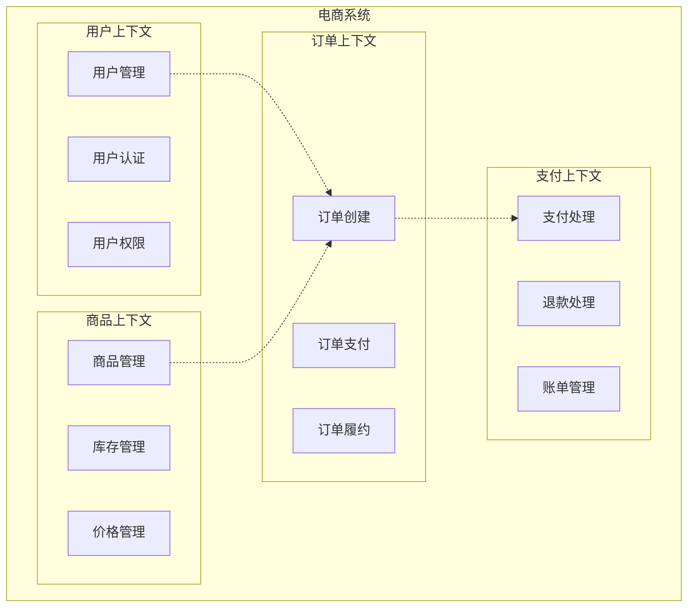
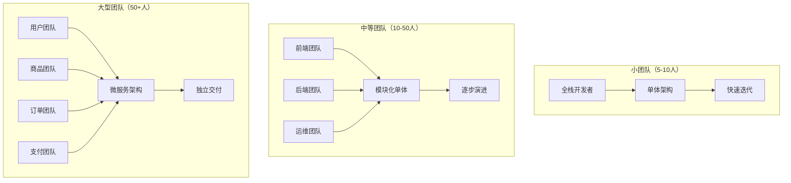
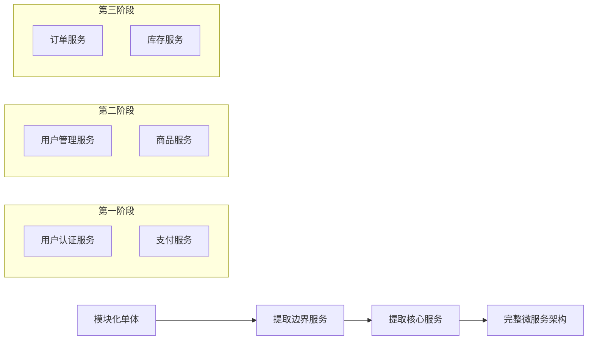

# 一、引言

在现代软件开发中，如何合理划分业务模块、选择合适的架构模式是每个技术团队都会面临的重要决策。随着业务复杂度的增加和团队规模的扩大，传统的单体架构逐渐暴露出扩展性、维护性等方面的局限性，微服务架构应运而生。然而，微服务并非银弹，盲目采用可能带来更多问题。

本文将深入探讨业务模块划分的原则和方法，对比单体架构与微服务架构的优劣，并提供实用的架构选择指南，帮助读者在不同场景下做出明智的技术决策。


**核心观点预览**
- 业务模块划分是架构设计的基础，应遵循高内聚、低耦合原则
- 单体架构与微服务各有适用场景，需要根据团队规模、业务复杂度等因素综合考虑
- DDD（领域驱动设计）为业务模块划分提供了科学的方法论
- 架构演进应该是渐进式的，而非一蹴而就


# 二、业务模块划分的基础理论

## （一）模块化设计的核心原则

### 1. 高内聚原则

**高内聚**是指模块内部的元素紧密相关，共同完成一个明确的功能。在业务系统中，这意味着相关的业务逻辑、数据和操作应该聚集在同一个模块中。

```java
// 高内聚的用户管理模块示例
@Service
public class UserService {
    
    // 用户相关的所有核心业务逻辑都在这个服务中
    public User createUser(CreateUserRequest request) {
        // 用户创建逻辑：验证、加密、存储
        validateUserData(request);
        String encryptedPassword = passwordEncoder.encode(request.getPassword());
        User user = User.builder()
            .username(request.getUsername())
            .email(request.getEmail())
            .password(encryptedPassword)
            .build();
        return userRepository.save(user);
    }
    
    public void updateUserProfile(Long userId, UpdateProfileRequest request) {
        // 用户资料更新逻辑
        User user = getUserById(userId);
        user.updateProfile(request.getName(), request.getPhone());
        userRepository.save(user);
    }
    
    // 私有方法：模块内部的辅助功能
    private void validateUserData(CreateUserRequest request) {
        // 用户数据验证逻辑
        if (userRepository.existsByUsername(request.getUsername())) {
            throw new BusinessException("用户名已存在");
        }
    }
}
```

### 2. 低耦合原则

**低耦合**要求模块之间的依赖关系尽可能少且明确。模块间应通过定义良好的接口进行交互，避免直接访问其他模块的内部实现。

```java
// 低耦合的订单服务示例
@Service
public class OrderService {
    
    private final UserService userService;        // 通过接口依赖用户服务
    private final ProductService productService;  // 通过接口依赖商品服务
    private final PaymentService paymentService;  // 通过接口依赖支付服务
    
    public Order createOrder(CreateOrderRequest request) {
        // 通过服务接口获取用户信息，而不是直接访问用户数据库
        User user = userService.getUserById(request.getUserId());
        
        // 通过服务接口验证商品信息
        List<Product> products = productService.getProductsByIds(request.getProductIds());
        
        // 创建订单
        Order order = Order.builder()
            .userId(user.getId())
            .products(products)
            .totalAmount(calculateTotalAmount(products))
            .build();
            
        return orderRepository.save(order);
    }
}
```

## （二）领域驱动设计（DDD）在模块划分中的应用

### 1. 限界上下文（Bounded Context）

限界上下文是DDD中的核心概念，它定义了特定领域模型适用的边界。在这个边界内，所有术语和概念都有明确、一致的含义。



### 2. 聚合根（Aggregate Root）

聚合根是聚合的入口点，负责维护聚合内部的一致性。它定义了业务操作的边界和事务边界。

```java
// 订单聚合根示例
@Entity
public class Order {
    @Id
    private Long id;
    private Long userId;
    private OrderStatus status;
    private BigDecimal totalAmount;
    
    @OneToMany(cascade = CascadeType.ALL, fetch = FetchType.LAZY)
    private List<OrderItem> orderItems;
    
    // 聚合根负责维护内部一致性
    public void addOrderItem(Product product, int quantity) {
        // 业务规则：订单状态为DRAFT时才能添加商品
        if (this.status != OrderStatus.DRAFT) {
            throw new BusinessException("订单状态不允许修改");
        }
        
        OrderItem item = new OrderItem(product.getId(), quantity, product.getPrice());
        this.orderItems.add(item);
        
        // 重新计算总金额
        this.totalAmount = calculateTotalAmount();
    }
    
    public void confirmOrder() {
        // 业务规则：订单必须有商品才能确认
        if (orderItems.isEmpty()) {
            throw new BusinessException("订单不能为空");
        }
        
        this.status = OrderStatus.CONFIRMED;
        // 发布领域事件
        DomainEventPublisher.publish(new OrderConfirmedEvent(this.id));
    }
}
```

## （三）业务模块划分的实践方法

### 1. 基于业务能力划分

按照企业的核心业务能力来划分模块，每个模块负责一个完整的业务功能。

```yaml
# 电商系统业务能力划分示例
业务能力:
  用户管理:
    - 用户注册登录
    - 用户资料管理
    - 用户权限管理
    
  商品管理:
    - 商品信息管理
    - 商品分类管理
    - 库存管理
    
  订单管理:
    - 订单创建
    - 订单状态跟踪
    - 订单履约
    
  支付管理:
    - 支付处理
    - 退款处理
    - 财务对账
```

### 2. 基于数据一致性划分

将需要强一致性的数据和操作放在同一个模块中，通过事务保证数据一致性。

```java
// 基于数据一致性的模块划分示例
@Transactional
public class InventoryService {
    
    // 库存扣减和库存日志记录需要强一致性，放在同一个事务中
    public void reduceInventory(Long productId, int quantity) {
        // 扣减库存
        Product product = productRepository.findById(productId);
        product.reduceInventory(quantity);
        productRepository.save(product);
        
        // 记录库存变更日志
        InventoryLog log = new InventoryLog(productId, -quantity, "订单扣减");
        inventoryLogRepository.save(log);
        
        // 如果库存不足，抛出异常，整个事务回滚
        if (product.getInventory() < 0) {
            throw new InsufficientInventoryException("库存不足");
        }
    }
}
```

# 三、单体架构与微服务架构深度对比

## （一）单体架构的特点与适用场景

### 1. 单体架构的优势

**开发简单**：所有功能在一个代码库中，开发者可以轻松理解整个系统的结构。

```java
// 单体架构中的简单调用示例
@RestController
public class OrderController {
    
    @Autowired
    private OrderService orderService;
    
    @Autowired
    private UserService userService;
    
    @Autowired
    private ProductService productService;
    
    @PostMapping("/orders")
    public ResponseEntity<Order> createOrder(@RequestBody CreateOrderRequest request) {
        // 在单体架构中，所有服务都在同一个JVM中，调用简单直接
        User user = userService.getUserById(request.getUserId());
        List<Product> products = productService.getProductsByIds(request.getProductIds());
        Order order = orderService.createOrder(user, products);
        
        return ResponseEntity.ok(order);
    }
}
```

**部署简单**：只需要部署一个应用包，运维成本低。

```bash
# 单体应用部署脚本
#!/bin/bash

# 停止旧版本
sudo systemctl stop ecommerce-app

# 备份当前版本
cp /opt/ecommerce/ecommerce-app.jar /opt/ecommerce/backup/ecommerce-app-$(date +%Y%m%d).jar

# 部署新版本
cp target/ecommerce-app.jar /opt/ecommerce/

# 启动新版本
sudo systemctl start ecommerce-app

# 检查服务状态
sudo systemctl status ecommerce-app
```

### 2. 单体架构的局限性

**扩展困难**：无法针对特定功能模块进行独立扩展。

**技术栈限制**：整个应用必须使用相同的技术栈。

**团队协作困难**：多个团队修改同一个代码库容易产生冲突。

## （二）微服务架构的特点与适用场景

### 1. 微服务架构的优势

**独立部署**：每个服务可以独立开发、测试和部署。

```yaml
# 微服务部署配置示例（Docker Compose）
version: '3.8'
services:
  user-service:
    image: ecommerce/user-service:1.2.0
    ports:
      - "8081:8080"
    environment:
      - SPRING_PROFILES_ACTIVE=prod
      - DATABASE_URL=jdbc:mysql://mysql:3306/user_db
    
  product-service:
    image: ecommerce/product-service:1.5.0
    ports:
      - "8082:8080"
    environment:
      - SPRING_PROFILES_ACTIVE=prod
      - DATABASE_URL=jdbc:mysql://mysql:3306/product_db
    
  order-service:
    image: ecommerce/order-service:2.1.0
    ports:
      - "8083:8080"
    environment:
      - SPRING_PROFILES_ACTIVE=prod
      - DATABASE_URL=jdbc:mysql://mysql:3306/order_db
```

**技术多样性**：不同服务可以使用最适合的技术栈。

```java
// 用户服务使用Spring Boot + MySQL
@RestController
public class UserController {
    @GetMapping("/users/{id}")
    public User getUser(@PathVariable Long id) {
        return userService.findById(id);
    }
}
```

```javascript
// 推荐服务使用Node.js + MongoDB
const express = require('express');
const app = express();

app.get('/recommendations/:userId', async (req, res) => {
    const recommendations = await recommendationService.getRecommendations(req.params.userId);
    res.json(recommendations);
});
```

### 2. 微服务架构的挑战

**分布式复杂性**：需要处理网络延迟、服务发现、负载均衡等问题。

**数据一致性**：跨服务的事务处理变得复杂。

**运维复杂性**：需要管理多个服务的部署、监控和故障排查。

# 四、架构选择的决策框架

## （一）团队规模与组织结构考量

### 1. 康威定律的应用

> "设计系统的组织，其产生的设计等同于组织之间的沟通结构。" —— 梅尔文·康威



### 2. 团队技能与经验评估

```java
// 团队技能评估矩阵示例
public class TeamSkillAssessment {
    
    public ArchitectureRecommendation assessTeam(Team team) {
        int distributedSystemsExperience = team.getDistributedSystemsExperience();
        int devOpsMaturity = team.getDevOpsMaturity();
        int teamSize = team.getSize();
        
        if (teamSize < 10 && distributedSystemsExperience < 3) {
            return ArchitectureRecommendation.MONOLITH;
        } else if (teamSize < 30 && devOpsMaturity >= 3) {
            return ArchitectureRecommendation.MODULAR_MONOLITH;
        } else if (teamSize >= 30 && distributedSystemsExperience >= 4) {
            return ArchitectureRecommendation.MICROSERVICES;
        }
        
        return ArchitectureRecommendation.MODULAR_MONOLITH;
    }
}
```

## （二）业务复杂度与扩展需求分析

### 1. 业务复杂度评估指标

- **业务领域数量**：系统涉及的核心业务领域数量
- **业务规则复杂度**：业务逻辑的复杂程度
- **数据模型复杂度**：实体关系的复杂程度
- **集成复杂度**：与外部系统集成的复杂程度

### 2. 扩展需求评估

```yaml
# 扩展需求评估示例
扩展需求评估:
  用户增长预期:
    当前: 10万用户
    一年后: 100万用户
    三年后: 1000万用户
    
  功能扩展计划:
    - 国际化支持
    - 移动端应用
    - 第三方集成
    - AI推荐系统
    
  性能要求:
    响应时间: < 200ms
    并发用户: 10万
    可用性: 99.9%
    
  团队扩展计划:
    当前: 15人
    一年后: 50人
    三年后: 100人
```

## （三）技术债务与迁移成本考虑

### 1. 现有系统评估

```java
// 技术债务评估工具示例
public class TechnicalDebtAssessment {
    
    public DebtLevel assessCodebase(Codebase codebase) {
        int codeComplexity = calculateCyclomaticComplexity(codebase);
        int testCoverage = calculateTestCoverage(codebase);
        int dependencyAge = calculateDependencyAge(codebase);
        
        if (codeComplexity > 15 || testCoverage < 60 || dependencyAge > 24) {
            return DebtLevel.HIGH;
        } else if (codeComplexity > 10 || testCoverage < 80 || dependencyAge > 12) {
            return DebtLevel.MEDIUM;
        }
        
        return DebtLevel.LOW;
    }
}
```

### 2. 迁移策略规划


微服务迁移策略系列：
1. [绞杀者模式（Strangler Fig Pattern）](javascript:void(0))
2. [数据库分离策略](javascript:void(0))
3. [API网关引入](javascript:void(0))
4. [事件驱动架构转换](javascript:void(0))


# 五、渐进式架构演进策略

## （一）从单体到模块化单体

### 1. 模块边界识别

```java
// 模块边界识别示例
// 原始单体结构
com.ecommerce.monolith
├── controller/
│   ├── UserController.java
│   ├── ProductController.java
│   └── OrderController.java
├── service/
│   ├── UserService.java
│   ├── ProductService.java
│   └── OrderService.java
└── repository/
    ├── UserRepository.java
    ├── ProductRepository.java
    └── OrderRepository.java

// 模块化后的结构
com.ecommerce.modular
├── user/
│   ├── api/UserController.java
│   ├── service/UserService.java
│   ├── repository/UserRepository.java
│   └── domain/User.java
├── product/
│   ├── api/ProductController.java
│   ├── service/ProductService.java
│   ├── repository/ProductRepository.java
│   └── domain/Product.java
└── order/
    ├── api/OrderController.java
    ├── service/OrderService.java
    ├── repository/OrderRepository.java
    └── domain/Order.java
```

### 2. 模块间通信机制

```java
// 模块间通信接口定义
public interface UserModuleApi {
    User getUserById(Long userId);
    boolean validateUser(Long userId);
}

// 订单模块通过接口调用用户模块
@Service
public class OrderService {
    
    private final UserModuleApi userModuleApi;
    
    public Order createOrder(CreateOrderRequest request) {
        // 通过模块API验证用户
        if (!userModuleApi.validateUser(request.getUserId())) {
            throw new InvalidUserException("用户不存在或无效");
        }
        
        // 创建订单逻辑
        return buildOrder(request);
    }
}
```

## （二）从模块化单体到微服务

### 1. 服务提取策略



### 2. 数据分离策略

```sql
-- 原始共享数据库
CREATE DATABASE ecommerce;

-- 用户相关表
CREATE TABLE users (id, username, email, ...);
CREATE TABLE user_profiles (user_id, name, phone, ...);

-- 商品相关表
CREATE TABLE products (id, name, price, ...);
CREATE TABLE categories (id, name, ...);

-- 订单相关表
CREATE TABLE orders (id, user_id, total_amount, ...);
CREATE TABLE order_items (order_id, product_id, quantity, ...);

-- 分离后的数据库结构
-- 用户服务数据库
CREATE DATABASE user_service;
CREATE TABLE users (id, username, email, ...);
CREATE TABLE user_profiles (user_id, name, phone, ...);

-- 商品服务数据库
CREATE DATABASE product_service;
CREATE TABLE products (id, name, price, ...);
CREATE TABLE categories (id, name, ...);

-- 订单服务数据库
CREATE DATABASE order_service;
CREATE TABLE orders (id, user_id, total_amount, ...);
CREATE TABLE order_items (order_id, product_id, quantity, ...);
```

# 六、实践案例与最佳实践

## （一）电商系统架构演进案例

### 1. 初期单体架构（用户量 < 10万）

```java
// 简单的单体电商应用
@SpringBootApplication
public class EcommerceApplication {
    public static void main(String[] args) {
        SpringApplication.run(EcommerceApplication.class, args);
    }
}

// 所有功能在一个应用中
@RestController
public class EcommerceController {
    
    @Autowired
    private UserService userService;
    
    @Autowired
    private ProductService productService;
    
    @Autowired
    private OrderService orderService;
    
    // 用户相关接口
    @PostMapping("/users")
    public User createUser(@RequestBody CreateUserRequest request) {
        return userService.createUser(request);
    }
    
    // 商品相关接口
    @GetMapping("/products")
    public List<Product> getProducts() {
        return productService.getAllProducts();
    }
    
    // 订单相关接口
    @PostMapping("/orders")
    public Order createOrder(@RequestBody CreateOrderRequest request) {
        return orderService.createOrder(request);
    }
}
```

### 2. 中期模块化单体（用户量 10万-100万）

```java
// 模块化的电商应用
// 用户模块
@Component
public class UserModule {
    
    @Autowired
    private UserService userService;
    
    public UserModuleApi getApi() {
        return new UserModuleApiImpl(userService);
    }
}

// 商品模块
@Component
public class ProductModule {
    
    @Autowired
    private ProductService productService;
    
    public ProductModuleApi getApi() {
        return new ProductModuleApiImpl(productService);
    }
}

// 订单模块依赖其他模块的API
@Service
public class OrderService {
    
    private final UserModuleApi userApi;
    private final ProductModuleApi productApi;
    
    public Order createOrder(CreateOrderRequest request) {
        // 通过模块API获取用户信息
        User user = userApi.getUserById(request.getUserId());
        
        // 通过模块API获取商品信息
        List<Product> products = productApi.getProductsByIds(request.getProductIds());
        
        // 创建订单
        return buildOrder(user, products);
    }
}
```

### 3. 后期微服务架构（用户量 > 100万）

```yaml
# 微服务架构配置
# API网关配置
spring:
  cloud:
    gateway:
      routes:
        - id: user-service
          uri: lb://user-service
          predicates:
            - Path=/api/users/**
        - id: product-service
          uri: lb://product-service
          predicates:
            - Path=/api/products/**
        - id: order-service
          uri: lb://order-service
          predicates:
            - Path=/api/orders/**
```

```java
// 微服务间通信（使用Feign客户端）
@FeignClient(name = "user-service")
public interface UserServiceClient {
    @GetMapping("/api/users/{id}")
    User getUserById(@PathVariable("id") Long id);
}

@FeignClient(name = "product-service")
public interface ProductServiceClient {
    @GetMapping("/api/products")
    List<Product> getProductsByIds(@RequestParam("ids") List<Long> ids);
}

// 订单服务
@Service
public class OrderService {
    
    private final UserServiceClient userServiceClient;
    private final ProductServiceClient productServiceClient;
    
    public Order createOrder(CreateOrderRequest request) {
        // 通过HTTP调用其他微服务
        User user = userServiceClient.getUserById(request.getUserId());
        List<Product> products = productServiceClient.getProductsByIds(request.getProductIds());
        
        return buildOrder(user, products);
    }
}
```

## （二）架构选择的最佳实践

### 1. 渐进式演进原则


**避免大爆炸式重构**
- 不要试图一次性将单体应用完全重写为微服务
- 采用绞杀者模式逐步替换现有功能
- 保持系统的持续可用性


### 2. 数据一致性处理

```java
// 分布式事务处理示例（使用Saga模式）
@Service
public class OrderSagaOrchestrator {
    
    public void processOrder(CreateOrderRequest request) {
        SagaTransaction saga = SagaTransaction.builder()
            .addStep(new ReserveInventoryStep(request))
            .addStep(new ProcessPaymentStep(request))
            .addStep(new CreateOrderStep(request))
            .addStep(new SendNotificationStep(request))
            .build();
            
        saga.execute();
    }
}

// Saga步骤实现
public class ReserveInventoryStep implements SagaStep {
    
    @Override
    public void execute(SagaContext context) {
        // 调用库存服务预留库存
        inventoryService.reserveInventory(context.getProductId(), context.getQuantity());
    }
    
    @Override
    public void compensate(SagaContext context) {
        // 补偿操作：释放预留的库存
        inventoryService.releaseInventory(context.getProductId(), context.getQuantity());
    }
}
```

### 3. 监控与可观测性

```yaml
# 微服务监控配置
management:
  endpoints:
    web:
      exposure:
        include: health,info,metrics,prometheus
  metrics:
    export:
      prometheus:
        enabled: true
        
# 分布式链路追踪
spring:
  sleuth:
    zipkin:
      base-url: http://zipkin-server:9411
    sampler:
      probability: 1.0
```

# 七、总结与展望

## （一）架构选择的核心要点

1. **没有银弹**：单体架构和微服务架构都有其适用场景，关键是根据实际情况选择
2. **渐进演进**：架构应该随着业务和团队的发展而逐步演进，避免过度设计
3. **团队匹配**：架构选择必须与团队的技能水平和组织结构相匹配
4. **业务驱动**：技术架构应该服务于业务目标，而不是为了技术而技术

## （二）未来发展趋势

随着云原生技术的发展，我们看到了一些新的趋势：

- **Serverless架构**：进一步简化运维复杂性
- **Service Mesh**：解决微服务间通信的复杂性
- **边缘计算**：将计算能力推向更接近用户的位置
- **AI驱动的架构优化**：利用机器学习优化系统性能


**关键建议**
- 从简单开始，根据需要逐步演进
- 重视团队能力建设和工具链完善
- 持续监控和优化架构决策
- 保持对新技术的关注和学习


## 参考资料

1. Martin Fowler - 《微服务架构》: https://martinfowler.com/microservices/
2. Eric Evans - 《领域驱动设计》: https://domainlanguage.com/
3. Chris Richardson - 《微服务模式》: https://microservices.io/
4. Sam Newman - 《构建微服务》: https://samnewman.io/books/building_microservices/
5. 阿里巴巴技术团队 - 《微服务架构实战》
6. Spring Cloud官方文档: https://spring.io/projects/spring-cloud
7. Kubernetes官方文档: https://kubernetes.io/docs/
8. Docker官方文档: https://docs.docker.com/
