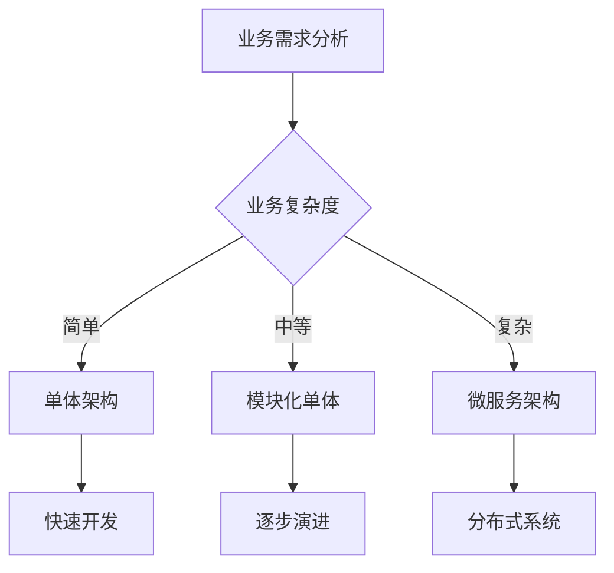
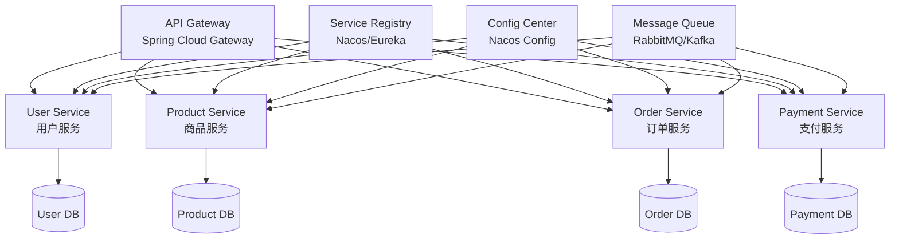
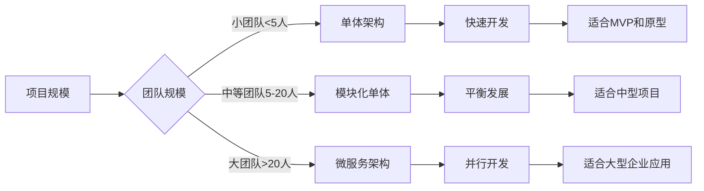
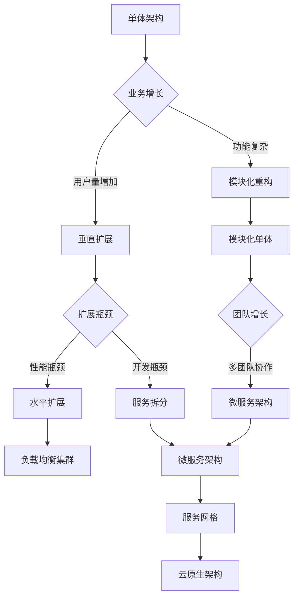
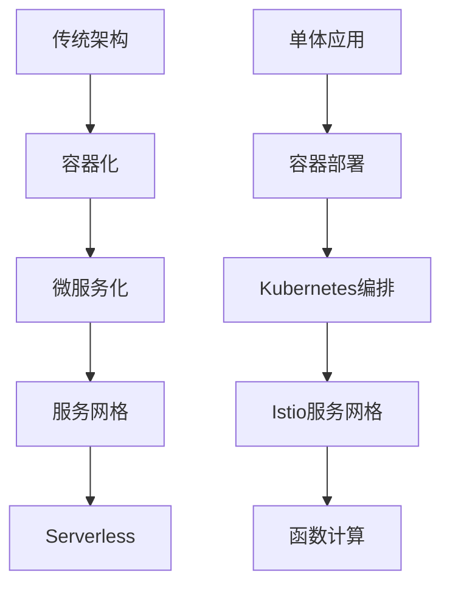
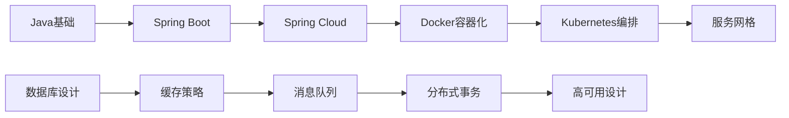

# 一、后端架构概述与选择策略

在现代软件开发中，后端架构的选择直接影响着系统的可扩展性、可维护性和开发效率。<mcreference link="https://blog.csdn.net/yiridancan/article/details/148955775" index="1">1</mcreference> 本文将深入探讨单体应用和微服务架构的设计原理、实现方式以及最佳实践，帮助开发者根据实际业务需求做出明智的架构选择。

## （一）架构演进的历史脉络


**架构演进路径**

单体架构 → 模块化单体 → 服务化架构 → 微服务架构 → 云原生架构

每个阶段都有其特定的适用场景和技术特点


### 1. 单体架构时代（2000-2010）

单体架构是传统的软件架构模式，所有功能模块都集成在一个应用程序中。这种架构在早期的企业级应用中占据主导地位，具有开发简单、部署方便的特点。

### 2. 微服务架构兴起（2010-至今）

<mcreference link="https://blog.csdn.net/yiridancan/article/details/148955775" index="1">1</mcreference> 随着业务复杂度的增加和团队规模的扩大，微服务架构逐渐成为主流选择。微服务将单体应用按业务功能拆分为多个独立的服务，每个服务可以独立开发、部署和扩展。

### 3. 云原生架构（2015-至今）

云原生架构结合了容器化、微服务、DevOps等技术，为现代应用提供了更高的弹性和可扩展性。

## （二）架构选择的决策因素

### 1. 业务复杂度评估



### 2. 团队规模与技术能力

- **小团队（1-5人）**：推荐单体架构，便于快速迭代
- **中等团队（5-20人）**：可考虑模块化单体或简单微服务
- **大团队（20人以上）**：适合采用微服务架构，支持并行开发

### 3. 性能与扩展性要求

- **低并发场景**：单体架构足够满足需求
- **高并发场景**：微服务架构提供更好的水平扩展能力
- **混合场景**：可采用渐进式演进策略

# 二、单体应用架构设计与实现

## （一）单体架构的核心特点

### 1. 架构优势


**单体架构的主要优势**

- **开发简单**：所有功能在一个代码库中，便于理解和开发
- **部署方便**：只需部署一个应用包，运维成本低
- **测试容易**：端到端测试相对简单
- **性能优异**：内存调用，无网络开销
- **事务一致性**：数据库事务天然支持ACID特性


### 2. 技术栈选择

对于Java生态系统，Spring Boot是构建单体应用的首选框架：

```java
// Spring Boot单体应用的典型结构
@SpringBootApplication
public class EcommerceApplication {
    public static void main(String[] args) {
        SpringApplication.run(EcommerceApplication.class, args);
    }
}

// 统一的控制器层
@RestController
@RequestMapping("/api")
public class EcommerceController {
    
    @Autowired
    private UserService userService;
    
    @Autowired
    private ProductService productService;
    
    @Autowired
    private OrderService orderService;
    
    // 用户管理接口
    @PostMapping("/users")
    public ResponseEntity<User> createUser(@RequestBody CreateUserRequest request) {
        User user = userService.createUser(request);
        return ResponseEntity.ok(user);
    }
    
    @GetMapping("/users/{id}")
    public ResponseEntity<User> getUser(@PathVariable Long id) {
        User user = userService.findById(id);
        return ResponseEntity.ok(user);
    }
    
    // 商品管理接口
    @GetMapping("/products")
    public ResponseEntity<List<Product>> getProducts(
            @RequestParam(defaultValue = "0") int page,
            @RequestParam(defaultValue = "10") int size) {
        Page<Product> products = productService.findAll(PageRequest.of(page, size));
        return ResponseEntity.ok(products.getContent());
    }
    
    @PostMapping("/products")
    public ResponseEntity<Product> createProduct(@RequestBody CreateProductRequest request) {
        Product product = productService.createProduct(request);
        return ResponseEntity.ok(product);
    }
    
    // 订单管理接口
    @PostMapping("/orders")
    public ResponseEntity<Order> createOrder(@RequestBody CreateOrderRequest request) {
        // 在单体架构中，所有服务都在同一个JVM中，调用简单直接
        Order order = orderService.createOrder(request);
        return ResponseEntity.ok(order);
    }
    
    @GetMapping("/orders/{id}")
    public ResponseEntity<Order> getOrder(@PathVariable Long id) {
        Order order = orderService.findById(id);
        return ResponseEntity.ok(order);
    }
}
```

## （二）单体应用的分层架构设计

### 1. 经典三层架构

```java
// 控制器层（Controller Layer）
@RestController
@RequestMapping("/api/orders")
public class OrderController {
    
    @Autowired
    private OrderService orderService;
    
    @PostMapping
    public ResponseEntity<OrderDTO> createOrder(@RequestBody CreateOrderRequest request) {
        OrderDTO order = orderService.createOrder(request);
        return ResponseEntity.ok(order);
    }
}

// 服务层（Service Layer）
@Service
@Transactional
public class OrderService {
    
    @Autowired
    private OrderRepository orderRepository;
    
    @Autowired
    private UserRepository userRepository;
    
    @Autowired
    private ProductRepository productRepository;
    
    @Autowired
    private InventoryService inventoryService;
    
    public OrderDTO createOrder(CreateOrderRequest request) {
        // 业务逻辑处理
        User user = userRepository.findById(request.getUserId())
            .orElseThrow(() -> new UserNotFoundException("用户不存在"));
        
        List<Product> products = productRepository.findAllById(request.getProductIds());
        
        // 库存检查
        inventoryService.checkAndReserveInventory(request.getItems());
        
        // 创建订单
        Order order = Order.builder()
            .user(user)
            .products(products)
            .totalAmount(calculateTotalAmount(request.getItems()))
            .status(OrderStatus.PENDING)
            .createTime(LocalDateTime.now())
            .build();
        
        Order savedOrder = orderRepository.save(order);
        
        return OrderDTO.fromEntity(savedOrder);
    }
    
    private BigDecimal calculateTotalAmount(List<OrderItem> items) {
        return items.stream()
            .map(item -> item.getPrice().multiply(BigDecimal.valueOf(item.getQuantity())))
            .reduce(BigDecimal.ZERO, BigDecimal::add);
    }
}

// 数据访问层（Repository Layer）
@Repository
public interface OrderRepository extends JpaRepository<Order, Long> {
    
    List<Order> findByUserIdAndStatus(Long userId, OrderStatus status);
    
    @Query("SELECT o FROM Order o WHERE o.createTime BETWEEN :startTime AND :endTime")
    List<Order> findOrdersByTimeRange(
        @Param("startTime") LocalDateTime startTime,
        @Param("endTime") LocalDateTime endTime
    );
}
```

### 2. 领域驱动设计（DDD）架构

```java
// 领域实体（Domain Entity）
@Entity
@Table(name = "orders")
public class Order {
    
    @Id
    @GeneratedValue(strategy = GenerationType.IDENTITY)
    private Long id;
    
    @ManyToOne(fetch = FetchType.LAZY)
    @JoinColumn(name = "user_id")
    private User user;
    
    @OneToMany(mappedBy = "order", cascade = CascadeType.ALL, fetch = FetchType.LAZY)
    private List<OrderItem> items = new ArrayList<>();
    
    @Enumerated(EnumType.STRING)
    private OrderStatus status;
    
    private BigDecimal totalAmount;
    
    private LocalDateTime createTime;
    
    // 领域方法：封装业务逻辑
    public void confirm() {
        if (this.status != OrderStatus.PENDING) {
            throw new IllegalStateException("只有待确认的订单才能确认");
        }
        this.status = OrderStatus.CONFIRMED;
    }
    
    public void cancel() {
        if (this.status == OrderStatus.SHIPPED || this.status == OrderStatus.DELIVERED) {
            throw new IllegalStateException("已发货或已送达的订单无法取消");
        }
        this.status = OrderStatus.CANCELLED;
    }
    
    public boolean canModify() {
        return this.status == OrderStatus.PENDING;
    }
    
    // 计算订单总金额
    public void calculateTotalAmount() {
        this.totalAmount = items.stream()
            .map(OrderItem::getSubtotal)
            .reduce(BigDecimal.ZERO, BigDecimal::add);
    }
}

// 值对象（Value Object）
@Embeddable
public class Money {
    
    private BigDecimal amount;
    
    @Enumerated(EnumType.STRING)
    private Currency currency;
    
    public Money(BigDecimal amount, Currency currency) {
        if (amount.compareTo(BigDecimal.ZERO) < 0) {
            throw new IllegalArgumentException("金额不能为负数");
        }
        this.amount = amount;
        this.currency = currency;
    }
    
    public Money add(Money other) {
        if (!this.currency.equals(other.currency)) {
            throw new IllegalArgumentException("不同币种无法相加");
        }
        return new Money(this.amount.add(other.amount), this.currency);
    }
    
    public Money multiply(int quantity) {
        return new Money(this.amount.multiply(BigDecimal.valueOf(quantity)), this.currency);
    }
}

// 领域服务（Domain Service）
@Service
public class OrderDomainService {
    
    public void validateOrderCreation(User user, List<Product> products) {
        // 用户状态验证
        if (!user.isActive()) {
            throw new DomainException("用户状态异常，无法创建订单");
        }
        
        // 商品状态验证
        products.forEach(product -> {
            if (!product.isAvailable()) {
                throw new DomainException("商品 " + product.getName() + " 不可购买");
            }
        });
    }
    
    public BigDecimal calculateDiscount(Order order, User user) {
        // 会员折扣计算逻辑
        if (user.getMemberLevel() == MemberLevel.VIP) {
            return order.getTotalAmount().multiply(new BigDecimal("0.1"));
        }
        return BigDecimal.ZERO;
    }
}
```

## （三）单体应用的配置与部署

### 1. 应用配置管理

```yaml
# application.yml - 主配置文件
spring:
  application:
    name: ecommerce-monolith
  
  # 数据库配置
  datasource:
    url: jdbc:mysql://localhost:3306/ecommerce?useUnicode=true&characterEncoding=utf8&useSSL=false
    username: ${DB_USERNAME:root}
    driver-class-name: com.mysql.cj.jdbc.Driver
    hikari:
      maximum-pool-size: 20
      minimum-idle: 5
      connection-timeout: 30000
      idle-timeout: 600000
      max-lifetime: 1800000
  
  # JPA配置
  jpa:
    hibernate:
      ddl-auto: validate
    show-sql: false
    properties:
      hibernate:
        dialect: org.hibernate.dialect.MySQL8Dialect
        format_sql: true
        use_sql_comments: true
  
  # Redis配置
  redis:
    host: ${REDIS_HOST:localhost}
    port: ${REDIS_PORT:6379}
    password: ${REDIS_PASSWORD:}
    timeout: 2000ms
    lettuce:
      pool:
        max-active: 8
        max-idle: 8
        min-idle: 0
  
  # 缓存配置
  cache:
    type: redis
    redis:
      time-to-live: 600000

# 服务器配置
server:
  port: ${SERVER_PORT:8080}
  servlet:
    context-path: /api
  tomcat:
    max-threads: 200
    min-spare-threads: 10

# 日志配置
logging:
  level:
    com.example.ecommerce: INFO
    org.springframework.web: DEBUG
  pattern:
    console: "%d{yyyy-MM-dd HH:mm:ss} [%thread] %-5level %logger{36} - %msg%n"
    file: "%d{yyyy-MM-dd HH:mm:ss} [%thread] %-5level %logger{36} - %msg%n"
  file:
    name: logs/ecommerce.log

# 监控配置
management:
  endpoints:
    web:
      exposure:
        include: health,info,metrics,prometheus
  endpoint:
    health:
      show-details: always
  metrics:
    export:
      prometheus:
        enabled: true

# 自定义配置
app:
  security:
    jwt:
      secret: ${JWT_SECRET:mySecretKey}
      expiration: 86400000 # 24小时
  
  file:
    upload:
      path: ${FILE_UPLOAD_PATH:/tmp/uploads}
      max-size: 10MB
  
  email:
    smtp:
      host: ${SMTP_HOST:smtp.gmail.com}
      port: ${SMTP_PORT:587}
      username: ${SMTP_USERNAME:}
      password: ${SMTP_PASSWORD:}
```

### 2. Docker容器化部署

```dockerfile
# Dockerfile
FROM openjdk:17-jre-slim

# 设置工作目录
WORKDIR /app

# 复制应用JAR文件
COPY target/ecommerce-monolith-1.0.0.jar app.jar

# 创建非root用户
RUN addgroup --system spring && adduser --system spring --ingroup spring
USER spring:spring

# 暴露端口
EXPOSE 8080

# 健康检查
HEALTHCHECK --interval=30s --timeout=3s --start-period=5s --retries=3 \
  CMD curl -f http://localhost:8080/api/actuator/health || exit 1

# 启动应用
ENTRYPOINT ["java", "-jar", "/app/app.jar"]
```

```yaml
# docker-compose.yml
version: '3.8'

services:
  # 应用服务
  ecommerce-app:
    build: .
    ports:
      - "8080:8080"
    environment:
      - SPRING_PROFILES_ACTIVE=docker
      - DB_USERNAME=ecommerce
      - DB_PASSWORD=password123
      - REDIS_HOST=redis
      - REDIS_PORT=6379
    depends_on:
      - mysql
      - redis
    networks:
      - ecommerce-network
    restart: unless-stopped
    volumes:
      - ./logs:/app/logs
      - ./uploads:/app/uploads

  # MySQL数据库
  mysql:
    image: mysql:8.0
    environment:
      - MYSQL_ROOT_PASSWORD=rootpassword
      - MYSQL_DATABASE=ecommerce
      - MYSQL_USER=ecommerce
      - MYSQL_PASSWORD=password123
    ports:
      - "3306:3306"
    volumes:
      - mysql_data:/var/lib/mysql
      - ./init.sql:/docker-entrypoint-initdb.d/init.sql
    networks:
      - ecommerce-network
    restart: unless-stopped

  # Redis缓存
  redis:
    image: redis:7-alpine
    ports:
      - "6379:6379"
    volumes:
      - redis_data:/data
    networks:
      - ecommerce-network
    restart: unless-stopped
    command: redis-server --appendonly yes

  # Nginx反向代理
  nginx:
    image: nginx:alpine
    ports:
      - "80:80"
      - "443:443"
    volumes:
      - ./nginx.conf:/etc/nginx/nginx.conf
      - ./ssl:/etc/nginx/ssl
    depends_on:
      - ecommerce-app
    networks:
      - ecommerce-network
    restart: unless-stopped

volumes:
  mysql_data:
  redis_data:

networks:
  ecommerce-network:
    driver: bridge
```

### 3. 生产环境部署脚本

```bash
#!/bin/bash
# deploy.sh - 生产环境部署脚本

set -e

# 配置变量
APP_NAME="ecommerce-monolith"
APP_VERSION="1.0.0"
DEPLOY_DIR="/opt/ecommerce"
BACKUP_DIR="/opt/ecommerce/backup"
LOG_DIR="/var/log/ecommerce"

# 颜色输出
RED='\033[0;31m'
GREEN='\033[0;32m'
YELLOW='\033[1;33m'
NC='\033[0m' # No Color

log() {
    echo -e "${GREEN}[$(date +'%Y-%m-%d %H:%M:%S')] $1${NC}"
}

warn() {
    echo -e "${YELLOW}[$(date +'%Y-%m-%d %H:%M:%S')] WARNING: $1${NC}"
}

error() {
    echo -e "${RED}[$(date +'%Y-%m-%d %H:%M:%S')] ERROR: $1${NC}"
    exit 1
}

# 检查必要的目录
check_directories() {
    log "检查部署目录..."
    
    for dir in "$DEPLOY_DIR" "$BACKUP_DIR" "$LOG_DIR"; do
        if [ ! -d "$dir" ]; then
            log "创建目录: $dir"
            sudo mkdir -p "$dir"
            sudo chown $USER:$USER "$dir"
        fi
    done
}

# 备份当前版本
backup_current_version() {
    if [ -f "$DEPLOY_DIR/$APP_NAME.jar" ]; then
        log "备份当前版本..."
        BACKUP_FILE="$BACKUP_DIR/$APP_NAME-$(date +%Y%m%d_%H%M%S).jar"
        cp "$DEPLOY_DIR/$APP_NAME.jar" "$BACKUP_FILE"
        log "备份完成: $BACKUP_FILE"
    else
        warn "未找到当前版本，跳过备份"
    fi
}

# 停止应用
stop_application() {
    log "停止应用服务..."
    
    if sudo systemctl is-active --quiet $APP_NAME; then
        sudo systemctl stop $APP_NAME
        log "应用已停止"
    else
        warn "应用未运行"
    fi
}

# 部署新版本
deploy_new_version() {
    log "部署新版本..."
    
    if [ ! -f "target/$APP_NAME-$APP_VERSION.jar" ]; then
        error "未找到构建文件: target/$APP_NAME-$APP_VERSION.jar"
    fi
    
    cp "target/$APP_NAME-$APP_VERSION.jar" "$DEPLOY_DIR/$APP_NAME.jar"
    sudo chown $USER:$USER "$DEPLOY_DIR/$APP_NAME.jar"
    sudo chmod +x "$DEPLOY_DIR/$APP_NAME.jar"
    
    log "新版本部署完成"
}

# 启动应用
start_application() {
    log "启动应用服务..."
    
    sudo systemctl start $APP_NAME
    sudo systemctl enable $APP_NAME
    
    log "等待应用启动..."
    sleep 10
}

# 健康检查
health_check() {
    log "执行健康检查..."
    
    local max_attempts=30
    local attempt=1
    
    while [ $attempt -le $max_attempts ]; do
        if curl -f http://localhost:8080/api/actuator/health > /dev/null 2>&1; then
            log "健康检查通过"
            return 0
        fi
        
        log "健康检查失败，重试 $attempt/$max_attempts"
        sleep 5
        ((attempt++))
    done
    
    error "健康检查失败，部署回滚"
}

# 回滚操作
rollback() {
    error "部署失败，执行回滚..."
    
    # 停止当前版本
    sudo systemctl stop $APP_NAME
    
    # 恢复备份
    LATEST_BACKUP=$(ls -t $BACKUP_DIR/$APP_NAME-*.jar | head -n1)
    if [ -n "$LATEST_BACKUP" ]; then
        cp "$LATEST_BACKUP" "$DEPLOY_DIR/$APP_NAME.jar"
        sudo systemctl start $APP_NAME
        log "回滚完成"
    else
        error "未找到备份文件，无法回滚"
    fi
}

# 主部署流程
main() {
    log "开始部署 $APP_NAME v$APP_VERSION"
    
    # 设置错误处理
    trap rollback ERR
    
    check_directories
    backup_current_version
    stop_application
    deploy_new_version
    start_application
    health_check
    
    log "部署成功完成！"
    log "应用状态: $(sudo systemctl is-active $APP_NAME)"
    log "应用日志: sudo journalctl -u $APP_NAME -f"
}

# 执行主流程
main "$@"
```

## （四）单体应用的性能优化

### 1. 数据库优化

```java
// 数据库连接池优化
@Configuration
public class DatabaseConfig {
    
    @Bean
    @ConfigurationProperties("spring.datasource.hikari")
    public HikariDataSource dataSource() {
        HikariConfig config = new HikariConfig();
        
        // 连接池大小优化
        config.setMaximumPoolSize(20); // 最大连接数
        config.setMinimumIdle(5);      // 最小空闲连接数
        config.setConnectionTimeout(30000);  // 连接超时时间
        config.setIdleTimeout(600000);       // 空闲超时时间
        config.setMaxLifetime(1800000);      // 连接最大生命周期
        
        // 连接测试
        config.setConnectionTestQuery("SELECT 1");
        config.setValidationTimeout(5000);
        
        // 性能优化
        config.addDataSourceProperty("cachePrepStmts", "true");
        config.addDataSourceProperty("prepStmtCacheSize", "250");
        config.addDataSourceProperty("prepStmtCacheSqlLimit", "2048");
        config.addDataSourceProperty("useServerPrepStmts", "true");
        
        return new HikariDataSource(config);
    }
}

// JPA查询优化
@Repository
public interface ProductRepository extends JpaRepository<Product, Long> {
    
    // 使用@Query优化查询
    @Query("SELECT p FROM Product p LEFT JOIN FETCH p.category WHERE p.status = :status")
    List<Product> findActiveProductsWithCategory(@Param("status") ProductStatus status);
    
    // 分页查询优化
    @Query(value = "SELECT p FROM Product p WHERE p.name LIKE %:keyword%",
           countQuery = "SELECT count(p) FROM Product p WHERE p.name LIKE %:keyword%")
    Page<Product> findByNameContaining(@Param("keyword") String keyword, Pageable pageable);
    
    // 批量操作优化
    @Modifying
    @Query("UPDATE Product p SET p.status = :status WHERE p.id IN :ids")
    int updateProductStatus(@Param("ids") List<Long> ids, @Param("status") ProductStatus status);
}
```

### 2. 缓存策略

```java
// Redis缓存配置
@Configuration
@EnableCaching
public class CacheConfig {
    
    @Bean
    public CacheManager cacheManager(RedisConnectionFactory connectionFactory) {
        RedisCacheConfiguration config = RedisCacheConfiguration.defaultCacheConfig()
            .entryTtl(Duration.ofMinutes(10))  // 默认过期时间
            .serializeKeysWith(RedisSerializationContext.SerializationPair
                .fromSerializer(new StringRedisSerializer()))
            .serializeValuesWith(RedisSerializationContext.SerializationPair
                .fromSerializer(new GenericJackson2JsonRedisSerializer()));
        
        return RedisCacheManager.builder(connectionFactory)
            .cacheDefaults(config)
            .transactionAware()
            .build();
    }
}

// 缓存使用示例
@Service
public class ProductService {
    
    @Autowired
    private ProductRepository productRepository;
    
    // 查询缓存
    @Cacheable(value = "products", key = "#id")
    public Product findById(Long id) {
        return productRepository.findById(id)
            .orElseThrow(() -> new ProductNotFoundException("商品不存在"));
    }
    
    // 更新缓存
    @CachePut(value = "products", key = "#product.id")
    public Product updateProduct(Product product) {
        return productRepository.save(product);
    }
    
    // 删除缓存
    @CacheEvict(value = "products", key = "#id")
    public void deleteProduct(Long id) {
        productRepository.deleteById(id);
    }
    
    // 批量删除缓存
    @CacheEvict(value = "products", allEntries = true)
    public void clearProductCache() {
        // 清空所有商品缓存
    }
}
```

### 3. 异步处理

```java
// 异步配置
@Configuration
@EnableAsync
public class AsyncConfig {
    
    @Bean(name = "taskExecutor")
    public TaskExecutor taskExecutor() {
        ThreadPoolTaskExecutor executor = new ThreadPoolTaskExecutor();
        executor.setCorePoolSize(10);        // 核心线程数
        executor.setMaxPoolSize(50);         // 最大线程数
        executor.setQueueCapacity(100);      // 队列容量
        executor.setKeepAliveSeconds(60);    // 线程空闲时间
        executor.setThreadNamePrefix("async-task-");
        executor.setRejectedExecutionHandler(new ThreadPoolExecutor.CallerRunsPolicy());
        executor.initialize();
        return executor;
    }
}

// 异步服务示例
@Service
public class NotificationService {
    
    private static final Logger logger = LoggerFactory.getLogger(NotificationService.class);
    
    @Async("taskExecutor")
    public CompletableFuture<Void> sendEmailNotification(String email, String subject, String content) {
        try {
            // 模拟邮件发送
            Thread.sleep(2000);
            logger.info("邮件发送成功: {}", email);
            return CompletableFuture.completedFuture(null);
        } catch (Exception e) {
            logger.error("邮件发送失败: {}", email, e);
            return CompletableFuture.failedFuture(e);
        }
    }
    
    @Async("taskExecutor")
    public CompletableFuture<Void> sendSmsNotification(String phone, String message) {
        try {
            // 模拟短信发送
            Thread.sleep(1000);
            logger.info("短信发送成功: {}", phone);
            return CompletableFuture.completedFuture(null);
        } catch (Exception e) {
            logger.error("短信发送失败: {}", phone, e);
            return CompletableFuture.failedFuture(e);
        }
    }
}

// 使用异步服务
@Service
public class OrderService {
    
    @Autowired
    private NotificationService notificationService;
    
    @Transactional
    public Order createOrder(CreateOrderRequest request) {
        // 创建订单逻辑
        Order order = buildOrder(request);
        Order savedOrder = orderRepository.save(order);
        
        // 异步发送通知（不影响主流程）
        notificationService.sendEmailNotification(
            request.getEmail(),
            "订单确认",
            "您的订单已创建成功，订单号：" + savedOrder.getId()
        );
        
        return savedOrder;
    }
}
```

# 三、微服务应用架构设计与实现

## （一）微服务架构的核心理念

### 1. 微服务架构特点


**微服务架构的核心特征**

- **服务独立性**：每个服务可以独立开发、部署和扩展
- **业务导向**：按业务功能划分服务边界
- **技术多样性**：不同服务可以使用不同的技术栈
- **数据隔离**：每个服务拥有独立的数据存储
- **分布式治理**：去中心化的服务治理模式
- **故障隔离**：单个服务的故障不会影响整个系统


### 2. Spring Cloud技术栈

<mcreference link="https://blog.csdn.net/yiridancan/article/details/148955775" index="1">1</mcreference> Spring Cloud为微服务架构提供了完整的解决方案，包括服务发现、配置管理、断路器、API网关等组件。



## （二）微服务项目结构设计

### 1. 多模块项目结构

```
ecommerce-microservices/
├── pom.xml                          # 父级POM文件
├── ecommerce-common/                # 公共模块
│   ├── src/main/java/
│   │   └── com/example/common/
│   │       ├── dto/                 # 数据传输对象
│   │       ├── exception/           # 异常定义
│   │       ├── util/                # 工具类
│   │       └── constant/            # 常量定义
│   └── pom.xml
├── ecommerce-gateway/               # API网关
│   ├── src/main/java/
│   │   └── com/example/gateway/
│   │       ├── GatewayApplication.java
│   │       ├── config/              # 网关配置
│   │       ├── filter/              # 自定义过滤器
│   │       └── handler/             # 异常处理
│   ├── src/main/resources/
│   │   └── application.yml
│   └── pom.xml
├── ecommerce-user-service/          # 用户服务
│   ├── src/main/java/
│   │   └── com/example/user/
│   │       ├── UserServiceApplication.java
│   │       ├── controller/          # 控制器层
│   │       ├── service/             # 服务层
│   │       ├── repository/          # 数据访问层
│   │       ├── entity/              # 实体类
│   │       └── config/              # 配置类
│   └── pom.xml
├── ecommerce-product-service/       # 商品服务
├── ecommerce-order-service/         # 订单服务
├── ecommerce-payment-service/       # 支付服务
└── docker-compose.yml               # Docker编排文件
```

### 2. 父级POM配置

```xml
<?xml version="1.0" encoding="UTF-8"?>
<project xmlns="http://maven.apache.org/POM/4.0.0"
         xmlns:xsi="http://www.w3.org/2001/XMLSchema-instance"
         xsi:schemaLocation="http://maven.apache.org/POM/4.0.0 
         http://maven.apache.org/xsd/maven-4.0.0.xsd">
    <modelVersion>4.0.0</modelVersion>

    <groupId>com.example</groupId>
    <artifactId>ecommerce-microservices</artifactId>
    <version>1.0.0</version>
    <packaging>pom</packaging>

    <name>ecommerce-microservices</name>
    <description>电商微服务系统</description>

    <!-- 子模块定义 -->
    <modules>
        <module>ecommerce-common</module>
        <module>ecommerce-gateway</module>
        <module>ecommerce-user-service</module>
        <module>ecommerce-product-service</module>
        <module>ecommerce-order-service</module>
        <module>ecommerce-payment-service</module>
    </modules>

    <properties>
        <maven.compiler.source>17</maven.compiler.source>
        <maven.compiler.target>17</maven.compiler.target>
        <project.build.sourceEncoding>UTF-8</project.build.sourceEncoding>
        
        <!-- Spring Boot版本 -->
        <spring-boot.version>3.2.0</spring-boot.version>
        <!-- Spring Cloud版本 -->
        <spring-cloud.version>2023.0.0</spring-cloud.version>
        <!-- Spring Cloud Alibaba版本 -->
        <spring-cloud-alibaba.version>2022.0.0.0</spring-cloud-alibaba.version>
        
        <!-- 其他依赖版本 -->
        <mysql.version>8.0.33</mysql.version>
        <redis.version>3.2.0</redis.version>
        <mybatis-plus.version>3.5.4</mybatis-plus.version>
        <hutool.version>5.8.22</hutool.version>
        <fastjson.version>2.0.43</fastjson.version>
    </properties>

    <!-- 依赖管理 -->
    <dependencyManagement>
        <dependencies>
            <!-- Spring Boot BOM -->
            <dependency>
                <groupId>org.springframework.boot</groupId>
                <artifactId>spring-boot-dependencies</artifactId>
                <version>${spring-boot.version}</version>
                <type>pom</type>
                <scope>import</scope>
            </dependency>
            
            <!-- Spring Cloud BOM -->
            <dependency>
                <groupId>org.springframework.cloud</groupId>
                <artifactId>spring-cloud-dependencies</artifactId>
                <version>${spring-cloud.version}</version>
                <type>pom</type>
                <scope>import</scope>
            </dependency>
            
            <!-- Spring Cloud Alibaba BOM -->
            <dependency>
                <groupId>com.alibaba.cloud</groupId>
                <artifactId>spring-cloud-alibaba-dependencies</artifactId>
                <version>${spring-cloud-alibaba.version}</version>
                <type>pom</type>
                <scope>import</scope>
            </dependency>

            <!-- 公共模块 -->
            <dependency>
                <groupId>com.example</groupId>
                <artifactId>ecommerce-common</artifactId>
                <version>${project.version}</version>
            </dependency>

            <!-- 数据库相关 -->
            <dependency>
                <groupId>mysql</groupId>
                <artifactId>mysql-connector-java</artifactId>
                <version>${mysql.version}</version>
            </dependency>
            
            <dependency>
                <groupId>com.baomidou</groupId>
                <artifactId>mybatis-plus-boot-starter</artifactId>
                <version>${mybatis-plus.version}</version>
            </dependency>

            <!-- 工具类 -->
            <dependency>
                <groupId>cn.hutool</groupId>
                <artifactId>hutool-all</artifactId>
                <version>${hutool.version}</version>
            </dependency>
            
            <dependency>
                <groupId>com.alibaba</groupId>
                <artifactId>fastjson2</artifactId>
                <version>${fastjson.version}</version>
            </dependency>
        </dependencies>
    </dependencyManagement>

    <!-- 构建配置 -->
    <build>
        <plugins>
            <plugin>
                <groupId>org.springframework.boot</groupId>
                <artifactId>spring-boot-maven-plugin</artifactId>
                <version>${spring-boot.version}</version>
                <configuration>
                    <excludes>
                        <exclude>
                            <groupId>org.projectlombok</groupId>
                            <artifactId>lombok</artifactId>
                        </exclude>
                    </excludes>
                </configuration>
            </plugin>
        </plugins>
    </build>
</project>
```

## （三）服务注册与发现

### 1. Nacos注册中心配置

```java
// 用户服务启动类
@SpringBootApplication
@EnableDiscoveryClient  // 启用服务发现
@EnableFeignClients     // 启用Feign客户端
public class UserServiceApplication {
    public static void main(String[] args) {
        SpringApplication.run(UserServiceApplication.class, args);
    }
}

// 用户服务配置
// application.yml
spring:
  application:
    name: user-service
  cloud:
    nacos:
      discovery:
        server-addr: localhost:8848
        namespace: ecommerce
        group: DEFAULT_GROUP
        metadata:
          version: 1.0.0
          region: beijing
      config:
        server-addr: localhost:8848
        file-extension: yml
        namespace: ecommerce
        group: DEFAULT_GROUP
  
  datasource:
    url: jdbc:mysql://localhost:3306/ecommerce_user?useUnicode=true&characterEncoding=utf8&useSSL=false
    username: ${DB_USERNAME:root}
    password: ${DB_PASSWORD:password}
    driver-class-name: com.mysql.cj.jdbc.Driver

server:
  port: 8081

# 服务监控配置
management:
  endpoints:
    web:
      exposure:
        include: health,info,metrics,nacos-discovery
  endpoint:
    health:
      show-details: always
```

### 2. 用户服务实现

```java
// 用户实体类
@Entity
@Table(name = "users")
@Data
@Builder
@NoArgsConstructor
@AllArgsConstructor
public class User {
    
    @Id
    @GeneratedValue(strategy = GenerationType.IDENTITY)
    private Long id;
    
    @Column(unique = true, nullable = false)
    private String username;
    
    @Column(unique = true, nullable = false)
    private String email;
    
    @Column(nullable = false)
    private String password;
    
    @Column(name = "phone_number")
    private String phoneNumber;
    
    @Enumerated(EnumType.STRING)
    private UserStatus status;
    
    @Enumerated(EnumType.STRING)
    @Column(name = "member_level")
    private MemberLevel memberLevel;
    
    @Column(name = "create_time")
    private LocalDateTime createTime;
    
    @Column(name = "update_time")
    private LocalDateTime updateTime;
    
    @PrePersist
    protected void onCreate() {
        createTime = LocalDateTime.now();
        updateTime = LocalDateTime.now();
    }
    
    @PreUpdate
    protected void onUpdate() {
        updateTime = LocalDateTime.now();
    }
}

// 用户控制器
@RestController
@RequestMapping("/api/users")
@Validated
public class UserController {
    
    @Autowired
    private UserService userService;
    
    @PostMapping
    public ResponseEntity<UserDTO> createUser(@Valid @RequestBody CreateUserRequest request) {
        UserDTO user = userService.createUser(request);
        return ResponseEntity.ok(user);
    }
    
    @GetMapping("/{id}")
    public ResponseEntity<UserDTO> getUser(@PathVariable Long id) {
        UserDTO user = userService.findById(id);
        return ResponseEntity.ok(user);
    }
    
    @GetMapping("/username/{username}")
    public ResponseEntity<UserDTO> getUserByUsername(@PathVariable String username) {
        UserDTO user = userService.findByUsername(username);
        return ResponseEntity.ok(user);
    }
    
    @PutMapping("/{id}")
    public ResponseEntity<UserDTO> updateUser(
            @PathVariable Long id,
            @Valid @RequestBody UpdateUserRequest request) {
        UserDTO user = userService.updateUser(id, request);
        return ResponseEntity.ok(user);
    }
    
    @DeleteMapping("/{id}")
    public ResponseEntity<Void> deleteUser(@PathVariable Long id) {
        userService.deleteUser(id);
        return ResponseEntity.noContent().build();
    }
    
    @GetMapping
    public ResponseEntity<Page<UserDTO>> getUsers(
            @RequestParam(defaultValue = "0") int page,
            @RequestParam(defaultValue = "10") int size,
            @RequestParam(required = false) String keyword) {
        Page<UserDTO> users = userService.findUsers(page, size, keyword);
        return ResponseEntity.ok(users);
    }
}

// 用户服务实现
@Service
@Transactional
public class UserService {
    
    @Autowired
    private UserRepository userRepository;
    
    @Autowired
    private PasswordEncoder passwordEncoder;
    
    @Autowired
    private RedisTemplate<String, Object> redisTemplate;
    
    private static final String USER_CACHE_PREFIX = "user:";
    private static final Duration CACHE_TTL = Duration.ofMinutes(30);
    
    public UserDTO createUser(CreateUserRequest request) {
        // 检查用户名和邮箱是否已存在
        if (userRepository.existsByUsername(request.getUsername())) {
            throw new BusinessException("用户名已存在");
        }
        
        if (userRepository.existsByEmail(request.getEmail())) {
            throw new BusinessException("邮箱已存在");
        }
        
        // 创建用户
        User user = User.builder()
            .username(request.getUsername())
            .email(request.getEmail())
            .password(passwordEncoder.encode(request.getPassword()))
            .phoneNumber(request.getPhoneNumber())
            .status(UserStatus.ACTIVE)
            .memberLevel(MemberLevel.REGULAR)
            .build();
        
        User savedUser = userRepository.save(user);
        
        // 缓存用户信息
        cacheUser(savedUser);
        
        return UserDTO.fromEntity(savedUser);
    }
    
    @Cacheable(value = "users", key = "#id")
    public UserDTO findById(Long id) {
        // 先从缓存查找
        String cacheKey = USER_CACHE_PREFIX + id;
        UserDTO cachedUser = (UserDTO) redisTemplate.opsForValue().get(cacheKey);
        if (cachedUser != null) {
            return cachedUser;
        }
        
        // 从数据库查找
        User user = userRepository.findById(id)
            .orElseThrow(() -> new UserNotFoundException("用户不存在"));
        
        UserDTO userDTO = UserDTO.fromEntity(user);
        
        // 更新缓存
        redisTemplate.opsForValue().set(cacheKey, userDTO, CACHE_TTL);
        
        return userDTO;
    }
    
    public UserDTO findByUsername(String username) {
        User user = userRepository.findByUsername(username)
            .orElseThrow(() -> new UserNotFoundException("用户不存在"));
        
        return UserDTO.fromEntity(user);
    }
    
    @CachePut(value = "users", key = "#id")
    public UserDTO updateUser(Long id, UpdateUserRequest request) {
        User user = userRepository.findById(id)
            .orElseThrow(() -> new UserNotFoundException("用户不存在"));
        
        // 更新用户信息
        if (request.getEmail() != null && !request.getEmail().equals(user.getEmail())) {
            if (userRepository.existsByEmail(request.getEmail())) {
                throw new BusinessException("邮箱已存在");
            }
            user.setEmail(request.getEmail());
        }
        
        if (request.getPhoneNumber() != null) {
            user.setPhoneNumber(request.getPhoneNumber());
        }
        
        if (request.getMemberLevel() != null) {
            user.setMemberLevel(request.getMemberLevel());
        }
        
        User savedUser = userRepository.save(user);
        
        // 更新缓存
        cacheUser(savedUser);
        
        return UserDTO.fromEntity(savedUser);
    }
    
    @CacheEvict(value = "users", key = "#id")
    public void deleteUser(Long id) {
        if (!userRepository.existsById(id)) {
            throw new UserNotFoundException("用户不存在");
        }
        
        userRepository.deleteById(id);
        
        // 删除缓存
        String cacheKey = USER_CACHE_PREFIX + id;
        redisTemplate.delete(cacheKey);
    }
    
    public Page<UserDTO> findUsers(int page, int size, String keyword) {
        Pageable pageable = PageRequest.of(page, size);
        Page<User> userPage;
        
        if (StringUtils.hasText(keyword)) {
            userPage = userRepository.findByUsernameContainingOrEmailContaining(
                keyword, keyword, pageable);
        } else {
            userPage = userRepository.findAll(pageable);
        }
        
        return userPage.map(UserDTO::fromEntity);
    }
    
    private void cacheUser(User user) {
        String cacheKey = USER_CACHE_PREFIX + user.getId();
        UserDTO userDTO = UserDTO.fromEntity(user);
        redisTemplate.opsForValue().set(cacheKey, userDTO, CACHE_TTL);
    }
}
```

## （四）服务间通信

### 1. OpenFeign声明式调用

```java
// 用户服务Feign客户端
@FeignClient(name = "user-service", fallback = UserServiceFallback.class)
public interface UserServiceClient {
    
    @GetMapping("/api/users/{id}")
    ResponseEntity<UserDTO> getUser(@PathVariable("id") Long id);
    
    @GetMapping("/api/users/username/{username}")
    ResponseEntity<UserDTO> getUserByUsername(@PathVariable("username") String username);
    
    @PostMapping("/api/users/batch")
    ResponseEntity<List<UserDTO>> getUsersByIds(@RequestBody List<Long> ids);
}

// 降级处理
@Component
public class UserServiceFallback implements UserServiceClient {
    
    @Override
    public ResponseEntity<UserDTO> getUser(Long id) {
        // 返回默认用户信息或抛出异常
        UserDTO defaultUser = UserDTO.builder()
            .id(id)
            .username("未知用户")
            .email("unknown@example.com")
            .status(UserStatus.INACTIVE)
            .build();
        return ResponseEntity.ok(defaultUser);
    }
    
    @Override
    public ResponseEntity<UserDTO> getUserByUsername(String username) {
        throw new ServiceUnavailableException("用户服务暂时不可用");
    }
    
    @Override
    public ResponseEntity<List<UserDTO>> getUsersByIds(List<Long> ids) {
        return ResponseEntity.ok(Collections.emptyList());
    }
}

// 订单服务中使用用户服务
@Service
@Transactional
public class OrderService {
    
    @Autowired
    private OrderRepository orderRepository;
    
    @Autowired
    private UserServiceClient userServiceClient;
    
    @Autowired
    private ProductServiceClient productServiceClient;
    
    public OrderDTO createOrder(CreateOrderRequest request) {
        // 验证用户信息
        ResponseEntity<UserDTO> userResponse = userServiceClient.getUser(request.getUserId());
        if (!userResponse.getStatusCode().is2xxSuccessful() || userResponse.getBody() == null) {
            throw new BusinessException("用户信息验证失败");
        }
        
        UserDTO user = userResponse.getBody();
        if (user.getStatus() != UserStatus.ACTIVE) {
            throw new BusinessException("用户状态异常，无法创建订单");
        }
        
        // 验证商品信息
        List<Long> productIds = request.getItems().stream()
            .map(CreateOrderRequest.OrderItem::getProductId)
            .collect(Collectors.toList());
        
        ResponseEntity<List<ProductDTO>> productsResponse = 
            productServiceClient.getProductsByIds(productIds);
        
        if (!productsResponse.getStatusCode().is2xxSuccessful() || 
            productsResponse.getBody() == null) {
            throw new BusinessException("商品信息验证失败");
        }
        
        List<ProductDTO> products = productsResponse.getBody();
        
        // 创建订单
        Order order = buildOrder(request, user, products);
        Order savedOrder = orderRepository.save(order);
        
        return OrderDTO.fromEntity(savedOrder);
    }
    
    private Order buildOrder(CreateOrderRequest request, UserDTO user, List<ProductDTO> products) {
        // 构建订单逻辑
        Map<Long, ProductDTO> productMap = products.stream()
            .collect(Collectors.toMap(ProductDTO::getId, Function.identity()));
        
        List<OrderItem> orderItems = request.getItems().stream()
            .map(item -> {
                ProductDTO product = productMap.get(item.getProductId());
                if (product == null) {
                    throw new BusinessException("商品不存在：" + item.getProductId());
                }
                
                return OrderItem.builder()
                    .productId(product.getId())
                    .productName(product.getName())
                    .price(product.getPrice())
                    .quantity(item.getQuantity())
                    .subtotal(product.getPrice().multiply(BigDecimal.valueOf(item.getQuantity())))
                    .build();
            })
            .collect(Collectors.toList());
        
        BigDecimal totalAmount = orderItems.stream()
            .map(OrderItem::getSubtotal)
            .reduce(BigDecimal.ZERO, BigDecimal::add);
        
        return Order.builder()
            .userId(user.getId())
            .userName(user.getUsername())
            .items(orderItems)
            .totalAmount(totalAmount)
            .status(OrderStatus.PENDING)
            .build();
    }
}
```

### 2. 异步消息通信

```java
// 消息配置
@Configuration
@EnableRabbitMQ
public class RabbitMQConfig {
    
    // 订单相关交换机和队列
    public static final String ORDER_EXCHANGE = "order.exchange";
    public static final String ORDER_CREATED_QUEUE = "order.created.queue";
    public static final String ORDER_PAID_QUEUE = "order.paid.queue";
    public static final String ORDER_CANCELLED_QUEUE = "order.cancelled.queue";
    
    @Bean
    public TopicExchange orderExchange() {
        return new TopicExchange(ORDER_EXCHANGE, true, false);
    }
    
    @Bean
    public Queue orderCreatedQueue() {
        return QueueBuilder.durable(ORDER_CREATED_QUEUE).build();
    }
    
    @Bean
    public Queue orderPaidQueue() {
        return QueueBuilder.durable(ORDER_PAID_QUEUE).build();
    }
    
    @Bean
    public Queue orderCancelledQueue() {
        return QueueBuilder.durable(ORDER_CANCELLED_QUEUE).build();
    }
    
    @Bean
    public Binding orderCreatedBinding() {
        return BindingBuilder.bind(orderCreatedQueue())
            .to(orderExchange())
            .with("order.created");
    }
    
    @Bean
    public Binding orderPaidBinding() {
        return BindingBuilder.bind(orderPaidQueue())
            .to(orderExchange())
            .with("order.paid");
    }
    
    @Bean
    public Binding orderCancelledBinding() {
        return BindingBuilder.bind(orderCancelledQueue())
            .to(orderExchange())
            .with("order.cancelled");
    }
}

// 订单事件发布者
@Component
public class OrderEventPublisher {
    
    @Autowired
    private RabbitTemplate rabbitTemplate;
    
    public void publishOrderCreated(OrderCreatedEvent event) {
        rabbitTemplate.convertAndSend(
            RabbitMQConfig.ORDER_EXCHANGE,
            "order.created",
            event
        );
    }
    
    public void publishOrderPaid(OrderPaidEvent event) {
        rabbitTemplate.convertAndSend(
            RabbitMQConfig.ORDER_EXCHANGE,
            "order.paid",
            event
        );
    }
    
    public void publishOrderCancelled(OrderCancelledEvent event) {
        rabbitTemplate.convertAndSend(
            RabbitMQConfig.ORDER_EXCHANGE,
            "order.cancelled",
            event
        );
    }
}

// 库存服务监听订单事件
@Component
@RabbitListener(queues = RabbitMQConfig.ORDER_CREATED_QUEUE)
public class InventoryEventListener {
    
    @Autowired
    private InventoryService inventoryService;
    
    @RabbitHandler
    public void handleOrderCreated(OrderCreatedEvent event) {
        try {
            // 扣减库存
            inventoryService.reserveInventory(event.getOrderId(), event.getItems());
            log.info("订单 {} 库存预留成功", event.getOrderId());
        } catch (Exception e) {
            log.error("订单 {} 库存预留失败", event.getOrderId(), e);
            // 发送库存不足事件，触发订单取消
            // ...
        }
    }
    
    @RabbitHandler
    public void handleOrderCancelled(OrderCancelledEvent event) {
        try {
            // 释放库存
            inventoryService.releaseInventory(event.getOrderId());
            log.info("订单 {} 库存释放成功", event.getOrderId());
        } catch (Exception e) {
            log.error("订单 {} 库存释放失败", event.getOrderId(), e);
        }
    }
}
```

## （五）API网关设计

### 1. Spring Cloud Gateway配置

```java
// 网关启动类
@SpringBootApplication
@EnableDiscoveryClient
public class GatewayApplication {
    public static void main(String[] args) {
        SpringApplication.run(GatewayApplication.class, args);
    }
}

// 网关路由配置
@Configuration
public class GatewayConfig {
    
    @Bean
    public RouteLocator customRouteLocator(RouteLocatorBuilder builder) {
        return builder.routes()
            // 用户服务路由
            .route("user-service", r -> r
                .path("/api/users/**")
                .filters(f -> f
                    .stripPrefix(1)  // 去掉/api前缀
                    .addRequestHeader("X-Gateway", "spring-cloud-gateway")
                    .circuitBreaker(config -> config
                        .setName("user-service-cb")
                        .setFallbackUri("forward:/fallback/user")
                    )
                )
                .uri("lb://user-service")
            )
            // 商品服务路由
            .route("product-service", r -> r
                .path("/api/products/**")
                .filters(f -> f
                    .stripPrefix(1)
                    .addRequestHeader("X-Gateway", "spring-cloud-gateway")
                    .circuitBreaker(config -> config
                        .setName("product-service-cb")
                        .setFallbackUri("forward:/fallback/product")
                    )
                )
                .uri("lb://product-service")
            )
            // 订单服务路由
            .route("order-service", r -> r
                .path("/api/orders/**")
                .filters(f -> f
                    .stripPrefix(1)
                    .addRequestHeader("X-Gateway", "spring-cloud-gateway")
                    .requestRateLimiter(config -> config
                        .setRateLimiter(redisRateLimiter())
                        .setKeyResolver(userKeyResolver())
                    )
                    .circuitBreaker(config -> config
                        .setName("order-service-cb")
                        .setFallbackUri("forward:/fallback/order")
                    )
                )
                .uri("lb://order-service")
            )
            .build();
    }
    
    @Bean
    public RedisRateLimiter redisRateLimiter() {
        // 每秒允许10个请求，突发容量20
        return new RedisRateLimiter(10, 20, 1);
    }
    
    @Bean
    public KeyResolver userKeyResolver() {
        return exchange -> {
            // 根据用户ID进行限流
            String userId = exchange.getRequest().getHeaders().getFirst("X-User-Id");
            return Mono.just(userId != null ? userId : "anonymous");
        };
    }
}

// 全局过滤器
@Component
public class AuthenticationFilter implements GlobalFilter, Ordered {
    
    @Autowired
    private JwtTokenUtil jwtTokenUtil;
    
    private static final List<String> EXCLUDE_PATHS = Arrays.asList(
        "/api/auth/login",
        "/api/auth/register",
        "/api/products"  // 商品查看不需要认证
    );
    
    @Override
    public Mono<Void> filter(ServerWebExchange exchange, GatewayFilterChain chain) {
        ServerHttpRequest request = exchange.getRequest();
        String path = request.getURI().getPath();
        
        // 跳过不需要认证的路径
        if (EXCLUDE_PATHS.stream().anyMatch(path::startsWith)) {
            return chain.filter(exchange);
        }
        
        // 获取Authorization头
        String authHeader = request.getHeaders().getFirst("Authorization");
        if (authHeader == null || !authHeader.startsWith("Bearer ")) {
            return handleUnauthorized(exchange);
        }
        
        String token = authHeader.substring(7);
        
        try {
            // 验证JWT令牌
            if (!jwtTokenUtil.validateToken(token)) {
                return handleUnauthorized(exchange);
            }
            
            // 提取用户信息并添加到请求头
            String userId = jwtTokenUtil.getUserIdFromToken(token);
            String username = jwtTokenUtil.getUsernameFromToken(token);
            
            ServerHttpRequest modifiedRequest = request.mutate()
                .header("X-User-Id", userId)
                .header("X-Username", username)
                .build();
            
            return chain.filter(exchange.mutate().request(modifiedRequest).build());
            
        } catch (Exception e) {
            return handleUnauthorized(exchange);
        }
    }
    
    private Mono<Void> handleUnauthorized(ServerWebExchange exchange) {
        ServerHttpResponse response = exchange.getResponse();
        response.setStatusCode(HttpStatus.UNAUTHORIZED);
        response.getHeaders().add("Content-Type", "application/json");
        
        String body = "{\"code\":401,\"message\":\"Unauthorized\"}";
        DataBuffer buffer = response.bufferFactory().wrap(body.getBytes());
        
        return response.writeWith(Mono.just(buffer));
    }
    
    @Override
    public int getOrder() {
        return -100; // 优先级较高
    }
}

// 降级处理控制器
@RestController
@RequestMapping("/fallback")
public class FallbackController {
    
    @GetMapping("/user")
    public ResponseEntity<Map<String, Object>> userFallback() {
        Map<String, Object> result = new HashMap<>();
        result.put("code", 503);
        result.put("message", "用户服务暂时不可用，请稍后重试");
        result.put("data", null);
        return ResponseEntity.status(HttpStatus.SERVICE_UNAVAILABLE).body(result);
    }
    
    @GetMapping("/product")
    public ResponseEntity<Map<String, Object>> productFallback() {
        Map<String, Object> result = new HashMap<>();
        result.put("code", 503);
        result.put("message", "商品服务暂时不可用，请稍后重试");
        result.put("data", null);
        return ResponseEntity.status(HttpStatus.SERVICE_UNAVAILABLE).body(result);
    }
    
    @GetMapping("/order")
    public ResponseEntity<Map<String, Object>> orderFallback() {
        Map<String, Object> result = new HashMap<>();
        result.put("code", 503);
        result.put("message", "订单服务暂时不可用，请稍后重试");
        result.put("data", null);
        return ResponseEntity.status(HttpStatus.SERVICE_UNAVAILABLE).body(result);
    }
}
```

# 四、单体与微服务架构对比分析

## （一）架构特征对比

### 1. 核心差异分析

| 对比维度 | 单体架构 | 微服务架构 |
|---------|---------|-----------|
| **部署方式** | 整体部署，一个可执行文件 | 独立部署，多个服务实例 |
| **开发复杂度** | 简单，统一技术栈 | 复杂，需要考虑分布式问题 |
| **团队协作** | 集中式开发，容易冲突 | 分布式开发，团队独立 |
| **技术选型** | 统一技术栈 | 每个服务可选择不同技术 |
| **数据管理** | 共享数据库 | 每个服务独立数据库 |
| **性能** | 内存调用，性能高 | 网络调用，有一定延迟 |
| **扩展性** | 整体扩展 | 按需扩展特定服务 |
| **故障隔离** | 单点故障影响整个系统 | 服务故障相对独立 |
| **运维复杂度** | 简单，一个应用 | 复杂，多个服务监控 |
| **事务处理** | ACID事务 | 分布式事务，最终一致性 |

### 2. 开发效率对比



## （二）技术复杂度分析

### 1. 单体架构的技术挑战


**单体架构面临的主要挑战**

- **代码耦合**：模块间依赖复杂，修改影响面大
- **技术债务**：随着项目增长，重构成本越来越高
- **部署风险**：一个小改动需要重新部署整个应用
- **扩展瓶颈**：无法针对特定功能进行独立扩展
- **团队协作**：多人开发容易产生代码冲突


```java
// 单体架构中的典型问题示例
@Service
public class OrderService {
    
    @Autowired
    private UserService userService;        // 直接依赖
    
    @Autowired
    private ProductService productService;  // 直接依赖
    
    @Autowired
    private PaymentService paymentService;  // 直接依赖
    
    @Autowired
    private InventoryService inventoryService; // 直接依赖
    
    @Transactional
    public Order createOrder(CreateOrderRequest request) {
        // 所有业务逻辑都在一个事务中
        // 任何一个服务的问题都会影响整个订单创建流程
        
        User user = userService.validateUser(request.getUserId());
        List<Product> products = productService.validateProducts(request.getProductIds());
        
        // 库存检查和扣减
        inventoryService.reserveInventory(request.getItems());
        
        // 创建订单
        Order order = buildOrder(request, user, products);
        orderRepository.save(order);
        
        // 处理支付
        PaymentResult payment = paymentService.processPayment(order);
        
        if (!payment.isSuccess()) {
            // 需要手动回滚库存
            inventoryService.releaseInventory(request.getItems());
            throw new PaymentException("支付失败");
        }
        
        return order;
    }
}
```

### 2. 微服务架构的技术挑战


**微服务架构面临的主要挑战**

- **分布式复杂性**：网络延迟、服务发现、负载均衡
- **数据一致性**：分布式事务处理复杂
- **服务治理**：服务版本管理、配置管理
- **运维复杂度**：多服务监控、日志聚合、链路追踪
- **测试复杂性**：集成测试和端到端测试困难


```java
// 微服务架构中的分布式事务处理
@Service
public class OrderService {
    
    @Autowired
    private UserServiceClient userServiceClient;
    
    @Autowired
    private ProductServiceClient productServiceClient;
    
    @Autowired
    private PaymentServiceClient paymentServiceClient;
    
    @Autowired
    private SagaManager sagaManager;  // 分布式事务管理
    
    public OrderDTO createOrder(CreateOrderRequest request) {
        // 使用Saga模式处理分布式事务
        SagaTransaction saga = sagaManager.begin("create-order");
        
        try {
            // 步骤1：验证用户
            UserDTO user = saga.execute("validate-user", 
                () -> userServiceClient.getUser(request.getUserId()),
                () -> userServiceClient.releaseUserLock(request.getUserId())
            );
            
            // 步骤2：验证商品
            List<ProductDTO> products = saga.execute("validate-products",
                () -> productServiceClient.validateProducts(request.getProductIds()),
                () -> productServiceClient.releaseProductLock(request.getProductIds())
            );
            
            // 步骤3：预留库存
            saga.execute("reserve-inventory",
                () -> inventoryServiceClient.reserveInventory(request.getItems()),
                () -> inventoryServiceClient.releaseInventory(request.getItems())
            );
            
            // 步骤4：创建订单
            Order order = saga.execute("create-order",
                () -> createOrderEntity(request, user, products),
                () -> deleteOrder(order.getId())
            );
            
            // 步骤5：处理支付
            PaymentResult payment = saga.execute("process-payment",
                () -> paymentServiceClient.processPayment(order.getId(), order.getTotalAmount()),
                () -> paymentServiceClient.refund(order.getId())
            );
            
            // 提交事务
            saga.commit();
            
            return OrderDTO.fromEntity(order);
            
        } catch (Exception e) {
            // 回滚所有操作
            saga.rollback();
            throw new OrderCreationException("订单创建失败", e);
        }
    }
}
```

## （三）性能与扩展性对比

### 1. 性能特征分析

```java
// 单体架构性能特点
@RestController
public class OrderController {
    
    @Autowired
    private OrderService orderService;
    
    @GetMapping("/orders/{id}")
    public ResponseEntity<OrderDTO> getOrder(@PathVariable Long id) {
        // 内存调用，性能高
        OrderDTO order = orderService.findById(id);
        return ResponseEntity.ok(order);
    }
    
    @PostMapping("/orders")
    public ResponseEntity<OrderDTO> createOrder(@RequestBody CreateOrderRequest request) {
        // 所有操作在同一个JVM中，事务性强
        OrderDTO order = orderService.createOrder(request);
        return ResponseEntity.ok(order);
    }
}

// 微服务架构性能特点
@RestController
public class OrderController {
    
    @Autowired
    private OrderService orderService;
    
    @GetMapping("/orders/{id}")
    public ResponseEntity<OrderDTO> getOrder(@PathVariable Long id) {
        // 可能涉及多个服务调用，网络延迟
        OrderDTO order = orderService.findById(id);
        return ResponseEntity.ok(order);
    }
    
    @PostMapping("/orders")
    public ResponseEntity<OrderDTO> createOrder(@RequestBody CreateOrderRequest request) {
        // 分布式调用，需要考虑网络延迟和失败重试
        OrderDTO order = orderService.createOrder(request);
        return ResponseEntity.ok(order);
    }
}
```

### 2. 扩展策略对比

```yaml
# 单体架构扩展配置
version: '3.8'
services:
  ecommerce-app:
    image: ecommerce-monolith:latest
    ports:
      - "8080-8083:8080"  # 水平扩展多个实例
    deploy:
      replicas: 4         # 整个应用扩展4个实例
    environment:
      - SPRING_PROFILES_ACTIVE=prod
    depends_on:
      - mysql
      - redis

  nginx:
    image: nginx:alpine
    ports:
      - "80:80"
    volumes:
      - ./nginx.conf:/etc/nginx/nginx.conf
    depends_on:
      - ecommerce-app

# 微服务架构扩展配置
version: '3.8'
services:
  user-service:
    image: user-service:latest
    deploy:
      replicas: 2         # 用户服务2个实例
    environment:
      - SPRING_PROFILES_ACTIVE=prod

  product-service:
    image: product-service:latest
    deploy:
      replicas: 3         # 商品服务3个实例（读多写少）
    environment:
      - SPRING_PROFILES_ACTIVE=prod

  order-service:
    image: order-service:latest
    deploy:
      replicas: 4         # 订单服务4个实例（核心业务）
    environment:
      - SPRING_PROFILES_ACTIVE=prod

  payment-service:
    image: payment-service:latest
    deploy:
      replicas: 2         # 支付服务2个实例
    environment:
      - SPRING_PROFILES_ACTIVE=prod
```

## （四）成本与维护对比

### 1. 开发成本分析

| 成本类型 | 单体架构 | 微服务架构 |
|---------|---------|-----------|
| **初期开发** | 低，快速启动 | 高，需要基础设施搭建 |
| **人员要求** | 中等，统一技术栈 | 高，需要分布式系统经验 |
| **基础设施** | 简单，单一部署环境 | 复杂，容器编排、服务网格 |
| **监控运维** | 简单，单一应用监控 | 复杂，分布式链路追踪 |
| **测试成本** | 中等，集成测试相对简单 | 高，需要复杂的测试策略 |
| **长期维护** | 高，技术债务累积 | 中等，服务独立演进 |

### 2. 运维复杂度对比

```bash
# 单体架构部署脚本
#!/bin/bash
echo "部署单体应用..."

# 停止旧版本
sudo systemctl stop ecommerce-app

# 备份当前版本
sudo cp /opt/ecommerce/app.jar /opt/ecommerce/backup/app-$(date +%Y%m%d).jar

# 部署新版本
sudo cp target/ecommerce-app.jar /opt/ecommerce/app.jar

# 启动应用
sudo systemctl start ecommerce-app

# 健康检查
sleep 30
curl -f http://localhost:8080/actuator/health || exit 1

echo "部署完成"

# 微服务架构部署脚本
#!/bin/bash
echo "部署微服务应用..."

# 定义服务列表
services=("user-service" "product-service" "order-service" "payment-service" "gateway")

# 滚动更新每个服务
for service in "${services[@]}"; do
    echo "更新 $service..."
    
    # 使用Kubernetes滚动更新
    kubectl set image deployment/$service $service=registry.example.com/$service:$BUILD_NUMBER
    
    # 等待更新完成
    kubectl rollout status deployment/$service --timeout=300s
    
    # 健康检查
    kubectl get pods -l app=$service
    
    echo "$service 更新完成"
done

# 验证整个系统健康状态
echo "验证系统健康状态..."
curl -f http://gateway.example.com/actuator/health || exit 1

echo "所有服务部署完成"
```

## （五）架构选择决策指南

### 1. 选择单体架构的场景


**推荐使用单体架构的情况**

- **团队规模**：小于10人的开发团队
- **项目阶段**：MVP、原型验证、初创项目
- **业务复杂度**：业务逻辑相对简单，模块耦合度高
- **性能要求**：对延迟敏感，需要高性能的应用
- **运维能力**：运维团队经验有限，希望简化部署
- **预算限制**：基础设施预算有限


### 2. 选择微服务架构的场景


**推荐使用微服务架构的情况**

- **团队规模**：大于20人的开发团队，多个业务团队
- **业务复杂度**：复杂的业务领域，需要独立演进
- **扩展需求**：不同模块有不同的扩展需求
- **技术多样性**：需要使用不同的技术栈
- **组织结构**：康威定律，组织结构决定系统架构
- **容错要求**：需要高可用性和故障隔离


### 3. 架构演进路径



### 4. 迁移策略建议

```java
// 渐进式微服务化策略
@Component
public class MigrationStrategy {
    
    /**
     * 阶段1：识别服务边界
     * 通过DDD领域建模识别聚合根和限界上下文
     */
    public void identifyServiceBoundaries() {
        // 用户聚合
        // - 用户注册、登录、个人信息管理
        
        // 商品聚合  
        // - 商品信息管理、分类管理、库存管理
        
        // 订单聚合
        // - 订单创建、状态管理、订单查询
        
        // 支付聚合
        // - 支付处理、退款、支付记录
    }
    
    /**
     * 阶段2：数据库拆分
     * 按照服务边界拆分数据库
     */
    public void splitDatabase() {
        // 1. 创建独立的数据库
        // 2. 数据迁移和同步
        // 3. 逐步切换数据源
    }
    
    /**
     * 阶段3：API拆分
     * 将内部调用改为HTTP API调用
     */
    public void splitAPI() {
        // 1. 创建内部API接口
        // 2. 使用Feign客户端替换直接调用
        // 3. 添加熔断和重试机制
    }
    
    /**
     * 阶段4：服务独立部署
     * 将拆分的模块独立部署
     */
    public void independentDeployment() {
        // 1. 容器化改造
        // 2. 服务注册与发现
        // 3. 配置中心集成
        // 4. 监控和日志集成
    }
}
```

# 五、实际项目搭建示例和最佳实践

## （一）单体应用完整搭建流程

### 1. 项目初始化

```bash
# 使用Spring Boot CLI创建项目
spring init --dependencies=web,data-jpa,mysql,redis,security,actuator \
  --group-id=com.example \
  --artifact-id=ecommerce-monolith \
  --name="E-commerce Monolith" \
  --description="电商单体应用示例" \
  --package-name=com.example.ecommerce \
  ecommerce-monolith

cd ecommerce-monolith
```

### 2. 项目结构设计

```
ecommerce-monolith/
├── src/main/java/com/example/ecommerce/
│   ├── EcommerceApplication.java           # 启动类
│   ├── config/                             # 配置类
│   │   ├── SecurityConfig.java             # 安全配置
│   │   ├── RedisConfig.java                # Redis配置
│   │   └── SwaggerConfig.java              # API文档配置
│   ├── controller/                         # 控制器层
│   │   ├── UserController.java
│   │   ├── ProductController.java
│   │   └── OrderController.java
│   ├── service/                            # 服务层
│   │   ├── UserService.java
│   │   ├── ProductService.java
│   │   └── OrderService.java
│   ├── repository/                         # 数据访问层
│   │   ├── UserRepository.java
│   │   ├── ProductRepository.java
│   │   └── OrderRepository.java
│   ├── entity/                             # 实体类
│   │   ├── User.java
│   │   ├── Product.java
│   │   └── Order.java
│   ├── dto/                                # 数据传输对象
│   │   ├── UserDTO.java
│   │   ├── ProductDTO.java
│   │   └── OrderDTO.java
│   ├── exception/                          # 异常处理
│   │   ├── GlobalExceptionHandler.java
│   │   └── BusinessException.java
│   └── util/                               # 工具类
│       ├── JwtUtil.java
│       └── ValidationUtil.java
├── src/main/resources/
│   ├── application.yml                     # 主配置文件
│   ├── application-dev.yml                 # 开发环境配置
│   ├── application-prod.yml                # 生产环境配置
│   └── db/migration/                       # 数据库迁移脚本
│       ├── V1__Create_user_table.sql
│       ├── V2__Create_product_table.sql
│       └── V3__Create_order_table.sql
├── src/test/                               # 测试代码
├── docker/                                 # Docker相关文件
│   ├── Dockerfile
│   └── docker-compose.yml
├── scripts/                                # 部署脚本
│   ├── deploy.sh
│   └── health-check.sh
└── pom.xml                                 # Maven配置
```

### 3. 核心配置文件

```yaml
# application.yml
server:
  port: 8080
  servlet:
    context-path: /api

spring:
  application:
    name: ecommerce-monolith
  
  profiles:
    active: dev
  
  datasource:
    driver-class-name: com.mysql.cj.jdbc.Driver
    url: jdbc:mysql://localhost:3306/ecommerce?useUnicode=true&characterEncoding=utf8&useSSL=false&serverTimezone=Asia/Shanghai
    username: ${DB_USERNAME:root}
    password: ${DB_PASSWORD:password}
    
  jpa:
    hibernate:
      ddl-auto: validate  # 生产环境使用validate，开发环境可用update
    show-sql: false
    properties:
      hibernate:
        dialect: org.hibernate.dialect.MySQL8Dialect
        format_sql: true
        
  redis:
    host: ${REDIS_HOST:localhost}
    port: ${REDIS_PORT:6379}
    password: ${REDIS_PASSWORD:}
    database: 0
    timeout: 2000ms
    lettuce:
      pool:
        max-active: 8
        max-idle: 8
        min-idle: 0
        
  cache:
    type: redis
    redis:
      time-to-live: 600000  # 10分钟缓存过期时间
      
management:
  endpoints:
    web:
      exposure:
        include: health,info,metrics,prometheus
  endpoint:
    health:
      show-details: always
      
logging:
  level:
    com.example.ecommerce: INFO
    org.springframework.security: DEBUG
  pattern:
    console: "%d{yyyy-MM-dd HH:mm:ss} [%thread] %-5level %logger{36} - %msg%n"
    file: "%d{yyyy-MM-dd HH:mm:ss} [%thread] %-5level %logger{36} - %msg%n"
  file:
    name: logs/ecommerce.log
    max-size: 100MB
    max-history: 30
```

### 4. 完整的业务实现示例

```java
// 用户服务实现
@Service
@Transactional
@Slf4j
public class UserService {
    
    @Autowired
    private UserRepository userRepository;
    
    @Autowired
    private PasswordEncoder passwordEncoder;
    
    @Autowired
    private RedisTemplate<String, Object> redisTemplate;
    
    /**
     * 用户注册
     * @param registerRequest 注册请求
     * @return 用户信息
     */
    public UserDTO register(UserRegisterRequest registerRequest) {
        // 1. 验证用户名是否已存在
        if (userRepository.existsByUsername(registerRequest.getUsername())) {
            throw new BusinessException("用户名已存在");
        }
        
        // 2. 验证邮箱是否已存在
        if (userRepository.existsByEmail(registerRequest.getEmail())) {
            throw new BusinessException("邮箱已被注册");
        }
        
        // 3. 创建用户实体
        User user = User.builder()
            .username(registerRequest.getUsername())
            .email(registerRequest.getEmail())
            .password(passwordEncoder.encode(registerRequest.getPassword()))
            .nickname(registerRequest.getNickname())
            .status(UserStatus.ACTIVE)
            .createTime(LocalDateTime.now())
            .build();
            
        // 4. 保存用户
        User savedUser = userRepository.save(user);
        
        // 5. 清除相关缓存
        clearUserCache(savedUser.getId());
        
        log.info("用户注册成功: {}", savedUser.getUsername());
        return UserDTO.fromEntity(savedUser);
    }
    
    /**
     * 用户登录
     * @param loginRequest 登录请求
     * @return JWT令牌
     */
    public LoginResponse login(UserLoginRequest loginRequest) {
        // 1. 验证用户名和密码
        User user = userRepository.findByUsername(loginRequest.getUsername())
            .orElseThrow(() -> new BusinessException("用户名或密码错误"));
            
        if (!passwordEncoder.matches(loginRequest.getPassword(), user.getPassword())) {
            throw new BusinessException("用户名或密码错误");
        }
        
        // 2. 检查用户状态
        if (user.getStatus() != UserStatus.ACTIVE) {
            throw new BusinessException("用户账号已被禁用");
        }
        
        // 3. 生成JWT令牌
        String token = JwtUtil.generateToken(user.getId(), user.getUsername());
        
        // 4. 缓存用户信息
        cacheUserInfo(user);
        
        // 5. 更新最后登录时间
        user.setLastLoginTime(LocalDateTime.now());
        userRepository.save(user);
        
        log.info("用户登录成功: {}", user.getUsername());
        
        return LoginResponse.builder()
            .token(token)
            .userInfo(UserDTO.fromEntity(user))
            .build();
    }
    
    /**
     * 获取用户信息（带缓存）
     * @param userId 用户ID
     * @return 用户信息
     */
    @Cacheable(value = "user", key = "#userId")
    public UserDTO getUserById(Long userId) {
        User user = userRepository.findById(userId)
            .orElseThrow(() -> new BusinessException("用户不存在"));
        return UserDTO.fromEntity(user);
    }
    
    /**
     * 更新用户信息
     * @param userId 用户ID
     * @param updateRequest 更新请求
     * @return 更新后的用户信息
     */
    @CacheEvict(value = "user", key = "#userId")
    public UserDTO updateUser(Long userId, UserUpdateRequest updateRequest) {
        User user = userRepository.findById(userId)
            .orElseThrow(() -> new BusinessException("用户不存在"));
            
        // 更新用户信息
        if (StringUtils.hasText(updateRequest.getNickname())) {
            user.setNickname(updateRequest.getNickname());
        }
        
        if (StringUtils.hasText(updateRequest.getEmail())) {
            // 验证邮箱是否已被其他用户使用
            if (userRepository.existsByEmailAndIdNot(updateRequest.getEmail(), userId)) {
                throw new BusinessException("邮箱已被其他用户使用");
            }
            user.setEmail(updateRequest.getEmail());
        }
        
        user.setUpdateTime(LocalDateTime.now());
        User savedUser = userRepository.save(user);
        
        log.info("用户信息更新成功: {}", savedUser.getUsername());
        return UserDTO.fromEntity(savedUser);
    }
    
    /**
     * 缓存用户信息
     */
    private void cacheUserInfo(User user) {
        String key = "user:info:" + user.getId();
        redisTemplate.opsForValue().set(key, UserDTO.fromEntity(user), Duration.ofHours(2));
    }
    
    /**
     * 清除用户缓存
     */
    private void clearUserCache(Long userId) {
        String key = "user:info:" + userId;
        redisTemplate.delete(key);
    }
}
```

### 5. Docker化部署

```dockerfile
# Dockerfile
FROM openjdk:17-jdk-slim

# 设置工作目录
WORKDIR /app

# 复制jar包
COPY target/ecommerce-monolith-*.jar app.jar

# 创建日志目录
RUN mkdir -p /app/logs

# 设置JVM参数
ENV JAVA_OPTS="-Xms512m -Xmx1024m -XX:+UseG1GC -XX:+PrintGCDetails -Xloggc:/app/logs/gc.log"

# 健康检查
HEALTHCHECK --interval=30s --timeout=10s --start-period=60s --retries=3 \
  CMD curl -f http://localhost:8080/api/actuator/health || exit 1

# 暴露端口
EXPOSE 8080

# 启动应用
ENTRYPOINT ["sh", "-c", "java $JAVA_OPTS -jar app.jar"]
```

```yaml
# docker-compose.yml
version: '3.8'

services:
  # 应用服务
  ecommerce-app:
    build: .
    ports:
      - "8080:8080"
    environment:
      - SPRING_PROFILES_ACTIVE=prod
      - DB_HOST=mysql
      - DB_USERNAME=ecommerce
      - DB_PASSWORD=password123
      - REDIS_HOST=redis
    depends_on:
      mysql:
        condition: service_healthy
      redis:
        condition: service_healthy
    volumes:
      - ./logs:/app/logs
    restart: unless-stopped
    networks:
      - ecommerce-network

  # MySQL数据库
  mysql:
    image: mysql:8.0
    environment:
      - MYSQL_ROOT_PASSWORD=rootpassword
      - MYSQL_DATABASE=ecommerce
      - MYSQL_USER=ecommerce
      - MYSQL_PASSWORD=password123
    ports:
      - "3306:3306"
    volumes:
      - mysql_data:/var/lib/mysql
      - ./docker/mysql/init.sql:/docker-entrypoint-initdb.d/init.sql
    healthcheck:
      test: ["CMD", "mysqladmin", "ping", "-h", "localhost"]
      timeout: 20s
      retries: 10
    networks:
      - ecommerce-network

  # Redis缓存
  redis:
    image: redis:7-alpine
    ports:
      - "6379:6379"
    volumes:
      - redis_data:/data
    healthcheck:
      test: ["CMD", "redis-cli", "ping"]
      timeout: 10s
      retries: 5
    networks:
      - ecommerce-network

  # Nginx负载均衡
  nginx:
    image: nginx:alpine
    ports:
      - "80:80"
    volumes:
      - ./docker/nginx/nginx.conf:/etc/nginx/nginx.conf
    depends_on:
      - ecommerce-app
    networks:
      - ecommerce-network

volumes:
  mysql_data:
  redis_data:

networks:
  ecommerce-network:
    driver: bridge
```

## （二）微服务应用完整搭建流程

### 1. 父项目结构

```xml
<!-- 父项目 pom.xml -->
<?xml version="1.0" encoding="UTF-8"?>
<project xmlns="http://maven.apache.org/POM/4.0.0"
         xmlns:xsi="http://www.w3.org/2001/XMLSchema-instance"
         xsi:schemaLocation="http://maven.apache.org/POM/4.0.0 
         http://maven.apache.org/xsd/maven-4.0.0.xsd">
    <modelVersion>4.0.0</modelVersion>

    <groupId>com.example</groupId>
    <artifactId>ecommerce-microservices</artifactId>
    <version>1.0.0</version>
    <packaging>pom</packaging>

    <modules>
        <module>ecommerce-common</module>
        <module>ecommerce-gateway</module>
        <module>user-service</module>
        <module>product-service</module>
        <module>order-service</module>
        <module>payment-service</module>
    </modules>

    <properties>
        <maven.compiler.source>17</maven.compiler.source>
        <maven.compiler.target>17</maven.compiler.target>
        <project.build.sourceEncoding>UTF-8</project.build.sourceEncoding>
        
        <spring-boot.version>3.1.5</spring-boot.version>
        <spring-cloud.version>2022.0.4</spring-cloud.version>
        <spring-cloud-alibaba.version>2022.0.0.0</spring-cloud-alibaba.version>
        <mybatis-plus.version>3.5.4</mybatis-plus.version>
        <mysql.version>8.0.33</mysql.version>
        <redis.version>3.1.5</redis.version>
    </properties>

    <dependencyManagement>
        <dependencies>
            <!-- Spring Boot -->
            <dependency>
                <groupId>org.springframework.boot</groupId>
                <artifactId>spring-boot-dependencies</artifactId>
                <version>${spring-boot.version}</version>
                <type>pom</type>
                <scope>import</scope>
            </dependency>
            
            <!-- Spring Cloud -->
            <dependency>
                <groupId>org.springframework.cloud</groupId>
                <artifactId>spring-cloud-dependencies</artifactId>
                <version>${spring-cloud.version}</version>
                <type>pom</type>
                <scope>import</scope>
            </dependency>
            
            <!-- Spring Cloud Alibaba -->
            <dependency>
                <groupId>com.alibaba.cloud</groupId>
                <artifactId>spring-cloud-alibaba-dependencies</artifactId>
                <version>${spring-cloud-alibaba.version}</version>
                <type>pom</type>
                <scope>import</scope>
            </dependency>
        </dependencies>
    </dependencyManagement>

    <build>
        <plugins>
            <plugin>
                <groupId>org.springframework.boot</groupId>
                <artifactId>spring-boot-maven-plugin</artifactId>
                <version>${spring-boot.version}</version>
            </plugin>
        </plugins>
    </build>
</project>
```

### 2. 服务注册中心配置

```yaml
# nacos-config.yml
server:
  port: 8848

spring:
  application:
    name: nacos-server

management:
  endpoints:
    web:
      exposure:
        include: '*'
```

### 3. API网关完整实现

```java
// Gateway配置类
@Configuration
@EnableConfigurationProperties(GatewayProperties.class)
@Slf4j
public class GatewayConfig {
    
    @Autowired
    private GatewayProperties gatewayProperties;
    
    /**
     * 路由配置
     */
    @Bean
    public RouteLocator customRouteLocator(RouteLocatorBuilder builder) {
        return builder.routes()
            // 用户服务路由
            .route("user-service", r -> r
                .path("/api/users/**")
                .filters(f -> f
                    .stripPrefix(1)  // 去掉/api前缀
                    .addRequestHeader("Gateway-Request-Id", UUID.randomUUID().toString())
                    .circuitBreaker(config -> config
                        .setName("user-service-cb")
                        .setFallbackUri("forward:/fallback/user"))
                    .requestRateLimiter(config -> config
                        .setRateLimiter(redisRateLimiter())
                        .setKeyResolver(ipKeyResolver())))
                .uri("lb://user-service"))
                
            // 商品服务路由
            .route("product-service", r -> r
                .path("/api/products/**")
                .filters(f -> f
                    .stripPrefix(1)
                    .addRequestHeader("Gateway-Request-Id", UUID.randomUUID().toString())
                    .circuitBreaker(config -> config
                        .setName("product-service-cb")
                        .setFallbackUri("forward:/fallback/product"))
                    .requestRateLimiter(config -> config
                        .setRateLimiter(redisRateLimiter())
                        .setKeyResolver(ipKeyResolver())))
                .uri("lb://product-service"))
                
            // 订单服务路由
            .route("order-service", r -> r
                .path("/api/orders/**")
                .filters(f -> f
                    .stripPrefix(1)
                    .addRequestHeader("Gateway-Request-Id", UUID.randomUUID().toString())
                    .circuitBreaker(config -> config
                        .setName("order-service-cb")
                        .setFallbackUri("forward:/fallback/order"))
                    .requestRateLimiter(config -> config
                        .setRateLimiter(redisRateLimiter())
                        .setKeyResolver(userKeyResolver())))
                .uri("lb://order-service"))
                
            // 支付服务路由
            .route("payment-service", r -> r
                .path("/api/payments/**")
                .filters(f -> f
                    .stripPrefix(1)
                    .addRequestHeader("Gateway-Request-Id", UUID.randomUUID().toString())
                    .circuitBreaker(config -> config
                        .setName("payment-service-cb")
                        .setFallbackUri("forward:/fallback/payment"))
                    .requestRateLimiter(config -> config
                        .setRateLimiter(redisRateLimiter())
                        .setKeyResolver(userKeyResolver())))
                .uri("lb://payment-service"))
            .build();
    }
    
    /**
     * Redis限流器
     */
    @Bean
    public RedisRateLimiter redisRateLimiter() {
        return new RedisRateLimiter(
            gatewayProperties.getRateLimit().getReplenishRate(),  // 令牌桶填充速率
            gatewayProperties.getRateLimit().getBurstCapacity(),  // 令牌桶容量
            gatewayProperties.getRateLimit().getRequestedTokens() // 每次请求消耗令牌数
        );
    }
    
    /**
     * IP限流Key解析器
     */
    @Bean
    public KeyResolver ipKeyResolver() {
        return exchange -> {
            String ip = getClientIP(exchange.getRequest());
            return Mono.just(ip);
        };
    }
    
    /**
     * 用户限流Key解析器
     */
    @Bean
    public KeyResolver userKeyResolver() {
        return exchange -> {
            String userId = exchange.getRequest().getHeaders().getFirst("User-Id");
            return Mono.just(userId != null ? userId : "anonymous");
        };
    }
    
    /**
     * 获取客户端IP
     */
    private String getClientIP(ServerHttpRequest request) {
        String xForwardedFor = request.getHeaders().getFirst("X-Forwarded-For");
        if (StringUtils.hasText(xForwardedFor)) {
            return xForwardedFor.split(",")[0].trim();
        }
        
        String xRealIP = request.getHeaders().getFirst("X-Real-IP");
        if (StringUtils.hasText(xRealIP)) {
            return xRealIP;
        }
        
        return request.getRemoteAddress() != null ? 
            request.getRemoteAddress().getAddress().getHostAddress() : "unknown";
    }
}

// JWT认证过滤器
@Component
@Slf4j
public class JwtAuthenticationFilter implements GlobalFilter, Ordered {
    
    @Autowired
    private JwtUtil jwtUtil;
    
    @Autowired
    private RedisTemplate<String, Object> redisTemplate;
    
    // 不需要认证的路径
    private static final List<String> EXCLUDE_PATHS = Arrays.asList(
        "/api/users/register",
        "/api/users/login",
        "/api/products/list",
        "/actuator/health"
    );
    
    @Override
    public Mono<Void> filter(ServerWebExchange exchange, GatewayFilterChain chain) {
        ServerHttpRequest request = exchange.getRequest();
        String path = request.getURI().getPath();
        
        // 检查是否需要认证
        if (isExcludePath(path)) {
            return chain.filter(exchange);
        }
        
        // 获取JWT令牌
        String token = getTokenFromRequest(request);
        if (!StringUtils.hasText(token)) {
            return handleUnauthorized(exchange, "缺少认证令牌");
        }
        
        try {
            // 验证JWT令牌
            Claims claims = jwtUtil.parseToken(token);
            String userId = claims.getSubject();
            String username = claims.get("username", String.class);
            
            // 检查令牌是否在黑名单中
            if (isTokenBlacklisted(token)) {
                return handleUnauthorized(exchange, "令牌已失效");
            }
            
            // 添加用户信息到请求头
            ServerHttpRequest modifiedRequest = request.mutate()
                .header("User-Id", userId)
                .header("Username", username)
                .build();
                
            ServerWebExchange modifiedExchange = exchange.mutate()
                .request(modifiedRequest)
                .build();
                
            log.debug("用户认证成功: userId={}, username={}", userId, username);
            return chain.filter(modifiedExchange);
            
        } catch (Exception e) {
            log.warn("JWT令牌验证失败: {}", e.getMessage());
            return handleUnauthorized(exchange, "无效的认证令牌");
        }
    }
    
    /**
     * 检查路径是否需要排除认证
     */
    private boolean isExcludePath(String path) {
        return EXCLUDE_PATHS.stream().anyMatch(path::startsWith);
    }
    
    /**
     * 从请求中获取JWT令牌
     */
    private String getTokenFromRequest(ServerHttpRequest request) {
        String authorization = request.getHeaders().getFirst("Authorization");
        if (StringUtils.hasText(authorization) && authorization.startsWith("Bearer ")) {
            return authorization.substring(7);
        }
        return null;
    }
    
    /**
     * 检查令牌是否在黑名单中
     */
    private boolean isTokenBlacklisted(String token) {
        String key = "blacklist:token:" + token;
        return Boolean.TRUE.equals(redisTemplate.hasKey(key));
    }
    
    /**
     * 处理未授权请求
     */
    private Mono<Void> handleUnauthorized(ServerWebExchange exchange, String message) {
        ServerHttpResponse response = exchange.getResponse();
        response.setStatusCode(HttpStatus.UNAUTHORIZED);
        response.getHeaders().add("Content-Type", "application/json;charset=UTF-8");
        
        String body = String.format("{\"code\":401,\"message\":\"%s\",\"timestamp\":\"%s\"}", 
            message, Instant.now().toString());
            
        DataBuffer buffer = response.bufferFactory().wrap(body.getBytes(StandardCharsets.UTF_8));
        return response.writeWith(Mono.just(buffer));
    }
    
    @Override
    public int getOrder() {
        return -100; // 优先级高，早于其他过滤器执行
    }
}
```

### 4. Kubernetes部署配置

```yaml
# k8s-deployment.yml
apiVersion: v1
kind: Namespace
metadata:
  name: ecommerce

---
# ConfigMap for application configuration
apiVersion: v1
kind: ConfigMap
metadata:
  name: ecommerce-config
  namespace: ecommerce
data:
  application.yml: |
    spring:
      cloud:
        nacos:
          discovery:
            server-addr: nacos-service:8848
          config:
            server-addr: nacos-service:8848
            file-extension: yml
    management:
      endpoints:
        web:
          exposure:
            include: health,info,metrics

---
# User Service Deployment
apiVersion: apps/v1
kind: Deployment
metadata:
  name: user-service
  namespace: ecommerce
spec:
  replicas: 3
  selector:
    matchLabels:
      app: user-service
  template:
    metadata:
      labels:
        app: user-service
    spec:
      containers:
      - name: user-service
        image: ecommerce/user-service:latest
        ports:
        - containerPort: 8081
        env:
        - name: SPRING_PROFILES_ACTIVE
          value: "k8s"
        - name: NACOS_SERVER_ADDR
          value: "nacos-service:8848"
        volumeMounts:
        - name: config-volume
          mountPath: /app/config
        livenessProbe:
          httpGet:
            path: /actuator/health
            port: 8081
          initialDelaySeconds: 60
          periodSeconds: 30
        readinessProbe:
          httpGet:
            path: /actuator/health
            port: 8081
          initialDelaySeconds: 30
          periodSeconds: 10
        resources:
          requests:
            memory: "512Mi"
            cpu: "250m"
          limits:
            memory: "1Gi"
            cpu: "500m"
      volumes:
      - name: config-volume
        configMap:
          name: ecommerce-config

---
# User Service Service
apiVersion: v1
kind: Service
metadata:
  name: user-service
  namespace: ecommerce
spec:
  selector:
    app: user-service
  ports:
  - port: 8081
    targetPort: 8081
  type: ClusterIP

---
# Gateway Deployment
apiVersion: apps/v1
kind: Deployment
metadata:
  name: gateway-service
  namespace: ecommerce
spec:
  replicas: 2
  selector:
    matchLabels:
      app: gateway-service
  template:
    metadata:
      labels:
        app: gateway-service
    spec:
      containers:
      - name: gateway-service
        image: ecommerce/gateway-service:latest
        ports:
        - containerPort: 8080
        env:
        - name: SPRING_PROFILES_ACTIVE
          value: "k8s"
        - name: NACOS_SERVER_ADDR
          value: "nacos-service:8848"
        resources:
          requests:
            memory: "512Mi"
            cpu: "250m"
          limits:
            memory: "1Gi"
            cpu: "500m"

---
# Gateway Service
apiVersion: v1
kind: Service
metadata:
  name: gateway-service
  namespace: ecommerce
spec:
  selector:
    app: gateway-service
  ports:
  - port: 80
    targetPort: 8080
  type: LoadBalancer

---
# Ingress for external access
apiVersion: networking.k8s.io/v1
kind: Ingress
metadata:
  name: ecommerce-ingress
  namespace: ecommerce
  annotations:
    nginx.ingress.kubernetes.io/rewrite-target: /
    nginx.ingress.kubernetes.io/ssl-redirect: "false"
spec:
  rules:
  - host: ecommerce.example.com
    http:
      paths:
      - path: /
        pathType: Prefix
        backend:
          service:
            name: gateway-service
            port:
              number: 80
```

## （三）生产环境最佳实践

### 1. 监控和日志配置

```yaml
# prometheus-config.yml
global:
  scrape_interval: 15s
  evaluation_interval: 15s

rule_files:
  - "alert_rules.yml"

scrape_configs:
  - job_name: 'spring-boot-apps'
    metrics_path: '/actuator/prometheus'
    static_configs:
      - targets: 
        - 'user-service:8081'
        - 'product-service:8082'
        - 'order-service:8083'
        - 'payment-service:8084'
        - 'gateway-service:8080'

alerting:
  alertmanagers:
    - static_configs:
        - targets:
          - alertmanager:9093
```

```yaml
# alert-rules.yml
groups:
- name: ecommerce-alerts
  rules:
  - alert: ServiceDown
    expr: up == 0
    for: 1m
    labels:
      severity: critical
    annotations:
      summary: "Service {{ $labels.instance }} is down"
      description: "{{ $labels.instance }} has been down for more than 1 minute."

  - alert: HighErrorRate
    expr: rate(http_requests_total{status=~"5.."}[5m]) > 0.1
    for: 2m
    labels:
      severity: warning
    annotations:
      summary: "High error rate on {{ $labels.instance }}"
      description: "Error rate is {{ $value }} errors per second."

  - alert: HighMemoryUsage
    expr: (process_resident_memory_bytes / 1024 / 1024) > 800
    for: 5m
    labels:
      severity: warning
    annotations:
      summary: "High memory usage on {{ $labels.instance }}"
      description: "Memory usage is {{ $value }}MB."
```

### 2. 安全配置最佳实践

```java
// 安全配置类
@Configuration
@EnableWebSecurity
@EnableMethodSecurity
public class SecurityConfig {
    
    @Autowired
    private JwtAuthenticationEntryPoint jwtAuthenticationEntryPoint;
    
    @Autowired
    private JwtAccessDeniedHandler jwtAccessDeniedHandler;
    
    @Bean
    public PasswordEncoder passwordEncoder() {
        return new BCryptPasswordEncoder(12); // 使用强度为12的BCrypt
    }
    
    @Bean
    public SecurityFilterChain filterChain(HttpSecurity http) throws Exception {
        http
            // 禁用CSRF（API服务通常不需要）
            .csrf(csrf -> csrf.disable())
            
            // 配置会话管理为无状态
            .sessionManagement(session -> 
                session.sessionCreationPolicy(SessionCreationPolicy.STATELESS))
            
            // 配置异常处理
            .exceptionHandling(exceptions -> exceptions
                .authenticationEntryPoint(jwtAuthenticationEntryPoint)
                .accessDeniedHandler(jwtAccessDeniedHandler))
            
            // 配置请求授权
            .authorizeHttpRequests(authz -> authz
                // 公开接口
                .requestMatchers("/api/users/register", "/api/users/login").permitAll()
                .requestMatchers("/actuator/health", "/actuator/info").permitAll()
                .requestMatchers("/swagger-ui/**", "/v3/api-docs/**").permitAll()
                
                // 需要认证的接口
                .requestMatchers("/api/users/**").hasRole("USER")
                .requestMatchers("/api/orders/**").hasRole("USER")
                .requestMatchers("/api/admin/**").hasRole("ADMIN")
                
                // 其他请求都需要认证
                .anyRequest().authenticated())
            
            // 添加JWT过滤器
            .addFilterBefore(jwtAuthenticationFilter(), 
                UsernamePasswordAuthenticationFilter.class)
            
            // 配置CORS
            .cors(cors -> cors.configurationSource(corsConfigurationSource()))
            
            // 配置安全头
            .headers(headers -> headers
                .frameOptions().deny()
                .contentTypeOptions().and()
                .httpStrictTransportSecurity(hstsConfig -> hstsConfig
                    .maxAgeInSeconds(31536000)
                    .includeSubdomains(true)));
                    
        return http.build();
    }
    
    @Bean
    public CorsConfigurationSource corsConfigurationSource() {
        CorsConfiguration configuration = new CorsConfiguration();
        configuration.setAllowedOriginPatterns(Arrays.asList("https://*.example.com"));
        configuration.setAllowedMethods(Arrays.asList("GET", "POST", "PUT", "DELETE", "OPTIONS"));
        configuration.setAllowedHeaders(Arrays.asList("*"));
        configuration.setAllowCredentials(true);
        configuration.setMaxAge(3600L);
        
        UrlBasedCorsConfigurationSource source = new UrlBasedCorsConfigurationSource();
        source.registerCorsConfiguration("/**", configuration);
        return source;
    }
}
```

### 3. 性能优化配置

```yaml
# application-prod.yml
server:
  # 服务器优化配置
  tomcat:
    threads:
      max: 200          # 最大线程数
      min-spare: 10     # 最小空闲线程数
    max-connections: 8192  # 最大连接数
    accept-count: 100      # 等待队列长度
    connection-timeout: 20000  # 连接超时时间
  compression:
    enabled: true
    mime-types: application/json,application/xml,text/html,text/xml,text/plain,application/javascript,text/css

spring:
  # 数据库连接池优化
  datasource:
    hikari:
      maximum-pool-size: 20      # 最大连接数
      minimum-idle: 5            # 最小空闲连接数
      connection-timeout: 30000  # 连接超时时间
      idle-timeout: 600000       # 空闲超时时间
      max-lifetime: 1800000      # 连接最大生命周期
      leak-detection-threshold: 60000  # 连接泄漏检测阈值
      
  # Redis连接池优化
  redis:
    lettuce:
      pool:
        max-active: 16   # 最大连接数
        max-idle: 8      # 最大空闲连接数
        min-idle: 2      # 最小空闲连接数
        max-wait: 3000   # 最大等待时间
        
  # JPA优化配置
  jpa:
    properties:
      hibernate:
        jdbc:
          batch_size: 50           # 批量操作大小
          fetch_size: 50           # 查询获取大小
        order_inserts: true        # 排序插入
        order_updates: true        # 排序更新
        batch_versioned_data: true # 批量版本数据
        cache:
          use_second_level_cache: true    # 启用二级缓存
          use_query_cache: true           # 启用查询缓存
          region:
            factory_class: org.hibernate.cache.jcache.JCacheRegionFactory

# JVM优化参数
java:
  opts: >
    -Xms1g -Xmx2g
    -XX:+UseG1GC
    -XX:MaxGCPauseMillis=200
    -XX:+UnlockExperimentalVMOptions
    -XX:+UseStringDeduplication
    -XX:+PrintGCDetails
    -XX:+PrintGCTimeStamps
    -Xloggc:/app/logs/gc.log
    -XX:+UseGCLogFileRotation
    -XX:NumberOfGCLogFiles=5
    -XX:GCLogFileSize=100M
```

# 六、总结与展望

## （一）架构选择指导原则

通过本文的详细分析，我们可以总结出以下架构选择的指导原则：

> **重要提示**
> 
> 架构选择不是一成不变的，应该根据业务发展阶段、团队能力和技术要求动态调整。

### 1. 项目初期建议

对于大多数新项目，建议采用以下策略：

1. **从单体架构开始**：快速验证业务模式，降低初期复杂度
2. **设计时考虑模块化**：为后续拆分做好准备
3. **建立完善的监控体系**：及时发现性能瓶颈
4. **制定演进计划**：明确何时考虑架构升级

### 2. 演进时机判断

当出现以下情况时，可以考虑向微服务架构演进：

- 团队规模超过20人
- 单体应用代码量超过50万行
- 部署频率需求超过每周多次
- 不同模块有明显的性能差异
- 需要使用不同的技术栈

## （二）技术发展趋势

### 1. 云原生架构

随着云计算的发展，云原生架构正在成为主流：



### 2. 新兴技术趋势

- **Service Mesh**：解决微服务间通信复杂性
- **Serverless**：进一步简化运维复杂度
- **边缘计算**：将计算能力下沉到边缘节点
- **AI/ML集成**：智能化运维和自动扩缩容

## （三）最佳实践总结

### 1. 开发最佳实践

```java
// 代码组织最佳实践
@RestController
@RequestMapping("/api/v1/users")
@Validated  // 参数验证
@Slf4j      // 日志记录
public class UserController {
    
    @Autowired
    private UserService userService;
    
    /**
     * 用户注册
     * 最佳实践：
     * 1. 使用DTO进行数据传输
     * 2. 统一的响应格式
     * 3. 详细的API文档
     * 4. 完善的异常处理
     */
    @PostMapping("/register")
    @Operation(summary = "用户注册", description = "创建新用户账号")
    @ApiResponses({
        @ApiResponse(responseCode = "200", description = "注册成功"),
        @ApiResponse(responseCode = "400", description = "参数错误"),
        @ApiResponse(responseCode = "409", description = "用户已存在")
    })
    public ResponseEntity<ApiResponse<UserDTO>> register(
            @Valid @RequestBody UserRegisterRequest request) {
        
        try {
            UserDTO user = userService.register(request);
            return ResponseEntity.ok(ApiResponse.success(user, "注册成功"));
        } catch (BusinessException e) {
            log.warn("用户注册失败: {}", e.getMessage());
            return ResponseEntity.badRequest()
                .body(ApiResponse.error(e.getMessage()));
        }
    }
}
```

### 2. 运维最佳实践

```bash
#!/bin/bash
# 生产环境部署脚本最佳实践

set -e  # 遇到错误立即退出

# 1. 环境检查
check_environment() {
    echo "检查部署环境..."
    
    # 检查Docker是否运行
    if ! docker info > /dev/null 2>&1; then
        echo "错误: Docker未运行"
        exit 1
    fi
    
    # 检查Kubernetes连接
    if ! kubectl cluster-info > /dev/null 2>&1; then
        echo "错误: 无法连接到Kubernetes集群"
        exit 1
    fi
    
    echo "环境检查通过"
}

# 2. 蓝绿部署
blue_green_deploy() {
    local service_name=$1
    local new_version=$2
    
    echo "开始蓝绿部署: $service_name:$new_version"
    
    # 部署新版本（绿环境）
    kubectl set image deployment/$service_name \
        $service_name=$service_name:$new_version
    
    # 等待新版本就绪
    kubectl rollout status deployment/$service_name --timeout=300s
    
    # 健康检查
    if health_check $service_name; then
        echo "部署成功: $service_name:$new_version"
    else
        echo "健康检查失败，回滚到上一版本"
        kubectl rollout undo deployment/$service_name
        exit 1
    fi
}

# 3. 健康检查
health_check() {
    local service_name=$1
    local max_attempts=30
    local attempt=1
    
    while [ $attempt -le $max_attempts ]; do
        if kubectl get pods -l app=$service_name | grep Running > /dev/null; then
            echo "健康检查通过: $service_name"
            return 0
        fi
        
        echo "等待服务启动... ($attempt/$max_attempts)"
        sleep 10
        ((attempt++))
    done
    
    echo "健康检查失败: $service_name"
    return 1
}

# 主流程
main() {
    check_environment
    
    # 部署各个服务
    blue_green_deploy "user-service" "${USER_SERVICE_VERSION:-latest}"
    blue_green_deploy "product-service" "${PRODUCT_SERVICE_VERSION:-latest}"
    blue_green_deploy "order-service" "${ORDER_SERVICE_VERSION:-latest}"
    blue_green_deploy "gateway-service" "${GATEWAY_SERVICE_VERSION:-latest}"
    
    echo "所有服务部署完成"
}

main "$@"
```

## （四）学习建议

### 1. 技能发展路径



### 2. 实践项目建议

1. **阶段一**：使用Spring Boot构建单体电商应用
2. **阶段二**：将单体应用容器化部署
3. **阶段三**：拆分为微服务架构
4. **阶段四**：引入服务网格和云原生技术

### 3. 持续学习资源

- **官方文档**：Spring Boot、Spring Cloud、Kubernetes官方文档
- **开源项目**：参与或研究优秀的开源项目
- **技术社区**：关注技术博客、参加技术会议
- **实战练习**：通过实际项目积累经验

---

# 参考资料

## 技术文档

1. [Spring Boot官方文档](https://spring.io/projects/spring-boot) - Spring Boot框架官方指南
2. [Spring Cloud官方文档](https://spring.io/projects/spring-cloud) - Spring Cloud微服务框架文档
3. [Kubernetes官方文档](https://kubernetes.io/docs/) - Kubernetes容器编排平台文档
4. [Docker官方文档](https://docs.docker.com/) - Docker容器化技术文档

## 架构设计

5. [微服务架构设计模式](https://microservices.io/) - Chris Richardson的微服务模式网站
6. [领域驱动设计](https://domainlanguage.com/) - DDD官方资源
7. [十二要素应用](https://12factor.net/zh_cn/) - 云原生应用设计原则

## 最佳实践

8. [阿里巴巴Java开发手册](https://github.com/alibaba/p3c) - Java开发规范和最佳实践
9. [Google SRE实践指南](https://sre.google/) - 站点可靠性工程实践
10. [Netflix技术博客](https://netflixtechblog.com/) - Netflix微服务架构实践

## 相关文章

11. <mcfile name="【后端】后端框架全景图：现代服务端开发技术栈详解.md" path="e:\PersonalWorkSpace\hexo_blog\source\_posts\后端\【后端】后端框架全景图：现代服务端开发技术栈详解.md"></mcfile> - 后端技术栈全景分析
12. <mcfile name="【后端】业务模块划分与微服务架构选择指南：从单体到微服务的演进之路.md" path="e:\PersonalWorkSpace\hexo_blog\source\_posts\后端\【后端】业务模块划分与微服务架构选择指南：从单体到微服务的演进之路.md"></mcfile> - 微服务架构演进指南
13. <mcfile name="【学习】微服务核心组件详解：服务网关、注册中心、配置中心与监控中心.md" path="e:\PersonalWorkSpace\hexo_blog\source\_posts\学习\【学习】微服务核心组件详解：服务网关、注册中心、配置中心与监控中心.md"></mcfile> - 微服务核心组件详解

## 开源项目

14. [Spring Cloud Alibaba](https://github.com/alibaba/spring-cloud-alibaba) - 阿里巴巴Spring Cloud实现
15. [Nacos](https://github.com/alibaba/nacos) - 动态服务发现和配置管理平台
16. [Sentinel](https://github.com/alibaba/Sentinel) - 流量控制和熔断降级组件

---

> **结语**
> 
> 后端架构的选择和演进是一个持续的过程，需要根据业务发展、团队能力和技术趋势不断调整。本文提供的指南和实践案例希望能够帮助开发者更好地理解和应用现代后端架构技术。
> 
> 记住，**没有银弹**，最适合的架构就是最好的架构。在实际项目中，要结合具体情况做出明智的技术选择。

通过以上的对比分析，我们可以看到单体架构和微服务架构各有优劣。选择哪种架构应该基于团队规模、业务复杂度、技术能力和组织结构等多个因素综合考虑。对于大多数项目，建议从单体架构开始，随着业务和团队的发展逐步演进到微服务架构。