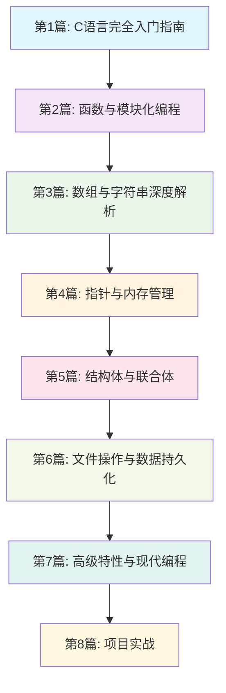


**C语言系统学习系列 - 第1篇**
本系列将带你从零开始，系统掌握C语言编程的各个方面，从基础语法到高级特性，从简单程序到复杂项目。


# 前言

C语言诞生于1972年，由Dennis Ritchie在贝尔实验室开发。作为一门接近底层的高级编程语言，C语言以其简洁、高效、可移植的特点，成为了现代编程语言的基石。无论是操作系统内核、嵌入式系统，还是高性能计算，C语言都发挥着不可替代的作用。

**为什么选择C语言作为编程入门？**

1. **基础性强**：掌握C语言后，学习其他编程语言会变得容易
2. **性能优秀**：直接编译成机器码，执行效率高
3. **应用广泛**：从系统软件到嵌入式开发，应用领域极其广泛
4. **理解底层**：帮助理解计算机的工作原理和内存管理

**本文学习目标：**
- 搭建现代C语言开发环境
- 理解C语言的发展历程和标准
- 掌握基本语法和数据类型
- 学会编译和调试程序
- 编写第一个完整的C程序



# 一、C语言发展历程与标准

## （一）C语言的演进历史

### 1. 历史发展脉络

```c
// C语言发展时间线
/*
1972年 - C语言诞生（Dennis Ritchie，贝尔实验室）
1978年 - 《The C Programming Language》出版（K&R C）
1989年 - ANSI C标准发布（C89/C90）
1999年 - C99标准发布，增加了许多新特性
2011年 - C11标准发布，引入多线程支持
2018年 - C18标准发布，主要是错误修正
*/

// 展示不同标准的特性差异
#include <stdio.h>
#include <stdbool.h>    // C99引入的布尔类型支持
#include <stdint.h>     // C99引入的固定宽度整数类型

int main() {
    // C99特性：变长数组（VLA）
    int n = 5;
    int array[n];  // 在C89中这是不允许的
    
    // C99特性：布尔类型
    bool is_valid = true;  // C89中需要使用int来模拟布尔值
    
    // C99特性：固定宽度整数类型
    int32_t precise_int = 42;  // 确保是32位整数
    
    // C99特性：内联变量声明
    for (int i = 0; i < n; i++) {  // C89要求在函数开头声明所有变量
        array[i] = i * i;
        printf("array[%d] = %d\n", i, array[i]);
    }
    
    printf("布尔值: %s\n", is_valid ? "true" : "false");
    printf("精确整数: %d\n", precise_int);
    
    return 0;
}
```

### 2. 现代C语言的特点

**C99标准的重要改进：**
- **变长数组（VLA）**：支持运行时确定大小的数组
- **内联函数**：提高函数调用效率
- **复数类型**：支持复数运算
- **布尔类型**：原生支持true/false
- **单行注释**：支持//风格注释

**C11标准的新特性：**
- **多线程支持**：标准化的线程库
- **原子操作**：支持无锁编程
- **静态断言**：编译时检查
- **匿名结构体和联合体**：更灵活的数据组织

## （二）选择合适的C标准

```c
// 编译器特性检测示例
#include <stdio.h>

int main() {
    // 检查C标准版本
    printf("C标准版本检测:\n");
    
#ifdef __STDC_VERSION__
    printf("__STDC_VERSION__ = %ld\n", __STDC_VERSION__);
    
    #if __STDC_VERSION__ >= 201112L
        printf("支持C11标准\n");
    #elif __STDC_VERSION__ >= 199901L
        printf("支持C99标准\n");
    #elif __STDC_VERSION__ >= 199409L
        printf("支持C94标准\n");
    #else
        printf("支持C89/C90标准\n");
    #endif
#else
    printf("编译器可能不完全支持标准C\n");
#endif

    // 检查编译器特定特性
#ifdef __GNUC__
    printf("使用GCC编译器，版本: %d.%d.%d\n", 
           __GNUC__, __GNUC_MINOR__, __GNUC_PATCHLEVEL__);
#endif

#ifdef _MSC_VER
    printf("使用Microsoft Visual C++编译器\n");
#endif

    return 0;
}
```

# 二、开发环境搭建

## （一）多平台开发环境选择

### 1. Windows平台推荐方案

**方案一：Visual Studio Code + MinGW-w64（推荐初学者）**

```bash
# 安装步骤（使用包管理器）
# 1. 安装Chocolatey包管理器（以管理员身份运行PowerShell）
Set-ExecutionPolicy Bypass -Scope Process -Force
[System.Net.ServicePointManager]::SecurityProtocol = [System.Net.ServicePointManager]::SecurityProtocol -bor 3072
iex ((New-Object System.Net.WebClient).DownloadString('https://chocolatey.org/install.ps1'))

# 2. 安装开发工具
choco install mingw -y          # 安装MinGW-w64编译器
choco install vscode -y         # 安装VS Code
choco install git -y            # 安装Git版本控制
```

**VS Code配置文件示例：**

```json
// .vscode/tasks.json - 编译任务配置
{
    "version": "2.0.0",
    "tasks": [
        {
            "label": "build",
            "type": "shell",
            "command": "gcc",
            "args": [
                "-std=c11",           // 使用C11标准
                "-Wall",              // 启用所有警告
                "-Wextra",            // 启用额外警告
                "-g",                 // 生成调试信息
                "${file}",            // 当前文件
                "-o",                 // 输出文件
                "${fileDirname}\\${fileBasenameNoExtension}.exe"
            ],
            "group": {
                "kind": "build",
                "isDefault": true
            },
            "presentation": {
                "echo": true,
                "reveal": "always",
                "focus": false,
                "panel": "shared"
            }
        }
    ]
}
```

**方案二：Dev-C++（简单易用）**

Dev-C++是一个轻量级的C/C++集成开发环境，特别适合初学者：

1. 下载地址：https://sourceforge.net/projects/orwelldevcpp/
2. 安装后即可使用，无需额外配置
3. 内置GCC编译器和调试器
4. 界面简洁，功能完整

### 2. Linux平台配置

```bash
# Ubuntu/Debian系统
sudo apt update
sudo apt install build-essential  # 安装GCC工具链
sudo apt install gdb             # 安装调试器
sudo apt install valgrind        # 安装内存检查工具

# CentOS/RHEL系统
sudo yum groupinstall "Development Tools"
sudo yum install gdb valgrind

# 验证安装
gcc --version    # 检查GCC版本
gdb --version    # 检查GDB版本
```

### 3. macOS平台配置

```bash
# 安装Xcode命令行工具
xcode-select --install

# 或使用Homebrew安装
brew install gcc
brew install gdb

# 验证安装
gcc --version
```

## （二）第一个C程序

### 1. Hello World程序详解

```c
// hello_world.c - 详细注释版本
#include <stdio.h>    // 预处理指令：包含标准输入输出库

/*
 * main函数：程序的入口点
 * 返回值：int类型，0表示程序正常结束，非0表示异常
 * 参数：暂时不使用参数，写成void或空括号
 */
int main(void) {
    // printf函数：格式化输出函数，定义在stdio.h中
    // \n：换行符，让输出后光标移到下一行
    printf("Hello, World!\n");
    
    // return语句：返回值给操作系统
    // 0：表示程序成功执行完毕
    return 0;
}
```

### 2. 编译和运行过程详解

```bash
# 编译过程的四个阶段

# 1. 预处理（Preprocessing）
gcc -E hello_world.c -o hello_world.i
# 处理#include、#define等预处理指令

# 2. 编译（Compilation）
gcc -S hello_world.i -o hello_world.s
# 将预处理后的代码转换为汇编代码

# 3. 汇编（Assembly）
gcc -c hello_world.s -o hello_world.o
# 将汇编代码转换为机器码（目标文件）

# 4. 链接（Linking）
gcc hello_world.o -o hello_world
# 将目标文件与库文件链接生成可执行文件

# 一步完成编译（常用方式）
gcc -std=c11 -Wall -Wextra -g hello_world.c -o hello_world

# 运行程序
./hello_world    # Linux/macOS
hello_world.exe  # Windows
```

### 3. 编译选项详解

```bash
# 常用编译选项
gcc -std=c11      # 指定C标准版本
    -Wall         # 启用常见警告
    -Wextra       # 启用额外警告
    -Werror       # 将警告视为错误
    -g            # 生成调试信息
    -O2           # 启用优化（发布版本）
    -DDEBUG       # 定义宏DEBUG
    -I./include   # 指定头文件搜索路径
    -L./lib       # 指定库文件搜索路径
    -lm           # 链接数学库
    hello_world.c # 源文件
    -o hello_world # 输出文件名
```

# 三、C语言基础语法

## （一）数据类型系统

### 1. 基本数据类型详解

```c
#include <stdio.h>
#include <stdint.h>   // C99标准：固定宽度整数类型
#include <limits.h>   // 数据类型的取值范围
#include <float.h>    // 浮点数的精度信息

int main(void) {
    printf("=== C语言数据类型详解 ===\n\n");
    
    // 整数类型
    printf("整数类型:\n");
    printf("char:      %zu字节, 范围: %d 到 %d\n", 
           sizeof(char), CHAR_MIN, CHAR_MAX);
    printf("short:     %zu字节, 范围: %d 到 %d\n", 
           sizeof(short), SHRT_MIN, SHRT_MAX);
    printf("int:       %zu字节, 范围: %d 到 %d\n", 
           sizeof(int), INT_MIN, INT_MAX);
    printf("long:      %zu字节, 范围: %ld 到 %ld\n", 
           sizeof(long), LONG_MIN, LONG_MAX);
    printf("long long: %zu字节, 范围: %lld 到 %lld\n", 
           sizeof(long long), LLONG_MIN, LLONG_MAX);
    
    // 无符号整数类型
    printf("\n无符号整数类型:\n");
    printf("unsigned char:      %zu字节, 最大值: %u\n", 
           sizeof(unsigned char), UCHAR_MAX);
    printf("unsigned short:     %zu字节, 最大值: %u\n", 
           sizeof(unsigned short), USHRT_MAX);
    printf("unsigned int:       %zu字节, 最大值: %u\n", 
           sizeof(unsigned int), UINT_MAX);
    printf("unsigned long:      %zu字节, 最大值: %lu\n", 
           sizeof(unsigned long), ULONG_MAX);
    printf("unsigned long long: %zu字节, 最大值: %llu\n", 
           sizeof(unsigned long long), ULLONG_MAX);
    
    // 浮点数类型
    printf("\n浮点数类型:\n");
    printf("float:       %zu字节, 精度: %d位, 范围: %e 到 %e\n", 
           sizeof(float), FLT_DIG, FLT_MIN, FLT_MAX);
    printf("double:      %zu字节, 精度: %d位, 范围: %e 到 %e\n", 
           sizeof(double), DBL_DIG, DBL_MIN, DBL_MAX);
    printf("long double: %zu字节, 精度: %d位, 范围: %Le 到 %Le\n", 
           sizeof(long double), LDBL_DIG, LDBL_MIN, LDBL_MAX);
    
    // C99固定宽度整数类型（推荐使用）
    printf("\nC99固定宽度整数类型:\n");
    printf("int8_t:   %zu字节\n", sizeof(int8_t));
    printf("int16_t:  %zu字节\n", sizeof(int16_t));
    printf("int32_t:  %zu字节\n", sizeof(int32_t));
    printf("int64_t:  %zu字节\n", sizeof(int64_t));
    
    return 0;
}
```

### 2. 变量声明和初始化

```c
#include <stdio.h>
#include <stdbool.h>  // C99布尔类型支持

int main(void) {
    // 基本变量声明和初始化
    int age = 25;                    // 整数变量
    float height = 175.5f;           // 单精度浮点数（注意f后缀）
    double weight = 68.5;            // 双精度浮点数
    char grade = 'A';                // 字符变量
    bool is_student = true;          // C99布尔类型
    
    // 常量声明（C99特性）
    const int MAX_STUDENTS = 100;    // 编译时常量
    const double PI = 3.14159265359; // 数学常量
    
    // 变量命名规范示例
    int student_count;               // 下划线命名法（推荐）
    int studentCount;                // 驼峰命名法
    int BUFFER_SIZE = 1024;          // 常量使用大写
    
    // 多变量声明
    int x = 10, y = 20, z = 30;      // 同时声明多个变量
    
    // 输出变量值
    printf("个人信息:\n");
    printf("年龄: %d岁\n", age);
    printf("身高: %.1f厘米\n", height);
    printf("体重: %.1f公斤\n", weight);
    printf("等级: %c\n", grade);
    printf("是否为学生: %s\n", is_student ? "是" : "否");
    
    printf("\n常量信息:\n");
    printf("最大学生数: %d\n", MAX_STUDENTS);
    printf("圆周率: %.10f\n", PI);
    
    return 0;
}
```

## （二）运算符和表达式

### 1. 算术运算符详解

```c
#include <stdio.h>
#include <math.h>  // 数学函数库

int main(void) {
    int a = 17, b = 5;
    double x = 17.0, y = 5.0;
    
    printf("=== 算术运算符演示 ===\n");
    printf("整数运算 (a=%d, b=%d):\n", a, b);
    printf("a + b = %d\n", a + b);      // 加法
    printf("a - b = %d\n", a - b);      // 减法
    printf("a * b = %d\n", a * b);      // 乘法
    printf("a / b = %d\n", a / b);      // 整数除法（截断）
    printf("a %% b = %d\n", a % b);     // 取模运算
    
    printf("\n浮点数运算 (x=%.1f, y=%.1f):\n", x, y);
    printf("x + y = %.2f\n", x + y);
    printf("x - y = %.2f\n", x - y);
    printf("x * y = %.2f\n", x * y);
    printf("x / y = %.2f\n", x / y);    // 浮点数除法
    
    // 数学函数示例
    printf("\n数学函数:\n");
    printf("sqrt(%.1f) = %.2f\n", x, sqrt(x));      // 平方根
    printf("pow(%.1f, %.1f) = %.2f\n", x, y, pow(x, y)); // 幂运算
    printf("sin(%.1f) = %.2f\n", x, sin(x));        // 正弦函数
    printf("log(%.1f) = %.2f\n", x, log(x));        // 自然对数
    
    // 运算符优先级演示
    int result = a + b * 2 - 3;  // 乘法优先于加减法
    printf("\n运算符优先级:\n");
    printf("%d + %d * 2 - 3 = %d\n", a, b, result);
    printf("等价于: %d + (%d * 2) - 3 = %d\n", a, b, a + (b * 2) - 3);
    
    return 0;
}
```


**编译提示**：使用数学函数时，在Linux/macOS下编译需要链接数学库：
```bash
gcc -std=c11 -Wall -lm program.c -o program
```


# 四、程序控制结构

## （一）条件语句

### 1. if语句的各种形式

```c
#include <stdio.h>
#include <stdbool.h>

// 函数声明：判断年份是否为闰年
bool is_leap_year(int year);
char get_grade(int score);

int main(void) {
    int score, year;
    
    // 获取用户输入
    printf("请输入考试分数 (0-100): ");
    scanf("%d", &score);
    
    // 基本if-else语句
    if (score >= 0 && score <= 100) {
        printf("分数有效\n");
        
        // 嵌套if-else语句
        if (score >= 90) {
            printf("优秀！\n");
        } else if (score >= 80) {
            printf("良好\n");
        } else if (score >= 70) {
            printf("中等\n");
        } else if (score >= 60) {
            printf("及格\n");
        } else {
            printf("不及格\n");
        }
        
        // 使用函数简化逻辑
        char grade = get_grade(score);
        printf("等级: %c\n", grade);
        
    } else {
        printf("分数无效！请输入0-100之间的数字。\n");
        return 1;  // 异常退出
    }
    
    // switch语句示例
    printf("\n请输入年份: ");
    scanf("%d", &year);
    
    if (is_leap_year(year)) {
        printf("%d年是闰年\n", year);
    } else {
        printf("%d年不是闰年\n", year);
    }
    
    // 三元运算符（条件运算符）
    int max_score = (score > 95) ? score : 95;
    printf("调整后的最高分: %d\n", max_score);
    
    return 0;
}

// 判断闰年的函数实现
bool is_leap_year(int year) {
    // 闰年规则：能被4整除但不能被100整除，或者能被400整除
    return (year % 4 == 0 && year % 100 != 0) || (year % 400 == 0);
}

// 根据分数返回等级的函数
char get_grade(int score) {
    if (score >= 90) return 'A';
    else if (score >= 80) return 'B';
    else if (score >= 70) return 'C';
    else if (score >= 60) return 'D';
    else return 'F';
}
```

## （二）循环语句

### 1. 三种循环的对比和应用

```c
#include <stdio.h>
#include <stdlib.h>
#include <time.h>

int main(void) {
    // 初始化随机数生成器
    srand((unsigned int)time(NULL));
    
    printf("=== 循环语句演示 ===\n\n");
    
    // for循环：适用于已知循环次数的情况
    printf("1. for循环 - 打印乘法表:\n");
    for (int i = 1; i <= 5; i++) {
        for (int j = 1; j <= i; j++) {
            printf("%d×%d=%2d  ", j, i, i * j);
        }
        printf("\n");
    }
    
    // while循环：适用于根据条件判断的情况
    printf("\n2. while循环 - 计算斐波那契数列:\n");
    int fib1 = 0, fib2 = 1, next;
    int count = 0;
    printf("斐波那契数列的前10项: ");
    
    while (count < 10) {
        if (count == 0) {
            printf("%d ", fib1);
        } else if (count == 1) {
            printf("%d ", fib2);
        } else {
            next = fib1 + fib2;
            printf("%d ", next);
            fib1 = fib2;
            fib2 = next;
        }
        count++;
    }
    printf("\n");
    
    // do-while循环：至少执行一次的情况
    printf("\n3. do-while循环 - 猜数字游戏:\n");
    int secret = rand() % 100 + 1;  // 1-100之间的随机数
    int guess, attempts = 0;
    
    printf("我想了一个1-100之间的数字，你来猜猜看！\n");
    
    do {
        printf("请输入你的猜测: ");
        scanf("%d", &guess);
        attempts++;
        
        if (guess > secret) {
            printf("太大了！\n");
        } else if (guess < secret) {
            printf("太小了！\n");
        } else {
            printf("恭喜你！猜对了！\n");
            printf("你用了 %d 次尝试。\n", attempts);
        }
    } while (guess != secret && attempts < 7);  // 最多7次机会
    
    if (guess != secret) {
        printf("很遗憾，机会用完了！答案是 %d\n", secret);
    }
    
    // 循环控制语句：break和continue
    printf("\n4. 循环控制 - 寻找质数:\n");
    printf("100以内的质数: ");
    
    for (int num = 2; num <= 100; num++) {
        bool is_prime = true;
        
        // 检查是否为质数
        for (int i = 2; i * i <= num; i++) {
            if (num % i == 0) {
                is_prime = false;
                break;  // 找到因子，跳出内层循环
            }
        }
        
        if (is_prime) {
            printf("%d ", num);
        }
    }
    printf("\n");
    
    return 0;
}
```

# 五、调试技巧和错误处理

## （一）常见编译错误

```c
// 常见错误示例和修正方法

// 错误1：语法错误
/*
int main() {
    printf("Hello World")  // 缺少分号
    return 0
}  // 缺少分号
*/

// 正确写法：
int main(void) {
    printf("Hello World\n");  // 添加分号和换行符
    return 0;                 // 添加分号
}

// 错误2：未声明的变量
/*
int main() {
    printf("%d\n", x);  // x未声明
    return 0;
}
*/

// 正确写法：
int main(void) {
    int x = 42;           // 先声明并初始化
    printf("%d\n", x);
    return 0;
}

// 错误3：类型不匹配
/*
int main() {
    int x = 3.14;         // 将浮点数赋给整数
    printf("%f\n", x);    // 格式说明符不匹配
    return 0;
}
*/

// 正确写法：
int main(void) {
    double x = 3.14;      // 使用正确的类型
    printf("%.2f\n", x);  // 使用正确的格式说明符
    return 0;
}
```

## （二）调试技巧

```c
#include <stdio.h>
#include <assert.h>  // 断言库

// 调试宏定义
#ifdef DEBUG
    #define DBG_PRINT(fmt, ...) \
        printf("[DEBUG] %s:%d: " fmt, __FILE__, __LINE__, ##__VA_ARGS__)
#else
    #define DBG_PRINT(fmt, ...)  // 发布版本中不输出调试信息
#endif

// 示例函数：计算阶乘
long long factorial(int n) {
    // 使用断言检查输入参数
    assert(n >= 0);  // 确保输入非负
    
    DBG_PRINT("计算 %d 的阶乘\n", n);
    
    if (n == 0 || n == 1) {
        DBG_PRINT("基础情况: %d! = 1\n", n);
        return 1;
    }
    
    long long result = 1;
    for (int i = 2; i <= n; i++) {
        result *= i;
        DBG_PRINT("步骤 %d: result = %lld\n", i, result);
    }
    
    return result;
}

int main(void) {
    printf("=== 调试技巧演示 ===\n");
    
    // 正常情况测试
    int n = 5;
    long long result = factorial(n);
    printf("%d! = %lld\n", n, result);
    
    // 边界情况测试
    printf("0! = %lld\n", factorial(0));
    printf("1! = %lld\n", factorial(1));
    
    // 错误情况测试（会触发断言）
    // factorial(-1);  // 取消注释会导致程序终止
    
    return 0;
}
```


**编译调试版本**：
```bash
# 编译调试版本（包含调试信息）
gcc -std=c11 -Wall -Wextra -g -DDEBUG program.c -o program_debug

# 编译发布版本（优化，无调试信息）
gcc -std=c11 -Wall -Wextra -O2 program.c -o program_release
```


# 六、学习路线图

## （一）后续学习计划



## （二）实践建议

**每日练习计划：**
1. **第1-3天**：熟练掌握基本语法和数据类型
2. **第4-7天**：练习条件语句和循环语句
3. **第8-14天**：编写小程序，如计算器、猜数字游戏等
4. **第15-21天**：准备学习下一篇文章内容

**推荐练习项目：**
- 简单计算器
- 温度转换程序
- 成绩管理系统（基础版）
- 数字游戏集合



---

**参考资料：**
- 《C程序设计语言》（第2版）- Brian W. Kernighan & Dennis M. Ritchie
- 《C Primer Plus》（第6版）- Stephen Prata
- 《现代C语言程序设计》- K. N. King
- ISO/IEC 9899:2018 - C语言国际标准
- GCC官方文档：https://gcc.gnu.org/onlinedocs/
- C语言参考手册：https://en.cppreference.com/w/c
