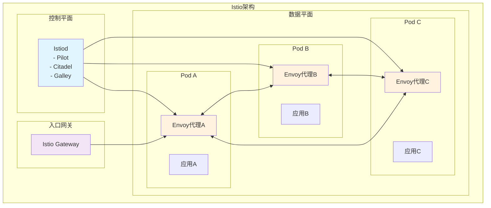

# 一、Istio概述

## （一）什么是Istio

Istio是一个开源的服务网格平台，由Google、IBM和Lyft联合开发。它为微服务架构提供了一个统一的方式来连接、管理和保护服务，而无需修改应用程序代码。Istio通过在每个服务旁边部署智能代理（Envoy Proxy）来实现服务间通信的管理。

> **核心价值**：Istio将服务间通信的复杂性从应用程序中抽离出来，提供统一的流量管理、安全策略和可观测性能力。

## （二）Istio的核心特性

### 1. 流量管理
- **智能路由**：基于HTTP头、权重、版本等条件的流量路由
- **负载均衡**：多种负载均衡算法支持
- **故障注入**：模拟网络故障进行混沌工程测试
- **超时和重试**：自动处理服务调用的超时和重试逻辑

### 2. 安全性
- **自动mTLS**：服务间通信的自动加密
- **身份认证**：基于SPIFFE的服务身份管理
- **访问控制**：细粒度的授权策略
- **审计日志**：完整的安全事件记录

### 3. 可观测性
- **指标收集**：自动收集服务间通信指标
- **分布式追踪**：完整的请求链路追踪
- **访问日志**：详细的服务访问记录
- **服务拓扑**：可视化的服务依赖关系

## （三）Istio架构组件



# 二、Istio安装与配置

## （一）环境准备

### 1. 前置条件

在安装Istio之前，确保满足以下条件：

- **Kubernetes集群**：版本1.22+
- **kubectl工具**：配置好集群访问权限
- **足够的资源**：至少4GB内存，2个CPU核心
- **网络连通性**：能够访问Docker Hub和Istio官方镜像仓库

### 2. 下载Istio

```shell
# 下载最新版本的Istio
curl -L https://istio.io/downloadIstio | sh -

# 进入Istio目录
cd istio-1.20.0

# 将istioctl添加到PATH
export PATH=$PWD/bin:$PATH

# 验证安装
istioctl version --remote=false
```

## （二）安装Istio

### 1. 使用istioctl安装

```shell
# 预检查集群兼容性
istioctl x precheck

# 安装Istio控制平面（使用默认配置）
istioctl install --set values.defaultRevision=default

# 验证安装状态
kubectl get pods -n istio-system

# 检查Istio组件状态
istioctl proxy-status
```

### 2. 自定义安装配置

```yaml
# istio-config.yaml - 自定义安装配置
apiVersion: install.istio.io/v1alpha1
kind: IstioOperator
metadata:
  name: control-plane
spec:
  values:
    global:
      meshID: mesh1                    # 网格标识
      multiCluster:
        clusterName: cluster1          # 集群名称
      network: network1                # 网络标识
    pilot:
      traceSampling: 1.0              # 追踪采样率100%
  components:
    pilot:
      k8s:
        resources:
          requests:
            cpu: 200m                  # CPU请求
            memory: 128Mi              # 内存请求
          limits:
            cpu: 500m                  # CPU限制
            memory: 512Mi              # 内存限制
    ingressGateways:
    - name: istio-ingressgateway
      enabled: true
      k8s:
        service:
          type: LoadBalancer           # 服务类型
          ports:
          - port: 80
            targetPort: 8080
            name: http2
          - port: 443
            targetPort: 8443
            name: https
```

```shell
# 使用自定义配置安装
istioctl install -f istio-config.yaml
```

### 3. 启用Sidecar自动注入

```shell
# 为命名空间启用自动注入
kubectl label namespace default istio-injection=enabled

# 验证标签设置
kubectl get namespace -L istio-injection

# 查看注入配置
kubectl get mutatingwebhookconfiguration istio-sidecar-injector -o yaml
```

## （三）部署示例应用

### 1. Bookinfo应用部署

```shell
# 部署Bookinfo示例应用
kubectl apply -f samples/bookinfo/platform/kube/bookinfo.yaml

# 验证应用部署
kubectl get services
kubectl get pods

# 检查Sidecar注入情况
kubectl describe pod productpage-v1-xxx
```

### 2. 配置入口网关

```yaml
# bookinfo-gateway.yaml
apiVersion: networking.istio.io/v1alpha3
kind: Gateway
metadata:
  name: bookinfo-gateway
spec:
  selector:
    istio: ingressgateway              # 使用默认的入口网关
  servers:
  - port:
      number: 80
      name: http
      protocol: HTTP
    hosts:
    - "*"                              # 接受所有主机的请求
---
apiVersion: networking.istio.io/v1alpha3
kind: VirtualService
metadata:
  name: bookinfo
spec:
  hosts:
  - "*"
  gateways:
  - bookinfo-gateway
  http:
  - match:
    - uri:
        exact: /productpage            # 精确匹配路径
    - uri:
        prefix: /static                # 前缀匹配
    - uri:
        exact: /login
    - uri:
        exact: /logout
    - uri:
        prefix: /api/v1/products
    route:
    - destination:
        host: productpage              # 目标服务
        port:
          number: 9080
```

```shell
# 应用网关配置
kubectl apply -f bookinfo-gateway.yaml

# 获取入口网关地址
export INGRESS_HOST=$(kubectl -n istio-system get service istio-ingressgateway -o jsonpath='{.status.loadBalancer.ingress[0].ip}')
export INGRESS_PORT=$(kubectl -n istio-system get service istio-ingressgateway -o jsonpath='{.spec.ports[?(@.name=="http2")].port}')
export GATEWAY_URL=$INGRESS_HOST:$INGRESS_PORT

# 测试应用访问
curl -s "http://${GATEWAY_URL}/productpage" | grep -o "<title>.*</title>"
```

# 三、流量管理

## （一）VirtualService详解

VirtualService定义了如何将请求路由到服务，是Istio流量管理的核心资源。

### 1. 基本路由配置

```yaml
# reviews-virtualservice.yaml
apiVersion: networking.istio.io/v1alpha3
kind: VirtualService
metadata:
  name: reviews
spec:
  hosts:
  - reviews                            # 目标服务主机名
  http:
  - match:
    - headers:
        end-user:
          exact: jason                 # 匹配特定用户
    route:
    - destination:
        host: reviews
        subset: v2                     # 路由到v2版本
  - route:
    - destination:
        host: reviews
        subset: v1                     # 默认路由到v1版本
```

### 2. 流量分割配置

```yaml
# canary-deployment.yaml
apiVersion: networking.istio.io/v1alpha3
kind: VirtualService
metadata:
  name: reviews-canary
spec:
  hosts:
  - reviews
  http:
  - route:
    - destination:
        host: reviews
        subset: v1
      weight: 90                       # 90%流量到v1版本
    - destination:
        host: reviews
        subset: v2
      weight: 10                       # 10%流量到v2版本（金丝雀）
```

### 3. 故障注入配置

```yaml
# fault-injection.yaml
apiVersion: networking.istio.io/v1alpha3
kind: VirtualService
metadata:
  name: ratings-fault
spec:
  hosts:
  - ratings
  http:
  - match:
    - headers:
        end-user:
          exact: jason
    fault:
      delay:
        percentage:
          value: 100                   # 100%的请求
        fixedDelay: 7s                 # 延迟7秒
    route:
    - destination:
        host: ratings
        subset: v1
  - route:
    - destination:
        host: ratings
        subset: v1
```

## （二）DestinationRule详解

DestinationRule定义了访问服务的策略，包括负载均衡、连接池设置等。

### 1. 服务子集定义

```yaml
# reviews-destination-rule.yaml
apiVersion: networking.istio.io/v1alpha3
kind: DestinationRule
metadata:
  name: reviews
spec:
  host: reviews
  trafficPolicy:
    loadBalancer:
      simple: LEAST_CONN               # 最少连接负载均衡
  subsets:
  - name: v1
    labels:
      version: v1                      # 基于标签选择Pod
  - name: v2
    labels:
      version: v2
    trafficPolicy:
      loadBalancer:
        simple: ROUND_ROBIN            # 轮询负载均衡
  - name: v3
    labels:
      version: v3
```

### 2. 连接池配置

```yaml
# connection-pool.yaml
apiVersion: networking.istio.io/v1alpha3
kind: DestinationRule
metadata:
  name: productpage
spec:
  host: productpage
  trafficPolicy:
    connectionPool:
      tcp:
        maxConnections: 10             # 最大连接数
        connectTimeout: 30s            # 连接超时
        keepAlive:
          time: 7200s                  # 保活时间
          interval: 75s                # 保活间隔
      http:
        http1MaxPendingRequests: 10    # HTTP1最大挂起请求
        http2MaxRequests: 100          # HTTP2最大请求数
        maxRequestsPerConnection: 2    # 每连接最大请求数
        maxRetries: 3                  # 最大重试次数
        consecutiveGatewayErrors: 5    # 连续网关错误数
        interval: 30s                  # 检测间隔
        baseEjectionTime: 30s          # 基础驱逐时间
        maxEjectionPercent: 50         # 最大驱逐百分比
```

### 3. 熔断器配置

```yaml
# circuit-breaker.yaml
apiVersion: networking.istio.io/v1alpha3
kind: DestinationRule
metadata:
  name: httpbin
spec:
  host: httpbin
  trafficPolicy:
    outlierDetection:
      consecutiveGatewayErrors: 1      # 连续网关错误阈值
      consecutive5xxErrors: 1          # 连续5xx错误阈值
      interval: 1s                     # 分析间隔
      baseEjectionTime: 3m             # 基础驱逐时间
      maxEjectionPercent: 100          # 最大驱逐百分比
      minHealthPercent: 50             # 最小健康百分比
```

## （三）Gateway配置

Gateway管理进入网格的流量，类似于传统的负载均衡器。

### 1. HTTPS网关配置

```yaml
# https-gateway.yaml
apiVersion: networking.istio.io/v1alpha3
kind: Gateway
metadata:
  name: bookinfo-gateway-https
spec:
  selector:
    istio: ingressgateway
  servers:
  - port:
      number: 443
      name: https
      protocol: HTTPS
    tls:
      mode: SIMPLE                     # 简单TLS模式
      credentialName: bookinfo-secret  # TLS证书Secret名称
    hosts:
    - bookinfo.example.com             # 域名
  - port:
      number: 80
      name: http
      protocol: HTTP
    hosts:
    - bookinfo.example.com
    tls:
      httpsRedirect: true              # HTTP重定向到HTTPS
```

### 2. 多域名网关配置

```yaml
# multi-domain-gateway.yaml
apiVersion: networking.istio.io/v1alpha3
kind: Gateway
metadata:
  name: multi-domain-gateway
spec:
  selector:
    istio: ingressgateway
  servers:
  - port:
      number: 80
      name: http-bookinfo
      protocol: HTTP
    hosts:
    - bookinfo.example.com
  - port:
      number: 80
      name: http-reviews
      protocol: HTTP
    hosts:
    - reviews.example.com
  - port:
      number: 443
      name: https
      protocol: HTTPS
    tls:
      mode: SIMPLE
      credentialName: wildcard-secret
    hosts:
    - "*.example.com"                  # 通配符域名
```

# 四、安全策略

## （一）认证策略

### 1. 启用mTLS

```yaml
# peer-authentication.yaml
apiVersion: security.istio.io/v1beta1
kind: PeerAuthentication
metadata:
  name: default
  namespace: production
spec:
  mtls:
    mode: STRICT                       # 严格mTLS模式，拒绝明文连接
---
# 为特定服务配置mTLS
apiVersion: security.istio.io/v1beta1
kind: PeerAuthentication
metadata:
  name: productpage
  namespace: default
spec:
  selector:
    matchLabels:
      app: productpage
  mtls:
    mode: PERMISSIVE                   # 宽松模式，允许明文和mTLS混合
```

### 2. JWT认证配置

```yaml
# jwt-authentication.yaml
apiVersion: security.istio.io/v1beta1
kind: RequestAuthentication
metadata:
  name: jwt-example
  namespace: foo
spec:
  selector:
    matchLabels:
      app: httpbin
  jwtRules:
  - issuer: "testing@secure.istio.io"  # JWT签发者
    jwksUri: "https://raw.githubusercontent.com/istio/istio/release-1.20/security/tools/jwt/samples/jwks.json"
    audiences:
    - "example-audience"               # 受众
    forwardOriginalToken: true         # 转发原始token
  - issuer: "second-issuer@secure.istio.io"
    jwksUri: "https://example.com/.well-known/jwks.json"
```

## （二）授权策略

### 1. 基本访问控制

```yaml
# authorization-policy.yaml
apiVersion: security.istio.io/v1beta1
kind: AuthorizationPolicy
metadata:
  name: allow-read
  namespace: default
spec:
  selector:
    matchLabels:
      app: httpbin
  action: ALLOW                        # 允许访问
  rules:
  - from:
    - source:
        principals: ["cluster.local/ns/default/sa/sleep"]  # 来源身份
  - to:
    - operation:
        methods: ["GET"]               # 允许的HTTP方法
        paths: ["/info*"]              # 允许的路径
  - when:
    - key: source.ip
      values: ["10.0.0.0/8"]          # 来源IP限制
```

### 2. 拒绝策略配置

```yaml
# deny-policy.yaml
apiVersion: security.istio.io/v1beta1
kind: AuthorizationPolicy
metadata:
  name: deny-all
  namespace: production
spec:
  {}                                   # 空规则表示拒绝所有请求
---
# 拒绝特定操作
apiVersion: security.istio.io/v1beta1
kind: AuthorizationPolicy
metadata:
  name: deny-delete
  namespace: default
spec:
  selector:
    matchLabels:
      app: httpbin
  action: DENY                         # 拒绝访问
  rules:
  - to:
    - operation:
        methods: ["DELETE"]            # 拒绝DELETE方法
```

### 3. 基于角色的访问控制

```yaml
# rbac-policy.yaml
apiVersion: security.istio.io/v1beta1
kind: AuthorizationPolicy
metadata:
  name: admin-access
  namespace: default
spec:
  selector:
    matchLabels:
      app: admin-panel
  action: ALLOW
  rules:
  - from:
    - source:
        requestPrincipals: ["testing@secure.istio.io/admin"]  # 管理员身份
  - to:
    - operation:
        methods: ["GET", "POST", "PUT", "DELETE"]
---
apiVersion: security.istio.io/v1beta1
kind: AuthorizationPolicy
metadata:
  name: user-access
  namespace: default
spec:
  selector:
    matchLabels:
      app: user-service
  action: ALLOW
  rules:
  - from:
    - source:
        requestPrincipals: ["testing@secure.istio.io/user"]   # 普通用户身份
  - to:
    - operation:
        methods: ["GET", "POST"]       # 用户只能读取和创建
```

# 五、可观测性

## （一）指标收集

### 1. Prometheus集成

```yaml
# telemetry-v2.yaml
apiVersion: telemetry.istio.io/v1alpha1
kind: Telemetry
metadata:
  name: metrics
  namespace: istio-system
spec:
  metrics:
  - providers:
    - name: prometheus
  - overrides:
    - match:
        metric: ALL_METRICS
      tagOverrides:
        destination_service_name:
          value: "{{.destination_service_name | default \"unknown\"}}"
        destination_service_namespace:
          value: "{{.destination_service_namespace | default \"unknown\"}}"
```

### 2. 自定义指标配置

```yaml
# custom-metrics.yaml
apiVersion: telemetry.istio.io/v1alpha1
kind: Telemetry
metadata:
  name: custom-metrics
  namespace: default
spec:
  metrics:
  - providers:
    - name: prometheus
  - overrides:
    - match:
        metric: requests_total
      disabled: false
      tagOverrides:
        custom_header:
          value: "{{.request_headers['x-custom-header'] | default \"none\"}}"
  - providers:
    - name: prometheus
    overrides:
    - match:
        metric: tcp_connections_opened_total
      disabled: true                   # 禁用TCP连接指标
```

## （二）分布式追踪

### 1. Jaeger集成

```yaml
# jaeger-tracing.yaml
apiVersion: v1
kind: ConfigMap
metadata:
  name: istio
  namespace: istio-system
data:
  mesh: |
    defaultConfig:
      tracing:
        sampling: 100.0                # 100%采样率（生产环境建议降低）
        zipkin:
          address: jaeger-collector.istio-system:9411
    extensionProviders:
    - name: jaeger
      zipkin:
        service: jaeger-collector.istio-system
        port: 9411
```

### 2. 追踪采样配置

```yaml
# sampling-config.yaml
apiVersion: telemetry.istio.io/v1alpha1
kind: Telemetry
metadata:
  name: tracing
  namespace: istio-system
spec:
  tracing:
  - providers:
    - name: jaeger
  - randomSamplingPercentage: 1.0      # 1%采样率
```

## （三）访问日志

### 1. 启用访问日志

```yaml
# access-logs.yaml
apiVersion: telemetry.istio.io/v1alpha1
kind: Telemetry
metadata:
  name: access-logs
  namespace: istio-system
spec:
  accessLogging:
  - providers:
    - name: otel
  - format:
      text: |
        [%START_TIME%] "%REQ(:METHOD)% %REQ(X-ENVOY-ORIGINAL-PATH?:PATH)% %PROTOCOL%"
        %RESPONSE_CODE% %RESPONSE_FLAGS% %BYTES_RECEIVED% %BYTES_SENT%
        %DURATION% %RESP(X-ENVOY-UPSTREAM-SERVICE-TIME)% "%REQ(X-FORWARDED-FOR)%"
        "%REQ(USER-AGENT)%" "%REQ(X-REQUEST-ID)%" "%REQ(:AUTHORITY)%" "%UPSTREAM_HOST%"
```

### 2. 结构化日志配置

```yaml
# structured-logs.yaml
apiVersion: telemetry.istio.io/v1alpha1
kind: Telemetry
metadata:
  name: structured-logs
  namespace: production
spec:
  accessLogging:
  - providers:
    - name: otel
  - format:
      json:
        timestamp: "%START_TIME%"
        method: "%REQ(:METHOD)%"
        path: "%REQ(X-ENVOY-ORIGINAL-PATH?:PATH)%"
        protocol: "%PROTOCOL%"
        response_code: "%RESPONSE_CODE%"
        response_flags: "%RESPONSE_FLAGS%"
        bytes_received: "%BYTES_RECEIVED%"
        bytes_sent: "%BYTES_SENT%"
        duration: "%DURATION%"
        upstream_service_time: "%RESP(X-ENVOY-UPSTREAM-SERVICE-TIME)%"
        x_forwarded_for: "%REQ(X-FORWARDED-FOR)%"
        user_agent: "%REQ(USER-AGENT)%"
        request_id: "%REQ(X-REQUEST-ID)%"
        authority: "%REQ(:AUTHORITY)%"
        upstream_host: "%UPSTREAM_HOST%"
```

# 六、Istio运维与故障排查

## （一）常用运维命令

### 1. 状态检查命令

```shell
# 检查Istio安装状态
istioctl verify-install

# 查看代理状态
istioctl proxy-status

# 分析配置问题
istioctl analyze

# 查看特定Pod的代理配置
istioctl proxy-config cluster productpage-v1-xxx -n default

# 查看路由配置
istioctl proxy-config route productpage-v1-xxx -n default

# 查看监听器配置
istioctl proxy-config listener productpage-v1-xxx -n default

# 查看端点配置
istioctl proxy-config endpoint productpage-v1-xxx -n default
```

### 2. 调试命令

```shell
# 检查mTLS状态
istioctl authn tls-check productpage-v1-xxx.default

# 查看证书信息
istioctl proxy-config secret productpage-v1-xxx -n default

# 检查服务网格配置
istioctl describe pod productpage-v1-xxx -n default

# 查看Envoy访问日志
kubectl logs productpage-v1-xxx -c istio-proxy -n default

# 实时查看代理日志
kubectl logs -f productpage-v1-xxx -c istio-proxy -n default
```

## （二）常见问题排查

### 1. 服务无法访问

**排查步骤**：

```shell
# 1. 检查Pod状态
kubectl get pods -n default

# 2. 检查Sidecar注入
kubectl describe pod productpage-v1-xxx -n default | grep istio-proxy

# 3. 检查服务配置
kubectl get svc -n default

# 4. 检查VirtualService和DestinationRule
kubectl get virtualservice,destinationrule -n default

# 5. 分析配置
istioctl analyze -n default

# 6. 查看代理配置同步状态
istioctl proxy-status
```

### 2. mTLS连接问题

**排查步骤**：

```shell
# 1. 检查PeerAuthentication策略
kubectl get peerauthentication -A

# 2. 检查证书状态
istioctl proxy-config secret productpage-v1-xxx -n default

# 3. 验证mTLS连接
istioctl authn tls-check productpage-v1-xxx.default

# 4. 查看TLS相关日志
kubectl logs productpage-v1-xxx -c istio-proxy -n default | grep -i tls
```

### 3. 流量路由问题

**排查步骤**：

```shell
# 1. 检查VirtualService配置
kubectl get virtualservice reviews -o yaml

# 2. 检查DestinationRule配置
kubectl get destinationrule reviews -o yaml

# 3. 验证路由配置
istioctl proxy-config route productpage-v1-xxx -n default

# 4. 检查集群配置
istioctl proxy-config cluster productpage-v1-xxx -n default

# 5. 查看端点发现
istioctl proxy-config endpoint productpage-v1-xxx -n default
```

## （三）性能优化

### 1. 资源配置优化

```yaml
# istio-optimization.yaml
apiVersion: install.istio.io/v1alpha1
kind: IstioOperator
metadata:
  name: control-plane
spec:
  values:
    global:
      proxy:
        resources:
          requests:
            cpu: 100m                  # 降低CPU请求
            memory: 128Mi              # 降低内存请求
          limits:
            cpu: 200m                  # 设置CPU限制
            memory: 256Mi              # 设置内存限制
    pilot:
      env:
        PILOT_PUSH_THROTTLE: 100       # 推送限流
        PILOT_MAX_WORKLOAD_ENTRIES: 99999  # 最大工作负载条目
  components:
    pilot:
      k8s:
        resources:
          requests:
            cpu: 500m
            memory: 2048Mi
          limits:
            cpu: 1000m
            memory: 4096Mi
        hpaSpec:
          maxReplicas: 5               # 最大副本数
          minReplicas: 2               # 最小副本数
          scaleTargetRef:
            apiVersion: apps/v1
            kind: Deployment
            name: istiod
          metrics:
          - type: Resource
            resource:
              name: cpu
              target:
                type: Utilization
                averageUtilization: 80
```

### 2. 代理配置优化

```yaml
# proxy-optimization.yaml
apiVersion: v1
kind: ConfigMap
metadata:
  name: istio
  namespace: istio-system
data:
  mesh: |
    defaultConfig:
      concurrency: 2                   # 工作线程数
      proxyStatsMatcher:
        inclusionRegexps:
        - ".*circuit_breakers.*"
        - ".*upstream_rq_retry.*"
        - ".*_cx_.*"
        exclusionRegexps:
        - ".*osconfig.*"
      holdApplicationUntilProxyStarts: true  # 等待代理启动
```

# 七、总结

Istio作为业界领先的服务网格解决方案，为微服务架构提供了强大的流量管理、安全策略和可观测性能力。通过本文的详细介绍，我们了解了：

## （一）核心价值

1. **简化微服务管理**：无需修改应用代码即可获得服务网格能力
2. **统一流量治理**：提供丰富的流量管理功能，支持灰度发布、故障注入等
3. **增强安全性**：自动mTLS加密和细粒度的访问控制策略
4. **完善可观测性**：全面的指标收集、分布式追踪和访问日志

## （二）实施建议

1. **渐进式采用**：从非关键服务开始，逐步扩展到核心业务
2. **充分测试**：在生产环境部署前进行充分的功能和性能测试
3. **监控告警**：建立完善的监控体系，及时发现和处理问题
4. **团队培训**：确保运维团队具备Istio的运维和故障排查能力
5. **版本管理**：制定合理的升级策略，确保系统稳定性

Istio的强大功能为企业级微服务架构提供了坚实的基础设施支撑，但同时也带来了一定的复杂性。合理规划、谨慎实施、持续优化是成功应用Istio的关键。

---

## 参考资料

1. [Istio官方文档](https://istio.io/latest/docs/)
2. [Istio GitHub仓库](https://github.com/istio/istio)
3. [Envoy Proxy官方文档](https://www.envoyproxy.io/docs/)
4. [Kubernetes官方文档](https://kubernetes.io/docs/)
5. [《Istio权威指南》- 崔秀龙等](https://book.douban.com/subject/35051264/)
6. [《服务网格实战》- 李云](https://book.douban.com/subject/35051263/)
7. [CNCF Istio项目页面](https://www.cncf.io/projects/istio/)
8. [Istio最佳实践指南](https://istio.io/latest/docs/ops/best-practices/)
