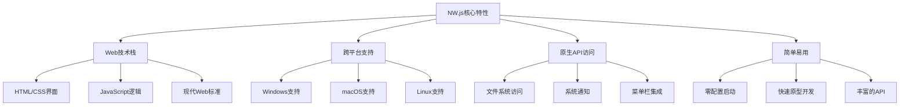

# 前言

在现代软件开发中，跨平台桌面应用开发一直是开发者面临的重要挑战。传统的桌面应用开发需要针对不同操作系统使用不同的技术栈，如Windows的C#/.NET、macOS的Swift/Objective-C、Linux的C++/Qt等。这种分散的开发模式不仅增加了开发成本，也提高了维护难度。NW.js（原名node-webkit）的出现为这一问题提供了优雅的解决方案，它允许开发者使用熟悉的Web技术（HTML、CSS、JavaScript）来构建功能完整的跨平台桌面应用。本文将深入探讨NW.js的技术原理、开发实践和应用场景。

<!-- more -->

# 一、NW.js技术概述

## （一）什么是NW.js

### 1. 基本定义
NW.js是一个基于Chromium和Node.js的应用运行时框架，它将Web浏览器引擎与Node.js运行时环境相结合，使开发者能够使用HTML、CSS和JavaScript构建原生桌面应用程序。

### 2. 核心特性


### 3. 技术架构
```javascript
// NW.js架构示意
const nwjsArchitecture = {
    // 用户界面层：使用Web技术构建
    userInterface: {
        html: "页面结构和内容",
        css: "样式和布局设计", 
        javascript: "交互逻辑和动态行为"
    },
    
    // 应用运行时：NW.js核心
    runtime: {
        chromium: "Web渲染引擎，负责UI显示",
        nodejs: "JavaScript运行时，提供系统API访问",
        nwjsAPI: "桥接Web和系统的专用API"
    },
    
    // 系统平台层：跨平台支持
    platform: {
        windows: "Windows桌面环境",
        macos: "macOS桌面环境",
        linux: "Linux桌面环境"
    }
};
```

## （二）NW.js vs 其他桌面开发方案

### 1. 与Electron的对比

| 特性 | NW.js | Electron |
|------|-------|----------|
| **架构设计** | 单进程架构，Web和Node.js在同一上下文 | 多进程架构，主进程和渲染进程分离 |
| **开发复杂度** | 简单，可直接在DOM中使用Node.js | 相对复杂，需要IPC通信 |
| **内存占用** | 约40MB | 约45MB |
| **应用大小** | 约78MB | 约118MB |
| **安全性** | 较低，Web和Node.js混合执行 | 较高，进程隔离提供更好安全性 |
| **生态系统** | 相对较小，Intel支持 | 庞大，GitHub/Microsoft支持 |
| **知名应用** | 较少 | VS Code、Slack、Discord等 |

### 2. 开发体验对比
```javascript
// NW.js：直接在Web页面中使用Node.js
// index.html
<!DOCTYPE html>
<html>
<head>
    <title>NW.js应用</title>
</head>
<body>
    <h1>文件系统操作</h1>
    <button onclick="readFile()">读取文件</button>
    <div id="content"></div>
    
    <script>
        // 直接使用Node.js模块，无需额外配置
        const fs = require('fs');
        const path = require('path');
        
        function readFile() {
            // 直接调用Node.js API
            fs.readFile('package.json', 'utf8', (err, data) => {
                if (err) {
                    console.error('读取文件失败:', err);
                    return;
                }
                // 直接操作DOM
                document.getElementById('content').textContent = data;
            });
        }
        
        // 使用NW.js专用API
        nw.Window.get().on('close', function() {
            console.log('应用即将关闭');
            this.close(true);
        });
    </script>
</body>
</html>
```

```javascript
// Electron：需要主进程和渲染进程通信
// main.js (主进程)
const { app, BrowserWindow, ipcMain } = require('electron');
const fs = require('fs');

function createWindow() {
    const win = new BrowserWindow({
        width: 800,
        height: 600,
        webPreferences: {
            nodeIntegration: false, // 安全考虑，禁用Node.js集成
            contextIsolation: true,
            preload: path.join(__dirname, 'preload.js')
        }
    });
    
    win.loadFile('index.html');
}

// 处理渲染进程的文件读取请求
ipcMain.handle('read-file', async (event, filePath) => {
    try {
        const data = await fs.promises.readFile(filePath, 'utf8');
        return data;
    } catch (error) {
        throw error;
    }
});

// renderer.js (渲染进程)
async function readFile() {
    try {
        // 通过IPC与主进程通信
        const data = await window.electronAPI.readFile('package.json');
        document.getElementById('content').textContent = data;
    } catch (error) {
        console.error('读取文件失败:', error);
    }
}
```

## （三）NW.js的优势与局限

### 1. 主要优势
- **开发简单**：Web开发者可以直接上手，无需学习新的技术栈
- **快速原型**：可以快速将Web应用转换为桌面应用
- **资源占用小**：相比Electron，内存和磁盘占用更少
- **API丰富**：提供完整的桌面应用API支持
- **兼容性好**：支持较老的操作系统版本

### 2. 主要局限
- **安全性较低**：Web和Node.js在同一上下文中运行
- **生态系统小**：相比Electron，社区和资源较少
- **大型应用支持**：不适合构建大型复杂应用
- **调试复杂**：单进程架构使调试相对困难

# 二、NW.js开发环境搭建

## （一）环境准备

### 1. 系统要求
```bash
# 支持的操作系统
Windows: Windows 7 及以上版本
macOS: macOS 10.10 及以上版本  
Linux: Ubuntu 14.04 及以上版本

# 开发环境要求
Node.js: 14.x 或更高版本
npm: 6.x 或更高版本
Python: 2.7 或 3.x（用于编译原生模块）
```

### 2. 下载和安装NW.js
```bash
# 方法一：直接下载预编译版本
# 访问 https://nwjs.io/downloads/
# 下载对应平台的SDK版本（推荐用于开发）

# 方法二：通过npm安装
npm install -g nw

# 方法三：项目本地安装
npm install --save-dev nw
```

### 3. 验证安装
```bash
# 检查NW.js版本
nw --version

# 或者如果是本地安装
npx nw --version
```

## （二）创建第一个NW.js应用

### 1. 项目结构
```
my-nwjs-app/
├── package.json          # 应用配置文件
├── index.html            # 主页面
├── style.css             # 样式文件
├── script.js             # 脚本文件
├── assets/               # 资源文件夹
│   ├── icons/           # 图标文件
│   └── images/          # 图片文件
└── node_modules/        # 依赖模块
```

### 2. 配置package.json
```json
{
  "name": "my-nwjs-app",
  "version": "1.0.0",
  "description": "我的第一个NW.js应用",
  "main": "index.html",
  "scripts": {
    "start": "nw .",
    "dev": "nw . --enable-logging",
    "build": "nwbuild -p win32,osx,linux64 -v 0.88.0 ."
  },
  "window": {
    "title": "我的NW.js应用",
    "width": 1024,
    "height": 768,
    "min_width": 800,
    "min_height": 600,
    "icon": "assets/icons/app.png",
    "position": "center",
    "resizable": true,
    "show_in_taskbar": true,
    "frame": true,
    "kiosk": false,
    "fullscreen": false
  },
  "webkit": {
    "plugin": true,
    "java": false,
    "page-cache": false
  },
  "devDependencies": {
    "nw": "^0.88.0",
    "nwjs-builder-phoenix": "^1.15.0"
  }
}
```

### 3. 创建主页面
```html
<!-- index.html -->
<!DOCTYPE html>
<html lang="zh-CN">
<head>
    <meta charset="UTF-8">
    <meta name="viewport" content="width=device-width, initial-scale=1.0">
    <title>我的NW.js应用</title>
    <link rel="stylesheet" href="style.css">
</head>
<body>
    <div class="container">
        <header>
            <h1>欢迎使用NW.js应用</h1>
            <p>这是一个使用Web技术构建的桌面应用</p>
        </header>
        
        <main>
            <section class="features">
                <div class="feature-card">
                    <h3>文件操作</h3>
                    <button onclick="selectFile()">选择文件</button>
                    <button onclick="saveFile()">保存文件</button>
                    <div id="file-info"></div>
                </div>
                
                <div class="feature-card">
                    <h3>系统信息</h3>
                    <button onclick="getSystemInfo()">获取系统信息</button>
                    <div id="system-info"></div>
                </div>
                
                <div class="feature-card">
                    <h3>窗口控制</h3>
                    <button onclick="minimizeWindow()">最小化</button>
                    <button onclick="maximizeWindow()">最大化</button>
                    <button onclick="closeWindow()">关闭应用</button>
                </div>
            </section>
        </main>
        
        <footer>
            <p>基于NW.js构建 | 版本: <span id="version"></span></p>
        </footer>
    </div>
    
    <script src="script.js"></script>
</body>
</html>
```

### 4. 添加样式
```css
/* style.css */
* {
    margin: 0;
    padding: 0;
    box-sizing: border-box;
}

body {
    font-family: 'Segoe UI', Tahoma, Geneva, Verdana, sans-serif;
    background: linear-gradient(135deg, #667eea 0%, #764ba2 100%);
    color: #333;
    min-height: 100vh;
}

.container {
    max-width: 1200px;
    margin: 0 auto;
    padding: 20px;
    min-height: 100vh;
    display: flex;
    flex-direction: column;
}

header {
    text-align: center;
    margin-bottom: 40px;
    color: white;
}

header h1 {
    font-size: 2.5em;
    margin-bottom: 10px;
    text-shadow: 2px 2px 4px rgba(0,0,0,0.3);
}

header p {
    font-size: 1.2em;
    opacity: 0.9;
}

main {
    flex: 1;
}

.features {
    display: grid;
    grid-template-columns: repeat(auto-fit, minmax(300px, 1fr));
    gap: 20px;
    margin-bottom: 40px;
}

.feature-card {
    background: white;
    padding: 30px;
    border-radius: 10px;
    box-shadow: 0 10px 30px rgba(0,0,0,0.2);
    transition: transform 0.3s ease;
}

.feature-card:hover {
    transform: translateY(-5px);
}

.feature-card h3 {
    color: #667eea;
    margin-bottom: 20px;
    font-size: 1.5em;
}

button {
    background: #667eea;
    color: white;
    border: none;
    padding: 10px 20px;
    border-radius: 5px;
    cursor: pointer;
    margin: 5px;
    font-size: 14px;
    transition: background 0.3s ease;
}

button:hover {
    background: #5a67d8;
}

button:active {
    transform: translateY(1px);
}

#file-info, #system-info {
    margin-top: 15px;
    padding: 10px;
    background: #f7fafc;
    border-radius: 5px;
    border-left: 4px solid #667eea;
    font-family: monospace;
    font-size: 12px;
    max-height: 200px;
    overflow-y: auto;
}

footer {
    text-align: center;
    color: white;
    opacity: 0.8;
    margin-top: 20px;
}

/* 响应式设计 */
@media (max-width: 768px) {
    .features {
        grid-template-columns: 1fr;
    }
    
    header h1 {
        font-size: 2em;
    }
    
    .feature-card {
        padding: 20px;
    }
}
```

### 5. 实现应用逻辑
```javascript
// script.js
// 应用初始化
document.addEventListener('DOMContentLoaded', function() {
    // 显示应用版本信息
    const versionElement = document.getElementById('version');
    if (versionElement) {
        versionElement.textContent = nw.App.manifest.version;
    }
    
    // 设置窗口事件监听
    setupWindowEvents();
    
    console.log('NW.js应用已启动');
});

// 文件选择功能
function selectFile() {
    const fileInput = document.createElement('input');
    fileInput.type = 'file';
    fileInput.accept = '.txt,.json,.js,.html,.css'; // 限制文件类型
    
    fileInput.onchange = function(event) {
        const file = event.target.files[0];
        if (file) {
            displayFileInfo(file);
            readFileContent(file);
        }
    };
    
    fileInput.click();
}

// 显示文件信息
function displayFileInfo(file) {
    const fileInfoDiv = document.getElementById('file-info');
    const fileInfo = `
        <strong>文件信息：</strong><br>
        名称: ${file.name}<br>
        大小: ${formatFileSize(file.size)}<br>
        类型: ${file.type || '未知'}<br>
        最后修改: ${new Date(file.lastModified).toLocaleString()}
    `;
    fileInfoDiv.innerHTML = fileInfo;
}

// 读取文件内容
function readFileContent(file) {
    const reader = new FileReader();
    reader.onload = function(e) {
        const content = e.target.result;
        const fileInfoDiv = document.getElementById('file-info');
        
        // 如果是文本文件，显示部分内容
        if (file.type.startsWith('text/') || file.name.endsWith('.json') || file.name.endsWith('.js')) {
            const preview = content.length > 200 ? content.substring(0, 200) + '...' : content;
            fileInfoDiv.innerHTML += `<br><br><strong>内容预览：</strong><br><pre>${preview}</pre>`;
        }
    };
    
    reader.onerror = function() {
        console.error('文件读取失败');
        showNotification('文件读取失败', 'error');
    };
    
    reader.readAsText(file);
}

// 保存文件功能
function saveFile() {
    const content = `# NW.js应用生成的文件

这是一个由NW.js应用生成的示例文件。

生成时间: ${new Date().toLocaleString()}
应用版本: ${nw.App.manifest.version}
用户代理: ${navigator.userAgent}

## 系统信息
平台: ${process.platform}
架构: ${process.arch}
Node.js版本: ${process.version}
`;

    // 使用NW.js的文件保存对话框
    const fs = require('fs');
    const path = require('path');
    
    // 创建文件保存对话框
    const saveDialog = document.createElement('input');
    saveDialog.type = 'file';
    saveDialog.nwsaveas = 'nwjs-sample.md'; // 默认文件名
    saveDialog.accept = '.md,.txt'; // 允许的文件类型
    
    saveDialog.onchange = function(event) {
        const filePath = event.target.value;
        if (filePath) {
            fs.writeFile(filePath, content, 'utf8', (err) => {
                if (err) {
                    console.error('文件保存失败:', err);
                    showNotification('文件保存失败', 'error');
                } else {
                    console.log('文件保存成功:', filePath);
                    showNotification('文件保存成功', 'success');
                    
                    // 更新文件信息显示
                    const fileInfoDiv = document.getElementById('file-info');
                    fileInfoDiv.innerHTML = `<strong>文件已保存到：</strong><br>${filePath}`;
                }
            });
        }
    };
    
    saveDialog.click();
}

// 获取系统信息
function getSystemInfo() {
    const os = require('os');
    const process = require('process');
    
    const systemInfo = {
        platform: os.platform(),
        arch: os.arch(),
        release: os.release(),
        hostname: os.hostname(),
        cpus: os.cpus().length,
        totalMemory: formatFileSize(os.totalmem()),
        freeMemory: formatFileSize(os.freemem()),
        uptime: formatUptime(os.uptime()),
        nodeVersion: process.version,
        nwVersion: process.versions.nw,
        chromiumVersion: process.versions.chromium
    };
    
    const systemInfoDiv = document.getElementById('system-info');
    let infoHtml = '<strong>系统信息：</strong><br>';
    
    for (const [key, value] of Object.entries(systemInfo)) {
        const label = getSystemInfoLabel(key);
        infoHtml += `${label}: ${value}<br>`;
    }
    
    systemInfoDiv.innerHTML = infoHtml;
}

// 窗口控制功能
function minimizeWindow() {
    nw.Window.get().minimize();
}

function maximizeWindow() {
    const win = nw.Window.get();
    if (win.isMaximized) {
        win.unmaximize();
    } else {
        win.maximize();
    }
}

function closeWindow() {
    if (confirm('确定要关闭应用吗？')) {
        nw.Window.get().close();
    }
}

// 设置窗口事件监听
function setupWindowEvents() {
    const win = nw.Window.get();
    
    // 窗口关闭事件
    win.on('close', function() {
        console.log('应用即将关闭');
        // 可以在这里保存用户数据或执行清理操作
        this.close(true);
    });
    
    // 窗口最小化事件
    win.on('minimize', function() {
        console.log('窗口已最小化');
    });
    
    // 窗口最大化事件
    win.on('maximize', function() {
        console.log('窗口已最大化');
    });
    
    // 窗口恢复事件
    win.on('restore', function() {
        console.log('窗口已恢复');
    });
}

// 工具函数
function formatFileSize(bytes) {
    if (bytes === 0) return '0 Bytes';
    const k = 1024;
    const sizes = ['Bytes', 'KB', 'MB', 'GB'];
    const i = Math.floor(Math.log(bytes) / Math.log(k));
    return parseFloat((bytes / Math.pow(k, i)).toFixed(2)) + ' ' + sizes[i];
}

function formatUptime(seconds) {
    const days = Math.floor(seconds / 86400);
    const hours = Math.floor((seconds % 86400) / 3600);
    const minutes = Math.floor((seconds % 3600) / 60);
    return `${days}天 ${hours}小时 ${minutes}分钟`;
}

function getSystemInfoLabel(key) {
    const labels = {
        platform: '操作系统',
        arch: '系统架构',
        release: '系统版本',
        hostname: '主机名',
        cpus: 'CPU核心数',
        totalMemory: '总内存',
        freeMemory: '可用内存',
        uptime: '系统运行时间',
        nodeVersion: 'Node.js版本',
        nwVersion: 'NW.js版本',
        chromiumVersion: 'Chromium版本'
    };
    return labels[key] || key;
}

function showNotification(message, type = 'info') {
    // 创建通知元素
    const notification = document.createElement('div');
    notification.className = `notification ${type}`;
    notification.textContent = message;
    
    // 添加样式
    notification.style.cssText = `
        position: fixed;
        top: 20px;
        right: 20px;
        padding: 15px 20px;
        border-radius: 5px;
        color: white;
        font-weight: bold;
        z-index: 1000;
        opacity: 0;
        transition: opacity 0.3s ease;
        ${type === 'success' ? 'background: #48bb78;' : ''}
        ${type === 'error' ? 'background: #f56565;' : ''}
        ${type === 'info' ? 'background: #4299e1;' : ''}
    `;
    
    document.body.appendChild(notification);
    
    // 显示动画
    setTimeout(() => {
        notification.style.opacity = '1';
    }, 100);
    
    // 自动隐藏
    setTimeout(() => {
        notification.style.opacity = '0';
        setTimeout(() => {
            document.body.removeChild(notification);
        }, 300);
    }, 3000);
}

// 键盘快捷键支持
document.addEventListener('keydown', function(event) {
    // Ctrl+Q 或 Cmd+Q 退出应用
    if ((event.ctrlKey || event.metaKey) && event.key === 'q') {
        event.preventDefault();
        closeWindow();
    }
    
    // F11 切换全屏
    if (event.key === 'F11') {
        event.preventDefault();
        const win = nw.Window.get();
        win.toggleFullscreen();
    }
    
    // F12 打开开发者工具
    if (event.key === 'F12') {
        event.preventDefault();
        nw.Window.get().showDevTools();
    }
});
```

### 6. 运行应用
```bash
# 进入项目目录
cd my-nwjs-app

# 安装依赖（如果有的话）
npm install

# 启动应用
npm start

# 或者直接使用nw命令
nw .
```

# 三、NW.js高级功能与API详解

## （一）菜单系统开发

### 1. 创建应用菜单
```javascript
// 创建菜单栏的完整示例
function createApplicationMenu() {
    // 创建菜单栏
    const menubar = new nw.Menu({ type: 'menubar' });

    // 文件菜单
    const fileMenu = new nw.Menu();
    fileMenu.append(new nw.MenuItem({
        label: '新建',
        accelerator: 'CmdOrCtrl+N',
        click: function() {
            createNewDocument();
        }
    }));

    fileMenu.append(new nw.MenuItem({
        label: '打开',
        accelerator: 'CmdOrCtrl+O',
        click: function() {
            openDocument();
        }
    }));

    fileMenu.append(new nw.MenuItem({
        label: '保存',
        accelerator: 'CmdOrCtrl+S',
        click: function() {
            saveDocument();
        }
    }));

    fileMenu.append(new nw.MenuItem({ type: 'separator' }));

    fileMenu.append(new nw.MenuItem({
        label: '退出',
        accelerator: 'CmdOrCtrl+Q',
        click: function() {
            nw.App.quit();
        }
    }));

    // 编辑菜单
    const editMenu = new nw.Menu();
    editMenu.append(new nw.MenuItem({
        label: '撤销',
        accelerator: 'CmdOrCtrl+Z',
        click: function() {
            document.execCommand('undo');
        }
    }));

    editMenu.append(new nw.MenuItem({
        label: '重做',
        accelerator: 'CmdOrCtrl+Y',
        click: function() {
            document.execCommand('redo');
        }
    }));

    editMenu.append(new nw.MenuItem({ type: 'separator' }));

    editMenu.append(new nw.MenuItem({
        label: '复制',
        accelerator: 'CmdOrCtrl+C',
        click: function() {
            document.execCommand('copy');
        }
    }));

    editMenu.append(new nw.MenuItem({
        label: '粘贴',
        accelerator: 'CmdOrCtrl+V',
        click: function() {
            document.execCommand('paste');
        }
    }));

    // 视图菜单
    const viewMenu = new nw.Menu();
    viewMenu.append(new nw.MenuItem({
        label: '全屏',
        accelerator: 'F11',
        click: function() {
            const win = nw.Window.get();
            win.toggleFullscreen();
        }
    }));

    viewMenu.append(new nw.MenuItem({
        label: '开发者工具',
        accelerator: 'F12',
        click: function() {
            nw.Window.get().showDevTools();
        }
    }));

    // 帮助菜单
    const helpMenu = new nw.Menu();
    helpMenu.append(new nw.MenuItem({
        label: '关于',
        click: function() {
            showAboutDialog();
        }
    }));

    // 将子菜单添加到菜单栏
    menubar.append(new nw.MenuItem({
        label: '文件',
        submenu: fileMenu
    }));

    menubar.append(new nw.MenuItem({
        label: '编辑',
        submenu: editMenu
    }));

    menubar.append(new nw.MenuItem({
        label: '视图',
        submenu: viewMenu
    }));

    menubar.append(new nw.MenuItem({
        label: '帮助',
        submenu: helpMenu
    }));

    // 设置窗口菜单
    nw.Window.get().menu = menubar;
}

// 创建右键上下文菜单
function createContextMenu() {
    const contextMenu = new nw.Menu();

    contextMenu.append(new nw.MenuItem({
        label: '复制',
        click: function() {
            document.execCommand('copy');
        }
    }));

    contextMenu.append(new nw.MenuItem({
        label: '粘贴',
        click: function() {
            document.execCommand('paste');
        }
    }));

    contextMenu.append(new nw.MenuItem({ type: 'separator' }));

    contextMenu.append(new nw.MenuItem({
        label: '刷新',
        click: function() {
            location.reload();
        }
    }));

    // 绑定右键事件
    document.addEventListener('contextmenu', function(e) {
        e.preventDefault();
        contextMenu.popup(e.x, e.y);
    });
}
```

### 2. 系统托盘集成
```javascript
// 创建系统托盘图标
function createTrayIcon() {
    // 创建托盘图标
    const tray = new nw.Tray({
        title: '我的NW.js应用',
        icon: 'assets/icons/tray.png',
        alticon: 'assets/icons/tray-alt.png', // macOS替代图标
        iconsAreTemplates: false // macOS模板图标
    });

    // 创建托盘菜单
    const trayMenu = new nw.Menu();

    trayMenu.append(new nw.MenuItem({
        label: '显示主窗口',
        click: function() {
            const win = nw.Window.get();
            win.show();
            win.focus();
        }
    }));

    trayMenu.append(new nw.MenuItem({
        label: '隐藏窗口',
        click: function() {
            nw.Window.get().hide();
        }
    }));

    trayMenu.append(new nw.MenuItem({ type: 'separator' }));

    trayMenu.append(new nw.MenuItem({
        label: '退出应用',
        click: function() {
            nw.App.quit();
        }
    }));

    // 设置托盘菜单
    tray.menu = trayMenu;

    // 托盘图标点击事件
    tray.on('click', function() {
        const win = nw.Window.get();
        if (win.isMinimized) {
            win.restore();
        } else {
            win.show();
        }
        win.focus();
    });

    return tray;
}
```

## （二）文件系统操作

### 1. 高级文件处理
```javascript
// 文件管理器功能实现
class FileManager {
    constructor() {
        this.fs = require('fs');
        this.path = require('path');
        this.currentPath = process.cwd();
    }

    // 读取目录内容
    async readDirectory(dirPath = this.currentPath) {
        try {
            const items = await this.fs.promises.readdir(dirPath, { withFileTypes: true });
            const result = [];

            for (const item of items) {
                const fullPath = this.path.join(dirPath, item.name);
                const stats = await this.fs.promises.stat(fullPath);

                result.push({
                    name: item.name,
                    path: fullPath,
                    isDirectory: item.isDirectory(),
                    isFile: item.isFile(),
                    size: stats.size,
                    modified: stats.mtime,
                    created: stats.birthtime
                });
            }

            return result.sort((a, b) => {
                // 目录优先，然后按名称排序
                if (a.isDirectory && !b.isDirectory) return -1;
                if (!a.isDirectory && b.isDirectory) return 1;
                return a.name.localeCompare(b.name);
            });
        } catch (error) {
            console.error('读取目录失败:', error);
            throw error;
        }
    }

    // 创建目录
    async createDirectory(dirPath) {
        try {
            await this.fs.promises.mkdir(dirPath, { recursive: true });
            return true;
        } catch (error) {
            console.error('创建目录失败:', error);
            return false;
        }
    }

    // 删除文件或目录
    async deleteItem(itemPath) {
        try {
            const stats = await this.fs.promises.stat(itemPath);
            if (stats.isDirectory()) {
                await this.fs.promises.rmdir(itemPath, { recursive: true });
            } else {
                await this.fs.promises.unlink(itemPath);
            }
            return true;
        } catch (error) {
            console.error('删除失败:', error);
            return false;
        }
    }

    // 复制文件
    async copyFile(sourcePath, destPath) {
        try {
            await this.fs.promises.copyFile(sourcePath, destPath);
            return true;
        } catch (error) {
            console.error('复制文件失败:', error);
            return false;
        }
    }

    // 移动/重命名文件
    async moveFile(oldPath, newPath) {
        try {
            await this.fs.promises.rename(oldPath, newPath);
            return true;
        } catch (error) {
            console.error('移动文件失败:', error);
            return false;
        }
    }

    // 监听文件变化
    watchDirectory(dirPath, callback) {
        const watcher = this.fs.watch(dirPath, { recursive: true }, (eventType, filename) => {
            if (filename) {
                callback({
                    type: eventType,
                    filename: filename,
                    fullPath: this.path.join(dirPath, filename)
                });
            }
        });

        return watcher;
    }
}

// 使用示例
const fileManager = new FileManager();

async function displayDirectoryContents() {
    try {
        const items = await fileManager.readDirectory();
        const container = document.getElementById('file-list');

        container.innerHTML = items.map(item => `
            <div class="file-item ${item.isDirectory ? 'directory' : 'file'}">
                <div class="file-icon">
                    ${item.isDirectory ? '📁' : '📄'}
                </div>
                <div class="file-info">
                    <div class="file-name">${item.name}</div>
                    <div class="file-details">
                        ${item.isFile ? formatFileSize(item.size) + ' - ' : ''}
                        ${item.modified.toLocaleString()}
                    </div>
                </div>
                <div class="file-actions">
                    <button onclick="openItem('${item.path}')">打开</button>
                    <button onclick="deleteItem('${item.path}')">删除</button>
                </div>
            </div>
        `).join('');
    } catch (error) {
        showNotification('读取目录失败: ' + error.message, 'error');
    }
}
```

## （三）网络通信与数据处理

### 1. HTTP请求处理
```javascript
// HTTP客户端封装
class HttpClient {
    constructor() {
        this.https = require('https');
        this.http = require('http');
        this.url = require('url');
    }

    // GET请求
    async get(urlString, options = {}) {
        return this.request('GET', urlString, null, options);
    }

    // POST请求
    async post(urlString, data, options = {}) {
        return this.request('POST', urlString, data, options);
    }

    // PUT请求
    async put(urlString, data, options = {}) {
        return this.request('PUT', urlString, data, options);
    }

    // DELETE请求
    async delete(urlString, options = {}) {
        return this.request('DELETE', urlString, null, options);
    }

    // 通用请求方法
    async request(method, urlString, data, options = {}) {
        return new Promise((resolve, reject) => {
            const parsedUrl = this.url.parse(urlString);
            const isHttps = parsedUrl.protocol === 'https:';
            const httpModule = isHttps ? this.https : this.http;

            const requestOptions = {
                hostname: parsedUrl.hostname,
                port: parsedUrl.port || (isHttps ? 443 : 80),
                path: parsedUrl.path,
                method: method,
                headers: {
                    'Content-Type': 'application/json',
                    'User-Agent': 'NW.js Application',
                    ...options.headers
                }
            };

            if (data) {
                const jsonData = JSON.stringify(data);
                requestOptions.headers['Content-Length'] = Buffer.byteLength(jsonData);
            }

            const req = httpModule.request(requestOptions, (res) => {
                let responseData = '';

                res.on('data', (chunk) => {
                    responseData += chunk;
                });

                res.on('end', () => {
                    try {
                        const result = {
                            statusCode: res.statusCode,
                            headers: res.headers,
                            data: responseData
                        };

                        // 尝试解析JSON响应
                        if (res.headers['content-type']?.includes('application/json')) {
                            result.data = JSON.parse(responseData);
                        }

                        resolve(result);
                    } catch (error) {
                        reject(new Error('响应解析失败: ' + error.message));
                    }
                });
            });

            req.on('error', (error) => {
                reject(new Error('请求失败: ' + error.message));
            });

            req.on('timeout', () => {
                req.destroy();
                reject(new Error('请求超时'));
            });

            // 设置超时
            req.setTimeout(options.timeout || 10000);

            // 发送数据
            if (data) {
                req.write(JSON.stringify(data));
            }

            req.end();
        });
    }
}

// 使用示例
const httpClient = new HttpClient();

async function fetchWeatherData() {
    try {
        showLoading(true);

        const response = await httpClient.get(
            'https://api.openweathermap.org/data/2.5/weather?q=Beijing&appid=YOUR_API_KEY&units=metric'
        );

        if (response.statusCode === 200) {
            displayWeatherData(response.data);
        } else {
            throw new Error(`HTTP ${response.statusCode}: 请求失败`);
        }
    } catch (error) {
        console.error('获取天气数据失败:', error);
        showNotification('获取天气数据失败: ' + error.message, 'error');
    } finally {
        showLoading(false);
    }
}

function displayWeatherData(data) {
    const weatherContainer = document.getElementById('weather-info');
    weatherContainer.innerHTML = `
        <div class="weather-card">
            <h3>${data.name}, ${data.sys.country}</h3>
            <div class="weather-main">
                <div class="temperature">${Math.round(data.main.temp)}°C</div>
                <div class="description">${data.weather[0].description}</div>
            </div>
            <div class="weather-details">
                <div>体感温度: ${Math.round(data.main.feels_like)}°C</div>
                <div>湿度: ${data.main.humidity}%</div>
                <div>风速: ${data.wind.speed} m/s</div>
                <div>气压: ${data.main.pressure} hPa</div>
            </div>
        </div>
    `;
}
```

### 2. WebSocket通信
```javascript
// WebSocket客户端封装
class WebSocketClient {
    constructor(url) {
        this.url = url;
        this.ws = null;
        this.reconnectAttempts = 0;
        this.maxReconnectAttempts = 5;
        this.reconnectInterval = 3000;
        this.eventHandlers = {};
    }

    // 连接WebSocket
    connect() {
        try {
            this.ws = new WebSocket(this.url);

            this.ws.onopen = (event) => {
                console.log('WebSocket连接已建立');
                this.reconnectAttempts = 0;
                this.emit('open', event);
            };

            this.ws.onmessage = (event) => {
                try {
                    const data = JSON.parse(event.data);
                    this.emit('message', data);
                } catch (error) {
                    this.emit('message', event.data);
                }
            };

            this.ws.onclose = (event) => {
                console.log('WebSocket连接已关闭', event.code, event.reason);
                this.emit('close', event);

                // 自动重连
                if (this.reconnectAttempts < this.maxReconnectAttempts) {
                    setTimeout(() => {
                        this.reconnectAttempts++;
                        console.log(`尝试重连 (${this.reconnectAttempts}/${this.maxReconnectAttempts})`);
                        this.connect();
                    }, this.reconnectInterval);
                }
            };

            this.ws.onerror = (error) => {
                console.error('WebSocket错误:', error);
                this.emit('error', error);
            };

        } catch (error) {
            console.error('WebSocket连接失败:', error);
            this.emit('error', error);
        }
    }

    // 发送消息
    send(data) {
        if (this.ws && this.ws.readyState === WebSocket.OPEN) {
            const message = typeof data === 'string' ? data : JSON.stringify(data);
            this.ws.send(message);
            return true;
        } else {
            console.warn('WebSocket未连接，无法发送消息');
            return false;
        }
    }

    // 关闭连接
    close() {
        if (this.ws) {
            this.ws.close();
        }
    }

    // 事件监听
    on(event, handler) {
        if (!this.eventHandlers[event]) {
            this.eventHandlers[event] = [];
        }
        this.eventHandlers[event].push(handler);
    }

    // 触发事件
    emit(event, data) {
        if (this.eventHandlers[event]) {
            this.eventHandlers[event].forEach(handler => handler(data));
        }
    }
}

// 使用示例
const wsClient = new WebSocketClient('wss://echo.websocket.org');

wsClient.on('open', () => {
    showNotification('WebSocket连接成功', 'success');
    wsClient.send({ type: 'greeting', message: 'Hello from NW.js!' });
});

wsClient.on('message', (data) => {
    console.log('收到消息:', data);
    displayMessage(data);
});

wsClient.on('error', (error) => {
    showNotification('WebSocket连接错误', 'error');
});

wsClient.on('close', () => {
    showNotification('WebSocket连接已断开', 'info');
});

// 连接WebSocket
wsClient.connect();
```

# 四、应用打包与部署

## （一）构建配置优化

### 1. 生产环境配置
```json
// package.json - 生产环境优化配置
{
  "name": "my-nwjs-app",
  "version": "1.0.0",
  "description": "基于NW.js的桌面应用",
  "main": "index.html",
  "scripts": {
    "start": "nw .",
    "dev": "nw . --enable-logging --remote-debugging-port=9222",
    "build": "nwbuild -p win32,win64,osx64,linux32,linux64 -v 0.88.0 .",
    "build-win": "nwbuild -p win32,win64 -v 0.88.0 .",
    "build-mac": "nwbuild -p osx64 -v 0.88.0 .",
    "build-linux": "nwbuild -p linux32,linux64 -v 0.88.0 .",
    "dist": "npm run build && npm run package",
    "package": "node scripts/package.js"
  },
  "build": {
    "nwVersion": "0.88.0",
    "output": "./dist/",
    "outputPattern": "${name}-${version}-${platform}-${arch}",
    "packed": false,
    "targets": [
      {
        "platform": "win32",
        "arch": "x64"
      },
      {
        "platform": "darwin",
        "arch": "x64"
      },
      {
        "platform": "linux",
        "arch": "x64"
      }
    ],
    "excludes": [
      "node_modules/nw/**",
      "src/**",
      "docs/**",
      "*.md",
      ".git/**",
      ".gitignore",
      "package-lock.json"
    ]
  },
  "window": {
    "title": "我的NW.js应用",
    "width": 1200,
    "height": 800,
    "min_width": 800,
    "min_height": 600,
    "icon": "assets/icons/app.png",
    "position": "center",
    "resizable": true,
    "show_in_taskbar": true,
    "frame": true,
    "show": true
  },
  "webkit": {
    "plugin": false,
    "java": false,
    "page-cache": false
  },
  "chromium-args": "--disable-web-security --disable-features=VizDisplayCompositor",
  "devDependencies": {
    "nw": "^0.88.0",
    "nwjs-builder-phoenix": "^1.15.0"
  }
}
```

### 2. 自动化构建脚本
```javascript
// scripts/package.js - 自动化打包脚本
const fs = require('fs');
const path = require('path');
const { execSync } = require('child_process');

class AppPackager {
    constructor() {
        this.packageJson = require('../package.json');
        this.buildConfig = this.packageJson.build;
        this.distPath = path.resolve(this.buildConfig.output);
    }

    // 清理构建目录
    cleanBuildDir() {
        console.log('🧹 清理构建目录...');
        if (fs.existsSync(this.distPath)) {
            fs.rmSync(this.distPath, { recursive: true, force: true });
        }
        fs.mkdirSync(this.distPath, { recursive: true });
    }

    // 复制资源文件
    copyAssets() {
        console.log('📁 复制资源文件...');
        const assetsPath = path.resolve('assets');
        const distAssetsPath = path.join(this.distPath, 'assets');

        if (fs.existsSync(assetsPath)) {
            this.copyDirectory(assetsPath, distAssetsPath);
        }
    }

    // 递归复制目录
    copyDirectory(src, dest) {
        if (!fs.existsSync(dest)) {
            fs.mkdirSync(dest, { recursive: true });
        }

        const items = fs.readdirSync(src);
        for (const item of items) {
            const srcPath = path.join(src, item);
            const destPath = path.join(dest, item);

            if (fs.statSync(srcPath).isDirectory()) {
                this.copyDirectory(srcPath, destPath);
            } else {
                fs.copyFileSync(srcPath, destPath);
            }
        }
    }

    // 构建应用
    async buildApp() {
        console.log('🔨 开始构建应用...');

        for (const target of this.buildConfig.targets) {
            console.log(`📦 构建 ${target.platform}-${target.arch}...`);

            try {
                const command = `nwbuild -p ${target.platform} -a ${target.arch} -v ${this.buildConfig.nwVersion} .`;
                execSync(command, { stdio: 'inherit' });

                // 后处理
                await this.postProcess(target);

            } catch (error) {
                console.error(`❌ 构建 ${target.platform}-${target.arch} 失败:`, error.message);
            }
        }
    }

    // 构建后处理
    async postProcess(target) {
        const platformName = this.getPlatformName(target.platform);
        const buildPath = path.join(this.distPath, `${this.packageJson.name}-${platformName}-${target.arch}`);

        if (fs.existsSync(buildPath)) {
            // 创建启动脚本
            this.createLauncher(buildPath, target);

            // 复制额外文件
            this.copyExtraFiles(buildPath);

            // 创建安装包
            if (target.platform === 'win32') {
                await this.createWindowsInstaller(buildPath);
            } else if (target.platform === 'darwin') {
                await this.createMacInstaller(buildPath);
            }
        }
    }

    // 创建启动脚本
    createLauncher(buildPath, target) {
        if (target.platform === 'win32') {
            // Windows批处理文件
            const batchContent = `@echo off
cd /d "%~dp0"
start "" "${this.packageJson.name}.exe"
`;
            fs.writeFileSync(path.join(buildPath, 'start.bat'), batchContent);

        } else if (target.platform === 'linux') {
            // Linux shell脚本
            const shellContent = `#!/bin/bash
cd "$(dirname "$0")"
./${this.packageJson.name}
`;
            const scriptPath = path.join(buildPath, 'start.sh');
            fs.writeFileSync(scriptPath, shellContent);
            fs.chmodSync(scriptPath, '755');
        }
    }

    // 复制额外文件
    copyExtraFiles(buildPath) {
        const extraFiles = ['README.md', 'LICENSE', 'CHANGELOG.md'];

        for (const file of extraFiles) {
            const srcPath = path.resolve(file);
            if (fs.existsSync(srcPath)) {
                fs.copyFileSync(srcPath, path.join(buildPath, file));
            }
        }
    }

    // 创建Windows安装包
    async createWindowsInstaller(buildPath) {
        console.log('🏗️  创建Windows安装包...');

        // 使用NSIS或Inno Setup创建安装包
        const nsisScript = this.generateNSISScript(buildPath);
        const scriptPath = path.join(buildPath, 'installer.nsi');
        fs.writeFileSync(scriptPath, nsisScript);

        try {
            execSync(`makensis "${scriptPath}"`, { stdio: 'inherit' });
            console.log('✅ Windows安装包创建成功');
        } catch (error) {
            console.warn('⚠️  NSIS未安装，跳过安装包创建');
        }
    }

    // 生成NSIS安装脚本
    generateNSISScript(buildPath) {
        return `
; NSIS安装脚本
!define APP_NAME "${this.packageJson.name}"
!define APP_VERSION "${this.packageJson.version}"
!define APP_PUBLISHER "Your Company"
!define APP_URL "https://your-website.com"
!define APP_EXECUTABLE "${this.packageJson.name}.exe"

Name "\${APP_NAME}"
OutFile "\${APP_NAME}-\${APP_VERSION}-Setup.exe"
InstallDir "$PROGRAMFILES\\\${APP_NAME}"
RequestExecutionLevel admin

Page directory
Page instfiles

Section "MainSection" SEC01
    SetOutPath "$INSTDIR"
    File /r "${buildPath}\\*"

    CreateDirectory "$SMPROGRAMS\\\${APP_NAME}"
    CreateShortCut "$SMPROGRAMS\\\${APP_NAME}\\\${APP_NAME}.lnk" "$INSTDIR\\\${APP_EXECUTABLE}"
    CreateShortCut "$DESKTOP\\\${APP_NAME}.lnk" "$INSTDIR\\\${APP_EXECUTABLE}"

    WriteRegStr HKLM "Software\\Microsoft\\Windows\\CurrentVersion\\Uninstall\\\${APP_NAME}" "DisplayName" "\${APP_NAME}"
    WriteRegStr HKLM "Software\\Microsoft\\Windows\\CurrentVersion\\Uninstall\\\${APP_NAME}" "UninstallString" "$INSTDIR\\uninstall.exe"
    WriteUninstaller "$INSTDIR\\uninstall.exe"
SectionEnd

Section "Uninstall"
    Delete "$INSTDIR\\uninstall.exe"
    RMDir /r "$INSTDIR"
    Delete "$SMPROGRAMS\\\${APP_NAME}\\\${APP_NAME}.lnk"
    Delete "$DESKTOP\\\${APP_NAME}.lnk"
    RMDir "$SMPROGRAMS\\\${APP_NAME}"
    DeleteRegKey HKLM "Software\\Microsoft\\Windows\\CurrentVersion\\Uninstall\\\${APP_NAME}"
SectionEnd
`;
    }

    // 创建macOS安装包
    async createMacInstaller(buildPath) {
        console.log('🍎 创建macOS安装包...');

        try {
            // 创建DMG文件
            const dmgName = `${this.packageJson.name}-${this.packageJson.version}.dmg`;
            const command = `hdiutil create -volname "${this.packageJson.name}" -srcfolder "${buildPath}" -ov -format UDZO "${path.join(this.distPath, dmgName)}"`;
            execSync(command, { stdio: 'inherit' });
            console.log('✅ macOS DMG文件创建成功');
        } catch (error) {
            console.warn('⚠️  macOS工具未安装，跳过DMG创建');
        }
    }

    // 获取平台名称
    getPlatformName(platform) {
        const platformMap = {
            'win32': 'windows',
            'darwin': 'macos',
            'linux': 'linux'
        };
        return platformMap[platform] || platform;
    }

    // 主构建流程
    async build() {
        console.log('🚀 开始应用打包流程...');
        console.log(`📋 应用名称: ${this.packageJson.name}`);
        console.log(`📋 应用版本: ${this.packageJson.version}`);

        try {
            this.cleanBuildDir();
            this.copyAssets();
            await this.buildApp();

            console.log('🎉 应用打包完成！');
            console.log(`📁 输出目录: ${this.distPath}`);

        } catch (error) {
            console.error('❌ 打包过程中出现错误:', error);
            process.exit(1);
        }
    }
}

// 执行打包
if (require.main === module) {
    const packager = new AppPackager();
    packager.build();
}

module.exports = AppPackager;
```

## （二）性能优化策略

### 1. 应用启动优化
```javascript
// 启动性能优化
class AppOptimizer {
    constructor() {
        this.startTime = Date.now();
        this.loadingSteps = [];
    }

    // 预加载关键资源
    preloadResources() {
        const resources = [
            'assets/icons/app.png',
            'assets/css/main.css',
            'assets/js/vendor.js'
        ];

        return Promise.all(resources.map(resource => {
            return new Promise((resolve) => {
                if (resource.endsWith('.png') || resource.endsWith('.jpg')) {
                    const img = new Image();
                    img.onload = resolve;
                    img.onerror = resolve;
                    img.src = resource;
                } else if (resource.endsWith('.css')) {
                    const link = document.createElement('link');
                    link.rel = 'stylesheet';
                    link.href = resource;
                    link.onload = resolve;
                    link.onerror = resolve;
                    document.head.appendChild(link);
                } else if (resource.endsWith('.js')) {
                    const script = document.createElement('script');
                    script.src = resource;
                    script.onload = resolve;
                    script.onerror = resolve;
                    document.head.appendChild(script);
                } else {
                    resolve();
                }
            });
        }));
    }

    // 延迟加载非关键功能
    lazyLoadFeatures() {
        // 延迟初始化重型组件
        setTimeout(() => {
            this.initializeCharts();
        }, 1000);

        setTimeout(() => {
            this.initializePlugins();
        }, 2000);
    }

    // 内存使用优化
    optimizeMemoryUsage() {
        // 定期清理未使用的对象
        setInterval(() => {
            this.cleanupUnusedObjects();
        }, 60000); // 每分钟清理一次

        // 监听内存警告
        if (window.performance && window.performance.memory) {
            setInterval(() => {
                const memory = window.performance.memory;
                const usageRatio = memory.usedJSHeapSize / memory.jsHeapSizeLimit;

                if (usageRatio > 0.8) {
                    console.warn('内存使用率过高:', (usageRatio * 100).toFixed(2) + '%');
                    this.forceGarbageCollection();
                }
            }, 30000);
        }
    }

    // 强制垃圾回收
    forceGarbageCollection() {
        if (window.gc) {
            window.gc();
        }
    }

    // 清理未使用的对象
    cleanupUnusedObjects() {
        // 清理事件监听器
        this.cleanupEventListeners();

        // 清理缓存
        this.cleanupCache();

        // 清理DOM节点
        this.cleanupDOMNodes();
    }

    // 应用启动计时
    trackStartupTime() {
        const endTime = Date.now();
        const startupTime = endTime - this.startTime;

        console.log(`应用启动耗时: ${startupTime}ms`);

        // 发送启动性能数据
        this.sendPerformanceData({
            startupTime: startupTime,
            loadingSteps: this.loadingSteps
        });
    }
}

// 使用启动优化
const optimizer = new AppOptimizer();

document.addEventListener('DOMContentLoaded', async () => {
    // 显示启动画面
    showSplashScreen();

    try {
        // 预加载资源
        await optimizer.preloadResources();

        // 初始化应用
        await initializeApp();

        // 延迟加载功能
        optimizer.lazyLoadFeatures();

        // 优化内存使用
        optimizer.optimizeMemoryUsage();

        // 隐藏启动画面
        hideSplashScreen();

        // 记录启动时间
        optimizer.trackStartupTime();

    } catch (error) {
        console.error('应用启动失败:', error);
        showErrorScreen(error);
    }
});
```

### 2. 资源管理优化
```javascript
// 资源管理器
class ResourceManager {
    constructor() {
        this.cache = new Map();
        this.maxCacheSize = 100; // 最大缓存项数
        this.cacheHitCount = 0;
        this.cacheMissCount = 0;
    }

    // 加载图片资源
    async loadImage(src) {
        if (this.cache.has(src)) {
            this.cacheHitCount++;
            return this.cache.get(src);
        }

        this.cacheMissCount++;

        return new Promise((resolve, reject) => {
            const img = new Image();
            img.onload = () => {
                this.addToCache(src, img);
                resolve(img);
            };
            img.onerror = reject;
            img.src = src;
        });
    }

    // 加载JSON数据
    async loadJSON(url) {
        const cacheKey = `json:${url}`;

        if (this.cache.has(cacheKey)) {
            this.cacheHitCount++;
            return this.cache.get(cacheKey);
        }

        this.cacheMissCount++;

        try {
            const response = await fetch(url);
            const data = await response.json();
            this.addToCache(cacheKey, data);
            return data;
        } catch (error) {
            console.error('加载JSON失败:', error);
            throw error;
        }
    }

    // 添加到缓存
    addToCache(key, value) {
        // 如果缓存已满，删除最旧的项
        if (this.cache.size >= this.maxCacheSize) {
            const firstKey = this.cache.keys().next().value;
            this.cache.delete(firstKey);
        }

        this.cache.set(key, value);
    }

    // 清理缓存
    clearCache() {
        this.cache.clear();
        this.cacheHitCount = 0;
        this.cacheMissCount = 0;
    }

    // 获取缓存统计
    getCacheStats() {
        const total = this.cacheHitCount + this.cacheMissCount;
        const hitRate = total > 0 ? (this.cacheHitCount / total * 100).toFixed(2) : 0;

        return {
            size: this.cache.size,
            maxSize: this.maxCacheSize,
            hits: this.cacheHitCount,
            misses: this.cacheMissCount,
            hitRate: hitRate + '%'
        };
    }
}

// 全局资源管理器实例
const resourceManager = new ResourceManager();
```

# 五、实际应用场景与案例分析

## （一）典型应用场景

### 1. 开发工具类应用
```javascript
// 代码编辑器示例
class CodeEditor {
    constructor() {
        this.fs = require('fs');
        this.path = require('path');
        this.currentFile = null;
        this.isModified = false;
        this.initializeEditor();
    }

    initializeEditor() {
        // 初始化Monaco Editor或CodeMirror
        this.editor = monaco.editor.create(document.getElementById('editor'), {
            value: '// 欢迎使用代码编辑器\nconsole.log("Hello, NW.js!");',
            language: 'javascript',
            theme: 'vs-dark',
            automaticLayout: true,
            minimap: { enabled: true },
            fontSize: 14,
            wordWrap: 'on'
        });

        // 监听内容变化
        this.editor.onDidChangeModelContent(() => {
            this.isModified = true;
            this.updateTitle();
        });

        // 设置快捷键
        this.setupKeyBindings();
    }

    setupKeyBindings() {
        // Ctrl+S 保存文件
        this.editor.addCommand(monaco.KeyMod.CtrlCmd | monaco.KeyCode.KeyS, () => {
            this.saveFile();
        });

        // Ctrl+O 打开文件
        this.editor.addCommand(monaco.KeyMod.CtrlCmd | monaco.KeyCode.KeyO, () => {
            this.openFile();
        });

        // Ctrl+N 新建文件
        this.editor.addCommand(monaco.KeyMod.CtrlCmd | monaco.KeyCode.KeyN, () => {
            this.newFile();
        });
    }

    async openFile() {
        const input = document.createElement('input');
        input.type = 'file';
        input.accept = '.js,.ts,.html,.css,.json,.md';

        input.onchange = async (event) => {
            const file = event.target.files[0];
            if (file) {
                try {
                    const content = await this.readFileContent(file.path);
                    this.editor.setValue(content);
                    this.currentFile = file.path;
                    this.isModified = false;
                    this.updateTitle();

                    // 根据文件扩展名设置语言
                    const language = this.getLanguageFromExtension(file.name);
                    monaco.editor.setModelLanguage(this.editor.getModel(), language);

                } catch (error) {
                    this.showError('打开文件失败: ' + error.message);
                }
            }
        };

        input.click();
    }

    async saveFile() {
        if (!this.currentFile) {
            return this.saveAsFile();
        }

        try {
            const content = this.editor.getValue();
            await this.fs.promises.writeFile(this.currentFile, content, 'utf8');
            this.isModified = false;
            this.updateTitle();
            this.showSuccess('文件保存成功');
        } catch (error) {
            this.showError('保存文件失败: ' + error.message);
        }
    }

    async saveAsFile() {
        const input = document.createElement('input');
        input.type = 'file';
        input.nwsaveas = 'untitled.js';

        input.onchange = async (event) => {
            const filePath = event.target.value;
            if (filePath) {
                try {
                    const content = this.editor.getValue();
                    await this.fs.promises.writeFile(filePath, content, 'utf8');
                    this.currentFile = filePath;
                    this.isModified = false;
                    this.updateTitle();
                    this.showSuccess('文件保存成功');
                } catch (error) {
                    this.showError('保存文件失败: ' + error.message);
                }
            }
        };

        input.click();
    }

    newFile() {
        if (this.isModified) {
            if (!confirm('当前文件未保存，确定要新建文件吗？')) {
                return;
            }
        }

        this.editor.setValue('');
        this.currentFile = null;
        this.isModified = false;
        this.updateTitle();
    }

    updateTitle() {
        const fileName = this.currentFile ? this.path.basename(this.currentFile) : '未命名';
        const modified = this.isModified ? ' *' : '';
        document.title = `${fileName}${modified} - 代码编辑器`;
    }

    getLanguageFromExtension(filename) {
        const ext = this.path.extname(filename).toLowerCase();
        const languageMap = {
            '.js': 'javascript',
            '.ts': 'typescript',
            '.html': 'html',
            '.css': 'css',
            '.json': 'json',
            '.md': 'markdown',
            '.py': 'python',
            '.java': 'java',
            '.cpp': 'cpp',
            '.c': 'c'
        };
        return languageMap[ext] || 'plaintext';
    }
}

// 初始化代码编辑器
const codeEditor = new CodeEditor();
```

### 2. 系统监控工具
```javascript
// 系统监控应用
class SystemMonitor {
    constructor() {
        this.os = require('os');
        this.process = require('process');
        this.isMonitoring = false;
        this.monitoringInterval = null;
        this.chartData = {
            cpu: [],
            memory: [],
            timestamps: []
        };
        this.maxDataPoints = 60; // 保留60个数据点
    }

    startMonitoring() {
        if (this.isMonitoring) return;

        this.isMonitoring = true;
        this.monitoringInterval = setInterval(() => {
            this.collectSystemData();
        }, 1000);

        console.log('系统监控已启动');
    }

    stopMonitoring() {
        if (!this.isMonitoring) return;

        this.isMonitoring = false;
        if (this.monitoringInterval) {
            clearInterval(this.monitoringInterval);
            this.monitoringInterval = null;
        }

        console.log('系统监控已停止');
    }

    async collectSystemData() {
        try {
            const cpuUsage = await this.getCPUUsage();
            const memoryUsage = this.getMemoryUsage();
            const timestamp = new Date();

            // 添加新数据点
            this.chartData.cpu.push(cpuUsage);
            this.chartData.memory.push(memoryUsage);
            this.chartData.timestamps.push(timestamp);

            // 限制数据点数量
            if (this.chartData.cpu.length > this.maxDataPoints) {
                this.chartData.cpu.shift();
                this.chartData.memory.shift();
                this.chartData.timestamps.shift();
            }

            // 更新显示
            this.updateDisplay(cpuUsage, memoryUsage);
            this.updateCharts();

        } catch (error) {
            console.error('收集系统数据失败:', error);
        }
    }

    async getCPUUsage() {
        return new Promise((resolve) => {
            const startMeasure = this.cpuAverage();

            setTimeout(() => {
                const endMeasure = this.cpuAverage();
                const idleDifference = endMeasure.idle - startMeasure.idle;
                const totalDifference = endMeasure.total - startMeasure.total;
                const percentageCPU = 100 - ~~(100 * idleDifference / totalDifference);
                resolve(percentageCPU);
            }, 100);
        });
    }

    cpuAverage() {
        const cpus = this.os.cpus();
        let totalIdle = 0;
        let totalTick = 0;

        for (const cpu of cpus) {
            for (const type in cpu.times) {
                totalTick += cpu.times[type];
            }
            totalIdle += cpu.times.idle;
        }

        return {
            idle: totalIdle / cpus.length,
            total: totalTick / cpus.length
        };
    }

    getMemoryUsage() {
        const totalMemory = this.os.totalmem();
        const freeMemory = this.os.freemem();
        const usedMemory = totalMemory - freeMemory;
        return (usedMemory / totalMemory) * 100;
    }

    updateDisplay(cpuUsage, memoryUsage) {
        // 更新CPU使用率显示
        const cpuElement = document.getElementById('cpu-usage');
        if (cpuElement) {
            cpuElement.textContent = `${cpuUsage.toFixed(1)}%`;
            cpuElement.className = this.getUsageClass(cpuUsage);
        }

        // 更新内存使用率显示
        const memoryElement = document.getElementById('memory-usage');
        if (memoryElement) {
            memoryElement.textContent = `${memoryUsage.toFixed(1)}%`;
            memoryElement.className = this.getUsageClass(memoryUsage);
        }

        // 更新系统信息
        this.updateSystemInfo();
    }

    updateSystemInfo() {
        const systemInfo = {
            platform: this.os.platform(),
            arch: this.os.arch(),
            hostname: this.os.hostname(),
            uptime: this.formatUptime(this.os.uptime()),
            loadavg: this.os.loadavg(),
            cpuCount: this.os.cpus().length,
            totalMemory: this.formatBytes(this.os.totalmem()),
            freeMemory: this.formatBytes(this.os.freemem())
        };

        const infoContainer = document.getElementById('system-info');
        if (infoContainer) {
            infoContainer.innerHTML = `
                <div class="info-grid">
                    <div class="info-item">
                        <label>操作系统:</label>
                        <span>${systemInfo.platform} ${systemInfo.arch}</span>
                    </div>
                    <div class="info-item">
                        <label>主机名:</label>
                        <span>${systemInfo.hostname}</span>
                    </div>
                    <div class="info-item">
                        <label>运行时间:</label>
                        <span>${systemInfo.uptime}</span>
                    </div>
                    <div class="info-item">
                        <label>CPU核心:</label>
                        <span>${systemInfo.cpuCount}个</span>
                    </div>
                    <div class="info-item">
                        <label>总内存:</label>
                        <span>${systemInfo.totalMemory}</span>
                    </div>
                    <div class="info-item">
                        <label>可用内存:</label>
                        <span>${systemInfo.freeMemory}</span>
                    </div>
                </div>
            `;
        }
    }

    getUsageClass(usage) {
        if (usage < 50) return 'usage-low';
        if (usage < 80) return 'usage-medium';
        return 'usage-high';
    }

    formatUptime(seconds) {
        const days = Math.floor(seconds / 86400);
        const hours = Math.floor((seconds % 86400) / 3600);
        const minutes = Math.floor((seconds % 3600) / 60);
        return `${days}天 ${hours}小时 ${minutes}分钟`;
    }

    formatBytes(bytes) {
        const sizes = ['Bytes', 'KB', 'MB', 'GB', 'TB'];
        if (bytes === 0) return '0 Bytes';
        const i = Math.floor(Math.log(bytes) / Math.log(1024));
        return Math.round(bytes / Math.pow(1024, i) * 100) / 100 + ' ' + sizes[i];
    }
}

// 初始化系统监控
const systemMonitor = new SystemMonitor();
```

### 3. 文件管理工具
```javascript
// 文件管理器应用
class FileExplorer {
    constructor() {
        this.fs = require('fs');
        this.path = require('path');
        this.currentPath = require('os').homedir();
        this.selectedItems = new Set();
        this.clipboard = null;
        this.clipboardOperation = null; // 'copy' or 'cut'

        this.initializeExplorer();
    }

    async initializeExplorer() {
        this.setupEventListeners();
        await this.navigateToPath(this.currentPath);
    }

    setupEventListeners() {
        // 导航按钮
        document.getElementById('back-btn').addEventListener('click', () => {
            this.navigateBack();
        });

        document.getElementById('up-btn').addEventListener('click', () => {
            this.navigateUp();
        });

        document.getElementById('home-btn').addEventListener('click', () => {
            this.navigateToPath(require('os').homedir());
        });

        // 地址栏
        const addressBar = document.getElementById('address-bar');
        addressBar.addEventListener('keypress', (e) => {
            if (e.key === 'Enter') {
                this.navigateToPath(addressBar.value);
            }
        });

        // 右键菜单
        this.setupContextMenu();

        // 键盘快捷键
        document.addEventListener('keydown', (e) => {
            this.handleKeyboardShortcuts(e);
        });
    }

    async navigateToPath(targetPath) {
        try {
            const stats = await this.fs.promises.stat(targetPath);
            if (!stats.isDirectory()) {
                throw new Error('不是有效的目录');
            }

            this.currentPath = targetPath;
            await this.loadDirectoryContents();
            this.updateAddressBar();
            this.updateNavigationButtons();

        } catch (error) {
            console.error('导航失败:', error);
            this.showError('无法访问目录: ' + error.message);
        }
    }

    async loadDirectoryContents() {
        try {
            const items = await this.fs.promises.readdir(this.currentPath, { withFileTypes: true });
            const fileList = [];

            for (const item of items) {
                const fullPath = this.path.join(this.currentPath, item.name);
                try {
                    const stats = await this.fs.promises.stat(fullPath);
                    fileList.push({
                        name: item.name,
                        path: fullPath,
                        isDirectory: item.isDirectory(),
                        isFile: item.isFile(),
                        size: stats.size,
                        modified: stats.mtime,
                        permissions: stats.mode
                    });
                } catch (error) {
                    // 跳过无法访问的文件
                    console.warn('无法访问文件:', fullPath, error.message);
                }
            }

            // 排序：目录优先，然后按名称排序
            fileList.sort((a, b) => {
                if (a.isDirectory && !b.isDirectory) return -1;
                if (!a.isDirectory && b.isDirectory) return 1;
                return a.name.localeCompare(b.name, undefined, { numeric: true });
            });

            this.renderFileList(fileList);

        } catch (error) {
            console.error('加载目录内容失败:', error);
            this.showError('加载目录失败: ' + error.message);
        }
    }

    renderFileList(items) {
        const container = document.getElementById('file-list');
        container.innerHTML = '';

        items.forEach(item => {
            const itemElement = this.createFileItem(item);
            container.appendChild(itemElement);
        });

        this.selectedItems.clear();
        this.updateStatusBar(items.length);
    }

    createFileItem(item) {
        const itemDiv = document.createElement('div');
        itemDiv.className = 'file-item';
        itemDiv.dataset.path = item.path;

        const icon = item.isDirectory ? '📁' : this.getFileIcon(item.name);
        const size = item.isFile ? this.formatFileSize(item.size) : '';
        const modified = item.modified.toLocaleString();

        itemDiv.innerHTML = `
            <div class="file-icon">${icon}</div>
            <div class="file-info">
                <div class="file-name" title="${item.name}">${item.name}</div>
                <div class="file-details">${size} ${modified}</div>
            </div>
        `;

        // 双击事件
        itemDiv.addEventListener('dblclick', () => {
            if (item.isDirectory) {
                this.navigateToPath(item.path);
            } else {
                this.openFile(item.path);
            }
        });

        // 单击选择
        itemDiv.addEventListener('click', (e) => {
            this.selectItem(itemDiv, e.ctrlKey || e.metaKey);
        });

        return itemDiv;
    }

    getFileIcon(filename) {
        const ext = this.path.extname(filename).toLowerCase();
        const iconMap = {
            '.txt': '📄',
            '.doc': '📄',
            '.docx': '📄',
            '.pdf': '📕',
            '.jpg': '🖼️',
            '.jpeg': '🖼️',
            '.png': '🖼️',
            '.gif': '🖼️',
            '.mp3': '🎵',
            '.mp4': '🎬',
            '.avi': '🎬',
            '.zip': '📦',
            '.rar': '📦',
            '.js': '📜',
            '.html': '🌐',
            '.css': '🎨',
            '.json': '⚙️'
        };
        return iconMap[ext] || '📄';
    }

    selectItem(itemElement, multiSelect = false) {
        if (!multiSelect) {
            // 清除其他选择
            document.querySelectorAll('.file-item.selected').forEach(el => {
                el.classList.remove('selected');
            });
            this.selectedItems.clear();
        }

        const path = itemElement.dataset.path;
        if (itemElement.classList.contains('selected')) {
            itemElement.classList.remove('selected');
            this.selectedItems.delete(path);
        } else {
            itemElement.classList.add('selected');
            this.selectedItems.add(path);
        }

        this.updateStatusBar();
    }

    async openFile(filePath) {
        try {
            // 使用系统默认程序打开文件
            const { exec } = require('child_process');
            const command = process.platform === 'win32' ? `start "" "${filePath}"` :
                          process.platform === 'darwin' ? `open "${filePath}"` :
                          `xdg-open "${filePath}"`;

            exec(command, (error) => {
                if (error) {
                    console.error('打开文件失败:', error);
                    this.showError('无法打开文件: ' + error.message);
                }
            });
        } catch (error) {
            console.error('打开文件失败:', error);
            this.showError('打开文件失败: ' + error.message);
        }
    }

    updateStatusBar(totalItems = null) {
        const statusBar = document.getElementById('status-bar');
        const selectedCount = this.selectedItems.size;

        let statusText = '';
        if (totalItems !== null) {
            statusText = `${totalItems} 个项目`;
        }

        if (selectedCount > 0) {
            statusText += ` (已选择 ${selectedCount} 个)`;
        }

        statusBar.textContent = statusText;
    }

    formatFileSize(bytes) {
        const sizes = ['B', 'KB', 'MB', 'GB', 'TB'];
        if (bytes === 0) return '0 B';
        const i = Math.floor(Math.log(bytes) / Math.log(1024));
        return Math.round(bytes / Math.pow(1024, i) * 100) / 100 + ' ' + sizes[i];
    }
}

// 初始化文件管理器
const fileExplorer = new FileExplorer();
```

## （二）最佳实践总结

### 1. 开发最佳实践
- **项目结构清晰**：合理组织代码和资源文件
- **错误处理完善**：对所有异步操作进行错误处理
- **性能优化**：合理使用缓存和延迟加载
- **用户体验**：提供加载状态和操作反馈
- **安全考虑**：验证用户输入，避免路径遍历攻击

### 2. 部署最佳实践
- **自动化构建**：使用脚本自动化打包流程
- **多平台测试**：在目标平台上充分测试
- **版本管理**：建立完善的版本发布流程
- **用户反馈**：收集用户使用数据和错误报告

# 六、总结与展望

## （一）NW.js技术总结

通过本文的深入探讨，我们全面了解了NW.js这一强大的跨平台桌面应用开发框架：

### 1. 核心优势
- **开发简单**：Web开发者可以直接使用熟悉的技术栈
- **跨平台支持**：一套代码支持Windows、macOS、Linux
- **资源占用小**：相比Electron更轻量级
- **API丰富**：提供完整的桌面应用开发能力
- **快速原型**：可以快速将Web应用转换为桌面应用

### 2. 适用场景
- **开发工具**：代码编辑器、构建工具、调试器
- **系统工具**：文件管理器、系统监控、网络工具
- **办公应用**：文档编辑器、项目管理工具
- **媒体应用**：音视频播放器、图片编辑器
- **企业应用**：内部管理系统、数据分析工具

### 3. 技术特点
- **单进程架构**：简化了开发复杂度
- **直接API访问**：可以在DOM中直接使用Node.js
- **丰富的窗口控制**：支持菜单、托盘、全屏等功能
- **文件系统集成**：完整的文件操作能力
- **网络通信支持**：HTTP、WebSocket等网络功能

## （二）发展趋势与展望

### 1. 技术发展方向
- **性能持续优化**：更好的内存管理和启动速度
- **安全性增强**：更完善的沙箱机制和权限控制
- **开发工具改进**：更好的调试工具和开发体验
- **生态系统扩展**：更多的插件和组件支持

### 2. 应用前景
- **企业级应用**：在企业内部工具开发中的应用
- **教育领域**：编程教学和学习工具的开发
- **创意工具**：设计和创作工具的快速开发
- **物联网应用**：设备管理和监控工具

## （三）学习建议

### 1. 学习路径
1. **Web基础**：掌握HTML、CSS、JavaScript
2. **Node.js基础**：了解Node.js API和模块系统
3. **NW.js入门**：学习基本概念和API使用
4. **实践项目**：通过实际项目积累经验
5. **高级特性**：深入学习性能优化和部署

### 2. 持续学习
- **关注官方更新**：跟踪NW.js的版本更新和新特性
- **参与社区**：加入开发者社区，分享经验和问题
- **对比学习**：了解Electron、Tauri等其他方案
- **实践应用**：在实际项目中应用所学知识

NW.js作为一个成熟的跨平台桌面应用开发框架，为Web开发者提供了进入桌面应用开发领域的便捷途径。虽然在生态系统规模上不如Electron，但其简单易用的特点和较小的资源占用使其在特定场景下具有独特优势。随着Web技术的不断发展和完善，相信NW.js将在跨平台桌面应用开发中发挥更重要的作用。

## 参考资料

- [NW.js官方网站](https://nwjs.io/) - 官方文档和下载
- [NW.js GitHub仓库](https://github.com/nwjs/nw.js) - 源代码和问题追踪
- [NW.js API文档](https://docs.nwjs.io/) - 完整的API参考
- [Node.js官方文档](https://nodejs.org/docs/) - Node.js API参考
- [Chromium开发者文档](https://www.chromium.org/developers/) - Chromium相关技术
- [跨平台桌面应用开发对比](https://github.com/sudhakar3697/electron-alternatives) - 技术方案对比
- [NW.js社区论坛](https://groups.google.com/g/nwjs-general) - 社区讨论和支持

---

> 💡 **相关阅读推荐**：
> - [【软件功能解析】后端代码也能在浏览器运行：WebAssembly与WebContainer技术详解](./【软件功能解析】后端代码也能在浏览器运行：WebAssembly与WebContainer技术详解.md)
> - [【前端】uni-app跨平台开发完全指南：一套代码多端运行的最佳实践](../前端/【前端】uni-app跨平台开发完全指南：一套代码多端运行的最佳实践.md)
> - [【Node.js】Node.js深度解析：构建高性能的后端服务](../Node.js/【Node.js】Node.js深度解析：构建高性能的后端服务.md)

通过NW.js，Web开发者可以轻松跨越技术边界，将熟悉的Web技术应用到桌面应用开发中，为用户提供更丰富的应用体验。掌握NW.js不仅能够扩展开发技能，更能为职业发展开辟新的可能性。
