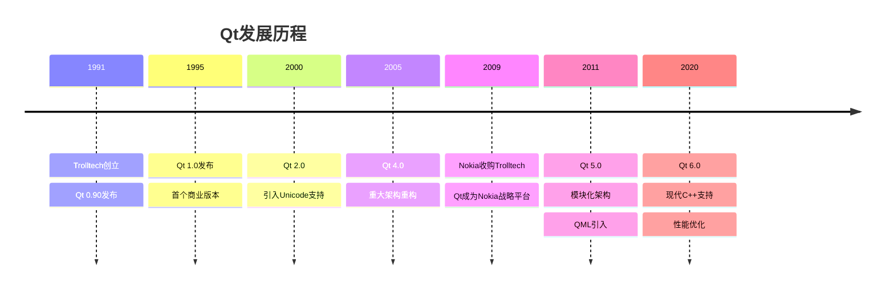

# 一、Qt框架概述

## （一）什么是Qt

Qt是一个跨平台的C++应用程序开发框架，由挪威的Trolltech公司于1991年开发，现在由Qt Group维护。Qt不仅仅是一个GUI工具包，更是一个完整的应用程序开发平台，提供了从底层系统接口到高级用户界面的全套解决方案。

> **核心理念**：Qt秉承"一次编写，到处运行"（Write Once, Run Anywhere）的设计理念，让开发者能够使用同一套代码在多个平台上构建应用程序。

## （二）Qt的发展历程

Qt的发展经历了多个重要阶段：



## （三）Qt的核心优势

### 1. 跨平台特性

Qt支持主流操作系统，包括：
- **桌面平台**：Windows、macOS、Linux
- **移动平台**：Android、iOS
- **嵌入式平台**：嵌入式Linux、QNX、VxWorks
- **Web平台**：通过Qt for WebAssembly

### 2. 丰富的功能模块

```cpp
// Qt模块示例：网络编程
#include <QNetworkAccessManager>
#include <QNetworkRequest>
#include <QNetworkReply>

class NetworkManager : public QObject {
    Q_OBJECT
    
public:
    NetworkManager(QObject *parent = nullptr) : QObject(parent) {
        manager = new QNetworkAccessManager(this);
        // 连接信号槽：当请求完成时触发槽函数
        connect(manager, &QNetworkAccessManager::finished,
                this, &NetworkManager::onRequestFinished);
    }
    
    void sendRequest(const QString &url) {
        QNetworkRequest request(QUrl(url));
        // 发送GET请求
        manager->get(request);
    }
    
private slots:
    void onRequestFinished(QNetworkReply *reply) {
        // 处理响应数据
        QByteArray data = reply->readAll();
        qDebug() << "Response:" << data;
        reply->deleteLater();  // 清理资源
    }
    
private:
    QNetworkAccessManager *manager;
};
```

### 3. 信号槽机制

Qt的信号槽（Signal-Slot）机制是其最具特色的功能之一：

```cpp
// 信号槽机制示例
class Calculator : public QWidget {
    Q_OBJECT
    
public:
    Calculator(QWidget *parent = nullptr) : QWidget(parent) {
        setupUI();
        connectSignals();
    }
    
private:
    void setupUI() {
        // 创建界面元素
        display = new QLineEdit(this);
        button1 = new QPushButton("1", this);
        button2 = new QPushButton("2", this);
        addButton = new QPushButton("+", this);
        
        // 布局管理
        QVBoxLayout *layout = new QVBoxLayout(this);
        layout->addWidget(display);
        
        QHBoxLayout *buttonLayout = new QHBoxLayout();
        buttonLayout->addWidget(button1);
        buttonLayout->addWidget(button2);
        buttonLayout->addWidget(addButton);
        
        layout->addLayout(buttonLayout);
    }
    
    void connectSignals() {
        // 连接按钮点击信号到槽函数
        connect(button1, &QPushButton::clicked, [this]() {
            display->setText(display->text() + "1");
        });
        
        connect(button2, &QPushButton::clicked, [this]() {
            display->setText(display->text() + "2");
        });
        
        // 使用Lambda表达式简化信号槽连接
        connect(addButton, &QPushButton::clicked, [this]() {
            display->setText(display->text() + "+");
        });
    }
    
private:
    QLineEdit *display;
    QPushButton *button1, *button2, *addButton;
};
```

# 二、Qt开发环境搭建

## （一）安装Qt开发环境

### 1. Qt Creator IDE安装

Qt Creator是Qt官方提供的集成开发环境，提供了完整的开发工具链：

```bash
# Linux系统安装（以Ubuntu为例）
sudo apt update
sudo apt install qt5-default qtcreator

# 或者下载官方安装包
wget https://download.qt.io/official_releases/qtcreator/
```

### 2. 编译器配置

Qt支持多种编译器：

```cpp
// CMakeLists.txt配置示例
cmake_minimum_required(VERSION 3.16)
project(QtApplication)

# 设置C++标准
set(CMAKE_CXX_STANDARD 17)
set(CMAKE_CXX_STANDARD_REQUIRED ON)

# 查找Qt组件
find_package(Qt6 REQUIRED COMPONENTS Core Widgets Network)

# 启用Qt的MOC（Meta-Object Compiler）
set(CMAKE_AUTOMOC ON)
set(CMAKE_AUTOUIC ON)  # 自动处理.ui文件
set(CMAKE_AUTORCC ON)  # 自动处理资源文件

# 创建可执行文件
add_executable(QtApplication
    main.cpp
    mainwindow.cpp
    mainwindow.h
    mainwindow.ui
)

# 链接Qt库
target_link_libraries(QtApplication Qt6::Core Qt6::Widgets Qt6::Network)
```

## （二）第一个Qt应用程序

### 1. Hello World示例

```cpp
// main.cpp - 程序入口点
#include <QApplication>
#include <QWidget>
#include <QLabel>
#include <QVBoxLayout>

int main(int argc, char *argv[]) {
    // 创建应用程序对象，管理整个应用的生命周期
    QApplication app(argc, argv);
    
    // 创建主窗口
    QWidget window;
    window.setWindowTitle("我的第一个Qt应用");
    window.resize(300, 200);
    
    // 创建标签控件
    QLabel *label = new QLabel("Hello, Qt World!", &window);
    label->setAlignment(Qt::AlignCenter);  // 文本居中对齐
    
    // 设置布局
    QVBoxLayout *layout = new QVBoxLayout(&window);
    layout->addWidget(label);
    
    // 显示窗口
    window.show();
    
    // 进入事件循环，等待用户交互
    return app.exec();
}
```

### 2. 使用Qt Designer设计界面

Qt Designer是可视化界面设计工具，生成.ui文件：

```xml
<!-- mainwindow.ui文件示例 -->
<?xml version="1.0" encoding="UTF-8"?>
<ui version="4.0">
 <class>MainWindow</class>
 <widget class="QMainWindow" name="MainWindow">
  <property name="geometry">
   <rect>
    <x>0</x>
    <y>0</y>
    <width>400</width>
    <height>300</height>
   </rect>
  </property>
  <property name="windowTitle">
   <string>Qt应用程序</string>
  </property>
  <widget class="QWidget" name="centralwidget">
   <layout class="QVBoxLayout" name="verticalLayout">
    <item>
     <widget class="QLabel" name="titleLabel">
      <property name="text">
       <string>欢迎使用Qt</string>
      </property>
      <property name="alignment">
       <set>Qt::AlignCenter</set>
      </property>
     </widget>
    </item>
    <item>
     <widget class="QPushButton" name="clickButton">
      <property name="text">
       <string>点击我</string>
      </property>
     </widget>
    </item>
   </layout>
  </widget>
 </widget>
</ui>
```

对应的C++代码：

```cpp
// mainwindow.h
#ifndef MAINWINDOW_H
#define MAINWINDOW_H

#include <QMainWindow>

QT_BEGIN_NAMESPACE
namespace Ui { class MainWindow; }  // 前向声明UI类
QT_END_NAMESPACE

class MainWindow : public QMainWindow {
    Q_OBJECT  // 启用Qt的元对象系统，支持信号槽

public:
    MainWindow(QWidget *parent = nullptr);
    ~MainWindow();

private slots:
    void onButtonClicked();  // 按钮点击槽函数

private:
    Ui::MainWindow *ui;  // UI对象指针
};

#endif // MAINWINDOW_H
```

```cpp
// mainwindow.cpp
#include "mainwindow.h"
#include "ui_mainwindow.h"  // 由uic工具自动生成
#include <QMessageBox>

MainWindow::MainWindow(QWidget *parent)
    : QMainWindow(parent)
    , ui(new Ui::MainWindow) {
    ui->setupUi(this);  // 初始化UI界面
    
    // 连接按钮点击信号到槽函数
    connect(ui->clickButton, &QPushButton::clicked,
            this, &MainWindow::onButtonClicked);
}

MainWindow::~MainWindow() {
    delete ui;  // 清理UI资源
}

void MainWindow::onButtonClicked() {
    // 显示消息框
    QMessageBox::information(this, "提示", "按钮被点击了！");
    
    // 修改标签文本
    ui->titleLabel->setText("按钮已被点击");
}
```

# 三、Qt核心概念与架构

## （一）Qt对象模型

### 1. QObject基类

QObject是Qt对象系统的基础，提供了以下核心功能：

```cpp
// QObject核心功能示例
class MyObject : public QObject {
    Q_OBJECT  // 必须包含此宏以启用元对象功能
    
    // 属性系统：可通过名称动态访问
    Q_PROPERTY(QString name READ getName WRITE setName NOTIFY nameChanged)
    Q_PROPERTY(int age READ getAge WRITE setAge)
    
public:
    explicit MyObject(QObject *parent = nullptr) : QObject(parent) {
        // 设置对象名称，便于调试和查找
        setObjectName("MyObject");
    }
    
    // 属性访问器
    QString getName() const { return m_name; }
    void setName(const QString &name) {
        if (m_name != name) {
            m_name = name;
            emit nameChanged(name);  // 发射信号通知属性变化
        }
    }
    
    int getAge() const { return m_age; }
    void setAge(int age) { m_age = age; }

signals:
    void nameChanged(const QString &newName);  // 信号声明

public slots:
    void printInfo() {  // 槽函数：可被信号调用
        qDebug() << "Name:" << m_name << ", Age:" << m_age;
    }

private:
    QString m_name;
    int m_age = 0;
};
```

### 2. 父子对象关系

Qt的父子对象系统提供自动内存管理：

```cpp
void demonstrateParentChild() {
    // 创建父对象
    QWidget *parentWidget = new QWidget();
    
    // 创建子对象，指定父对象
    QLabel *childLabel = new QLabel("子控件", parentWidget);
    QPushButton *childButton = new QPushButton("按钮", parentWidget);
    
    // 当父对象被删除时，所有子对象自动删除
    delete parentWidget;  // childLabel和childButton也会被自动删除
    
    // 查找子对象
    QWidget *mainWindow = new QWidget();
    QLabel *label = new QLabel("测试", mainWindow);
    label->setObjectName("testLabel");
    
    // 通过名称查找子对象
    QLabel *foundLabel = mainWindow->findChild<QLabel*>("testLabel");
    if (foundLabel) {
        foundLabel->setText("找到了！");
    }
    
    // 查找所有指定类型的子对象
    QList<QPushButton*> buttons = mainWindow->findChildren<QPushButton*>();
    for (QPushButton *button : buttons) {
        button->setEnabled(false);
    }
}
```

## （二）事件系统

Qt的事件系统是其响应用户交互的核心机制：

```cpp
// 自定义事件处理
class CustomWidget : public QWidget {
    Q_OBJECT
    
protected:
    // 重写事件处理函数
    void mousePressEvent(QMouseEvent *event) override {
        if (event->button() == Qt::LeftButton) {
            qDebug() << "左键点击位置:" << event->pos();
            // 处理左键点击
        } else if (event->button() == Qt::RightButton) {
            // 显示右键菜单
            showContextMenu(event->globalPos());
        }
        
        // 调用基类处理，确保默认行为
        QWidget::mousePressEvent(event);
    }
    
    void keyPressEvent(QKeyEvent *event) override {
        switch (event->key()) {
        case Qt::Key_Escape:
            close();  // ESC键关闭窗口
            break;
        case Qt::Key_F11:
            // F11键切换全屏
            if (isFullScreen()) {
                showNormal();
            } else {
                showFullScreen();
            }
            break;
        default:
            QWidget::keyPressEvent(event);
        }
    }
    
    void paintEvent(QPaintEvent *event) override {
        // 自定义绘制
        QPainter painter(this);
        painter.setRenderHint(QPainter::Antialiasing);  // 抗锯齿
        
        // 绘制渐变背景
        QLinearGradient gradient(0, 0, width(), height());
        gradient.setColorAt(0, QColor(100, 150, 200));
        gradient.setColorAt(1, QColor(200, 100, 150));
        painter.fillRect(rect(), gradient);
        
        // 绘制文本
        painter.setPen(Qt::white);
        painter.setFont(QFont("Arial", 16));
        painter.drawText(rect(), Qt::AlignCenter, "自定义绘制控件");
    }
    
private:
    void showContextMenu(const QPoint &globalPos) {
        QMenu contextMenu(this);
        
        QAction *action1 = contextMenu.addAction("选项1");
        QAction *action2 = contextMenu.addAction("选项2");
        contextMenu.addSeparator();
        QAction *exitAction = contextMenu.addAction("退出");
        
        // 连接菜单动作
        connect(action1, &QAction::triggered, [this]() {
            qDebug() << "选择了选项1";
        });
        
        connect(exitAction, &QAction::triggered, this, &QWidget::close);
        
        // 显示菜单
        contextMenu.exec(globalPos);
    }
};
```

# 四、Qt应用场景与实际案例

## （一）知名Qt应用案例

Qt被广泛应用于各种类型的软件开发中：

### 1. 桌面应用程序
- **VLC媒体播放器**：跨平台多媒体播放器
- **Skype**：即时通讯软件（早期版本）
- **Autodesk Maya**：3D建模和动画软件
- **Adobe Photoshop Elements**：图像编辑软件
- **VirtualBox**：虚拟机管理界面

### 2. 嵌入式和汽车系统
- **Tesla汽车信息娱乐系统**：车载显示屏界面
- **Mercedes-Benz MBUX**：奔驰车载系统
- **医疗设备界面**：各种医疗仪器的操作界面

### 3. 工业和科学应用
- **欧洲核子研究中心(CERN)**：粒子物理实验控制系统
- **航空航天控制系统**：飞行器控制界面
- **工业自动化**：生产线监控系统

## （二）Qt在不同领域的应用优势

### 1. 企业级应用开发

```cpp
// 企业级应用示例：数据管理系统
class DataManagementSystem : public QMainWindow {
    Q_OBJECT
    
public:
    DataManagementSystem(QWidget *parent = nullptr) : QMainWindow(parent) {
        setupDatabase();
        setupUI();
        setupConnections();
    }
    
private:
    void setupDatabase() {
        // 数据库连接配置
        database = QSqlDatabase::addDatabase("QMYSQL");
        database.setHostName("localhost");
        database.setDatabaseName("enterprise_db");
        database.setUserName("admin");
        database.setPassword("password");
        
        if (!database.open()) {
            QMessageBox::critical(this, "数据库错误", 
                                "无法连接到数据库: " + database.lastError().text());
        }
    }
    
    void setupUI() {
        // 创建中央控件
        QWidget *centralWidget = new QWidget(this);
        setCentralWidget(centralWidget);
        
        // 数据表格视图
        tableView = new QTableView(this);
        model = new QSqlTableModel(this, database);
        model->setTable("employees");  // 员工表
        model->select();
        
        // 设置表头
        model->setHeaderData(0, Qt::Horizontal, "ID");
        model->setHeaderData(1, Qt::Horizontal, "姓名");
        model->setHeaderData(2, Qt::Horizontal, "部门");
        model->setHeaderData(3, Qt::Horizontal, "薪资");
        
        tableView->setModel(model);
        
        // 操作按钮
        QPushButton *addButton = new QPushButton("添加员工", this);
        QPushButton *deleteButton = new QPushButton("删除员工", this);
        QPushButton *exportButton = new QPushButton("导出数据", this);
        
        // 布局
        QVBoxLayout *layout = new QVBoxLayout(centralWidget);
        
        QHBoxLayout *buttonLayout = new QHBoxLayout();
        buttonLayout->addWidget(addButton);
        buttonLayout->addWidget(deleteButton);
        buttonLayout->addWidget(exportButton);
        buttonLayout->addStretch();
        
        layout->addLayout(buttonLayout);
        layout->addWidget(tableView);
        
        // 状态栏
        statusBar()->showMessage("就绪");
    }
    
    void setupConnections() {
        // 连接按钮信号
        connect(addButton, &QPushButton::clicked, this, &DataManagementSystem::addEmployee);
        connect(deleteButton, &QPushButton::clicked, this, &DataManagementSystem::deleteEmployee);
        connect(exportButton, &QPushButton::clicked, this, &DataManagementSystem::exportData);
    }
    
private slots:
    void addEmployee() {
        // 添加新员工对话框
        EmployeeDialog dialog(this);
        if (dialog.exec() == QDialog::Accepted) {
            model->insertRow(model->rowCount());
            // 设置新行数据...
            model->submitAll();
        }
    }
    
    void deleteEmployee() {
        QModelIndexList selected = tableView->selectionModel()->selectedRows();
        if (!selected.isEmpty()) {
            int ret = QMessageBox::question(this, "确认删除", 
                                          "确定要删除选中的员工记录吗？");
            if (ret == QMessageBox::Yes) {
                model->removeRow(selected.first().row());
                model->submitAll();
            }
        }
    }
    
    void exportData() {
        QString fileName = QFileDialog::getSaveFileName(this, 
                                                      "导出数据", 
                                                      "employees.csv", 
                                                      "CSV文件 (*.csv)");
        if (!fileName.isEmpty()) {
            exportToCSV(fileName);
        }
    }
    
private:
    QSqlDatabase database;
    QTableView *tableView;
    QSqlTableModel *model;
    QPushButton *addButton, *deleteButton, *exportButton;
};
```

    void exportToCSV(const QString &fileName) {
        QFile file(fileName);
        if (file.open(QIODevice::WriteOnly | QIODevice::Text)) {
            QTextStream stream(&file);

            // 写入表头
            for (int col = 0; col < model->columnCount(); ++col) {
                stream << model->headerData(col, Qt::Horizontal).toString();
                if (col < model->columnCount() - 1) stream << ",";
            }
            stream << "\n";

            // 写入数据
            for (int row = 0; row < model->rowCount(); ++row) {
                for (int col = 0; col < model->columnCount(); ++col) {
                    stream << model->data(model->index(row, col)).toString();
                    if (col < model->columnCount() - 1) stream << ",";
                }
                stream << "\n";
            }

            statusBar()->showMessage("数据导出成功", 2000);
        }
    }

private:
    QSqlDatabase database;
    QTableView *tableView;
    QSqlTableModel *model;
    QPushButton *addButton, *deleteButton, *exportButton;
};
```

### 2. 移动应用开发

Qt也支持移动平台开发，特别是通过Qt Quick技术：

```qml
// main.qml - QML界面描述文件
import QtQuick 2.15
import QtQuick.Controls 2.15
import QtQuick.Layouts 1.15

ApplicationWindow {
    id: window
    width: 360
    height: 640
    visible: true
    title: "Qt移动应用示例"

    // 页面栈管理
    StackView {
        id: stackView
        anchors.fill: parent
        initialItem: mainPage
    }

    Component {
        id: mainPage

        Page {
            title: "主页"

            ColumnLayout {
                anchors.centerIn: parent
                spacing: 20

                Text {
                    text: "欢迎使用Qt移动应用"
                    font.pixelSize: 24
                    Layout.alignment: Qt.AlignHCenter
                }

                Button {
                    text: "打开设置"
                    Layout.alignment: Qt.AlignHCenter
                    onClicked: stackView.push(settingsPage)
                }

                Button {
                    text: "查看列表"
                    Layout.alignment: Qt.AlignHCenter
                    onClicked: stackView.push(listPage)
                }

                // 动画效果
                Rectangle {
                    width: 100
                    height: 100
                    color: "lightblue"
                    radius: 50
                    Layout.alignment: Qt.AlignHCenter

                    // 旋转动画
                    RotationAnimation on rotation {
                        loops: Animation.Infinite
                        from: 0
                        to: 360
                        duration: 2000
                    }

                    MouseArea {
                        anchors.fill: parent
                        onClicked: {
                            // 点击效果
                            parent.color = Qt.rgba(Math.random(), Math.random(), Math.random(), 1)
                        }
                    }
                }
            }
        }
    }

    Component {
        id: settingsPage

        Page {
            title: "设置"

            ScrollView {
                anchors.fill: parent

                ColumnLayout {
                    width: parent.width
                    spacing: 10

                    GroupBox {
                        title: "通用设置"
                        Layout.fillWidth: true

                        ColumnLayout {
                            anchors.fill: parent

                            Switch {
                                text: "启用通知"
                                checked: true
                            }

                            Switch {
                                text: "自动更新"
                                checked: false
                            }

                            Slider {
                                from: 0
                                to: 100
                                value: 50
                                Layout.fillWidth: true

                                Label {
                                    text: "音量: " + Math.round(parent.value)
                                    anchors.bottom: parent.top
                                }
                            }
                        }
                    }

                    Button {
                        text: "返回"
                        Layout.alignment: Qt.AlignHCenter
                        onClicked: stackView.pop()
                    }
                }
            }
        }
    }

    Component {
        id: listPage

        Page {
            title: "数据列表"

            ListView {
                anchors.fill: parent
                model: ListModel {
                    ListElement { name: "项目1"; description: "这是第一个项目" }
                    ListElement { name: "项目2"; description: "这是第二个项目" }
                    ListElement { name: "项目3"; description: "这是第三个项目" }
                    ListElement { name: "项目4"; description: "这是第四个项目" }
                }

                delegate: ItemDelegate {
                    width: parent.width
                    height: 80

                    Rectangle {
                        anchors.fill: parent
                        color: parent.pressed ? "#e0e0e0" : "white"
                        border.color: "#cccccc"

                        RowLayout {
                            anchors.left: parent.left
                            anchors.right: parent.right
                            anchors.verticalCenter: parent.verticalCenter
                            anchors.margins: 10

                            Rectangle {
                                width: 40
                                height: 40
                                color: "lightblue"
                                radius: 20

                                Text {
                                    anchors.centerIn: parent
                                    text: index + 1
                                    color: "white"
                                    font.bold: true
                                }
                            }

                            ColumnLayout {
                                Layout.fillWidth: true

                                Text {
                                    text: model.name
                                    font.bold: true
                                    font.pixelSize: 16
                                }

                                Text {
                                    text: model.description
                                    color: "gray"
                                    font.pixelSize: 14
                                }
                            }
                        }
                    }

                    onClicked: {
                        console.log("点击了:", model.name)
                    }
                }
            }

            RoundButton {
                anchors.right: parent.right
                anchors.bottom: parent.bottom
                anchors.margins: 20
                text: "←"
                onClicked: stackView.pop()
            }
        }
    }
}
```

对应的C++后端代码：

```cpp
// main.cpp - QML应用程序入口
#include <QGuiApplication>
#include <QQmlApplicationEngine>
#include <QQmlContext>

int main(int argc, char *argv[]) {
    QGuiApplication app(argc, argv);

    QQmlApplicationEngine engine;

    // 注册C++类型到QML
    qmlRegisterType<DataModel>("com.mycompany.datamodel", 1, 0, "DataModel");

    // 设置上下文属性，让QML可以访问C++对象
    DataManager dataManager;
    engine.rootContext()->setContextProperty("dataManager", &dataManager);

    // 加载QML文件
    const QUrl url(QStringLiteral("qrc:/main.qml"));
    engine.load(url);

    if (engine.rootObjects().isEmpty())
        return -1;

    return app.exec();
}
```

# 五、Qt学习路径与最佳实践

## （一）学习路径建议

### 1. 初学者阶段（1-2个月）

**学习目标**：掌握Qt基础概念和简单应用开发

```cpp
// 学习重点：基础控件使用
class LearningWidget : public QWidget {
    Q_OBJECT

public:
    LearningWidget(QWidget *parent = nullptr) : QWidget(parent) {
        // 1. 基础控件学习
        setupBasicWidgets();

        // 2. 布局管理学习
        setupLayouts();

        // 3. 信号槽机制学习
        setupConnections();
    }

private:
    void setupBasicWidgets() {
        // 文本控件
        label = new QLabel("学习Qt基础控件", this);
        lineEdit = new QLineEdit(this);
        textEdit = new QTextEdit(this);

        // 按钮控件
        pushButton = new QPushButton("普通按钮", this);
        checkBox = new QCheckBox("复选框", this);
        radioButton = new QRadioButton("单选按钮", this);

        // 选择控件
        comboBox = new QComboBox(this);
        comboBox->addItems({"选项1", "选项2", "选项3"});

        spinBox = new QSpinBox(this);
        spinBox->setRange(0, 100);

        slider = new QSlider(Qt::Horizontal, this);
        slider->setRange(0, 100);

        // 显示控件
        progressBar = new QProgressBar(this);
        progressBar->setRange(0, 100);
    }

    void setupLayouts() {
        // 垂直布局
        QVBoxLayout *mainLayout = new QVBoxLayout(this);

        // 水平布局组合
        QHBoxLayout *inputLayout = new QHBoxLayout();
        inputLayout->addWidget(new QLabel("输入:"));
        inputLayout->addWidget(lineEdit);

        QHBoxLayout *buttonLayout = new QHBoxLayout();
        buttonLayout->addWidget(pushButton);
        buttonLayout->addWidget(checkBox);
        buttonLayout->addWidget(radioButton);

        // 网格布局
        QGridLayout *controlLayout = new QGridLayout();
        controlLayout->addWidget(new QLabel("下拉框:"), 0, 0);
        controlLayout->addWidget(comboBox, 0, 1);
        controlLayout->addWidget(new QLabel("数值:"), 1, 0);
        controlLayout->addWidget(spinBox, 1, 1);
        controlLayout->addWidget(new QLabel("滑块:"), 2, 0);
        controlLayout->addWidget(slider, 2, 1);

        // 组装布局
        mainLayout->addWidget(label);
        mainLayout->addLayout(inputLayout);
        mainLayout->addLayout(buttonLayout);
        mainLayout->addLayout(controlLayout);
        mainLayout->addWidget(progressBar);
        mainLayout->addWidget(textEdit);
    }

    void setupConnections() {
        // 文本输入联动
        connect(lineEdit, &QLineEdit::textChanged, [this](const QString &text) {
            label->setText("输入内容: " + text);
        });

        // 按钮点击处理
        connect(pushButton, &QPushButton::clicked, [this]() {
            textEdit->append("按钮被点击了！");
        });

        // 复选框状态变化
        connect(checkBox, &QCheckBox::toggled, [this](bool checked) {
            pushButton->setEnabled(checked);
        });

        // 滑块和进度条联动
        connect(slider, &QSlider::valueChanged, progressBar, &QProgressBar::setValue);

        // 下拉框选择处理
        connect(comboBox, QOverload<int>::of(&QComboBox::currentIndexChanged),
                [this](int index) {
                    textEdit->append(QString("选择了选项%1").arg(index + 1));
                });
    }

private:
    QLabel *label;
    QLineEdit *lineEdit;
    QTextEdit *textEdit;
    QPushButton *pushButton;
    QCheckBox *checkBox;
    QRadioButton *radioButton;
    QComboBox *comboBox;
    QSpinBox *spinBox;
    QSlider *slider;
    QProgressBar *progressBar;
};
```

### 2. 进阶阶段（2-3个月）

**学习目标**：掌握高级特性和实际项目开发

- **模型/视图架构**：QTableView、QTreeView、自定义模型
- **多线程编程**：QThread、QtConcurrent
- **网络编程**：QNetworkAccessManager、QTcpSocket
- **数据库操作**：QSqlDatabase、QSqlQuery
- **自定义控件**：继承QWidget、重写绘制事件

### 3. 高级阶段（持续学习）

**学习目标**：性能优化和架构设计

- **Qt Quick/QML**：现代UI开发
- **插件系统**：动态库加载
- **国际化**：多语言支持
- **性能优化**：内存管理、渲染优化
- **跨平台部署**：不同平台的打包发布

## （二）开发最佳实践

### 1. 代码组织结构

```
QtProject/
├── src/                    # 源代码目录
│   ├── main.cpp           # 程序入口
│   ├── mainwindow.h       # 主窗口头文件
│   ├── mainwindow.cpp     # 主窗口实现
│   ├── mainwindow.ui      # 界面设计文件
│   ├── models/            # 数据模型
│   ├── views/             # 视图组件
│   ├── controllers/       # 控制器
│   └── utils/             # 工具类
├── resources/             # 资源文件
│   ├── images/           # 图片资源
│   ├── icons/            # 图标资源
│   └── translations/     # 翻译文件
├── tests/                # 测试代码
├── docs/                 # 文档
├── CMakeLists.txt        # 构建配置
└── README.md            # 项目说明
```

### 2. 内存管理最佳实践

```cpp
// 正确的内存管理示例
class MemoryManagementExample : public QWidget {
    Q_OBJECT

public:
    MemoryManagementExample(QWidget *parent = nullptr) : QWidget(parent) {
        setupUI();
    }

    ~MemoryManagementExample() {
        // Qt的父子对象系统会自动清理子对象
        // 但对于非Qt对象，需要手动清理
        delete nonQtObject;
    }

private:
    void setupUI() {
        // 推荐：指定父对象，自动内存管理
        button = new QPushButton("点击", this);

        // 推荐：使用智能指针管理非Qt对象
        nonQtObject = new NonQtClass();

        // 推荐：使用栈对象（自动析构）
        QVBoxLayout layout(this);
        layout.addWidget(button);

        // 避免：不指定父对象的堆对象（容易内存泄漏）
        // QPushButton *badButton = new QPushButton("不好的做法");
    }

private:
    QPushButton *button;
    NonQtClass *nonQtObject;
};
```

### 3. 性能优化技巧

```cpp
// 性能优化示例
class PerformanceOptimizedWidget : public QWidget {
    Q_OBJECT

protected:
    void paintEvent(QPaintEvent *event) override {
        QPainter painter(this);

        // 优化1：启用抗锯齿（根据需要）
        painter.setRenderHint(QPainter::Antialiasing, true);

        // 优化2：只绘制需要更新的区域
        QRect updateRect = event->rect();
        painter.setClipRect(updateRect);

        // 优化3：使用缓存的画笔和画刷
        static QPen cachedPen(Qt::black, 2);
        static QBrush cachedBrush(Qt::blue);

        painter.setPen(cachedPen);
        painter.setBrush(cachedBrush);

        // 优化4：批量绘制相同类型的图形
        QVector<QRect> rects;
        for (int i = 0; i < 100; ++i) {
            rects.append(QRect(i * 10, i * 10, 50, 50));
        }
        painter.drawRects(rects);
    }

    // 优化5：使用定时器控制更新频率
    void startAnimation() {
        if (!animationTimer) {
            animationTimer = new QTimer(this);
            connect(animationTimer, &QTimer::timeout, this, &PerformanceOptimizedWidget::updateAnimation);
        }
        animationTimer->start(16);  // 60 FPS
    }

private slots:
    void updateAnimation() {
        // 只更新变化的区域
        QRect dirtyRect = calculateDirtyRect();
        update(dirtyRect);
    }

private:
    QRect calculateDirtyRect() {
        // 计算需要重绘的最小区域
        return QRect(0, 0, 100, 100);
    }

    QTimer *animationTimer = nullptr;
};
```



# 六、总结与展望

Qt作为一个成熟而强大的跨平台开发框架，为开发者提供了丰富的工具和库来构建高质量的应用程序。从简单的桌面工具到复杂的企业级系统，从移动应用到嵌入式设备，Qt都能提供优秀的解决方案。

## 主要优势总结

1. **跨平台特性**：一次开发，多平台部署
2. **丰富的功能模块**：GUI、网络、数据库、多媒体等
3. **优秀的开发工具**：Qt Creator、Qt Designer
4. **活跃的社区支持**：丰富的文档和示例
5. **商业友好的许可证**：支持商业和开源项目

## 未来发展趋势

- **Qt 6+**：更好的性能和现代C++支持
- **Qt for WebAssembly**：Web平台支持
- **Qt for Python (PySide)**：Python开发者的选择
- **Qt Quick 3D**：3D图形和游戏开发
- **Qt for MCUs**：微控制器平台支持

对于想要学习跨平台开发的程序员来说，Qt无疑是一个值得投资的技术选择。它不仅能帮助你构建出色的应用程序，还能让你深入理解现代软件开发的最佳实践。

## 参考资料

1. [Qt官方文档](https://doc.qt.io/)
2. [Qt Group官网](https://www.qt.io/zh-cn/)
3. [Qt Creator用户手册](https://doc.qt.io/qtcreator/)
4. [《C++ GUI Programming with Qt 4》](https://www.informit.com/store/c-plus-plus-gui-programming-with-qt-4-9780132354165)
5. [Qt应用开发实战](https://www.qtcn.org/)
6. [Qt在线社区](https://forum.qt.io/)
7. [Qt Quick官方教程](https://doc.qt.io/qt-6/qtquick-index.html)
8. [Qt最佳实践指南](https://wiki.qt.io/Qt_Coding_Style)
