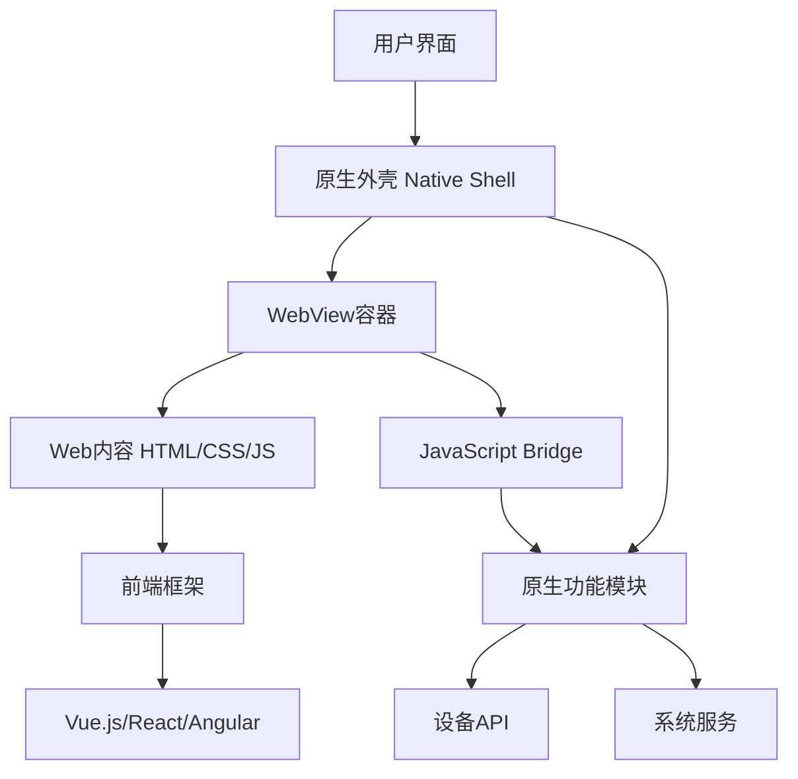
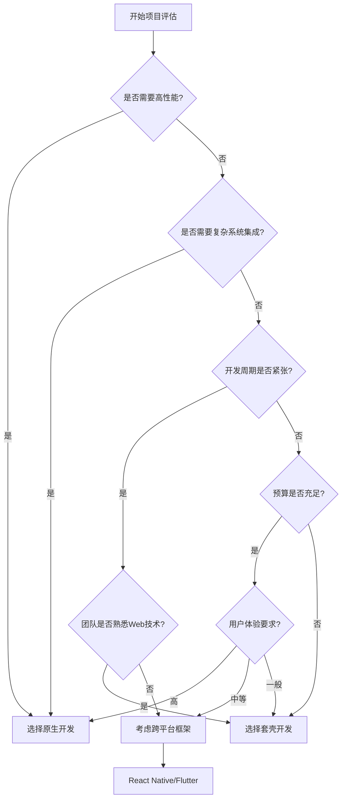

# 一、套壳应用概述

## （一）什么是套壳应用

套壳应用（Shell App），也称为混合应用（Hybrid App），是指使用原生应用的外壳（Shell）包装Web内容的应用程序。简单来说，就是在原生应用中嵌入一个WebView组件，然后加载Web页面来实现应用功能。

> **核心概念**：套壳应用 = 原生外壳 + Web内容，通过WebView作为桥梁连接原生功能和Web技术。

## （二）套壳应用的技术架构



### 技术栈组成

**原生层（Native Layer）：**
- **Android**：Java/Kotlin + WebView
- **iOS**：Objective-C/Swift + WKWebView
- **跨平台**：React Native、Flutter、Cordova

**Web层（Web Layer）：**
- **前端框架**：Vue.js、React、Angular
- **构建工具**：Webpack、Vite、Rollup
- **UI库**：Element UI、Ant Design、Vant

**桥接层（Bridge Layer）：**
- **通信机制**：JavaScript Bridge
- **数据传递**：JSON格式数据交换
- **API封装**：原生功能的JavaScript接口

## （三）套壳应用的分类

### 1. 按技术实现分类

#### 纯WebView套壳
- **描述**：完全基于Web技术，原生部分只提供WebView容器
- **优势**：开发成本低、更新便捷、跨平台一致性好
- **劣势**：性能相对较差、用户体验不如原生、功能受限
- **适用场景**：简单的展示类应用、内容管理系统、企业内部工具

#### 混合开发套壳
- **描述**：核心功能用Web实现，关键模块用原生开发
- **优势**：性能较好、功能丰富、开发效率高
- **劣势**：技术栈复杂、调试困难、包体积较大
- **适用场景**：电商应用、社交应用、金融应用

#### 渐进式Web应用（PWA）
- **描述**：Web应用 + 原生应用特性
- **优势**：无需安装、离线可用、推送通知
- **劣势**：浏览器兼容性、功能限制、iOS支持有限
- **适用场景**：Twitter Lite、Pinterest、Starbucks PWA

### 2. 按应用场景分类

**企业级应用：**
- 内部管理系统
- 员工门户应用
- 业务流程应用

**内容展示应用：**
- 新闻资讯应用
- 博客阅读器
- 产品展示应用

**电商类应用：**
- 购物商城
- 商品展示
- 订单管理系统

# 二、套壳应用开发技术方案

## （一）Android套壳应用开发

### 1. 基础WebView实现

```java
// MainActivity.java - Android WebView套壳应用基础实现
public class MainActivity extends AppCompatActivity {
    private WebView webView;
    private ProgressBar progressBar;
    
    @Override
    protected void onCreate(Bundle savedInstanceState) {
        super.onCreate(savedInstanceState);
        setContentView(R.layout.activity_main);
        
        initViews();
        setupWebView();
        loadWebContent();
    }
    
    private void initViews() {
        webView = findViewById(R.id.webview);
        progressBar = findViewById(R.id.progress_bar);
    }
    
    private void setupWebView() {
        WebSettings webSettings = webView.getSettings();
        
        // 启用JavaScript支持
        webSettings.setJavaScriptEnabled(true);
        
        // 启用DOM存储
        webSettings.setDomStorageEnabled(true);
        
        // 启用数据库存储
        webSettings.setDatabaseEnabled(true);
        
        // 设置缓存模式
        webSettings.setCacheMode(WebSettings.LOAD_DEFAULT);
        
        // 启用缩放功能
        webSettings.setSupportZoom(true);
        webSettings.setBuiltInZoomControls(true);
        webSettings.setDisplayZoomControls(false);
        
        // 设置User-Agent
        String userAgent = webSettings.getUserAgentString();
        webSettings.setUserAgentString(userAgent + " MyApp/1.0");
        
        // 允许混合内容（HTTP和HTTPS）
        if (Build.VERSION.SDK_INT >= Build.VERSION_CODES.LOLLIPOP) {
            webSettings.setMixedContentMode(WebSettings.MIXED_CONTENT_ALWAYS_ALLOW);
        }
        
        // 设置WebView客户端
        webView.setWebViewClient(new CustomWebViewClient());
        webView.setWebChromeClient(new CustomWebChromeClient());
        
        // 添加JavaScript接口
        webView.addJavascriptInterface(new JavaScriptInterface(), "Android");
    }
    
    private void loadWebContent() {
        // 加载本地HTML文件
        // webView.loadUrl("file:///android_asset/index.html");
        
        // 加载远程URL
        webView.loadUrl("https://your-web-app.com");
    }
    
    // 自定义WebViewClient
    private class CustomWebViewClient extends WebViewClient {
        @Override
        public boolean shouldOverrideUrlLoading(WebView view, WebResourceRequest request) {
            String url = request.getUrl().toString();
            
            // 处理特殊URL scheme
            if (url.startsWith("tel:")) {
                Intent intent = new Intent(Intent.ACTION_DIAL, Uri.parse(url));
                startActivity(intent);
                return true;
            }
            
            // 在当前WebView中加载URL
            view.loadUrl(url);
            return true;
        }
        
        @Override
        public void onPageStarted(WebView view, String url, Bitmap favicon) {
            super.onPageStarted(view, url, favicon);
            progressBar.setVisibility(View.VISIBLE);
        }
        
        @Override
        public void onPageFinished(WebView view, String url) {
            super.onPageFinished(view, url);
            progressBar.setVisibility(View.GONE);
        }
        
        @Override
        public void onReceivedError(WebView view, WebResourceRequest request, 
                                  WebResourceError error) {
            super.onReceivedError(view, request, error);
            // 处理加载错误
            loadErrorPage();
        }
    }
    
    // 自定义WebChromeClient
    private class CustomWebChromeClient extends WebChromeClient {
        @Override
        public void onProgressChanged(WebView view, int newProgress) {
            super.onProgressChanged(view, newProgress);
            progressBar.setProgress(newProgress);
        }
        
        @Override
        public boolean onJsAlert(WebView view, String url, String message, 
                               JsResult result) {
            // 处理JavaScript alert
            new AlertDialog.Builder(MainActivity.this)
                .setMessage(message)
                .setPositiveButton("确定", (dialog, which) -> result.confirm())
                .show();
            return true;
        }
        
        // 处理文件选择
        @Override
        public boolean onShowFileChooser(WebView webView, ValueCallback<Uri[]> filePathCallback,
                                       FileChooserParams fileChooserParams) {
            // 实现文件选择逻辑
            return super.onShowFileChooser(webView, filePathCallback, fileChooserParams);
        }
    }
    
    // JavaScript接口类
    public class JavaScriptInterface {
        @JavascriptInterface
        public void showToast(String message) {
            runOnUiThread(() -> 
                Toast.makeText(MainActivity.this, message, Toast.LENGTH_SHORT).show()
            );
        }
        
        @JavascriptInterface
        public String getDeviceInfo() {
            JSONObject deviceInfo = new JSONObject();
            try {
                deviceInfo.put("model", Build.MODEL);
                deviceInfo.put("version", Build.VERSION.RELEASE);
                deviceInfo.put("manufacturer", Build.MANUFACTURER);
                deviceInfo.put("appVersion", getAppVersion());
            } catch (JSONException e) {
                e.printStackTrace();
            }
            return deviceInfo.toString();
        }
        
        @JavascriptInterface
        public void openCamera() {
            runOnUiThread(() -> {
                // 调用相机功能
                Intent intent = new Intent(MediaStore.ACTION_IMAGE_CAPTURE);
                if (intent.resolveActivity(getPackageManager()) != null) {
                    startActivityForResult(intent, REQUEST_CAMERA);
                }
            });
        }
    }
    
    private void loadErrorPage() {
        String errorHtml = "<!DOCTYPE html>" +
            "<html><head><meta charset='utf-8'>" +
            "<meta name='viewport' content='width=device-width, initial-scale=1.0'>" +
            "<title>加载失败</title></head>" +
            "<body style='text-align:center; padding:50px;'>" +
            "<h2>页面加载失败</h2>" +
            "<p>请检查网络连接后重试</p>" +
            "<button onclick='window.location.reload()'>重新加载</button>" +
            "</body></html>";
        
        webView.loadDataWithBaseURL(null, errorHtml, "text/html", "UTF-8", null);
    }
    
    @Override
    public void onBackPressed() {
        if (webView.canGoBack()) {
            webView.goBack();
        } else {
            super.onBackPressed();
        }
    }
    
    @Override
    protected void onDestroy() {
        if (webView != null) {
            webView.destroy();
        }
        super.onDestroy();
    }
}
```

### 2. 布局文件配置

```xml
<!-- activity_main.xml -->
<?xml version="1.0" encoding="utf-8"?>
<RelativeLayout xmlns:android="http://schemas.android.com/apk/res/android"
    android:layout_width="match_parent"
    android:layout_height="match_parent">
    
    <!-- WebView容器 -->
    <WebView
        android:id="@+id/webview"
        android:layout_width="match_parent"
        android:layout_height="match_parent" />
    
    <!-- 加载进度条 -->
    <ProgressBar
        android:id="@+id/progress_bar"
        style="?android:attr/progressBarStyleHorizontal"
        android:layout_width="match_parent"
        android:layout_height="3dp"
        android:layout_alignParentTop="true"
        android:progressDrawable="@drawable/progress_bar_drawable" />
    
</RelativeLayout>
```

### 3. 权限配置

```xml
<!-- AndroidManifest.xml -->
<manifest xmlns:android="http://schemas.android.com/apk/res/android"
    package="com.example.shellapp">
    
    <!-- 网络权限 -->
    <uses-permission android:name="android.permission.INTERNET" />
    <uses-permission android:name="android.permission.ACCESS_NETWORK_STATE" />
    
    <!-- 存储权限 -->
    <uses-permission android:name="android.permission.WRITE_EXTERNAL_STORAGE" />
    <uses-permission android:name="android.permission.READ_EXTERNAL_STORAGE" />
    
    <!-- 相机权限 -->
    <uses-permission android:name="android.permission.CAMERA" />
    
    <!-- 定位权限 -->
    <uses-permission android:name="android.permission.ACCESS_FINE_LOCATION" />
    <uses-permission android:name="android.permission.ACCESS_COARSE_LOCATION" />
    
    <!-- 允许HTTP流量（Android 9+） -->
    <application
        android:usesCleartextTraffic="true"
        android:networkSecurityConfig="@xml/network_security_config">
        
        <activity
            android:name=".MainActivity"
            android:exported="true"
            android:theme="@style/Theme.ShellApp">
            <intent-filter>
                <action android:name="android.intent.action.MAIN" />
                <category android:name="android.intent.category.LAUNCHER" />
            </intent-filter>
        </activity>
        
    </application>
</manifest>
```

## （二）iOS套壳应用开发

### 1. Swift实现WebView套壳

```swift
// ViewController.swift - iOS WKWebView套壳应用实现
import UIKit
import WebKit

class ViewController: UIViewController {
    
    @IBOutlet weak var webView: WKWebView!
    @IBOutlet weak var progressView: UIProgressView!
    
    override func viewDidLoad() {
        super.viewDidLoad()
        setupWebView()
        loadWebContent()
    }
    
    private func setupWebView() {
        // 配置WKWebView
        let configuration = WKWebViewConfiguration()
        
        // 启用JavaScript
        configuration.preferences.javaScriptEnabled = true
        
        // 允许JavaScript打开窗口
        configuration.preferences.javaScriptCanOpenWindowsAutomatically = true
        
        // 添加用户脚本
        let userScript = WKUserScript(
            source: "window.iOS = true;",
            injectionTime: .atDocumentEnd,
            forMainFrameOnly: false
        )
        configuration.userContentController.addUserScript(userScript)
        
        // 添加消息处理器
        configuration.userContentController.add(self, name: "iOSHandler")
        
        // 重新创建WebView（如果需要）
        if webView == nil {
            webView = WKWebView(frame: view.bounds, configuration: configuration)
            view.addSubview(webView)
        }
        
        // 设置代理
        webView.navigationDelegate = self
        webView.uiDelegate = self
        
        // 添加KVO观察者
        webView.addObserver(self, forKeyPath: #keyPath(WKWebView.estimatedProgress), 
                           options: .new, context: nil)
        webView.addObserver(self, forKeyPath: #keyPath(WKWebView.title), 
                           options: .new, context: nil)
    }
    
    private func loadWebContent() {
        // 加载本地HTML文件
        if let path = Bundle.main.path(forResource: "index", ofType: "html") {
            let url = URL(fileURLWithPath: path)
            webView.loadFileURL(url, allowingReadAccessTo: url.deletingLastPathComponent())
        }
        
        // 或者加载远程URL
        // if let url = URL(string: "https://your-web-app.com") {
        //     let request = URLRequest(url: url)
        //     webView.load(request)
        // }
    }
    
    // KVO观察者
    override func observeValue(forKeyPath keyPath: String?, of object: Any?, 
                             change: [NSKeyValueChangeKey : Any]?, context: UnsafeMutableRawPointer?) {
        if keyPath == "estimatedProgress" {
            progressView.progress = Float(webView.estimatedProgress)
            progressView.isHidden = webView.estimatedProgress >= 1.0
        } else if keyPath == "title" {
            title = webView.title
        }
    }
    
    deinit {
        webView.removeObserver(self, forKeyPath: #keyPath(WKWebView.estimatedProgress))
        webView.removeObserver(self, forKeyPath: #keyPath(WKWebView.title))
    }
}

// MARK: - WKNavigationDelegate
extension ViewController: WKNavigationDelegate {
    
    func webView(_ webView: WKWebView, didStartProvisionalNavigation navigation: WKNavigation!) {
        progressView.isHidden = false
        progressView.progress = 0.0
    }
    
    func webView(_ webView: WKWebView, didFinish navigation: WKNavigation!) {
        progressView.isHidden = true
    }
    
    func webView(_ webView: WKWebView, didFail navigation: WKNavigation!, withError error: Error) {
        progressView.isHidden = true
        showErrorAlert(error: error)
    }
    
    func webView(_ webView: WKWebView, decidePolicyFor navigationAction: WKNavigationAction, 
                decisionHandler: @escaping (WKNavigationActionPolicy) -> Void) {
        
        guard let url = navigationAction.request.url else {
            decisionHandler(.cancel)
            return
        }
        
        // 处理特殊URL scheme
        if url.scheme == "tel" {
            UIApplication.shared.open(url)
            decisionHandler(.cancel)
            return
        }
        
        decisionHandler(.allow)
    }
    
    private func showErrorAlert(error: Error) {
        let alert = UIAlertController(title: "加载失败", 
                                    message: error.localizedDescription, 
                                    preferredStyle: .alert)
        alert.addAction(UIAlertAction(title: "重试", style: .default) { _ in
            self.webView.reload()
        })
        alert.addAction(UIAlertAction(title: "取消", style: .cancel))
        present(alert, animated: true)
    }
}

// MARK: - WKUIDelegate
extension ViewController: WKUIDelegate {
    
    func webView(_ webView: WKWebView, runJavaScriptAlertPanelWithMessage message: String, 
                initiatedByFrame frame: WKFrameInfo, completionHandler: @escaping () -> Void) {
        let alert = UIAlertController(title: "提示", message: message, preferredStyle: .alert)
        alert.addAction(UIAlertAction(title: "确定", style: .default) { _ in
            completionHandler()
        })
        present(alert, animated: true)
    }
    
    func webView(_ webView: WKWebView, runJavaScriptConfirmPanelWithMessage message: String, 
                initiatedByFrame frame: WKFrameInfo, 
                completionHandler: @escaping (Bool) -> Void) {
        let alert = UIAlertController(title: "确认", message: message, preferredStyle: .alert)
        alert.addAction(UIAlertAction(title: "确定", style: .default) { _ in
            completionHandler(true)
        })
        alert.addAction(UIAlertAction(title: "取消", style: .cancel) { _ in
            completionHandler(false)
        })
        present(alert, animated: true)
    }
}

// MARK: - WKScriptMessageHandler
extension ViewController: WKScriptMessageHandler {
    
    func userContentController(_ userContentController: WKUserContentController, 
                             didReceive message: WKScriptMessage) {
        if message.name == "iOSHandler" {
            handleJavaScriptMessage(message)
        }
    }
    
    private func handleJavaScriptMessage(_ message: WKScriptMessage) {
        guard let body = message.body as? [String: Any],
              let action = body["action"] as? String else {
            return
        }
        
        switch action {
        case "showToast":
            if let text = body["message"] as? String {
                showToast(message: text)
            }
            
        case "getDeviceInfo":
            let deviceInfo = getDeviceInfo()
            let script = "window.receiveDeviceInfo(\(deviceInfo))"
            webView.evaluateJavaScript(script)
            
        case "openCamera":
            openCamera()
            
        default:
            print("Unknown action: \(action)")
        }
    }
    
    private func showToast(message: String) {
        // 实现Toast显示逻辑
        let alert = UIAlertController(title: nil, message: message, preferredStyle: .alert)
        present(alert, animated: true)
        DispatchQueue.main.asyncAfter(deadline: .now() + 1.5) {
            alert.dismiss(animated: true)
        }
    }
    
    private func getDeviceInfo() -> String {
        let device = UIDevice.current
        let deviceInfo: [String: Any] = [
            "model": device.model,
            "systemName": device.systemName,
            "systemVersion": device.systemVersion,
            "name": device.name,
            "appVersion": Bundle.main.infoDictionary?["CFBundleShortVersionString"] ?? "1.0"
        ]
        
        if let data = try? JSONSerialization.data(withJSONObject: deviceInfo),
           let jsonString = String(data: data, encoding: .utf8) {
            return jsonString
        }
        return "{}"
    }
    
    private func openCamera() {
        // 实现相机调用逻辑
        let imagePickerController = UIImagePickerController()
        imagePickerController.sourceType = .camera
        imagePickerController.delegate = self
        present(imagePickerController, animated: true)
    }
}

// MARK: - UIImagePickerControllerDelegate
extension ViewController: UIImagePickerControllerDelegate, UINavigationControllerDelegate {
    
    func imagePickerController(_ picker: UIImagePickerController, 
                             didFinishPickingMediaWithInfo info: [UIImagePickerController.InfoKey : Any]) {
        picker.dismiss(animated: true)
        
        if let image = info[.originalImage] as? UIImage {
            // 处理拍摄的图片
            processSelectedImage(image)
        }
    }
    
    func imagePickerControllerDidCancel(_ picker: UIImagePickerController) {
        picker.dismiss(animated: true)
    }
    
    private func processSelectedImage(_ image: UIImage) {
        // 将图片转换为Base64并传递给Web页面
        if let imageData = image.jpegData(compressionQuality: 0.8) {
            let base64String = imageData.base64EncodedString()
            let script = "window.receiveImage('data:image/jpeg;base64,\(base64String)')"
            webView.evaluateJavaScript(script)
        }
    }
}
```

# 三、Web端开发与原生交互

## （一）JavaScript Bridge通信机制

### 1. Web端调用原生功能

```javascript
// web-native-bridge.js - Web端与原生交互的桥接层
class WebNativeBridge {
    constructor() {
        this.isAndroid = typeof Android !== 'undefined';
        this.isIOS = typeof webkit !== 'undefined' && webkit.messageHandlers;
        this.callbacks = new Map();
        this.callbackId = 0;
        
        this.init();
    }
    
    init() {
        // 初始化平台检测
        this.platform = this.detectPlatform();
        
        // 设置全局错误处理
        window.addEventListener('error', this.handleError.bind(this));
        
        // 监听页面加载完成
        if (document.readyState === 'loading') {
            document.addEventListener('DOMContentLoaded', this.onReady.bind(this));
        } else {
            this.onReady();
        }
    }
    
    detectPlatform() {
        if (this.isAndroid) {
            return 'android';
        } else if (this.isIOS) {
            return 'ios';
        } else {
            return 'web';
        }
    }
    
    onReady() {
        console.log(`WebNativeBridge initialized on ${this.platform}`);
        
        // 通知原生端页面加载完成
        this.callNative('pageReady', {
            url: window.location.href,
            title: document.title,
            timestamp: Date.now()
        });
    }
    
    // 调用原生功能的统一接口
    callNative(method, params = {}, callback = null) {
        const callId = this.generateCallId();
        
        if (callback) {
            this.callbacks.set(callId, callback);
        }
        
        const message = {
            method: method,
            params: params,
            callId: callId,
            timestamp: Date.now()
        };
        
        try {
            if (this.isAndroid && window.Android) {
                // Android平台调用
                this.callAndroid(message);
            } else if (this.isIOS && window.webkit) {
                // iOS平台调用
                this.callIOS(message);
            } else {
                // Web平台模拟
                this.callWeb(message);
            }
        } catch (error) {
            console.error('调用原生功能失败:', error);
            if (callback) {
                callback({ error: error.message });
            }
        }
    }
    
    callAndroid(message) {
        const methodName = message.method;
        const params = JSON.stringify(message.params);
        
        // 根据方法名调用对应的Android接口
        switch (methodName) {
            case 'showToast':
                Android.showToast(message.params.message);
                break;
                
            case 'getDeviceInfo':
                const deviceInfo = Android.getDeviceInfo();
                this.handleNativeCallback(message.callId, JSON.parse(deviceInfo));
                break;
                
            case 'openCamera':
                Android.openCamera();
                break;
                
            case 'setStatusBar':
                Android.setStatusBar(params);
                break;
                
            default:
                console.warn(`未知的Android方法: ${methodName}`);
        }
    }
    
    callIOS(message) {
        // iOS平台通过webkit.messageHandlers调用
        window.webkit.messageHandlers.iOSHandler.postMessage({
            action: message.method,
            params: message.params,
            callId: message.callId
        });
    }
    
    callWeb(message) {
        // Web平台模拟实现
        console.log('Web平台模拟调用:', message);
        
        setTimeout(() => {
            let result = {};
            
            switch (message.method) {
                case 'getDeviceInfo':
                    result = {
                        platform: 'web',
                        userAgent: navigator.userAgent,
                        language: navigator.language,
                        screenWidth: screen.width,
                        screenHeight: screen.height
                    };
                    break;
                    
                case 'showToast':
                    this.showWebToast(message.params.message);
                    result = { success: true };
                    break;
                    
                default:
                    result = { error: '不支持的方法' };
            }
            
            this.handleNativeCallback(message.callId, result);
        }, 100);
    }
    
    // 处理原生端回调
    handleNativeCallback(callId, result) {
        const callback = this.callbacks.get(callId);
        if (callback) {
            callback(result);
            this.callbacks.delete(callId);
        }
    }
    
    // 生成唯一的调用ID
    generateCallId() {
        return `call_${++this.callbackId}_${Date.now()}`;
    }
    
    // Web端Toast实现
    showWebToast(message) {
        const toast = document.createElement('div');
        toast.className = 'web-toast';
        toast.textContent = message;
        toast.style.cssText = `
            position: fixed;
            top: 50%;
            left: 50%;
            transform: translate(-50%, -50%);
            background: rgba(0, 0, 0, 0.8);
            color: white;
            padding: 10px 20px;
            border-radius: 5px;
            z-index: 10000;
            font-size: 14px;
        `;
        
        document.body.appendChild(toast);
        
        setTimeout(() => {
            document.body.removeChild(toast);
        }, 2000);
    }
    
    // 错误处理
    handleError(event) {
        console.error('页面错误:', event.error);
        
        this.callNative('reportError', {
            message: event.error.message,
            filename: event.filename,
            lineno: event.lineno,
            colno: event.colno,
            stack: event.error.stack
        });
    }
    
    // 常用功能封装
    showToast(message) {
        this.callNative('showToast', { message });
    }
    
    getDeviceInfo(callback) {
        this.callNative('getDeviceInfo', {}, callback);
    }
    
    openCamera(callback) {
        this.callNative('openCamera', {}, callback);
    }
    
    setTitle(title) {
        document.title = title;
        this.callNative('setTitle', { title });
    }
    
    goBack() {
        this.callNative('goBack');
    }
    
    share(data) {
        this.callNative('share', data);
    }
    
    openUrl(url) {
        this.callNative('openUrl', { url });
    }
}

// 创建全局桥接实例
window.bridge = new WebNativeBridge();

// 原生端调用Web端的全局函数
window.receiveDeviceInfo = function(deviceInfo) {
    console.log('收到设备信息:', deviceInfo);
    // 触发自定义事件
    window.dispatchEvent(new CustomEvent('deviceInfoReceived', { 
        detail: deviceInfo 
    }));
};

window.receiveImage = function(imageData) {
    console.log('收到图片数据');
    // 触发自定义事件
    window.dispatchEvent(new CustomEvent('imageReceived', { 
        detail: { imageData } 
    }));
};

// 页面可见性变化处理
document.addEventListener('visibilitychange', function() {
    if (document.hidden) {
        window.bridge.callNative('pageHidden');
    } else {
        window.bridge.callNative('pageVisible');
    }
});
```

### 2. Vue.js集成示例

```vue
<!-- App.vue - Vue.js套壳应用主组件 -->
<template>
  <div id="app">
    <!-- 顶部导航栏 -->
    <nav-bar 
      :title="pageTitle"
      :show-back="showBackButton"
      @back="handleBack"
      @menu="handleMenu"
    />
    
    <!-- 主要内容区域 -->
    <main class="main-content">
      <router-view />
    </main>
    
    <!-- 底部导航栏 -->
    <tab-bar v-if="showTabBar" />
    
    <!-- 全局加载提示 -->
    <loading v-if="isLoading" />
    
    <!-- 全局Toast -->
    <toast 
      :visible="toast.visible"
      :message="toast.message"
      :type="toast.type"
      @close="hideToast"
    />
  </div>
</template>

<script>
import NavBar from '@/components/NavBar.vue'
import TabBar from '@/components/TabBar.vue'
import Loading from '@/components/Loading.vue'
import Toast from '@/components/Toast.vue'

export default {
  name: 'App',
  components: {
    NavBar,
    TabBar,
    Loading,
    Toast
  },
  
  data() {
    return {
      pageTitle: '套壳应用',
      showBackButton: false,
      showTabBar: true,
      isLoading: false,
      deviceInfo: null,
      toast: {
        visible: false,
        message: '',
        type: 'info'
      }
    }
  },
  
  created() {
    this.initApp()
  },
  
  mounted() {
    this.setupNativeListeners()
  },
  
  methods: {
    async initApp() {
      try {
        this.isLoading = true
        
        // 获取设备信息
        await this.getDeviceInfo()
        
        // 设置应用标题
        this.setAppTitle()
        
        // 初始化路由监听
        this.setupRouterListeners()
        
      } catch (error) {
        console.error('应用初始化失败:', error)
        this.showToast('应用初始化失败', 'error')
      } finally {
        this.isLoading = false
      }
    },
    
    getDeviceInfo() {
      return new Promise((resolve) => {
        if (window.bridge) {
          window.bridge.getDeviceInfo((info) => {
            this.deviceInfo = info
            console.log('设备信息:', info)
            resolve(info)
          })
        } else {
          resolve(null)
        }
      })
    },
    
    setAppTitle() {
      if (window.bridge) {
        window.bridge.setTitle(this.pageTitle)
      }
    },
    
    setupRouterListeners() {
      // 监听路由变化
      this.$router.beforeEach((to, from, next) => {
        this.pageTitle = to.meta.title || '套壳应用'
        this.showBackButton = to.meta.showBack !== false
        this.showTabBar = to.meta.showTabBar !== false
        
        // 通知原生端路由变化
        if (window.bridge) {
          window.bridge.callNative('routeChanged', {
            from: from.path,
            to: to.path,
            title: this.pageTitle
          })
        }
        
        next()
      })
    },
    
    setupNativeListeners() {
      // 监听设备信息接收
      window.addEventListener('deviceInfoReceived', (event) => {
        this.deviceInfo = event.detail
        this.$store.commit('setDeviceInfo', event.detail)
      })
      
      // 监听图片接收
      window.addEventListener('imageReceived', (event) => {
        this.$eventBus.$emit('imageReceived', event.detail.imageData)
      })
      
      // 监听原生端事件
      window.addEventListener('nativeEvent', (event) => {
        this.handleNativeEvent(event.detail)
      })
    },
    
    handleNativeEvent(eventData) {
      switch (eventData.type) {
        case 'networkChanged':
          this.handleNetworkChange(eventData.data)
          break
          
        case 'appStateChanged':
          this.handleAppStateChange(eventData.data)
          break
          
        case 'pushNotification':
          this.handlePushNotification(eventData.data)
          break
          
        default:
          console.log('未处理的原生事件:', eventData)
      }
    },
    
    handleBack() {
      if (this.$router.history.current.path !== '/') {
        this.$router.go(-1)
      } else if (window.bridge) {
        window.bridge.goBack()
      }
    },
    
    handleMenu() {
      // 显示菜单
      this.$refs.menu.show()
    },
    
    showToast(message, type = 'info') {
      this.toast = {
        visible: true,
        message,
        type
      }
      
      // 同时调用原生Toast
      if (window.bridge) {
        window.bridge.showToast(message)
      }
    },
    
    hideToast() {
      this.toast.visible = false
    },
    
    handleNetworkChange(networkInfo) {
      if (!networkInfo.isConnected) {
        this.showToast('网络连接已断开', 'warning')
      }
    },
    
    handleAppStateChange(state) {
      if (state === 'background') {
        // 应用进入后台
        this.$store.dispatch('saveAppState')
      } else if (state === 'foreground') {
        // 应用回到前台
        this.$store.dispatch('restoreAppState')
      }
    },
    
    handlePushNotification(notification) {
      // 处理推送通知
      this.showToast(notification.message)
      
      // 根据通知类型跳转页面
      if (notification.action) {
        this.$router.push(notification.action.url)
      }
    }
  }
}
</script>

<style>
#app {
  font-family: -apple-system, BlinkMacSystemFont, 'Segoe UI', Roboto, sans-serif;
  -webkit-font-smoothing: antialiased;
  -moz-osx-font-smoothing: grayscale;
  height: 100vh;
  display: flex;
  flex-direction: column;
}

.main-content {
  flex: 1;
  overflow-y: auto;
  -webkit-overflow-scrolling: touch;
}

/* 适配安全区域 */
@supports (padding-top: env(safe-area-inset-top)) {
  .main-content {
    padding-top: env(safe-area-inset-top);
    padding-bottom: env(safe-area-inset-bottom);
  }
}
</style>
```



# 四、套壳应用的优缺点与选择建议

## （一）优势分析

### 1. 开发效率优势

**成本效益对比：**

| 对比项目 | 原生开发 | 套壳开发 | 优势 |
|---------|---------|---------|------|
| 开发周期 | 6-12个月 | 2-4个月 | 节省50-70%时间 |
| 团队规模 | 4-8人 | 2-4人 | 减少人力成本 |
| 技能要求 | iOS+Android+后端 | 前端+少量原生 | 降低技术门槛 |
| 维护成本 | 高（两套代码） | 中等（主要Web） | 降低维护负担 |
| 更新频率 | 应用商店审核 | 即时更新（Web部分） | 提高迭代速度 |

### 2. 技术优势

#### 跨平台优势
**一套代码多平台运行**
- iOS和Android共享Web代码
- 减少平台差异处理
- 统一的用户体验
- 降低测试成本

#### 快速开发优势
**快速开发和部署**
- Web技术栈成熟
- 丰富的前端框架和库
- 热更新能力
- 快速原型验证

#### 维护优势
**便于维护和更新**
- 主要逻辑在Web端
- bug修复可以热更新
- 功能迭代更灵活
- A/B测试容易实现

## （二）劣势分析

### 1. 性能限制

**性能对比分析：**

| 性能指标 | 原生应用 | 套壳应用 | 影响说明 |
|---------|---------|---------|----------|
| **启动时间** | 1-2秒 | 2-5秒 | 用户首次体验较差 |
| **内存使用** | 50-100MB | 80-150MB | 内存占用较高 |
| **滚动性能** | 60FPS流畅 | 可能出现卡顿 | 滚动体验不如原生 |
| **电池续航** | 优秀 | 一般 | 电池消耗相对较高 |

**主要性能限制：**
- WebView渲染性能不如原生
- JavaScript执行效率相对较低
- 复杂动画可能出现卡顿
- 大量数据处理性能受限
- 网络依赖性较强

### 2. 功能限制

**原生功能访问限制：**
- 无法访问所有系统API
- 推送通知功能受限
- 后台处理能力有限
- 系统级集成度不高
- 硬件功能调用复杂

### 3. 用户体验问题

**交互体验限制：**
- 触摸反馈延迟
- 键盘处理复杂
- 手势识别有限
- 系统UI不一致
- 加载状态处理

## （三）应用商店审核风险

### 1. 审核政策分析

#### Apple App Store（审核严格）
**常见拒绝原因：**
- 简单的网站包装
- 缺乏原生功能
- 用户体验不佳
- 功能重复或无价值

**审核要求：**
- 必须提供独特价值
- 需要原生功能集成
- 遵循iOS设计规范
- 性能达到标准

#### Google Play Store（相对宽松）
**常见拒绝原因：**
- 低质量应用
- 误导性内容
- 功能不完整
- 崩溃或错误

**审核要求：**
- 应用稳定运行
- 提供实际价值
- 遵循Android规范
- 适当的权限使用

### 2. 提高审核通过率的策略

**增加原生功能模块：**

#### 基础功能（必备）
- 相机和相册访问
- 定位服务
- 推送通知
- 本地存储
- 网络状态检测

#### 增强功能（推荐）
- 生物识别认证
- 系统分享功能
- 联系人访问
- 日历集成
- 设备震动

#### 高级功能（可选）
- 后台任务处理
- Widget支持
- Siri快捷指令
- Apple Pay集成
- 健康数据访问

# 五、套壳应用最佳实践

## （一）性能优化策略

### 1. 启动性能优化

```javascript
// startup-optimization.js - 启动性能优化
class StartupOptimizer {
    constructor() {
        this.criticalResources = [];
        this.deferredResources = [];
        this.init();
    }

    init() {
        // 预加载关键资源
        this.preloadCriticalResources();

        // 延迟加载非关键资源
        this.deferNonCriticalResources();

        // 启用资源缓存
        this.enableResourceCaching();

        // 优化首屏渲染
        this.optimizeFirstPaint();
    }

    preloadCriticalResources() {
        const critical = [
            '/css/critical.css',
            '/js/app.min.js',
            '/images/logo.png'
        ];

        critical.forEach(resource => {
            const link = document.createElement('link');
            link.rel = 'preload';
            link.href = resource;

            if (resource.endsWith('.css')) {
                link.as = 'style';
            } else if (resource.endsWith('.js')) {
                link.as = 'script';
            } else if (resource.match(/\.(png|jpg|jpeg|gif|webp)$/)) {
                link.as = 'image';
            }

            document.head.appendChild(link);
        });
    }

    deferNonCriticalResources() {
        // 延迟加载非关键CSS
        const deferredCSS = [
            '/css/non-critical.css',
            '/css/animations.css'
        ];

        window.addEventListener('load', () => {
            deferredCSS.forEach(css => {
                const link = document.createElement('link');
                link.rel = 'stylesheet';
                link.href = css;
                document.head.appendChild(link);
            });
        });

        // 延迟加载非关键JavaScript
        const deferredJS = [
            '/js/analytics.js',
            '/js/third-party.js'
        ];

        setTimeout(() => {
            deferredJS.forEach(js => {
                const script = document.createElement('script');
                script.src = js;
                script.async = true;
                document.head.appendChild(script);
            });
        }, 1000);
    }

    enableResourceCaching() {
        // Service Worker缓存策略
        if ('serviceWorker' in navigator) {
            navigator.serviceWorker.register('/sw.js')
                .then(registration => {
                    console.log('SW注册成功:', registration);
                })
                .catch(error => {
                    console.log('SW注册失败:', error);
                });
        }
    }

    optimizeFirstPaint() {
        // 内联关键CSS
        const criticalCSS = `
            body { margin: 0; font-family: -apple-system, BlinkMacSystemFont, sans-serif; }
            .loading { display: flex; justify-content: center; align-items: center; height: 100vh; }
            .spinner { width: 40px; height: 40px; border: 4px solid #f3f3f3; border-top: 4px solid #3498db; border-radius: 50%; animation: spin 1s linear infinite; }
            @keyframes spin { 0% { transform: rotate(0deg); } 100% { transform: rotate(360deg); } }
        `;

        const style = document.createElement('style');
        style.textContent = criticalCSS;
        document.head.appendChild(style);

        // 显示加载动画
        document.body.innerHTML = `
            <div class="loading">
                <div class="spinner"></div>
            </div>
        `;
    }
}

// 立即执行启动优化
new StartupOptimizer();
```

### 2. 运行时性能优化

```javascript
// runtime-optimization.js - 运行时性能优化
class RuntimeOptimizer {
    constructor() {
        this.performanceObserver = null;
        this.memoryMonitor = null;
        this.init();
    }

    init() {
        this.setupPerformanceMonitoring();
        this.optimizeScrolling();
        this.optimizeImageLoading();
        this.setupMemoryManagement();
    }

    setupPerformanceMonitoring() {
        // 性能监控
        if ('PerformanceObserver' in window) {
            this.performanceObserver = new PerformanceObserver((list) => {
                const entries = list.getEntries();
                entries.forEach(entry => {
                    if (entry.entryType === 'measure') {
                        console.log(`性能指标 ${entry.name}: ${entry.duration}ms`);
                    }
                });
            });

            this.performanceObserver.observe({ entryTypes: ['measure', 'navigation'] });
        }

        // 监控长任务
        if ('PerformanceObserver' in window) {
            const longTaskObserver = new PerformanceObserver((list) => {
                const entries = list.getEntries();
                entries.forEach(entry => {
                    console.warn(`长任务检测: ${entry.duration}ms`);
                    // 通知原生端性能问题
                    if (window.bridge) {
                        window.bridge.callNative('performanceIssue', {
                            type: 'longTask',
                            duration: entry.duration
                        });
                    }
                });
            });

            longTaskObserver.observe({ entryTypes: ['longtask'] });
        }
    }

    optimizeScrolling() {
        // 滚动性能优化
        let ticking = false;

        const optimizedScrollHandler = () => {
            if (!ticking) {
                requestAnimationFrame(() => {
                    // 执行滚动相关操作
                    this.handleScroll();
                    ticking = false;
                });
                ticking = true;
            }
        };

        // 使用被动事件监听器
        document.addEventListener('scroll', optimizedScrollHandler, { passive: true });

        // 虚拟滚动实现
        this.implementVirtualScrolling();
    }

    handleScroll() {
        const scrollTop = window.pageYOffset;

        // 懒加载图片
        this.lazyLoadImages();

        // 更新导航栏状态
        this.updateNavigationBar(scrollTop);
    }

    lazyLoadImages() {
        const images = document.querySelectorAll('img[data-src]:not([data-loaded])');

        images.forEach(img => {
            if (this.isElementInViewport(img)) {
                img.src = img.dataset.src;
                img.setAttribute('data-loaded', 'true');
                img.removeAttribute('data-src');
            }
        });
    }

    isElementInViewport(element) {
        const rect = element.getBoundingClientRect();
        return (
            rect.top >= 0 &&
            rect.left >= 0 &&
            rect.bottom <= (window.innerHeight || document.documentElement.clientHeight) &&
            rect.right <= (window.innerWidth || document.documentElement.clientWidth)
        );
    }

    optimizeImageLoading() {
        // 图片格式优化
        const supportsWebP = () => {
            const canvas = document.createElement('canvas');
            canvas.width = 1;
            canvas.height = 1;
            return canvas.toDataURL('image/webp').indexOf('data:image/webp') === 0;
        };

        if (supportsWebP()) {
            document.documentElement.classList.add('webp');
        }

        // 响应式图片加载
        this.setupResponsiveImages();
    }

    setupResponsiveImages() {
        const images = document.querySelectorAll('img[data-srcset]');

        images.forEach(img => {
            const devicePixelRatio = window.devicePixelRatio || 1;
            const screenWidth = window.innerWidth;

            let selectedSrc = img.dataset.src; // 默认图片

            if (devicePixelRatio >= 2 && screenWidth >= 768) {
                selectedSrc = img.dataset.srcHd; // 高清图片
            } else if (screenWidth < 768) {
                selectedSrc = img.dataset.srcMobile; // 移动端图片
            }

            if (selectedSrc) {
                img.src = selectedSrc;
            }
        });
    }

    setupMemoryManagement() {
        // 内存使用监控
        if ('memory' in performance) {
            this.memoryMonitor = setInterval(() => {
                const memInfo = performance.memory;
                const usedMB = Math.round(memInfo.usedJSHeapSize / 1048576);
                const totalMB = Math.round(memInfo.totalJSHeapSize / 1048576);

                console.log(`内存使用: ${usedMB}MB / ${totalMB}MB`);

                // 内存使用过高时清理
                if (usedMB > 100) {
                    this.performMemoryCleanup();
                }
            }, 10000);
        }

        // 页面可见性变化处理
        document.addEventListener('visibilitychange', () => {
            if (document.hidden) {
                this.pauseNonEssentialTasks();
            } else {
                this.resumeNonEssentialTasks();
            }
        });
    }

    performMemoryCleanup() {
        // 清理未使用的DOM元素
        const unusedElements = document.querySelectorAll('[data-cleanup="true"]');
        unusedElements.forEach(element => {
            element.remove();
        });

        // 清理事件监听器
        this.cleanupEventListeners();

        // 清理定时器
        this.cleanupTimers();

        console.log('内存清理完成');
    }

    cleanupEventListeners() {
        // 移除未使用的事件监听器
        const elements = document.querySelectorAll('[data-events]');
        elements.forEach(element => {
            const events = element.dataset.events.split(',');
            events.forEach(event => {
                element.removeEventListener(event.trim(), null);
            });
        });
    }

    cleanupTimers() {
        // 清理应用级定时器
        if (window.appTimers) {
            window.appTimers.forEach(timer => {
                clearTimeout(timer);
                clearInterval(timer);
            });
            window.appTimers = [];
        }
    }

    pauseNonEssentialTasks() {
        // 暂停非必要任务
        if (this.memoryMonitor) {
            clearInterval(this.memoryMonitor);
        }

        // 暂停动画
        const animations = document.getAnimations();
        animations.forEach(animation => animation.pause());
    }

    resumeNonEssentialTasks() {
        // 恢复非必要任务
        this.setupMemoryManagement();

        // 恢复动画
        const animations = document.getAnimations();
        animations.forEach(animation => animation.play());
    }
}

// 初始化运行时优化
document.addEventListener('DOMContentLoaded', () => {
    new RuntimeOptimizer();
});
```

# 六、套壳应用开发选择建议

## （一）适用场景分析

### 1. 推荐使用套壳开发的场景

#### 内容驱动型应用
**应用示例：**
- 新闻资讯应用
- 博客阅读器
- 在线文档系统
- 企业官网应用
- 产品展示应用

**推荐理由：**
- 主要功能是内容展示
- 更新频率高
- 跨平台一致性要求高
- 开发成本敏感

#### 企业级工具应用
**应用示例：**
- CRM系统
- ERP移动端
- 项目管理工具
- 内部办公系统
- 数据报表应用

**推荐理由：**
- 功能相对简单
- 用户群体固定
- 快速迭代需求
- 成本控制要求

#### 原型验证和MVP
**应用示例：**
- 创业项目MVP
- 概念验证应用
- 市场测试产品
- 快速原型展示

**推荐理由：**
- 快速上线验证
- 低成本试错
- 功能快速迭代
- 技术栈灵活

### 2. 不推荐使用套壳开发的场景

#### 性能要求极高的应用
**应用示例：**
- 游戏应用
- 视频编辑器
- 图像处理应用
- 实时通讯应用
- AR/VR应用

**不推荐理由：**
- 需要高性能渲染
- 实时性要求高
- 复杂计算密集
- 硬件资源依赖重

#### 系统深度集成应用
**应用示例：**
- 系统工具应用
- 安全类应用
- 设备管理应用
- 系统优化工具

**不推荐理由：**
- 需要系统级权限
- 深度硬件访问
- 系统API依赖重
- 安全性要求高

#### 复杂交互应用
**应用示例：**
- 专业绘图应用
- 音乐制作软件
- 复杂手势应用
- 多点触控应用

**不推荐理由：**
- 复杂手势识别
- 精确触控要求
- 自定义UI组件多
- 交互体验要求高

## （二）技术选型决策树



## （三）开发团队建议

### 1. 团队技能要求

**套壳开发团队配置：**

### 核心团队

| 角色 | 人数 | 技能要求 | 经验要求 |
|------|------|----------|----------|
| **前端开发工程师** | 2-3人 | • HTML/CSS/JavaScript<br>• Vue.js/React/Angular<br>• 移动端适配<br>• 性能优化<br>• WebView调试 | 2年以上前端开发经验 |
| **原生开发工程师** | 1人 | • Android/iOS基础开发<br>• WebView集成<br>• 原生API封装<br>• 应用打包发布<br>• 性能调优 | 1年以上移动开发经验 |
| **后端开发工程师** | 1-2人 | • API设计开发<br>• 数据库设计<br>• 服务器运维<br>• 接口优化<br>• 安全防护 | 2年以上后端开发经验 |

### 支持团队

| 角色 | 人数 | 技能要求 | 工作方式 |
|------|------|----------|----------|
| **UI设计师** | 1人 | • 移动端UI设计<br>• 交互设计<br>• 原型制作 | 兼职参与 |
| **测试工程师** | 1人 | • 移动端测试<br>• 兼容性测试<br>• 性能测试 | 兼职参与 |


### 2. 学习路径建议

**前端开发者转套壳开发：**
1. **移动端适配知识**：viewport、响应式设计、触摸事件
2. **WebView特性**：了解WebView限制和优化方法
3. **原生交互**：JavaScript Bridge、原生API调用
4. **性能优化**：移动端性能优化技巧
5. **调试技能**：移动端调试工具和方法

**原生开发者学习Web技术：**
1. **前端基础**：HTML/CSS/JavaScript基础
2. **现代前端框架**：Vue.js或React基础
3. **构建工具**：Webpack、Vite等构建工具
4. **移动端Web**：移动端Web开发特点
5. **混合开发**：WebView集成和优化

# 七、总结与展望

## （一）套壳应用发展趋势

### 1. 技术发展方向

#### 性能持续优化
- WebView引擎性能提升
- JavaScript引擎优化
- 渲染性能改进
- 内存管理优化
- 启动速度提升

#### 功能能力扩展
- 更多原生API支持
- WebAssembly集成
- PWA特性增强
- 离线能力提升
- AI功能集成

#### 开发工具完善
- 调试工具改进
- 性能分析工具
- 自动化测试支持
- CI/CD集成
- 热更新机制

#### 标准化进程
- Web标准持续发展
- 跨平台API标准化
- 安全标准完善
- 性能标准制定
- 最佳实践规范

### 2. 市场前景分析

**套壳应用的市场定位：**
- **中小企业首选**：成本效益比高，适合快速上线
- **内容型应用主流**：新闻、资讯、展示类应用的主要选择
- **原型验证工具**：创业公司和新产品验证的理想选择
- **企业内部应用**：内部工具和管理系统的常用方案

## （二）最佳实践总结

### 1. 开发阶段最佳实践

#### 规划阶段
- 明确应用定位和目标用户
- 评估性能和功能需求
- 选择合适的技术栈
- 制定开发和发布计划
- 考虑应用商店审核要求

#### 开发阶段
- 采用移动优先的设计理念
- 实现响应式布局和适配
- 优化首屏加载性能
- 集成必要的原生功能
- 建立完善的错误处理机制

#### 测试阶段
- 多设备兼容性测试
- 性能和内存测试
- 网络环境测试
- 用户体验测试
- 应用商店合规性检查

#### 部署阶段
- 建立CI/CD流水线
- 实现热更新机制
- 监控应用性能
- 收集用户反馈
- 持续优化和迭代

### 2. 关键成功因素

**技术层面：**
- 选择合适的技术栈和框架
- 重视性能优化和用户体验
- 建立完善的原生交互机制
- 实现有效的错误处理和监控

**产品层面：**
- 明确产品定位和价值主张
- 提供差异化的功能和服务
- 持续收集用户反馈并改进
- 保持产品的更新和维护

**团队层面：**
- 组建合适的开发团队
- 建立高效的开发流程
- 重视代码质量和规范
- 培养跨平台开发能力

## （三）结语

套壳应用开发作为移动应用开发的重要方式之一，在特定场景下具有明显的优势。通过合理的技术选型、优秀的开发实践和持续的优化改进，套壳应用完全可以提供良好的用户体验和商业价值。

随着Web技术的不断发展和移动设备性能的提升，套壳应用的性能和功能限制将逐步得到改善。对于追求快速上线、成本控制和跨平台一致性的项目来说，套壳开发仍然是一个值得考虑的技术方案。

关键在于根据项目的具体需求、团队能力和资源约束，做出合适的技术选择，并在开发过程中严格遵循最佳实践，确保最终产品的质量和用户体验。



## 参考资料

1. [Android WebView开发指南](https://developer.android.com/guide/webapps/webview)
2. [iOS WKWebView官方文档](https://developer.apple.com/documentation/webkit/wkwebview)
3. [Apache Cordova官方网站](https://cordova.apache.org/)
4. [Ionic Framework文档](https://ionicframework.com/docs)
5. [React Native官方文档](https://reactnative.dev/)
6. [Flutter官方文档](https://flutter.dev/docs)
7. [PWA开发指南](https://web.dev/progressive-web-apps/)
8. [Hybrid App最佳实践](https://developer.mozilla.org/en-US/docs/Web/Progressive_web_apps)
9. [移动端性能优化指南](https://developers.google.com/web/fundamentals/performance)
10. [WebView安全最佳实践](https://owasp.org/www-project-mobile-security-testing-guide/)
