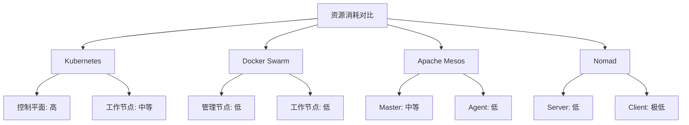



> **摘要**：本文深入探讨容器编排技术，从基础概念到主流工具对比，涵盖Kubernetes、Docker Swarm、Apache Mesos等平台的特性分析和实战案例。通过详细的技术解析和实用的部署示例，帮助读者全面理解容器编排的核心价值和应用场景，为技术选型提供科学依据。


## 📋 文章导览

- **基础篇**：容器编排概念、核心功能、技术原理
- **工具篇**：Kubernetes、Docker Swarm、Apache Mesos等主流工具详解
- **对比篇**：多维度工具对比分析，选型指南
- **实战篇**：微服务应用部署案例，最佳实践
- **进阶篇**：性能优化、安全配置、监控方案

# 一、容器编排基础概念

## （一）什么是容器编排

容器编排（Container Orchestration）是一种自动化管理容器化应用程序的技术，它涉及在大规模的分布式系统中部署、管理、扩展和协调容器的整个生命周期。简单来说，容器编排就是让多个容器协同工作，就像指挥家指挥乐团演奏一样。

> 💡 **技术背景**：根据CNCF的调查报告[^1]，超过90%的组织在生产环境中使用容器技术，其中84%的组织使用容器编排工具来管理容器化应用。

在现代微服务架构中，一个应用可能由数十甚至数百个容器组成，手动管理这些容器显然是不现实的。容器编排工具应运而生，它们能够自动化处理容器的部署、扩展、网络配置、负载均衡、故障恢复等复杂任务。

## （二）为什么需要容器编排

随着容器技术的普及和微服务架构的兴起，传统的单体应用被拆分成多个独立的服务，每个服务运行在自己的容器中。这种架构带来了诸多好处，但也引入了新的挑战：

1. **服务发现与通信**：容器之间需要相互发现和通信，IP地址可能动态变化
2. **负载均衡**：需要将请求合理分发到多个容器实例
3. **自动扩缩容**：根据负载情况自动增减容器数量
4. **故障恢复**：当容器出现故障时自动重启或替换
5. **配置管理**：统一管理容器的配置信息
6. **资源调度**：在集群中合理分配计算资源

## （三）容器编排的核心功能

容器编排系统通常提供以下核心功能：

### 1. 自动化部署
- **声明式配置**：通过配置文件描述期望状态，系统自动实现
- **滚动更新**：无停机时间地更新应用版本
- **回滚机制**：快速回退到之前的稳定版本

### 2. 服务发现与负载均衡
- **DNS服务发现**：为服务提供稳定的域名解析
- **健康检查**：监控服务健康状态，自动剔除故障实例
- **流量分发**：智能分发请求到健康的服务实例

### 3. 自动扩缩容
- **水平扩展**：根据CPU、内存使用率自动增减实例
- **垂直扩展**：动态调整单个容器的资源配额
- **预测性扩展**：基于历史数据预测负载变化

### 4. 存储编排
- **持久化存储**：为有状态应用提供数据持久化
- **存储类**：定义不同性能等级的存储资源
- **动态供应**：按需创建存储卷

### 5. 网络管理
- **虚拟网络**：为容器提供隔离的网络环境
- **网络策略**：定义容器间的通信规则
- **服务网格**：提供高级的流量管理和安全功能

# 二、主流容器编排工具详解

## （一）Kubernetes：容器编排的王者

### 基本介绍

Kubernetes（简称K8s）是由Google开源的容器编排平台，现在由云原生计算基金会（CNCF）维护。它已经成为容器编排领域的事实标准，被广泛应用于生产环境。

### 核心架构

Kubernetes采用主从架构（Master-Worker），主要组件包括：

```yaml
# Kubernetes集群架构示例
apiVersion: v1
kind: Namespace
metadata:
  name: production
---
apiVersion: apps/v1
kind: Deployment
metadata:
  name: web-app
  namespace: production
spec:
  replicas: 3  # 运行3个副本
  selector:
    matchLabels:
      app: web-app
  template:
    metadata:
      labels:
        app: web-app
    spec:
      containers:
      - name: nginx
        image: nginx:1.21
        ports:
        - containerPort: 80
        resources:
          requests:
            memory: "64Mi"
            cpu: "250m"
          limits:
            memory: "128Mi"
            cpu: "500m"
```

### 主要优势

1. **强大的生态系统**：拥有庞大的社区和丰富的插件
2. **高度可扩展**：支持数千节点的大规模集群
3. **声明式API**：通过YAML文件描述期望状态
4. **自愈能力**：自动检测和修复故障
5. **多云支持**：可在各种云平台和本地环境运行

### 适用场景

- 大规模微服务应用
- 需要高可用性的企业级应用
- 多云或混合云环境
- 复杂的CI/CD流水线

## （二）Docker Swarm：简单易用的原生方案

### 基本介绍

Docker Swarm是Docker公司开发的原生容器编排工具，它将多个Docker主机组合成一个虚拟的Docker主机。Swarm的设计理念是简单易用，特别适合已经熟悉Docker的团队。

### 核心特性

```yaml
# Docker Compose文件示例（用于Swarm部署）
version: '3.8'
services:
  web:
    image: nginx:latest
    ports:
      - "80:80"
    deploy:
      replicas: 3  # 部署3个副本
      update_config:
        parallelism: 1  # 每次更新1个实例
        delay: 10s      # 更新间隔10秒
      restart_policy:
        condition: on-failure
        delay: 5s
        max_attempts: 3
    networks:
      - webnet

  redis:
    image: redis:alpine
    deploy:
      replicas: 1
    networks:
      - webnet

networks:
  webnet:
    driver: overlay  # 使用overlay网络驱动
```

### 主要优势

1. **学习成本低**：基于熟悉的Docker命令和概念
2. **部署简单**：几条命令即可搭建集群
3. **原生集成**：与Docker生态系统无缝集成
4. **内置安全**：默认启用TLS加密
5. **轻量级**：资源消耗相对较少

### 适用场景

- 中小型应用部署
- Docker技术栈团队
- 快速原型开发
- 边缘计算场景

## （三）Apache Mesos：分布式系统内核

### 基本介绍

Apache Mesos是一个分布式系统内核，它抽象了CPU、内存、存储等计算资源，使分布式应用能够高效地共享集群资源。Mesos本身不是专门的容器编排工具，但可以通过Marathon等框架来管理容器。

### 架构特点

```bash
# Mesos集群启动示例
# 启动Mesos Master
mesos-master --ip=192.168.1.100 --work_dir=/var/lib/mesos

# 启动Mesos Agent
mesos-agent --master=192.168.1.100:5050 --work_dir=/var/lib/mesos

# 使用Marathon部署应用
curl -X POST http://marathon.mesos:8080/v2/apps \
  -H "Content-Type: application/json" \
  -d '{
    "id": "web-app",
    "cmd": "python3 -m http.server 8080",
    "cpus": 0.5,
    "mem": 512,
    "instances": 3,
    "healthChecks": [{
      "protocol": "HTTP",
      "path": "/",
      "portIndex": 0,
      "timeoutSeconds": 10,
      "gracePeriodSeconds": 10,
      "intervalSeconds": 2,
      "maxConsecutiveFailures": 10
    }]
  }'
```

### 主要优势

1. **资源利用率高**：细粒度的资源分配
2. **多框架支持**：可同时运行不同类型的工作负载
3. **高可用性**：支持多主节点的容错机制
4. **大规模扩展**：可管理数万个节点
5. **灵活性强**：支持自定义调度策略

### 适用场景

- 大数据处理平台
- 混合工作负载环境
- 需要高资源利用率的场景
- 大规模集群管理

## （四）其他编排工具

### 1. HashiCorp Nomad

Nomad是HashiCorp开发的轻量级编排工具，支持容器和非容器化应用。

```hcl
# Nomad作业定义示例
job "web-app" {
  datacenters = ["dc1"]
  type = "service"

  group "web" {
    count = 3

    task "nginx" {
      driver = "docker"
      
      config {
        image = "nginx:latest"
        port_map {
          http = 80
        }
      }

      resources {
        cpu    = 500
        memory = 256
        network {
          mbits = 10
          port "http" {}
        }
      }

      service {
        name = "web-app"
        port = "http"
        check {
          type     = "http"
          path     = "/"
          interval = "10s"
          timeout  = "2s"
        }
      }
    }
  }
}
```

### 2. Red Hat OpenShift

OpenShift是基于Kubernetes的企业级容器平台，提供了额外的开发者工具和企业功能。

```yaml
# OpenShift DeploymentConfig示例
apiVersion: apps.openshift.io/v1
kind: DeploymentConfig
metadata:
  name: web-app
spec:
  replicas: 3
  selector:
    app: web-app
  template:
    metadata:
      labels:
        app: web-app
    spec:
      containers:
      - name: web-app
        image: nginx:latest
        ports:
        - containerPort: 8080
  triggers:
  - type: ConfigChange
  - type: ImageChange
    imageChangeParams:
      automatic: true
      containerNames:
      - web-app
      from:
        kind: ImageStreamTag
        name: nginx:latest
```

# 三、容器编排工具对比分析

## （一）功能特性对比

| 特性 | Kubernetes | Docker Swarm | Apache Mesos | Nomad | OpenShift |
|------|------------|--------------|--------------|-------|-----------|
| 学习曲线 | 陡峭 | 平缓 | 陡峭 | 中等 | 中等 |
| 部署复杂度 | 高 | 低 | 高 | 中等 | 中等 |
| 扩展性 | 极强 | 中等 | 极强 | 强 | 强 |
| 社区活跃度 | 极高 | 中等 | 中等 | 中等 | 高 |
| 企业支持 | 广泛 | 有限 | 有限 | 商业支持 | 商业支持 |
| 多云支持 | 优秀 | 良好 | 良好 | 优秀 | 优秀 |

## （二）性能对比

### 1. 资源消耗



### 2. 启动时间

- **Docker Swarm**：秒级启动，最快
- **Nomad**：秒级启动，接近Swarm
- **Kubernetes**：分钟级启动，较慢
- **Apache Mesos**：分钟级启动，取决于框架

### 3. 集群规模支持

- **Kubernetes**：支持5000+节点
- **Apache Mesos**：支持10000+节点
- **Docker Swarm**：支持1000+节点
- **Nomad**：支持5000+节点

## （三）适用场景分析

### 1. 小型项目（< 10个服务）
**推荐：Docker Swarm**
- 部署简单，学习成本低
- 资源消耗少
- 满足基本编排需求

### 2. 中型项目（10-100个服务）
**推荐：Kubernetes 或 Nomad**
- Kubernetes：功能丰富，生态完善
- Nomad：轻量级，易于管理

### 3. 大型企业项目（100+个服务）
**推荐：Kubernetes 或 OpenShift**
- 强大的扩展能力
- 丰富的企业级功能
- 完善的监控和日志系统

### 4. 混合工作负载
**推荐：Apache Mesos**
- 支持容器和非容器化应用
- 高效的资源利用
- 灵活的调度策略

# 四、容器编排最佳实践

## （一）设计原则

### 1. 无状态设计
应用应该设计为无状态的，所有状态信息存储在外部数据库或缓存中。

```yaml
# 无状态应用示例
apiVersion: apps/v1
kind: Deployment
metadata:
  name: stateless-app
spec:
  replicas: 5
  selector:
    matchLabels:
      app: stateless-app
  template:
    metadata:
      labels:
        app: stateless-app
    spec:
      containers:
      - name: app
        image: myapp:latest
        env:
        - name: DATABASE_URL
          valueFrom:
            secretKeyRef:
              name: db-secret
              key: url
        - name: REDIS_URL
          valueFrom:
            configMapKeyRef:
              name: cache-config
              key: redis-url
```

### 2. 健康检查
为每个容器配置适当的健康检查，确保系统能够及时发现和处理故障。

```yaml
# 健康检查配置示例
spec:
  containers:
  - name: web-app
    image: nginx:latest
    livenessProbe:
      httpGet:
        path: /health
        port: 8080
      initialDelaySeconds: 30
      periodSeconds: 10
    readinessProbe:
      httpGet:
        path: /ready
        port: 8080
      initialDelaySeconds: 5
      periodSeconds: 5
```

### 3. 资源限制
为容器设置合适的资源请求和限制，避免资源争用。

```yaml
# 资源限制示例
spec:
  containers:
  - name: app
    image: myapp:latest
    resources:
      requests:
        memory: "256Mi"
        cpu: "250m"
      limits:
        memory: "512Mi"
        cpu: "500m"
```

## （二）安全最佳实践

### 1. 最小权限原则
使用RBAC（基于角色的访问控制）限制容器和用户的权限。

```yaml
# RBAC配置示例
apiVersion: rbac.authorization.k8s.io/v1
kind: Role
metadata:
  namespace: production
  name: pod-reader
rules:
- apiGroups: [""]
  resources: ["pods"]
  verbs: ["get", "watch", "list"]
---
apiVersion: rbac.authorization.k8s.io/v1
kind: RoleBinding
metadata:
  name: read-pods
  namespace: production
subjects:
- kind: User
  name: jane
  apiGroup: rbac.authorization.k8s.io
roleRef:
  kind: Role
  name: pod-reader
  apiGroup: rbac.authorization.k8s.io
```

### 2. 网络策略
使用网络策略限制容器间的通信，实现网络隔离。

```yaml
# 网络策略示例
apiVersion: networking.k8s.io/v1
kind: NetworkPolicy
metadata:
  name: deny-all
  namespace: production
spec:
  podSelector: {}
  policyTypes:
  - Ingress
  - Egress
---
apiVersion: networking.k8s.io/v1
kind: NetworkPolicy
metadata:
  name: allow-web-to-db
  namespace: production
spec:
  podSelector:
    matchLabels:
      app: database
  policyTypes:
  - Ingress
  ingress:
  - from:
    - podSelector:
        matchLabels:
          app: web-app
    ports:
    - protocol: TCP
      port: 5432
```

### 3. 镜像安全
使用可信的镜像仓库，定期扫描镜像漏洞，使用最小化的基础镜像。

```dockerfile
# 安全的Dockerfile示例
FROM alpine:3.14
RUN addgroup -g 1001 -S appgroup && \
    adduser -u 1001 -S appuser -G appgroup
COPY --chown=appuser:appgroup app /app
USER appuser
EXPOSE 8080
CMD ["/app"]
```

## （三）监控与日志

### 1. 监控指标
建立完善的监控体系，监控关键指标。

```yaml
# Prometheus监控配置示例
apiVersion: v1
kind: ServiceMonitor
metadata:
  name: app-monitor
spec:
  selector:
    matchLabels:
      app: web-app
  endpoints:
  - port: metrics
    interval: 30s
    path: /metrics
```

### 2. 日志收集
集中收集和分析容器日志。

```yaml
# Fluentd日志收集配置示例
apiVersion: v1
kind: ConfigMap
metadata:
  name: fluentd-config
data:
  fluent.conf: |
    <source>
      @type tail
      path /var/log/containers/*.log
      pos_file /var/log/fluentd-containers.log.pos
      tag kubernetes.*
      format json
    </source>
    
    <match kubernetes.**>
      @type elasticsearch
      host elasticsearch.logging.svc.cluster.local
      port 9200
      index_name kubernetes
    </match>
```

# 五、总结与展望

## （一）选择建议

选择合适的容器编排工具需要考虑以下因素：

1. **团队技能水平**：选择团队能够掌握的工具
2. **项目规模**：根据应用复杂度选择合适的工具
3. **性能要求**：考虑延迟、吞吐量等性能指标
4. **预算限制**：评估学习成本和运维成本
5. **生态系统**：考虑工具的生态完整性

## （二）发展趋势

容器编排技术正朝着以下方向发展：

1. **Serverless容器**：如AWS Fargate、Google Cloud Run
2. **边缘计算**：支持边缘设备的轻量级编排
3. **AI/ML工作负载**：针对机器学习优化的编排能力
4. **多云管理**：跨云平台的统一编排
5. **安全增强**：零信任网络、运行时安全等

## （三）学习路径

对于想要学习容器编排的开发者，建议按以下路径学习：

1. **基础知识**：容器技术、Docker基础
2. **选择工具**：根据需求选择Kubernetes或其他工具
3. **实践项目**：通过实际项目加深理解
4. **进阶学习**：监控、安全、性能优化等高级主题
5. **持续跟进**：关注技术发展趋势

容器编排技术已经成为现代应用部署的标准实践，掌握这些技术对于开发者和运维工程师来说都是必不可少的技能。希望本文能够帮助读者更好地理解和选择适合的容器编排工具。


**相关文章推荐**
- [Docker详解：容器技术的原理与实践](/posts/学习/Docker详解：容器技术的原理与实践/)
- [Kubernetes (K8s) 基础入门笔记](/posts/学习/Kubernetes-K8s-基础入门笔记/)
- [云计算服务模式详解：IaaS、PaaS、SaaS全面解析](/posts/学习/云计算服务模式详解：IaaS、PaaS、SaaS全面解析/)
- [微服务架构设计与实践](/posts/后端/微服务架构设计与实践/)






# 六、实战案例：部署微服务应用

## （一）场景描述

假设我们要部署一个电商系统，包含以下微服务：
- **前端服务**：React应用，提供用户界面
- **API网关**：路由和认证服务
- **用户服务**：用户管理和认证
- **商品服务**：商品信息管理
- **订单服务**：订单处理
- **数据库**：MySQL和Redis

## （二）Kubernetes部署方案

### 1. 命名空间和资源配额

```yaml
# namespace.yaml
apiVersion: v1
kind: Namespace
metadata:
  name: ecommerce
  labels:
    name: ecommerce
---
apiVersion: v1
kind: ResourceQuota
metadata:
  name: ecommerce-quota
  namespace: ecommerce
spec:
  hard:
    requests.cpu: "4"
    requests.memory: 8Gi
    limits.cpu: "8"
    limits.memory: 16Gi
    persistentvolumeclaims: "4"
```

### 2. 配置管理

```yaml
# configmap.yaml
apiVersion: v1
kind: ConfigMap
metadata:
  name: app-config
  namespace: ecommerce
data:
  database.properties: |
    db.host=mysql-service
    db.port=3306
    db.name=ecommerce
  redis.properties: |
    redis.host=redis-service
    redis.port=6379
---
apiVersion: v1
kind: Secret
metadata:
  name: db-secret
  namespace: ecommerce
type: Opaque
data:
  username: cm9vdA==  # base64编码的"root"
  password: cGFzc3dvcmQ=  # base64编码的"password"
```

### 3. 数据库部署

```yaml
# mysql-deployment.yaml
apiVersion: apps/v1
kind: Deployment
metadata:
  name: mysql
  namespace: ecommerce
spec:
  replicas: 1
  selector:
    matchLabels:
      app: mysql
  template:
    metadata:
      labels:
        app: mysql
    spec:
      containers:
      - name: mysql
        image: mysql:8.0
        env:
        - name: MYSQL_ROOT_PASSWORD
          valueFrom:
            secretKeyRef:
              name: db-secret
              key: password
        - name: MYSQL_DATABASE
          value: ecommerce
        ports:
        - containerPort: 3306
        volumeMounts:
        - name: mysql-storage
          mountPath: /var/lib/mysql
        resources:
          requests:
            memory: "1Gi"
            cpu: "500m"
          limits:
            memory: "2Gi"
            cpu: "1000m"
      volumes:
      - name: mysql-storage
        persistentVolumeClaim:
          claimName: mysql-pvc
---
apiVersion: v1
kind: Service
metadata:
  name: mysql-service
  namespace: ecommerce
spec:
  selector:
    app: mysql
  ports:
  - port: 3306
    targetPort: 3306
  type: ClusterIP
```

### 4. 微服务部署

```yaml
# user-service.yaml
apiVersion: apps/v1
kind: Deployment
metadata:
  name: user-service
  namespace: ecommerce
spec:
  replicas: 3
  selector:
    matchLabels:
      app: user-service
  template:
    metadata:
      labels:
        app: user-service
    spec:
      containers:
      - name: user-service
        image: ecommerce/user-service:v1.0
        ports:
        - containerPort: 8080
        env:
        - name: DB_HOST
          valueFrom:
            configMapKeyRef:
              name: app-config
              key: database.properties
        - name: DB_PASSWORD
          valueFrom:
            secretKeyRef:
              name: db-secret
              key: password
        livenessProbe:
          httpGet:
            path: /health
            port: 8080
          initialDelaySeconds: 30
          periodSeconds: 10
        readinessProbe:
          httpGet:
            path: /ready
            port: 8080
          initialDelaySeconds: 5
          periodSeconds: 5
        resources:
          requests:
            memory: "256Mi"
            cpu: "250m"
          limits:
            memory: "512Mi"
            cpu: "500m"
---
apiVersion: v1
kind: Service
metadata:
  name: user-service
  namespace: ecommerce
spec:
  selector:
    app: user-service
  ports:
  - port: 80
    targetPort: 8080
  type: ClusterIP
```

### 5. API网关和负载均衡

```yaml
# api-gateway.yaml
apiVersion: apps/v1
kind: Deployment
metadata:
  name: api-gateway
  namespace: ecommerce
spec:
  replicas: 2
  selector:
    matchLabels:
      app: api-gateway
  template:
    metadata:
      labels:
        app: api-gateway
    spec:
      containers:
      - name: nginx
        image: nginx:1.21
        ports:
        - containerPort: 80
        volumeMounts:
        - name: nginx-config
          mountPath: /etc/nginx/conf.d
        resources:
          requests:
            memory: "128Mi"
            cpu: "100m"
          limits:
            memory: "256Mi"
            cpu: "200m"
      volumes:
      - name: nginx-config
        configMap:
          name: nginx-config
---
apiVersion: v1
kind: ConfigMap
metadata:
  name: nginx-config
  namespace: ecommerce
data:
  default.conf: |
    upstream user-service {
        server user-service:80;
    }
    upstream product-service {
        server product-service:80;
    }
    upstream order-service {
        server order-service:80;
    }

    server {
        listen 80;

        location /api/users/ {
            proxy_pass http://user-service/;
            proxy_set_header Host $host;
            proxy_set_header X-Real-IP $remote_addr;
        }

        location /api/products/ {
            proxy_pass http://product-service/;
            proxy_set_header Host $host;
            proxy_set_header X-Real-IP $remote_addr;
        }

        location /api/orders/ {
            proxy_pass http://order-service/;
            proxy_set_header Host $host;
            proxy_set_header X-Real-IP $remote_addr;
        }
    }
---
apiVersion: v1
kind: Service
metadata:
  name: api-gateway
  namespace: ecommerce
spec:
  selector:
    app: api-gateway
  ports:
  - port: 80
    targetPort: 80
  type: LoadBalancer
```

## （三）Docker Swarm部署方案

### 1. 初始化Swarm集群

```bash
# 在管理节点上初始化Swarm
docker swarm init --advertise-addr 192.168.1.100

# 在工作节点上加入集群
docker swarm join --token SWMTKN-1-xxx 192.168.1.100:2377

# 查看集群状态
docker node ls
```

### 2. 创建网络和存储

```bash
# 创建overlay网络
docker network create --driver overlay ecommerce-network

# 创建存储卷
docker volume create mysql-data
docker volume create redis-data
```

### 3. Docker Compose文件

```yaml
# docker-compose.yml
version: '3.8'

services:
  mysql:
    image: mysql:8.0
    environment:
      MYSQL_ROOT_PASSWORD: password
      MYSQL_DATABASE: ecommerce
    volumes:
      - mysql-data:/var/lib/mysql
    networks:
      - ecommerce-network
    deploy:
      replicas: 1
      placement:
        constraints:
          - node.role == manager
      resources:
        limits:
          memory: 2G
          cpus: '1.0'
        reservations:
          memory: 1G
          cpus: '0.5'

  redis:
    image: redis:alpine
    volumes:
      - redis-data:/data
    networks:
      - ecommerce-network
    deploy:
      replicas: 1
      resources:
        limits:
          memory: 512M
          cpus: '0.5'

  user-service:
    image: ecommerce/user-service:v1.0
    environment:
      DB_HOST: mysql
      DB_PASSWORD: password
      REDIS_HOST: redis
    networks:
      - ecommerce-network
    deploy:
      replicas: 3
      update_config:
        parallelism: 1
        delay: 10s
        failure_action: rollback
      restart_policy:
        condition: on-failure
        delay: 5s
        max_attempts: 3
      resources:
        limits:
          memory: 512M
          cpus: '0.5'
        reservations:
          memory: 256M
          cpus: '0.25'
    healthcheck:
      test: ["CMD", "curl", "-f", "http://localhost:8080/health"]
      interval: 30s
      timeout: 10s
      retries: 3

  product-service:
    image: ecommerce/product-service:v1.0
    environment:
      DB_HOST: mysql
      DB_PASSWORD: password
      REDIS_HOST: redis
    networks:
      - ecommerce-network
    deploy:
      replicas: 3
      update_config:
        parallelism: 1
        delay: 10s
      restart_policy:
        condition: on-failure
      resources:
        limits:
          memory: 512M
          cpus: '0.5'

  order-service:
    image: ecommerce/order-service:v1.0
    environment:
      DB_HOST: mysql
      DB_PASSWORD: password
      REDIS_HOST: redis
      USER_SERVICE_URL: http://user-service:8080
      PRODUCT_SERVICE_URL: http://product-service:8080
    networks:
      - ecommerce-network
    deploy:
      replicas: 2
      update_config:
        parallelism: 1
        delay: 10s
      restart_policy:
        condition: on-failure

  api-gateway:
    image: nginx:1.21
    ports:
      - "80:80"
      - "443:443"
    configs:
      - source: nginx_config
        target: /etc/nginx/conf.d/default.conf
    networks:
      - ecommerce-network
    deploy:
      replicas: 2
      update_config:
        parallelism: 1
        delay: 10s
      placement:
        constraints:
          - node.role == manager

  frontend:
    image: ecommerce/frontend:v1.0
    environment:
      API_URL: http://api-gateway
    networks:
      - ecommerce-network
    deploy:
      replicas: 3
      update_config:
        parallelism: 1
        delay: 10s

networks:
  ecommerce-network:
    driver: overlay
    attachable: true

volumes:
  mysql-data:
    driver: local
  redis-data:
    driver: local

configs:
  nginx_config:
    external: true
```

### 4. 部署和管理

```bash
# 创建nginx配置
docker config create nginx_config nginx.conf

# 部署应用栈
docker stack deploy -c docker-compose.yml ecommerce

# 查看服务状态
docker service ls
docker stack services ecommerce

# 扩展服务
docker service scale ecommerce_user-service=5

# 更新服务
docker service update --image ecommerce/user-service:v1.1 ecommerce_user-service

# 查看服务日志
docker service logs ecommerce_user-service

# 删除应用栈
docker stack rm ecommerce
```

## （四）性能优化和监控

### 1. 资源监控

```yaml
# prometheus-config.yaml
apiVersion: v1
kind: ConfigMap
metadata:
  name: prometheus-config
  namespace: monitoring
data:
  prometheus.yml: |
    global:
      scrape_interval: 15s

    scrape_configs:
    - job_name: 'kubernetes-pods'
      kubernetes_sd_configs:
      - role: pod
      relabel_configs:
      - source_labels: [__meta_kubernetes_pod_annotation_prometheus_io_scrape]
        action: keep
        regex: true
      - source_labels: [__meta_kubernetes_pod_annotation_prometheus_io_path]
        action: replace
        target_label: __metrics_path__
        regex: (.+)
```

### 2. 自动扩缩容

```yaml
# hpa.yaml
apiVersion: autoscaling/v2
kind: HorizontalPodAutoscaler
metadata:
  name: user-service-hpa
  namespace: ecommerce
spec:
  scaleTargetRef:
    apiVersion: apps/v1
    kind: Deployment
    name: user-service
  minReplicas: 2
  maxReplicas: 10
  metrics:
  - type: Resource
    resource:
      name: cpu
      target:
        type: Utilization
        averageUtilization: 70
  - type: Resource
    resource:
      name: memory
      target:
        type: Utilization
        averageUtilization: 80
  behavior:
    scaleDown:
      stabilizationWindowSeconds: 300
      policies:
      - type: Percent
        value: 10
        periodSeconds: 60
    scaleUp:
      stabilizationWindowSeconds: 0
      policies:
      - type: Percent
        value: 100
        periodSeconds: 15
      - type: Pods
        value: 4
        periodSeconds: 15
      selectPolicy: Max
```

### 3. 服务网格集成

```yaml
# istio-gateway.yaml
apiVersion: networking.istio.io/v1alpha3
kind: Gateway
metadata:
  name: ecommerce-gateway
  namespace: ecommerce
spec:
  selector:
    istio: ingressgateway
  servers:
  - port:
      number: 80
      name: http
      protocol: HTTP
    hosts:
    - ecommerce.example.com
---
apiVersion: networking.istio.io/v1alpha3
kind: VirtualService
metadata:
  name: ecommerce-vs
  namespace: ecommerce
spec:
  hosts:
  - ecommerce.example.com
  gateways:
  - ecommerce-gateway
  http:
  - match:
    - uri:
        prefix: /api/users
    route:
    - destination:
        host: user-service
        port:
          number: 80
    fault:
      delay:
        percentage:
          value: 0.1
        fixedDelay: 5s
  - match:
    - uri:
        prefix: /api/products
    route:
    - destination:
        host: product-service
        port:
          number: 80
    retries:
      attempts: 3
      perTryTimeout: 2s
```

## 参考资料

1. [Kubernetes官方文档](https://kubernetes.io/docs/)
2. [Docker Swarm官方文档](https://docs.docker.com/engine/swarm/)
3. [Apache Mesos官方文档](http://mesos.apache.org/documentation/)
4. [HashiCorp Nomad官方文档](https://www.nomadproject.io/docs)
5. [Red Hat OpenShift官方文档](https://docs.openshift.com/)
6. [CNCF云原生技术栈](https://landscape.cncf.io/)
7. [《Kubernetes权威指南》](https://book.douban.com/subject/26902153/)
8. [《Docker深入浅出》](https://book.douban.com/subject/26894736/)
9. [Istio服务网格官方文档](https://istio.io/latest/docs/)
10. [Prometheus监控系统文档](https://prometheus.io/docs/)

---

## 注脚

[^1]: CNCF Annual Survey 2023: https://www.cncf.io/reports/cncf-annual-survey-2023/
