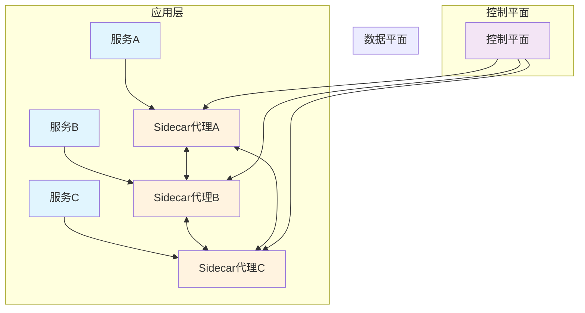

# 一、服务网格概述

## （一）什么是服务网格

服务网格（Service Mesh）是一个专用的基础设施层，用于处理微服务架构中服务间的通信。它通过在每个服务实例旁边部署一个轻量级的网络代理（通常称为Sidecar代理），来管理服务间的所有网络通信，而无需修改应用程序代码。

> **核心理念**：将服务间通信的复杂性从应用程序中抽离出来，交给专门的基础设施层来处理。

## （二）服务网格的核心特征

1. **透明性**：对应用程序完全透明，无需修改业务代码
2. **可观测性**：提供详细的服务间通信指标、日志和链路追踪
3. **安全性**：自动提供服务间的mTLS加密和身份验证
4. **流量管理**：支持负载均衡、故障注入、流量分割等高级功能
5. **策略执行**：统一的访问控制、限流和熔断策略

## （三）服务网格的架构模式



# 二、服务网格的核心组件

## （一）数据平面（Data Plane）

数据平面由部署在每个服务实例旁边的Sidecar代理组成，负责实际的网络通信处理。

### 主要功能

1. **服务发现**：自动发现和连接其他服务
2. **负载均衡**：在多个服务实例间分发请求
3. **健康检查**：监控服务实例的健康状态
4. **流量路由**：根据规则将请求路由到正确的服务
5. **安全通信**：提供mTLS加密和身份验证

### Envoy代理示例配置

```yaml
# Envoy代理配置示例
static_resources:
  listeners:
  - name: listener_0
    address:
      socket_address:
        protocol: TCP
        address: 0.0.0.0
        port_value: 10000
    filter_chains:
    - filters:
      - name: envoy.filters.network.http_connection_manager
        typed_config:
          "@type": type.googleapis.com/envoy.extensions.filters.network.http_connection_manager.v3.HttpConnectionManager
          stat_prefix: ingress_http
          access_log:
          - name: envoy.access_loggers.stdout
            typed_config:
              "@type": type.googleapis.com/envoy.extensions.access_loggers.stream.v3.StdoutAccessLog
          http_filters:
          - name: envoy.filters.http.router
            typed_config:
              "@type": type.googleapis.com/envoy.extensions.filters.http.router.v3.Router
          route_config:
            name: local_route
            virtual_hosts:
            - name: local_service
              domains: ["*"]
              routes:
              - match:
                  prefix: "/"
                route:
                  host_rewrite_literal: httpbin.org
                  cluster: service_httpbin
  clusters:
  - name: service_httpbin
    connect_timeout: 30s
    type: LOGICAL_DNS
    dns_lookup_family: V4_ONLY
    lb_policy: ROUND_ROBIN
    load_assignment:
      cluster_name: service_httpbin
      endpoints:
      - lb_endpoints:
        - endpoint:
            address:
              socket_address:
                address: httpbin.org
                port_value: 443
    transport_socket:
      name: envoy.transport_sockets.tls
      typed_config:
        "@type": type.googleapis.com/envoy.extensions.transport_sockets.tls.v3.UpstreamTlsContext
        sni: httpbin.org
```

## （二）控制平面（Control Plane）

控制平面负责管理和配置数据平面的代理，提供策略和配置的集中管理。

### 主要功能

1. **配置管理**：向Sidecar代理分发配置信息
2. **服务发现**：维护服务注册表和端点信息
3. **证书管理**：自动颁发和轮换TLS证书
4. **策略执行**：实施访问控制和流量策略
5. **遥测收集**：收集和聚合监控数据

# 三、主流服务网格解决方案

## （一）Istio

Istio是目前最流行的开源服务网格解决方案，由Google、IBM和Lyft联合开发。

### 核心特性

1. **流量管理**：支持A/B测试、金丝雀发布、故障注入
2. **安全性**：自动mTLS、基于身份的访问控制
3. **可观测性**：集成Prometheus、Jaeger、Grafana
4. **多平台支持**：Kubernetes、虚拟机、裸机

### Istio架构组件

```yaml
# Istio Gateway配置示例
apiVersion: networking.istio.io/v1alpha3
kind: Gateway
metadata:
  name: bookinfo-gateway
spec:
  selector:
    istio: ingressgateway # 使用istio默认的ingress gateway
  servers:
  - port:
      number: 80
      name: http
      protocol: HTTP
    hosts:
    - "*"
---
# VirtualService配置示例
apiVersion: networking.istio.io/v1alpha3
kind: VirtualService
metadata:
  name: bookinfo
spec:
  hosts:
  - "*"
  gateways:
  - bookinfo-gateway
  http:
  - match:
    - uri:
        exact: /productpage
    - uri:
        prefix: /static
    - uri:
        exact: /login
    - uri:
        exact: /logout
    - uri:
        prefix: /api/v1/products
    route:
    - destination:
        host: productpage
        port:
          number: 9080
```

## （二）Linkerd

Linkerd是一个轻量级、高性能的服务网格，专注于简单性和可靠性。

### 核心特性

1. **轻量级**：资源消耗低，启动速度快
2. **零配置**：开箱即用，自动发现服务
3. **渐进式部署**：支持逐步迁移现有应用
4. **内置可观测性**：实时流量监控和性能指标

### Linkerd部署示例

```shell
# 安装Linkerd CLI
curl -sL https://run.linkerd.io/install | sh

# 验证集群兼容性
linkerd check --pre

# 安装Linkerd控制平面
linkerd install | kubectl apply -f -

# 验证安装
linkerd check

# 为应用注入Sidecar代理
kubectl get -n emojivoto deploy -o yaml | linkerd inject - | kubectl apply -f -
```

## （三）Consul Connect

HashiCorp Consul Connect是基于Consul服务发现的服务网格解决方案。

### 核心特性

1. **原生集成**：与Consul服务发现深度集成
2. **多数据中心**：支持跨数据中心的服务网格
3. **灵活部署**：支持Kubernetes和传统基础设施
4. **证书管理**：内置CA和证书轮换

# 四、服务网格的应用场景

## （一）微服务治理

### 1. 服务发现与负载均衡

```yaml
# Istio DestinationRule配置负载均衡
apiVersion: networking.istio.io/v1alpha3
kind: DestinationRule
metadata:
  name: my-destination-rule
spec:
  host: my-svc
  trafficPolicy:
    loadBalancer:
      simple: LEAST_CONN  # 最少连接负载均衡算法
  subsets:
  - name: v1
    labels:
      version: v1
  - name: v2
    labels:
      version: v2
    trafficPolicy:
      loadBalancer:
        simple: ROUND_ROBIN  # 轮询负载均衡算法
```

### 2. 流量分割与金丝雀发布

```yaml
# 金丝雀发布配置：90%流量到v1，10%流量到v2
apiVersion: networking.istio.io/v1alpha3
kind: VirtualService
metadata:
  name: reviews
spec:
  hosts:
    - reviews
  http:
  - match:
    - headers:
        end-user:
          exact: jason
    route:
    - destination:
        host: reviews
        subset: v2
  - route:
    - destination:
        host: reviews
        subset: v1
      weight: 90  # 90%流量到v1版本
    - destination:
        host: reviews
        subset: v2
      weight: 10  # 10%流量到v2版本
```

## （二）安全性增强

### 1. 自动mTLS加密

```yaml
# 启用严格的mTLS模式
apiVersion: security.istio.io/v1beta1
kind: PeerAuthentication
metadata:
  name: default
  namespace: production
spec:
  mtls:
    mode: STRICT  # 强制要求mTLS
---
# 授权策略示例
apiVersion: security.istio.io/v1beta1
kind: AuthorizationPolicy
metadata:
  name: allow-read
  namespace: default
spec:
  selector:
    matchLabels:
      app: httpbin
  action: ALLOW
  rules:
  - from:
    - source:
        principals: ["cluster.local/ns/default/sa/sleep"]
  - to:
    - operation:
        methods: ["GET"]
```

### 2. 访问控制策略

```yaml
# 基于JWT的访问控制
apiVersion: security.istio.io/v1beta1
kind: RequestAuthentication
metadata:
  name: jwt-example
  namespace: foo
spec:
  selector:
    matchLabels:
      app: httpbin
  jwtRules:
  - issuer: "testing@secure.istio.io"
    jwksUri: "https://raw.githubusercontent.com/istio/istio/release-1.16/security/tools/jwt/samples/jwks.json"
```

## （三）可观测性

### 1. 分布式链路追踪

服务网格自动为所有服务间调用生成追踪数据，无需修改应用代码：

```yaml
# Jaeger追踪配置
apiVersion: v1
kind: ConfigMap
metadata:
  name: istio
  namespace: istio-system
data:
  mesh: |
    defaultConfig:
      tracing:
        sampling: 100.0  # 100%采样率（生产环境建议降低）
        zipkin:
          address: jaeger-collector.istio-system:9411
```

### 2. 指标收集与监控

```yaml
# Prometheus指标收集配置
apiVersion: telemetry.istio.io/v1alpha1
kind: Telemetry
metadata:
  name: metrics
spec:
  metrics:
  - providers:
    - name: prometheus
  - overrides:
    - match:
        metric: ALL_METRICS
      tagOverrides:
        destination_service_name:
          value: "{{.destination_service_name | default \"unknown\"}}"
```

# 五、服务网格的优势与挑战

## （一）主要优势

### 1. 业务逻辑与基础设施分离

**传统方式**：
```java
// 传统微服务代码中需要处理各种基础设施关注点
@RestController
public class OrderController {
    
    @Autowired
    private CircuitBreaker circuitBreaker;  // 熔断器
    
    @Autowired
    private LoadBalancer loadBalancer;      // 负载均衡器
    
    @Autowired
    private MetricsCollector metrics;       // 指标收集
    
    @GetMapping("/orders/{id}")
    public Order getOrder(@PathVariable String id) {
        // 手动处理熔断逻辑
        return circuitBreaker.execute(() -> {
            // 手动选择服务实例
            ServiceInstance instance = loadBalancer.choose("payment-service");
            
            // 手动收集指标
            Timer.Sample sample = Timer.start(metrics.registry());
            
            try {
                // 实际业务逻辑
                return paymentService.getPaymentInfo(id);
            } finally {
                sample.stop(Timer.builder("payment.request").register(metrics.registry()));
            }
        });
    }
}
```

**服务网格方式**：
```java
// 使用服务网格后，代码只关注业务逻辑
@RestController
public class OrderController {
    
    @Autowired
    private PaymentService paymentService;  // 简单的服务调用
    
    @GetMapping("/orders/{id}")
    public Order getOrder(@PathVariable String id) {
        // 纯粹的业务逻辑，基础设施关注点由服务网格处理
        return paymentService.getPaymentInfo(id);
    }
}
```

### 2. 统一的可观测性

服务网格为所有服务提供统一的监控、日志和追踪能力：

- **自动指标收集**：请求延迟、成功率、错误率等
- **分布式追踪**：完整的请求链路追踪
- **访问日志**：详细的服务间通信日志

### 3. 渐进式安全

```yaml
# 逐步启用mTLS的策略
apiVersion: security.istio.io/v1beta1
kind: PeerAuthentication
metadata:
  name: default
spec:
  mtls:
    mode: PERMISSIVE  # 允许明文和mTLS混合，便于渐进式迁移
```

## （二）面临的挑战

### 1. 复杂性增加

服务网格引入了新的组件和概念，增加了系统的整体复杂性：

- **学习成本**：团队需要学习新的工具和概念
- **调试难度**：网络问题的排查变得更加复杂
- **配置管理**：需要管理大量的网格配置

### 2. 性能开销

每个请求都需要经过Sidecar代理，会带来一定的性能开销：

```yaml
# 性能优化配置示例
apiVersion: v1
kind: ConfigMap
metadata:
  name: istio-proxy
data:
  # 调整代理的并发连接数
  concurrency: "2"
  # 优化内存使用
  proxyMemoryLimit: "128Mi"
  # 调整CPU限制
  proxyCPULimit: "100m"
```

### 3. 运维复杂度

```shell
# 服务网格的运维命令示例
# 检查网格状态
istioctl proxy-status

# 分析配置
istioctl analyze

# 查看代理配置
istioctl proxy-config cluster <pod-name> -n <namespace>

# 调试网络策略
istioctl authn tls-check <pod-name>.<namespace>
```

# 六、服务网格最佳实践

## （一）渐进式采用策略

### 1. 分阶段迁移

**第一阶段：边缘服务**
```shell
# 首先为边缘服务注入Sidecar
kubectl label namespace edge-services istio-injection=enabled
kubectl rollout restart deployment/api-gateway -n edge-services
```

**第二阶段：核心服务**
```shell
# 逐步迁移核心业务服务
kubectl label namespace core-services istio-injection=enabled
kubectl rollout restart deployment/user-service -n core-services
kubectl rollout restart deployment/order-service -n core-services
```

**第三阶段：数据服务**
```shell
# 最后迁移数据层服务
kubectl label namespace data-services istio-injection=enabled
kubectl rollout restart deployment/database-proxy -n data-services
```

### 2. 金丝雀部署网格组件

```yaml
# 使用金丝雀方式升级Istio
apiVersion: argoproj.io/v1alpha1
kind: Rollout
metadata:
  name: istio-proxy
spec:
  replicas: 10
  strategy:
    canary:
      steps:
      - setWeight: 10    # 10%流量到新版本
      - pause: {duration: 10m}
      - setWeight: 50    # 50%流量到新版本
      - pause: {duration: 10m}
      - setWeight: 100   # 100%流量到新版本
  selector:
    matchLabels:
      app: istio-proxy
  template:
    metadata:
      labels:
        app: istio-proxy
    spec:
      containers:
      - name: istio-proxy
        image: istio/proxyv2:1.16.0
```

## （二）监控与告警

### 1. 关键指标监控

```yaml
# Prometheus告警规则
groups:
- name: istio
  rules:
  - alert: IstioHighRequestLatency
    expr: histogram_quantile(0.99, sum(rate(istio_request_duration_milliseconds_bucket[5m])) by (le)) > 1000
    for: 5m
    labels:
      severity: warning
    annotations:
      summary: "Istio high request latency"
      description: "99th percentile latency is above 1000ms"
      
  - alert: IstioHighErrorRate
    expr: sum(rate(istio_requests_total{response_code!~"2.."}[5m])) / sum(rate(istio_requests_total[5m])) > 0.05
    for: 5m
    labels:
      severity: critical
    annotations:
      summary: "Istio high error rate"
      description: "Error rate is above 5%"
```

### 2. 链路追踪分析

```yaml
# Jaeger采样策略
apiVersion: v1
kind: ConfigMap
metadata:
  name: jaeger-sampling
data:
  sampling_strategies.json: |
    {
      "service_strategies": [
        {
          "service": "high-volume-service",
          "type": "probabilistic",
          "param": 0.1
        },
        {
          "service": "critical-service",
          "type": "probabilistic", 
          "param": 1.0
        }
      ],
      "default_strategy": {
        "type": "probabilistic",
        "param": 0.1
      }
    }
```

## （三）安全配置

### 1. 零信任网络

```yaml
# 默认拒绝所有流量
apiVersion: security.istio.io/v1beta1
kind: AuthorizationPolicy
metadata:
  name: deny-all
  namespace: production
spec:
  {}  # 空规则表示拒绝所有请求
---
# 明确允许特定服务间通信
apiVersion: security.istio.io/v1beta1
kind: AuthorizationPolicy
metadata:
  name: allow-frontend-to-backend
  namespace: production
spec:
  selector:
    matchLabels:
      app: backend
  action: ALLOW
  rules:
  - from:
    - source:
        principals: ["cluster.local/ns/production/sa/frontend"]
  - to:
    - operation:
        methods: ["GET", "POST"]
```

### 2. 证书管理

```yaml
# 自定义CA证书配置
apiVersion: v1
kind: Secret
metadata:
  name: cacerts
  namespace: istio-system
type: Opaque
data:
  root-cert.pem: LS0tLS1CRUdJTi...    # Base64编码的根证书
  cert-chain.pem: LS0tLS1CRUdJTi...   # Base64编码的证书链
  ca-cert.pem: LS0tLS1CRUdJTi...      # Base64编码的CA证书
  ca-key.pem: LS0tLS1CRUdJTi...       # Base64编码的CA私钥
```

# 七、服务网格的未来发展

## （一）技术发展趋势

### 1. WebAssembly扩展

```rust
// 使用Rust编写的Envoy WASM扩展示例
use proxy_wasm::traits::*;
use proxy_wasm::types::*;

#[no_mangle]
pub fn _start() {
    proxy_wasm::set_log_level(LogLevel::Trace);
    proxy_wasm::set_http_context(|_, _| -> Box<dyn HttpContext> {
        Box::new(CustomFilter)
    });
}

struct CustomFilter;

impl Context for CustomFilter {}

impl HttpContext for CustomFilter {
    fn on_http_request_headers(&mut self, _num_headers: usize) -> Action {
        // 自定义请求处理逻辑
        if let Some(user_agent) = self.get_http_request_header("user-agent") {
            if user_agent.contains("bot") {
                return Action::Pause;  // 暂停机器人请求
            }
        }
        Action::Continue
    }
}
```

### 2. 多集群网格

```yaml
# 跨集群服务发现配置
apiVersion: networking.istio.io/v1alpha3
kind: ServiceEntry
metadata:
  name: external-service
spec:
  hosts:
  - productcatalog.prod.svc.cluster.local
  location: MESH_EXTERNAL
  ports:
  - number: 80
    name: http
    protocol: HTTP
  resolution: DNS
  addresses:
  - 240.0.0.1  # VIP地址
  endpoints:
  - address: productcatalog.prod.svc.cluster.local
    network: network2  # 远程集群网络
    ports:
      http: 80
```

### 3. 边缘计算集成

服务网格正在扩展到边缘计算场景，支持边缘节点的服务治理：

- **边缘代理**：在边缘节点部署轻量级代理
- **分层治理**：中心云和边缘的分层服务治理
- **离线能力**：支持网络断连时的本地服务发现

## （二）生态系统发展

### 1. 标准化进程

- **SMI（Service Mesh Interface）**：服务网格的标准API
- **SPIFFE/SPIRE**：统一的身份认证标准
- **OpenTelemetry**：可观测性数据的标准格式

### 2. 云原生集成

```yaml
# 与Knative集成的服务网格配置
apiVersion: serving.knative.dev/v1
kind: Service
metadata:
  name: hello-world
  annotations:
    networking.knative.dev/ingress.class: "istio.ingress.networking.knative.dev"
spec:
  template:
    metadata:
      annotations:
        sidecar.istio.io/inject: "true"  # 自动注入Istio Sidecar
    spec:
      containers:
      - image: gcr.io/knative-samples/helloworld-go
        env:
        - name: TARGET
          value: "World"
```

# 八、总结

服务网格作为微服务架构的重要基础设施，为复杂的分布式系统提供了统一的服务间通信解决方案。它通过将网络功能从应用程序中抽离出来，让开发者能够专注于业务逻辑，同时获得强大的可观测性、安全性和流量管理能力。

## （一）关键收益

1. **开发效率提升**：开发者无需关心基础设施细节
2. **运维能力增强**：统一的监控、安全和流量管理
3. **系统可靠性**：自动的故障恢复和流量控制
4. **安全性保障**：零信任网络和自动加密

## （二）采用建议

1. **评估现状**：分析现有架构的复杂度和痛点
2. **选择合适的解决方案**：根据团队技术栈和需求选择
3. **渐进式迁移**：从边缘服务开始，逐步扩展到核心服务
4. **投资培训**：确保团队具备相应的技能和知识
5. **建立监控**：完善的可观测性是成功的关键

随着云原生技术的不断发展，服务网格将继续演进，为微服务架构提供更加强大和易用的基础设施支持。对于构建大规模分布式系统的团队来说，深入理解和合理应用服务网格技术将是提升系统架构能力的重要途径。

---

## 参考资料

1. [Istio官方文档](https://istio.io/latest/docs/)
2. [Linkerd官方文档](https://linkerd.io/docs/)
3. [Envoy Proxy官方文档](https://www.envoyproxy.io/docs/)
4. [Service Mesh Interface规范](https://smi-spec.io/)
5. [CNCF服务网格全景图](https://landscape.cncf.io/card-mode?category=service-mesh)
6. [Google Cloud Service Mesh概览](https://cloud.google.com/service-mesh/)
7. [《服务网格实战》- 李云](https://book.douban.com/subject/35051263/)
8. [《Istio权威指南》- 崔秀龙等](https://book.douban.com/subject/35051264/)
