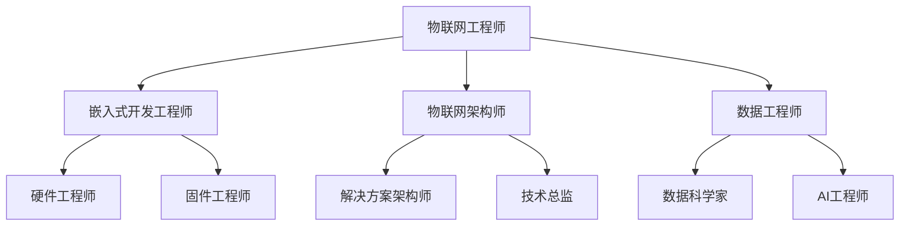

# 前言

物联网（Internet of Things, IoT）是新一代信息技术的重要组成部分，它通过各种信息传感设备，将现实世界中的物理实体连接到互联网，实现物与物、物与人之间的全面互联和信息交换。从智能家居到智慧城市，从工业自动化到精准农业，物联网正在深刻地改变着我们的生产和生活方式。本文将深入探讨物联网的技术体系、关键技术、主流平台、安全挑战、应用案例及未来发展趋势，为读者提供一份全面的技术参考。

# 一、物联网技术体系结构

物联网的技术体系通常分为四个层次，自下而上分别是感知层、网络层、平台层和应用层。每一层都包含不同的技术和功能，共同构成了完整的物联网系统。

## （一）感知层（Perception Layer）

感知层是物联网的“五官”，负责识别物体、采集信息。它通过各种传感器、RFID标签、摄像头等设备，获取物理世界的各种数据，如温度、湿度、位置、速度、图像等。

- **核心功能**：数据采集、信息识别、信号转换。
- **关键技术**：
  - **传感器技术**：温度、湿度、压力、光照、气体等传感器。
  - **RFID（射频识别）**：通过无线电信号识别特定目标并读写相关数据。
  - **NFC（近场通信）**：短距离高频无线通信技术。
  - **GPS（全球定位系统）**：获取地理位置信息。
  - **二维码/条形码**：光学识别技术。

## （二）网络层（Network Layer）

网络层是物联网的“神经系统”，负责将感知层采集到的数据安全、可靠地传输到平台层。它利用各种有线和无线通信技术，构建起物与物、物与网之间的连接通道。

- **核心功能**：数据传输、路由选择、网络管理。
- **关键技术**：
  - **短距离无线通信**：
    - `Wi-Fi`：高速率，适用于智能家居、办公环境。
    - `Bluetooth`（蓝牙）：低功耗，适用于可穿戴设备、短距离数据传输。
    - `Zigbee`：低功耗、低速率、自组网，适用于智能家居、工业控制。
  - **长距离无线通信（LPWAN）**：
    - `LoRaWAN`：远距离、低功耗，适用于智慧城市、环境监测。
    - `NB-IoT`（窄带物联网）：基于蜂窝网络的低功耗广域技术，适用于智能水表、智能停车。
    - `5G`：高速率、低延迟、大连接，适用于车联网、远程医疗。
  - **有线通信**：以太网、光纤等。

## （三）平台层（Platform Layer）

平台层是物联网的“大脑”，负责对海量数据进行处理、存储、分析和管理。物联网平台提供了设备管理、数据处理、应用开发等一系列基础服务，是连接底层硬件和上层应用的核心枢纽。

- **核心功能**：设备管理、数据存储、数据分析、应用支持。
- **关键技术**：
  - **云计算**：提供弹性的计算和存储资源。
  - **大数据技术**：如Hadoop、Spark，用于处理和分析海量数据。
  - **数据库技术**：如时序数据库（InfluxDB）、NoSQL数据库（MongoDB）。
  - **消息队列**：如MQTT、CoAP，用于设备与平台之间的通信。
  - **设备管理（Device Management）**：设备注册、状态监控、远程控制、固件升级（OTA）。

## （四）应用层（Application Layer）

应用层是物联网价值的最终体现，它将平台层处理后的数据与行业需求相结合，为用户提供各种智能化的应用和服务。

- **核心功能**：行业应用、数据可视化、用户交互。
- **关键技术**：
  - **API（应用程序接口）**：提供数据和服务的调用接口。
  - **移动应用/Web应用**：提供用户交互界面。
  - **数据可视化**：将数据以图表、仪表盘等形式展示。
  - **人工智能/机器学习**：对数据进行深度分析和预测，实现智能决策。

# 二、物联网通信技术详解

物联网设备之间的通信是整个系统的基础，不同的通信技术适用于不同的应用场景。

## （一）通信技术对比

| 技术 | 传输距离 | 功耗 | 数据速率 | 网络拓扑 | 适用场景 |
|------|----------|------|----------|----------|----------|
| **Wi-Fi** | 100m | 高 | 150Mbps+ | 星型 | 智能家居、办公环境 |
| **蓝牙** | 10m | 低 | 1-3Mbps | 点对点/星型 | 可穿戴设备、音频传输 |
| **Zigbee** | 100m | 极低 | 250kbps | 网状网络 | 智能家居、工业控制 |
| **LoRaWAN** | 15km | 极低 | 0.3-50kbps | 星型 | 环境监测、智慧农业 |
| **NB-IoT** | 35km | 极低 | 200kbps | 蜂窝网络 | 智能抄表、资产追踪 |
| **5G** | 1km | 中 | 1Gbps+ | 蜂窝网络 | 自动驾驶、AR/VR |

## （二）MQTT协议实现示例

MQTT是物联网中最常用的消息传输协议，以下是Python实现示例：

```python
import paho.mqtt.client as mqtt
import json
import time
from datetime import datetime

class IoTDevice:
    def __init__(self, device_id, broker_host, broker_port=1883):
        self.device_id = device_id
        self.client = mqtt.Client(device_id)
        self.broker_host = broker_host
        self.broker_port = broker_port
        
        # 设置回调函数
        self.client.on_connect = self.on_connect
        self.client.on_message = self.on_message
        self.client.on_disconnect = self.on_disconnect
    
    def on_connect(self, client, userdata, flags, rc):
        if rc == 0:
            print(f"设备 {self.device_id} 连接成功")
            # 订阅控制主题
            client.subscribe(f"devices/{self.device_id}/control")
        else:
            print(f"连接失败，错误码: {rc}")
    
    def on_message(self, client, userdata, msg):
        try:
            # 解析接收到的控制命令
            command = json.loads(msg.payload.decode())
            print(f"收到控制命令: {command}")
            
            # 处理不同类型的命令
            if command['action'] == 'get_status':
                self.send_status()
            elif command['action'] == 'set_config':
                self.update_config(command['config'])
                
        except Exception as e:
            print(f"处理消息时出错: {e}")
    
    def on_disconnect(self, client, userdata, rc):
        print(f"设备 {self.device_id} 断开连接")
    
    def connect(self):
        """连接到MQTT代理"""
        try:
            self.client.connect(self.broker_host, self.broker_port, 60)
            self.client.loop_start()
        except Exception as e:
            print(f"连接失败: {e}")
    
    def send_sensor_data(self, sensor_type, value, unit):
        """发送传感器数据"""
        data = {
            'device_id': self.device_id,
            'sensor_type': sensor_type,
            'value': value,
            'unit': unit,
            'timestamp': datetime.now().isoformat()
        }
        
        topic = f"sensors/{self.device_id}/{sensor_type}"
        self.client.publish(topic, json.dumps(data))
        print(f"发送数据: {data}")
    
    def send_status(self):
        """发送设备状态"""
        status = {
            'device_id': self.device_id,
            'status': 'online',
            'battery': 85,
            'signal_strength': -45,
            'timestamp': datetime.now().isoformat()
        }
        
        topic = f"devices/{self.device_id}/status"
        self.client.publish(topic, json.dumps(status))

# 使用示例
if __name__ == "__main__":
    # 创建设备实例
    device = IoTDevice("temp_sensor_001", "localhost")
    device.connect()
    
    # 模拟发送传感器数据
    for i in range(10):
        temperature = 20 + i * 0.5  # 模拟温度变化
        device.send_sensor_data("temperature", temperature, "°C")
        time.sleep(5)
```

## （三）CoAP协议实现示例

CoAP（Constrained Application Protocol）是专为资源受限设备设计的协议：

```python
from coapthon.client.helperclient import HelperClient
from coapthon.server.coap import CoAP
from coapthon.resources.resource import Resource
import json

class SensorResource(Resource):
    def __init__(self, name="SensorResource", coap_server=None):
        super(SensorResource, self).__init__(name, coap_server, visible=True)
        self.payload = json.dumps({
            "temperature": 25.5,
            "humidity": 60.2,
            "timestamp": "2024-01-01T12:00:00Z"
        })
        self.content_type = "application/json"
    
    def render_GET(self, request):
        """处理GET请求"""
        return self
    
    def render_POST(self, request):
        """处理POST请求"""
        try:
            data = json.loads(request.payload)
            print(f"接收到数据: {data}")
            # 更新传感器数据
            self.payload = request.payload
            return self
        except Exception as e:
            print(f"处理POST请求时出错: {e}")
            return self

# CoAP服务器
class IoTCoAPServer(CoAP):
    def __init__(self, host, port):
        CoAP.__init__(self, (host, port))
        self.add_resource('sensors/', SensorResource())

# 使用示例
if __name__ == "__main__":
    # 启动CoAP服务器
    server = IoTCoAPServer("localhost", 5683)
    server.listen(10)
```

# 三、主流物联网平台介绍

物联网平台是物联网生态系统的核心，它们提供了快速开发、部署和管理物联网应用所需的基础设施和工具。

## （一）商业平台对比

| 平台名称 | 提供商 | 主要特点 | 定价模式 | 适用规模 |
|---|---|---|---|---|
| **AWS IoT** | 亚马逊 | 功能全面，与AWS生态系统深度集成 | 按消息数量计费 | 大型企业 |
| **Azure IoT** | 微软 | 强大的数据分析和机器学习能力 | 按设备数量计费 | 中大型企业 |
| **Google Cloud IoT** | 谷歌 | 优秀的数据分析和AI能力 | 按数据传输量计费 | 中大型企业 |
| **阿里云物联网平台** | 阿里巴巴 | 国内生态完善，行业解决方案丰富 | 按消息数量计费 | 中小型企业 |
| **腾讯云IoT** | 腾讯 | 与微信生态结合，社交化物联网 | 按设备数量计费 | 中小型企业 |

## （二）开源平台对比

| 平台名称 | 开发语言 | 主要功能 | 部署复杂度 | 社区活跃度 |
|---|---|---|---|---|
| **ThingsBoard** | Java | 设备管理、数据可视化、规则引擎 | 中等 | 高 |
| **EMQ X** | Erlang | 高性能MQTT消息服务器 | 低 | 高 |
| **Eclipse IoT** | Java | 完整的IoT解决方案栈 | 高 | 中 |
| **Node-RED** | JavaScript | 可视化编程工具 | 低 | 高 |
| **Home Assistant** | Python | 智能家居自动化平台 | 低 | 高 |

# 四、物联网安全挑战与对策

随着物联网设备的普及，安全问题日益突出。一个设备的安全漏洞可能影响整个系统的安全。

## （一）主要安全挑战

1.  **设备安全**：设备易受物理攻击，固件易被篡改。
2.  **通信安全**：数据在传输过程中可能被窃听、篡改或劫持。
3.  **平台安全**：云平台可能遭受DDoS攻击、数据泄露等威胁。
4.  **隐私保护**：大量敏感个人数据被采集，存在泄露风险。

## （二）安全对策

1.  **设备层安全**：
    - **安全启动（Secure Boot）**：确保设备启动时加载的固件是可信的。
    - **硬件加密**：使用安全芯片（如TPM/SE）存储密钥和敏感数据。
    - **固件签名与验证**：确保OTA升级的固件未被篡改。

2.  **网络层安全**：
    - **传输加密**：使用TLS/DTLS等协议对传输数据进行加密。
    - **身份认证**：使用证书、Token等方式对设备和平台进行双向认证。
    - **访问控制**：建立防火墙和入侵检测系统（IDS）。

3.  **平台与应用层安全**：
    - **数据加密存储**：对存储在云端的敏感数据进行加密。
    - **最小权限原则**：为用户和应用分配最小必要权限。
    - **安全审计与监控**：定期进行安全审计和漏洞扫描。

## （三）安全实现代码示例

### TLS加密通信实现

```python
import ssl
import socket
import json
from cryptography.fernet import Fernet
from cryptography.hazmat.primitives import hashes
from cryptography.hazmat.primitives.kdf.pbkdf2 import PBKDF2HMAC
import base64
import os

class SecureIoTClient:
    def __init__(self, server_host, server_port, device_id):
        self.server_host = server_host
        self.server_port = server_port
        self.device_id = device_id
        self.encryption_key = self._generate_encryption_key()
    
    def _generate_encryption_key(self):
        """生成加密密钥"""
        password = f"{self.device_id}_secret".encode()
        salt = os.urandom(16)
        kdf = PBKDF2HMAC(
            algorithm=hashes.SHA256(),
            length=32,
            salt=salt,
            iterations=100000,
        )
        key = base64.urlsafe_b64encode(kdf.derive(password))
        return Fernet(key)
    
    def encrypt_data(self, data):
        """加密数据"""
        json_data = json.dumps(data).encode()
        encrypted_data = self.encryption_key.encrypt(json_data)
        return encrypted_data
    
    def secure_connect(self):
        """建立安全连接"""
        context = ssl.create_default_context(ssl.Purpose.SERVER_AUTH)
        context.check_hostname = False
        context.verify_mode = ssl.CERT_NONE  # 生产环境应验证证书
        
        sock = socket.socket(socket.AF_INET, socket.SOCK_STREAM)
        secure_sock = context.wrap_socket(sock, server_hostname=self.server_host)
        
        try:
            secure_sock.connect((self.server_host, self.server_port))
            print(f"设备 {self.device_id} 安全连接建立成功")
            return secure_sock
        except Exception as e:
            print(f"安全连接失败: {e}")
            return None
```

### 设备认证实现

```python
import hashlib
import hmac
import jwt
from datetime import datetime, timedelta

class DeviceAuthenticator:
    def __init__(self, secret_key):
        self.secret_key = secret_key
    
    def generate_device_token(self, device_id, expires_in_hours=24):
        """生成设备JWT令牌"""
        payload = {
            'device_id': device_id,
            'iat': datetime.utcnow(),
            'exp': datetime.utcnow() + timedelta(hours=expires_in_hours)
        }
        
        token = jwt.encode(payload, self.secret_key, algorithm='HS256')
        return token
    
    def verify_device_token(self, token):
        """验证设备令牌"""
        try:
            payload = jwt.decode(token, self.secret_key, algorithms=['HS256'])
            return payload['device_id']
        except jwt.ExpiredSignatureError:
            print("令牌已过期")
            return None
        except jwt.InvalidTokenError:
            print("无效令牌")
            return None
```

# 五、物联网应用案例详解

## （一）智能家居系统

### 技术架构
- **设备层**：智能开关、传感器、摄像头、智能音箱
- **网络层**：Wi-Fi、Zigbee、蓝牙Mesh
- **平台层**：Home Assistant、小米米家、华为HiLink
- **应用层**：手机App、语音控制、自动化场景

### 实现示例
```python
class SmartHomeController:
    def __init__(self):
        self.devices = {}
        self.scenes = {}
    
    def add_device(self, device_id, device_type, capabilities):
        """添加智能设备"""
        self.devices[device_id] = {
            'type': device_type,
            'capabilities': capabilities,
            'status': 'offline'
        }
    
    def create_scene(self, scene_name, actions):
        """创建场景"""
        self.scenes[scene_name] = actions
    
    def execute_scene(self, scene_name):
        """执行场景"""
        if scene_name in self.scenes:
            for action in self.scenes[scene_name]:
                device_id = action['device_id']
                command = action['command']
                self.control_device(device_id, command)
    
    def control_device(self, device_id, command):
        """控制设备"""
        if device_id in self.devices:
            print(f"控制设备 {device_id}: {command}")
            # 实际控制逻辑

# 使用示例
home = SmartHomeController()
home.add_device("light_001", "smart_light", ["on_off", "brightness", "color"])
home.create_scene("回家模式", [
    {"device_id": "light_001", "command": {"action": "turn_on", "brightness": 80}},
    {"device_id": "ac_001", "command": {"action": "turn_on", "temperature": 26}}
])
home.execute_scene("回家模式")
```

### 成本分析
| 组件 | 成本范围 | 说明 |
|------|----------|------|
| 智能开关 | 50-200元 | 支持Wi-Fi/Zigbee |
| 传感器 | 30-100元 | 温湿度、人体感应等 |
| 智能音箱 | 200-800元 | 语音控制中枢 |
| 网关设备 | 100-300元 | Zigbee/蓝牙网关 |
| **总投入** | **2000-5000元** | **基础智能家居系统** |

## （二）智慧城市解决方案

### 智能停车系统
```python
import json
from datetime import datetime

class SmartParkingSystem:
    def __init__(self):
        self.parking_spots = {}
        self.reservations = {}
    
    def update_spot_status(self, spot_id, is_occupied, sensor_data):
        """更新车位状态"""
        self.parking_spots[spot_id] = {
            'occupied': is_occupied,
            'last_update': datetime.now().isoformat(),
            'sensor_data': sensor_data
        }
        
        # 发送状态更新到云平台
        self.send_to_cloud({
            'spot_id': spot_id,
            'status': 'occupied' if is_occupied else 'available',
            'timestamp': datetime.now().isoformat()
        })
    
    def find_available_spots(self, area):
        """查找可用车位"""
        available_spots = []
        for spot_id, info in self.parking_spots.items():
            if not info['occupied'] and spot_id.startswith(area):
                available_spots.append(spot_id)
        return available_spots
    
    def reserve_spot(self, spot_id, user_id, duration_minutes):
        """预约车位"""
        if spot_id in self.parking_spots and not self.parking_spots[spot_id]['occupied']:
            self.reservations[spot_id] = {
                'user_id': user_id,
                'reserved_at': datetime.now().isoformat(),
                'duration': duration_minutes
            }
            return True
        return False
```

### ROI分析
- **投资成本**：地磁传感器(200元/个) + 网关(1000元/个) + 平台开发(10万元)
- **运营收益**：停车费提升20% + 管理成本降低30%
- **回收周期**：12-18个月

## （三）工业物联网（IIoT）

### 预测性维护系统
```python
import numpy as np
from sklearn.ensemble import IsolationForest
from datetime import datetime, timedelta

class PredictiveMaintenanceSystem:
    def __init__(self):
        self.equipment_data = {}
        self.anomaly_detector = IsolationForest(contamination=0.1)
        self.maintenance_schedule = {}
    
    def collect_sensor_data(self, equipment_id, sensor_readings):
        """收集传感器数据"""
        if equipment_id not in self.equipment_data:
            self.equipment_data[equipment_id] = []
        
        data_point = {
            'timestamp': datetime.now().isoformat(),
            'temperature': sensor_readings.get('temperature'),
            'vibration': sensor_readings.get('vibration'),
            'pressure': sensor_readings.get('pressure'),
            'current': sensor_readings.get('current')
        }
        
        self.equipment_data[equipment_id].append(data_point)
        
        # 异常检测
        if len(self.equipment_data[equipment_id]) > 100:
            self.detect_anomalies(equipment_id)
    
    def detect_anomalies(self, equipment_id):
        """异常检测"""
        data = self.equipment_data[equipment_id][-100:]  # 最近100个数据点
        features = np.array([[d['temperature'], d['vibration'], d['pressure'], d['current']] for d in data])
        
        anomalies = self.anomaly_detector.fit_predict(features)
        
        if anomalies[-1] == -1:  # 最新数据点是异常
            self.schedule_maintenance(equipment_id, 'anomaly_detected')
    
    def schedule_maintenance(self, equipment_id, reason):
        """安排维护"""
        maintenance_date = datetime.now() + timedelta(days=7)
        self.maintenance_schedule[equipment_id] = {
            'scheduled_date': maintenance_date.isoformat(),
            'reason': reason,
            'priority': 'high' if reason == 'anomaly_detected' else 'normal'
        }
        
        print(f"设备 {equipment_id} 已安排维护，原因：{reason}")
```

### 效益分析
- **设备停机时间减少**：60-80%
- **维护成本降低**：25-35%
- **设备寿命延长**：15-25%
- **生产效率提升**：10-20%

## （四）智慧农业精准管理

### 智能灌溉系统
```python
class SmartIrrigationSystem:
    def __init__(self):
        self.soil_sensors = {}
        self.weather_data = {}
        self.irrigation_zones = {}
    
    def update_soil_data(self, zone_id, moisture, temperature, ph, nutrients):
        """更新土壤数据"""
        self.soil_sensors[zone_id] = {
            'moisture': moisture,
            'temperature': temperature,
            'ph': ph,
            'nutrients': nutrients,
            'timestamp': datetime.now().isoformat()
        }
        
        # 自动决策是否需要灌溉
        self.auto_irrigation_decision(zone_id)
    
    def auto_irrigation_decision(self, zone_id):
        """自动灌溉决策"""
        soil_data = self.soil_sensors[zone_id]
        
        # 决策逻辑
        if soil_data['moisture'] < 30:  # 土壤湿度低于30%
            duration = self.calculate_irrigation_duration(zone_id)
            self.start_irrigation(zone_id, duration)
    
    def calculate_irrigation_duration(self, zone_id):
        """计算灌溉时长"""
        soil_data = self.soil_sensors[zone_id]
        target_moisture = 60  # 目标湿度60%
        current_moisture = soil_data['moisture']
        
        # 简化计算：每分钟提升2%湿度
        duration = (target_moisture - current_moisture) / 2
        return max(5, min(30, duration))  # 限制在5-30分钟
    
    def start_irrigation(self, zone_id, duration):
        """开始灌溉"""
        print(f"区域 {zone_id} 开始灌溉，持续时间：{duration} 分钟")
        # 控制灌溉设备
```

### 投资回报
- **节水效果**：30-50%
- **增产效果**：15-25%
- **人工成本节省**：40-60%
- **投资回收期**：2-3年

# 六、物联网故障排查与性能优化

## （一）常见故障排查指南

### 1. 连接问题排查

```python
import ping3
import socket
import ssl
from datetime import datetime

class IoTDiagnostics:
    def __init__(self):
        self.test_results = []
    
    def network_connectivity_test(self, host, port=80):
        """网络连接测试"""
        try:
            # Ping测试
            ping_result = ping3.ping(host, timeout=5)
            
            # 端口连接测试
            sock = socket.socket(socket.AF_INET, socket.SOCK_STREAM)
            sock.settimeout(5)
            port_result = sock.connect_ex((host, port))
            sock.close()
            
            result = {
                'timestamp': datetime.now().isoformat(),
                'host': host,
                'ping_success': ping_result is not None,
                'ping_time': ping_result if ping_result else 'timeout',
                'port_accessible': port_result == 0
            }
            
            self.test_results.append(result)
            return result
            
        except Exception as e:
            return {'error': str(e)}
    
    def mqtt_connection_test(self, broker_host, broker_port, username=None, password=None):
        """MQTT连接测试"""
        import paho.mqtt.client as mqtt
        
        test_result = {'success': False, 'error': None}
        
        def on_connect(client, userdata, flags, rc):
            if rc == 0:
                test_result['success'] = True
                client.disconnect()
            else:
                test_result['error'] = f"连接失败，错误码: {rc}"
        
        client = mqtt.Client()
        client.on_connect = on_connect
        
        if username and password:
            client.username_pw_set(username, password)
        
        try:
            client.connect(broker_host, broker_port, 60)
            client.loop_start()
            time.sleep(3)
            client.loop_stop()
        except Exception as e:
            test_result['error'] = str(e)
        
        return test_result
    
    def device_health_check(self, device_id, expected_metrics):
        """设备健康检查"""
        health_status = {
            'device_id': device_id,
            'timestamp': datetime.now().isoformat(),
            'status': 'healthy',
            'issues': []
        }
        
        # 检查各项指标
        for metric, expected_range in expected_metrics.items():
            # 这里应该从实际设备获取数据
            actual_value = self.get_device_metric(device_id, metric)
            
            if actual_value is None:
                health_status['issues'].append(f"{metric}: 无法获取数据")
                health_status['status'] = 'warning'
            elif not (expected_range['min'] <= actual_value <= expected_range['max']):
                health_status['issues'].append(f"{metric}: {actual_value} 超出正常范围 [{expected_range['min']}, {expected_range['max']}]")
                health_status['status'] = 'critical'
        
        return health_status
    
    def get_device_metric(self, device_id, metric):
        """获取设备指标（模拟）"""
        # 实际实现中应该从设备或数据库获取真实数据
        import random
        metrics_simulation = {
            'battery': random.randint(10, 100),
            'temperature': random.uniform(20, 35),
            'signal_strength': random.randint(-80, -30)
        }
        return metrics_simulation.get(metric)
```

### 2. 性能问题诊断

```python
class PerformanceMonitor:
    def __init__(self):
        self.metrics_history = []
    
    def measure_latency(self, operation_func, *args, **kwargs):
        """测量操作延迟"""
        import time
        
        start_time = time.time()
        try:
            result = operation_func(*args, **kwargs)
            end_time = time.time()
            latency = (end_time - start_time) * 1000  # 转换为毫秒
            
            return {
                'success': True,
                'latency_ms': latency,
                'result': result
            }
        except Exception as e:
            end_time = time.time()
            return {
                'success': False,
                'latency_ms': (end_time - start_time) * 1000,
                'error': str(e)
            }
    
    def analyze_throughput(self, data_points, time_window_seconds):
        """分析吞吐量"""
        if not data_points:
            return {'throughput': 0, 'avg_size': 0}
        
        total_size = sum(point.get('size', 0) for point in data_points)
        throughput = total_size / time_window_seconds  # bytes/second
        avg_size = total_size / len(data_points)
        
        return {
            'throughput_bps': throughput,
            'avg_message_size': avg_size,
            'message_count': len(data_points)
        }
```

## （二）性能优化策略

### 1. 数据传输优化

```python
import json
import gzip
import base64
from datetime import datetime

class DataOptimizer:
    def __init__(self):
        self.compression_enabled = True
        self.batch_size = 10
        self.batch_buffer = []
    
    def compress_data(self, data):
        """数据压缩"""
        if not self.compression_enabled:
            return data
        
        json_str = json.dumps(data)
        compressed = gzip.compress(json_str.encode('utf-8'))
        return base64.b64encode(compressed).decode('utf-8')
    
    def batch_data(self, data_point):
        """数据批处理"""
        self.batch_buffer.append(data_point)
        
        if len(self.batch_buffer) >= self.batch_size:
            batch = self.batch_buffer.copy()
            self.batch_buffer.clear()
            return batch
        
        return None
    
    def optimize_message_format(self, sensor_data):
        """优化消息格式"""
        # 使用简短的字段名
        optimized = {
            'id': sensor_data['device_id'],
            't': int(datetime.fromisoformat(sensor_data['timestamp']).timestamp()),
            'v': sensor_data['value'],
            'u': sensor_data['unit']
        }
        
        return optimized
```

### 2. 设备端优化

```python
class DeviceOptimizer:
    def __init__(self):
        self.sleep_mode_enabled = True
        self.adaptive_interval = True
        self.base_interval = 60  # 基础采集间隔（秒）
    
    def calculate_optimal_interval(self, data_variance, battery_level):
        """计算最优采集间隔"""
        if not self.adaptive_interval:
            return self.base_interval
        
        # 根据数据变化率调整间隔
        if data_variance < 0.1:  # 数据变化小
            interval_factor = 2.0
        elif data_variance > 0.5:  # 数据变化大
            interval_factor = 0.5
        else:
            interval_factor = 1.0
        
        # 根据电池电量调整
        if battery_level < 20:
            interval_factor *= 3.0  # 低电量时延长间隔
        elif battery_level < 50:
            interval_factor *= 1.5
        
        optimal_interval = self.base_interval * interval_factor
        return max(30, min(300, optimal_interval))  # 限制在30秒到5分钟之间
    
    def power_management(self, next_wake_time):
        """电源管理"""
        if self.sleep_mode_enabled:
            print(f"设备进入睡眠模式，下次唤醒时间: {next_wake_time}")
            # 实际实现中会调用硬件睡眠功能
```

## （三）监控与告警系统

```python
class IoTMonitoringSystem:
    def __init__(self):
        self.alert_rules = []
        self.alert_history = []
    
    def add_alert_rule(self, rule_name, condition, severity='medium'):
        """添加告警规则"""
        rule = {
            'name': rule_name,
            'condition': condition,
            'severity': severity,
            'enabled': True
        }
        self.alert_rules.append(rule)
    
    def check_alerts(self, device_data):
        """检查告警条件"""
        triggered_alerts = []
        
        for rule in self.alert_rules:
            if not rule['enabled']:
                continue
            
            try:
                if self.evaluate_condition(rule['condition'], device_data):
                    alert = {
                        'rule_name': rule['name'],
                        'severity': rule['severity'],
                        'timestamp': datetime.now().isoformat(),
                        'device_data': device_data
                    }
                    triggered_alerts.append(alert)
                    self.alert_history.append(alert)
            except Exception as e:
                print(f"告警规则 {rule['name']} 执行失败: {e}")
        
        return triggered_alerts
    
    def evaluate_condition(self, condition, data):
        """评估告警条件"""
        # 简化的条件评估，实际应用中可以使用更复杂的规则引擎
        if condition['type'] == 'threshold':
            value = data.get(condition['field'])
            if value is None:
                return False
            
            if condition['operator'] == '>':
                return value > condition['value']
            elif condition['operator'] == '<':
                return value < condition['value']
            elif condition['operator'] == '==':
                return value == condition['value']
        
        return False

# 使用示例
monitor = IoTMonitoringSystem()
monitor.add_alert_rule(
    "高温告警",
    {'type': 'threshold', 'field': 'temperature', 'operator': '>', 'value': 35},
    'high'
)
monitor.add_alert_rule(
    "低电量告警",
    {'type': 'threshold', 'field': 'battery', 'operator': '<', 'value': 20},
    'medium'
)
```

# 七、未来发展趋势

## （一）物联网与人工智能（AIoT）

AI的加入让物联网从"万物互联"走向"万物智联"。AI算法可以对物联网数据进行深度分析，实现更高级的自动化和智能化决策。

### 技术融合趋势
- **边缘AI**：在设备端部署轻量级AI模型
- **联邦学习**：多设备协同训练，保护数据隐私
- **自适应系统**：根据环境变化自动调整行为

## （二）边缘计算（Edge Computing）

将计算能力下沉到网络边缘，在靠近数据源的地方进行数据处理，可以有效降低网络延迟、减轻云中心负担。

### 关键优势
- **低延迟**：毫秒级响应时间
- **带宽节省**：减少数据传输量
- **隐私保护**：敏感数据本地处理
- **可靠性**：离线也能正常工作

## （三）数字孪生（Digital Twin）

通过物联网技术在虚拟空间中创建物理实体的数字镜像，实现对物理世界的实时监控、模拟和优化。

### 应用场景
- **智能制造**：生产线优化和预测性维护
- **智慧城市**：城市规划和交通优化
- **建筑管理**：能耗优化和设备维护

## （四）无源物联网（Passive IoT）

利用环境能量（如光能、射频能）为设备供电，摆脱电池束缚，实现设备的长期免维护运行。

### 技术突破
- **能量收集技术**：提高能量转换效率
- **超低功耗设计**：微瓦级功耗芯片
- **无线充电**：远距离无线能量传输

# 八、学习资源与工具推荐

## （一）开发工具与平台

### 1. 物联网开发板

| 开发板 | 特点 | 适用场景 | 价格范围 |
|--------|------|----------|----------|
| Arduino Uno | 易学易用，生态丰富 | 原型开发，教学 | ¥50-100 |
| Raspberry Pi 4 | 完整Linux系统，性能强 | 边缘计算，复杂应用 | ¥300-500 |
| ESP32 | WiFi+蓝牙，低功耗 | 无线传感器，智能家居 | ¥20-50 |
| STM32 | 工业级，实时性好 | 工业控制，汽车电子 | ¥30-200 |
| NodeMCU | 集成WiFi，易编程 | 快速原型，学习项目 | ¥15-30 |

### 2. 开发环境配置

```python
# 物联网开发环境安装脚本
import subprocess
import sys

def install_iot_tools():
    """安装物联网开发工具"""
    tools = [
        'paho-mqtt',      # MQTT客户端
        'aiocoap',        # CoAP协议
        'bleak',          # 蓝牙低功耗
        'pyserial',       # 串口通信
        'influxdb-client', # 时序数据库
        'grafana-api',    # 数据可视化
        'requests',       # HTTP请求
        'websockets',     # WebSocket通信
        'cryptography',   # 加密库
        'numpy',          # 数据处理
        'pandas',         # 数据分析
        'matplotlib'      # 数据可视化
    ]
    
    for tool in tools:
        try:
            subprocess.check_call([sys.executable, '-m', 'pip', 'install', tool])
            print(f"✓ {tool} 安装成功")
        except subprocess.CalledProcessError:
            print(f"✗ {tool} 安装失败")

if __name__ == "__main__":
    install_iot_tools()
```

### 3. 仿真与测试工具

```python
class IoTSimulator:
    """物联网设备仿真器"""
    
    def __init__(self):
        self.devices = {}
        self.running = False
    
    def add_virtual_device(self, device_id, device_type, config):
        """添加虚拟设备"""
        device = {
            'id': device_id,
            'type': device_type,
            'config': config,
            'status': 'offline',
            'last_data': None
        }
        self.devices[device_id] = device
        return device
    
    def simulate_sensor_data(self, device_id):
        """模拟传感器数据"""
        import random
        from datetime import datetime
        
        if device_id not in self.devices:
            return None
        
        device = self.devices[device_id]
        device_type = device['type']
        
        # 根据设备类型生成不同的模拟数据
        if device_type == 'temperature_sensor':
            data = {
                'device_id': device_id,
                'timestamp': datetime.now().isoformat(),
                'temperature': round(random.uniform(18, 35), 2),
                'humidity': round(random.uniform(30, 80), 2)
            }
        elif device_type == 'motion_sensor':
            data = {
                'device_id': device_id,
                'timestamp': datetime.now().isoformat(),
                'motion_detected': random.choice([True, False]),
                'battery_level': random.randint(20, 100)
            }
        elif device_type == 'smart_meter':
            data = {
                'device_id': device_id,
                'timestamp': datetime.now().isoformat(),
                'power_consumption': round(random.uniform(0.5, 5.0), 3),
                'voltage': round(random.uniform(220, 240), 1)
            }
        else:
            data = {
                'device_id': device_id,
                'timestamp': datetime.now().isoformat(),
                'value': random.uniform(0, 100)
            }
        
        device['last_data'] = data
        return data
    
    def start_simulation(self, interval=5):
        """启动仿真"""
        import threading
        import time
        
        def simulation_loop():
            while self.running:
                for device_id in self.devices:
                    data = self.simulate_sensor_data(device_id)
                    print(f"设备 {device_id} 数据: {data}")
                time.sleep(interval)
        
        self.running = True
        thread = threading.Thread(target=simulation_loop)
        thread.daemon = True
        thread.start()
        print("物联网仿真器已启动")
    
    def stop_simulation(self):
        """停止仿真"""
        self.running = False
        print("物联网仿真器已停止")

# 使用示例
simulator = IoTSimulator()
simulator.add_virtual_device('temp_001', 'temperature_sensor', {})
simulator.add_virtual_device('motion_001', 'motion_sensor', {})
simulator.add_virtual_device('meter_001', 'smart_meter', {})
```

## （二）学习路径建议

### 1. 初级阶段（1-3个月）

**学习目标：** 掌握物联网基础概念和简单应用

**学习内容：**
- 物联网基础概念和架构
- Arduino/ESP32基础编程
- 传感器数据采集
- 简单的无线通信（WiFi、蓝牙）
- MQTT协议基础

**实践项目：**
```python
# 项目1：温湿度监控系统
class TemperatureMonitor:
    def __init__(self, mqtt_broker):
        self.mqtt_broker = mqtt_broker
        self.client = mqtt.Client()
    
    def read_sensor(self):
        # 模拟读取DHT22传感器
        import random
        temperature = round(random.uniform(20, 30), 1)
        humidity = round(random.uniform(40, 70), 1)
        return temperature, humidity
    
    def publish_data(self):
        temp, hum = self.read_sensor()
        data = {
            'temperature': temp,
            'humidity': hum,
            'timestamp': datetime.now().isoformat()
        }
        
        self.client.publish('sensors/temperature', json.dumps(data))
        print(f"发布数据: {data}")
```

### 2. 中级阶段（3-6个月）

**学习目标：** 构建完整的物联网解决方案

**学习内容：**
- 云平台集成（AWS IoT、Azure IoT）
- 数据存储和分析
- 设备管理和OTA更新
- 安全认证和加密
- 边缘计算基础

**实践项目：**
```python
# 项目2：智能家居控制系统
class SmartHomeController:
    def __init__(self):
        self.devices = {}
        self.rules = []
        self.mqtt_client = mqtt.Client()
    
    def add_device(self, device_id, device_type, capabilities):
        self.devices[device_id] = {
            'type': device_type,
            'capabilities': capabilities,
            'status': 'offline'
        }
    
    def add_automation_rule(self, trigger, action):
        rule = {
            'trigger': trigger,
            'action': action,
            'enabled': True
        }
        self.rules.append(rule)
    
    def process_sensor_data(self, device_id, data):
        # 处理传感器数据并执行自动化规则
        for rule in self.rules:
            if rule['enabled'] and self.evaluate_trigger(rule['trigger'], data):
                self.execute_action(rule['action'])
    
    def evaluate_trigger(self, trigger, data):
        # 评估触发条件
        if trigger['type'] == 'threshold':
            return data.get(trigger['field']) > trigger['value']
        return False
    
    def execute_action(self, action):
        # 执行动作
        print(f"执行动作: {action}")
```

### 3. 高级阶段（6个月以上）

**学习目标：** 设计和优化大规模物联网系统

**学习内容：**
- 大规模设备管理
- 实时数据处理和流计算
- 机器学习和AI集成
- 系统性能优化
- 工业物联网应用

## （三）认证与职业发展

### 1. 相关认证

| 认证名称 | 颁发机构 | 难度等级 | 有效期 |
|----------|----------|----------|--------|
| AWS Certified IoT Core | Amazon | 中级 | 3年 |
| Microsoft Azure IoT Developer | Microsoft | 中级 | 2年 |
| Google Cloud IoT Core | Google | 中级 | 2年 |
| Cisco IoT Fundamentals | Cisco | 初级 | 3年 |
| CompTIA IoT+ | CompTIA | 中级 | 3年 |

### 2. 职业发展路径



## （四）开源项目和社区

### 1. 推荐开源项目

- **ThingsBoard**：开源物联网平台
- **Eclipse IoT**：物联网开源生态
- **Home Assistant**：开源智能家居平台
- **OpenHAB**：家庭自动化平台
- **Node-RED**：可视化编程工具
- **Mosquitto**：轻量级MQTT代理

### 2. 学习社区

- **物联网技术圈**：国内物联网技术交流
- **IoT Central**：微软物联网社区
- **AWS IoT Community**：亚马逊物联网社区
- **Arduino Community**：Arduino开发者社区
- **Raspberry Pi Foundation**：树莓派官方社区

# 九、总结

物联网作为数字化转型的重要驱动力，正在深刻改变着我们的生活和工作方式。从技术架构到实际应用，从安全挑战到未来趋势，物联网展现出巨大的发展潜力和广阔的应用前景。

## 核心要点回顾

1. **技术体系完整**：从感知层到应用层的四层架构
2. **通信技术多样**：MQTT、CoAP、LoRaWAN等协议各有优势
3. **安全至关重要**：设备认证、数据加密、网络安全缺一不可
4. **应用场景广泛**：智能家居、智慧城市、工业物联网等领域
5. **发展趋势明确**：AIoT、边缘计算、数字孪生是未来方向

## 学习建议

- **理论与实践结合**：在掌握理论知识的同时，多动手实践
- **关注技术发展**：物联网技术更新快，需要持续学习
- **培养系统思维**：物联网是复杂系统，需要全局视角
- **重视安全意识**：安全是物联网应用的基础
- **积极参与社区**：通过开源项目和技术社区提升技能

随着5G、AI、边缘计算等技术的不断成熟，物联网将迎来更加快速的发展期。对于技术从业者而言，深入理解物联网的核心技术和应用模式，掌握相关的开发技能，将是把握未来机遇的关键。

---

**参考资料：**
- [物联网技术白皮书](https://www.miit.gov.cn/)
- [MQTT协议规范](https://mqtt.org/)
- [CoAP协议文档](https://coap.technology/)
- [AWS IoT开发指南](https://docs.aws.amazon.com/iot/)
- [Azure IoT文档](https://docs.microsoft.com/azure/iot/)
- [Google Cloud IoT文档](https://cloud.google.com/iot/)
- [ThingsBoard文档](https://thingsboard.io/docs/)
- [Eclipse IoT项目](https://iot.eclipse.org/)

> 本文档将持续更新，欢迎关注最新技术动态和应用案例。如有问题或建议，请通过GitHub Issues或邮件联系。