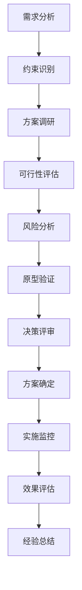
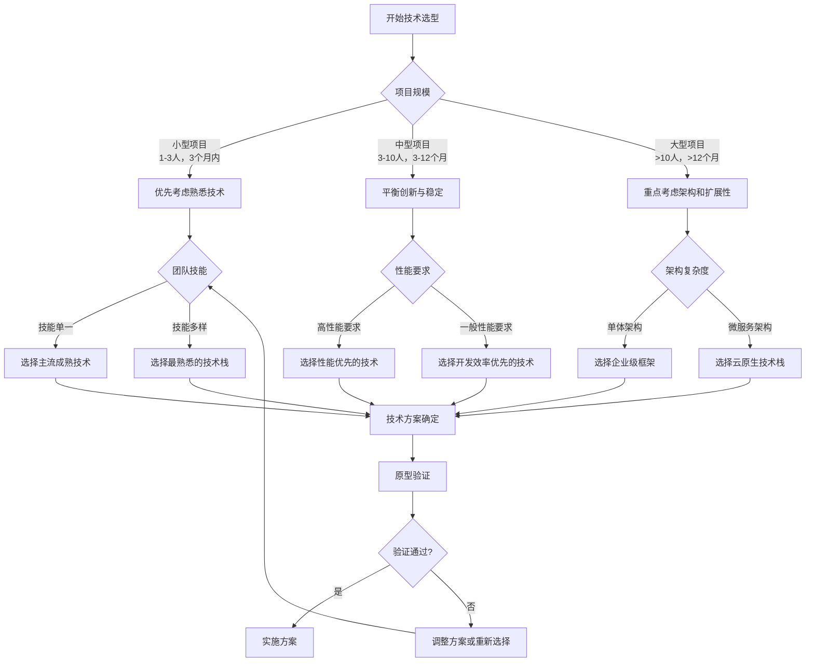

# 前言

在软件开发的世界里，技术选型是一个既关键又复杂的决策过程。从编程语言的选择到框架的确定，从数据库的选型到部署方案的制定，每一个技术决策都可能深刻影响项目的成败。技术选型需要有系统化的方法，而不是凭借个人喜好，或者盲目跟风，最终导致项目陷入技术债务的泥潭。

本文将为您详细介绍软件技术选型的完整流程，从需求分析到最终决策，提供一套科学、系统的方法论，帮助您在复杂的技术生态中做出明智的选择。

> 💡 **核心观点**：技术选型不是纯粹的技术问题，而是一个综合考虑业务需求、团队能力、成本约束和风险控制的项目决策过程。

# 一、技术选型的本质与重要性

## （一）技术选型的本质

技术选型本质上是一个**项目决策过程**，而非单纯的技术比较。它需要在多个候选方案中，选择最适合当前项目情况的技术组合。

**技术选型的核心要素：**

1. **业务适配性**：技术方案是否能很好地支撑业务需求
2. **团队匹配度**：团队的技术能力是否能驾驭选择的技术
3. **成本效益比**：开发成本、维护成本与收益的平衡
4. **风险可控性**：技术风险是否在可接受范围内
5. **未来扩展性**：是否能适应业务的发展变化

## （二）技术选型的重要性

**对项目成功的影响：**

- **开发效率**：合适的技术栈能显著提升开发速度
- **系统性能**：技术选择直接影响系统的性能表现
- **维护成本**：影响后续的运维和迭代成本
- **团队成长**：技术选择影响团队的技术发展方向
- **商业价值**：最终影响产品的商业成功


**常见误区**：很多团队将技术选型视为纯技术问题，忽略了业务、团队、成本等非技术因素，这是导致技术选型失败的主要原因。


# 二、技术选型的整体流程

## （一）流程概览

技术选型应该遵循一个系统化的流程，确保决策的科学性和可靠性：



## （二）各阶段详细说明

### 1. 需求分析阶段
- **功能需求梳理**：明确系统需要实现的功能
- **非功能需求识别**：性能、安全、可用性等要求
- **业务场景分析**：理解具体的业务使用场景
- **未来发展预期**：考虑业务的发展方向和扩展需求

### 2. 约束识别阶段
- **时间约束**：项目的时间限制和里程碑要求
- **成本约束**：预算限制和资源配置
- **人员约束**：团队的技术能力和人员配置
- **环境约束**：部署环境、合规要求等限制

### 3. 方案调研阶段
- **技术方案收集**：广泛收集可能的技术方案
- **竞品分析**：分析同类产品的技术选择
- **社区生态调研**：了解技术的社区活跃度和生态
- **趋势分析**：分析技术的发展趋势和未来前景

# 三、需求分析：明确技术选型的目标

## （一）业务需求分析

### 1. 功能需求梳理

在进行技术选型之前，必须清晰地理解业务需求。这不仅包括当前的功能需求，还要考虑未来可能的业务发展。

**需求分析框架：**

```text
业务需求分析清单：

核心功能需求：
├── 用户管理：注册、登录、权限控制
├── 业务逻辑：核心业务流程和规则
├── 数据处理：数据的增删改查和复杂计算
└── 集成需求：与第三方系统的集成

扩展功能需求：
├── 报表统计：数据分析和可视化
├── 消息通知：邮件、短信、推送等
├── 文件处理：上传、下载、格式转换
└── 搜索功能：全文检索、智能推荐
```

### 2. 非功能需求识别

非功能需求往往是技术选型的关键决定因素：

**性能需求：**
- **并发用户数**：系统需要支持的同时在线用户数量
- **响应时间**：用户操作的响应时间要求
- **吞吐量**：系统每秒需要处理的请求数量
- **数据量**：系统需要处理的数据规模

**可用性需求：**
- **系统可用性**：如99.9%的可用性要求
- **故障恢复时间**：系统故障后的恢复时间要求
- **数据备份**：数据备份和恢复策略

**安全性需求：**
- **数据安全**：敏感数据的加密和保护
- **访问控制**：用户权限和访问控制机制
- **合规要求**：行业法规和标准的遵循

## （二）技术需求分析

### 1. 技术架构需求

根据业务需求，分析对技术架构的要求：

**架构模式选择：**
- **单体架构**：适合小型项目，开发简单，部署方便
- **微服务架构**：适合大型项目，服务独立，可扩展性强
- **Serverless架构**：适合事件驱动的应用，按需付费

**数据架构需求：**
- **数据一致性**：强一致性还是最终一致性
- **数据分布**：单机存储还是分布式存储
- **数据类型**：结构化、半结构化、非结构化数据

### 2. 集成需求分析

现代软件系统很少是孤立存在的，需要考虑与其他系统的集成：

**内部系统集成：**
- **现有系统**：与企业现有系统的集成要求
- **数据同步**：不同系统间的数据同步需求
- **统一认证**：单点登录和统一用户管理

**外部系统集成：**
- **第三方API**：支付、地图、社交媒体等第三方服务
- **数据交换**：与合作伙伴的数据交换格式和协议
- **标准协议**：需要支持的行业标准和协议

# 四、约束识别：理解项目的边界条件

## （一）项目约束分析

### 1. 时间约束

时间约束是技术选型中最重要的考虑因素之一：

**时间因素分析：**

```text
时间约束评估：

项目时间线：
├── 开发周期：预期的开发时间
├── 上线时间：必须上线的截止时间
├── 里程碑：关键的时间节点
└── 缓冲时间：应对风险的时间预留

技术学习成本：
├── 新技术学习：团队掌握新技术需要的时间
├── 技术调研：深入了解技术方案的时间
├── 原型开发：验证技术可行性的时间
└── 培训时间：团队技能提升的时间投入
```

**时间紧迫时的技术选择策略：**
- **优先选择熟悉技术**：减少学习成本和风险
- **选择成熟方案**：避免使用过于前沿的技术
- **重用现有组件**：最大化利用已有的技术积累
- **简化技术栈**：避免过于复杂的技术组合

### 2. 成本约束

成本约束包括直接的资金成本和间接的人力成本：

**成本构成分析：**

- **开发成本**：人力成本、工具成本、培训成本
- **运维成本**：服务器成本、带宽成本、维护成本
- **许可证成本**：商业软件的许可证费用
- **机会成本**：选择某种技术而放弃其他机会的成本

### 3. 人员约束

团队的技术能力是技术选型的重要约束条件：

**团队能力评估：**

```text
团队技术能力矩阵：

技术领域        | 专家级 | 熟练级 | 入门级 | 无经验
----------------|--------|--------|--------|--------
前端开发        |   1    |   2    |   1    |   0
后端开发        |   2    |   1    |   1    |   0
数据库设计      |   1    |   1    |   2    |   0
运维部署        |   0    |   1    |   1    |   2
移动开发        |   0    |   0    |   1    |   3
```

**人员约束的应对策略：**
- **技能匹配**：选择与团队技能匹配的技术
- **培训计划**：制定技能提升计划
- **外部支持**：考虑外包或咨询服务
- **招聘计划**：补充关键技术人才

## （二）环境约束分析

### 1. 部署环境约束

部署环境的限制会直接影响技术选择：

**环境因素考虑：**
- **云平台限制**：特定云平台的技术栈支持
- **网络环境**：内网、外网、混合网络的要求
- **安全要求**：防火墙、VPN、安全审计等要求
- **合规要求**：数据本地化、行业标准等要求

### 2. 兼容性约束

系统的兼容性要求也会限制技术选择：

**兼容性考虑：**
- **浏览器兼容性**：需要支持的浏览器版本
- **操作系统兼容性**：Windows、Linux、macOS的支持
- **移动设备兼容性**：iOS、Android的支持
- **版本兼容性**：向前兼容和向后兼容的要求

# 五、方案调研：全面了解可选技术

## （一）技术方案收集

### 1. 信息来源

在进行技术调研时，需要从多个渠道收集信息：

**主要信息来源：**
- **官方文档**：技术的官方文档和规范
- **技术社区**：Stack Overflow、GitHub、技术论坛
- **行业报告**：Gartner、IDC等机构的技术报告
- **同行经验**：同行业公司的技术选择和经验分享
- **开源项目**：相关开源项目的技术实现

### 2. 调研维度

技术调研应该从多个维度进行全面分析：

**技术维度分析框架：**

```text
技术调研评估表：

基础信息：
├── 技术名称：具体的技术或框架名称
├── 版本信息：当前稳定版本和发展历史
├── 开发商：技术的开发和维护机构
└── 许可证：开源许可证类型或商业许可条款

技术特性：
├── 核心功能：技术的主要功能和特性
├── 性能表现：基准测试和性能数据
├── 扩展性：水平扩展和垂直扩展能力
└── 兼容性：与其他技术的兼容性

生态系统：
├── 社区活跃度：GitHub星数、贡献者数量
├── 文档质量：文档的完整性和易用性
├── 第三方支持：插件、工具、服务的丰富程度
└── 学习资源：教程、书籍、培训课程的可用性
```

## （二）竞品分析

### 1. 同类产品技术选择

分析同类产品的技术选择可以提供有价值的参考：

**竞品技术分析：**
- **直接竞品**：功能相似的产品使用的技术栈
- **标杆产品**：行业领先产品的技术架构
- **开源替代**：商业产品的开源替代方案
- **技术演进**：竞品技术栈的演进历程

### 2. 成功案例研究

深入研究成功案例可以了解技术在实际应用中的表现：

**案例研究要点：**
- **应用场景**：技术在什么场景下使用
- **规模数据**：处理的用户量、数据量、并发量
- **性能表现**：实际的性能指标和优化经验
- **遇到的问题**：实施过程中遇到的挑战和解决方案

## （三）技术趋势分析

### 1. 技术发展趋势

了解技术的发展趋势有助于做出前瞻性的选择：

**趋势分析指标：**
- **技术成熟度**：技术在生命周期中的位置
- **市场采用率**：技术在市场中的采用情况
- **投资热度**：风险投资和大公司的投资情况
- **标准化程度**：是否有相关的行业标准

### 2. 未来发展预期

考虑技术的未来发展对长期项目尤为重要：

**未来发展评估：**
- **技术路线图**：官方发布的技术发展计划
- **社区发展**：开发者社区的增长趋势
- **商业支持**：商业公司的支持和投入
- **替代技术**：可能的替代技术和威胁

# 六、可行性评估与风险分析

## （一）技术可行性评估

### 1. 技术匹配度分析

评估候选技术与项目需求的匹配程度：

**匹配度评估框架：**

```javascript
// 技术匹配度评估模型
class TechnologyFitAssessment {
    constructor() {
        this.criteria = {
            functionalFit: 0,      // 功能匹配度 (0-10)
            performanceFit: 0,     // 性能匹配度 (0-10)
            scalabilityFit: 0,     // 扩展性匹配度 (0-10)
            securityFit: 0,        // 安全性匹配度 (0-10)
            integrationFit: 0,     // 集成匹配度 (0-10)
            maintenanceFit: 0      // 维护性匹配度 (0-10)
        };
        this.weights = {
            functionalFit: 0.25,   // 权重分配
            performanceFit: 0.20,
            scalabilityFit: 0.15,
            securityFit: 0.15,
            integrationFit: 0.15,
            maintenanceFit: 0.10
        };
    }
    
    // 计算综合匹配度得分
    calculateOverallFit() {
        let totalScore = 0;
        for (let criterion in this.criteria) {
            totalScore += this.criteria[criterion] * this.weights[criterion];
        }
        return totalScore;
    }
    
    // 生成评估报告
    generateAssessmentReport(technologyName) {
        const overallScore = this.calculateOverallFit();
        const recommendation = this.getRecommendation(overallScore);
        
        return {
            technology: technologyName,
            overallScore: overallScore.toFixed(2),
            recommendation: recommendation,
            detailedScores: this.criteria,
            strengths: this.identifyStrengths(),
            weaknesses: this.identifyWeaknesses()
        };
    }
    
    // 获取推荐建议
    getRecommendation(score) {
        if (score >= 8.0) return '强烈推荐';
        if (score >= 6.5) return '推荐';
        if (score >= 5.0) return '谨慎考虑';
        return '不推荐';
    }
    
    // 识别技术优势
    identifyStrengths() {
        return Object.entries(this.criteria)
            .filter(([key, value]) => value >= 8)
            .map(([key, value]) => key);
    }
    
    // 识别技术劣势
    identifyWeaknesses() {
        return Object.entries(this.criteria)
            .filter(([key, value]) => value <= 5)
            .map(([key, value]) => key);
    }
}
```

### 2. 实施可行性分析

除了技术本身的能力，还需要评估实施的可行性：

**实施可行性要素：**
- **技术复杂度**：实施的技术难度和复杂程度
- **学习曲线**：团队掌握技术需要的时间和努力
- **工具支持**：开发工具、调试工具、监控工具的可用性
- **文档完整性**：技术文档的质量和完整程度

## （二）风险识别与分析

### 1. 技术风险识别

识别可能的技术风险是技术选型的重要环节：

**主要技术风险类型：**

```text
技术风险分类：

技术成熟度风险：
├── 新技术不稳定：版本更新频繁，API变化大
├── 社区支持不足：遇到问题难以获得帮助
├── 文档不完善：缺乏详细的使用指南
└── 最佳实践缺失：缺乏成熟的开发模式

性能风险：
├── 性能不达标：无法满足性能要求
├── 扩展性限制：难以应对业务增长
├── 资源消耗过大：内存、CPU使用率过高
└── 并发处理能力不足：高并发场景下表现不佳

兼容性风险：
├── 版本兼容问题：新旧版本不兼容
├── 平台兼容问题：不同操作系统表现不一致
├── 浏览器兼容问题：前端技术的浏览器支持
└── 第三方集成问题：与其他系统集成困难

维护风险：
├── 技术停止维护：开发商停止技术支持
├── 人员流失风险：关键技术人员离职
├── 技术债务积累：长期维护成本增加
└── 升级困难：技术升级成本高、风险大
```

### 2. 风险评估与应对

对识别出的风险进行评估和制定应对策略：

**风险评估矩阵：**

| 风险类型 | 发生概率 | 影响程度 | 风险等级 | 应对策略 |
|----------|----------|----------|----------|----------|
| 技术不成熟 | 中 | 高 | 高 | 深度调研、原型验证 |
| 性能不达标 | 低 | 高 | 中 | 性能测试、备选方案 |
| 人员技能不足 | 高 | 中 | 高 | 培训计划、外部支持 |
| 第三方依赖 | 中 | 中 | 中 | 多供应商策略 |

**风险应对策略：**
- **风险规避**：选择更稳妥的技术方案
- **风险缓解**：制定措施降低风险发生概率或影响
- **风险转移**：通过保险、外包等方式转移风险
- **风险接受**：对于低风险或无法避免的风险选择接受

# 七、原型验证：实践检验技术方案

## （一）原型设计

### 1. 原型目标设定

原型验证的目标应该明确和具体：

**原型验证目标：**
- **技术可行性验证**：验证技术能否实现核心功能
- **性能基准测试**：测试技术在预期负载下的性能表现
- **集成兼容性验证**：验证与其他系统的集成能力
- **开发效率评估**：评估使用该技术的开发效率
- **学习成本评估**：评估团队掌握技术的难度

### 2. 原型范围确定

原型应该覆盖关键的技术验证点，但不需要实现完整功能：

**原型范围设计原则：**
- **核心功能优先**：重点验证最核心的业务功能
- **关键技术点覆盖**：确保覆盖所有关键的技术决策点
- **风险点验证**：重点验证识别出的高风险技术点
- **集成点测试**：验证关键的系统集成点

## （二）原型实施

### 1. 快速原型开发

原型开发应该快速、聚焦，避免过度工程化：

**原型开发策略：**

```text
原型开发指导原则：

时间控制：
├── 开发周期：控制在1-2周内完成
├── 功能范围：只实现核心验证功能
├── 代码质量：重点关注功能实现，不追求完美
└── 文档要求：记录关键技术决策和发现

技术验证重点：
├── 核心API使用：验证主要API的使用方式
├── 性能表现：进行基础的性能测试
├── 错误处理：测试异常情况的处理
└── 部署流程：验证部署和配置过程
```

### 2. 测试与评估

对原型进行全面的测试和评估：

**测试维度：**
- **功能测试**：验证核心功能是否正常工作
- **性能测试**：测试响应时间、吞吐量等性能指标
- **压力测试**：测试在高负载下的表现
- **兼容性测试**：测试在不同环境下的兼容性
- **易用性测试**：评估开发和使用的便利性

## （三）验证结果分析

### 1. 数据收集与分析

系统地收集和分析原型验证的数据：

**数据收集清单：**

```javascript
// 原型验证数据收集模板
class PrototypeValidationData {
    constructor(technologyName) {
        this.technology = technologyName;
        this.validationDate = new Date();
        this.metrics = {
            // 性能指标
            performance: {
                responseTime: [],      // 响应时间 (ms)
                throughput: 0,         // 吞吐量 (requests/sec)
                memoryUsage: 0,        // 内存使用 (MB)
                cpuUsage: 0,           // CPU使用率 (%)
                errorRate: 0           // 错误率 (%)
            },
            
            // 开发效率指标
            development: {
                setupTime: 0,          // 环境搭建时间 (hours)
                learningCurve: 0,      // 学习难度 (1-10)
                codingEfficiency: 0,   // 编码效率 (1-10)
                debuggingEase: 0,      // 调试便利性 (1-10)
                documentationQuality: 0 // 文档质量 (1-10)
            },
            
            // 功能完整性
            functionality: {
                coreFeatures: [],      // 核心功能实现情况
                integrationPoints: [], // 集成点验证结果
                edgeCases: [],         // 边界情况处理
                errorHandling: []      // 错误处理能力
            }
        };
        this.issues = [];              // 发现的问题列表
        this.recommendations = [];     // 改进建议
    }
    
    // 添加性能测试结果
    addPerformanceResult(testName, result) {
        this.metrics.performance[testName] = result;
    }
    
    // 添加发现的问题
    addIssue(severity, description, impact) {
        this.issues.push({
            severity: severity,        // 严重程度: low, medium, high, critical
            description: description,
            impact: impact,
            timestamp: new Date()
        });
    }
    
    // 生成验证报告
    generateValidationReport() {
        return {
            summary: this.generateSummary(),
            detailedMetrics: this.metrics,
            issuesFound: this.issues,
            recommendations: this.recommendations,
            conclusion: this.generateConclusion()
        };
    }
    
    // 生成验证总结
    generateSummary() {
        const criticalIssues = this.issues.filter(issue => issue.severity === 'critical').length;
        const highIssues = this.issues.filter(issue => issue.severity === 'high').length;
        
        return {
            technology: this.technology,
            validationDate: this.validationDate,
            overallRating: this.calculateOverallRating(),
            criticalIssues: criticalIssues,
            highIssues: highIssues,
            keyFindings: this.getKeyFindings()
        };
    }
    
    // 计算综合评分
    calculateOverallRating() {
        // 基于性能、开发效率、问题严重程度计算综合评分
        const performanceScore = this.calculatePerformanceScore();
        const developmentScore = this.calculateDevelopmentScore();
        const issuesPenalty = this.calculateIssuesPenalty();
        
        return Math.max(0, (performanceScore + developmentScore) / 2 - issuesPenalty);
    }
}
```

### 2. 对比分析

如果验证了多个技术方案，需要进行对比分析：

**对比分析维度：**
- **性能对比**：各技术方案的性能表现对比
- **开发效率对比**：开发速度和便利性对比
- **学习成本对比**：团队掌握不同技术的难易程度
- **生态系统对比**：工具、库、社区支持的对比
- **风险对比**：各方案的风险等级和类型对比

# 八、决策评审：科学制定最终方案

## （一）决策准备

### 1. 评审材料准备

为决策评审准备完整的材料：

**评审材料清单：**
- **需求分析报告**：详细的业务和技术需求分析
- **技术调研报告**：各候选技术的详细调研结果
- **可行性分析报告**：技术可行性和实施可行性分析
- **风险评估报告**：风险识别、评估和应对策略
- **原型验证报告**：原型开发和测试的结果
- **成本效益分析**：各方案的成本和收益分析

### 2. 评审团队组建

组建多元化的评审团队，确保决策的全面性：

**评审团队构成：**
- **技术专家**：具有相关技术经验的资深工程师
- **架构师**：负责整体技术架构设计的架构师
- **项目经理**：负责项目管理和进度控制
- **产品经理**：代表业务需求和用户体验
- **运维工程师**：负责系统部署和运维
- **质量工程师**：负责质量保证和测试

## （二）决策方法

### 1. 多准则决策分析

使用科学的决策方法进行技术选型：

**决策矩阵示例：**

| 评估标准 | 权重 | 方案A | 方案B | 方案C |
|----------|------|-------|-------|-------|
| 功能匹配度 | 25% | 8 | 9 | 7 |
| 性能表现 | 20% | 7 | 8 | 9 |
| 开发效率 | 15% | 9 | 7 | 6 |
| 学习成本 | 10% | 8 | 6 | 5 |
| 生态系统 | 10% | 7 | 9 | 8 |
| 风险控制 | 10% | 8 | 7 | 6 |
| 成本控制 | 10% | 6 | 8 | 9 |
| **加权总分** | - | **7.6** | **7.9** | **7.3** |

### 2. 决策讨论与共识

通过结构化的讨论达成决策共识：

**讨论流程：**
1. **方案介绍**：详细介绍各候选方案的特点
2. **优劣分析**：分析各方案的优势和劣势
3. **风险讨论**：重点讨论各方案的风险和应对措施
4. **成本分析**：分析各方案的总体成本
5. **投票决策**：基于讨论结果进行投票决策
6. **共识确认**：确认所有参与者对决策的理解和支持

## （三）决策文档化

### 1. 决策记录

详细记录决策过程和结果：

**决策记录模板：**

```markdown
# 技术选型决策记录

## 基本信息
- **项目名称**：[项目名称]
- **决策日期**：[决策日期]
- **决策参与者**：[参与决策的人员列表]
- **决策结果**：[最终选择的技术方案]

## 决策背景
- **业务需求**：[核心业务需求描述]
- **技术需求**：[关键技术需求描述]
- **约束条件**：[时间、成本、人员等约束]

## 候选方案
### 方案A：[方案名称]
- **技术栈**：[具体技术组合]
- **优势**：[主要优势列表]
- **劣势**：[主要劣势列表]
- **风险**：[主要风险点]

### 方案B：[方案名称]
[同上格式]

## 决策依据
- **评估标准**：[决策使用的评估标准]
- **权重分配**：[各标准的权重分配]
- **评分结果**：[各方案的评分结果]
- **关键因素**：[影响决策的关键因素]

## 风险应对
- **主要风险**：[选择方案的主要风险]
- **应对措施**：[具体的风险应对措施]
- **监控指标**：[风险监控的关键指标]

## 实施计划
- **实施阶段**：[分阶段实施计划]
- **关键里程碑**：[重要的时间节点]
- **资源需求**：[人力、物力资源需求]
- **成功标准**：[项目成功的评判标准]
```

### 2. 决策沟通

将决策结果有效地传达给相关人员：

**沟通策略：**
- **决策通告**：向所有相关人员发布决策通告
- **技术分享**：组织技术分享会介绍选择的技术
- **培训计划**：制定相应的技术培训计划
- **文档更新**：更新相关的技术文档和规范

# 九、实施监控与效果评估

## （一）实施监控

### 1. 实施计划制定

制定详细的技术方案实施计划：

**实施计划要素：**
- **阶段划分**：将实施过程分为多个阶段
- **任务分解**：将每个阶段分解为具体任务
- **时间安排**：为每个任务安排具体的时间
- **责任分工**：明确每个任务的负责人
- **依赖关系**：识别任务间的依赖关系
- **风险预案**：为关键任务准备风险预案

### 2. 进度监控

建立有效的进度监控机制：

**监控指标体系：**

```text
实施监控指标：

进度指标：
├── 任务完成率：已完成任务占总任务的比例
├── 里程碑达成率：按时达成里程碑的比例
├── 进度偏差：实际进度与计划进度的偏差
└── 资源利用率：人力资源的实际利用情况

质量指标：
├── 代码质量：代码审查通过率、缺陷密度
├── 测试覆盖率：单元测试、集成测试覆盖率
├── 性能指标：响应时间、吞吐量等性能表现
└── 稳定性指标：系统可用性、错误率

风险指标：
├── 风险发生率：预期风险的实际发生情况
├── 问题解决时间：发现问题到解决的平均时间
├── 技术债务：累积的技术债务量
└── 团队满意度：团队对技术选择的满意程度
```

## （二）效果评估

### 1. 阶段性评估

在实施过程中进行阶段性评估：

**评估时机：**
- **里程碑节点**：在重要里程碑节点进行评估
- **问题发生时**：当出现重大问题时进行评估
- **定期评估**：按固定周期（如月度）进行评估
- **项目结束时**：项目完成后进行全面评估

### 2. 评估维度

从多个维度评估技术选型的效果：

**评估框架：**

```javascript
// 技术选型效果评估框架
class TechnologySelectionEvaluation {
    constructor(projectName, selectedTechnology) {
        this.project = projectName;
        this.technology = selectedTechnology;
        this.evaluationDate = new Date();
        this.metrics = {
            // 业务价值实现
            businessValue: {
                requirementsFulfillment: 0,    // 需求满足度 (0-10)
                timeToMarket: 0,               // 上市时间 (实际vs计划)
                userSatisfaction: 0,           // 用户满意度 (0-10)
                businessImpact: 0              // 业务影响 (0-10)
            },
            
            // 技术表现
            technicalPerformance: {
                systemPerformance: 0,          // 系统性能 (0-10)
                scalability: 0,                // 扩展性 (0-10)
                reliability: 0,                // 可靠性 (0-10)
                maintainability: 0             // 可维护性 (0-10)
            },
            
            // 团队效率
            teamEfficiency: {
                developmentSpeed: 0,           // 开发速度 (0-10)
                learningCurve: 0,              // 学习曲线 (0-10)
                teamSatisfaction: 0,           // 团队满意度 (0-10)
                knowledgeTransfer: 0           // 知识传递 (0-10)
            },
            
            // 成本效益
            costEffectiveness: {
                developmentCost: 0,            // 开发成本 (实际vs预算)
                operationalCost: 0,            // 运营成本 (实际vs预算)
                maintenanceCost: 0,            // 维护成本 (实际vs预算)
                roi: 0                         // 投资回报率
            }
        };
        this.lessons = [];                     // 经验教训
        this.recommendations = [];             // 改进建议
    }
    
    // 计算综合评分
    calculateOverallScore() {
        const weights = {
            businessValue: 0.35,
            technicalPerformance: 0.25,
            teamEfficiency: 0.25,
            costEffectiveness: 0.15
        };
        
        let totalScore = 0;
        for (let category in this.metrics) {
            const categoryScore = this.calculateCategoryScore(category);
            totalScore += categoryScore * weights[category];
        }
        
        return totalScore;
    }
    
    // 计算分类得分
    calculateCategoryScore(category) {
        const metrics = this.metrics[category];
        const values = Object.values(metrics);
        return values.reduce((sum, value) => sum + value, 0) / values.length;
    }
    
    // 生成评估报告
    generateEvaluationReport() {
        const overallScore = this.calculateOverallScore();
        const recommendation = this.getOverallRecommendation(overallScore);
        
        return {
            project: this.project,
            technology: this.technology,
            evaluationDate: this.evaluationDate,
            overallScore: overallScore.toFixed(2),
            recommendation: recommendation,
            categoryScores: this.getCategoryScores(),
            strengths: this.identifyStrengths(),
            weaknesses: this.identifyWeaknesses(),
            lessons: this.lessons,
            recommendations: this.recommendations
        };
    }
    
    // 获取总体建议
    getOverallRecommendation(score) {
        if (score >= 8.0) return '技术选型非常成功，建议在类似项目中继续使用';
        if (score >= 6.5) return '技术选型基本成功，有一些改进空间';
        if (score >= 5.0) return '技术选型效果一般，需要重点改进';
        return '技术选型存在重大问题，建议考虑替代方案';
    }
    
    // 识别优势领域
    identifyStrengths() {
        const strengths = [];
        for (let category in this.metrics) {
            const score = this.calculateCategoryScore(category);
            if (score >= 8.0) {
                strengths.push(category);
            }
        }
        return strengths;
    }
    
    // 识别改进领域
    identifyWeaknesses() {
        const weaknesses = [];
        for (let category in this.metrics) {
            const score = this.calculateCategoryScore(category);
            if (score <= 5.0) {
                weaknesses.push(category);
            }
        }
        return weaknesses;
    }
}
```

## （三）持续改进

### 1. 问题识别与解决

建立问题识别和解决机制：

**问题管理流程：**
1. **问题发现**：通过监控、反馈等方式发现问题
2. **问题分析**：分析问题的根本原因
3. **解决方案制定**：制定具体的解决方案
4. **方案实施**：执行解决方案
5. **效果验证**：验证解决方案的效果
6. **经验总结**：总结问题解决的经验

### 2. 优化改进

基于评估结果进行持续优化：

**改进策略：**
- **技术优化**：优化技术实现，提升性能和稳定性
- **流程改进**：改进开发流程，提升效率
- **工具升级**：引入更好的开发和运维工具
- **技能提升**：加强团队技能培训和提升
- **架构演进**：根据业务发展调整技术架构

# 十、经验总结与最佳实践

## （一）成功要素总结

### 1. 关键成功因素

基于实践经验，总结技术选型成功的关键因素：

**技术选型成功要素：**

```text
成功要素分析：

决策过程：
├── 系统化方法：采用科学、系统的决策流程
├── 多维度评估：从技术、业务、团队等多角度评估
├── 充分调研：深入了解候选技术的特点和适用场景
└── 实践验证：通过原型验证技术的可行性

团队因素：
├── 技能匹配：选择与团队技能匹配的技术
├── 学习能力：团队具备学习新技术的能力
├── 经验积累：有相关技术的实践经验
└── 开放心态：对新技术保持开放和学习的心态

项目管理：
├── 明确目标：技术选型目标清晰明确
├── 约束管理：充分考虑时间、成本、资源约束
├── 风险控制：有效识别和控制技术风险
└── 持续监控：建立有效的实施监控机制
```

### 2. 最佳实践总结

**技术选型最佳实践：**

1. **建立标准化流程**
   - 制定标准的技术选型流程和模板
   - 建立技术评估的标准和指标
   - 形成可重复使用的决策框架

2. **重视团队能力**
   - 优先选择团队熟悉的技术
   - 投资团队技能培训和提升
   - 建立技术专家团队和咨询机制

3. **平衡创新与稳定**
   - 在稳定的基础上适度创新
   - 避免过度追求新技术
   - 建立技术演进的路线图

4. **注重生态系统**
   - 选择生态系统完善的技术
   - 考虑技术的长期发展前景
   - 建立多供应商策略降低风险

## （二）常见陷阱与避免方法

### 1. 决策陷阱识别

**常见技术选型陷阱：**

```text
技术选型常见陷阱：

认知偏差：
├── 确认偏差：只寻找支持既定观点的证据
├── 锚定效应：过度依赖第一印象或初始信息
├── 从众心理：盲目跟随行业热点和趋势
└── 过度自信：高估自己的判断能力

决策失误：
├── 技术导向：以技术为中心而非业务为中心
├── 完美主义：追求完美的技术方案而忽略实际约束
├── 短视思维：只考虑短期需求而忽略长期发展
└── 孤立决策：缺乏跨部门协作和沟通

实施问题：
├── 准备不足：对选择的技术了解不够深入
├── 培训缺失：团队缺乏必要的技术培训
├── 监控不力：缺乏有效的实施监控机制
└── 应变不足：面对问题时缺乏有效的应对措施
```

### 2. 避免方法

**陷阱避免策略：**

1. **建立多元化决策团队**
   - 包含不同背景和观点的成员
   - 鼓励质疑和批判性思维
   - 建立魔鬼代言人机制

2. **采用结构化决策方法**
   - 使用标准化的评估框架
   - 进行定量和定性分析
   - 记录决策过程和依据

3. **重视实践验证**
   - 通过原型验证技术可行性
   - 进行小规模试点项目
   - 收集实际使用反馈

4. **建立学习机制**
   - 定期回顾和总结经验
   - 建立知识库和最佳实践
   - 促进团队间的经验分享

## （三）未来发展趋势

### 1. 技术选型的发展趋势

**未来趋势分析：**

- **AI辅助决策**：利用人工智能辅助技术选型决策
- **自动化评估**：自动化的技术评估和对比工具
- **云原生优先**：优先考虑云原生技术和架构
- **低代码/无代码**：更多低代码和无代码解决方案
- **边缘计算**：边缘计算技术的广泛应用
- **可持续发展**：考虑技术的环境影响和可持续性

### 2. 能力建设建议

**技术选型能力建设：**

1. **个人能力提升**
   - 培养系统性思维和决策能力
   - 提升技术视野和前瞻性
   - 加强跨领域知识学习

2. **团队能力建设**
   - 建立技术专家团队
   - 培养技术评估和决策能力
   - 建立知识分享和传承机制

3. **组织能力发展**
   - 建立技术选型的标准和流程
   - 投资技术研究和创新
   - 建立技术合作伙伴关系

# 十一、实际案例分析

## （一）案例一：电商平台后端技术选型

### 1. 项目背景

某创业公司需要开发一个B2C电商平台，预期用户规模为10万注册用户，日活跃用户1万，峰值并发500用户。团队规模为5人（3个后端，2个前端），开发周期6个月。

### 2. 需求分析

**功能需求：**
- 用户管理：注册、登录、个人信息管理
- 商品管理：商品展示、搜索、分类
- 订单管理：购物车、下单、支付、物流跟踪
- 营销功能：优惠券、促销活动、推荐系统

**非功能需求：**
- 性能：页面响应时间<2秒，支付响应时间<5秒
- 可用性：99.5%系统可用性
- 安全性：用户数据加密，支付安全
- 扩展性：支持用户量10倍增长

### 3. 约束条件

**时间约束：**6个月内必须上线，留给后端开发4个月
**成本约束：**总预算50万，技术成本控制在10万以内
**人员约束：**团队对Java和Python比较熟悉，对Go和Node.js经验有限

### 4. 候选方案

**方案A：Java + Spring Boot**
- 优势：团队熟悉，生态成熟，企业级特性完善
- 劣势：启动较慢，内存消耗大
- 技术栈：Spring Boot + MySQL + Redis + RabbitMQ

**方案B：Python + Django**
- 优势：开发效率高，团队有经验，库丰富
- 劣势：性能相对较低，GIL限制
- 技术栈：Django + PostgreSQL + Redis + Celery

**方案C：Node.js + Express**
- 优势：前后端统一语言，高并发性能好
- 劣势：团队经验不足，单线程限制
- 技术栈：Express + MongoDB + Redis + Socket.io

### 5. 评估结果

| 评估标准 | 权重 | Java方案 | Python方案 | Node.js方案 |
|----------|------|----------|-------------|-------------|
| 功能匹配度 | 25% | 9 | 8 | 7 |
| 性能表现 | 20% | 8 | 6 | 9 |
| 开发效率 | 15% | 7 | 9 | 6 |
| 学习成本 | 15% | 9 | 8 | 4 |
| 生态系统 | 10% | 9 | 8 | 7 |
| 风险控制 | 10% | 8 | 7 | 5 |
| 成本控制 | 5% | 7 | 8 | 8 |
| **加权总分** | - | **8.1** | **7.6** | **6.4** |

### 6. 决策结果

**最终选择：Java + Spring Boot方案**

**决策理由：**
1. **团队匹配度高**：团队对Java最熟悉，可以快速上手
2. **功能完整性**：Spring Boot生态完善，能满足所有功能需求
3. **风险可控**：技术成熟稳定，社区支持好
4. **未来扩展性**：便于后续团队扩张和系统扩展

**风险应对措施：**
- 性能优化：使用缓存、数据库优化、代码优化
- 启动速度：使用Spring Boot 2.x的快速启动特性
- 内存优化：JVM参数调优，合理配置堆内存

### 7. 实施效果

**项目成果：**
- 按时完成开发，提前2周上线
- 系统性能满足预期，平均响应时间1.5秒
- 上线后稳定运行，可用性达到99.7%
- 团队开发效率高，代码质量良好

**经验总结：**
- 选择团队熟悉的技术是明智的决策
- 充分的性能测试和优化很重要
- 完善的监控和日志系统必不可少

## （二）案例二：移动应用跨平台开发技术选型

### 1. 项目背景

某教育公司需要开发一款在线学习移动应用，需要同时支持iOS和Android平台。团队有2个iOS开发者、2个Android开发者、3个前端开发者。

### 2. 需求分析

**功能需求：**
- 课程播放：视频播放、音频播放、PPT展示
- 互动功能：在线答题、讨论区、直播互动
- 学习管理：进度跟踪、笔记管理、收藏功能
- 社交功能：好友系统、学习圈、分享功能

**非功能需求：**
- 性能：视频播放流畅，界面响应快速
- 用户体验：接近原生应用的体验
- 离线功能：支持课程下载和离线学习
- 推送通知：课程提醒、消息推送

### 3. 候选方案对比

**方案A：原生开发（iOS + Android）**
- 优势：性能最佳，用户体验最好，功能最完整
- 劣势：开发成本高，维护复杂，开发周期长

**方案B：React Native**
- 优势：代码复用率高，性能较好，社区活跃
- 劣势：学习成本高，某些功能需要原生开发

**方案C：Flutter**
- 优势：性能接近原生，UI一致性好，开发效率高
- 劣势：团队无经验，生态相对较新

**方案D：uni-app**
- 优势：基于Vue.js，前端团队容易上手，一套代码多端运行
- 劣势：性能相对较低，复杂功能支持有限

### 4. 决策过程

**原型验证：**
- 开发了简单的视频播放原型
- 测试了各方案的性能表现
- 评估了开发效率和学习成本

**团队讨论：**
- iOS/Android开发者倾向于原生开发
- 前端开发者倾向于uni-app或React Native
- 项目经理关注开发效率和成本

**最终决策：React Native + 部分原生模块**

**决策理由：**
1. **平衡性能和效率**：大部分功能使用React Native，复杂功能用原生实现
2. **团队技能利用**：前端团队可以参与开发，原生团队负责核心模块
3. **代码复用**：70%的代码可以在两个平台间复用
4. **生态支持**：React Native生态成熟，第三方库丰富

### 5. 实施策略

**技术架构：**
```text
应用架构：
├── React Native核心层
│   ├── 业务逻辑组件
│   ├── 通用UI组件
│   └── 状态管理（Redux）
├── 原生模块层
│   ├── 视频播放模块（iOS/Android原生）
│   ├── 文件下载模块（iOS/Android原生）
│   └── 推送通知模块（iOS/Android原生）
└── 桥接层
    ├── JavaScript Bridge
    └── 原生接口封装
```

**开发分工：**
- 前端团队：React Native业务逻辑和UI开发
- iOS团队：iOS原生模块和性能优化
- Android团队：Android原生模块和适配

### 6. 项目成果

**开发效果：**
- 开发周期缩短40%（相比纯原生开发）
- 代码复用率达到75%
- 应用性能满足需求，用户体验良好
- 团队技能得到提升，掌握了跨平台开发

**经验教训：**
- 混合开发策略是可行的，关键是合理分工
- 原生模块的桥接需要仔细设计
- 性能关键的功能最好用原生实现
- 团队协作和沟通非常重要

## （三）案例三：数据库技术选型失败案例

### 1. 项目背景

某金融科技公司开发风控系统，需要处理大量的用户行为数据和交易数据，进行实时风险评估。

### 2. 错误的选型决策

**选择了MongoDB作为主数据库**

**选择理由（当时）：**
- 文档数据库适合存储复杂的用户行为数据
- 水平扩展能力强，适合大数据量
- 开发效率高，schema灵活

### 3. 遇到的问题

**数据一致性问题：**
- 金融交易要求强一致性，MongoDB的最终一致性不满足需求
- 出现了数据不一致导致的风控误判

**查询性能问题：**
- 复杂的关联查询性能很差
- 实时风控要求毫秒级响应，MongoDB无法满足

**运维复杂性：**
- 分片集群运维复杂，故障排查困难
- 数据备份和恢复流程复杂

### 4. 补救措施

**紧急方案：**
- 核心交易数据迁移到MySQL
- MongoDB只用于存储日志和行为数据
- 增加数据同步机制保证一致性

**长期方案：**
- 重新设计数据架构
- 采用MySQL + Redis + Elasticsearch的组合
- 建立完善的数据治理流程

### 5. 经验教训

**技术选型的教训：**
1. **业务特性是第一考虑因素**：金融业务的强一致性需求被忽视
2. **不要被技术热点误导**：当时NoSQL很热门，但不适合所有场景
3. **充分的原型验证很重要**：如果做了充分的原型测试，可以早期发现问题
4. **团队经验很重要**：团队对MongoDB的运维经验不足

**改进措施：**
- 建立更严格的技术选型流程
- 增加业务专家参与技术决策
- 建立技术选型的回顾和总结机制
- 加强团队的技术培训和经验积累

## （四）技术选型决策树

为了帮助团队快速做出技术选型决策，笔者总结了以下决策树：



## （五）不同场景的技术选型策略

### 1. 创业公司技术选型策略

**核心原则：快速验证，控制成本**

```text
创业公司技术选型指南：

优先级排序：
1. 开发速度 > 性能优化
2. 团队熟悉度 > 技术先进性
3. 成本控制 > 功能完整性
4. 快速迭代 > 长期规划

推荐技术栈：
前端：Vue.js/React + 成熟UI框架
后端：Spring Boot/Django/Express.js
数据库：MySQL/PostgreSQL + Redis
部署：云服务（阿里云/腾讯云/AWS）
```

### 2. 大型企业技术选型策略

**核心原则：稳定可靠，长期维护**

```text
企业级技术选型指南：

优先级排序：
1. 稳定性 > 新特性
2. 安全性 > 便利性
3. 可维护性 > 开发效率
4. 标准化 > 个性化

推荐技术栈：
前端：Angular/React + TypeScript
后端：Spring Boot/ASP.NET Core
数据库：Oracle/SQL Server/PostgreSQL
中间件：企业级消息队列、缓存
部署：私有云/混合云
```

### 3. 高并发系统技术选型策略

**核心原则：性能优先，水平扩展**

```text
高并发系统技术选型指南：

关键考虑因素：
1. 并发处理能力
2. 水平扩展能力
3. 缓存策略
4. 数据库分片
5. 负载均衡

推荐技术栈：
前端：CDN + 静态资源优化
后端：Go/Java + 微服务架构
数据库：分布式数据库 + 读写分离
缓存：Redis Cluster/Memcached
消息队列：Kafka/RabbitMQ
```

## （六）技术选型常用工具和资源

### 1. 技术调研工具

**信息收集工具：**
- **GitHub Trending**：了解热门开源项目
- **Stack Overflow Survey**：开发者技术使用统计
- **Google Trends**：技术热度趋势分析
- **DB-Engines**：数据库流行度排名
- **ThoughtWorks技术雷达**：技术成熟度评估

**性能测试工具：**
- **Apache Bench (ab)**：HTTP服务器性能测试
- **JMeter**：应用程序性能测试
- **Gatling**：高性能负载测试工具
- **Artillery**：现代负载测试工具
- **K6**：开发者友好的负载测试工具

### 2. 决策支持工具

**评估框架：**
- **SWOT分析**：优势、劣势、机会、威胁分析
- **AHP层次分析法**：多准则决策分析
- **成本效益分析**：量化成本和收益
- **风险评估矩阵**：风险识别和评估

**协作工具：**
- **Miro/Mural**：在线协作白板
- **Confluence**：知识管理和文档协作
- **Notion**：一体化工作空间
- **Slack/Teams**：团队沟通协作

### 3. 学习资源推荐

**技术学习平台：**
- **官方文档**：最权威的技术资料
- **GitHub**：开源项目和代码示例
- **Medium/Dev.to**：技术博客和经验分享
- **YouTube**：技术视频教程
- **Coursera/Udemy**：在线课程

**技术社区：**
- **Stack Overflow**：技术问答社区
- **Reddit**：各种技术讨论区
- **Hacker News**：技术新闻和讨论
- **InfoQ**：企业级技术资讯
- **掘金/思否**：中文技术社区

# 十二、总结

## （一）核心要点回顾

通过本文的详细介绍，我们可以总结出软件技术选型的核心要点：

**技术选型的本质**：技术选型是一个综合性的项目决策过程，需要平衡技术、业务、团队、成本等多个因素。

**系统化流程**：采用系统化的流程能够显著提升技术选型的成功率，包括需求分析、约束识别、方案调研、可行性评估、风险分析、原型验证、决策评审、实施监控和效果评估。

**关键成功因素**：明确的目标、充分的调研、实践验证、团队能力匹配、有效的风险控制是技术选型成功的关键因素。

## （二）实践建议

**对于技术团队的建议：**

1. **建立标准化流程**：制定适合自己团队的技术选型标准流程
2. **投资团队能力**：持续提升团队的技术能力和决策水平
3. **重视实践验证**：通过原型和试点项目验证技术方案
4. **建立学习机制**：从每次技术选型中总结经验和教训

**对于技术管理者的建议：**

1. **平衡创新与稳定**：在技术创新和系统稳定之间找到平衡点
2. **关注长期发展**：考虑技术选择对组织长期发展的影响
3. **建立决策机制**：建立科学、透明的技术决策机制
4. **培养决策文化**：营造理性、开放的技术决策文化

## （三）展望未来

随着技术的快速发展和商业环境的不断变化，技术选型将面临更多的挑战和机遇。未来的技术选型将更加注重：

- **智能化决策**：利用AI和大数据辅助决策
- **敏捷适应**：快速适应技术和业务的变化
- **生态协同**：更加注重技术生态系统的协同
- **可持续发展**：考虑技术的长期可持续性

技术选型是软件开发中的关键环节，掌握科学的选型方法和流程，能够帮助我们在复杂的技术世界中做出明智的选择，为项目的成功奠定坚实的基础。

## （四）技术选型快速参考指南

### 1. 技术选型检查清单

**前期准备：**
- [ ] 明确业务需求和技术需求
- [ ] 识别项目约束条件（时间、成本、人员）
- [ ] 确定技术选型的目标和成功标准
- [ ] 组建多元化的评估团队

**调研阶段：**
- [ ] 收集候选技术方案（至少3个）
- [ ] 分析技术的成熟度和生态系统
- [ ] 研究成功案例和失败案例
- [ ] 评估技术的发展趋势和前景

**评估阶段：**
- [ ] 进行多维度技术评估
- [ ] 识别和分析主要风险
- [ ] 开发原型验证关键功能
- [ ] 进行成本效益分析

**决策阶段：**
- [ ] 组织决策评审会议
- [ ] 记录决策过程和依据
- [ ] 制定风险应对措施
- [ ] 确定实施计划和监控机制

**实施阶段：**
- [ ] 建立进度监控机制
- [ ] 定期评估实施效果
- [ ] 及时调整和优化方案
- [ ] 总结经验和教训

### 2. 常见技术选型场景速查表

| 应用场景 | 推荐技术栈 | 关键考虑因素 | 注意事项 |
|----------|------------|--------------|----------|
| **企业级Web应用** | Spring Boot + MySQL + Redis | 稳定性、安全性、可维护性 | 重视架构设计和代码规范 |
| **高并发系统** | Go/Java + 微服务 + 分布式数据库 | 性能、扩展性、容错性 | 做好压力测试和监控 |
| **数据分析平台** | Python + Spark + Hadoop | 数据处理能力、算法库 | 考虑数据安全和隐私 |
| **移动应用** | React Native/Flutter | 跨平台、性能、用户体验 | 平衡开发效率和性能 |
| **实时系统** | Node.js + WebSocket + Redis | 实时性、并发、响应速度 | 处理好连接管理和错误恢复 |
| **内容管理系统** | WordPress/Drupal 或 自研 | 易用性、扩展性、SEO | 考虑内容安全和备份 |
| **电商平台** | 微服务架构 + 分布式事务 | 一致性、可用性、扩展性 | 重视支付安全和数据一致性 |
| **IoT平台** | MQTT + 时序数据库 + 边缘计算 | 设备连接、数据处理、实时性 | 考虑设备兼容性和网络稳定性 |

### 3. 技术选型决策模板

**项目基本信息：**
- 项目名称：_________________
- 项目规模：_________________
- 开发周期：_________________
- 团队规模：_________________
- 预算范围：_________________

**核心需求：**
- 功能需求：_________________
- 性能需求：_________________
- 安全需求：_________________
- 扩展需求：_________________

**约束条件：**
- 时间约束：_________________
- 成本约束：_________________
- 技能约束：_________________
- 环境约束：_________________

**候选方案：**
1. 方案A：_________________
2. 方案B：_________________
3. 方案C：_________________

**评估结果：**
- 推荐方案：_________________
- 主要理由：_________________
- 主要风险：_________________
- 应对措施：_________________

**实施计划：**
- 关键里程碑：_______________
- 资源需求：_________________
- 成功标准：_________________

### 4. 技术选型常见问题FAQ

**Q1：如何平衡技术先进性和稳定性？**
A：根据项目风险承受能力决定。关键业务系统优先选择成熟稳定的技术，创新项目可以适度尝试新技术。建议采用"稳定核心+创新边缘"的策略。

**Q2：团队技能不足时如何选择技术？**
A：优先选择学习曲线平缓的技术，制定详细的培训计划，考虑外部技术支持，或者招聘相关技能的人员。

**Q3：如何处理技术选型中的分歧？**
A：建立客观的评估标准，基于数据和事实进行讨论，必要时进行原型验证，最终由技术负责人做出决策。

**Q4：什么时候应该重新考虑技术选型？**
A：当出现重大性能问题、安全漏洞、维护困难、团队技能严重不匹配或业务需求发生重大变化时。

**Q5：如何评估开源技术的风险？**
A：关注项目的活跃度、维护者数量、社区规模、许可证类型、安全漏洞历史和商业支持情况。

**Q6：技术选型失败后如何补救？**
A：快速评估影响范围，制定迁移计划，分阶段实施技术替换，总结经验教训，完善选型流程。

通过这份全面的技术选型指南，相信您能够在面对技术选择时更加从容和理性。记住，最好的技术不是最新的技术，而是最适合您项目的技术。在技术选型的道路上，保持学习的心态，积累实践的经验，建立科学的方法，您就能够在复杂多变的技术世界中做出明智的选择。

---

## 参考资料

1. [软件工程之美 - 如何为项目做好技术选型？](https://learn.lianglianglee.com/%E4%B8%93%E6%A0%8F/%E8%BD%AF%E4%BB%B6%E5%B7%A5%E7%A8%8B%E4%B9%8B%E7%BE%8E/22%20%E5%A6%82%E4%BD%95%E4%B8%BA%E9%A1%B9%E7%9B%AE%E5%81%9A%E5%A5%BD%E6%8A%80%E6%9C%AF%E9%80%89%E5%9E%8B%EF%BC%9F.md)
2. [创业公司CTO谈创业公司技术选型 - InfoQ](https://www.infoq.cn/article/xdeosqdxrikyqbufovfh)
3. [打造高效对话，与商业利益相关者探讨软件架构 - InfoQ](https://www.infoq.cn/article/mjzys27fpjsf8mad0y83)
4. [应用部署的计算资源选型指南 - 阿里云](https://help.aliyun.com/zh/decision-guides/how-to-choose-compute-service)
5. 《架构整洁之道》- Robert C. Martin
6. 《软件架构实践》- Len Bass, Paul Clements, Rick Kazman
7. 《技术管理实战36讲》- 刘建国

---


**相关文章推荐**：
- [【后端】后端框架全景图：现代服务端开发技术栈详解](../后端/【后端】后端框架全景图：现代服务端开发技术栈详解.md)
- [【前端】前端框架全景图：现代Web开发技术栈详解](../前端/【前端】前端框架全景图：现代Web开发技术栈详解.md)
- [【AI】常用AI工作流平台对比与推荐](../AI/【AI】常用AI工作流平台对比与推荐.md)
- [【编程语言】2024年编程语言综合排序与深度解析](../其他/【编程语言】2024年编程语言综合排序与深度解析.md)


## 附录：技术选型实用工具和模板

### A. 技术选型评估表模板

| 评估维度 | 权重 | 方案A | 方案B | 方案C | 说明 |
|----------|------|-------|-------|-------|------|
| **功能匹配度** | 25% | | | | 是否满足核心功能需求 |
| **性能表现** | 20% | | | | 响应时间、吞吐量、资源消耗 |
| **开发效率** | 15% | | | | 开发速度、调试便利性 |
| **学习成本** | 10% | | | | 团队掌握技术的难易程度 |
| **生态系统** | 10% | | | | 社区活跃度、工具支持 |
| **风险控制** | 10% | | | | 技术风险、维护风险 |
| **成本控制** | 10% | | | | 开发成本、运维成本 |
| **加权总分** | 100% | | | | 最终评分 |

### B. 风险评估矩阵模板

| 风险类型 | 发生概率 | 影响程度 | 风险等级 | 应对策略 | 负责人 |
|----------|----------|----------|----------|----------|--------|
| 技术不成熟 | 低/中/高 | 低/中/高 | 低/中/高 | 具体措施 | 姓名 |
| 性能不达标 | | | | | |
| 人员技能不足 | | | | | |
| 第三方依赖风险 | | | | | |
| 集成兼容问题 | | | | | |

### C. 原型验证检查清单

**功能验证：**
- [ ] 核心业务功能实现
- [ ] 用户界面和交互
- [ ] 数据处理和存储
- [ ] 第三方系统集成
- [ ] 错误处理机制

**性能验证：**
- [ ] 响应时间测试
- [ ] 并发用户测试
- [ ] 数据量压力测试
- [ ] 内存和CPU使用率
- [ ] 网络带宽消耗

**开发体验验证：**
- [ ] 开发环境搭建
- [ ] 代码编写效率
- [ ] 调试和测试便利性
- [ ] 文档和资料完整性
- [ ] 工具链集成度

### D. 技术选型决策会议议程模板

**会议基本信息：**
- 会议主题：[项目名称]技术选型决策会议
- 会议时间：[日期和时间]
- 参会人员：[技术专家、架构师、项目经理、产品经理等]
- 会议目标：确定[具体技术领域]的技术方案

**议程安排：**
1. **项目背景介绍**（10分钟）
   - 业务需求概述
   - 技术需求分析
   - 约束条件说明

2. **候选方案介绍**（30分钟）
   - 方案A详细介绍
   - 方案B详细介绍
   - 方案C详细介绍

3. **评估结果展示**（20分钟）
   - 调研结果汇报
   - 原型验证结果
   - 风险评估报告

4. **讨论和质疑**（30分钟）
   - 开放式讨论
   - 关键问题澄清
   - 风险应对讨论

5. **投票和决策**（15分钟）
   - 评分投票
   - 结果统计
   - 最终决策确认

6. **后续行动**（15分钟）
   - 实施计划制定
   - 责任分工确认
   - 风险监控安排

**会议产出：**
- 技术选型决策记录
- 实施计划和时间表
- 风险应对措施清单
- 后续行动项列表

通过使用这些实用工具和模板，团队可以更加系统化和标准化地进行技术选型，提高决策的质量和效率。记住，工具只是辅助手段，关键还是要结合具体的项目情况和团队特点，灵活运用这些方法和流程。
