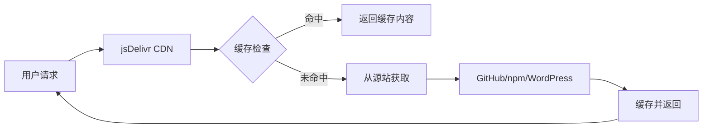

# 前言

在现代Web开发中，内容分发网络（CDN）已经成为提升网站性能的重要工具。jsDelivr作为一个免费、快速、可靠的开源CDN服务，为全球开发者提供了优质的静态资源分发服务。无论是加速GitHub仓库访问、分发npm包，还是为开源项目提供CDN支持，jsDelivr都是开发者的首选方案。本文将全面介绍jsDelivr的使用方法、配置技巧和最佳实践。

# 一、jsDelivr简介

## （一）什么是jsDelivr

jsDelivr是一个免费的开源CDN（Content Delivery Network），专门为开源项目提供快速、可靠的静态资源分发服务。它支持多种资源来源，包括GitHub、npm、WordPress等。

### 1. 核心特性
- **完全免费**：无需注册，无使用费用
- **全球覆盖**：超过750个CDN节点遍布全球
- **高性能**：智能路由和缓存策略
- **多源支持**：GitHub、npm、WordPress等多种来源
- **高可用性**：99.9%的服务可用性保证

### 2. 服务优势
```markdown
**速度优势**
- 全球CDN节点就近访问
- 智能缓存和压缩
- HTTP/2和HTTP/3支持

**稳定性优势**
- 多重备份机制
- 自动故障转移
- 24/7监控服务

**易用性优势**
- 无需注册即可使用
- 简单的URL格式
- 丰富的API接口
```

## （二）jsDelivr的工作原理

### 1. 基本架构


### 2. 缓存策略
- **智能缓存**：根据文件类型和访问频率自动调整缓存时间
- **版本控制**：支持特定版本和最新版本的缓存
- **全球同步**：确保全球节点内容一致性

## （三）支持的资源类型

### 1. GitHub仓库
```bash
# 基本格式
https://cdn.jsdelivr.net/gh/用户名/仓库名@版本号/文件路径

# 示例
https://cdn.jsdelivr.net/gh/jquery/jquery@3.6.0/dist/jquery.min.js
```

### 2. npm包
```bash
# 基本格式
https://cdn.jsdelivr.net/npm/包名@版本号/文件路径

# 示例
https://cdn.jsdelivr.net/npm/vue@3.3.4/dist/vue.global.js
```

### 3. WordPress插件
```bash
# 基本格式
https://cdn.jsdelivr.net/wp/plugins/插件名/版本号/文件路径

# 示例
https://cdn.jsdelivr.net/wp/plugins/contact-form-7/5.7.7/includes/css/styles.css
```

# 二、GitHub仓库加速

## （一）基本使用方法

### 1. URL格式规则
```bash
# 完整格式
https://cdn.jsdelivr.net/gh/用户名/仓库名@分支或标签/文件路径

# 使用默认分支（推荐）
https://cdn.jsdelivr.net/gh/用户名/仓库名/文件路径

# 指定分支
https://cdn.jsdelivr.net/gh/用户名/仓库名@main/文件路径

# 指定标签版本
https://cdn.jsdelivr.net/gh/用户名/仓库名@v1.0.0/文件路径
```

### 2. 实际应用示例

#### 图片资源加速
```html
<!-- GitHub原始链接（慢） -->


<!-- jsDelivr CDN链接（快） -->

```

#### JavaScript库加速
```html
<!-- 加载开源JavaScript库 -->
<script src="https://cdn.jsdelivr.net/gh/highlightjs/highlight.js@11.8.0/build/highlight.min.js"></script>

<!-- 加载CSS样式文件 -->
<link rel="stylesheet" href="https://cdn.jsdelivr.net/gh/highlightjs/highlight.js@11.8.0/build/styles/default.min.css">
```

## （二）图床应用场景

### 1. 博客图片托管
```markdown
# 在Markdown中使用


# 在HTML中使用

```

### 2. PicGo配置
```json
{
  "repo": "username/image-hosting",
  "branch": "main",
  "token": "your_github_token",
  "path": "images/",
  "customUrl": "https://cdn.jsdelivr.net/gh/username/image-hosting"
}
```

### 3. 批量图片处理
```javascript
// 批量转换GitHub链接为jsDelivr链接
function convertToJsDelivr(githubUrl) {
  const regex = /https:\/\/raw\.githubusercontent\.com\/([^\/]+)\/([^\/]+)\/([^\/]+)\/(.+)/;
  const match = githubUrl.match(regex);
  
  if (match) {
    const [, user, repo, branch, path] = match;
    return `https://cdn.jsdelivr.net/gh/${user}/${repo}@${branch}/${path}`;
  }
  
  return githubUrl;
}

// 使用示例
const originalUrl = "https://raw.githubusercontent.com/user/repo/main/image.jpg";
const cdnUrl = convertToJsDelivr(originalUrl);
console.log(cdnUrl); // https://cdn.jsdelivr.net/gh/user/repo@main/image.jpg
```

## （三）版本管理策略

### 1. 使用标签版本（推荐）
```bash
# 使用具体版本标签，确保稳定性
https://cdn.jsdelivr.net/gh/jquery/jquery@3.6.0/dist/jquery.min.js

# 使用语义化版本范围
https://cdn.jsdelivr.net/gh/jquery/jquery@3/dist/jquery.min.js  # 最新3.x版本
```

### 2. 使用分支版本
```bash
# 使用主分支（内容可能变化）
https://cdn.jsdelivr.net/gh/username/repo@main/file.js

# 使用开发分支
https://cdn.jsdelivr.net/gh/username/repo@develop/file.js
```

### 3. 版本选择建议
```markdown
**生产环境**
- 使用具体的标签版本
- 避免使用分支名称
- 定期更新版本

**开发环境**
- 可以使用分支名称
- 便于测试最新功能
- 注意缓存问题
```

# 三、npm包分发服务

## （一）npm包CDN使用

### 1. 基本语法
```bash
# 完整格式
https://cdn.jsdelivr.net/npm/包名@版本号/文件路径

# 使用最新版本
https://cdn.jsdelivr.net/npm/包名/文件路径

# 指定版本范围
https://cdn.jsdelivr.net/npm/包名@^1.0.0/文件路径
```

### 2. 常用前端库示例

#### Vue.js
```html
<!-- Vue 3 -->
<script src="https://cdn.jsdelivr.net/npm/vue@3/dist/vue.global.js"></script>

<!-- Vue 2 -->
<script src="https://cdn.jsdelivr.net/npm/vue@2/dist/vue.js"></script>
```

#### React
```html
<!-- React 开发版 -->
<script src="https://cdn.jsdelivr.net/npm/react@18/umd/react.development.js"></script>
<script src="https://cdn.jsdelivr.net/npm/react-dom@18/umd/react-dom.development.js"></script>

<!-- React 生产版 -->
<script src="https://cdn.jsdelivr.net/npm/react@18/umd/react.production.min.js"></script>
<script src="https://cdn.jsdelivr.net/npm/react-dom@18/umd/react-dom.production.min.js"></script>
```

#### 工具库
```html
<!-- Lodash -->
<script src="https://cdn.jsdelivr.net/npm/lodash@4/lodash.min.js"></script>

<!-- Moment.js -->
<script src="https://cdn.jsdelivr.net/npm/moment@2/moment.min.js"></script>

<!-- Axios -->
<script src="https://cdn.jsdelivr.net/npm/axios@1/dist/axios.min.js"></script>
```

## （二）包文件浏览

### 1. 浏览包内容
```bash
# 查看包的所有文件
https://cdn.jsdelivr.net/npm/包名/

# 查看特定版本的文件
https://cdn.jsdelivr.net/npm/包名@版本号/

# 示例：查看Vue包内容
https://cdn.jsdelivr.net/npm/vue@3/
```

### 2. 自动文件选择
```bash
# jsDelivr会自动选择合适的文件
https://cdn.jsdelivr.net/npm/vue@3  # 自动选择 dist/vue.global.js

# 手动指定文件
https://cdn.jsdelivr.net/npm/vue@3/dist/vue.esm-browser.js
```

## （三）组合加载功能

### 1. 多文件合并
```html
<!-- 合并多个文件为一个请求 -->
<script src="https://cdn.jsdelivr.net/combine/npm/jquery@3,npm/bootstrap@5/dist/js/bootstrap.bundle.min.js"></script>

<!-- 合并CSS文件 -->
<link rel="stylesheet" href="https://cdn.jsdelivr.net/combine/npm/bootstrap@5/dist/css/bootstrap.min.css,npm/font-awesome@6/css/all.min.css">
```

### 2. 压缩和优化
```bash
# 自动压缩（添加.min后缀）
https://cdn.jsdelivr.net/npm/vue@3/dist/vue.global.min.js

# 原始文件
https://cdn.jsdelivr.net/npm/vue@3/dist/vue.global.js
```

# 四、高级功能与配置

## （一）API接口使用

### 1. 包信息查询
```javascript
// 获取包的基本信息
fetch('https://data.jsdelivr.com/v1/package/npm/vue')
  .then(response => response.json())
  .then(data => console.log(data));

// 获取包的版本列表
fetch('https://data.jsdelivr.com/v1/package/npm/vue/versions')
  .then(response => response.json())
  .then(data => console.log(data));
```

### 2. 文件列表查询
```javascript
// 获取包的文件列表
fetch('https://data.jsdelivr.com/v1/package/npm/vue@3/flat')
  .then(response => response.json())
  .then(data => console.log(data.files));

// 获取GitHub仓库文件列表
fetch('https://data.jsdelivr.com/v1/package/gh/jquery/jquery@3.6.0/flat')
  .then(response => response.json())
  .then(data => console.log(data.files));
```

### 3. 统计信息查询
```javascript
// 获取包的下载统计
fetch('https://data.jsdelivr.com/v1/package/npm/vue/stats')
  .then(response => response.json())
  .then(data => console.log(data));
```

## （二）缓存控制

### 1. 缓存策略理解
```markdown
**默认缓存时间**
- 稳定版本：7天
- 预发布版本：1天
- 分支版本：12小时

**缓存刷新**
- 自动刷新：根据版本更新
- 手动刷新：通过API接口
```

### 2. 缓存刷新方法
```javascript
// 通过API刷新缓存
fetch('https://purge.jsdelivr.net/npm/package@version/file', {
  method: 'POST'
});

// 示例：刷新特定文件缓存
fetch('https://purge.jsdelivr.net/npm/vue@3/dist/vue.global.js', {
  method: 'POST'
});
```

## （三）性能优化技巧

### 1. 预加载和预连接
```html
<!-- DNS预解析 -->
<link rel="dns-prefetch" href="//cdn.jsdelivr.net">

<!-- 预连接 -->
<link rel="preconnect" href="https://cdn.jsdelivr.net">

<!-- 预加载关键资源 -->
<link rel="preload" href="https://cdn.jsdelivr.net/npm/vue@3/dist/vue.global.js" as="script">
```

### 2. 资源优先级控制
```html
<!-- 高优先级资源 -->
<script src="https://cdn.jsdelivr.net/npm/vue@3/dist/vue.global.js" defer></script>

<!-- 低优先级资源 -->
<script src="https://cdn.jsdelivr.net/npm/lodash@4/lodash.min.js" async></script>
```

### 3. 错误处理和回退
```html
<script>
// CDN加载失败时的回退方案
function loadScript(src, fallback) {
  const script = document.createElement('script');
  script.src = src;
  script.onerror = function() {
    console.warn('CDN加载失败，使用备用源');
    const fallbackScript = document.createElement('script');
    fallbackScript.src = fallback;
    document.head.appendChild(fallbackScript);
  };
  document.head.appendChild(script);
}

// 使用示例
loadScript(
  'https://cdn.jsdelivr.net/npm/vue@3/dist/vue.global.js',
  '/local/vue.global.js'  // 本地备用文件
);
</script>
```

# 五、实际应用案例

## （一）个人博客优化

### 1. 静态资源CDN化
```html
<!DOCTYPE html>
<html>
<head>
  <!-- CSS库 -->
  <link rel="stylesheet" href="https://cdn.jsdelivr.net/npm/bootstrap@5/dist/css/bootstrap.min.css">
  <link rel="stylesheet" href="https://cdn.jsdelivr.net/npm/prismjs@1/themes/prism.css">
  
  <!-- 自定义样式（通过GitHub仓库） -->
  <link rel="stylesheet" href="https://cdn.jsdelivr.net/gh/username/blog-assets/css/custom.css">
</head>
<body>
  <!-- JavaScript库 -->
  <script src="https://cdn.jsdelivr.net/npm/bootstrap@5/dist/js/bootstrap.bundle.min.js"></script>
  <script src="https://cdn.jsdelivr.net/npm/prismjs@1/components/prism-core.min.js"></script>
  
  <!-- 自定义脚本 -->
  <script src="https://cdn.jsdelivr.net/gh/username/blog-assets/js/main.js"></script>
</body>
</html>
```

### 2. 图片资源优化
```markdown
<!-- 博客文章中的图片 -->


<!-- 头像和Logo -->


```

## （二）开源项目文档

### 1. 文档站点资源
```html
<!-- 文档主题样式 -->
<link rel="stylesheet" href="https://cdn.jsdelivr.net/npm/docsify@4/lib/themes/vue.css">

<!-- 文档功能插件 -->
<script src="https://cdn.jsdelivr.net/npm/docsify@4/lib/docsify.min.js"></script>
<script src="https://cdn.jsdelivr.net/npm/docsify@4/lib/plugins/search.min.js"></script>
<script src="https://cdn.jsdelivr.net/npm/prismjs@1/components/prism-bash.min.js"></script>
```

### 2. 示例代码托管
```javascript
// 在文档中引用GitHub仓库的示例代码
const exampleUrl = 'https://cdn.jsdelivr.net/gh/username/project-examples/basic-usage.js';

fetch(exampleUrl)
  .then(response => response.text())
  .then(code => {
    document.getElementById('code-example').textContent = code;
  });
```

## （三）企业级应用

### 1. 微前端架构
```javascript
// 动态加载微应用资源
const loadMicroApp = async (appName, version) => {
  const baseUrl = `https://cdn.jsdelivr.net/gh/company/${appName}@${version}`;
  
  // 加载CSS
  const link = document.createElement('link');
  link.rel = 'stylesheet';
  link.href = `${baseUrl}/dist/app.css`;
  document.head.appendChild(link);
  
  // 加载JavaScript
  const script = document.createElement('script');
  script.src = `${baseUrl}/dist/app.js`;
  document.head.appendChild(script);
};

// 使用示例
loadMicroApp('user-management', 'v1.2.0');
```

### 2. 组件库分发
```html
<!-- 企业组件库 -->
<link rel="stylesheet" href="https://cdn.jsdelivr.net/gh/company/ui-components@latest/dist/components.css">
<script src="https://cdn.jsdelivr.net/gh/company/ui-components@latest/dist/components.js"></script>

<!-- 特定版本的组件 -->
<script src="https://cdn.jsdelivr.net/gh/company/ui-components@v2.1.0/dist/button.js"></script>
```

# 六、最佳实践与注意事项

## （一）使用最佳实践

### 1. 版本管理策略
```markdown
**生产环境建议**
- 使用具体的版本号，避免使用latest
- 定期更新依赖版本
- 建立版本回退机制

**开发环境建议**
- 可以使用分支名称进行测试
- 注意缓存对开发的影响
- 使用本地开发服务器作为备用
```

### 2. 性能优化建议
```html
<!-- 资源预加载 -->
<link rel="preload" href="https://cdn.jsdelivr.net/npm/vue@3/dist/vue.global.js" as="script">

<!-- 关键CSS内联 -->
<style>
  /* 关键样式内联，非关键样式使用CDN */
</style>
<link rel="stylesheet" href="https://cdn.jsdelivr.net/npm/bootstrap@5/dist/css/bootstrap.min.css" media="print" onload="this.media='all'">

<!-- 非阻塞加载 -->
<script src="https://cdn.jsdelivr.net/npm/lodash@4/lodash.min.js" defer></script>
```

### 3. 安全性考虑
```html
<!-- 使用SRI确保文件完整性 -->
<script src="https://cdn.jsdelivr.net/npm/vue@3.3.4/dist/vue.global.js" 
        integrity="sha384-..." 
        crossorigin="anonymous"></script>

<!-- CSP策略配置 -->
<meta http-equiv="Content-Security-Policy" 
      content="script-src 'self' https://cdn.jsdelivr.net; style-src 'self' https://cdn.jsdelivr.net;">
```

## （二）常见问题解决

### 1. 缓存问题
```javascript
// 强制刷新缓存的方法
const timestamp = Date.now();
const url = `https://cdn.jsdelivr.net/gh/username/repo/file.js?t=${timestamp}`;

// 或者使用版本号
const version = '1.0.1';
const url = `https://cdn.jsdelivr.net/gh/username/repo@v${version}/file.js`;
```

### 2. 访问限制
```markdown
**文件大小限制**
- 单个文件最大50MB
- 建议将大文件分割或压缩

**仓库大小限制**
- GitHub仓库建议不超过1GB
- 定期清理不必要的文件

**流量限制**
- 个人使用通常不会触及限制
- 商业用途建议联系jsDelivr团队
```

### 3. 故障处理
```javascript
// 多CDN备用方案
const cdnSources = [
  'https://cdn.jsdelivr.net/npm/vue@3/dist/vue.global.js',
  'https://unpkg.com/vue@3/dist/vue.global.js',
  '/local/vue.global.js'
];

function loadWithFallback(sources, index = 0) {
  if (index >= sources.length) {
    console.error('所有CDN源都无法访问');
    return;
  }
  
  const script = document.createElement('script');
  script.src = sources[index];
  script.onload = () => console.log(`成功加载: ${sources[index]}`);
  script.onerror = () => loadWithFallback(sources, index + 1);
  document.head.appendChild(script);
}

loadWithFallback(cdnSources);
```

# 七、总结

jsDelivr作为一个优秀的免费CDN服务，为全球开发者提供了强大的静态资源分发能力。通过本文的详细介绍，您应该能够：

## （一）核心收获

1. **理解jsDelivr**：掌握jsDelivr的基本概念和工作原理
2. **熟练使用**：能够正确配置和使用各种jsDelivr服务
3. **性能优化**：通过CDN显著提升网站访问速度
4. **最佳实践**：遵循安全和性能的最佳实践

## （二）应用场景

### 1. 个人项目
- **博客图床**：GitHub + jsDelivr的完美组合
- **静态网站**：加速CSS、JS等静态资源
- **开源项目**：为项目提供可靠的CDN支持

### 2. 企业应用
- **微前端**：动态加载和分发微应用资源
- **组件库**：企业级组件的CDN分发
- **文档站点**：技术文档的资源优化

## （三）发展趋势

随着Web技术的不断发展，CDN服务也在持续演进：

1. **边缘计算**：更靠近用户的内容分发
2. **智能优化**：AI驱动的缓存和路由策略
3. **安全增强**：更强的内容安全和完整性保护
4. **生态整合**：与更多开发工具和平台的深度集成

jsDelivr作为开源CDN的领导者，将继续为开发者提供更好的服务。掌握jsDelivr的使用，不仅能提升项目性能，更是现代Web开发的必备技能。

记住，好的CDN服务配合正确的使用方法，才能发挥最大的价值。希望本文能帮助您更好地使用jsDelivr，提升您的Web项目性能！

## 参考资料

- [jsDelivr官方网站](https://www.jsdelivr.com/)
- [jsDelivr GitHub仓库](https://github.com/jsdelivr/jsdelivr)
- [jsDelivr API文档](https://github.com/jsdelivr/data.jsdelivr.com)
- [CDN最佳实践指南](https://developers.google.com/web/fundamentals/performance/optimizing-content-efficiency/content-distribution-networks)
