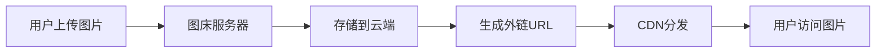

# 前言

在数字化内容创作的时代，图片已经成为博客、文档、社交媒体等平台不可或缺的元素。然而，如何高效、稳定地存储和分发图片资源，一直是内容创作者面临的重要问题。图床（Image Hosting）作为专门的图片存储和分发服务，为这个问题提供了完美的解决方案。本文将全面介绍图床的概念、分类、选择标准以及各种搭建方案。

# 一、图床基础概念

## （一）什么是图床

图床是指专门用于存储图片并提供外链访问的服务平台。它的主要功能包括：

1. **图片存储**：提供稳定的图片存储空间
2. **外链服务**：生成可直接访问的图片URL
3. **CDN加速**：通过内容分发网络提高访问速度
4. **批量管理**：支持图片的批量上传、删除、分类等操作

## （二）图床的工作原理



### 1. 上传流程
```bash
# 典型的图片上传流程
1. 用户选择图片文件
2. 客户端压缩/处理图片（可选）
3. 上传到图床服务器
4. 服务器存储图片
5. 返回图片的访问URL
```

### 2. 访问流程
```bash
# 图片访问流程
1. 用户请求图片URL
2. CDN节点检查缓存
3. 如果缓存命中，直接返回
4. 如果缓存未命中，从源站获取
5. 返回图片给用户并缓存
```

## （三）图床的优势

### 1. 减轻服务器压力
- 将图片资源分离到专门的存储服务
- 减少主服务器的带宽和存储压力
- 提高网站整体性能

### 2. 提升访问速度
- 利用CDN全球节点加速
- 专业的图片优化和压缩
- 支持多种图片格式和尺寸

### 3. 降低成本
- 专业的存储服务成本更低
- 按需付费，避免资源浪费
- 减少服务器维护成本

### 4. 提高可靠性
- 多重备份保障数据安全
- 专业的运维团队维护
- 高可用性保证

# 二、图床分类与对比

## （一）按服务类型分类

### 1. 免费图床
| 服务商 | 存储空间 | 单文件限制 | CDN | 稳定性 | 推荐度 |
|--------|----------|------------|-----|--------|--------|
| GitHub | 1GB | 25MB | 有 | 高 | ⭐⭐⭐⭐⭐ |
| Gitee | 1GB | 1MB | 无 | 中 | ⭐⭐⭐ |
| SM.MS | 5GB | 5MB | 有 | 中 | ⭐⭐⭐⭐ |
| ImgBB | 无限 | 32MB | 有 | 中 | ⭐⭐⭐ |

### 2. 付费图床
| 服务商 | 价格 | 存储空间 | 带宽 | CDN | 推荐度 |
|--------|------|----------|------|-----|--------|
| 七牛云 | 0.148元/GB/月 | 按需 | 0.29元/GB | 有 | ⭐⭐⭐⭐⭐ |
| 阿里云OSS | 0.148元/GB/月 | 按需 | 0.5元/GB | 有 | ⭐⭐⭐⭐⭐ |
| 腾讯云COS | 0.118元/GB/月 | 按需 | 0.5元/GB | 有 | ⭐⭐⭐⭐⭐ |
| 又拍云 | 0.117元/GB/月 | 按需 | 0.29元/GB | 有 | ⭐⭐⭐⭐ |

### 3. 自建图床
| 方案 | 成本 | 技术难度 | 可控性 | 稳定性 | 推荐度 |
|------|------|----------|--------|--------|--------|
| 服务器+Nginx | 中 | 中 | 高 | 中 | ⭐⭐⭐ |
| MinIO | 低 | 中 | 高 | 中 | ⭐⭐⭐⭐ |
| Chevereto | 中 | 低 | 高 | 中 | ⭐⭐⭐⭐ |

## （二）按使用场景分类

### 1. 个人博客图床
**推荐方案**：GitHub + jsDelivr CDN
```markdown
优势：
- 完全免费
- 稳定可靠
- 版本控制
- 全球CDN加速

劣势：
- 国内访问可能较慢
- 单文件25MB限制
- 需要一定技术基础
```

### 2. 商业网站图床
**推荐方案**：阿里云OSS + CDN
```markdown
优势：
- 高可用性
- 专业技术支持
- 丰富的API接口
- 强大的图片处理能力

劣势：
- 需要付费
- 配置相对复杂
```

### 3. 临时分享图床
**推荐方案**：SM.MS 或 ImgBB
```markdown
优势：
- 无需注册
- 操作简单
- 即传即用

劣势：
- 稳定性一般
- 功能有限
- 可能有时效限制
```

# 三、主流图床服务详解

## （一）GitHub图床

### 1. 优势特点
- **完全免费**：每个仓库1GB存储空间
- **版本控制**：支持Git版本管理
- **全球CDN**：通过jsDelivr等CDN加速
- **高稳定性**：GitHub的可靠性保证

### 2. 搭建步骤

#### 第一步：创建GitHub仓库
1. 访问 https://github.com/new
2. 输入仓库名称，如：`my-image-hosting`
3. 选择**Public**（公开仓库）
4. 点击**Create repository**创建仓库

#### 第二步：生成Personal Access Token
1. 进入GitHub设置页面：**Settings** → **Developer settings** → **Personal access tokens**
2. 点击**Generate new token**
3. 勾选**repo**权限（完整的仓库访问权限）
4. 点击**Generate token**并保存生成的token

#### 第三步：配置PicGo
在PicGo中添加GitHub图床配置：

```json
{
  "repo": "username/my-image-hosting",
  "branch": "main",
  "token": "your_github_token",
  "path": "images/",
  "customUrl": "https://cdn.jsdelivr.net/gh/username/my-image-hosting"
}
```

### 3. 使用示例
```markdown
# 原始GitHub链接
https://raw.githubusercontent.com/username/repo/main/images/photo.jpg

# jsDelivr CDN链接
https://cdn.jsdelivr.net/gh/username/repo/images/photo.jpg

# 在Markdown中使用

```

## （二）七牛云图床

### 1. 服务特点
- **专业CDN**：全球500+节点
- **图片处理**：支持实时图片处理
- **API丰富**：完善的开发接口
- **价格合理**：存储和流量费用较低

### 2. 配置步骤

#### 第一步：注册七牛云账号
1. 访问 https://www.qiniu.com/
2. 点击**注册**按钮完成账号注册
3. 完成实名认证（根据需要）

#### 第二步：创建存储空间
1. 登录七牛云控制台
2. 进入**对象存储** → **空间管理**
3. 点击**新建存储空间**
4. 填写存储空间名称
5. 选择存储区域（建议选择离用户较近的区域）
6. 设置访问控制（建议选择**公开空间**）

#### 第三步：获取密钥
1. 进入**个人中心** → **密钥管理**
2. 记录**AccessKey**和**SecretKey**
3. 妥善保管密钥信息

#### 第四步：配置域名
1. 在存储空间中绑定自定义域名
2. 或使用七牛云提供的测试域名（有时效限制）

### 3. PicGo配置
```json
{
  "accessKey": "your_access_key",
  "secretKey": "your_secret_key",
  "bucket": "your_bucket_name",
  "url": "http://your_domain.com",
  "area": "z0",
  "options": "",
  "path": "images/{year}/{month}/"
}
```

## （三）阿里云OSS图床

### 1. 服务优势
- **高可用性**：99.9%的服务可用性
- **安全可靠**：多重数据保护机制
- **弹性扩展**：按需扩展存储容量
- **图片处理**：强大的图片处理服务

### 2. 基础配置

#### 第一步：开通OSS服务
1. 访问阿里云控制台：https://oss.console.aliyun.com/
2. 点击**立即开通**对象存储OSS服务
3. 根据需要选择计费方式

#### 第二步：创建Bucket
1. 在OSS控制台点击**创建Bucket**
2. 填写Bucket名称（全局唯一）
3. 选择地域（建议选择离用户较近的地域）
4. 选择存储类型（标准存储、低频访问、归档存储等）
5. 设置读写权限（建议选择**公共读**）
6. 点击**确定**创建

#### 第三步：配置跨域规则
1. 进入创建的Bucket管理页面
2. 点击**权限管理** → **跨域设置**
3. 点击**设置**添加跨域规则：
   - **来源**：`*`（允许所有来源）
   - **允许Methods**：`GET, POST, PUT, DELETE, HEAD`
   - **允许Headers**：`*`（允许所有请求头）

### 3. 使用示例
```javascript
// 使用阿里云OSS SDK上传图片
const OSS = require('ali-oss');

const client = new OSS({
  region: 'oss-cn-hangzhou',
  accessKeyId: 'your_access_key_id',
  accessKeySecret: 'your_access_key_secret',
  bucket: 'your_bucket_name'
});

// 上传图片
async function uploadImage(file) {
  try {
    const result = await client.put(`images/${Date.now()}.jpg`, file);
    return result.url;
  } catch (error) {
    console.error('上传失败:', error);
  }
}
```

# 四、图床工具推荐

## （一）PicGo - 图片上传工具

### 1. 功能特点
- **多平台支持**：Windows、macOS、Linux
- **插件生态**：丰富的插件扩展
- **批量上传**：支持拖拽批量上传
- **快捷键**：支持全局快捷键上传

### 2. 安装配置

#### 第一步：下载安装PicGo
1. 访问PicGo官网：https://molunerfinn.com/PicGo/
2. 根据操作系统下载对应的安装包：
   - Windows：下载`.exe`安装文件
   - macOS：下载`.dmg`安装文件
   - Linux：下载`.AppImage`文件
3. 运行安装程序完成安装

#### 第二步：配置图床
1. 打开PicGo应用程序
2. 在左侧菜单选择**图床设置**
3. 选择要配置的图床类型（如GitHub、七牛云等）
4. 填写相关配置信息（密钥、存储空间等）
5. 点击**确定**保存配置
6. 点击**设为默认图床**

#### 第三步：测试上传功能
1. 在**上传区**拖拽图片或点击上传
2. 查看上传结果和生成的链接
3. 确认图片可以正常访问

### 3. 常用插件
```bash
# GitHub Plus - 增强GitHub图床功能
npm install picgo-plugin-github-plus

# 压缩插件 - 自动压缩图片
npm install picgo-plugin-compress

# 水印插件 - 添加水印
npm install picgo-plugin-watermark

# 重命名插件 - 自定义文件名
npm install picgo-plugin-rename-file
```

## （二）uPic - macOS图床工具

### 1. 特色功能
- **原生macOS应用**：完美适配macOS
- **多种上传方式**：拖拽、快捷键、右键菜单
- **自动压缩**：智能图片压缩
- **历史记录**：完整的上传历史

### 2. 支持的图床
- 七牛云
- 阿里云OSS
- 腾讯云COS
- GitHub
- Gitee
- SM.MS

## （三）Typora集成

### 1. 配置图片上传

#### 在Typora中配置图片自动上传：
1. 打开Typora编辑器
2. 进入菜单：**文件** → **偏好设置** → **图像**
3. 在**插入图片时**选项中选择：**上传图片**
4. 在**上传服务设定**中选择：**PicGo(app)**
5. 点击**PicGo路径**后的文件夹图标，选择PicGo的安装路径
6. 点击**验证图片上传选项**测试配置是否正确

### 2. 使用体验
- **无缝集成**：粘贴图片自动上传
- **实时预览**：上传后立即显示
- **格式转换**：自动转换为Markdown格式

# 五、自建图床方案

## （一）基于MinIO的自建图床

### 1. MinIO简介
MinIO是一个高性能的对象存储服务，兼容Amazon S3 API，适合自建图床。

### 2. 部署步骤

#### 第一步：安装Docker
确保系统已安装Docker，如未安装请先安装Docker。

#### 第二步：部署MinIO容器
使用以下Docker命令部署MinIO：

```bash
docker run -d \
  --name minio \
  -p 9000:9000 \
  -p 9001:9001 \
  -e "MINIO_ROOT_USER=admin" \
  -e "MINIO_ROOT_PASSWORD=password123" \
  -v /data/minio:/data \
  minio/minio server /data --console-address ":9001"
```

#### 第三步：访问管理界面
1. 打开浏览器访问：http://localhost:9001
2. 使用以下凭据登录：
   - **用户名**：admin
   - **密码**：password123

### 3. 配置存储桶

#### 创建存储桶步骤：
1. 登录MinIO管理控制台
2. 在主界面点击**Create Bucket**按钮
3. 输入存储桶名称，例如：`images`
4. 点击**Create Bucket**创建存储桶
5. 进入存储桶设置，将访问策略设置为**Public**（公开访问）

### 4. API使用示例
```javascript
// 使用MinIO JavaScript SDK
const Minio = require('minio');

const minioClient = new Minio.Client({
  endPoint: 'localhost',
  port: 9000,
  useSSL: false,
  accessKey: 'admin',
  secretKey: 'password123'
});

// 上传图片
async function uploadImage(bucketName, objectName, filePath) {
  try {
    await minioClient.fPutObject(bucketName, objectName, filePath);
    const url = `http://localhost:9000/${bucketName}/${objectName}`;
    return url;
  } catch (error) {
    console.error('上传失败:', error);
  }
}
```

## （二）基于Nginx的静态文件服务

### 1. Nginx配置
```nginx
# /etc/nginx/sites-available/image-hosting
server {
    listen 80;
    server_name your-domain.com;
    
    # 图片存储目录
    root /var/www/images;
    
    # 允许上传的最大文件大小
    client_max_body_size 10M;
    
    # 静态文件服务
    location / {
        try_files $uri $uri/ =404;
        
        # 设置缓存
        expires 30d;
        add_header Cache-Control "public, immutable";
        
        # 允许跨域
        add_header Access-Control-Allow-Origin *;
    }
    
    # 上传接口
    location /upload {
        proxy_pass http://localhost:3000;
        proxy_set_header Host $host;
        proxy_set_header X-Real-IP $remote_addr;
    }
}
```

### 2. 上传服务实现
```javascript
// Node.js + Express 上传服务
const express = require('express');
const multer = require('multer');
const path = require('path');

const app = express();

// 配置文件存储
const storage = multer.diskStorage({
  destination: '/var/www/images/',
  filename: (req, file, cb) => {
    const uniqueName = Date.now() + '-' + Math.round(Math.random() * 1E9);
    const ext = path.extname(file.originalname);
    cb(null, uniqueName + ext);
  }
});

const upload = multer({ storage });

// 上传接口
app.post('/upload', upload.single('image'), (req, res) => {
  if (!req.file) {
    return res.status(400).json({ error: '没有上传文件' });
  }
  
  const imageUrl = `http://your-domain.com/${req.file.filename}`;
  res.json({ url: imageUrl });
});

app.listen(3000, () => {
  console.log('上传服务启动在端口3000');
});
```

# 六、图床选择指南

## （一）选择标准

### 1. 技术指标
```markdown
**存储容量**
- 个人博客：1-10GB足够
- 商业网站：根据实际需求选择
- 大型平台：TB级别存储

**访问速度**
- CDN覆盖范围
- 节点分布情况
- 国内外访问速度

**稳定性**
- 服务可用性（SLA）
- 数据备份机制
- 故障恢复能力

**安全性**
- 数据加密
- 访问控制
- 防盗链功能
```

### 2. 成本考虑
```markdown
**免费方案适用场景**
- 个人博客
- 学习项目
- 小流量网站

**付费方案适用场景**
- 商业网站
- 高流量应用
- 对稳定性要求高的项目

**自建方案适用场景**
- 对数据控制要求高
- 有技术团队维护
- 长期大量使用
```

## （二）推荐方案

### 1. 个人开发者
```markdown
**入门推荐**：GitHub + PicGo
- 完全免费
- 操作简单
- 社区支持好

**进阶推荐**：七牛云
- 专业CDN服务
- 丰富的图片处理功能
- 价格合理
```

### 2. 企业用户
```markdown
**小型企业**：阿里云OSS
- 稳定可靠
- 技术支持完善
- 与其他阿里云服务集成好

**大型企业**：多云架构
- 主备方案保证可用性
- 成本优化
- 风险分散
```

### 3. 特殊需求
```markdown
**高安全要求**：自建MinIO
- 数据完全可控
- 可部署在内网
- 符合合规要求

**海外用户**：AWS S3
- 全球覆盖最好
- 服务最成熟
- 生态最完善
```

# 七、图床使用最佳实践

## （一）图片优化

### 1. 格式选择
```markdown
**JPEG**
- 适用：照片、复杂图像
- 优势：压缩率高、兼容性好
- 劣势：有损压缩、不支持透明

**PNG**
- 适用：图标、简单图形
- 优势：无损压缩、支持透明
- 劣势：文件较大

**WebP**
- 适用：现代浏览器
- 优势：压缩率高、质量好
- 劣势：兼容性有限

**SVG**
- 适用：矢量图形、图标
- 优势：无限缩放、文件小
- 劣势：不适合复杂图像
```

### 2. 尺寸优化
```bash
# 使用ImageMagick压缩图片
# 调整尺寸
convert input.jpg -resize 800x600 output.jpg

# 压缩质量
convert input.jpg -quality 85 output.jpg

# 批量处理
for file in *.jpg; do
  convert "$file" -resize 800x600 -quality 85 "compressed_$file"
done
```

### 3. 自动化处理
```javascript
// 使用Sharp进行图片处理
const sharp = require('sharp');

async function processImage(inputPath, outputPath) {
  await sharp(inputPath)
    .resize(800, 600, {
      fit: 'inside',
      withoutEnlargement: true
    })
    .jpeg({ quality: 85 })
    .toFile(outputPath);
}
```

## （二）安全防护

### 1. 防盗链设置
```nginx
# Nginx防盗链配置
location ~* \.(jpg|jpeg|png|gif|bmp|webp)$ {
    valid_referers none blocked server_names
                   *.yourdomain.com yourdomain.com;
    if ($invalid_referer) {
        return 403;
    }
}
```

### 2. 访问控制
```bash
# 设置图片访问权限
# 1. 私有读写：需要签名访问
# 2. 公有读私有写：可直接访问，但不能上传
# 3. 公有读写：完全开放（不推荐）
```

### 3. 水印保护
```javascript
// 使用Canvas添加水印
function addWatermark(canvas, text) {
  const ctx = canvas.getContext('2d');
  ctx.font = '20px Arial';
  ctx.fillStyle = 'rgba(255, 255, 255, 0.5)';
  ctx.fillText(text, canvas.width - 200, canvas.height - 30);
}
```

## （三）性能优化

### 1. CDN配置
```bash
# 设置缓存策略
# 图片文件：长期缓存（30天）
# 经常变动的图片：短期缓存（1天）
# 实时图片：不缓存
```

### 2. 懒加载
```html
<!-- 原生懒加载 -->


<!-- 使用Intersection Observer -->
<script>
const images = document.querySelectorAll('img[data-src]');
const imageObserver = new IntersectionObserver((entries, observer) => {
  entries.forEach(entry => {
    if (entry.isIntersecting) {
      const img = entry.target;
      img.src = img.dataset.src;
      img.classList.remove('lazy');
      imageObserver.unobserve(img);
    }
  });
});

images.forEach(img => imageObserver.observe(img));
</script>
```

### 3. 响应式图片
```html
<!-- 使用srcset提供多种尺寸 -->

```

# 八、常见问题与解决方案

## （一）访问问题

### 1. 图片加载慢
```markdown
**可能原因**
- CDN节点覆盖不足
- 图片文件过大
- 网络环境问题

**解决方案**
- 更换CDN服务商
- 压缩图片文件
- 使用图片懒加载
- 添加loading占位符
```

### 2. 图片无法显示
```markdown
**可能原因**
- 图床服务不稳定
- 防盗链限制
- 图片被删除

**解决方案**
- 检查图片URL是否正确
- 确认防盗链设置
- 使用多个图床备份
- 监控图片可用性
```

## （二）安全问题

### 1. 图片被盗用
```markdown
**防护措施**
- 设置防盗链
- 添加水印
- 使用签名URL
- 监控流量异常
```

### 2. 恶意上传
```markdown
**防护措施**
- 文件类型检查
- 文件大小限制
- 内容安全检测
- 用户权限控制
```

## （三）成本控制

### 1. 流量费用过高
```markdown
**优化策略**
- 图片压缩
- 缓存策略优化
- CDN配置优化
- 监控异常流量
```

### 2. 存储费用增长
```markdown
**管理策略**
- 定期清理无用图片
- 设置生命周期规则
- 使用低频存储
- 压缩历史图片
```

# 九、总结

图床作为现代内容创作的重要基础设施，为开发者和内容创作者提供了高效、稳定的图片存储和分发解决方案。通过本文的详细介绍，您应该能够：

## （一）核心收获

1. **理解图床概念**：掌握图床的基本原理和工作机制
2. **选择合适方案**：根据需求选择最适合的图床服务
3. **掌握配置方法**：熟练配置各种主流图床服务
4. **优化使用体验**：通过最佳实践提升图床使用效果

## （二）选择建议

### 1. 个人用户
- **入门**：GitHub + PicGo（免费、稳定）
- **进阶**：七牛云（专业、高效）

### 2. 企业用户
- **小型**：阿里云OSS（可靠、完善）
- **大型**：多云架构（高可用、成本优化）

### 3. 特殊需求
- **高安全**：自建MinIO（可控、合规）
- **高性能**：专业CDN服务（快速、稳定）

## （三）发展趋势

随着云计算和CDN技术的不断发展，图床服务正朝着以下方向演进：

1. **智能化**：AI驱动的图片优化和处理
2. **边缘计算**：更靠近用户的内容分发
3. **多媒体支持**：从图片扩展到视频、音频等
4. **安全增强**：更强的内容安全和隐私保护

选择合适的图床方案，不仅能提升内容创作效率，更能为用户提供更好的访问体验。希望本文能帮助您找到最适合的图床解决方案！

## 参考资料

- [PicGo官方文档](https://picgo.github.io/PicGo-Doc/)
- [七牛云对象存储文档](https://developer.qiniu.com/kodo)
- [阿里云OSS文档](https://help.aliyun.com/product/31815.html)
- [MinIO官方文档](https://docs.min.io/)
- [GitHub Pages文档](https://docs.github.com/en/pages)
