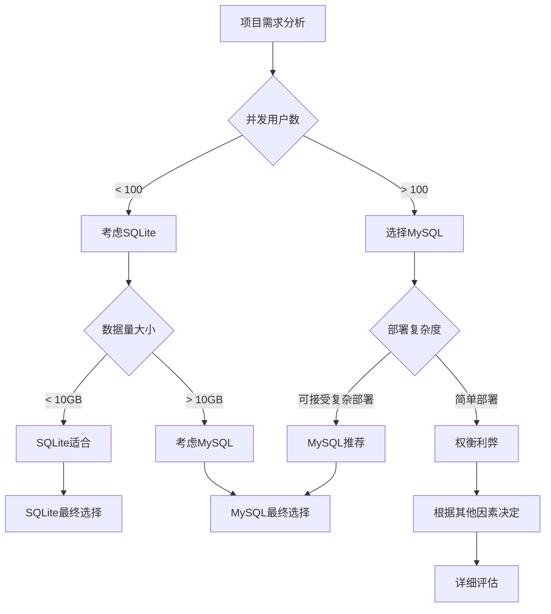

# 前言

在现代Java开发中，数据库的选择往往决定了项目的架构方向和性能表现。MySQL作为企业级关系型数据库的代表，SQLite作为轻量级嵌入式数据库的典型，各自在不同场景下发挥着重要作用。而MyBatis-Plus作为优秀的ORM框架，为开发者提供了在不同数据库间灵活切换的能力。

本文将深入分析MySQL与SQLite的核心差异，探讨MyBatis-Plus在跨数据库场景下的最佳实践，并重点关注XML自定义SQL在数据库切换时需要注意的关键问题。


**阅读提示**：本文适合有一定Java开发经验，希望深入了解数据库选型和ORM框架使用的开发者。文章将从理论对比到实践应用，提供完整的技术解决方案。


# 一、MySQL与SQLite核心特性对比

## （一）架构设计差异

### 1. MySQL：客户端-服务器架构

MySQL采用典型的客户端-服务器模式，具有以下特点：


**MySQL架构特点：**
- **架构模式**：客户端-服务器
- **部署方式**：独立服务进程
- **网络访问**：支持远程连接
- **并发处理**：多线程处理
- **资源占用**：相对较高
- **配置复杂度**：需要专门配置


**MySQL服务器配置示例：**
```sql
-- MySQL配置文件 my.cnf 关键参数
[mysqld]
# 服务器基础配置
port = 3306
bind-address = 0.0.0.0
socket = /var/run/mysqld/mysqld.sock

# 性能优化配置
max_connections = 200          # 最大连接数
innodb_buffer_pool_size = 1G   # InnoDB缓冲池大小
query_cache_size = 64M         # 查询缓存大小
tmp_table_size = 64M           # 临时表大小

# 事务和锁配置
innodb_lock_wait_timeout = 50  # 锁等待超时时间
transaction_isolation = READ-COMMITTED  # 事务隔离级别
```

### 2. SQLite：嵌入式架构

SQLite采用嵌入式设计，直接集成到应用程序中：


**SQLite架构特点：**
- **架构模式**：嵌入式
- **部署方式**：库文件集成
- **网络访问**：仅本地访问
- **并发处理**：单写多读
- **资源占用**：极低
- **配置复杂度**：零配置


**SQLite集成示例：**
```java
// SQLite在Java应用中的集成方式
public class SQLiteManager {
    private static final String DB_PATH = "data/application.db";
    
    // SQLite连接配置，无需服务器进程
    public Connection getConnection() throws SQLException {
        // 直接通过JDBC URL连接到文件数据库
        String url = "jdbc:sqlite:" + DB_PATH;
        
        // SQLite特有的连接参数配置
        Properties props = new Properties();
        props.setProperty("journal_mode", "WAL");     // 写前日志模式，提升并发性能
        props.setProperty("synchronous", "NORMAL");   # 同步模式，平衡性能和安全性
        props.setProperty("cache_size", "10000");     # 缓存页数，提升查询性能
        props.setProperty("temp_store", "MEMORY");    # 临时表存储在内存中
        
        return DriverManager.getConnection(url, props);
    }
}
```

## （二）性能特性对比

### 1. 读写性能分析

基于实际测试数据，两种数据库在不同场景下的性能表现：<mcreference link="https://blog.csdn.net/weixin_37989267/article/details/111043088" index="3">3</mcreference>

```java
// 性能测试结果对比（基于10万条记录插入测试）
public class DatabasePerformanceComparison {
    
    /**
     * 测试环境：i5-4460@3.2G，机械硬盘
     * 测试数据：10万条用户记录插入
     */
    public void performanceTestResults() {
        // MySQL性能数据
        MySQLPerformance mysql = new MySQLPerformance();
        mysql.insertTime = 8.654;      // 秒
        mysql.qps = 11555;             // 每秒查询数
        mysql.engineType = "InnoDB";   // 存储引擎
        mysql.transactionSupport = true;
        
        // SQLite性能数据  
        SQLitePerformance sqlite = new SQLitePerformance();
        sqlite.insertTime = 1.60;      // 秒
        sqlite.qps = 62471;            // 每秒查询数
        sqlite.syncMode = "OFF";       // 同步模式关闭
        sqlite.lockingMode = "EXCLUSIVE"; // 独占锁模式
        
        // 性能对比结论
        double performanceRatio = sqlite.qps / mysql.qps; // 约5.43倍
        
        System.out.println("SQLite插入性能约为MySQL的 " + performanceRatio + " 倍");
    }
}
```

### 2. 并发处理能力

```java
// 并发处理能力对比
public class ConcurrencyComparison {
    
    // MySQL并发特点
    public void mysqlConcurrency() {
        /**
         * MySQL并发优势：
         * 1. 支持多用户同时读写操作
         * 2. 行级锁机制，锁粒度细
         * 3. MVCC多版本并发控制
         * 4. 支持事务隔离级别调整
         */
        
        // MySQL事务隔离级别配置
        String[] isolationLevels = {
            "READ UNCOMMITTED",  // 读未提交
            "READ COMMITTED",    // 读已提交  
            "REPEATABLE READ",   // 可重复读（默认）
            "SERIALIZABLE"       // 串行化
        };
    }
    
    // SQLite并发特点
    public void sqliteConcurrency() {
        /**
         * SQLite并发限制：
         * 1. 同一时间只允许一个写操作
         * 2. 支持多个并发读操作
         * 3. 写操作会阻塞所有读操作
         * 4. 适合读多写少的场景
         */
        
        // SQLite锁机制说明
        String[] lockTypes = {
            "UNLOCKED",    // 未锁定状态
            "SHARED",      // 共享锁（读锁）
            "RESERVED",    // 保留锁（准备写入）
            "PENDING",     // 等待锁（等待写入）
            "EXCLUSIVE"    // 独占锁（写锁）
        };
    }
}
```

## （三）数据类型支持对比

### 1. MySQL数据类型系统

MySQL提供了丰富的数据类型支持：

```sql
-- MySQL数据类型示例
CREATE TABLE mysql_data_types (
    -- 整数类型
    tiny_int_col TINYINT,           -- 1字节，-128到127
    small_int_col SMALLINT,         -- 2字节，-32768到32767  
    medium_int_col MEDIUMINT,       -- 3字节，-8388608到8388607
    int_col INT,                    -- 4字节，-2147483648到2147483647
    big_int_col BIGINT,             -- 8字节，超大整数
    
    -- 浮点类型
    float_col FLOAT(7,4),           -- 单精度浮点数
    double_col DOUBLE(15,8),        -- 双精度浮点数
    decimal_col DECIMAL(10,2),      -- 精确小数类型
    
    -- 字符串类型
    char_col CHAR(10),              -- 定长字符串
    varchar_col VARCHAR(255),       -- 变长字符串
    text_col TEXT,                  -- 长文本
    longtext_col LONGTEXT,          -- 超长文本
    
    -- 日期时间类型
    date_col DATE,                  -- 日期：YYYY-MM-DD
    time_col TIME,                  -- 时间：HH:MM:SS
    datetime_col DATETIME,          -- 日期时间：YYYY-MM-DD HH:MM:SS
    timestamp_col TIMESTAMP,        -- 时间戳，自动更新
    year_col YEAR,                  -- 年份：YYYY
    
    -- 二进制类型
    binary_col BINARY(16),          -- 定长二进制
    varbinary_col VARBINARY(255),   -- 变长二进制
    blob_col BLOB,                  -- 二进制大对象
    
    -- JSON类型（MySQL 5.7+）
    json_col JSON                   -- 原生JSON支持
);
```

### 2. SQLite数据类型系统

SQLite采用动态类型系统，更加灵活：<mcreference link="https://www.cnblogs.com/wang_yb/p/18256117" index="4">4</mcreference>

```sql
-- SQLite数据类型示例
CREATE TABLE sqlite_data_types (
    -- SQLite的5种存储类
    integer_col INTEGER,            -- 整数类型，可存储1-8字节整数
    real_col REAL,                  -- 浮点数类型，8字节IEEE浮点数
    text_col TEXT,                  -- 文本类型，UTF-8或UTF-16编码
    blob_col BLOB,                  -- 二进制类型，原样存储
    numeric_col NUMERIC,            -- 数值类型，根据值自动选择存储方式
    
    -- SQLite类型亲和性示例
    varchar_col VARCHAR(50),        -- 实际存储为TEXT
    decimal_col DECIMAL(10,2),      -- 实际存储为NUMERIC
    boolean_col BOOLEAN,            -- 实际存储为INTEGER（0或1）
    date_col DATE,                  -- 实际存储为TEXT或INTEGER
    datetime_col DATETIME           -- 实际存储为TEXT或REAL
);

-- SQLite类型转换示例
INSERT INTO sqlite_data_types VALUES (
    123,                    -- INTEGER：直接存储
    3.14159,               -- REAL：浮点数存储
    'Hello World',         -- TEXT：字符串存储
    X'48656C6C6F',         -- BLOB：十六进制二进制数据
    '123.45',              -- NUMERIC：可能存储为INTEGER或REAL
    'Variable Length',      -- VARCHAR实际为TEXT
    123.45,                -- DECIMAL实际为NUMERIC
    1,                     -- BOOLEAN实际为INTEGER
    '2025-10-11',          -- DATE实际为TEXT
    '2025-10-11 09:22:53'  -- DATETIME实际为TEXT
);
```

## （四）功能特性对比

### 1. 事务支持对比

```java
// MySQL事务处理
@Service
@Transactional
public class MySQLTransactionService {
    
    @Autowired
    private UserMapper userMapper;
    
    @Autowired
    private OrderMapper orderMapper;
    
    /**
     * MySQL事务特性：
     * 1. 支持ACID完整特性
     * 2. 多种事务隔离级别
     * 3. 行级锁和表级锁
     * 4. 死锁检测和处理
     */
    @Transactional(isolation = Isolation.READ_COMMITTED, 
                   propagation = Propagation.REQUIRED,
                   rollbackFor = Exception.class)
    public void processOrderWithUser(User user, Order order) {
        try {
            // 1. 更新用户信息
            userMapper.updateById(user);
            
            // 2. 创建订单（可能涉及多表操作）
            orderMapper.insert(order);
            
            // 3. 更新库存（涉及并发控制）
            updateInventory(order.getProductId(), order.getQuantity());
            
            // MySQL自动处理事务提交
        } catch (Exception e) {
            // MySQL自动回滚事务
            throw new BusinessException("订单处理失败", e);
        }
    }
}

// SQLite事务处理
@Service
public class SQLiteTransactionService {
    
    @Autowired
    private DataSource dataSource;
    
    /**
     * SQLite事务特性：
     * 1. 支持ACID特性，但有限制
     * 2. 仅支持SERIALIZABLE隔离级别
     * 3. 数据库级锁机制
     * 4. 写操作互斥
     */
    public void processOrderWithUser(User user, Order order) {
        Connection conn = null;
        try {
            conn = dataSource.getConnection();
            conn.setAutoCommit(false);  // 开启事务
            
            // SQLite事务中的操作
            try (PreparedStatement userStmt = conn.prepareStatement(
                    "UPDATE users SET name = ?, email = ? WHERE id = ?")) {
                userStmt.setString(1, user.getName());
                userStmt.setString(2, user.getEmail());
                userStmt.setLong(3, user.getId());
                userStmt.executeUpdate();
            }
            
            try (PreparedStatement orderStmt = conn.prepareStatement(
                    "INSERT INTO orders (user_id, product_id, quantity) VALUES (?, ?, ?)")) {
                orderStmt.setLong(1, order.getUserId());
                orderStmt.setLong(2, order.getProductId());
                orderStmt.setInt(3, order.getQuantity());
                orderStmt.executeUpdate();
            }
            
            conn.commit();  // 提交事务
            
        } catch (SQLException e) {
            if (conn != null) {
                try {
                    conn.rollback();  // 回滚事务
                } catch (SQLException rollbackEx) {
                    log.error("事务回滚失败", rollbackEx);
                }
            }
            throw new BusinessException("SQLite事务处理失败", e);
        } finally {
            if (conn != null) {
                try {
                    conn.setAutoCommit(true);  // 恢复自动提交
                    conn.close();
                } catch (SQLException e) {
                    log.error("连接关闭失败", e);
                }
            }
        }
    }
}
```

### 2. 索引和查询优化

```sql
-- MySQL索引优化策略
-- 1. 主键索引（聚簇索引）
ALTER TABLE users ADD PRIMARY KEY (id);

-- 2. 唯一索引
ALTER TABLE users ADD UNIQUE INDEX uk_email (email);

-- 3. 复合索引（最左前缀原则）
ALTER TABLE orders ADD INDEX idx_user_date (user_id, create_date);

-- 4. 覆盖索引（包含所有查询字段）
ALTER TABLE products ADD INDEX idx_covering (category_id, price, name, stock);

-- 5. 函数索引（MySQL 8.0+）
ALTER TABLE users ADD INDEX idx_name_upper ((UPPER(name)));

-- MySQL查询优化示例
EXPLAIN SELECT u.name, o.total_amount 
FROM users u 
INNER JOIN orders o ON u.id = o.user_id 
WHERE u.status = 'ACTIVE' 
  AND o.create_date >= '2025-01-01'
ORDER BY o.create_date DESC 
LIMIT 10;
```

```sql
-- SQLite索引优化策略
-- 1. 主键索引（自动创建）
CREATE TABLE users (
    id INTEGER PRIMARY KEY AUTOINCREMENT,  -- 自动创建主键索引
    name TEXT NOT NULL,
    email TEXT UNIQUE                      -- 自动创建唯一索引
);

-- 2. 单列索引
CREATE INDEX idx_users_name ON users(name);

-- 3. 复合索引
CREATE INDEX idx_orders_user_date ON orders(user_id, create_date);

-- 4. 部分索引（SQLite特有）
CREATE INDEX idx_active_users ON users(name) WHERE status = 'ACTIVE';

-- 5. 表达式索引
CREATE INDEX idx_name_lower ON users(LOWER(name));

-- SQLite查询计划分析
EXPLAIN QUERY PLAN 
SELECT u.name, o.total_amount 
FROM users u 
INNER JOIN orders o ON u.id = o.user_id 
WHERE u.status = 'ACTIVE' 
  AND o.create_date >= '2025-01-01'
ORDER BY o.create_date DESC 
LIMIT 10;
```

# 二、使用场景分析与选择指南

## （一）MySQL适用场景

### 1. 企业级应用场景

```java
/**
 * 大型电商平台订单系统
 * 特点：高并发、大数据量、复杂业务逻辑
 */
@Service
public class EnterpriseOrderService {
    
    /**
     * 场景特点：
     * - 日订单量：10万+
     * - 并发用户：1000+
     * - 数据量：TB级别
     * - 可用性要求：99.9%+
     */
    
    @Autowired
    private OrderMapper orderMapper;
    
    @Autowired
    private RedisTemplate<String, Object> redisTemplate;
    
    // 高并发订单创建
    @Transactional(rollbackFor = Exception.class)
    public OrderResult createOrder(OrderRequest request) {
        // 1. 分布式锁防止重复下单
        String lockKey = "order:lock:" + request.getUserId();
        Boolean lockAcquired = redisTemplate.opsForValue()
            .setIfAbsent(lockKey, "1", Duration.ofSeconds(30));
        
        if (!lockAcquired) {
            throw new BusinessException("订单处理中，请稍后重试");
        }
        
        try {
            // 2. 库存扣减（需要强一致性）
            int updatedRows = orderMapper.decreaseStock(
                request.getProductId(), request.getQuantity());
            if (updatedRows == 0) {
                throw new BusinessException("库存不足");
            }
            
            // 3. 创建订单记录
            Order order = buildOrder(request);
            orderMapper.insert(order);
            
            // 4. 异步处理后续流程
            asyncProcessOrder(order);
            
            return OrderResult.success(order);
            
        } finally {
            redisTemplate.delete(lockKey);
        }
    }
}
```

### 2. 数据分析和报表系统

```java
/**
 * 商业智能分析系统
 * 特点：复杂查询、大数据聚合、实时报表
 */
@Service
public class BusinessIntelligenceService {
    
    // 复杂的销售数据分析
    public SalesReport generateSalesReport(ReportRequest request) {
        // MySQL擅长的复杂聚合查询
        return orderMapper.getSalesAnalysis(request);
    }
}

// 对应的Mapper实现
@Mapper
public interface OrderMapper {
    
    @Select("""
        SELECT 
            DATE_FORMAT(o.create_time, '%Y-%m') as month,
            p.category_name,
            COUNT(o.id) as order_count,
            SUM(o.total_amount) as total_sales,
            AVG(o.total_amount) as avg_order_value,
            COUNT(DISTINCT o.user_id) as unique_customers
        FROM orders o
        INNER JOIN products p ON o.product_id = p.id
        INNER JOIN users u ON o.user_id = u.id
        WHERE o.create_time BETWEEN #{startDate} AND #{endDate}
          AND o.status = 'COMPLETED'
          AND u.user_type = #{userType}
        GROUP BY DATE_FORMAT(o.create_time, '%Y-%m'), p.category_name
        HAVING total_sales > #{minSales}
        ORDER BY month DESC, total_sales DESC
        LIMIT #{limit}
        """)
    List<SalesAnalysisVO> getSalesAnalysis(@Param("request") ReportRequest request);
}
```

## （二）SQLite适用场景

### 1. 移动应用和桌面应用

```java
/**
 * 移动应用本地数据管理
 * 特点：离线优先、轻量级、嵌入式
 */
@Component
public class MobileAppDataManager {
    
    private static final String DB_PATH = "mobile_app.db";
    
    /**
     * 移动应用场景特点：
     * - 单用户使用
     * - 离线数据存储
     * - 数据同步需求
     * - 存储空间有限
     */
    
    // 用户配置管理
    public void saveUserPreferences(UserPreferences preferences) {
        String sql = """
            INSERT OR REPLACE INTO user_preferences 
            (user_id, theme, language, notification_enabled, sync_enabled)
            VALUES (?, ?, ?, ?, ?)
            """;
        
        try (Connection conn = getConnection();
             PreparedStatement stmt = conn.prepareStatement(sql)) {
            
            stmt.setLong(1, preferences.getUserId());
            stmt.setString(2, preferences.getTheme());
            stmt.setString(3, preferences.getLanguage());
            stmt.setBoolean(4, preferences.isNotificationEnabled());
            stmt.setBoolean(5, preferences.isSyncEnabled());
            
            stmt.executeUpdate();
            
        } catch (SQLException e) {
            throw new DataAccessException("保存用户配置失败", e);
        }
    }
    
    // 离线数据缓存
    public void cacheDataForOfflineUse(List<CacheItem> items) {
        String sql = """
            INSERT OR REPLACE INTO offline_cache 
            (cache_key, data_json, expire_time, created_time)
            VALUES (?, ?, ?, ?)
            """;
        
        try (Connection conn = getConnection();
             PreparedStatement stmt = conn.prepareStatement(sql)) {
            
            conn.setAutoCommit(false);  // 批量操作使用事务
            
            for (CacheItem item : items) {
                stmt.setString(1, item.getKey());
                stmt.setString(2, item.getDataJson());
                stmt.setLong(3, item.getExpireTime());
                stmt.setLong(4, System.currentTimeMillis());
                stmt.addBatch();
            }
            
            stmt.executeBatch();
            conn.commit();
            
        } catch (SQLException e) {
            throw new DataAccessException("缓存数据失败", e);
        }
    }
}
```

### 2. 开发测试环境

```java
/**
 * 开发测试环境数据管理
 * 特点：快速启动、零配置、易于重置
 */
@TestConfiguration
public class TestDatabaseConfig {
    
    /**
     * 测试环境优势：
     * - 无需安装数据库服务
     * - 测试数据隔离
     * - 快速重置数据
     * - CI/CD友好
     */
    
    @Bean
    @Primary
    @Profile("test")
    public DataSource testDataSource() {
        HikariConfig config = new HikariConfig();
        
        // 使用内存数据库进行测试
        config.setJdbcUrl("jdbc:sqlite::memory:");
        config.setDriverClassName("org.sqlite.JDBC");
        
        // 测试环境优化配置
        config.setMaximumPoolSize(1);           // 单连接足够
        config.setConnectionTimeout(5000);      // 快速超时
        config.setIdleTimeout(30000);          // 短空闲时间
        
        return new HikariDataSource(config);
    }
    
    @EventListener
    public void initTestData(ContextRefreshedEvent event) {
        // 自动初始化测试数据
        initializeTestSchema();
        loadTestData();
    }
    
    private void initializeTestSchema() {
        // SQLite建表语句，支持快速创建
        String createUserTable = """
            CREATE TABLE IF NOT EXISTS users (
                id INTEGER PRIMARY KEY AUTOINCREMENT,
                username TEXT NOT NULL UNIQUE,
                email TEXT NOT NULL,
                created_time INTEGER DEFAULT (strftime('%s', 'now'))
            )
            """;
        
        String createOrderTable = """
            CREATE TABLE IF NOT EXISTS orders (
                id INTEGER PRIMARY KEY AUTOINCREMENT,
                user_id INTEGER NOT NULL,
                product_name TEXT NOT NULL,
                amount REAL NOT NULL,
                status TEXT DEFAULT 'PENDING',
                created_time INTEGER DEFAULT (strftime('%s', 'now')),
                FOREIGN KEY (user_id) REFERENCES users(id)
            )
            """;
        
        // 执行建表语句
        executeSQL(createUserTable, createOrderTable);
    }
}
```

## （三）选择决策矩阵

基于实际项目需求，提供决策参考：

```java
/**
 * 数据库选择决策工具
 */
public class DatabaseSelectionGuide {
    
    public DatabaseRecommendation recommend(ProjectRequirements requirements) {
        DatabaseRecommendation recommendation = new DatabaseRecommendation();
        
        // 1. 并发需求评估
        if (requirements.getConcurrentUsers() > 100) {
            recommendation.addPoint(DatabaseType.MYSQL, 3);
            recommendation.addReason("高并发场景MySQL更适合");
        } else {
            recommendation.addPoint(DatabaseType.SQLITE, 2);
            recommendation.addReason("低并发场景SQLite性能更优");
        }
        
        // 2. 数据量评估
        if (requirements.getDataSizeGB() > 10) {
            recommendation.addPoint(DatabaseType.MYSQL, 3);
            recommendation.addReason("大数据量需要MySQL的优化能力");
        } else {
            recommendation.addPoint(DatabaseType.SQLITE, 2);
            recommendation.addReason("小数据量SQLite更轻量");
        }
        
        // 3. 部署复杂度评估
        if (requirements.isSimpleDeployment()) {
            recommendation.addPoint(DatabaseType.SQLITE, 3);
            recommendation.addReason("SQLite零配置部署");
        } else {
            recommendation.addPoint(DatabaseType.MYSQL, 1);
            recommendation.addReason("MySQL需要专门的运维");
        }
        
        // 4. 网络访问需求
        if (requirements.isRemoteAccess()) {
            recommendation.addPoint(DatabaseType.MYSQL, 3);
            recommendation.addReason("MySQL支持网络访问");
        } else {
            recommendation.addPoint(DatabaseType.SQLITE, 2);
            recommendation.addReason("本地访问SQLite更高效");
        }
        
        // 5. 事务复杂度评估
        if (requirements.isComplexTransactions()) {
            recommendation.addPoint(DatabaseType.MYSQL, 3);
            recommendation.addReason("MySQL事务功能更完善");
        } else {
            recommendation.addPoint(DatabaseType.SQLITE, 1);
            recommendation.addReason("SQLite事务功能有限");
        }
        
        return recommendation.getResult();
    }
}
```

# 三、MyBatis-Plus跨数据库切换实战

## （一）MyBatis-Plus多数据库支持机制

MyBatis-Plus提供了强大的多数据库支持能力，可以轻松实现MySQL和SQLite之间的切换：<mcreference link="https://baomidou.com/en/introduce/" index="1">1</mcreference>

### 1. 支持的数据库类型

```java
/**
 * MyBatis-Plus支持的数据库类型
 * 来源：官方文档确认支持的数据库列表
 */
public enum SupportedDatabases {
    MYSQL("MySQL", "com.mysql.cj.jdbc.Driver"),
    SQLITE("SQLite", "org.sqlite.JDBC"),
    POSTGRESQL("PostgreSQL", "org.postgresql.Driver"),
    ORACLE("Oracle", "oracle.jdbc.OracleDriver"),
    SQL_SERVER("SQL Server", "com.microsoft.sqlserver.jdbc.SQLServerDriver"),
    H2("H2", "org.h2.Driver"),
    HSQL("HSQL", "org.hsqldb.jdbc.JDBCDriver"),
    DB2("DB2", "com.ibm.db2.jcc.DB2Driver"),
    MARIADB("MariaDB", "org.mariadb.jdbc.Driver");
    
    private final String name;
    private final String driverClass;
    
    SupportedDatabases(String name, String driverClass) {
        this.name = name;
        this.driverClass = driverClass;
    }
}
```

### 2. 数据库类型自动识别

```java
/**
 * MyBatis-Plus数据库类型自动识别机制
 */
@Configuration
public class DatabaseAutoConfiguration {
    
    /**
     * MyBatis-Plus会根据数据源URL自动识别数据库类型
     * 无需手动配置，框架会自动适配不同数据库的SQL方言
     */
    @Bean
    public MybatisPlusInterceptor mybatisPlusInterceptor() {
        MybatisPlusInterceptor interceptor = new MybatisPlusInterceptor();
        
        // 分页插件会自动识别数据库类型并生成对应的分页SQL
        PaginationInnerInterceptor paginationInterceptor = new PaginationInnerInterceptor();
        
        // 可以手动指定数据库类型，但通常不需要
        // paginationInterceptor.setDbType(DbType.MYSQL);
        // paginationInterceptor.setDbType(DbType.SQLITE);
        
        interceptor.addInnerInterceptor(paginationInterceptor);
        
        return interceptor;
    }
}
```

## （二）配置文件切换方案

### 1. Profile-based配置切换

```yaml
# application.yml - 公共配置
spring:
  profiles:
    active: mysql  # 默认使用MySQL，可通过环境变量切换

mybatis-plus:
  # 通用配置，适用于所有数据库
  configuration:
    map-underscore-to-camel-case: true
    cache-enabled: true
    lazy-loading-enabled: true
    log-impl: org.apache.ibatis.logging.stdout.StdOutImpl
  
  global-config:
    db-config:
      # 主键策略：ASSIGN_ID适用于MySQL和SQLite
      id-type: ASSIGN_ID
      # 逻辑删除配置
      logic-delete-field: deleted
      logic-delete-value: 1
      logic-not-delete-value: 0

---
# application-mysql.yml - MySQL专用配置
spring:
  config:
    activate:
      on-profile: mysql
  
  datasource:
    driver-class-name: com.mysql.cj.jdbc.Driver
    url: jdbc:mysql://localhost:3306/test_db?useSSL=false&serverTimezone=UTC&allowPublicKeyRetrieval=true
    username: root
    password: password
    
    # HikariCP连接池配置（MySQL优化）
    hikari:
      minimum-idle: 10
      maximum-pool-size: 50
      idle-timeout: 300000
      max-lifetime: 1800000
      connection-timeout: 30000
      # MySQL特有的连接参数
      data-source-properties:
        cachePrepStmts: true
        prepStmtCacheSize: 250
        prepStmtCacheSqlLimit: 2048
        useServerPrepStmts: true
        rewriteBatchedStatements: true

---
# application-sqlite.yml - SQLite专用配置  
spring:
  config:
    activate:
      on-profile: sqlite
      
  datasource:
    driver-class-name: org.sqlite.JDBC
    url: jdbc:sqlite:data/application.db
    # SQLite不需要用户名密码
    username: 
    password: 
    
    # HikariCP连接池配置（SQLite优化）
    hikari:
      # SQLite建议使用单连接
      minimum-idle: 1
      maximum-pool-size: 1
      idle-timeout: 600000
      max-lifetime: 1800000
      connection-timeout: 30000
      # SQLite特有的连接参数
      data-source-properties:
        journal_mode: WAL      # 写前日志模式，提升并发性能
        synchronous: NORMAL    # 同步模式，平衡性能和安全性
        cache_size: 10000      # 缓存页数
        temp_store: MEMORY     # 临时表存储在内存
        foreign_keys: true     # 启用外键约束
```

### 2. 动态数据源切换

```java
/**
 * 动态数据源配置，支持运行时切换
 */
@Configuration
public class DynamicDataSourceConfig {
    
    @Bean
    @ConfigurationProperties(prefix = "spring.datasource.mysql")
    public DataSource mysqlDataSource() {
        return DataSourceBuilder.create().build();
    }
    
    @Bean
    @ConfigurationProperties(prefix = "spring.datasource.sqlite")  
    public DataSource sqliteDataSource() {
        return DataSourceBuilder.create().build();
    }
    
    @Bean
    @Primary
    public DataSource dynamicDataSource() {
        DynamicRoutingDataSource dataSource = new DynamicRoutingDataSource();
        
        // 设置默认数据源
        dataSource.setDefaultTargetDataSource(mysqlDataSource());
        
        // 配置多个数据源
        Map<Object, Object> targetDataSources = new HashMap<>();
        targetDataSources.put("mysql", mysqlDataSource());
        targetDataSources.put("sqlite", sqliteDataSource());
        dataSource.setTargetDataSources(targetDataSources);
        
        return dataSource;
    }
}

/**
 * 动态数据源路由实现
 */
public class DynamicRoutingDataSource extends AbstractRoutingDataSource {
    
    @Override
    protected Object determineCurrentLookupKey() {
        // 从ThreadLocal中获取当前数据源标识
        return DataSourceContextHolder.getDataSourceType();
    }
}

/**
 * 数据源上下文管理
 */
public class DataSourceContextHolder {
    
    private static final ThreadLocal<String> CONTEXT_HOLDER = new ThreadLocal<>();
    
    public static void setDataSourceType(String dataSourceType) {
        CONTEXT_HOLDER.set(dataSourceType);
    }
    
    public static String getDataSourceType() {
        return CONTEXT_HOLDER.get();
    }
    
    public static void clearDataSourceType() {
        CONTEXT_HOLDER.remove();
    }
}

/**
 * 数据源切换注解
 */
@Target({ElementType.METHOD, ElementType.TYPE})
@Retention(RetentionPolicy.RUNTIME)
@Documented
public @interface DataSource {
    String value() default "mysql";
}

/**
 * 数据源切换AOP实现
 */
@Aspect
@Component
public class DataSourceAspect {
    
    @Around("@annotation(dataSource)")
    public Object around(ProceedingJoinPoint point, DataSource dataSource) throws Throwable {
        String dataSourceType = dataSource.value();
        
        try {
            DataSourceContextHolder.setDataSourceType(dataSourceType);
            return point.proceed();
        } finally {
            DataSourceContextHolder.clearDataSourceType();
        }
    }
}
```

## （三）实体类兼容性处理

### 1. 通用实体类设计

```java
/**
 * 兼容MySQL和SQLite的通用实体类设计
 */
@Data
@TableName("users")
public class User {
    
    /**
     * 主键策略选择：
     * - ASSIGN_ID：雪花算法，适用于MySQL和SQLite
     * - AUTO：自增主键，MySQL和SQLite都支持
     */
    @TableId(type = IdType.ASSIGN_ID)
    private Long id;
    
    /**
     * 字符串字段：
     * - MySQL：VARCHAR(255)
     * - SQLite：TEXT（动态长度）
     */
    @TableField("username")
    private String username;
    
    @TableField("email")
    private String email;
    
    /**
     * 数值字段：
     * - MySQL：DECIMAL(10,2)
     * - SQLite：NUMERIC（自动适配）
     */
    @TableField("balance")
    private BigDecimal balance;
    
    /**
     * 布尔字段处理：
     * - MySQL：TINYINT(1)
     * - SQLite：INTEGER（0/1）
     */
    @TableField("is_active")
    private Boolean isActive;
    
    /**
     * 日期时间字段：
     * - MySQL：DATETIME
     * - SQLite：TEXT（ISO格式）或INTEGER（时间戳）
     */
    @TableField(value = "created_time", fill = FieldFill.INSERT)
    private LocalDateTime createdTime;
    
    @TableField(value = "updated_time", fill = FieldFill.INSERT_UPDATE)
    private LocalDateTime updatedTime;
    
    /**
     * 逻辑删除字段：
     * 两个数据库都支持，使用统一配置
     */
    @TableLogic
    @TableField("deleted")
    private Integer deleted;
    
    /**
     * JSON字段处理：
     * - MySQL 5.7+：原生JSON类型
     * - SQLite：TEXT存储JSON字符串
     */
    @TableField(value = "extra_info", typeHandler = JsonTypeHandler.class)
    private Map<String, Object> extraInfo;
}
```

### 2. 类型处理器适配

```java
/**
 * 跨数据库JSON类型处理器
 */
@Component
public class JsonTypeHandler implements TypeHandler<Map<String, Object>> {
    
    private final ObjectMapper objectMapper = new ObjectMapper();
    
    @Override
    public void setParameter(PreparedStatement ps, int i, Map<String, Object> parameter, 
                           JdbcType jdbcType) throws SQLException {
        if (parameter == null) {
            ps.setString(i, null);
        } else {
            try {
                // 统一转换为JSON字符串，MySQL和SQLite都支持
                String json = objectMapper.writeValueAsString(parameter);
                ps.setString(i, json);
            } catch (JsonProcessingException e) {
                throw new SQLException("JSON序列化失败", e);
            }
        }
    }
    
    @Override
    public Map<String, Object> getResult(ResultSet rs, String columnName) throws SQLException {
        return parseJson(rs.getString(columnName));
    }
    
    @Override
    public Map<String, Object> getResult(ResultSet rs, int columnIndex) throws SQLException {
        return parseJson(rs.getString(columnIndex));
    }
    
    @Override
    public Map<String, Object> getResult(CallableStatement cs, int columnIndex) throws SQLException {
        return parseJson(cs.getString(columnIndex));
    }
    
    @SuppressWarnings("unchecked")
    private Map<String, Object> parseJson(String json) throws SQLException {
        if (json == null || json.trim().isEmpty()) {
            return null;
        }
        
        try {
            return objectMapper.readValue(json, Map.class);
        } catch (JsonProcessingException e) {
            throw new SQLException("JSON反序列化失败: " + json, e);
        }
    }
}

/**
 * 日期时间类型处理器
 */
@Component
public class LocalDateTimeTypeHandler implements TypeHandler<LocalDateTime> {
    
    @Override
    public void setParameter(PreparedStatement ps, int i, LocalDateTime parameter, 
                           JdbcType jdbcType) throws SQLException {
        if (parameter == null) {
            ps.setTimestamp(i, null);
        } else {
            // 统一使用Timestamp，MySQL和SQLite都支持
            ps.setTimestamp(i, Timestamp.valueOf(parameter));
        }
    }
    
    @Override
    public LocalDateTime getResult(ResultSet rs, String columnName) throws SQLException {
        Timestamp timestamp = rs.getTimestamp(columnName);
        return timestamp != null ? timestamp.toLocalDateTime() : null;
    }
    
    @Override
    public LocalDateTime getResult(ResultSet rs, int columnIndex) throws SQLException {
        Timestamp timestamp = rs.getTimestamp(columnIndex);
        return timestamp != null ? timestamp.toLocalDateTime() : null;
    }
    
    @Override
    public LocalDateTime getResult(CallableStatement cs, int columnIndex) throws SQLException {
        Timestamp timestamp = cs.getTimestamp(columnIndex);
        return timestamp != null ? timestamp.toLocalDateTime() : null;
    }
}
```

## （四）Service层兼容性实现

### 1. 通用Service实现

```java
/**
 * 兼容多数据库的通用Service实现
 */
@Service
public class UserService extends ServiceImpl<UserMapper, User> {
    
    /**
     * MyBatis-Plus内置方法自动适配不同数据库
     * 无需修改代码即可在MySQL和SQLite间切换
     */
    
    // 基础CRUD操作，自动适配
    public User createUser(User user) {
        // 自动生成适配的INSERT语句
        save(user);
        return user;
    }
    
    public User getUserById(Long id) {
        // 自动生成适配的SELECT语句
        return getById(id);
    }
    
    public boolean updateUser(User user) {
        // 自动生成适配的UPDATE语句
        return updateById(user);
    }
    
    public boolean deleteUser(Long id) {
        // 自动生成适配的DELETE语句（逻辑删除）
        return removeById(id);
    }
    
    // 条件查询，自动适配
    public List<User> findActiveUsers() {
        return lambdaQuery()
                .eq(User::getIsActive, true)
                .orderByDesc(User::getCreatedTime)
                .list();
    }
    
    // 分页查询，自动生成对应数据库的分页SQL
    public IPage<User> getUserPage(int current, int size, String keyword) {
        Page<User> page = new Page<>(current, size);
        
        return lambdaQuery()
                .like(StringUtils.isNotBlank(keyword), User::getUsername, keyword)
                .or()
                .like(StringUtils.isNotBlank(keyword), User::getEmail, keyword)
                .orderByDesc(User::getCreatedTime)
                .page(page);
    }
    
    // 批量操作，自动优化
    @Transactional(rollbackFor = Exception.class)
    public boolean batchCreateUsers(List<User> users) {
        // MyBatis-Plus会根据数据库类型选择最优的批量插入策略
        return saveBatch(users);
    }
    
    // 统计查询，使用通用SQL函数
    public long countActiveUsers() {
        return lambdaQuery()
                .eq(User::getIsActive, true)
                .count();
    }
}
```

### 2. 数据库特定优化

```java
/**
 * 针对不同数据库的性能优化策略
 */
@Service
public class OptimizedUserService {
    
    @Autowired
    private UserMapper userMapper;
    
    /**
     * 根据当前数据库类型选择最优的批量操作策略
     */
    @Transactional(rollbackFor = Exception.class)
    public boolean batchInsertUsers(List<User> users) {
        // 获取当前数据库类型
        String databaseType = getCurrentDatabaseType();
        
        if ("mysql".equalsIgnoreCase(databaseType)) {
            // MySQL使用批量插入优化
            return batchInsertForMySQL(users);
        } else if ("sqlite".equalsIgnoreCase(databaseType)) {
            // SQLite使用事务批量插入
            return batchInsertForSQLite(users);
        } else {
            // 默认使用MyBatis-Plus的批量插入
            return saveBatch(users);
        }
    }
    
    private boolean batchInsertForMySQL(List<User> users) {
        // MySQL优化：使用INSERT ... VALUES (),(),()语法
        int batchSize = 1000;  // MySQL建议的批量大小
        
        for (int i = 0; i < users.size(); i += batchSize) {
            int endIndex = Math.min(i + batchSize, users.size());
            List<User> batch = users.subList(i, endIndex);
            userMapper.batchInsertMySQL(batch);
        }
        
        return true;
    }
    
    private boolean batchInsertForSQLite(List<User> users) {
        // SQLite优化：使用事务包装批量插入
        int batchSize = 500;   // SQLite建议的批量大小
        
        for (int i = 0; i < users.size(); i += batchSize) {
            int endIndex = Math.min(i + batchSize, users.size());
            List<User> batch = users.subList(i, endIndex);
            userMapper.batchInsertSQLite(batch);
        }
        
        return true;
    }
    
    private String getCurrentDatabaseType() {
        // 通过数据源URL判断数据库类型
        try {
            DataSource dataSource = SpringContextHolder.getBean(DataSource.class);
            Connection connection = dataSource.getConnection();
            String url = connection.getMetaData().getURL();
            connection.close();
            
            if (url.contains("mysql")) {
                return "mysql";
            } else if (url.contains("sqlite")) {
                return "sqlite";
            }
        } catch (SQLException e) {
            log.warn("获取数据库类型失败", e);
        }
        
        return "unknown";
    }
}
```

# 四、XML自定义SQL跨数据库兼容性

## （一）SQL语法差异分析

### 1. 分页查询语法差异

不同数据库的分页实现方式存在显著差异，需要特别注意：

```xml
<!-- UserMapper.xml - 分页查询的数据库适配 -->
<?xml version="1.0" encoding="UTF-8"?>
<!DOCTYPE mapper PUBLIC "-//mybatis.org//DTD Mapper 3.0//EN" 
    "http://mybatis.org/dtd/mybatis-3-mapper.dtd">

<mapper namespace="com.example.mapper.UserMapper">
    
    <!-- 方案一：使用MyBatis-Plus分页插件（推荐） -->
    <select id="selectUserPage" resultType="com.example.entity.User">
        SELECT id, username, email, created_time, updated_time
        FROM users 
        WHERE deleted = 0
        <if test="keyword != null and keyword != ''">
            AND (username LIKE CONCAT('%', #{keyword}, '%') 
                 OR email LIKE CONCAT('%', #{keyword}, '%'))
        </if>
        ORDER BY created_time DESC
        <!-- 
        注意：不要手动添加LIMIT子句
        MyBatis-Plus分页插件会自动根据数据库类型添加对应的分页语句：
        - MySQL: LIMIT offset, size
        - SQLite: LIMIT size OFFSET offset
        -->
    </select>
    
    <!-- 方案二：手动适配不同数据库（不推荐） -->
    <select id="selectUserPageManual" resultType="com.example.entity.User">
        SELECT id, username, email, created_time, updated_time
        FROM users 
        WHERE deleted = 0
        <if test="keyword != null and keyword != ''">
            AND (username LIKE CONCAT('%', #{keyword}, '%') 
                 OR email LIKE CONCAT('%', #{keyword}, '%'))
        </if>
        ORDER BY created_time DESC
        
        <!-- 根据数据库类型添加分页语句 -->
        <if test="_databaseId == 'mysql'">
            LIMIT #{offset}, #{size}
        </if>
        <if test="_databaseId == 'sqlite'">
            LIMIT #{size} OFFSET #{offset}
        </if>
    </select>
</mapper>
```

### 2. 字符串函数差异处理

```xml
<!-- 字符串操作的跨数据库兼容性处理 -->
<mapper namespace="com.example.mapper.UserMapper">
    
    <!-- 字符串连接函数适配 -->
    <select id="searchUsersByFullName" resultType="com.example.entity.User">
        SELECT id, username, email, 
        <choose>
            <when test="_databaseId == 'mysql'">
                CONCAT(first_name, ' ', last_name) as full_name
            </when>
            <when test="_databaseId == 'sqlite'">
                (first_name || ' ' || last_name) as full_name
            </when>
            <otherwise>
                CONCAT(first_name, ' ', last_name) as full_name
            </otherwise>
        </choose>
        FROM users 
        WHERE deleted = 0
        <if test="fullName != null and fullName != ''">
            AND 
            <choose>
                <when test="_databaseId == 'mysql'">
                    CONCAT(first_name, ' ', last_name) LIKE CONCAT('%', #{fullName}, '%')
                </when>
                <when test="_databaseId == 'sqlite'">
                    (first_name || ' ' || last_name) LIKE ('%' || #{fullName} || '%')
                </when>
                <otherwise>
                    CONCAT(first_name, ' ', last_name) LIKE CONCAT('%', #{fullName}, '%')
                </otherwise>
            </choose>
        </if>
    </select>
    
    <!-- 日期格式化函数适配 -->
    <select id="getUserStatsByMonth" resultType="com.example.vo.UserStatsVO">
        SELECT 
        <choose>
            <when test="_databaseId == 'mysql'">
                DATE_FORMAT(created_time, '%Y-%m') as month,
            </when>
            <when test="_databaseId == 'sqlite'">
                strftime('%Y-%m', created_time) as month,
            </when>
            <otherwise>
                DATE_FORMAT(created_time, '%Y-%m') as month,
            </otherwise>
        </choose>
        COUNT(*) as user_count,
        COUNT(CASE WHEN is_active = 1 THEN 1 END) as active_count
        FROM users 
        WHERE deleted = 0
        AND created_time >= #{startDate}
        AND created_time <= #{endDate}
        GROUP BY 
        <choose>
            <when test="_databaseId == 'mysql'">
                DATE_FORMAT(created_time, '%Y-%m')
            </when>
            <when test="_databaseId == 'sqlite'">
                strftime('%Y-%m', created_time)
            </when>
            <otherwise>
                DATE_FORMAT(created_time, '%Y-%m')
            </otherwise>
        </choose>
        ORDER BY month DESC
    </select>
</mapper>
```

### 3. 数据类型转换差异

```xml
<!-- 数据类型转换的跨数据库处理 -->
<mapper namespace="com.example.mapper.OrderMapper">
    
    <!-- 数值类型转换 -->
    <select id="getOrderSummary" resultType="com.example.vo.OrderSummaryVO">
        SELECT 
            COUNT(*) as total_orders,
            <choose>
                <when test="_databaseId == 'mysql'">
                    CAST(SUM(amount) AS DECIMAL(15,2)) as total_amount,
                    CAST(AVG(amount) AS DECIMAL(10,2)) as avg_amount
                </when>
                <when test="_databaseId == 'sqlite'">
                    ROUND(SUM(amount), 2) as total_amount,
                    ROUND(AVG(amount), 2) as avg_amount
                </when>
                <otherwise>
                    CAST(SUM(amount) AS DECIMAL(15,2)) as total_amount,
                    CAST(AVG(amount) AS DECIMAL(10,2)) as avg_amount
                </otherwise>
            </choose>
        FROM orders 
        WHERE deleted = 0
        AND status = 'COMPLETED'
        <if test="startDate != null">
            AND created_time >= #{startDate}
        </if>
        <if test="endDate != null">
            AND created_time <= #{endDate}
        </if>
    </select>
    
    <!-- 布尔类型处理 -->
    <select id="getActiveOrderCount" resultType="java.lang.Long">
        SELECT COUNT(*) 
        FROM orders 
        WHERE deleted = 0
        <choose>
            <when test="_databaseId == 'mysql'">
                AND is_active = TRUE
            </when>
            <when test="_databaseId == 'sqlite'">
                AND is_active = 1
            </when>
            <otherwise>
                AND is_active = 1
            </otherwise>
        </choose>
    </select>
</mapper>
```

## （二）数据库标识配置

### 1. 数据库ID配置

```java
/**
 * 数据库标识配置，用于XML中的_databaseId判断
 */
@Configuration
public class DatabaseIdConfig {
    
    @Bean
    public DatabaseIdProvider databaseIdProvider() {
        DatabaseIdProvider databaseIdProvider = new VendorDatabaseIdProvider();
        
        Properties properties = new Properties();
        // 配置数据库厂商标识
        properties.setProperty("MySQL", "mysql");
        properties.setProperty("SQLite", "sqlite");
        properties.setProperty("PostgreSQL", "postgresql");
        properties.setProperty("Oracle", "oracle");
        properties.setProperty("SQL Server", "sqlserver");
        properties.setProperty("H2", "h2");
        
        databaseIdProvider.setProperties(properties);
        return databaseIdProvider;
    }
    
    @Bean
    public SqlSessionFactory sqlSessionFactory(DataSource dataSource) throws Exception {
        MybatisSqlSessionFactoryBean factory = new MybatisSqlSessionFactoryBean();
        factory.setDataSource(dataSource);
        
        // 设置数据库标识提供者
        factory.setDatabaseIdProvider(databaseIdProvider());
        
        // 设置Mapper XML文件位置
        factory.setMapperLocations(
            new PathMatchingResourcePatternResolver()
                .getResources("classpath*:mapper/**/*.xml"));
        
        return factory.getObject();
    }
}
```

### 2. 动态SQL最佳实践

```xml
<!-- 推荐的跨数据库动态SQL写法 -->
<mapper namespace="com.example.mapper.ProductMapper">
    
    <!-- 使用通用SQL函数，避免数据库特定语法 -->
    <select id="searchProducts" resultType="com.example.entity.Product">
        SELECT 
            id, 
            name, 
            price, 
            stock,
            created_time
        FROM products 
        WHERE deleted = 0
        
        <!-- 使用参数化查询，避免字符串拼接差异 -->
        <if test="name != null and name != ''">
            AND name LIKE 
            <choose>
                <when test="_databaseId == 'mysql'">
                    CONCAT('%', #{name}, '%')
                </when>
                <when test="_databaseId == 'sqlite'">
                    ('%' || #{name} || '%')
                </when>
                <otherwise>
                    CONCAT('%', #{name}, '%')
                </otherwise>
            </choose>
        </if>
        
        <if test="minPrice != null">
            AND price >= #{minPrice}
        </if>
        
        <if test="maxPrice != null">
            AND price <= #{maxPrice}
        </if>
        
        <if test="categoryIds != null and categoryIds.size() > 0">
            AND category_id IN
            <foreach collection="categoryIds" item="categoryId" 
                     open="(" separator="," close=")">
                #{categoryId}
            </foreach>
        </if>
        
        <!-- 排序使用通用语法 -->
        ORDER BY 
        <choose>
            <when test="sortBy == 'price'">
                price ${sortOrder}
            </when>
            <when test="sortBy == 'name'">
                name ${sortOrder}
            </when>
            <otherwise>
                created_time DESC
            </otherwise>
        </choose>
    </select>
    
    <!-- 批量插入的数据库适配 -->
    <insert id="batchInsert" parameterType="java.util.List">
        <choose>
            <when test="_databaseId == 'mysql'">
                <!-- MySQL支持多值插入 -->
                INSERT INTO products (name, price, stock, category_id, created_time)
                VALUES
                <foreach collection="list" item="item" separator=",">
                    (#{item.name}, #{item.price}, #{item.stock}, 
                     #{item.categoryId}, #{item.createdTime})
                </foreach>
            </when>
            <when test="_databaseId == 'sqlite'">
                <!-- SQLite使用INSERT OR REPLACE -->
                <foreach collection="list" item="item" separator=";">
                    INSERT INTO products (name, price, stock, category_id, created_time)
                    VALUES (#{item.name}, #{item.price}, #{item.stock}, 
                            #{item.categoryId}, #{item.createdTime})
                </foreach>
            </when>
            <otherwise>
                <!-- 默认使用标准SQL -->
                INSERT INTO products (name, price, stock, category_id, created_time)
                VALUES
                <foreach collection="list" item="item" separator=",">
                    (#{item.name}, #{item.price}, #{item.stock}, 
                     #{item.categoryId}, #{item.createdTime})
                </foreach>
            </otherwise>
        </choose>
    </insert>
</mapper>
```

## （三）常见兼容性问题及解决方案

### 1. 自增主键处理

```xml
<!-- 自增主键的跨数据库处理 -->
<mapper namespace="com.example.mapper.UserMapper">
    
    <!-- 插入用户并返回自增ID -->
    <insert id="insertUser" parameterType="com.example.entity.User">
        <choose>
            <when test="_databaseId == 'mysql'">
                <!-- MySQL使用useGeneratedKeys -->
                <selectKey keyProperty="id" resultType="java.lang.Long" order="AFTER">
                    SELECT LAST_INSERT_ID()
                </selectKey>
            </when>
            <when test="_databaseId == 'sqlite'">
                <!-- SQLite使用last_insert_rowid() -->
                <selectKey keyProperty="id" resultType="java.lang.Long" order="AFTER">
                    SELECT last_insert_rowid()
                </selectKey>
            </when>
        </choose>
        
        INSERT INTO users (username, email, created_time)
        VALUES (#{username}, #{email}, 
        <choose>
            <when test="_databaseId == 'mysql'">
                NOW()
            </when>
            <when test="_databaseId == 'sqlite'">
                datetime('now')
            </when>
            <otherwise>
                #{createdTime}
            </otherwise>
        </choose>
        )
    </insert>
</mapper>
```

### 2. 事务隔离级别处理

```java
/**
 * 跨数据库事务管理
 */
@Service
public class TransactionService {
    
    @Autowired
    private PlatformTransactionManager transactionManager;
    
    /**
     * 根据数据库类型设置合适的事务隔离级别
     */
    public void executeWithTransaction(Runnable operation) {
        String databaseType = getCurrentDatabaseType();
        
        TransactionDefinition definition;
        if ("mysql".equalsIgnoreCase(databaseType)) {
            // MySQL支持多种隔离级别
            definition = new DefaultTransactionDefinition(
                TransactionDefinition.ISOLATION_READ_COMMITTED);
        } else if ("sqlite".equalsIgnoreCase(databaseType)) {
            // SQLite只支持SERIALIZABLE
            definition = new DefaultTransactionDefinition(
                TransactionDefinition.ISOLATION_SERIALIZABLE);
        } else {
            // 默认隔离级别
            definition = new DefaultTransactionDefinition();
        }
        
        TransactionStatus status = transactionManager.getTransaction(definition);
        
        try {
            operation.run();
            transactionManager.commit(status);
        } catch (Exception e) {
            transactionManager.rollback(status);
            throw new RuntimeException("事务执行失败", e);
        }
    }
}
```

# 五、性能优化与最佳实践

## （一）MySQL性能优化策略

### 1. 连接池优化配置

```yaml
# MySQL连接池优化配置
spring:
  datasource:
    hikari:
      # 连接池基础配置
      minimum-idle: 10                    # 最小空闲连接数
      maximum-pool-size: 50               # 最大连接池大小
      idle-timeout: 300000                # 空闲连接超时时间（5分钟）
      max-lifetime: 1800000               # 连接最大生命周期（30分钟）
      connection-timeout: 30000           # 连接超时时间（30秒）
      
      # MySQL特定优化参数
      data-source-properties:
        cachePrepStmts: true              # 启用预编译语句缓存
        prepStmtCacheSize: 250            # 预编译语句缓存大小
        prepStmtCacheSqlLimit: 2048       # 缓存SQL语句的最大长度
        useServerPrepStmts: true          # 使用服务器端预编译语句
        rewriteBatchedStatements: true    # 重写批量语句以提高性能
        useLocalSessionState: true        # 使用本地会话状态
        useLocalTransactionState: true    # 使用本地事务状态
        cacheResultSetMetadata: true      # 缓存结果集元数据
        cacheServerConfiguration: true    # 缓存服务器配置
        elideSetAutoCommits: true         # 优化自动提交设置
        maintainTimeStats: false          # 禁用时间统计以提高性能
```

### 2. MyBatis-Plus MySQL优化

```java
/**
 * MySQL专用的MyBatis-Plus优化配置
 */
@Configuration
@ConditionalOnProperty(name = "spring.profiles.active", havingValue = "mysql")
public class MySQLOptimizationConfig {
    
    @Bean
    public MybatisPlusInterceptor mysqlOptimizedInterceptor() {
        MybatisPlusInterceptor interceptor = new MybatisPlusInterceptor();
        
        // 1. 分页插件优化
        PaginationInnerInterceptor paginationInterceptor = new PaginationInnerInterceptor(DbType.MYSQL);
        paginationInterceptor.setMaxLimit(1000L);           // 限制最大查询数量
        paginationInterceptor.setOverflow(false);           # 禁止分页溢出
        paginationInterceptor.setOptimizeJoin(true);        # 优化JOIN查询
        interceptor.addInnerInterceptor(paginationInterceptor);
        
        // 2. 性能分析插件（开发环境）
        if (isDevelopmentEnvironment()) {
            PerformanceInterceptor performanceInterceptor = new PerformanceInterceptor();
            performanceInterceptor.setMaxTime(1000);        # SQL执行时间超过1秒则警告
            performanceInterceptor.setFormat(true);         # 格式化SQL输出
            interceptor.addInnerInterceptor(performanceInterceptor);
        }
        
        // 3. 乐观锁插件
        OptimisticLockerInnerInterceptor optimisticLockerInterceptor = 
            new OptimisticLockerInnerInterceptor();
        interceptor.addInnerInterceptor(optimisticLockerInterceptor);
        
        return interceptor;
    }
    
    @Bean
    public GlobalConfig mysqlGlobalConfig() {
        GlobalConfig globalConfig = new GlobalConfig();
        
        // 数据库配置
        GlobalConfig.DbConfig dbConfig = new GlobalConfig.DbConfig();
        dbConfig.setIdType(IdType.ASSIGN_ID);               # 雪花算法ID
        dbConfig.setLogicDeleteField("deleted");            # 逻辑删除字段
        dbConfig.setLogicDeleteValue("1");                  # 删除值
        dbConfig.setLogicNotDeleteValue("0");               # 未删除值
        dbConfig.setInsertStrategy(FieldStrategy.NOT_NULL); # 插入策略
        dbConfig.setUpdateStrategy(FieldStrategy.NOT_NULL); # 更新策略
        
        globalConfig.setDbConfig(dbConfig);
        return globalConfig;
    }
}
```

## （二）SQLite性能优化策略

### 1. SQLite专用配置

```yaml
# SQLite性能优化配置
spring:
  datasource:
    hikari:
      # SQLite连接池配置（建议单连接）
      minimum-idle: 1
      maximum-pool-size: 1
      idle-timeout: 600000                # 10分钟空闲超时
      max-lifetime: 1800000               # 30分钟最大生命周期
      connection-timeout: 30000
      
      # SQLite特定优化参数
      data-source-properties:
        journal_mode: WAL                 # 写前日志模式，提升并发性能
        synchronous: NORMAL               # 同步模式，平衡性能和安全性
        cache_size: 10000                 # 缓存页数（约40MB）
        temp_store: MEMORY                # 临时表存储在内存中
        mmap_size: 268435456              # 内存映射大小（256MB）
        foreign_keys: true                # 启用外键约束
        busy_timeout: 30000               # 忙等待超时时间
```

### 2. SQLite批量操作优化

```java
/**
 * SQLite批量操作优化实现
 */
@Service
@ConditionalOnProperty(name = "spring.profiles.active", havingValue = "sqlite")
public class SQLiteOptimizedService {
    
    @Autowired
    private DataSource dataSource;
    
    /**
     * SQLite批量插入优化
     * 使用事务包装提升性能
     */
    @Transactional(rollbackFor = Exception.class)
    public void batchInsertOptimized(List<User> users) {
        String sql = """
            INSERT INTO users (id, username, email, created_time) 
            VALUES (?, ?, ?, ?)
            """;
        
        try (Connection conn = dataSource.getConnection();
             PreparedStatement stmt = conn.prepareStatement(sql)) {
            
            // SQLite优化：关闭自动提交，使用手动事务
            conn.setAutoCommit(false);
            
            // 批量添加参数
            for (User user : users) {
                stmt.setLong(1, user.getId());
                stmt.setString(2, user.getUsername());
                stmt.setString(3, user.getEmail());
                stmt.setTimestamp(4, Timestamp.valueOf(user.getCreatedTime()));
                stmt.addBatch();
                
                // SQLite建议每500条提交一次
                if (users.indexOf(user) % 500 == 0) {
                    stmt.executeBatch();
                    stmt.clearBatch();
                }
            }
            
            // 执行剩余的批量操作
            stmt.executeBatch();
            conn.commit();
            
        } catch (SQLException e) {
            throw new DataAccessException("SQLite批量插入失败", e);
        }
    }
    
    /**
     * SQLite VACUUM操作，定期整理数据库
     */
    @Scheduled(cron = "0 0 2 * * ?")  // 每天凌晨2点执行
    public void vacuumDatabase() {
        try (Connection conn = dataSource.getConnection();
             Statement stmt = conn.createStatement()) {
            
            // VACUUM操作会重建数据库文件，回收空间并优化性能
            stmt.execute("VACUUM");
            log.info("SQLite数据库VACUUM操作完成");
            
        } catch (SQLException e) {
            log.error("SQLite VACUUM操作失败", e);
        }
    }
    
    /**
     * SQLite统计信息更新
     */
    @Scheduled(cron = "0 30 1 * * ?")  // 每天凌晨1:30执行
    public void analyzeDatabase() {
        try (Connection conn = dataSource.getConnection();
             Statement stmt = conn.createStatement()) {
            
            // ANALYZE命令更新统计信息，帮助查询优化器选择更好的执行计划
            stmt.execute("ANALYZE");
            log.info("SQLite数据库ANALYZE操作完成");
            
        } catch (SQLException e) {
            log.error("SQLite ANALYZE操作失败", e);
        }
    }
}
```

## （三）通用优化策略

### 1. 缓存策略

```java
/**
 * 跨数据库缓存策略
 */
@Service
public class CacheOptimizedService {
    
    @Autowired
    private RedisTemplate<String, Object> redisTemplate;
    
    @Autowired
    private UserMapper userMapper;
    
    /**
     * 多级缓存策略
     * L1: 本地缓存（Caffeine）
     * L2: 分布式缓存（Redis）
     * L3: 数据库
     */
    @Cacheable(value = "users", key = "#id", unless = "#result == null")
    public User getUserWithCache(Long id) {
        // 1. 尝试从本地缓存获取
        User user = getFromLocalCache(id);
        if (user != null) {
            return user;
        }
        
        // 2. 尝试从Redis获取
        user = getFromRedisCache(id);
        if (user != null) {
            putToLocalCache(id, user);
            return user;
        }
        
        // 3. 从数据库获取
        user = userMapper.selectById(id);
        if (user != null) {
            putToRedisCache(id, user);
            putToLocalCache(id, user);
        }
        
        return user;
    }
    
    /**
     * 批量查询优化
     */
    public List<User> getUsersBatch(List<Long> ids) {
        if (ids.isEmpty()) {
            return Collections.emptyList();
        }
        
        // 1. 从缓存中获取已存在的数据
        Map<Long, User> cachedUsers = new HashMap<>();
        List<Long> uncachedIds = new ArrayList<>();
        
        for (Long id : ids) {
            User cachedUser = getFromLocalCache(id);
            if (cachedUser != null) {
                cachedUsers.put(id, cachedUser);
            } else {
                uncachedIds.add(id);
            }
        }
        
        // 2. 批量查询未缓存的数据
        if (!uncachedIds.isEmpty()) {
            List<User> dbUsers = userMapper.selectBatchIds(uncachedIds);
            for (User user : dbUsers) {
                cachedUsers.put(user.getId(), user);
                putToLocalCache(user.getId(), user);
                putToRedisCache(user.getId(), user);
            }
        }
        
        // 3. 按原始顺序返回结果
        return ids.stream()
                .map(cachedUsers::get)
                .filter(Objects::nonNull)
                .collect(Collectors.toList());
    }
}
```

### 2. 连接池监控

```java
/**
 * 数据库连接池监控
 */
@Component
public class DataSourceMonitor {
    
    @Autowired
    private DataSource dataSource;
    
    @EventListener
    @Async
    public void handleConnectionPoolMetrics(ApplicationReadyEvent event) {
        if (dataSource instanceof HikariDataSource) {
            HikariDataSource hikariDataSource = (HikariDataSource) dataSource;
            
            // 注册连接池指标到监控系统
            Gauge.builder("hikari.connections.active")
                    .description("Active connections")
                    .register(Metrics.globalRegistry, hikariDataSource, 
                             HikariDataSource::getHikariPoolMXBean)
                    .map(pool -> pool.getActiveConnections());
            
            Gauge.builder("hikari.connections.idle")
                    .description("Idle connections")
                    .register(Metrics.globalRegistry, hikariDataSource,
                             HikariDataSource::getHikariPoolMXBean)
                    .map(pool -> pool.getIdleConnections());
            
            Gauge.builder("hikari.connections.pending")
                    .description("Pending connections")
                    .register(Metrics.globalRegistry, hikariDataSource,
                             HikariDataSource::getHikariPoolMXBean)
                    .map(pool -> pool.getThreadsAwaitingConnection());
        }
    }
    
    /**
     * 定期检查连接池健康状态
     */
    @Scheduled(fixedRate = 60000)  // 每分钟检查一次
    public void checkConnectionPoolHealth() {
        try (Connection conn = dataSource.getConnection()) {
            // 执行简单查询验证连接有效性
            try (Statement stmt = conn.createStatement();
                 ResultSet rs = stmt.executeQuery("SELECT 1")) {
                
                if (rs.next()) {
                    log.debug("数据库连接健康检查通过");
                }
            }
        } catch (SQLException e) {
            log.error("数据库连接健康检查失败", e);
            // 可以在这里触发告警或自动恢复机制
        }
    }
}
```

# 六、实际项目迁移案例

## （一）从MySQL迁移到SQLite

### 1. 迁移准备工作

```java
/**
 * 数据库迁移工具类
 */
@Component
public class DatabaseMigrationTool {
    
    @Autowired
    @Qualifier("mysqlDataSource")
    private DataSource mysqlDataSource;
    
    @Autowired  
    @Qualifier("sqliteDataSource")
    private DataSource sqliteDataSource;
    
    /**
     * 执行从MySQL到SQLite的数据迁移
     */
    public void migrateFromMySQLToSQLite() {
        log.info("开始从MySQL迁移到SQLite");
        
        try {
            // 1. 创建SQLite表结构
            createSQLiteSchema();
            
            // 2. 迁移数据
            migrateData();
            
            // 3. 验证数据完整性
            validateMigration();
            
            log.info("数据迁移完成");
            
        } catch (Exception e) {
            log.error("数据迁移失败", e);
            throw new RuntimeException("迁移过程中发生错误", e);
        }
    }
    
    private void createSQLiteSchema() throws SQLException {
        String[] createTableSQLs = {
            """
            CREATE TABLE IF NOT EXISTS users (
                id INTEGER PRIMARY KEY AUTOINCREMENT,
                username TEXT NOT NULL UNIQUE,
                email TEXT NOT NULL,
                balance REAL DEFAULT 0.0,
                is_active INTEGER DEFAULT 1,
                created_time TEXT DEFAULT (datetime('now')),
                updated_time TEXT DEFAULT (datetime('now')),
                deleted INTEGER DEFAULT 0
            )
            """,
            
            """
            CREATE TABLE IF NOT EXISTS orders (
                id INTEGER PRIMARY KEY AUTOINCREMENT,
                user_id INTEGER NOT NULL,
                product_name TEXT NOT NULL,
                amount REAL NOT NULL,
                status TEXT DEFAULT 'PENDING',
                created_time TEXT DEFAULT (datetime('now')),
                deleted INTEGER DEFAULT 0,
                FOREIGN KEY (user_id) REFERENCES users(id)
            )
            """,
            
            """
            CREATE INDEX IF NOT EXISTS idx_users_username ON users(username)
            """,
            
            """
            CREATE INDEX IF NOT EXISTS idx_orders_user_id ON orders(user_id)
            """
        };
        
        try (Connection conn = sqliteDataSource.getConnection();
             Statement stmt = conn.createStatement()) {
            
            for (String sql : createTableSQLs) {
                stmt.execute(sql);
            }
            
            log.info("SQLite表结构创建完成");
        }
    }
    
    private void migrateData() throws SQLException {
        // 迁移用户数据
        migrateUsers();
        
        // 迁移订单数据
        migrateOrders();
    }
    
    private void migrateUsers() throws SQLException {
        String selectSQL = """
            SELECT id, username, email, balance, is_active, 
                   created_time, updated_time, deleted
            FROM users 
            WHERE deleted = 0
            """;
        
        String insertSQL = """
            INSERT INTO users (id, username, email, balance, is_active, 
                              created_time, updated_time, deleted)
            VALUES (?, ?, ?, ?, ?, ?, ?, ?)
            """;
        
        try (Connection mysqlConn = mysqlDataSource.getConnection();
             Connection sqliteConn = sqliteDataSource.getConnection();
             PreparedStatement selectStmt = mysqlConn.prepareStatement(selectSQL);
             PreparedStatement insertStmt = sqliteConn.prepareStatement(insertSQL)) {
            
            sqliteConn.setAutoCommit(false);
            
            try (ResultSet rs = selectStmt.executeQuery()) {
                int batchCount = 0;
                
                while (rs.next()) {
                    insertStmt.setLong(1, rs.getLong("id"));
                    insertStmt.setString(2, rs.getString("username"));
                    insertStmt.setString(3, rs.getString("email"));
                    insertStmt.setBigDecimal(4, rs.getBigDecimal("balance"));
                    insertStmt.setBoolean(5, rs.getBoolean("is_active"));
                    insertStmt.setTimestamp(6, rs.getTimestamp("created_time"));
                    insertStmt.setTimestamp(7, rs.getTimestamp("updated_time"));
                    insertStmt.setInt(8, rs.getInt("deleted"));
                    
                    insertStmt.addBatch();
                    batchCount++;
                    
                    // 每1000条提交一次
                    if (batchCount % 1000 == 0) {
                        insertStmt.executeBatch();
                        sqliteConn.commit();
                        insertStmt.clearBatch();
                        log.info("已迁移 {} 条用户记录", batchCount);
                    }
                }
                
                // 提交剩余数据
                insertStmt.executeBatch();
                sqliteConn.commit();
                
                log.info("用户数据迁移完成，共迁移 {} 条记录", batchCount);
            }
        }
    }
}
```

### 2. 配置文件调整

```yaml
# 迁移后的配置调整
spring:
  profiles:
    active: sqlite  # 切换到SQLite配置
    
  # 移除MySQL相关配置，启用SQLite配置
  datasource:
    driver-class-name: org.sqlite.JDBC
    url: jdbc:sqlite:data/migrated_app.db
    hikari:
      minimum-idle: 1
      maximum-pool-size: 1
      
# MyBatis-Plus配置保持不变，自动适配SQLite
mybatis-plus:
  configuration:
    map-underscore-to-camel-case: true
    cache-enabled: true
  global-config:
    db-config:
      id-type: ASSIGN_ID
      logic-delete-field: deleted
```

## （二）从SQLite扩展到MySQL

### 1. 扩展迁移策略

```java
/**
 * SQLite到MySQL的扩展迁移
 */
@Service
public class ScaleUpMigrationService {
    
    /**
     * 应用增长到需要MySQL的场景：
     * - 并发用户数超过100
     * - 数据量超过10GB
     * - 需要远程访问
     * - 需要复杂的事务处理
     */
    
    public void planScaleUpMigration() {
        // 1. 评估当前数据量和性能需求
        DatabaseMetrics metrics = assessCurrentDatabase();
        
        // 2. 制定迁移计划
        MigrationPlan plan = createMigrationPlan(metrics);
        
        // 3. 执行迁移
        executeMigration(plan);
    }
    
    private DatabaseMetrics assessCurrentDatabase() {
        DatabaseMetrics metrics = new DatabaseMetrics();
        
        // 评估数据量
        metrics.setTotalRecords(getTotalRecords());
        metrics.setDatabaseSize(getDatabaseSize());
        
        // 评估性能指标
        metrics.setAverageQueryTime(measureAverageQueryTime());
        metrics.setConcurrentUsers(getCurrentConcurrentUsers());
        
        // 评估业务需求
        metrics.setRemoteAccessRequired(isRemoteAccessRequired());
        metrics.setComplexTransactionsRequired(isComplexTransactionsRequired());
        
        return metrics;
    }
    
    private MigrationPlan createMigrationPlan(DatabaseMetrics metrics) {
        MigrationPlan plan = new MigrationPlan();
        
        // 根据评估结果制定迁移策略
        if (metrics.getTotalRecords() > 1_000_000) {
            plan.setMigrationStrategy(MigrationStrategy.INCREMENTAL);
        } else {
            plan.setMigrationStrategy(MigrationStrategy.FULL_MIGRATION);
        }
        
        // 设置迁移时间窗口
        plan.setMaintenanceWindow(determineMaintenanceWindow(metrics));
        
        // 设置回滚策略
        plan.setRollbackStrategy(RollbackStrategy.BACKUP_RESTORE);
        
        return plan;
    }
}
```

# 七、总结与建议

## （一）选择决策总结

基于本文的深入分析，我们可以得出以下选择建议：



### 1. MySQL适用场景总结

**强烈推荐MySQL的场景：**
- 企业级应用，需要高可用性和可扩展性
- 并发用户数超过100人
- 数据量超过10GB
- 需要复杂的事务处理和多种隔离级别
- 需要远程数据库访问
- 需要专业的数据库运维和监控

### 2. SQLite适用场景总结

**强烈推荐SQLite的场景：**
- 移动应用和桌面应用
- 开发测试环境
- 单用户或低并发应用
- 数据量小于10GB
- 需要零配置部署
- 嵌入式系统和IoT设备

## （二）MyBatis-Plus跨数据库最佳实践

### 1. 核心建议


**MyBatis-Plus跨数据库切换核心要点：**

1. **充分利用框架能力**：MyBatis-Plus的内置方法可以自动适配不同数据库，优先使用框架提供的功能
2. **谨慎使用自定义SQL**：XML中的自定义SQL需要考虑数据库兼容性，使用`_databaseId`进行适配
3. **统一数据类型处理**：使用TypeHandler处理跨数据库的数据类型差异
4. **配置文件分离**：使用Profile机制分离不同数据库的配置
5. **性能优化差异化**：针对不同数据库采用相应的性能优化策略


### 2. 实施步骤建议

```java
/**
 * MyBatis-Plus跨数据库实施检查清单
 */
public class ImplementationChecklist {
    
    public void checkImplementation() {
        // ✅ 1. 配置检查
        checkDatabaseConfiguration();
        
        // ✅ 2. 实体类检查  
        checkEntityCompatibility();
        
        // ✅ 3. Mapper检查
        checkMapperCompatibility();
        
        // ✅ 4. 自定义SQL检查
        checkCustomSQLCompatibility();
        
        // ✅ 5. 性能配置检查
        checkPerformanceConfiguration();
        
        // ✅ 6. 测试覆盖检查
        checkTestCoverage();
    }
    
    private void checkDatabaseConfiguration() {
        // 检查数据源配置是否正确
        // 检查连接池参数是否针对数据库优化
        // 检查MyBatis-Plus插件配置
    }
    
    private void checkEntityCompatibility() {
        // 检查主键策略是否兼容
        // 检查字段类型是否兼容
        // 检查TypeHandler是否正确配置
    }
    
    private void checkMapperCompatibility() {
        // 检查是否过度依赖数据库特定功能
        // 检查批量操作是否优化
        // 检查分页查询是否使用插件
    }
    
    private void checkCustomSQLCompatibility() {
        // 检查XML中是否使用了数据库特定语法
        // 检查是否正确使用_databaseId
        // 检查字符串函数是否兼容
    }
}
```

## （三）未来发展趋势

### 1. 技术发展方向

随着技术的发展，数据库选择和ORM框架也在不断演进：

- **云原生数据库**：如Amazon Aurora、Google Cloud SQL等，提供了更好的可扩展性和管理便利性
- **NewSQL数据库**：如TiDB、CockroachDB等，结合了传统SQL数据库和NoSQL的优势
- **多模型数据库**：支持多种数据模型的数据库越来越受欢迎
- **自动化运维**：数据库的自动化部署、监控、优化将成为标准

### 2. MyBatis-Plus发展趋势

MyBatis-Plus作为优秀的ORM框架，未来可能的发展方向：<mcreference link="https://baomidou.com/en/introduce/" index="1">1</mcreference>

- **更好的多数据库支持**：进一步简化跨数据库开发
- **智能SQL优化**：基于AI的SQL自动优化
- **云原生集成**：更好地支持容器化和微服务架构
- **实时数据处理**：支持流式数据处理和实时分析

## （四）实践建议

### 1. 项目初期建议

```java
/**
 * 项目初期数据库选择建议
 */
public class ProjectInitialGuidance {
    
    public DatabaseRecommendation getInitialRecommendation(ProjectContext context) {
        // 1. 从简单开始
        if (context.isPrototypePhase() || context.isDevelopmentPhase()) {
            return DatabaseRecommendation.builder()
                .primary(DatabaseType.SQLITE)
                .reason("开发阶段使用SQLite，快速启动，零配置")
                .migrationPlan("后期根据需求迁移到MySQL")
                .build();
        }
        
        // 2. 考虑未来扩展
        if (context.hasScalabilityRequirements()) {
            return DatabaseRecommendation.builder()
                .primary(DatabaseType.MYSQL)
                .reason("预期有扩展需求，直接使用MySQL")
                .fallback(DatabaseType.SQLITE)
                .build();
        }
        
        // 3. 混合策略
        return DatabaseRecommendation.builder()
            .primary(DatabaseType.SQLITE)
            .secondary(DatabaseType.MYSQL)
            .strategy("使用MyBatis-Plus支持两种数据库，根据部署环境选择")
            .build();
    }
}
```

### 2. 长期维护建议

- **定期性能评估**：监控数据库性能指标，及时发现瓶颈
- **版本升级策略**：制定数据库和框架的升级计划
- **备份恢复测试**：定期测试备份恢复流程
- **安全审计**：定期进行数据库安全检查
- **文档维护**：保持技术文档的更新

---

## 参考资料

本文在撰写过程中参考了以下资料和文档：

1. **MyBatis-Plus官方文档** - MyBatis-Plus框架介绍和多数据库支持 <mcreference link="https://baomidou.com/en/introduce/" index="1">1</mcreference>
2. **MyBatis-Plus分页插件文档** - 分页插件的数据库适配机制 <mcreference link="https://blog.csdn.net/weixin_43888891/article/details/130387395" index="2">2</mcreference>
3. **SQLite vs MySQL性能对比** - 详细的性能测试数据和分析 <mcreference link="https://blog.csdn.net/weixin_37989267/article/details/111043088" index="3">3</mcreference>
4. **SQLite数据类型系统** - SQLite的动态类型系统和类型亲和性 <mcreference link="https://www.cnblogs.com/wang_yb/p/18256117" index="4">4</mcreference>

---


**文章总结**：本文从理论对比到实践应用，全面分析了MySQL和SQLite的特性差异，详细介绍了MyBatis-Plus在跨数据库场景下的使用方法，并提供了XML自定义SQL的兼容性解决方案。希望能够帮助开发者在项目中做出合适的技术选择，并顺利实现数据库间的切换。




---
