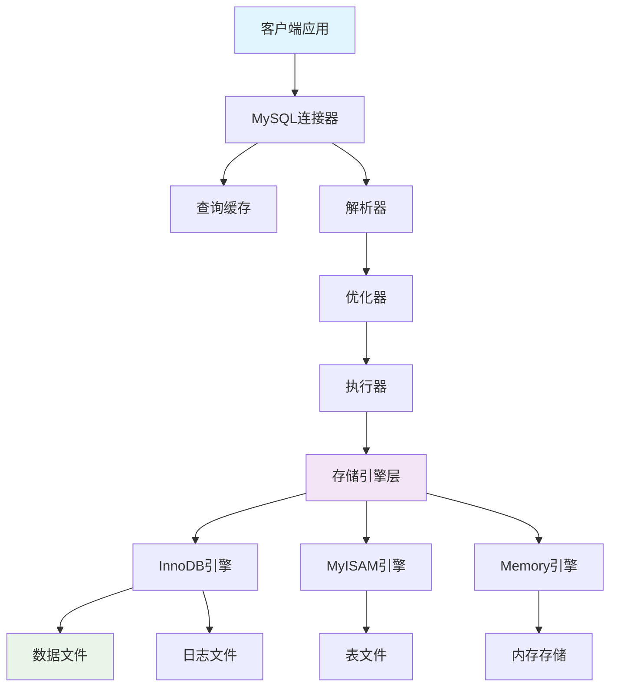
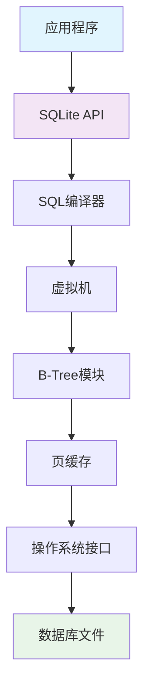
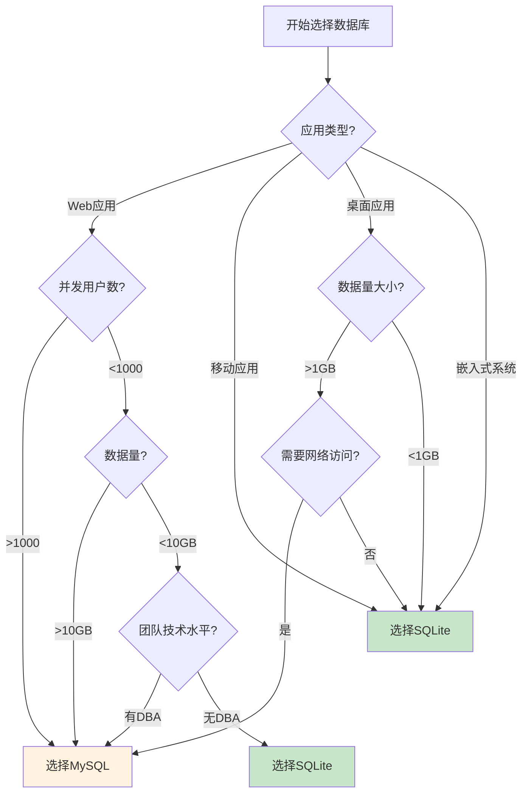

# 一、数据库概述

## （一）MySQL简介

MySQL是世界上最流行的开源关系型数据库管理系统之一，由瑞典MySQL AB公司开发，现在属于Oracle公司。MySQL以其高性能、可靠性和易用性而闻名，广泛应用于Web应用程序、企业级应用和云服务中。

### 主要特点：
- **客户端-服务器架构**：支持多用户并发访问
- **高性能**：优化的查询引擎和索引机制
- **可扩展性**：支持主从复制、分库分表
- **企业级功能**：事务支持、ACID特性、存储过程
- **跨平台**：支持多种操作系统

## （二）SQLite简介

SQLite是一个轻量级的嵌入式关系型数据库引擎，由D. Richard Hipp于2000年创建。SQLite将整个数据库存储在单个文件中，不需要独立的服务器进程，被广泛应用于移动应用、桌面软件和小型Web应用中。

### 主要特点：
- **无服务器架构**：直接嵌入到应用程序中
- **零配置**：无需安装和配置
- **单文件数据库**：整个数据库存储在一个文件中
- **轻量级**：库文件大小仅几百KB
- **自包含**：无外部依赖

# 二、架构差异深度分析

## （一）系统架构对比

### 1. MySQL架构



**MySQL采用分层架构：**
- **连接层**：处理客户端连接和认证
- **服务层**：SQL解析、优化、缓存
- **引擎层**：数据存储和检索
- **存储层**：物理文件系统

### 2. SQLite架构



**SQLite采用嵌入式架构：**
- **API层**：提供编程接口
- **编译器**：SQL语句编译
- **虚拟机**：执行字节码
- **存储层**：单文件存储

## （二）部署模式对比

### 1. MySQL部署

```bash
# MySQL服务器端部署
# 1. 安装MySQL服务器
sudo apt-get install mysql-server

# 2. 启动MySQL服务
sudo systemctl start mysql

# 3. 配置MySQL
sudo mysql_secure_installation

# 4. 创建数据库和用户
mysql -u root -p
CREATE DATABASE myapp;
CREATE USER 'appuser'@'localhost' IDENTIFIED BY 'password';
GRANT ALL PRIVILEGES ON myapp.* TO 'appuser'@'localhost';

# 5. 客户端连接
mysql -h localhost -u appuser -p myapp
```

### 2. SQLite部署

```bash
# SQLite嵌入式部署
# 1. 安装SQLite（通常已内置在系统中）
sudo apt-get install sqlite3

# 2. 创建数据库（直接创建文件）
sqlite3 myapp.db

# 3. 在应用程序中使用
# 无需服务器配置，直接引用数据库文件
```

```python
# Python中使用SQLite示例
import sqlite3

# 连接数据库（如果不存在会自动创建）
conn = sqlite3.connect('myapp.db')
cursor = conn.cursor()

# 创建表
cursor.execute('''
    CREATE TABLE IF NOT EXISTS users (
        id INTEGER PRIMARY KEY,
        name TEXT NOT NULL,
        email TEXT UNIQUE
    )
''')

# 插入数据
cursor.execute("INSERT INTO users (name, email) VALUES (?, ?)",
               ("张三", "zhangsan@example.com"))

conn.commit()
conn.close()
```

# 三、核心特性对比

## （一）数据类型支持

### 1. MySQL数据类型

```sql
-- MySQL支持丰富的数据类型
CREATE TABLE mysql_types_demo (
    -- 数值类型
    tiny_int TINYINT,                    -- 1字节整数
    small_int SMALLINT,                  -- 2字节整数
    medium_int MEDIUMINT,                -- 3字节整数
    int_val INT,                         -- 4字节整数
    big_int BIGINT,                      -- 8字节整数
    decimal_val DECIMAL(10,2),           -- 精确小数
    float_val FLOAT,                     -- 单精度浮点
    double_val DOUBLE,                   -- 双精度浮点

    -- 字符串类型
    char_val CHAR(10),                   -- 固定长度字符串
    varchar_val VARCHAR(255),            -- 可变长度字符串
    text_val TEXT,                       -- 长文本
    longtext_val LONGTEXT,               -- 超长文本

    -- 日期时间类型
    date_val DATE,                       -- 日期
    time_val TIME,                       -- 时间
    datetime_val DATETIME,               -- 日期时间
    timestamp_val TIMESTAMP,             -- 时间戳
    year_val YEAR,                       -- 年份

    -- 二进制类型
    binary_val BINARY(16),               -- 固定长度二进制
    varbinary_val VARBINARY(255),        -- 可变长度二进制
    blob_val BLOB,                       -- 二进制大对象

    -- JSON类型（MySQL 5.7+）
    json_val JSON,                       -- JSON数据

    -- 几何类型
    point_val POINT,                     -- 点
    geometry_val GEOMETRY                -- 几何对象
);
```

### 2. SQLite数据类型

```sql
-- SQLite使用动态类型系统，只有5种存储类
CREATE TABLE sqlite_types_demo (
    -- SQLite的5种存储类
    null_val NULL,                       -- 空值
    integer_val INTEGER,                 -- 整数（可变长度）
    real_val REAL,                       -- 浮点数
    text_val TEXT,                       -- 文本字符串
    blob_val BLOB,                       -- 二进制数据

    -- SQLite的类型亲和性（Type Affinity）
    int_affinity INTEGER,                -- 整数亲和性
    text_affinity TEXT,                  -- 文本亲和性
    blob_affinity BLOB,                  -- 二进制亲和性
    real_affinity REAL,                  -- 实数亲和性
    numeric_affinity NUMERIC             -- 数值亲和性
);

-- SQLite的灵活性示例：同一列可以存储不同类型的数据
INSERT INTO sqlite_types_demo (integer_val) VALUES
    (123),                               -- 整数
    (123.45),                           -- 浮点数
    ('123'),                            -- 文本
    (X'313233');                        -- 二进制
```

## （二）并发控制机制

### 1. MySQL并发控制

```sql
-- MySQL支持多种隔离级别
-- 1. 读未提交（READ UNCOMMITTED）
SET SESSION TRANSACTION ISOLATION LEVEL READ UNCOMMITTED;

-- 2. 读已提交（READ COMMITTED）
SET SESSION TRANSACTION ISOLATION LEVEL READ COMMITTED;

-- 3. 可重复读（REPEATABLE READ）- 默认级别
SET SESSION TRANSACTION ISOLATION LEVEL REPEATABLE READ;

-- 4. 串行化（SERIALIZABLE）
SET SESSION TRANSACTION ISOLATION LEVEL SERIALIZABLE;

-- MySQL的锁机制
-- 表级锁
LOCK TABLES users READ;
LOCK TABLES users WRITE;
UNLOCK TABLES;

-- 行级锁（InnoDB引擎）
BEGIN;
SELECT * FROM users WHERE id = 1 FOR UPDATE;  -- 排他锁
SELECT * FROM users WHERE id = 1 LOCK IN SHARE MODE;  -- 共享锁
COMMIT;
```

### 2. SQLite并发控制

```sql
-- SQLite的锁机制相对简单
-- 1. 共享锁（SHARED）：多个读操作可以并发
-- 2. 保留锁（RESERVED）：准备写入，但允许读操作
-- 3. 待定锁（PENDING）：等待所有读操作完成
-- 4. 排他锁（EXCLUSIVE）：独占访问，不允许其他操作

-- SQLite的事务模式
BEGIN;                                   -- 开始事务
BEGIN IMMEDIATE;                         -- 立即获取保留锁
BEGIN EXCLUSIVE;                         -- 立即获取排他锁

-- WAL模式提供更好的并发性
PRAGMA journal_mode = WAL;               -- 启用WAL模式
```

## （三）索引机制对比

### 1. MySQL索引

```sql
-- MySQL支持多种索引类型
CREATE TABLE mysql_index_demo (
    id INT PRIMARY KEY,                  -- 主键索引（聚簇索引）
    name VARCHAR(100),
    email VARCHAR(100),
    age INT,
    content TEXT,
    location POINT
);

-- 普通索引
CREATE INDEX idx_name ON mysql_index_demo(name);

-- 唯一索引
CREATE UNIQUE INDEX idx_email ON mysql_index_demo(email);

-- 复合索引
CREATE INDEX idx_name_age ON mysql_index_demo(name, age);

-- 前缀索引
CREATE INDEX idx_content_prefix ON mysql_index_demo(content(10));

-- 全文索引
CREATE FULLTEXT INDEX idx_content_fulltext ON mysql_index_demo(content);

-- 空间索引
CREATE SPATIAL INDEX idx_location ON mysql_index_demo(location);

-- 函数索引（MySQL 8.0+）
CREATE INDEX idx_name_upper ON mysql_index_demo((UPPER(name)));
```

### 2. SQLite索引

```sql
-- SQLite索引相对简单但高效
CREATE TABLE sqlite_index_demo (
    id INTEGER PRIMARY KEY,              -- 主键索引（ROWID）
    name TEXT,
    email TEXT,
    age INTEGER,
    content TEXT
);

-- 普通索引
CREATE INDEX idx_name ON sqlite_index_demo(name);

-- 唯一索引
CREATE UNIQUE INDEX idx_email ON sqlite_index_demo(email);

-- 复合索引
CREATE INDEX idx_name_age ON sqlite_index_demo(name, age);

-- 部分索引（条件索引）
CREATE INDEX idx_active_users ON sqlite_index_demo(name)
WHERE age > 18;

-- 表达式索引
CREATE INDEX idx_name_lower ON sqlite_index_demo(LOWER(name));

-- 覆盖索引
CREATE INDEX idx_covering ON sqlite_index_demo(name, age, email);
```

# 四、性能特性分析

## （一）查询性能对比

### 1. 简单查询性能测试

```python
import time
import sqlite3
import mysql.connector

# 性能测试函数
def performance_test():
    # SQLite测试
    sqlite_conn = sqlite3.connect('test.db')
    sqlite_cursor = sqlite_conn.cursor()

    # 创建测试表
    sqlite_cursor.execute('''
        CREATE TABLE IF NOT EXISTS test_table (
            id INTEGER PRIMARY KEY,
            name TEXT,
            value INTEGER
        )
    ''')

    # 插入测试数据
    start_time = time.time()
    for i in range(10000):
        sqlite_cursor.execute(
            "INSERT INTO test_table (name, value) VALUES (?, ?)",
            (f"name_{i}", i)
        )
    sqlite_conn.commit()
    sqlite_insert_time = time.time() - start_time

    # 查询测试
    start_time = time.time()
    sqlite_cursor.execute("SELECT * FROM test_table WHERE value > 5000")
    results = sqlite_cursor.fetchall()
    sqlite_query_time = time.time() - start_time

    sqlite_conn.close()

    print(f"SQLite插入10000条记录耗时: {sqlite_insert_time:.2f}秒")
    print(f"SQLite查询耗时: {sqlite_query_time:.4f}秒")
    print(f"SQLite查询结果数量: {len(results)}")
```

### 2. 复杂查询性能

```sql
-- MySQL复杂查询示例
-- 多表关联查询
SELECT
    u.name,
    u.email,
    COUNT(o.id) as order_count,
    SUM(o.amount) as total_amount,
    AVG(o.amount) as avg_amount
FROM users u
LEFT JOIN orders o ON u.id = o.user_id
WHERE u.created_at >= '2024-01-01'
GROUP BY u.id, u.name, u.email
HAVING COUNT(o.id) > 5
ORDER BY total_amount DESC
LIMIT 100;

-- 子查询优化
SELECT * FROM users
WHERE id IN (
    SELECT user_id FROM orders
    WHERE amount > (
        SELECT AVG(amount) FROM orders
    )
);

-- 窗口函数（MySQL 8.0+）
SELECT
    name,
    amount,
    ROW_NUMBER() OVER (ORDER BY amount DESC) as rank,
    SUM(amount) OVER (ORDER BY amount DESC) as running_total
FROM orders;
```

```sql
-- SQLite复杂查询示例
-- 公用表表达式（CTE）
WITH RECURSIVE fibonacci(n, fib_n, next_fib_n) AS (
    SELECT 1, 0, 1
    UNION ALL
    SELECT n+1, next_fib_n, fib_n + next_fib_n
    FROM fibonacci
    WHERE n < 10
)
SELECT n, fib_n FROM fibonacci;

-- JSON查询（SQLite 3.38+）
SELECT
    json_extract(data, '$.name') as name,
    json_extract(data, '$.age') as age
FROM json_table
WHERE json_extract(data, '$.active') = 1;
```

## （二）存储效率对比

### 1. 存储空间占用

| 数据量 | MySQL (InnoDB) | SQLite | 说明 |
|--------|----------------|--------|------|
| **1万条记录** | ~2MB | ~800KB | SQLite更紧凑 |
| **10万条记录** | ~20MB | ~8MB | SQLite优势明显 |
| **100万条记录** | ~200MB | ~80MB | SQLite空间效率高 |
| **1000万条记录** | ~2GB | ~800MB | 大数据量时差异显著 |

### 2. 存储机制差异

```sql
-- MySQL存储特点
-- 1. 页面大小：16KB（默认）
-- 2. 聚簇索引：数据和主键索引存储在一起
-- 3. 二级索引：存储主键值，需要回表查询

-- 查看MySQL表空间信息
SELECT
    table_name,
    ROUND(((data_length + index_length) / 1024 / 1024), 2) AS 'Size (MB)',
    ROUND((data_length / 1024 / 1024), 2) AS 'Data Size (MB)',
    ROUND((index_length / 1024 / 1024), 2) AS 'Index Size (MB)'
FROM information_schema.tables
WHERE table_schema = 'your_database';
```

```sql
-- SQLite存储特点
-- 1. 页面大小：4KB（默认，可配置）
-- 2. B-Tree结构：所有数据存储在B-Tree中
-- 3. ROWID：隐式主键，高效访问

-- 查看SQLite数据库信息
PRAGMA page_size;                        -- 页面大小
PRAGMA page_count;                       -- 页面数量
PRAGMA freelist_count;                   -- 空闲页面数
PRAGMA integrity_check;                  -- 完整性检查

-- 分析表空间使用
.schema                                  -- 查看表结构
.tables                                  -- 列出所有表
.dbinfo                                  -- 数据库信息
```

# 五、功能特性对比

## （一）高级功能支持

### 1. MySQL高级功能

```sql
-- 存储过程
DELIMITER //
CREATE PROCEDURE GetUserOrders(IN user_id INT)
BEGIN
    DECLARE done INT DEFAULT FALSE;
    DECLARE order_count INT;

    -- 获取用户订单数量
    SELECT COUNT(*) INTO order_count
    FROM orders
    WHERE user_id = user_id;

    -- 返回结果
    SELECT order_count as total_orders;

    -- 详细订单信息
    SELECT * FROM orders WHERE user_id = user_id;
END //
DELIMITER ;

-- 调用存储过程
CALL GetUserOrders(123);

-- 触发器
CREATE TRIGGER update_user_stats
AFTER INSERT ON orders
FOR EACH ROW
BEGIN
    UPDATE users
    SET order_count = order_count + 1,
        total_spent = total_spent + NEW.amount
    WHERE id = NEW.user_id;
END;

-- 视图
CREATE VIEW user_order_summary AS
SELECT
    u.id,
    u.name,
    u.email,
    COUNT(o.id) as order_count,
    COALESCE(SUM(o.amount), 0) as total_spent
FROM users u
LEFT JOIN orders o ON u.id = o.user_id
GROUP BY u.id, u.name, u.email;

-- 分区表
CREATE TABLE orders_partitioned (
    id INT AUTO_INCREMENT,
    user_id INT,
    amount DECIMAL(10,2),
    created_at DATE,
    PRIMARY KEY (id, created_at)
)
PARTITION BY RANGE (YEAR(created_at)) (
    PARTITION p2022 VALUES LESS THAN (2023),
    PARTITION p2023 VALUES LESS THAN (2024),
    PARTITION p2024 VALUES LESS THAN (2025),
    PARTITION p_future VALUES LESS THAN MAXVALUE
);
```

### 2. SQLite功能特性

```sql
-- SQLite的独特功能

-- 1. 虚拟表
CREATE VIRTUAL TABLE fts_search USING fts5(title, content);
INSERT INTO fts_search VALUES ('标题1', '这是内容1');
SELECT * FROM fts_search WHERE fts_search MATCH '内容';

-- 2. 公用表表达式（CTE）
WITH RECURSIVE category_tree(id, name, parent_id, level) AS (
    -- 根节点
    SELECT id, name, parent_id, 0 as level
    FROM categories
    WHERE parent_id IS NULL

    UNION ALL

    -- 递归部分
    SELECT c.id, c.name, c.parent_id, ct.level + 1
    FROM categories c
    JOIN category_tree ct ON c.parent_id = ct.id
)
SELECT * FROM category_tree ORDER BY level, name;

-- 3. 窗口函数
SELECT
    name,
    salary,
    department,
    AVG(salary) OVER (PARTITION BY department) as dept_avg,
    RANK() OVER (PARTITION BY department ORDER BY salary DESC) as dept_rank
FROM employees;

-- 4. JSON支持
CREATE TABLE products (
    id INTEGER PRIMARY KEY,
    name TEXT,
    attributes JSON
);

INSERT INTO products VALUES
(1, '笔记本电脑', '{"brand": "Dell", "cpu": "Intel i7", "ram": "16GB"}'),
(2, '手机', '{"brand": "iPhone", "storage": "128GB", "color": "黑色"}');

-- JSON查询
SELECT
    name,
    json_extract(attributes, '$.brand') as brand,
    json_extract(attributes, '$.cpu') as cpu
FROM products
WHERE json_extract(attributes, '$.brand') = 'Dell';
```

## （二）扩展性对比

### 1. MySQL扩展性

```sql
-- 主从复制配置
-- 主服务器配置
[mysqld]
server-id = 1
log-bin = mysql-bin
binlog-format = ROW

-- 从服务器配置
[mysqld]
server-id = 2
relay-log = mysql-relay-bin
read-only = 1

-- 设置主从复制
CHANGE MASTER TO
    MASTER_HOST = '192.168.1.100',
    MASTER_USER = 'replication_user',
    MASTER_PASSWORD = 'password',
    MASTER_LOG_FILE = 'mysql-bin.000001',
    MASTER_LOG_POS = 154;

START SLAVE;

-- 分库分表示例
-- 水平分表
CREATE TABLE orders_2024_q1 LIKE orders;
CREATE TABLE orders_2024_q2 LIKE orders;
CREATE TABLE orders_2024_q3 LIKE orders;
CREATE TABLE orders_2024_q4 LIKE orders;

-- 垂直分库
-- 用户库
CREATE DATABASE user_db;
-- 订单库
CREATE DATABASE order_db;
-- 商品库
CREATE DATABASE product_db;
```

### 2. SQLite扩展性

```python
# SQLite的扩展方式主要通过应用层实现

# 1. 读写分离
class SQLiteManager:
    def __init__(self, db_path):
        self.db_path = db_path
        self.read_connections = []
        self.write_connection = None

    def get_read_connection(self):
        """获取只读连接"""
        conn = sqlite3.connect(f"file:{self.db_path}?mode=ro", uri=True)
        return conn

    def get_write_connection(self):
        """获取读写连接"""
        if not self.write_connection:
            self.write_connection = sqlite3.connect(self.db_path)
        return self.write_connection

# 2. 数据分片
class SQLiteSharding:
    def __init__(self, shard_count=4):
        self.shard_count = shard_count
        self.connections = {}

        for i in range(shard_count):
            db_path = f"shard_{i}.db"
            self.connections[i] = sqlite3.connect(db_path)

    def get_shard(self, key):
        """根据键值确定分片"""
        return hash(key) % self.shard_count

    def insert(self, table, key, data):
        """插入数据到对应分片"""
        shard_id = self.get_shard(key)
        conn = self.connections[shard_id]
        # 执行插入操作

    def query(self, table, key):
        """从对应分片查询数据"""
        shard_id = self.get_shard(key)
        conn = self.connections[shard_id]
        # 执行查询操作

# 3. 连接池
import threading
from queue import Queue

class SQLiteConnectionPool:
    def __init__(self, db_path, pool_size=10):
        self.db_path = db_path
        self.pool = Queue(maxsize=pool_size)
        self.lock = threading.Lock()

        # 初始化连接池
        for _ in range(pool_size):
            conn = sqlite3.connect(db_path, check_same_thread=False)
            self.pool.put(conn)

    def get_connection(self):
        """获取连接"""
        return self.pool.get()

    def return_connection(self, conn):
        """归还连接"""
        self.pool.put(conn)
```

# 六、应用场景分析

## （一）MySQL适用场景

### 1. 企业级Web应用

```java
// Spring Boot + MySQL企业应用示例
@RestController
@RequestMapping("/api/users")
public class UserController {

    @Autowired
    private UserService userService;

    // 高并发用户查询
    @GetMapping
    public ResponseEntity<PageResult<User>> getUsers(
            @RequestParam(defaultValue = "0") int page,
            @RequestParam(defaultValue = "20") int size) {

        PageResult<User> result = userService.getUsers(page, size);
        return ResponseEntity.ok(result);
    }

    // 复杂业务逻辑处理
    @PostMapping("/{id}/orders")
    @Transactional
    public ResponseEntity<Order> createOrder(
            @PathVariable Long id,
            @RequestBody CreateOrderRequest request) {

        // 1. 验证用户
        User user = userService.findById(id);
        if (user == null) {
            throw new UserNotFoundException("用户不存在");
        }

        // 2. 检查库存
        Product product = productService.findById(request.getProductId());
        if (product.getStock() < request.getQuantity()) {
            throw new InsufficientStockException("库存不足");
        }

        // 3. 创建订单（涉及多表操作）
        Order order = orderService.createOrder(user, product, request.getQuantity());

        // 4. 更新库存
        productService.updateStock(product.getId(), -request.getQuantity());

        // 5. 记录日志
        auditService.logOrderCreation(order);

        return ResponseEntity.ok(order);
    }
}
```

### 2. 大数据分析平台

```sql
-- MySQL在数据分析中的应用
-- 1. 用户行为分析
SELECT
    DATE(created_at) as date,
    COUNT(DISTINCT user_id) as daily_active_users,
    COUNT(*) as total_events,
    AVG(session_duration) as avg_session_duration
FROM user_events
WHERE created_at >= DATE_SUB(NOW(), INTERVAL 30 DAY)
GROUP BY DATE(created_at)
ORDER BY date;

-- 2. 销售数据分析
SELECT
    p.category,
    YEAR(o.created_at) as year,
    MONTH(o.created_at) as month,
    SUM(oi.quantity * oi.price) as revenue,
    COUNT(DISTINCT o.user_id) as unique_customers,
    AVG(oi.quantity * oi.price) as avg_order_value
FROM orders o
JOIN order_items oi ON o.id = oi.order_id
JOIN products p ON oi.product_id = p.id
WHERE o.created_at >= '2024-01-01'
GROUP BY p.category, YEAR(o.created_at), MONTH(o.created_at)
ORDER BY year, month, revenue DESC;
```

## （二）SQLite适用场景

### 1. 移动应用开发

```kotlin
// Android应用中使用SQLite
class DatabaseHelper(context: Context) : SQLiteOpenHelper(
    context, DATABASE_NAME, null, DATABASE_VERSION
) {

    companion object {
        private const val DATABASE_NAME = "app_database.db"
        private const val DATABASE_VERSION = 1
    }

    override fun onCreate(db: SQLiteDatabase) {
        // 创建用户表
        val createUsersTable = """
            CREATE TABLE users (
                id INTEGER PRIMARY KEY AUTOINCREMENT,
                name TEXT NOT NULL,
                email TEXT UNIQUE NOT NULL,
                created_at DATETIME DEFAULT CURRENT_TIMESTAMP
            )
        """.trimIndent()

        db.execSQL(createUsersTable)
    }

    // 用户操作
    fun insertUser(name: String, email: String): Long {
        val db = writableDatabase
        val values = ContentValues().apply {
            put("name", name)
            put("email", email)
        }
        return db.insert("users", null, values)
    }
}
```

### 2. 桌面应用配置管理

```python
# Python桌面应用中使用SQLite
import sqlite3
import json

class ConfigManager:
    """配置管理器 - 使用SQLite存储应用配置"""

    def __init__(self, db_path: str = "app_config.db"):
        self.db_path = db_path
        self.init_database()

    def init_database(self):
        """初始化数据库"""
        with sqlite3.connect(self.db_path) as conn:
            conn.execute("""
                CREATE TABLE IF NOT EXISTS configs (
                    key TEXT PRIMARY KEY,
                    value TEXT NOT NULL,
                    type TEXT NOT NULL DEFAULT 'string',
                    updated_at DATETIME DEFAULT CURRENT_TIMESTAMP
                )
            """)

    def set_config(self, key: str, value: any):
        """设置配置项"""
        value_type = type(value).__name__
        value_str = json.dumps(value) if value_type in ['dict', 'list'] else str(value)

        with sqlite3.connect(self.db_path) as conn:
            conn.execute("""
                INSERT OR REPLACE INTO configs (key, value, type, updated_at)
                VALUES (?, ?, ?, CURRENT_TIMESTAMP)
            """, (key, value_str, value_type))

    def get_config(self, key: str, default=None):
        """获取配置项"""
        with sqlite3.connect(self.db_path) as conn:
            cursor = conn.execute(
                "SELECT value, type FROM configs WHERE key = ?", (key,)
            )
            row = cursor.fetchone()

            if row is None:
                return default

            value_str, value_type = row

            # 根据类型转换值
            if value_type == 'int':
                return int(value_str)
            elif value_type == 'float':
                return float(value_str)
            elif value_type == 'bool':
                return value_str.lower() == 'true'
            elif value_type in ['dict', 'list']:
                return json.loads(value_str)
            else:
                return value_str
```

# 七、选择决策指南

## （一）综合对比表

| 特性维度 | MySQL | SQLite | 推荐场景 |
|----------|-------|--------|----------|
| **架构模式** | 客户端-服务器 | 嵌入式 | MySQL适合分布式，SQLite适合单机 |
| **并发性能** | 高（支持数千并发） | 中等（读并发好，写并发有限） | 高并发选MySQL |
| **数据量支持** | TB级别 | GB级别 | 大数据量选MySQL |
| **部署复杂度** | 复杂（需要服务器配置） | 简单（零配置） | 快速开发选SQLite |
| **维护成本** | 高（需要DBA） | 低（几乎无维护） | 资源有限选SQLite |
| **扩展性** | 优秀（主从复制、分库分表） | 有限（应用层扩展） | 需要扩展选MySQL |
| **事务支持** | 完整ACID | 完整ACID | 两者都支持 |
| **SQL标准** | 高度兼容 | 基本兼容 | 复杂SQL选MySQL |
| **存储效率** | 中等 | 优秀 | 存储敏感选SQLite |
| **跨平台性** | 优秀 | 优秀 | 两者都支持 |

## （二）决策流程图



## （三）具体选择建议

### ✅ 选择MySQL的情况

1. **Web应用程序**
   - 多用户并发访问
   - 需要远程数据库访问
   - 复杂的业务逻辑和事务处理

2. **企业级应用**
   - 大数据量处理（>10GB）
   - 需要高可用性和容灾
   - 有专业的数据库管理团队

3. **数据分析平台**
   - 复杂的SQL查询和报表
   - 需要存储过程和触发器
   - 数据仓库和OLAP应用

### ✅ 选择SQLite的情况

1. **移动应用**
   - iOS/Android应用的本地存储
   - 离线数据缓存
   - 用户配置和偏好设置

2. **桌面软件**
   - 单用户应用程序
   - 配置文件存储
   - 小型数据管理工具

3. **嵌入式系统**
   - IoT设备数据存储
   - 资源受限的环境
   - 无需网络访问的场景

4. **原型开发**
   - 快速原型验证
   - 学习和测试环境
   - 简单的Web应用

# 八、总结与建议

## （一）核心差异总结

1. **架构理念**：
   - **MySQL**：传统的客户端-服务器架构，适合分布式环境
   - **SQLite**：嵌入式架构，适合单机应用

2. **性能特点**：
   - **MySQL**：高并发、大数据量处理能力强
   - **SQLite**：轻量级、低延迟、存储效率高

3. **使用复杂度**：
   - **MySQL**：需要专业配置和维护
   - **SQLite**：零配置，开箱即用

4. **扩展能力**：
   - **MySQL**：原生支持集群、复制、分片
   - **SQLite**：需要应用层实现扩展

## （二）最佳实践建议

### 🎯 **选择原则**

1. **根据应用规模选择**：
   - 小型应用（<1000用户）→ SQLite
   - 中大型应用（>1000用户）→ MySQL

2. **根据部署环境选择**：
   - 单机部署 → SQLite
   - 分布式部署 → MySQL

3. **根据团队能力选择**：
   - 无DBA团队 → SQLite
   - 有DBA团队 → MySQL

### 🔧 **优化建议**

1. **SQLite优化**：
   - 启用WAL模式提高并发性
   - 合理设置页面大小和缓存
   - 定期执行VACUUM清理碎片

2. **MySQL优化**：
   - 选择合适的存储引擎
   - 优化索引和查询
   - 配置合理的连接池

### 🚀 **发展趋势**

1. **SQLite发展方向**：
   - 更好的并发支持
   - 增强的JSON功能
   - 改进的全文搜索

2. **MySQL发展方向**：
   - 云原生优化
   - 机器学习集成
   - 更好的分布式支持


**MySQL和SQLite各有优势，选择合适的数据库需要综合考虑应用场景、性能需求、团队能力和维护成本。在某些情况下，混合使用两种数据库可能是最佳方案。**


---

**参考资料：**
1. [MySQL官方文档](https://dev.mysql.com/doc/)
2. [SQLite官方文档](https://www.sqlite.org/docs.html)
3. [数据库系统概念](https://www.db-book.com/)
4. [高性能MySQL](https://www.oreilly.com/library/view/high-performance-mysql/9781449332471/)
5. [SQLite权威指南](https://www.sqlite.org/books.html)
6. [数据库选型最佳实践](https://aws.amazon.com/cn/products/databases/)