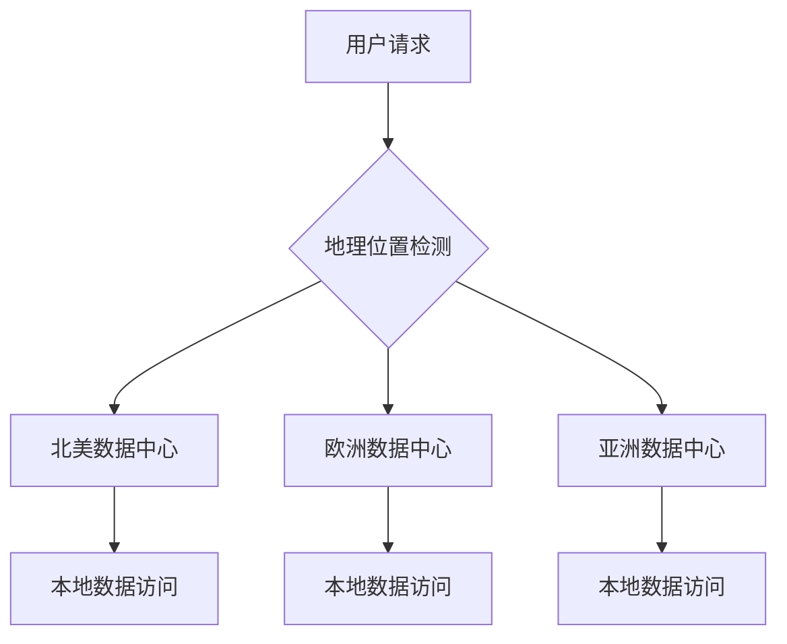

随着全球化业务的快速发展，现代应用程序需要为分布在世界各地的用户提供低延迟、高可用的服务。数据库地理分片作为一种重要的分布式数据库技术，通过将数据按地理位置进行分片存储，实现了数据的就近访问和跨地区的高可用性。本文将深入探讨数据库地理分片的核心概念、实现方案以及跨地区读写策略。

# 一、数据库地理分片概述

## （一）什么是地理分片

**地理分片（Geo-Sharding）** 是一种数据库水平分片技术，它根据地理位置将数据分布到不同地区的数据库节点上。与传统的基于哈希或范围的分片不同，地理分片主要考虑数据的地理属性和用户的地理位置。

### 核心特征

- **地理位置感知**：根据数据的地理属性或用户位置进行分片
- **就近访问**：用户可以访问距离最近的数据节点
- **跨地区分布**：数据分布在多个地理位置的数据中心
- **高可用性**：单个地区故障不影响其他地区的服务

## （二）地理分片的优势

### 1. 延迟优化



通过将数据存储在距离用户最近的地理位置，可以显著降低网络延迟，提升用户体验。

### 2. 数据主权合规

许多国家和地区对数据存储位置有严格的法律要求，地理分片可以确保数据存储在合规的地理位置。

### 3. 容灾能力

地理分片天然具备容灾能力，单个地区的自然灾害或基础设施故障不会影响其他地区的服务。

# 二、地理分片的实现策略

## （一）基于用户位置的分片

这是最常见的地理分片策略，根据用户的地理位置将数据分配到相应的地区。

```sql
-- 用户表分片示例
CREATE TABLE users_na (  -- 北美用户
    user_id BIGINT PRIMARY KEY,
    username VARCHAR(50),
    email VARCHAR(100),
    region VARCHAR(10) DEFAULT 'NA',
    created_at TIMESTAMP
);

CREATE TABLE users_eu (  -- 欧洲用户
    user_id BIGINT PRIMARY KEY,
    username VARCHAR(50),
    email VARCHAR(100),
    region VARCHAR(10) DEFAULT 'EU',
    created_at TIMESTAMP
);

CREATE TABLE users_ap (  -- 亚太用户
    user_id BIGINT PRIMARY KEY,
    username VARCHAR(50),
    email VARCHAR(100),
    region VARCHAR(10) DEFAULT 'AP',
    created_at TIMESTAMP
);
```

### 分片键选择策略

```java
// Java示例：基于用户地理位置的分片路由
public class GeoShardingRouter {
    
    // 根据用户IP或注册地址确定分片
    public String determineShardByUserLocation(String userLocation) {
        if (isNorthAmerica(userLocation)) {
            return "shard_na";
        } else if (isEurope(userLocation)) {
            return "shard_eu";
        } else if (isAsiaPacific(userLocation)) {
            return "shard_ap";
        }
        return "shard_default"; // 默认分片
    }
    
    // 根据用户ID前缀确定地区（预先编码地理信息）
    public String determineShardByUserId(Long userId) {
        String userIdStr = userId.toString();
        String regionPrefix = userIdStr.substring(0, 2);
        
        switch (regionPrefix) {
            case "01": return "shard_na";  // 北美
            case "02": return "shard_eu";  // 欧洲
            case "03": return "shard_ap";  // 亚太
            default: return "shard_default";
        }
    }
}
```

## （二）基于数据内容的地理分片

某些业务数据本身具有地理属性，可以根据数据内容进行地理分片。

```sql
-- 订单表按配送地址分片
CREATE TABLE orders_beijing (
    order_id BIGINT PRIMARY KEY,
    user_id BIGINT,
    delivery_city VARCHAR(50) DEFAULT 'Beijing',
    order_amount DECIMAL(10,2),
    created_at TIMESTAMP
);

CREATE TABLE orders_shanghai (
    order_id BIGINT PRIMARY KEY,
    user_id BIGINT,
    delivery_city VARCHAR(50) DEFAULT 'Shanghai',
    order_amount DECIMAL(10,2),
    created_at TIMESTAMP
);
```

## （三）混合分片策略

在实际应用中，往往需要结合多种分片策略来满足复杂的业务需求。

```java
// 混合分片策略示例
public class HybridGeoShardingStrategy {
    
    public String determineShardForOrder(Order order) {
        // 优先根据配送地址分片
        String deliveryRegion = getRegionByCity(order.getDeliveryCity());
        
        // 如果配送地址不明确，则根据用户地区分片
        if (deliveryRegion == null) {
            User user = userService.getUserById(order.getUserId());
            deliveryRegion = user.getRegion();
        }
        
        return "shard_" + deliveryRegion.toLowerCase();
    }
    
    private String getRegionByCity(String city) {
        // 城市到地区的映射逻辑
        Map<String, String> cityRegionMap = Map.of(
            "Beijing", "CN_NORTH",
            "Shanghai", "CN_EAST",
            "Guangzhou", "CN_SOUTH",
            "New York", "US_EAST",
            "Los Angeles", "US_WEST"
        );
        return cityRegionMap.get(city);
    }
}
```

# 三、跨地区读写方案

## （一）读写分离架构

在地理分片环境中，读写分离是提升性能的重要策略。

### 1. 本地读取，远程写入

```java
// 读写分离的地理分片实现
public class GeoShardingReadWriteService {
    
    private Map<String, DataSource> readDataSources;   // 本地读数据源
    private Map<String, DataSource> writeDataSources;  // 主写数据源
    
    // 本地读取操作
    public User getUserById(Long userId, String userRegion) {
        String localShard = "shard_" + userRegion;
        DataSource readDs = readDataSources.get(localShard);
        
        // 从本地分片读取数据，延迟最低
        return jdbcTemplate.queryForObject(readDs, 
            "SELECT * FROM users WHERE user_id = ?", userId);
    }
    
    // 写入操作需要考虑一致性
    public void updateUser(User user) {
        String primaryShard = determinePrimaryShard(user.getUserId());
        DataSource writeDs = writeDataSources.get(primaryShard);
        
        // 写入主分片
        jdbcTemplate.update(writeDs, 
            "UPDATE users SET username = ?, email = ? WHERE user_id = ?",
            user.getUsername(), user.getEmail(), user.getUserId());
        
        // 异步同步到其他地区的副本
        asyncReplicateToOtherRegions(user, primaryShard);
    }
}
```

### 2. 多主复制架构

```yaml
# 多主复制配置示例
geo_sharding:
  regions:
    - name: "north_america"
      master_db: "db-na-master"
      replica_dbs: ["db-na-replica1", "db-na-replica2"]
      sync_targets: ["europe", "asia_pacific"]
      
    - name: "europe"
      master_db: "db-eu-master"
      replica_dbs: ["db-eu-replica1", "db-eu-replica2"]
      sync_targets: ["north_america", "asia_pacific"]
      
    - name: "asia_pacific"
      master_db: "db-ap-master"
      replica_dbs: ["db-ap-replica1", "db-ap-replica2"]
      sync_targets: ["north_america", "europe"]
```

## （二）数据一致性策略

### 1. 最终一致性模型

```java
// 最终一致性的实现示例
public class EventualConsistencyManager {
    
    private MessageQueue replicationQueue;
    
    // 写入本地分片后，异步同步到其他地区
    public void writeWithEventualConsistency(String shardId, String sql, Object... params) {
        // 1. 写入本地分片
        DataSource localDs = getDataSource(shardId);
        jdbcTemplate.update(localDs, sql, params);
        
        // 2. 发送同步消息到其他地区
        ReplicationMessage message = new ReplicationMessage(shardId, sql, params);
        replicationQueue.send(message);
        
        // 3. 记录同步状态
        recordReplicationStatus(shardId, message.getMessageId(), "PENDING");
    }
    
    // 处理来自其他地区的同步消息
    @MessageListener
    public void handleReplicationMessage(ReplicationMessage message) {
        try {
            String targetShard = message.getTargetShard();
            DataSource targetDs = getDataSource(targetShard);
            
            // 执行同步操作
            jdbcTemplate.update(targetDs, message.getSql(), message.getParams());
            
            // 更新同步状态
            updateReplicationStatus(message.getMessageId(), "COMPLETED");
            
        } catch (Exception e) {
            // 同步失败，记录错误并重试
            handleReplicationFailure(message, e);
        }
    }
}
```

### 2. 强一致性保证

对于需要强一致性的关键业务数据，可以采用分布式事务。

```java
// 使用分布式事务保证强一致性
@Service
public class StrongConsistencyService {
    
    @Transactional
    @DistributedTransaction  // 分布式事务注解
    public void transferMoney(Long fromUserId, Long toUserId, BigDecimal amount) {
        
        // 确定涉及的分片
        String fromShard = determineShardByUserId(fromUserId);
        String toShard = determineShardByUserId(toUserId);
        
        if (fromShard.equals(toShard)) {
            // 同一分片内的事务，使用本地事务
            performLocalTransfer(fromUserId, toUserId, amount);
        } else {
            // 跨分片事务，使用两阶段提交
            performDistributedTransfer(fromUserId, toUserId, amount, fromShard, toShard);
        }
    }
    
    private void performDistributedTransfer(Long fromUserId, Long toUserId, 
                                          BigDecimal amount, String fromShard, String toShard) {
        
        TransactionManager tm = getTransactionManager();
        
        try {
            // 阶段1：准备阶段
            tm.prepare(fromShard, "UPDATE accounts SET balance = balance - ? WHERE user_id = ?", 
                      amount, fromUserId);
            tm.prepare(toShard, "UPDATE accounts SET balance = balance + ? WHERE user_id = ?", 
                      amount, toUserId);
            
            // 阶段2：提交阶段
            tm.commit(fromShard);
            tm.commit(toShard);
            
        } catch (Exception e) {
            // 回滚所有参与的分片
            tm.rollback(fromShard);
            tm.rollback(toShard);
            throw new TransferException("跨地区转账失败", e);
        }
    }
}
```

# 四、常见的地理分片方案

## （一）基于DNS的地理路由

```javascript
// 前端JavaScript示例：基于用户位置的DNS解析
class GeoRoutingClient {
    
    constructor() {
        this.regionEndpoints = {
            'NA': 'https://api-na.example.com',
            'EU': 'https://api-eu.example.com', 
            'AP': 'https://api-ap.example.com'
        };
    }
    
    // 根据用户地理位置选择API端点
    async getApiEndpoint() {
        try {
            // 获取用户地理位置
            const position = await this.getUserLocation();
            const region = this.determineRegion(position);
            
            return this.regionEndpoints[region] || this.regionEndpoints['NA'];
        } catch (error) {
            // 获取位置失败时使用默认端点
            return this.regionEndpoints['NA'];
        }
    }
    
    async getUserLocation() {
        return new Promise((resolve, reject) => {
            navigator.geolocation.getCurrentPosition(resolve, reject);
        });
    }
    
    determineRegion(position) {
        const { latitude, longitude } = position.coords;
        
        // 简化的地区判断逻辑
        if (longitude >= -180 && longitude <= -30) {
            return 'NA'; // 北美
        } else if (longitude > -30 && longitude <= 60) {
            return 'EU'; // 欧洲
        } else {
            return 'AP'; // 亚太
        }
    }
}
```

## （二）应用层分片中间件

```java
// 自定义分片中间件
@Component
public class GeoShardingMiddleware {
    
    private final Map<String, DataSource> dataSources;
    private final ShardingStrategy shardingStrategy;
    
    // 动态数据源选择
    public DataSource selectDataSource(ShardingContext context) {
        String shardKey = shardingStrategy.determineShardKey(context);
        DataSource dataSource = dataSources.get(shardKey);
        
        if (dataSource == null) {
            throw new ShardingException("未找到对应的数据源: " + shardKey);
        }
        
        return dataSource;
    }
    
    // 执行分片查询
    public <T> List<T> executeShardingQuery(String sql, Class<T> resultType, 
                                           ShardingContext context) {
        
        if (context.isGlobalQuery()) {
            // 全局查询需要在所有分片上执行
            return executeGlobalQuery(sql, resultType);
        } else {
            // 单分片查询
            DataSource ds = selectDataSource(context);
            return jdbcTemplate.query(ds, sql, new BeanPropertyRowMapper<>(resultType));
        }
    }
    
    private <T> List<T> executeGlobalQuery(String sql, Class<T> resultType) {
        List<T> results = new ArrayList<>();
        
        // 并行查询所有分片
        List<CompletableFuture<List<T>>> futures = dataSources.values().stream()
            .map(ds -> CompletableFuture.supplyAsync(() -> 
                jdbcTemplate.query(ds, sql, new BeanPropertyRowMapper<>(resultType))))
            .collect(Collectors.toList());
        
        // 合并结果
        futures.forEach(future -> {
            try {
                results.addAll(future.get());
            } catch (Exception e) {
                log.error("分片查询失败", e);
            }
        });
        
        return results;
    }
}
```

# 五、地理分片面临的挑战与解决方案

## （一）数据一致性挑战

### 1. 跨地区网络延迟

跨地区的网络延迟是地理分片面临的最大挑战之一，通常在100-300ms之间。

```java
// 网络延迟监控和优化
public class NetworkLatencyOptimizer {

    private final Map<String, Long> regionLatencies = new ConcurrentHashMap<>();

    // 定期测量各地区延迟
    @Scheduled(fixedRate = 30000) // 每30秒测量一次
    public void measureRegionLatencies() {
        for (String region : getAllRegions()) {
            long startTime = System.currentTimeMillis();

            try {
                // 发送心跳包测量延迟
                pingRegion(region);
                long latency = System.currentTimeMillis() - startTime;
                regionLatencies.put(region, latency);

            } catch (Exception e) {
                // 网络不可达时设置高延迟值
                regionLatencies.put(region, Long.MAX_VALUE);
            }
        }
    }

    // 根据延迟选择最优的同步策略
    public SyncStrategy chooseSyncStrategy(String targetRegion) {
        Long latency = regionLatencies.get(targetRegion);

        if (latency == null || latency > 200) {
            return SyncStrategy.ASYNC; // 高延迟时使用异步同步
        } else if (latency > 50) {
            return SyncStrategy.SEMI_SYNC; // 中等延迟使用半同步
        } else {
            return SyncStrategy.SYNC; // 低延迟可以使用同步
        }
    }
}
```

### 2. 数据冲突解决

当多个地区同时修改相同数据时，需要有效的冲突解决机制。

```java
// 基于时间戳的冲突解决
public class ConflictResolver {

    // 使用向量时钟解决冲突
    public DataRecord resolveConflict(List<DataRecord> conflictingRecords) {

        // 按最后修改时间排序
        conflictingRecords.sort((r1, r2) ->
            r2.getLastModified().compareTo(r1.getLastModified()));

        DataRecord winner = conflictingRecords.get(0);

        // 记录冲突解决日志
        logConflictResolution(conflictingRecords, winner);

        return winner;
    }

    // 基于业务规则的冲突解决
    public DataRecord resolveByBusinessRule(List<DataRecord> conflictingRecords) {

        // 示例：金额字段取最大值，其他字段取最新值
        DataRecord result = new DataRecord();

        // 取最新的时间戳
        result.setLastModified(conflictingRecords.stream()
            .map(DataRecord::getLastModified)
            .max(Comparator.naturalOrder())
            .orElse(new Date()));

        // 金额字段取最大值
        BigDecimal maxAmount = conflictingRecords.stream()
            .map(DataRecord::getAmount)
            .max(Comparator.naturalOrder())
            .orElse(BigDecimal.ZERO);
        result.setAmount(maxAmount);

        // 其他字段取最新记录的值
        DataRecord latestRecord = conflictingRecords.stream()
            .max(Comparator.comparing(DataRecord::getLastModified))
            .orElse(conflictingRecords.get(0));

        result.setDescription(latestRecord.getDescription());
        result.setStatus(latestRecord.getStatus());

        return result;
    }
}
```

## （二）跨分片查询复杂性

### 1. 分布式JOIN查询

```java
// 分布式JOIN查询实现
public class DistributedJoinProcessor {

    // 跨分片JOIN查询
    public List<OrderWithUser> getOrdersWithUsers(String region, Date startDate, Date endDate) {

        // 1. 先从本地分片查询订单
        List<Order> orders = getOrdersFromRegion(region, startDate, endDate);

        // 2. 提取需要查询的用户ID
        Set<Long> userIds = orders.stream()
            .map(Order::getUserId)
            .collect(Collectors.toSet());

        // 3. 根据用户ID确定需要查询的分片
        Map<String, Set<Long>> userIdsByRegion = groupUserIdsByRegion(userIds);

        // 4. 并行查询各个分片的用户信息
        Map<Long, User> userMap = new ConcurrentHashMap<>();

        List<CompletableFuture<Void>> futures = userIdsByRegion.entrySet().stream()
            .map(entry -> CompletableFuture.runAsync(() -> {
                String userRegion = entry.getKey();
                Set<Long> regionUserIds = entry.getValue();

                List<User> users = getUsersFromRegion(userRegion, regionUserIds);
                users.forEach(user -> userMap.put(user.getUserId(), user));
            }))
            .collect(Collectors.toList());

        // 5. 等待所有查询完成
        CompletableFuture.allOf(futures.toArray(new CompletableFuture[0])).join();

        // 6. 组装最终结果
        return orders.stream()
            .map(order -> new OrderWithUser(order, userMap.get(order.getUserId())))
            .collect(Collectors.toList());
    }

    private Map<String, Set<Long>> groupUserIdsByRegion(Set<Long> userIds) {
        return userIds.stream()
            .collect(Collectors.groupingBy(
                this::determineUserRegion,
                Collectors.toSet()
            ));
    }
}
```

### 2. 分布式聚合查询

```java
// 分布式聚合查询
public class DistributedAggregationService {

    // 跨地区统计订单总额
    public OrderStatistics getGlobalOrderStatistics(Date startDate, Date endDate) {

        List<String> allRegions = Arrays.asList("NA", "EU", "AP");

        // 并行查询各地区统计数据
        List<CompletableFuture<RegionStatistics>> futures = allRegions.stream()
            .map(region -> CompletableFuture.supplyAsync(() ->
                getRegionStatistics(region, startDate, endDate)))
            .collect(Collectors.toList());

        // 等待所有地区查询完成
        List<RegionStatistics> regionStats = futures.stream()
            .map(CompletableFuture::join)
            .collect(Collectors.toList());

        // 聚合全球统计数据
        return aggregateGlobalStatistics(regionStats);
    }

    private RegionStatistics getRegionStatistics(String region, Date startDate, Date endDate) {
        String sql = """
            SELECT
                COUNT(*) as order_count,
                SUM(order_amount) as total_amount,
                AVG(order_amount) as avg_amount,
                MAX(order_amount) as max_amount,
                MIN(order_amount) as min_amount
            FROM orders
            WHERE created_at BETWEEN ? AND ?
            """;

        DataSource ds = getDataSourceByRegion(region);
        return jdbcTemplate.queryForObject(ds, sql,
            new BeanPropertyRowMapper<>(RegionStatistics.class),
            startDate, endDate);
    }

    private OrderStatistics aggregateGlobalStatistics(List<RegionStatistics> regionStats) {
        OrderStatistics global = new OrderStatistics();

        // 汇总各地区数据
        global.setTotalOrderCount(regionStats.stream()
            .mapToLong(RegionStatistics::getOrderCount)
            .sum());

        global.setTotalAmount(regionStats.stream()
            .map(RegionStatistics::getTotalAmount)
            .reduce(BigDecimal.ZERO, BigDecimal::add));

        // 计算全球平均值
        global.setGlobalAvgAmount(global.getTotalAmount()
            .divide(BigDecimal.valueOf(global.getTotalOrderCount()), 2, RoundingMode.HALF_UP));

        // 找出全球最大值和最小值
        global.setMaxAmount(regionStats.stream()
            .map(RegionStatistics::getMaxAmount)
            .max(Comparator.naturalOrder())
            .orElse(BigDecimal.ZERO));

        global.setMinAmount(regionStats.stream()
            .map(RegionStatistics::getMinAmount)
            .min(Comparator.naturalOrder())
            .orElse(BigDecimal.ZERO));

        return global;
    }
}
```

## （三）运维复杂性

### 1. 多地区监控

```yaml
# 多地区监控配置
monitoring:
  regions:
    - name: "north_america"
      endpoints:
        - "https://monitor-na-1.example.com"
        - "https://monitor-na-2.example.com"
      metrics:
        - "database.connections"
        - "database.query_latency"
        - "database.replication_lag"

    - name: "europe"
      endpoints:
        - "https://monitor-eu-1.example.com"
        - "https://monitor-eu-2.example.com"
      metrics:
        - "database.connections"
        - "database.query_latency"
        - "database.replication_lag"

  alerts:
    - name: "high_replication_lag"
      condition: "replication_lag > 5000ms"
      action: "send_alert_to_ops_team"

    - name: "cross_region_connectivity"
      condition: "ping_latency > 500ms"
      action: "switch_to_async_replication"
```

### 2. 自动故障转移

```java
// 自动故障转移机制
@Component
public class AutoFailoverManager {

    private final Map<String, HealthStatus> regionHealthStatus = new ConcurrentHashMap<>();

    @Scheduled(fixedRate = 10000) // 每10秒检查一次
    public void checkRegionHealth() {
        for (String region : getAllRegions()) {
            HealthStatus status = performHealthCheck(region);
            regionHealthStatus.put(region, status);

            if (status == HealthStatus.UNHEALTHY) {
                triggerFailover(region);
            }
        }
    }

    private void triggerFailover(String failedRegion) {
        log.warn("检测到地区 {} 不健康，开始故障转移", failedRegion);

        // 1. 停止向故障地区路由新请求
        routingService.markRegionUnavailable(failedRegion);

        // 2. 将流量重定向到健康的地区
        List<String> healthyRegions = getHealthyRegions();
        routingService.redistributeTraffic(failedRegion, healthyRegions);

        // 3. 通知运维团队
        alertService.sendAlert("地区故障转移",
            String.format("地区 %s 发生故障，已自动切换到 %s", failedRegion, healthyRegions));

        // 4. 记录故障转移事件
        auditService.recordFailoverEvent(failedRegion, healthyRegions, new Date());
    }

    private List<String> getHealthyRegions() {
        return regionHealthStatus.entrySet().stream()
            .filter(entry -> entry.getValue() == HealthStatus.HEALTHY)
            .map(Map.Entry::getKey)
            .collect(Collectors.toList());
    }
}
```

# 六、最佳实践与建议

## （一）设计原则

### 1. 数据本地化优先

```java
// 数据本地化策略
public class DataLocalityStrategy {

    // 优先将用户相关数据存储在用户所在地区
    public String determineOptimalShard(UserContext userContext) {

        // 1. 优先考虑用户注册地区
        if (userContext.getRegistrationRegion() != null) {
            return userContext.getRegistrationRegion();
        }

        // 2. 其次考虑用户当前位置
        if (userContext.getCurrentLocation() != null) {
            return getRegionByLocation(userContext.getCurrentLocation());
        }

        // 3. 最后考虑用户最常访问的地区
        String mostActiveRegion = userAnalyticsService
            .getMostActiveRegion(userContext.getUserId());
        if (mostActiveRegion != null) {
            return mostActiveRegion;
        }

        // 4. 默认使用负载最低的地区
        return loadBalancer.getLeastLoadedRegion();
    }
}
```

### 2. 渐进式分片迁移

```java
// 渐进式数据迁移
public class GradualMigrationService {

    // 按用户逐步迁移数据
    public void migrateUserDataGradually(String sourceRegion, String targetRegion) {

        int batchSize = 1000;
        int offset = 0;

        while (true) {
            // 分批获取用户数据
            List<User> userBatch = getUserBatch(sourceRegion, offset, batchSize);

            if (userBatch.isEmpty()) {
                break; // 迁移完成
            }

            // 迁移当前批次
            for (User user : userBatch) {
                try {
                    migrateUserData(user, sourceRegion, targetRegion);

                    // 更新用户的分片信息
                    updateUserShardMapping(user.getUserId(), targetRegion);

                } catch (Exception e) {
                    log.error("用户 {} 数据迁移失败", user.getUserId(), e);
                    // 记录失败的用户，稍后重试
                    recordMigrationFailure(user.getUserId(), e.getMessage());
                }
            }

            offset += batchSize;

            // 避免对系统造成过大压力
            Thread.sleep(1000);
        }
    }

    private void migrateUserData(User user, String sourceRegion, String targetRegion) {
        // 1. 在目标地区创建用户数据
        createUserInRegion(user, targetRegion);

        // 2. 迁移用户相关的业务数据
        migrateUserOrders(user.getUserId(), sourceRegion, targetRegion);
        migrateUserPreferences(user.getUserId(), sourceRegion, targetRegion);

        // 3. 验证数据完整性
        validateMigratedData(user.getUserId(), sourceRegion, targetRegion);

        // 4. 删除源地区的数据（可选，通常保留一段时间）
        // deleteUserFromRegion(user.getUserId(), sourceRegion);
    }
}
```

## （二）性能优化建议

### 1. 缓存策略

```java
// 多级缓存策略
@Service
public class GeoDistributedCacheService {

    private final RedisTemplate<String, Object> localCache;    // 本地缓存
    private final RedisTemplate<String, Object> regionalCache; // 地区缓存
    private final RedisTemplate<String, Object> globalCache;   // 全局缓存

    // 多级缓存读取
    public <T> T get(String key, Class<T> type) {

        // 1. 先查本地缓存
        T value = (T) localCache.opsForValue().get(key);
        if (value != null) {
            return value;
        }

        // 2. 查地区缓存
        value = (T) regionalCache.opsForValue().get(key);
        if (value != null) {
            // 回填本地缓存
            localCache.opsForValue().set(key, value, Duration.ofMinutes(5));
            return value;
        }

        // 3. 查全局缓存
        value = (T) globalCache.opsForValue().get(key);
        if (value != null) {
            // 回填地区和本地缓存
            regionalCache.opsForValue().set(key, value, Duration.ofMinutes(15));
            localCache.opsForValue().set(key, value, Duration.ofMinutes(5));
            return value;
        }

        return null;
    }

    // 多级缓存写入
    public void set(String key, Object value, CacheLevel level) {
        switch (level) {
            case LOCAL:
                localCache.opsForValue().set(key, value, Duration.ofMinutes(5));
                break;
            case REGIONAL:
                regionalCache.opsForValue().set(key, value, Duration.ofMinutes(15));
                localCache.opsForValue().set(key, value, Duration.ofMinutes(5));
                break;
            case GLOBAL:
                globalCache.opsForValue().set(key, value, Duration.ofHours(1));
                regionalCache.opsForValue().set(key, value, Duration.ofMinutes(15));
                localCache.opsForValue().set(key, value, Duration.ofMinutes(5));
                break;
        }
    }
}
```

### 2. 连接池优化

```java
// 地理分片连接池配置
@Configuration
public class GeoShardingDataSourceConfig {

    @Bean
    public Map<String, DataSource> geoShardingDataSources() {
        Map<String, DataSource> dataSources = new HashMap<>();

        // 北美地区数据源
        dataSources.put("shard_na", createDataSource(
            "jdbc:mysql://db-na.example.com:3306/app_db",
            "db_user", "db_password",
            createPoolConfig(50, 200, 30000) // 连接池配置
        ));

        // 欧洲地区数据源
        dataSources.put("shard_eu", createDataSource(
            "jdbc:mysql://db-eu.example.com:3306/app_db",
            "db_user", "db_password",
            createPoolConfig(30, 150, 45000) // 考虑到网络延迟，超时时间更长
        ));

        // 亚太地区数据源
        dataSources.put("shard_ap", createDataSource(
            "jdbc:mysql://db-ap.example.com:3306/app_db",
            "db_user", "db_password",
            createPoolConfig(40, 180, 35000)
        ));

        return dataSources;
    }

    private HikariConfig createPoolConfig(int minIdle, int maxPoolSize, int connectionTimeout) {
        HikariConfig config = new HikariConfig();
        config.setMinimumIdle(minIdle);
        config.setMaximumPoolSize(maxPoolSize);
        config.setConnectionTimeout(connectionTimeout);
        config.setIdleTimeout(600000); // 10分钟
        config.setMaxLifetime(1800000); // 30分钟
        config.setLeakDetectionThreshold(60000); // 1分钟

        // 针对跨地区连接的优化
        config.addDataSourceProperty("useServerPrepStmts", "true");
        config.addDataSourceProperty("cachePrepStmts", "true");
        config.addDataSourceProperty("prepStmtCacheSize", "250");
        config.addDataSourceProperty("prepStmtCacheSqlLimit", "2048");
        config.addDataSourceProperty("useLocalSessionState", "true");
        config.addDataSourceProperty("rewriteBatchedStatements", "true");

        return config;
    }
}
```


**总结**：数据库地理分片是构建全球化应用的重要技术手段，通过合理的分片策略和跨地区读写方案，可以显著提升用户体验和系统可用性。但同时也需要处理好数据一致性、跨分片查询等技术挑战。


---

*参考资料：*
- [Google Spanner: 地理分区概览](https://cloud.google.com/spanner/docs/geo-partitioning)
- [MongoDB 分片最佳实践](https://www.mongodb.com/blog/post/performance-best-practices-series-sharding-cn)
- [AWS 数据库分片指南](https://aws.amazon.com/cn/what-is/database-sharding/)
- [MySQL 异地多活架构设计](https://www.dtstack.com/bbs/article/66912)
- [GaussDB-Global: 地理分布式数据库系统](https://arxiv.org/html/2501.05295v1)
- [Pulumi: 多地区数据复制](https://www.pulumi.com/blog/replicating-data-to-support-multi-region-applications/)
