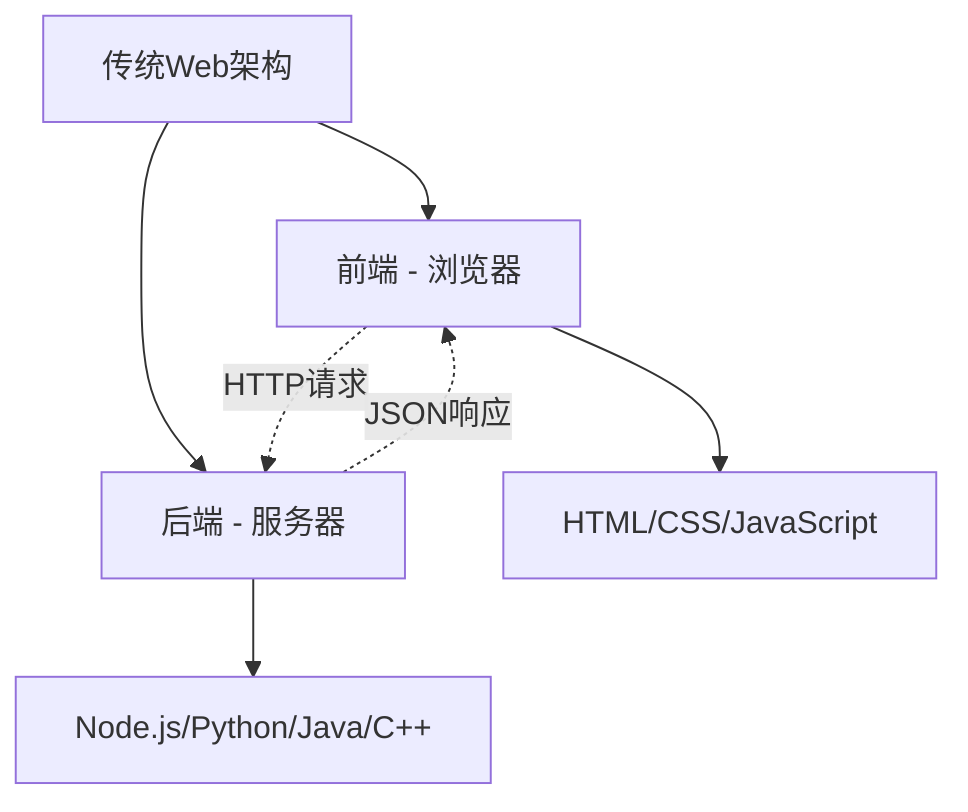
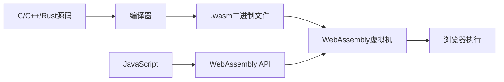
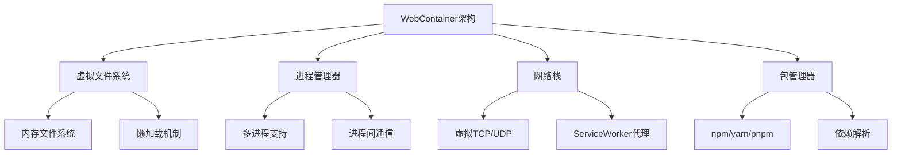

# 前言

传统上，后端代码只能在服务器环境中运行，而前端代码则局限于浏览器。然而，随着Web技术的快速发展，这种界限正在被打破。如今，我们可以在浏览器中直接运行Node.js应用、执行C/C++/Rust编译的代码，甚至搭建完整的开发环境。本文将深入探讨这一技术革命背后的核心技术：WebAssembly和WebContainer，揭示后端代码如何在浏览器中获得新生。

<!-- more -->

# 一、技术背景与发展历程

## （一）传统Web开发的局限性

### 1. 语言限制
在传统的Web开发模式中，浏览器只能执行JavaScript代码。这意味着：
- 其他编程语言无法直接在浏览器中运行
- 需要将其他语言的逻辑重写为JavaScript
- 性能密集型任务受到JavaScript引擎的限制

### 2. 环境隔离


### 3. 开发体验问题
- 前后端开发环境分离
- 代码共享困难
- 调试和测试复杂

## （二）技术演进的里程碑

### 1. asm.js时代（2013-2017）
```javascript
// asm.js示例：严格的JavaScript子集
function fib(n) {
    n = n|0;  // 类型注解，表示n是32位整数
    if ((n|0) <= 1) return n|0;
    return (fib((n-1)|0)|0) + (fib((n-2)|0)|0)|0;
}
```

**特点**：
- JavaScript的严格子集
- 提供接近原生的性能
- 编译时优化
- 兼容性好，但解析速度慢

### 2. WebAssembly诞生（2017-至今）
WebAssembly（简称WASM）的出现标志着Web技术的重大突破：
- 二进制格式，解析速度快20倍
- 接近原生性能
- 多语言支持
- 安全沙箱执行

### 3. WebContainer革命（2021-至今）
StackBlitz推出的WebContainer技术实现了在浏览器中运行完整的Node.js环境：
- 基于WebAssembly的操作系统
- 完整的文件系统和进程管理
- 毫秒级启动时间
- 离线工作能力

# 二、WebAssembly：多语言的浏览器执行引擎

## （一）WebAssembly核心概念

### 1. 什么是WebAssembly
WebAssembly是一种低级的类汇编语言，具有紧凑的二进制格式，可以在现代Web浏览器中以接近原生的速度运行。

```wat
;; WebAssembly文本格式示例
(module
  (func $add (param $a i32) (param $b i32) (result i32)
    local.get $a
    local.get $b
    i32.add)
  (export "add" (func $add))
)
```

### 2. 核心特性
- **高性能**：编译为机器码执行，性能接近原生
- **安全性**：运行在沙箱环境中，内存安全
- **可移植性**：跨平台，一次编译到处运行
- **语言无关**：支持C/C++、Rust、Go等多种语言

### 3. 架构模型


## （二）从C++到WebAssembly的完整流程

### 1. 编写C++代码
```cpp
// fibonacci.cpp
extern "C" {
    int fibonacci(int n) {
        if (n <= 1) return n;
        return fibonacci(n - 1) + fibonacci(n - 2);
    }
    
    // 数组处理示例
    void processArray(int* arr, int size) {
        for (int i = 0; i < size; i++) {
            arr[i] = arr[i] * 2;  // 将每个元素乘以2
        }
    }
}
```

### 2. 使用Emscripten编译
```bash
# 安装Emscripten工具链
git clone https://github.com/emscripten-core/emsdk.git
cd emsdk
./emsdk install latest
./emsdk activate latest

# 编译C++代码为WebAssembly
emcc fibonacci.cpp -Os -s WASM=1 -s MODULARIZE=1 \
     -s EXPORT_NAME="FibModule" \
     -s EXPORTED_FUNCTIONS="['_fibonacci', '_processArray']" \
     -s EXPORTED_RUNTIME_METHODS="['ccall', 'cwrap']" \
     -o fibonacci.js
```

### 3. 在JavaScript中使用
```javascript
// 加载WebAssembly模块
import FibModule from './fibonacci.js';

async function initWasm() {
    // 初始化WebAssembly模块
    const Module = await FibModule();
    
    // 包装C++函数为JavaScript函数
    const fibonacci = Module.cwrap('fibonacci', 'number', ['number']);
    const processArray = Module.cwrap('processArray', null, ['number', 'number']);
    
    // 调用斐波那契函数
    console.log('fibonacci(10):', fibonacci(10)); // 输出: 55
    
    // 处理数组数据
    const arraySize = 5;
    const dataPtr = Module._malloc(arraySize * 4); // 分配内存（4字节 * 5个整数）
    const dataHeap = new Int32Array(Module.HEAP32.buffer, dataPtr, arraySize);
    
    // 设置数组数据
    dataHeap.set([1, 2, 3, 4, 5]);
    console.log('处理前:', Array.from(dataHeap)); // [1, 2, 3, 4, 5]
    
    // 调用C++函数处理数组
    processArray(dataPtr, arraySize);
    console.log('处理后:', Array.from(dataHeap)); // [2, 4, 6, 8, 10]
    
    // 释放内存
    Module._free(dataPtr);
}

initWasm();
```

## （三）性能对比与优化

### 1. 性能基准测试
```javascript
// JavaScript实现
function fibJS(n) {
    if (n <= 1) return n;
    return fibJS(n - 1) + fibJS(n - 2);
}

// 性能测试
async function performanceTest() {
    const Module = await FibModule();
    const fibWasm = Module.cwrap('fibonacci', 'number', ['number']);
    
    const n = 40;
    
    // 测试JavaScript版本
    console.time('JavaScript');
    const resultJS = fibJS(n);
    console.timeEnd('JavaScript');
    
    // 测试WebAssembly版本
    console.time('WebAssembly');
    const resultWasm = fibWasm(n);
    console.timeEnd('WebAssembly');
    
    console.log('结果一致:', resultJS === resultWasm);
}

// 典型结果：
// JavaScript: ~1200ms
// WebAssembly: ~400ms
// 性能提升约3倍
```

### 2. 内存管理优化
```javascript
class WasmMemoryManager {
    constructor(module) {
        this.module = module;
        this.allocatedPointers = new Set();
    }
    
    // 安全的内存分配
    malloc(size) {
        const ptr = this.module._malloc(size);
        this.allocatedPointers.add(ptr);
        return ptr;
    }
    
    // 安全的内存释放
    free(ptr) {
        if (this.allocatedPointers.has(ptr)) {
            this.module._free(ptr);
            this.allocatedPointers.delete(ptr);
        }
    }
    
    // 批量释放所有分配的内存
    freeAll() {
        for (const ptr of this.allocatedPointers) {
            this.module._free(ptr);
        }
        this.allocatedPointers.clear();
    }
}
```

# 三、WebContainer：浏览器中的Node.js运行时

## （一）WebContainer技术原理

### 1. 核心架构
WebContainer是StackBlitz开发的革命性技术，它在浏览器中实现了一个完整的Node.js运行环境。



### 2. 关键技术组件

**虚拟文件系统**：
- 基于内存的文件系统实现
- 支持完整的POSIX文件操作
- 懒加载机制优化性能

**进程管理**：
- 多进程/多线程应用支持
- 进程间通信（IPC）
- POSIX兼容的shell环境

**网络虚拟化**：
- 虚拟TCP网络栈
- 映射到浏览器的ServiceWorker API
- 支持HTTP服务器和客户端

## （二）WebContainer实战应用

### 1. 快速开始
```javascript
import { WebContainer } from '@webcontainer/api';

// 启动WebContainer实例
const webcontainerInstance = await WebContainer.boot();

// 定义项目文件结构
const files = {
  'package.json': {
    file: {
      contents: JSON.stringify({
        name: 'my-app',
        type: 'module',
        dependencies: {
          express: '^4.18.0'
        },
        scripts: {
          start: 'node server.js'
        }
      })
    }
  },
  'server.js': {
    file: {
      contents: `
import express from 'express';

const app = express();
const port = 3000;

app.get('/', (req, res) => {
  res.json({ 
    message: 'Hello from WebContainer!',
    timestamp: new Date().toISOString()
  });
});

app.listen(port, () => {
  console.log(\`Server running at http://localhost:\${port}\`);
});
      `
    }
  }
};

// 挂载文件系统
await webcontainerInstance.mount(files);

// 安装依赖
const installProcess = await webcontainerInstance.spawn('npm', ['install']);
await installProcess.exit;

// 启动应用
const serverProcess = await webcontainerInstance.spawn('npm', ['start']);

// 监听服务器输出
serverProcess.output.pipeTo(new WritableStream({
  write(data) {
    console.log(data);
  }
}));
```

### 2. 文件系统操作
```javascript
// 读取文件
const packageJson = await webcontainerInstance.fs.readFile('package.json', 'utf-8');
console.log('package.json内容:', JSON.parse(packageJson));

// 写入文件
await webcontainerInstance.fs.writeFile('config.json', JSON.stringify({
  environment: 'development',
  debug: true
}));

// 创建目录
await webcontainerInstance.fs.mkdir('src', { recursive: true });

// 监听文件变化
webcontainerInstance.fs.watch('.', (eventType, filename) => {
  console.log(`文件 ${filename} 发生了 ${eventType} 事件`);
});
```

### 3. 进程管理
```javascript
// 执行shell命令
const lsProcess = await webcontainerInstance.spawn('ls', ['-la']);
lsProcess.output.pipeTo(new WritableStream({
  write(data) {
    console.log('ls输出:', data);
  }
}));

// 运行Node.js脚本
const nodeProcess = await webcontainerInstance.spawn('node', ['-e', 'console.log(process.version)']);
await nodeProcess.exit;

// 运行构建工具
const buildProcess = await webcontainerInstance.spawn('npm', ['run', 'build']);
buildProcess.output.pipeTo(new WritableStream({
  write(data) {
    document.getElementById('build-output').textContent += data;
  }
}));
```

## （三）WebContainer vs 传统开发环境

### 1. 性能对比

| 特性 | 传统环境 | WebContainer |
|------|----------|--------------|
| 启动时间 | 10-30秒 | 毫秒级 |
| 内存占用 | 500MB-2GB | 50-200MB |
| 网络延迟 | 有 | 无（本地执行） |
| 离线能力 | 有限 | 完全支持 |
| 安全性 | 依赖系统 | 浏览器沙箱 |

### 2. 开发体验优势
```javascript
// 实时协作示例
class CollaborativeEditor {
  constructor(webcontainer) {
    this.webcontainer = webcontainer;
    this.setupFileWatcher();
  }
  
  // 监听文件变化并同步
  setupFileWatcher() {
    this.webcontainer.fs.watch('.', async (eventType, filename) => {
      if (eventType === 'change') {
        const content = await this.webcontainer.fs.readFile(filename, 'utf-8');
        // 通过WebSocket同步到其他协作者
        this.broadcastChange(filename, content);
      }
    });
  }
  
  // 接收远程变更
  async applyRemoteChange(filename, content) {
    await this.webcontainer.fs.writeFile(filename, content);
    // 触发热重载
    this.triggerHotReload();
  }
  
  triggerHotReload() {
    // WebContainer支持热重载，无需重启服务器
    console.log('应用已自动更新');
  }
}
```

# 四、实际应用场景与案例

## （一）在线IDE与代码编辑器

### 1. StackBlitz：Web开发的革命
StackBlitz利用WebContainer技术创建了一个完全在浏览器中运行的IDE：

```javascript
// StackBlitz项目配置示例
const stackblitzConfig = {
  files: {
    'src/App.jsx': `
import React, { useState, useEffect } from 'react';
import './App.css';

function App() {
  const [data, setData] = useState(null);
  
  useEffect(() => {
    // 在WebContainer中运行的API调用
    fetch('/api/data')
      .then(res => res.json())
      .then(setData);
  }, []);
  
  return (
    <div className="App">
      <h1>在浏览器中运行的React应用</h1>
      {data && <pre>{JSON.stringify(data, null, 2)}</pre>}
    </div>
  );
}

export default App;
    `,
    'api/data.js': `
// Express API路由，完全在浏览器中运行
export default function handler(req, res) {
  res.json({
    message: '这个API运行在浏览器的WebContainer中！',
    timestamp: new Date().toISOString(),
    userAgent: req.headers['user-agent']
  });
}
    `
  },
  template: 'react',
  dependencies: {
    'react': '^18.0.0',
    'react-dom': '^18.0.0'
  }
};
```

### 2. 教育平台应用
```javascript
// 在线编程教学平台
class CodingTutorial {
  constructor() {
    this.webcontainer = null;
    this.currentLesson = 0;
  }
  
  async initializeLesson(lessonConfig) {
    // 为每个课程创建独立的WebContainer环境
    this.webcontainer = await WebContainer.boot();
    
    // 加载课程文件
    await this.webcontainer.mount(lessonConfig.files);
    
    // 安装依赖
    if (lessonConfig.dependencies) {
      const installProcess = await this.webcontainer.spawn('npm', ['install']);
      await installProcess.exit;
    }
    
    // 运行初始化脚本
    if (lessonConfig.setup) {
      await this.runScript(lessonConfig.setup);
    }
  }
  
  async runStudentCode(code) {
    // 将学生代码写入文件
    await this.webcontainer.fs.writeFile('student-solution.js', code);
    
    // 运行测试
    const testProcess = await this.webcontainer.spawn('npm', ['test']);
    
    return new Promise((resolve) => {
      let output = '';
      testProcess.output.pipeTo(new WritableStream({
        write(data) {
          output += data;
        },
        close() {
          resolve(this.parseTestResults(output));
        }
      }));
    });
  }
  
  parseTestResults(output) {
    // 解析测试结果，提供即时反馈
    const passed = output.includes('All tests passed');
    const errors = output.match(/Error: .+/g) || [];
    
    return {
      success: passed,
      errors: errors,
      feedback: this.generateFeedback(passed, errors)
    };
  }
}
```

## （二）原型开发与演示

### 1. 快速原型验证
```javascript
// 快速创建全栈原型
async function createPrototype(idea) {
  const webcontainer = await WebContainer.boot();
  
  // 根据想法自动生成项目结构
  const projectFiles = await generateProjectStructure(idea);
  await webcontainer.mount(projectFiles);
  
  // 安装依赖并启动
  await webcontainer.spawn('npm', ['install']);
  const serverProcess = await webcontainer.spawn('npm', ['start']);
  
  // 获取预览URL
  const previewUrl = await webcontainer.getPreviewUrl();
  
  return {
    container: webcontainer,
    previewUrl: previewUrl,
    process: serverProcess
  };
}

// 使用示例
const prototype = await createPrototype({
  type: 'e-commerce',
  features: ['product-catalog', 'shopping-cart', 'user-auth'],
  database: 'sqlite',
  frontend: 'react'
});

console.log('原型已就绪:', prototype.previewUrl);
```

### 2. API文档交互式示例
```javascript
// 为API文档创建可执行示例
class InteractiveAPIDoc {
  constructor(apiSpec) {
    this.apiSpec = apiSpec;
    this.webcontainer = null;
  }
  
  async setupMockServer() {
    this.webcontainer = await WebContainer.boot();
    
    // 根据API规范生成mock服务器
    const mockServerCode = this.generateMockServer(this.apiSpec);
    
    await this.webcontainer.mount({
      'server.js': { file: { contents: mockServerCode } },
      'package.json': { 
        file: { 
          contents: JSON.stringify({
            dependencies: { express: '^4.18.0', cors: '^2.8.5' }
          })
        }
      }
    });
    
    await this.webcontainer.spawn('npm', ['install']);
    await this.webcontainer.spawn('node', ['server.js']);
  }
  
  generateMockServer(apiSpec) {
    return `
import express from 'express';
import cors from 'cors';

const app = express();
app.use(cors());
app.use(express.json());

${apiSpec.endpoints.map(endpoint => `
app.${endpoint.method.toLowerCase()}('${endpoint.path}', (req, res) => {
  // 模拟响应数据
  res.json(${JSON.stringify(endpoint.mockResponse)});
});
`).join('\n')}

app.listen(3000, () => {
  console.log('Mock API server running on port 3000');
});
    `;
  }
}
```

# 五、技术优势与挑战

## （一）技术优势

### 1. 开发效率提升
- **零配置启动**：无需本地环境搭建
- **即时分享**：通过URL直接分享项目
- **版本一致性**：避免"在我机器上能跑"的问题
- **协作便利**：实时多人协作编程

### 2. 性能与安全
- **沙箱隔离**：代码运行在安全的浏览器环境中
- **资源控制**：精确控制内存和CPU使用
- **网络安全**：虚拟网络栈，避免端口冲突
- **数据保护**：敏感数据不离开浏览器

### 3. 成本效益
- **服务器成本**：减少云服务器资源消耗
- **扩展性**：利用用户设备的计算能力
- **维护成本**：减少环境维护工作量

## （二）技术挑战

### 1. 性能限制
```javascript
// 性能监控示例
class PerformanceMonitor {
  constructor(webcontainer) {
    this.webcontainer = webcontainer;
    this.metrics = {
      memoryUsage: [],
      cpuUsage: [],
      networkLatency: []
    };
  }
  
  startMonitoring() {
    setInterval(() => {
      // 监控内存使用
      const memInfo = performance.memory;
      this.metrics.memoryUsage.push({
        used: memInfo.usedJSHeapSize,
        total: memInfo.totalJSHeapSize,
        timestamp: Date.now()
      });
      
      // 检查是否需要优化
      if (memInfo.usedJSHeapSize > memInfo.totalJSHeapSize * 0.8) {
        this.triggerGarbageCollection();
      }
    }, 1000);
  }
  
  triggerGarbageCollection() {
    // 触发垃圾回收优化
    if (window.gc) {
      window.gc();
    }
  }
}
```

### 2. 兼容性问题
- **浏览器支持**：需要现代浏览器支持
- **API限制**：某些Node.js API无法完全模拟
- **文件系统**：虚拟文件系统的限制
- **网络访问**：跨域和安全策略限制

### 3. 调试复杂性
```javascript
// 增强调试能力
class WebContainerDebugger {
  constructor(webcontainer) {
    this.webcontainer = webcontainer;
    this.setupDebugHooks();
  }
  
  setupDebugHooks() {
    // 拦截console输出
    const originalConsole = console;
    console = new Proxy(originalConsole, {
      get(target, prop) {
        if (typeof target[prop] === 'function') {
          return function(...args) {
            // 记录调试信息
            this.logDebugInfo(prop, args);
            return target[prop].apply(target, args);
          }.bind(this);
        }
        return target[prop];
      }
    });
  }
  
  logDebugInfo(method, args) {
    // 发送调试信息到开发者工具
    window.postMessage({
      type: 'webcontainer-debug',
      method: method,
      args: args,
      timestamp: Date.now(),
      stack: new Error().stack
    }, '*');
  }
}
```

# 六、未来发展趋势

## （一）技术演进方向

### 1. WebAssembly的进化
- **WASI支持**：更好的系统接口支持
- **多线程**：SharedArrayBuffer和Web Workers集成
- **GC支持**：垃圾回收语言的更好支持
- **调试工具**：更完善的调试和分析工具

### 2. WebContainer生态扩展
- **多语言支持**：Python、Java、Go等运行时
- **数据库集成**：内置数据库支持
- **微服务架构**：容器编排和服务发现
- **边缘计算**：CDN边缘节点部署

## （二）应用场景拓展

### 1. 教育与培训
- **交互式教程**：实时代码执行和反馈
- **编程竞赛**：在线编程比赛平台
- **技能认证**：实际项目能力评估
- **远程教学**：分布式编程教学

### 2. 企业应用
- **代码审查**：可执行的代码审查环境
- **原型开发**：快速概念验证
- **客户演示**：实时产品演示
- **培训平台**：员工技能培训

### 3. 开源生态
- **文档示例**：可执行的API文档
- **项目演示**：GitHub项目在线试用
- **贡献工具**：降低开源贡献门槛
- **社区协作**：实时协作开发

# 七、总结与展望

## （一）技术价值总结

通过本文的深入分析，我们可以看到WebAssembly和WebContainer技术正在重新定义Web开发的边界：

### 1. 技术突破
- **性能革命**：接近原生的执行性能
- **语言多样性**：打破JavaScript的垄断
- **环境统一**：前后端开发环境的融合
- **安全增强**：沙箱执行的安全保障

### 2. 开发体验提升
- **即时启动**：毫秒级的开发环境创建
- **零配置**：无需复杂的环境搭建
- **实时协作**：多人同时编辑和调试
- **无缝分享**：通过URL即时分享项目

### 3. 商业价值
- **成本降低**：减少服务器和维护成本
- **效率提升**：加速开发和部署流程
- **用户体验**：更快的响应和更好的交互
- **创新机会**：新的产品和服务模式

## （二）发展前景展望

### 1. 短期发展（1-2年）
- WebAssembly标准的进一步完善
- 更多编程语言的WebAssembly支持
- WebContainer生态的扩展和优化
- 主流浏览器的全面支持

### 2. 中期发展（3-5年）
- 企业级应用的广泛采用
- 教育平台的深度集成
- 开发工具链的标准化
- 性能和功能的显著提升

### 3. 长期愿景（5-10年）
- Web成为通用计算平台
- 传统桌面应用的Web化迁移
- 边缘计算的深度融合
- 新一代Web操作系统的出现

## （三）学习建议

对于希望掌握这些前沿技术的开发者，笔者建议：

### 1. 基础知识储备
- 深入理解JavaScript和Web标准
- 学习C/C++或Rust等系统编程语言
- 掌握Node.js和现代前端框架
- 了解计算机系统和网络原理

### 2. 实践路径
- 从简单的WebAssembly示例开始
- 尝试使用WebContainer构建项目
- 参与开源项目的贡献
- 关注技术社区的最新动态

### 3. 持续学习
- 跟踪WebAssembly和WebContainer的发展
- 实验新的工具和框架
- 分享经验和最佳实践
- 思考技术的商业应用场景

## 参考资料

1. [WebAssembly官方文档](https://webassembly.org/)
2. [WebContainer API文档](https://webcontainers.io/)
3. [StackBlitz技术博客](https://blog.stackblitz.com/)
4. [Emscripten工具链文档](https://emscripten.org/)
5. [MDN WebAssembly指南](https://developer.mozilla.org/en-US/docs/WebAssembly)
6. [WASI规范文档](https://wasi.dev/)
7. [《WebAssembly权威指南》](https://www.oreilly.com/library/view/webassembly-the-definitive/9781492089834/)

---

> 💡 **相关阅读推荐**：
> - [【前端】前端框架全景图：现代Web开发技术栈详解](../前端/【前端】前端框架全景图：现代Web开发技术栈详解.md)
> - [【Node.js】Node.js深度解析：构建高性能的后端服务](../Node.js/【Node.js】Node.js深度解析：构建高性能的后端服务.md)
> - [【学习路线】Rust系统编程大师之路：从内存安全到高性能系统开发](../学习路线/【学习路线】Rust系统编程大师之路：从内存安全到高性能系统开发.md)

通过WebAssembly和WebContainer技术，我们正在见证Web平台向通用计算平台的转变。这不仅是技术的进步，更是开发模式和思维方式的革命。掌握这些技术，将为我们在未来的Web开发中提供强大的竞争优势。
