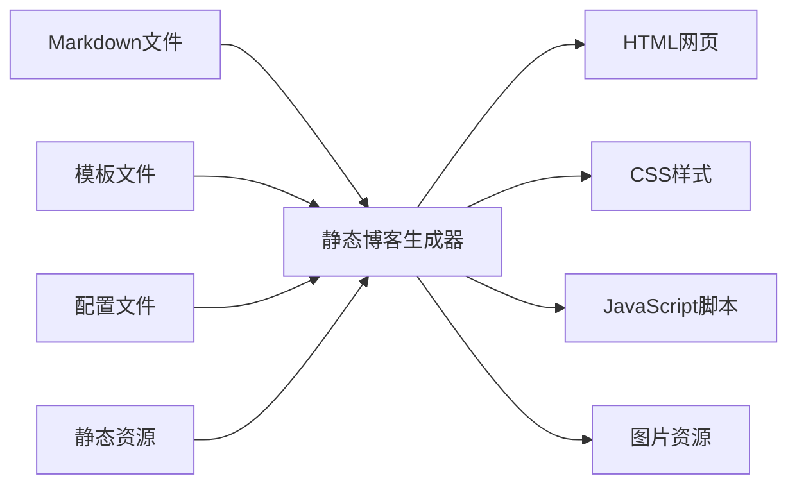

# 一、静态博客生成器概述

## （一）什么是静态博客生成器

静态博客生成器是一种将**Markdown文件**、**模板文件**和**配置文件**转换为**静态HTML网页**的工具。与传统的动态博客系统（如WordPress）不同，静态博客生成器在构建时就生成所有页面，无需数据库和服务器端脚本支持。



## （二）主流静态博客生成器对比

| 生成器 | 开发语言 | 特点 | 适用场景 |
|--------|----------|------|----------|
| **Hexo** | Node.js | 快速、插件丰富、中文友好 | 个人博客、技术文档 |
| **Jekyll** | Ruby | GitHub Pages原生支持 | GitHub托管博客 |
| **Hugo** | Go | 构建速度极快、功能强大 | 大型网站、企业博客 |
| **Gatsby** | React | 现代化、PWA支持 | 企业级网站 |
| **VuePress** | Vue.js | 文档友好、Vue生态 | 技术文档、API文档 |


**为什么选择静态博客？**
- ⚡ **性能优异**：无需数据库查询，加载速度快
- 🔒 **安全性高**：无服务器端漏洞风险
- 💰 **成本低廉**：可免费托管在GitHub Pages等平台
- 📝 **专注写作**：使用Markdown专注内容创作


# 二、Hexo工作原理深度解析

## （一）Hexo核心架构

Hexo采用**模块化架构**，主要包含以下核心组件：

```javascript
// Hexo核心架构示意
const Hexo = {
  // 核心引擎：负责整体流程控制
  core: {
    init: () => {},      // 初始化博客项目
    generate: () => {},  // 生成静态文件
    serve: () => {},     // 启动本地服务器
    deploy: () => {}     // 部署到远程服务器
  },
  
  // 渲染引擎：处理不同格式文件
  renderer: {
    markdown: () => {},  // Markdown渲染器
    ejs: () => {},       // EJS模板渲染器
    stylus: () => {},    // Stylus样式渲染器
    sass: () => {}       // Sass样式渲染器
  },
  
  // 插件系统：扩展功能
  plugins: {
    generator: [],       // 页面生成器插件
    processor: [],       // 文件处理器插件
    helper: [],          // 模板助手插件
    deployer: []         // 部署器插件
  }
};
```

## （二）文件处理流程

### 1. 源文件扫描与解析

```javascript
// 文件扫描过程（简化版）
class FileProcessor {
  scanSourceFiles() {
    const sourceDir = 'source/_posts';
    const files = fs.readdirSync(sourceDir);
    
    return files
      .filter(file => file.endsWith('.md'))  // 筛选Markdown文件
      .map(file => this.parseMarkdownFile(file));
  }
  
  parseMarkdownFile(filePath) {
    const content = fs.readFileSync(filePath, 'utf8');
    
    // 解析Front Matter（文章元数据）
    const { data: frontMatter, content: markdownContent } = matter(content);
    
    return {
      title: frontMatter.title,           // 文章标题
      date: frontMatter.date,             // 发布日期
      categories: frontMatter.categories, // 分类
      tags: frontMatter.tags,             // 标签
      content: markdownContent            // 正文内容
    };
  }
}
```

### 2. Markdown渲染过程

```javascript
// Markdown到HTML的转换过程
class MarkdownRenderer {
  constructor() {
    // 配置Markdown解析器
    this.marked = require('marked');
    this.highlightjs = require('highlight.js');
    
    // 设置代码高亮
    this.marked.setOptions({
      highlight: (code, language) => {
        if (language && this.highlightjs.getLanguage(language)) {
          return this.highlightjs.highlight(code, { language }).value;
        }
        return this.highlightjs.highlightAuto(code).value;
      },
      breaks: true,        // 支持换行
      gfm: true           // 支持GitHub风格Markdown
    });
  }
  
  render(markdownContent) {
    // 预处理：处理自定义语法
    const processedContent = this.preprocessCustomSyntax(markdownContent);
    
    // 转换为HTML
    const htmlContent = this.marked.parse(processedContent);
    
    // 后处理：添加自定义功能
    return this.postprocessHTML(htmlContent);
  }
  
  preprocessCustomSyntax(content) {
    // 处理Hexo特有的标签语法，如  
    return content.replace(
      /([\s\S]*?)/g,
      '<div class="note note-$1">$2</div>'
    );
  }
}
```

## （三）模板渲染系统

### 1. 模板引擎工作原理

```javascript
// EJS模板渲染示例
class TemplateRenderer {
  renderPost(postData, templatePath) {
    const template = fs.readFileSync(templatePath, 'utf8');
    
    // 准备模板变量
    const templateVars = {
      title: postData.title,
      content: postData.htmlContent,
      date: this.formatDate(postData.date),
      categories: postData.categories,
      tags: postData.tags,
      
      // 全局配置变量
      site: {
        title: this.config.title,
        url: this.config.url,
        author: this.config.author
      },
      
      // 模板助手函数
      helpers: {
        url_for: this.urlFor.bind(this),
        date: this.dateHelper.bind(this),
        truncate: this.truncateHelper.bind(this)
      }
    };
    
    // 渲染模板
    return ejs.render(template, templateVars);
  }
  
  // URL生成助手
  urlFor(path) {
    return `${this.config.root}${path}`.replace(/\/+/g, '/');
  }
  
  // 日期格式化助手
  dateHelper(date, format = 'YYYY-MM-DD') {
    return moment(date).format(format);
  }
}
```

### 2. 主题模板结构

```
themes/butterfly/
├── layout/                    # 布局模板目录
│   ├── _partial/             # 部分模板（组件）
│   │   ├── head.ejs         # 页面头部
│   │   ├── header.ejs       # 网站头部
│   │   ├── footer.ejs       # 网站底部
│   │   └── sidebar.ejs      # 侧边栏
│   ├── index.ejs            # 首页模板
│   ├── post.ejs             # 文章页模板
│   ├── page.ejs             # 独立页面模板
│   └── archive.ejs          # 归档页模板
├── source/                   # 静态资源目录
│   ├── css/                 # 样式文件
│   ├── js/                  # JavaScript文件
│   └── img/                 # 图片资源
└── _config.yml              # 主题配置文件
```

# 三、静态文件生成过程

## （一）页面生成器系统

```javascript
// 页面生成器核心逻辑
class PageGenerator {
  async generateAllPages() {
    // 1. 生成文章页面
    await this.generatePosts();
    
    // 2. 生成首页和分页
    await this.generateIndex();
    
    // 3. 生成归档页面
    await this.generateArchives();
    
    // 4. 生成分类和标签页面
    await this.generateCategories();
    await this.generateTags();
    
    // 5. 生成RSS和Sitemap
    await this.generateFeeds();
    await this.generateSitemap();
  }
  
  async generatePosts() {
    const posts = await this.loadAllPosts();
    
    for (const post of posts) {
      // 生成文章URL路径
      const permalink = this.generatePermalink(post);
      
      // 渲染文章页面
      const html = await this.renderTemplate('post', {
        post: post,
        prev: this.getPrevPost(post),
        next: this.getNextPost(post)
      });
      
      // 写入文件
      await this.writeFile(`public/${permalink}/index.html`, html);
    }
  }
  
  generatePermalink(post) {
    // 根据配置生成永久链接
    // 例如：:year/:month/:day/:title/
    const template = this.config.permalink;
    
    return template
      .replace(':year', post.date.getFullYear())
      .replace(':month', String(post.date.getMonth() + 1).padStart(2, '0'))
      .replace(':day', String(post.date.getDate()).padStart(2, '0'))
      .replace(':title', post.slug);
  }
}
```

## （二）资源处理与优化

```javascript
// 静态资源处理器
class AssetProcessor {
  async processAssets() {
    // 1. 处理CSS文件
    await this.processCSSFiles();
    
    // 2. 处理JavaScript文件
    await this.processJSFiles();
    
    // 3. 处理图片资源
    await this.processImages();
    
    // 4. 复制其他静态文件
    await this.copyStaticFiles();
  }
  
  async processCSSFiles() {
    const cssFiles = glob.sync('source/css/**/*.styl');
    
    for (const file of cssFiles) {
      // 编译Stylus到CSS
      const stylusContent = fs.readFileSync(file, 'utf8');
      const css = stylus.render(stylusContent);
      
      // 压缩CSS（生产环境）
      if (this.config.env === 'production') {
        css = this.minifyCSS(css);
      }
      
      // 输出到public目录
      const outputPath = file.replace('source/', 'public/').replace('.styl', '.css');
      fs.writeFileSync(outputPath, css);
    }
  }
  
  async processImages() {
    const images = glob.sync('source/img/**/*.{jpg,jpeg,png,gif,webp}');
    
    for (const image of images) {
      // 图片优化（可选）
      if (this.config.image_optimization) {
        await this.optimizeImage(image);
      }
      
      // 复制到public目录
      const outputPath = image.replace('source/', 'public/');
      fs.copyFileSync(image, outputPath);
    }
  }
}
```

# 四、高级功能实现原理

## （一）插件系统架构

```javascript
// Hexo插件系统核心
class PluginSystem {
  constructor(hexo) {
    this.hexo = hexo;
    this.plugins = new Map();
  }
  
  // 注册插件
  register(name, plugin) {
    this.plugins.set(name, plugin);
    
    // 根据插件类型注册到相应的钩子
    if (plugin.generator) {
      this.hexo.extend.generator.register(name, plugin.generator);
    }
    
    if (plugin.processor) {
      this.hexo.extend.processor.register(plugin.processor);
    }
    
    if (plugin.helper) {
      Object.keys(plugin.helper).forEach(helperName => {
        this.hexo.extend.helper.register(helperName, plugin.helper[helperName]);
      });
    }
  }
  
  // 执行插件钩子
  async executeHook(hookName, ...args) {
    for (const [name, plugin] of this.plugins) {
      if (plugin[hookName]) {
        await plugin[hookName].apply(plugin, args);
      }
    }
  }
}

// 插件示例：自动生成目录
const tocPlugin = {
  name: 'hexo-toc',
  
  // 处理器：在文章渲染前添加目录
  processor: {
    pattern: 'source/_posts/**/*.md',
    process: function(file) {
      if (file.content.includes('<!-- toc -->')) {
        const toc = this.generateTOC(file.content);
        file.content = file.content.replace('<!-- toc -->', toc);
      }
    }
  },
  
  // 生成目录的方法
  generateTOC(content) {
    const headings = content.match(/^#{1,6}\s+.+$/gm) || [];
    
    let toc = '<div class="toc">\n<ul>\n';
    
    headings.forEach(heading => {
      const level = heading.match(/^#+/)[0].length;
      const text = heading.replace(/^#+\s+/, '');
      const id = text.toLowerCase().replace(/\s+/g, '-');
      
      toc += `  <li class="toc-level-${level}">
        <a href="#${id}">${text}</a>
      </li>\n`;
    });
    
    toc += '</ul>\n</div>';
    return toc;
  }
};
```

## （二）实时预览服务器

```javascript
// 本地开发服务器实现
class DevServer {
  constructor(hexo) {
    this.hexo = hexo;
    this.app = express();
    this.watcher = null;
  }
  
  async start(port = 4000) {
    // 设置静态文件服务
    this.app.use(express.static('public'));
    
    // 设置文件监听
    this.setupFileWatcher();
    
    // 启动服务器
    this.server = this.app.listen(port, () => {
      console.log(`Hexo服务器运行在 http://localhost:${port}`);
    });
  }
  
  setupFileWatcher() {
    // 监听源文件变化
    this.watcher = chokidar.watch([
      'source/**/*',
      'themes/**/*',
      '_config.yml'
    ], {
      ignored: /node_modules/,
      persistent: true
    });
    
    // 文件变化时重新生成
    this.watcher.on('change', async (filePath) => {
      console.log(`文件变化: ${filePath}`);
      
      if (filePath.includes('_posts')) {
        // 只重新生成相关文章
        await this.regeneratePost(filePath);
      } else if (filePath.includes('themes')) {
        // 重新生成所有页面
        await this.hexo.generate();
      }
      
      // 通知浏览器刷新（WebSocket）
      this.notifyBrowserRefresh();
    });
  }
  
  // 浏览器自动刷新功能
  notifyBrowserRefresh() {
    if (this.wsServer) {
      this.wsServer.clients.forEach(client => {
        if (client.readyState === WebSocket.OPEN) {
          client.send(JSON.stringify({ type: 'reload' }));
        }
      });
    }
  }
}
```

# 五、性能优化策略

## （一）构建性能优化

```javascript
// 增量构建优化
class IncrementalBuilder {
  constructor() {
    this.cache = new Map();
    this.dependencies = new Map();
  }
  
  async build() {
    const changedFiles = await this.getChangedFiles();
    
    if (changedFiles.length === 0) {
      console.log('没有文件变化，跳过构建');
      return;
    }
    
    // 只处理变化的文件及其依赖
    const filesToProcess = this.getDependentFiles(changedFiles);
    
    for (const file of filesToProcess) {
      await this.processFile(file);
    }
  }
  
  async processFile(filePath) {
    const stats = fs.statSync(filePath);
    const cacheKey = `${filePath}:${stats.mtime.getTime()}`;
    
    // 检查缓存
    if (this.cache.has(cacheKey)) {
      return this.cache.get(cacheKey);
    }
    
    // 处理文件
    const result = await this.actuallyProcessFile(filePath);
    
    // 缓存结果
    this.cache.set(cacheKey, result);
    
    return result;
  }
}
```

## （二）输出优化

```javascript
// 资源压缩与优化
class AssetOptimizer {
  async optimize() {
    // 1. HTML压缩
    await this.minifyHTML();
    
    // 2. CSS压缩与合并
    await this.optimizeCSS();
    
    // 3. JavaScript压缩
    await this.optimizeJS();
    
    // 4. 图片优化
    await this.optimizeImages();
    
    // 5. 生成Service Worker
    await this.generateServiceWorker();
  }
  
  async minifyHTML() {
    const htmlFiles = glob.sync('public/**/*.html');
    
    for (const file of htmlFiles) {
      const html = fs.readFileSync(file, 'utf8');
      
      const minified = htmlMinifier.minify(html, {
        removeComments: true,           // 移除注释
        collapseWhitespace: true,       // 压缩空白字符
        removeEmptyAttributes: true,    // 移除空属性
        minifyCSS: true,               // 压缩内联CSS
        minifyJS: true                 // 压缩内联JavaScript
      });
      
      fs.writeFileSync(file, minified);
    }
  }
  
  async optimizeImages() {
    const images = glob.sync('public/img/**/*.{jpg,jpeg,png}');
    
    for (const image of images) {
      // 使用imagemin进行无损压缩
      const buffer = fs.readFileSync(image);
      
      const optimized = await imagemin.buffer(buffer, {
        plugins: [
          imageminJpegtran(),  // JPEG优化
          imageminPngquant()   // PNG优化
        ]
      });
      
      fs.writeFileSync(image, optimized);
    }
  }
}
```

# 六、部署与发布

## （一）自动化部署流程

```yaml
# GitHub Actions自动部署配置
name: Deploy Hexo Blog

on:
  push:
    branches: [ main ]

jobs:
  deploy:
    runs-on: ubuntu-latest
    
    steps:
    - name: 检出代码
      uses: actions/checkout@v3
      with:
        submodules: true
        
    - name: 设置Node.js环境
      uses: actions/setup-node@v3
      with:
        node-version: '18'
        cache: 'npm'
        
    - name: 安装依赖
      run: npm ci
      
    - name: 构建网站
      run: |
        npm run clean
        npm run build:prod
        
    - name: 部署到GitHub Pages
      uses: peaceiris/actions-gh-pages@v3
      with:
        github_token: ${{ secrets.GITHUB_TOKEN }}
        publish_dir: ./public
        cname: example.com
```

## （二）多平台部署支持

```javascript
// 部署器插件示例
const deployerGit = {
  name: 'git',
  
  async deploy(config) {
    const { repo, branch = 'gh-pages', message } = config;
    
    // 1. 初始化Git仓库
    await this.initGitRepo();
    
    // 2. 添加远程仓库
    await this.addRemote('origin', repo);
    
    // 3. 提交文件
    await this.commitFiles(message);
    
    // 4. 推送到远程分支
    await this.pushToBranch(branch);
  },
  
  async initGitRepo() {
    const git = simpleGit('public');
    
    if (!fs.existsSync('public/.git')) {
      await git.init();
    }
    
    return git;
  },
  
  async commitFiles(message) {
    const git = await this.initGitRepo();
    
    await git.add('.');
    await git.commit(message || `Site updated: ${new Date().toISOString()}`);
  }
};
```

---

## 参考资料

1. [Hexo官方文档](https://hexo.io/docs/)
2. [Hexo博客搭建和使用 - 博客园](https://www.cnblogs.com/jijunhao/p/16972920.html)
3. [从零开始编写自己的主题 - CSDN](https://blog.csdn.net/smileyan9/article/details/124268248)
4. [静态站点生成器概述 - 腾讯云](https://cloud.tencent.com/developer/article/1769731)
5. [Node.js官方文档](https://nodejs.org/docs/)


**总结**
静态博客生成器通过将Markdown文件转换为HTML网页，实现了高性能、安全且易维护的博客系统。Hexo作为其中的佼佼者，凭借其强大的插件系统、灵活的主题机制和优秀的性能表现，成为了技术博客的首选方案。

