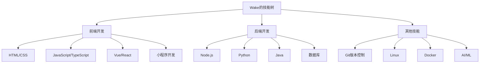

## 个人简介

你好，我是Wake，一名热爱技术的开发者。

我专注于以下技术领域：
- Web前端开发
- 后端开发
- 移动应用开发
- 人工智能与机器学习

## 技能树

## 学习历程

我一直坚信"学无止境"的理念，持续学习新技术和提升自己的能力。

## 博客初衷

创建这个博客的目的是：
1. 记录学习过程中的心得体会
2. 分享技术经验和解决方案
3. 结交志同道合的朋友
4. 帮助他人解决技术问题

> 分享是最好的学习方式，教是最好的学。

## 联系我

如果你有任何问题或想法，欢迎通过以下方式联系我：

- 邮箱：wakemeup2025@126.com
- GitHub：[uwakeme](https://github.com/uwakeme)
- 微信公众号：扫描下方二维码

感谢你访问我的博客！希望这里的内容对你有所帮助。
